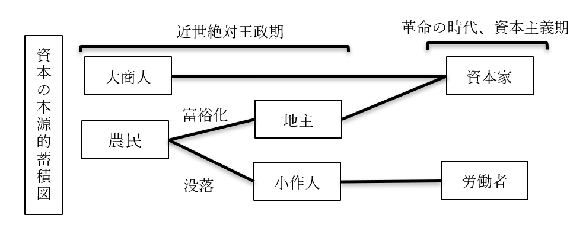
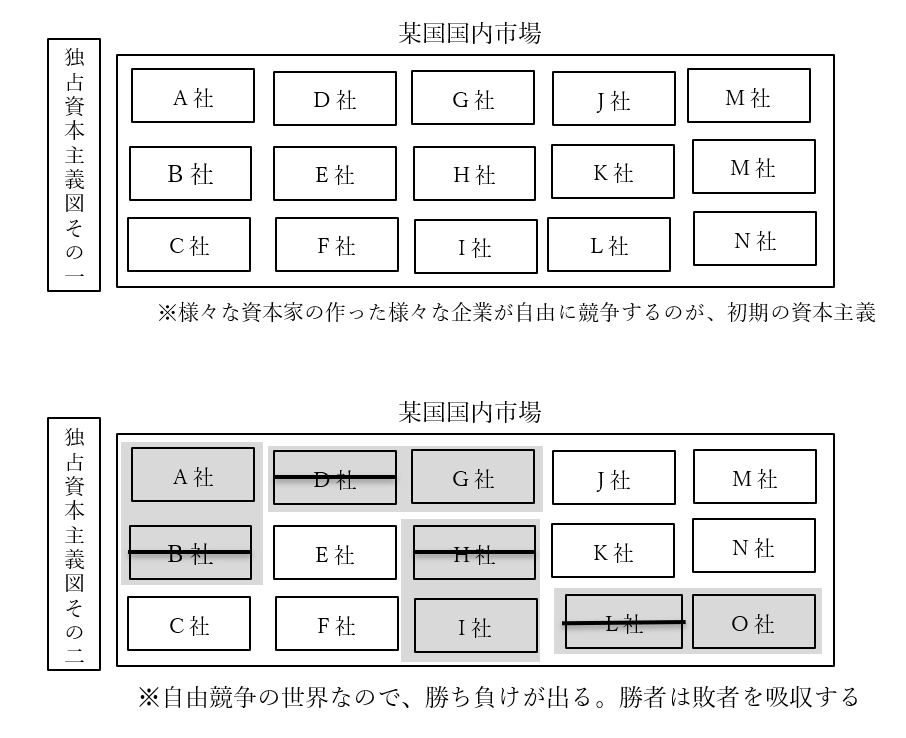
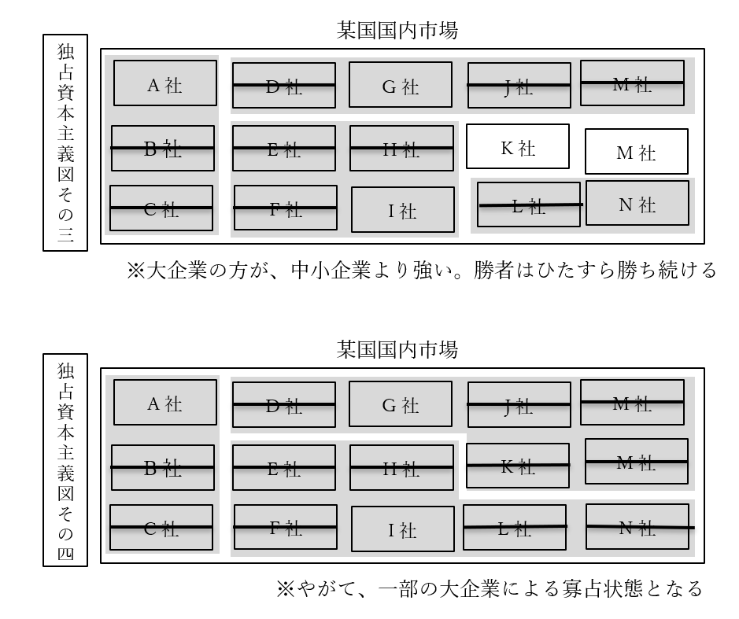
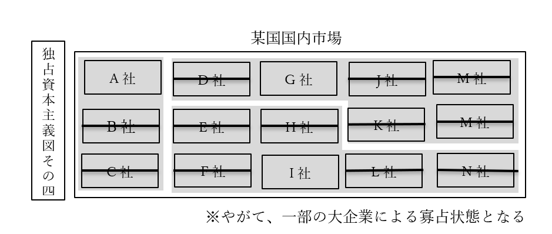

# 資本主義
## ●資本主義とは  
### ○資本主義の基本  
・本節ではまず、誕生した直後の資本主義を例にして、資本主義とは何かを見ていく  
・資本主義は、【産業革命】と市民革命のあった、革命の時代に発生した  
⇒十八世紀以前。名誉革命、アメリカ独立戦争、フランス革命といった革命が続いた、革命の時代。自由権が重視された時代。資本家が時代をリードし、資本家の「もっと自由に金儲けさせろ」が最大限尊重された時代。この時期に、資本主義が完成する。この時期の資本主義を、例に採る  
  
・一般的に、資本主義経済とは、以下のように定義される  
定義：【生産手段】の【私有】を認めるという意味での【私有財産制】を認める経済  
・生産手段とは、商品を生産する為の手段。工場、機械、土地など  
※一般的には、私有財産制と言ったら財産の私有（個人による所有）を認めるもの。但しこの場合は、生産手段の私有を認める、という意味で使われている、という事  
  
・この時期に儲けるとしたら、工場の機械を動かして商品を生産し、それを売るのが基本  
・この工場とか機械を持っているのが、金持ち。いわゆる【資本家（ブルジョワジー）】  
・金持ちでない一般人は、こういう生産手段を持っていない。いわゆる【労働者（プロレタリアート）】  
  
・生産手段（工場とか機械）は、持ってるだけじゃ意味がない  
・動かして、商品を生産しなければ意味がない  
・資本家一人で工場の機械全部動かす訳にもいかない  
・そこで、労働者に工場で働いて貰う。代わりに資本家は、労働者に金を払う  
⇒つまり、資本家は［生産手段］を提供し、労働者は［労働力］を提供するという関係になる  
  
|                      |                                              |                                                        |  
|----------------------|----------------------------------------------|--------------------------------------------------------|  
|                      |資本家                                        |労働者                                                  |  
|生産手段              |持っている                                    |持っていない                                            |  
|労使関係              |労働者に、工場で機械を使わせる労働者に金を払う|資本家の工場で、資本家の機械を使う労働力を提供する      |  
|本音                  |労働者に金払いたくない労働者を長時間働かせたい|資本家は俺達にもっと金を払え。資本家は俺達をもっと休ませろ|  
  
  
  
### ○資本主義の誕生  
  
・十八世紀をはじめとする革命の時代に、資本主義経済は誕生した  
・誕生したばかりの頃の資本主義は、［産業資本主義］などと呼ばれる  
  
・革命の時代以前の工業は、［手工業］だった  
⇒代表が［工場制手工業（マニュファクチュア）］。工場に人を集めて手作りする  
・革命の時代に産業革命が発生し、機械で大量生産できるようになった  
⇒工場制手工業から、［工場制機械工業］へ進化した  
・ここから、工場に労働者と機械を集めて大量生産し、儲ける産業資本家が登場した  
・この産業資本家が中心となって経済を回すのが［産業資本主義］である  
  
・ところで、いつの世にも金持ちはいるから、資本家の存在は分かるだろう  
・問題は労働者。労働者はどこから来たのか？  
・と言うのは、一般に中世とか近世の庶民というと、農民を思い起こす筈である  
・そして農民というのは普通、自分の土地を耕して農業をしている  
⇒つまり農民は普通、「自分の土地」という生産手段を持っている  
・生産手段を持たない労働者。彼らは何処から来たのか？  
  
・実は彼らは、没落した農民が主である  
・近世の欧州は、農民の間で格差の拡大が進行した時代でもある  
・その格差拡大の中で、没落した（貧乏になった）農民は自分の土地を失い、小作人となっていった  
⇒自分の土地を持たず、他人の土地を借りて耕している農民  
・こういう没落農民達が、工場に集まって賃金労働者になっていくのである  
・逆に、没落しなかった農民は地主等の富裕層となり、やがて産業資本家となっていく  
⇒言ってみれば、近世に農民内で貧富の格差が拡大した事によって、資本主義経済に必須の「資本家」と「労働者」が揃った、とも言える。こういう、資本主義の前提が揃う動きの事を［資本の本源的蓄積］と呼ぶ事がある  
※ただ、最近は「これ貧富の格差が拡大してどうこうじゃなくて、農業技術が進んで農作物が沢山取れるようになって人口が増えて、その増えた人達が工場労働者になっただけじゃない？」みたいな説が出てきています。産業革命発祥の地イギリスなんかでは、これが有力です  
  

  
  
### ○利潤追求  
・資本主義経済はまた、（特に資本家による）【利潤の追求】を認める体制である  
  
・ある生産設備で生産が繰り返される事を【再生産】と言う  
・ところで、商品が売れれば売れるほど、資本家は儲かる  
・資本家は普通、利潤を追求する（利益を増やそうとする）ので、商品を大量に生産しようとする  
・つまり、資本主義経済では【拡大再生産】が基本となる  
⇒工場で商品を生産する。それで儲かる。儲かったら、更に儲ける為に工場や機械を増やす。また工場で商品を生産する。また儲かる。儲かったら…と繰り返す  
  
・では、民間の資本家が拡大再生産している間、政府は何をするか  
・この時期の政府の経済政策は【自由放任（レッセ・フェール）】が基本となる  
⇒この時期は、「俺達にもっと自由に金儲けさせろ」という自由権が重視された時代。故にこの時期の政府の理想は【夜警国家】。国防とか治安維持みたいな最低限の事しかしない、小さな政府。政府が何もせず、市場の資本家が自由に競争すれば、【「神の見えざる手に導かれて」】経済は発展する（【『国富論』】の【アダム・スミス】）という考え方が、この時代の経済観  
  
・つまるところ、資本主義経済に於いては、経済は［無計画］経済である  
・言い方を変えれば、資本主義経済は［無政府］性を持つ  
・無計画である以上、需要と供給が一致しない事態は起こり得る  
・当然、過剰供給による売れ残りや、それによる企業の業績悪化、倒産等も起こり得る  
・ひいては、「好景気⇒不況⇒回復期⇒好景気…」みたいな【景気変動（景気循環）】も避けられない  
・また、不況が避けられない以上、【失業者】の発生も避けられない  
  
## ●資本主義の修正  
・資本主義の誕生は既に見たので、その後資本主義がどう変わっていったかを見ていく  
  
  
### ○十九世紀後半～二十世紀初頭  
・次の諸図で説明するような事態が進行していった  
  

  
  
・資本主義経済に於ける競争というのは、カネを多く持っている方が強い  
・また産業資本主義は、利潤追求を肯定し、政府は介入せず自由競争に任せる  
・この二つの合わせ技が問題だった  
  
・カネを多く持っている方が強いので、勝者となった大企業はそのまま勝ち続ける  
・しかも自由放任で政府が介入しないので、弱い企業の救済策や逆転要素も特にない  
・結果、勝ち続けた少数の企業が、経済を支配するようになってしまうのである  
  
・こうした、企業が巨大化していく流れを［資本の集積］［資本の集中］などと言う  
⇒ある一社が利潤を追求した結果巨大化するのを資本の集積という。そうやって巨大化した、少数の巨大企業が結託するのを資本の集中という。［カルテル］、［トラスト］、［コンツェルン］などと呼ばれるのは後者  
・また、少数の巨大企業によって支配される資本主義を、［独占資本主義］と言う  
・一方、経済を支配する少数の巨大企業については、［独占資本］と言う  
  
・ちなみに十九世紀後半～二十世紀初頭は、［植民地］獲得競争が盛んに行われた時期でもある  
⇒こういう、植民地を獲得するべく他国を征服したり、戦争したりするのを［帝国主義］という  
・この時期の植民地獲得競争は、［独占資本］によって主導された面もある  
⇒この頃になると、独占資本が更なる拡大再生産を行っても、もう国内には商品が行き渡り切っていて売上が増えない、という状況になっていた。そこで、他国の領地を切り取って植民地とし、増産した商品を植民地の住人に売りつけて儲けようとしたのである  
※勿論、この時期に植民地獲得競争が行われたのはこれだけが原因ではなく、「植民地」の名前の通り、増えすぎた人口を植民させる土地を求めてのものでもある。第二次世界大戦ぐらいまでは、欧米列強の先進国でさえ、ちょっと人口が増えすぎるとすぐ飢饉になる危険と隣り合わせであった。1940年代から1960年代にかけて起こった緑の革命が終わる事で、ようやく「先進国では普通、飢饉は起きない」になったのである。故に世界大戦以前の世界では、各国は、増えすぎた人口を植民させる土地を求めたのである。大日本帝国が満洲を取ろうとしたのにも、ドイツ国が東へ拡大しようとしたのにも、そういう意味がある  
  
・尚、独占資本主義期末期の1917年、社会主義革命によってソ連が誕生している  
  
### ○1930年代～1980年代  
・独占資本主義は、1920年代には絶頂期を謳歌した  
・特にアメリカ合衆国は、今でもアメリカの黄金時代と語り継がれる黄金の20年代を楽しんだ  
・が、その絶頂期は唐突に終わる。1929年の世界恐慌である  
  
  

  
  
・先に、独占資本主義は↑こういう風に、少数の巨大企業による寡占状態と述べた  
・これ、悪いところが沢山あるが、一番まずいのは「一社でも傾いたらヤバい」という事である  
※他の悪いところは、『市場の失敗』でやります  
  
・「一社でも傾いたらヤバい」とはどういう事か？  
・例えば先の図で言えば、G社でもI社でもいいが、傾いて大リストラを断行したらどうなるか？  
・物凄い数の失業者が出る。その上、再就職先は殆ど無いのである。それだけで大不況は不可避になる  
・これがもし、A社もG社もI社も、一斉に傾いたらどうなるか？  
・それが現実に起き、しかも世界規模でドミノ倒しとなったのが、世界恐慌である  
  
・ここにきて、産業資本主義以来の【自由放任】はマズいという話になる  
⇒「景気変動は避けられないものだから不況ってのは必ず来るし、仕方ない」「放っておけば勝手に回復期に入って、また好景気になる」等とは言っていられないほどの大不況になった  
※例えば、ドイツ国では通貨の価値が完全に破壊され、パンを買うにもトランクいっぱいの紙幣が必要になるほどであった。これで「仕方ない」「ほっとけばまたよくなる」とか言えるのは異常者ぐらいである  
  
・本来自由放任を旨とした資本主義は、この挫折を機に【修正資本主義】となっていく  
・【福祉国家】的な【大きな政府】路線が、世界のトレンドとなる  
⇒産業資本主義以来の保守的（自由主義的）な理想は、【夜警国家】を理想とする【小さな政府】路線。またこの辺りから、【自由権】を制限して【社会権】を重視しよう、という流れも強くなっていく  
※勿論、世界恐慌とは別に、当時既にソ連が誕生していた、というのも福祉国家・大きな政府路線を後押しした。「労働者を虐め過ぎると革命が起きる」という感覚が、大企業の自由を制限して社会権を重視しよう、という意識を生んだ  
  
  
・修正資本主義下の大きな政府に於いては、政府が市場に介入し、景気を上向かせる政策を行う  
・このように、計画を立てて経済に介入する事を【経済計画】という  
・主なところではやはり、公共事業  
⇒国が金を出して高速道路を作る、ダムを作る、競技場を作る等々  
・こういう政策に理論を提供したのがジョン・メイナード・【ケインズ】  
⇒政府が市場に介入して公共事業等で経済を活性化させよう、と考える事を【ケインズ主義】と呼ぶ  
※必ず公共事業でなければならない訳ではない。要は「不況なんだから仕事がなくて当然、仕事がなきゃ労働者の懐には給料が入らない、給料がなければ人々はカネを使わない、カネが使われないのであれば企業の商品は売れない、だから余計に不況が酷くなる」「だから、政府が労働者の仕事を提供してやれ」という話。故に公務員を増やすとかでも構わないのだが、普通、「政府が労働者の仕事を提供」すると言うと公共事業の増加に行き着く。なのでこの後の話でも、代表例として公共事業を挙げ続けます  
  
・著名な例として、アメリカ合衆国の【ニューディール政策】がある  
※実施したのは大統領【フランクリン・Ｄ・ルーズベルト】。米国が第二次世界大戦へ参戦した時の大統領でもあり、ソ連が大好きな大統領でもあり、第二次大戦末期に死んだ後米ソ関係が急速に悪化した、あの大統領である  
・この政策では、政府が金を出して［テネシー河］にダムを作る等の公共事業を実施した  
・世界恐慌で大量に出た失業者が、この公共事業関連会社に就職した  
⇒失業者が多ければ不景気になるし、失業者が少なければ不景気から回復する  
※実際には、ニューディール政策は世界経済のみならず米国経済を復活させるにも不充分だった。大きな政府路線による、政府が市場に介入して不況から回復させる政策には、カネを大量に、ドバドバと注ぎ込む必要がある。ここで尻込みして投入するカネを惜しむと、「効果はあるにはあったけど結局不況のままですよね」になる。これはニューディール政策でも、現代日本の第二次安倍政権によるアベノミクス政策でも変わらない。実際、ニューディール政策は不充分だった為、米国経済が本格的に復活したのは第二次世界大戦参戦後である。「戦争だから」という大義名分を得てカネを市場にドバドバ突っ込んだ結果、米国経済は完全に復活した  
  
・尚、ニューディール政策はダム建設ばかりが注目されるが、実際には他にもやっている  
・特に、［社会保障］法を制定したのは重要と言える  
⇒何せ米国は伝統的に自由権重視で、今でも社会保障が死ぬほど貧弱である。そんな伝統を持つ米国で、例えば［ワグナー法］のような労働者保護法が制定された。それほどまでに、世界恐慌後の混乱は凄かった  
※ちなみに、2008年のリーマンショックに端を発した世界的な不況に際して、当時のオバマ大統領は、［グリーン・ニューディール政策］というのをやっている。名前は勿論、ルーズベルトのニューディール政策から引っ張ってきている  
  
### ○1980年代～現在  
～ここから引用～  
・冷戦という、資本主義＆自由主義国家vs共産主義＆全体主義国家の対立がこの頃、終わる  
⇒「金持ち殺しましょうよ」攻勢がなくなり、「労働者を虐め過ぎたら革命になる」という恐怖が薄まった  
・また、福祉国家の行う公共事業というのは、要するにバラマキという側面がある  
・不況の時は、国民が皆、仕事がなくて金もないという状況なので当然バラマキが必要  
・一方で、好景気でも不況と同じ調子で金をバラマキ続けると【財政赤字】が積もる  
・また、長くバラマキ続けると、政府と業者の癒着等も起こってくる  
  
・こうして、【財政赤字解消、政治腐敗の防止】等を目的に、また、革命の恐怖がなくなった事も背景に、再び【自由権】を重視した【小さな政府路線】へ向かう  
例：日本の【中曽根】首相、アメリカの【レーガン】大統領、イギリスの【サッチャー】首相ら  
※これがいわゆる、［新保守主義（ネオコンサバティズム）］と［新自由主義（ネオリベラリズム）］による現代的な国家  
～ここまで引用～  
  
・要するに、修正資本主義（もしくはケインズ主義）には大きく二つの柱があった  
１：ソ連の存在。「労働者を虐め過ぎると革命が起こる」という恐怖  
２：不況の存在とその解消  
  
・が、1980年代ごろには、修正資本主義をもってしても経済が伸び悩むようになる  
⇒実を言うと、この時経済が伸び悩むようになった理由は、今となってもよく分かっていない。この辺の話はまた後でするので、今は↓のように解釈するといい  
⇒「修正資本主義の公共事業とかは、言ってみれば不況対策。不況でもないのにずーっとやっていれば、それはおかしくなるに決まっている」  
※実際、修正資本主義の元になったケインズ自身は、「好景気になったら増税して公共事業も減らせ」と言っている。だが多くの国は、好景気になっても公共事業をやり続けたし、増税もしなかった  
  
・ここから、【反ケインズ主義】が力を持つようになる  
⇒政治的な反ケインズ主義が新保守主義、経済的な反ケインズ主義が新自由主義、と考えてもいい。かつての産業資本主義の時代のように、政府は市場に介入せず、「神の見えざる手」に任せるのがいい、とする立場が力をつけた  
・また、1990年代ソ連自体が消滅し、革命の恐怖も消えた  
・こうして、再び時代は【小さな政府】路線へ向かう  
  
・例えば日本国で、この小さな政府路線を決定的にしたのは【小泉純一郎】政権である  
・この時期、【郵政民営化】に代表される［特殊法人］の統廃合、民営化が大々的に推進された  
・また、【規制緩和】によって、自由な競争を奨励した  
  
  
・そして令和二年現在  
・産業資本主義～独占資本主義の時期にあったような問題が、再び起こるようになっている  
⇒それこそ、「独占資本主義かな？」というぐらい中小企業が淘汰され、大企業による独占市場が様々な業種で誕生している。GAFA(Google/Apple/Facebook/Amazon)という単語は、まさに現代が独占資本主義の状態にある事を証明しているものとも言える  
  
・では、具体的にどのような問題が起こってきているか。日本を例に採ろう  
・例えば規制緩和により、極めて制限された形でしか使えなかった派遣社員が大々的に使えるようになった  
・資本家からしてみれば、正社員より派遣社員の方がいい  
⇒正社員は給料も高いし、いつでもクビにできる訳でもない。一方派遣社員は非正規雇用なので給料が安く済み、いつでもクビにできる。だから資本家は正社員を採用しなくなり、派遣社員ばかり使うようになった。こうして、誰も彼もが派遣社員に、非正規雇用になり、いつクビを切られるか分からない低賃金労働に従事せざるを得なくなった  
  
・更には、資本家はカネのかかる日本人を雇いたくないとすら考えるようになる  
⇒移民の推進を政治家に働きかけたり、工場を海外に移したり。また、外国人技能実習生（その名の通り、外国人の実習生）を実質的な奴隷労働者としてこき使っている企業もある。こうして、一般日本人はどんどん貧乏になっていき、ごく一部の資本家だけが金持ちになっていく  
  
・当然、こうなると、反新自由主義や「また修正資本主義にしよう」という動きが出てくる  
・米国の例だが、トランプ政権誕生などは、その実例と言える  
⇒トランプ政権の方針の一つが、「アウトソーシングをやめろ、賃金の安い国に外注するな。アメリカに工場作ってアメリカ人を雇い、アメリカでモノを作れ」である。まさしく反自由主義  
  
～ここから雑談～  
　「同じ話を繰り返してるなこいつら」と思ったと思います。  
　ぶっちゃけた話、経済政策なんて「上り調子の時はほっとく」「好景気の時は、調子に乗り過ぎて世界恐慌みたいな事にならないような政策をする」「不景気の時は、景気が上向くような政策をする」でいいんですよね。  
　なのに、「自由放任の自由主義経済こそいついかなる時も最高だ！」「いや、公共事業でバリバリ雇用を生み出す政策こそいついかなる時も最高だ！」みたいな事をやるから、こういう事になる。  
～ここまで雑談～  
  
## ○資本主義の理論  
・資本主義の経済理論について、時系列順に見ていく  
・尚、資本主義以前の経済理論についても取り扱う  
  
  
### ○資本主義以前  
・近世絶対王政期の欧州経済は、基本的に【重商主義】経済だった  
・重商主義と言っても多種多様だが、共通して「国が商工業を支援する」類の経済である  
・重商主義を唱えた有名人から一人挙げるなら、イングランド王国の【トーマス・マン】  
⇒重商主義の中でも特に【貿易差額主義】を提唱した男。要するに、自国の商工業を保護したり育てたりして、輸入よりも輸出の額を大きくすれば儲かるよね、というもの  
  
・重商主義の後の経済理論というのは、重商主義への批判を伴って出てくる  
・誕生したばかりの資本主義が自由主義と一緒に出てくるのは、これが理由でもある  
⇒重商主義は基本、「国が商工業を支援する」類のもの。つまり、国が経済活動に口を出す類のもの。一方、誕生したばかりの資本主義は、アダム・スミスの「神の見えざる手」に代表される、「国は民間の経済活動に口を出すな」「俺達にもっと自由に金儲けさせろ」という自由権の重視と共に出てくる  
  
・［重農主義］も、重商主義への批判を伴って出てきた理論  
・名誉革命後、フランス革命以前の時期に、自由放任を唱えた  
・この自由放任の発想は、後に資本主義へ影響を与える  
  
  
### ○古典派経済学  
・フランス革命に前後して、自由放任による資本主義を唱える経済学者が次々と登場する  
・この時期の経済学者達を、【古典（派）経済学者】と言う  
・この古典派経済学は、当時最盛期を迎え世界の覇権国として君臨した大英帝国で発展した  
  
・古典派経済学でいの一番に出てくるのは、やはり【『国富論』】の【アダム・スミス】である  
⇒政府が何もせず（つまり【自由放任（レッセ・フェール）】）、市場の資本家が自由に競争すれば【「神の見えざる手に導かれて」】経済は発展する、というのが彼の理論の骨子であり、また古典経済学の骨子  
※拡大再生産で商品を増産⇒供給拡大⇒合わせて需要も拡大⇒また拡大再生産⇒また供給拡大⇒合わせてまた需要も拡大…という風に、需要と供給は［自動調節］される、という楽観的な考え方。これを［セーの法則］とか言う。「皆が最善の努力をすれば、社会全体が理想の形になる」というプロテスタント的な考え方  
  
・他にも有名な古典経済学者はいる。例えばデイビッド・【リカード】である  
⇒主要著書は【『経済学および課税の原理』】  
・リカードは【自由貿易】を擁護する【比較生産費説】を展開した  
⇒アダム・スミスの「自由競争すれば経済はよくなる」論を、世界全体に拡大したもの。世界中で自由に競争すれば経済はよくなる、だから自由貿易をしよう、という考え方  
・また、【労働価値説】も提唱した  
⇒商品の価格は、商品生産に必要な労働力で決まる、というもの  
  
・著名な古典経済学者ではあるが、一風変わった部分が有名なのは【『人口論』】の著者である  
・即ち、トーマス・ロバート・【マルサス】である  
・以前から言っているように、「先進国では普通、飢饉は起きない」は緑の革命以降の話  
⇒緑の革命は1940年代から1960年代にかけて起こった。これ以前の農業生産量というのは、極めて貧弱であり、欧米列強の先進国でさえ、ちょっと人口が増えすぎるとすぐ飢饉になった  
・故に、増えすぎた人口を植民させる土地が必要とされ、植民地獲得競争が行われた訳だが…  
・マルサスは、この事をズバリ『人口論』で指摘したので有名である  
⇒人口は［幾何（等比）］級数的に増加するのに対し、食糧は［算術（等差）］級数的にしか増加しない、と述べた。要するに、人口はアホみたいに増えるものだが食糧生産は全然増えねぇぞこれ、と言った  
※更に、社会保障をやめて貧乏人を死なせるとか、戦争やって人を死なせるとか、そうやって人口を調整しないと、人口爆発からの農作物不足で人類社会が破裂しますよ、というような事も言っている人である。冷酷なようだが、自由権を重視すると「無能が貧乏なのは自己責任だろ努力しろ。貧乏から抜け出せないのは無能で怠惰だからだ」になりがちで、マルサスはこの自由権を重視した古典経済学者の重鎮である。んでしかも人口爆発を指摘した訳だから、そりゃそうなる  
  
・古典派経済学最後の巨人と言えるのが［ジョン・ステュアート・ミル（J.S.ミル）］である  
・彼はリカードの論を批判しつつも、更に発展させた  
・例えば労働価値説について、商品の価格は賃金、地代、利潤の三要素から決まる、と主張している  
  
  
  
### ○古典派経済学の批判  
・ちなみに、古典経済学華やかなりし時代からして既に、古典経済学が全肯定されていた訳ではない  
・ある意味J.S.ミルも、古典派経済学の批判者という面がある  
⇒例を挙げれば、弱者救済とかやらなきゃいかん、と言っている。マルサスは弱者を死なせてでも人口調節しなきゃ、と言ってた訳で…  
  
・ここでは、批判者としてヴュルテンブルク公国生まれの経済学者フリードリヒ・［リスト］を挙げたい  
※ドイツが統一に向かいつつも、まだ統一されていない、ぐらいの頃の経済学者。主著は［『経済学の国民的体系（政治経済学の国民的体系）』］  
・彼は、古典経済学で最良の貿易として主張された、自由貿易を批判した人物である  
・この自由貿易、実は、いつの時代何処の地域でも、経済的に強い国は主張するものである  
  
・強い国は、優秀な製品を比較的低価格で生産できる  
・弱い国は、同じ品質のものを作れなかったり、作れても価格が高かったりする  
・だから強い国は、自由貿易を主張する  
⇒自由貿易とは要するに、「関税とかかけるんじゃねぇ。どの国のどの商品も同じ土俵で勝負しようや」である。そりゃ強い国は自由貿易を主張するに決まっている。強い国の商品は安くて高品質なのだから、輸出すればするほど売れる。そして弱い国の国産品は売れなくなり、国内の産業は死ぬ  
※関税は、輸入品にかけるもの。これを高く設定すれば、「本来なら輸入品の方が安いのに、高い関税がかかってるせいで国産品の方が安い」という状況も作れる  
  
・こういう現実を受けたリストは、「最強国家以外は［保護貿易］が必要」とした  
⇒自由貿易をやると国産商品が、強国の高品質低価格な輸入商品に完全敗北し、国内産業が死ぬ。これを防ぐには、高い関税をかける等の保護貿易が必要だ、という論。実際、例えば今の日本の農業は、関税によって守られていなければとっくの昔に壊滅している。2019年に発効した日欧EPAでチーズの関税が撤廃となった際、「ただでさえ死にかけの日本の酪農を殺す気か」と騒がれたのにはそういう事情がある  
  
・ちなみに。保護貿易をする方法は主に二種類ある  
・一つは、高い関税をかけて、輸入品の値段を上げるもの。いわゆる［関税］障壁  
・もう一つは、［非関税］障壁である  
⇒［輸入数量］を制限したり、［入関］手続や［検疫］手続を複雑化したり。そういうのでも、輸入品を減らし、自国産業を保護する事は可能である  
  
### ○修正資本主義下の理論  
・修正資本主義下（福祉国家期）第一の経済学者は、やはりジョン・メイナード・【ケインズ】である  
・代表作は［『雇用、利子及び貨幣に関する一般理論』］  
  
・ケインズの理論と古典経済学で一番違うのは、【需要】と【供給】どちらを重視するかである  
・古典経済学は「商品を作れば作るほど売れる」という立場  
⇒セーの法則なんかまさにこれ。供給が増えれば需要も拡大する、という考え方  
・「買う側に金がねぇのに商品増産したって、売れる訳ねぇだろ」と言ったのがケインズ  
・故にケインズ主義では、需要を重視する  
⇒より正確に言えば、「消費者がきちんと金を払える」という前提に立った、健全な需要。そういう需要が増えれば、合わせて供給を拡大していけばいい、という考え方である。このような需要を、【有効需要】という  
  
・修正資本主義下（ケインズ主義下）の大きな政府は、政府が市場に介入する  
・主なところでは、公共事業を行う。国が金を出して高速道路とかダムとか競技場を作る  
・何故こんな事をするのか？　勿論、有効需要を増やす為である  
・例えば、国が金を出して高速道路を作る事とし、人々は高速道路を作る会社に就職する  
・人々は職を得て給料が支払われるので、モノを買えるようになる  
・これは見方を変えれば、需要が生まれるという事でもある  
・だから商品の供給を増やしても、ちゃんと売れる  
・商品が売れるのであれば、景気はよくなるし、新しい会社を作ろうという機運も出てくる  
・そうなれば新しい雇用が生まれて、そこに就職した人はまた給料を得てモノを買えるようになる  
・つまり需要が生まれるので、商品の供給を増やしても問題なくなり…と、後は繰り返し  
⇒こういうのをケインズは、一つの公共投資が［呼び水］となって他の投資に拡大する［乗数］効果によって景気が回復する、と表現した  
  
・また、商品の価格についても、需要が大事だとしたのがケインズである  
・古典経済学では、リカードが労働価値説を唱え、J.S.ミルは価格を決める三要素を唱えた  
⇒どちらも、供給側の視点からのみ商品の価格を論じた  
・一方ケインズは、【限界効用価値説】を唱えた  
⇒要するに、「作るのにどんなにカネがかかってたって、需要がなきゃ売れないんだから、値段下げるでしょ」「って事はつまり、商品の価格を決めるのは需要だよ」という理論  
  
・他にケインズの行った古典経済学批判としては、失業者関係がある  
・古典経済学は楽観的なので、失業者問題についても楽観的だった  
⇒「皆が最善の努力をすれば、社会全体が理想の形になる」というのがねっこにあるので、「自由競争で皆が最善の努力をすれば、【完全雇用】が達成される」という風に考えていた。失業者が出るのは、努力が足りないと。ちなみに完全雇用とは、全国民が仕事を持っていて失業者がいない状態の事  
・一方ケインズは、自由放任の資本主義で不況が起こるのは当然とした  
・そして、不況になれば解雇される労働者が出るのも当然とした  
⇒こういう失業を、【非自発的】失業と呼ぶ。本人はまだ働きたいのに解雇された、というもの  
・だから、公共事業等で雇用を創出しないと完全雇用にはならないよ、としたのである  
  
・尚、ケインズとほぼ同時期の経済学者で、ヨーゼフ・アロイス・【シュンペーター】という人がいる  
・この人は、経済に於いては【イノベーション（技術革新）】が一番大事だ、とした人である  
・即ち、イノベーションによって、古いやり方が破壊され、新しいものが生まれる  
・これを創造的破壊と言うが、イノベーションによる［創造的破壊］によって、景気は上向く  
・逆に、イノベーションがなくなると、不景気になる…このように考えた  
  
・この人は、現代日本に於いて、経済学と言うよりは経営学的に重要な人物である  
・企業の経営者が「イノベーションだ」とか言ってるのをよく見かけるだろう  
・イノベーションが無ければ企業は生き残れないとか、そんな事を言っている筈である  
・その経営者自身、何でイノベーションとか言ってるのか、よく分かっていないだろうが…  
・実は、彼らの言うイノベーションは、シュンペーターの理論が元になっているのである  
⇒実際、シュンペーターはイノベーションによる創造的破壊が無ければ、企業は生き残れないと言っている  
  
・ここからは雑談だが、シュンペーターの言うイノベーションとは、単なる技術革新だけではない  
１：新しい生産物の創出  
２：新しい生産方法の導入  
３：新しい市場・販路の開拓  
４：商品の材料となる、新しい資源及びその供給源の獲得  
５：新しい組織の実現  
※こういうのを知らずにイノベーションイノベーションって譫言のように繰り返すようになると、中身のない意識高い系になっちゃうから気を付けよう！  
  
### ○1980年代以降の理論  
・ケインズ自身は、公共事業とかで不況を脱した後は、増税とかでブレーキをかけろと言っていた  
⇒不況の時こそ、国債をバンバン発行して国家財政を大赤字にして、公共事業をバンバンやりまくる。景気がよくなったら、公共事業を減らしたり増税したりして国家財政を黒字にしろ、みたいな事を言っていた。いわば、「不況時は不況対策をしろ」「好景気の時はブレーキをかけろ。どうせいつかは不況になるんだから、景気を良くしてばっかだと不況になった時とんでもない大恐慌になるぞ」と言っていたのがケインズ  
・が、ケインズ主義を採用し福祉国家を目指した各国は、好景気になっても経済政策を変えなかった  
⇒例えば、不況を脱しても大規模な公共事業をやり続けた  
  
・そうなってくると、問題が出てくる  
・一つは、【財政赤字】が発生する事である  
⇒単年度の税収より、支出が多い状態。足りない分は国債を発行して補填する事になる  
※不況の時はむしろ財政赤字でいいのだが、好景気でも財政赤字だと「この国永遠に赤字だな」になる  
  
・そしてもう一つが、【インフレーション（インフレ）】の問題である  
・細かい話は後でやるが、「物価が上昇する」事をこう呼ぶ  
・逆に物価が上がらない事を【デフレーション（デフレ）】と呼ぶ  
・そして、一般に経済学では「適度なインフレの時は好景気になる」とされている  
・しかし1970年代頃から、「インフレなのに何故か景気が悪くなる」という状況が出てきたのである  
⇒こういう「インフレなのに何故か不景気」を、【スタグフレーション】と呼ぶ  
  
・この状況で、「やっぱり古典経済学みたいなやり方が正しい！」という人達が出てきた  
⇒「上り調子の時はほっとく」「好景気の時は、調子に乗り過ぎて世界恐慌みたいな事にならないような政策をする」「不景気の時は、景気が上向くような政策をする」みたいにすればいいのに、そうはならない。「公共事業とか、政府がカネを出して景気を刺激するやり方は間違っている！」「自由放任最高！」という人達が出てくるのである  
・こうして、【反ケインズ】主義を掲げる［新自由主義］［新保守主義］が出てくる  
⇒この主義を実際に採用したのが、日本なら【中曾根康弘】首相、米国ならロナルド・【レーガン】大統領、英国ならマーガレット・【サッチャー】首相である  
  
・反ケインズ主義の有名どころでは、［サプライサイドエコノミクス］がある  
・そのまんま、「供給側の経済学」という意味  
・名前から分かるように、需要を重視したケインズ主義を批判し、古典経済学を現代風にリバイバルした  
・サプライサイドエコノミクスでは、［減税］や【規制緩和】による自由競争の奨励を骨子とする  
  
・サプライサイドエコノミクスを提唱したので有名なのがアーサー・ベッツ・ラッファー  
・また、実施したので有名なのが、アメリカ合衆国大統領ロナルド・【レーガン】である  
⇒［新冷戦］期の大統領。［戦略防衛構想(SDI)］を提唱した人  
・ただ、レーガン時代の米国は赤字のままだった  
・何せ、彼は減税と規制緩和をした一方で、SDIをやった人である  
・SDIに対抗しようとしたソ連が破産するぐらい、軍隊にカネをかけた人物である  
・更に、当時のアメリカ合衆国は輸入超過の状態で、貿易赤字だった  
・軍事費による［財政赤字］と［貿易赤字］による【双子の赤字】により、赤字のままとなったのである  
  
・また、同じく反ケインズ主義の有名どころとして、【マネタリズム（新貨幣数量説）】がある  
・提唱したのはミルトン・【フリードマン】  
⇒［完全雇用］は無理。ある程度の［自然失業］は仕方ない、つまり、ある程度失業者がいるというのは自然な事だから、これは仕方ないと諦めよう、と考えた人  
・マネタリズムでは、「物価とか経済成長は、貨幣の流通量で決まるよ」と考える  
・故に、市場に流通する貨幣の数を適切に操作できれば、経済は安定してよくなる、という立場  
※市場に流通する貨幣の総量を、［マネーサプライ（通貨供給量）］とか［マネーストック］という  
  
・身近なところの例としては、2016年からの日本は金融政策で景気をよくしようとしていた  
⇒金融政策とは要するに、マネーストックを弄ったり、金利を弄ったりする事  
・じゃあどうなりましたかと言うと、お察しください  
・結局、金融政策だけじゃ駄目で、公共事業等による雇用の創出をしないと、どうにもならないのである  