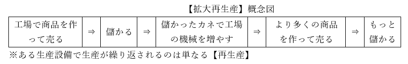
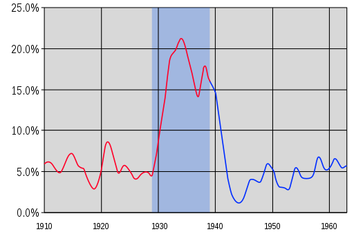
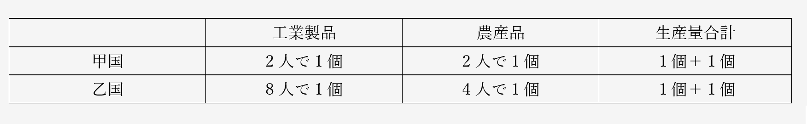
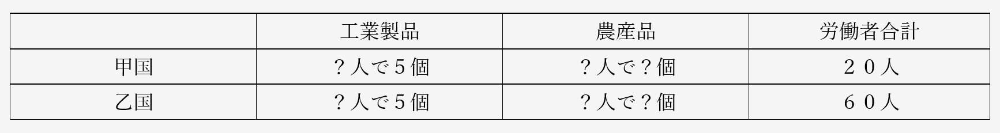
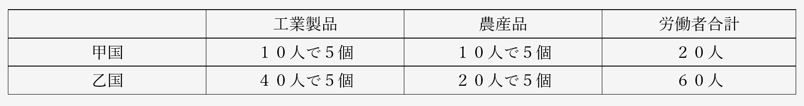
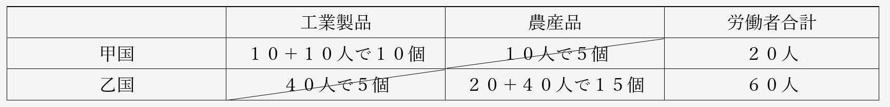
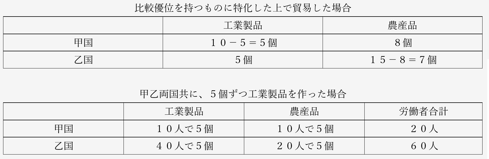

# 資本主義
## ●授業動画一覧＆問題集リンク

|問題集|[ウェブサイト](https://teacheramesaka.github.io/hsworkbookcivics/tag/eco01_01/)||
|:----:|:----:|:----:|
|資本主義の基本|[YouTube](https://youtu.be/-l4__erPTqc)|[ニコニコ動画](https://www.nicovideo.jp/watch/sm39600954)|
|資本主義の誕生|[YouTube](https://youtu.be/S5YV4fqBCA4)|[ニコニコ動画](https://www.nicovideo.jp/watch/sm39604752)|
|利潤の追求|[YouTube](https://youtu.be/DzZ_XRcoEdY)|[ニコニコ動画](https://www.nicovideo.jp/watch/sm39608942)|
|独占資本主義の形成|[YouTube](https://youtu.be/kudkmNkAMb8)|[ニコニコ動画](https://www.nicovideo.jp/watch/sm39614061)|
|修正資本主義1|[YouTube](https://youtu.be/e_bZY1iGNAM)|[ニコニコ動画](https://www.nicovideo.jp/watch/sm39626219)|
|修正資本主義2|[YouTube](https://youtu.be/E586mR3JzW0)|[ニコニコ動画](https://www.nicovideo.jp/watch/sm39629781)|
|1980年代以降の資本主義1|[YouTube](https://youtu.be/lhJygins2P4)|[ニコニコ動画](https://www.nicovideo.jp/watch/sm39633701)|
|1980年代以降の資本主義2|[YouTube](https://youtu.be/q9PUPjq6Hcs)|[ニコニコ動画](https://www.nicovideo.jp/watch/sm39639945)|
|資本主義の理論1／資本主義以前、アダム・スミス|[YouTube](https://youtu.be/9OyruCNJAY0)|[ニコニコ動画](https://www.nicovideo.jp/watch/sm39640108)|
|資本主義の理論2／アダム・スミス以外の古典経済学|[YouTube](https://youtu.be/cyRlq9kSFh0)|[ニコニコ動画](https://www.nicovideo.jp/watch/sm39649254)|
|資本主義の理論3／古典経済学の批判|[YouTube](https://youtu.be/a18HttU8fMU)|[ニコニコ動画](https://www.nicovideo.jp/watch/sm39649397)|
|資本主義の理論4／ジョン・メイナード・ケインズ|[YouTube](https://youtu.be/bs1qkcFpNJs)|[ニコニコ動画](https://www.nicovideo.jp/watch/sm39658547)|
|資本主義の理論5／シュンペーターと新自由主義|[YouTube](https://youtu.be/5WSn_OldZKA)|[ニコニコ動画](https://www.nicovideo.jp/watch/sm39662437)|
|比較生産費説問題演習１／総論と問１|[YouTube](https://youtu.be/cQPD9Xp5fEA)|[ニコニコ動画](https://www.nicovideo.jp/watch/sm39666587)|
|比較生産費説問題演習２／問２、問３|[YouTube](https://youtu.be/UCir2G3IC8o)|[ニコニコ動画](https://www.nicovideo.jp/watch/sm39672520)|
|比較生産費説問題演習３／問４、問５|[YouTube](https://youtu.be/4bQ3HJxVKOM)|[ニコニコ動画](https://www.nicovideo.jp/watch/sm39674828)|

## ●資本主義とは  
### ○資本主義の基本  
|||
|:----:|:----:|
|誕生した時期|【産業革命】の前後 革命の時代前後|
|資本主義の定義|【私有財産制】を認める経済 ※【生産手段】の【私有】という意味|

・本節ではまず、誕生した直後の資本主義を例にして、資本主義とは何かを見ていこう  
・資本主義は、【産業革命】と市民革命のあった、革命の時代前後に発生した  
⇒【産業革命】を端的に説明すれば、「機械で商品を大量生産できるようになった」というものである。産業革命以前は、どんな先進国であっても結局、商品は手作りだった。しかし産業革命によって機械で商品を大量生産できるようになった。「多くの人はどこかの会社の社員で、毎朝職場に行って働いて、会社から給料を貰って生活する」という現代的な資本主義社会は、その結果として形成されたという側面がある  
  
・ところで、「資本主義経済とはどんなものか」ではなく、定義は何か？  
・一般的には以下の通りである、とされる  
定義：【生産手段】の【私有】を認めるという意味での【私有財産制】を認める経済  
  
・生産手段とは、商品を生産する為の手段である。工場、機械、土地等を指す  
※一般的には、「私有財産制」と言ったら「財産の私有（財産を個人が所有する）を認める」もの。但し資本主義の定義で出てくる場合は、「生産手段の私有を認める」という意味で使われる  
  
・産業革命以降、金儲けをするなら「工場の機械を動かして商品を大量生産し、売る」が基本  
・この工場とか機械を持っているのが、金持ち。いわゆる【資本家（ブルジョワジー）】  
・金持ちでない一般人は、こういう生産手段を持っていない。いわゆる【労働者（プロレタリアート）】  
  
・生産手段（工場とか機械）は、持ってるだけじゃ意味がない  
・動かして、商品を生産しなければ意味がない  
・資本家一人で工場の機械全部動かす訳にもいかない  
・そこで、労働者に工場で働いて貰う。代わりに資本家は、労働者に金を払う  
⇒つまり、資本家は［生産手段］を提供し、労働者は［労働力］を提供するという関係になる  
  
||【資本家（ブルジョワジー）】|【労働者（プロレタリアート）】|  
|:----:|:----:|:----:|  
|生産手段|［持っている］|［持っていない］|  
|労使関係|労働者に［生産手段］を提供する 労働者に給料を払う|資本家に［労働力］を提供する 労働力を提供する|  
|本音|労働者に金払いたくない 労働者を長時間働かせたい|資本家は俺達にもっと金を払え 資本家は俺達をもっと休ませろ|  
  
  
  
### ○資本主義の誕生  
  
・革命の時代前後、資本主義経済は【産業革命】と共に誕生した  
・誕生したばかりの頃の資本主義は、［産業資本主義］などと呼ばれる  

|時期|工業と経済|  
|:----:|:----:|  
|絶対主義の時代まで|［手工業］しかなかった 例：［工場制手工業（マニュファクチュア）］|  
|革命の時代前後|【産業革命】が発生 ↓ 工業が［工場制機械工業］へ進化 ↓ ［産業資本主義］的な資本主義経済の発生|  

・産業革命以前は、現代的な意味での機械がなかった、故に工業は、全て［手工業］だった  
⇒代表が［工場制手工業（マニュファクチュア）］。工場に人を集めて手作りする。逆に言えば、産業革命以前は「工場があったとしても、工場の中で手作りしてる」「機械を使って商品を大量生産、はできない」という状況であった。どんな先進国でも、そうだった  
  
・革命の時代に産業革命が発生し、機械で大量生産できるようになった  
⇒工場制手工業も、［工場制機械工業］へ進化した。「工場の中に機械があって、社員が機会を操作して商品を大量生産する」に変わったのである。産業革命を経た国と産業革命前の国では、絶大な差がついた  
  
・ここから、産業資本家が登場した。工場に労働者と機械を集めて大量生産し、儲ける者達である  
・この産業資本家が中心となって経済を回すのが、［産業資本主義］である
  
### ○資本の本源的蓄積  
・ところで、いつの世にも金持ちはいるから、資本家の存在は分かるだろう  
・問題は労働者である。彼らは、何処から来たのか？  
  
・と言うのは、一般に中世とか近世の庶民というと、農民を思い起こす筈である  
・そして農民というのは普通、自分の土地を耕して農業をしている  
⇒つまり農民は普通、「自分の土地」という生産手段を持っている  
  
・一方、労働者は生産手段を持たない人々である。彼らは何処から来たのか？（二回目）  
  
・実は彼らは、没落した農民が主である…と言われている  
・近世の欧州は、農民の間で格差の拡大が進行した時代でもある  
・その格差拡大の中で、没落した（貧乏になった）農民は自分の土地を失い、小作人となっていった  
⇒自分の土地を持たず、他人の土地を借りて耕している農民を小作人と呼ぶ  
  
・こういう没落農民達が、工場に集まって労働者になっていった、と言われている  
・逆に、没落しなかった農民は地主等の富裕層となり、やがて産業資本家となっていった  
⇒言ってみれば、近世に農民内で貧富の格差が拡大した事によって、資本主義経済に必須の「資本家」と「労働者」が揃った、とも言える。こういう、資本主義の前提が揃う動きの事を［資本の本源的蓄積］と呼ぶ事がある  
  
※ただこれは、正直に言うと古い説です。最近は「これ貧富の格差が拡大してどうこうじゃなくて、農業技術が進んで農作物が沢山取れるようになって人口が増えて、その増えた人達が労働者になっただけじゃない？」みたいな説が出てきています。産業革命発祥の地イギリスなんかでは、これが有力です  
  
  
  
### ○利潤追求  
・資本主義経済はまた、（特に資本家による）【利潤の追求】を認める体制である  
  
・ある生産設備で生産が繰り返される事を【再生産】と言う  
・ところで、商品が売れれば売れるほど、資本家は儲かる  
・資本家は普通、利潤を追求する（利益を増やそうとする）ので、商品を大量に生産しようとする  
・つまり、資本主義経済では【拡大再生産】が基本となる  
⇒工場で商品を生産する。それで儲かる。儲かったら、更に儲ける為に工場や機械を増やす。また工場で商品を生産する。また儲かる。儲かったら…と繰り返す  
  
  
  
・では、民間の資本家が拡大再生産している間、政府は何をするか  
・この時期の政府の経済政策は【自由放任（レッセ・フェール）】が基本となる  
⇒この時期は、「俺達にもっと自由に金儲けさせろ」という自由権が重視された時代。故にこの時期の政府の理想は【夜警国家】。国防とか治安維持みたいな最低限の事しかしない、小さな政府。政府が何もせず、市場の資本家が自由に競争すれば、【「神の見えざる手に導かれて」】経済は発展する（【『国富論』】の【アダム・スミス】）という考え方が、この時代の経済観  

**産業資本主義の時代の経済の基本的な考え方**

|||  
|:----:|:----:|  
|理想の政府|【夜警国家】 【小さな政府】|
|↓の基礎理論提供者|【『国富論』】の【アダム・スミス】|
|理想の経済|【自由放任（レッセ・フェール）】 政府が何もせず、市場の資本家が自由に競争すれば、【「神の見えざる手に導かれて」】経済は発展する|
|って事はつまり|資本主義経済は［無計画］経済 経済の［無政府］性あり 【景気変動（景気循環）】は不可避 【失業者】の発生も不可避|

・つまるところ、資本主義経済に於いては、経済は［無計画］経済である  
・言い方を変えれば、資本主義経済は［無政府］性を持つ  
・無計画である以上、需要と供給が一致しない事態は起こり得る  
・当然、過剰供給による売れ残りや、それによる企業の業績悪化、倒産等も起こり得る  
・ひいては、「好景気⇒不況⇒回復期⇒好景気…」みたいな【景気変動（景気循環）】も避けられない  
・また、不況が避けられない以上、【失業者】の発生も避けられない  
  
## ●資本主義の修正  
・資本主義の誕生は既に見たので、その後資本主義がどう変わっていったかを見ていく  
  
  
### ○独占資本主義の台頭  
・次の諸図で説明するような事態が進行していった、とされる  
  

  
  
・資本主義経済に於ける競争というのは、カネを多く持っている方が強い  
・また産業資本主義は、利潤追求を肯定し、政府は介入せず自由競争に任せる  
・この二つの合わせ技が問題だった  
  
・カネを多く持っている方が強いので、勝者となった大企業はそのまま勝ち続ける  
・しかも自由放任で政府が介入しないので、弱い企業の救済策や逆転要素も特にない  
・結果、勝ち続けた少数の企業が、経済を支配するようになってしまうのである  

|||  
|:----:|:----:|  
|［資本の集積］|ある一社が利潤を追求した結果巨大化するもの|  
|［資本の集中］|少数の巨大企業が結託するもの ［カルテル］［トラスト］［コンツェルン］等と呼ばれるものはこちら|  
|［独占資本主義］|少数の巨大企業に支配される形の資本主義経済|  
|［独占資本］|経済を支配する少数の巨大企業|  
  
※［カルテル］［トラスト］［コンツェルン］の三種は『市場の失敗』という節で詳しくやります  
  

  
・帝国の時代は、【植民地】獲得競争が盛んに行われた時期でもある  
⇒植民地を獲得するべく他国を征服したり、戦争したりするのを【帝国主義】という  
  
・この時期の植民地獲得競争は、既に見たように、イギリスに対する各国の追い上げでも説明できる  
・同様に、農業技術の未熟による植民先の獲得競争でも説明できる  
・一方、帝国の時代の植民地獲得競争は、［独占資本］によって主導された面もある  
⇒この頃になると、独占資本が更なる拡大再生産を行っても、もう国内には商品が行き渡り切っていて売上が増えない、という状況になっていた。そこで、他国の領地を切り取って植民地とし、増産した商品を植民地の住人に売りつけて儲けようとしたのである  
  
**～雑談終わり～**
  

  
### ○修正資本主義の登場  
・産業資本主義の誕生以来、自由主義と資本主義は繁栄を謳歌していた  
・独占資本主義という批判はあったし、参政権獲得運動もあったが…  
・「自由権を制限しよう」「自由放任はやめよう」という風潮は小さく、弱かった  
  
・この「自由権を制限しよう」「自由放任はやめよう」という風潮は、世界大戦と共に強くなり始めた  
・そして世界大戦期のど真ん中、1929年末を契機に、一気に時代の流れとなる  
・即ち、1929年末に起きた【世界恐慌】が、世の中を大きく変えたのである  
  
・世界恐慌は、その名の通り、世界中が超のつく大不況になった事件である  
・この事件によってついに、自由放任政策の廃止が時代の潮流となる  
⇒「景気変動は避けられないものだから不況ってのは必ず来るし、仕方ない」「放っておけば景気は勝手に回復する」等とは言っていられないほどの大不況になった  
  

  
１：1930年代全体を通して、アメリカ合衆国の失業率はほぼ15%超え。ヤバい時は20%超え  
２：ドイツ国の被害は特に大きく、一時は失業率40%超えに  
３：大日本帝国も、学士（いわゆる大卒）の就職率が一時30%台になる大不況に  
  
※この時代の大学生は、専門学校と合わせても16万人ぐらいしかいない。ちなみに、令和三年現在の東京大学、京都大学、慶應大学、早稲田大学、上智大学の在籍者数を全部合わせた数字が16万人行かないぐらい。令和三年現在の大学生総数は291万人である  
  
**～「放っておけば景気は勝手に回復する」とは言ってられないですねこれは～**  
  

  
||産業資本主義以来の考え方|世界大戦期以降、特に世界恐慌以降出てきた考え方|  
|:----:|:----:|:----:|  
|重視された人権|【自由権】|【社会権】|  
|理想の政府|【夜警国家】 【小さな政府】|【福祉国家】 【大きな政府】|  
|↓の基礎理論提供者|【『国富論』】の【アダム・スミス】|［『雇用、利子及び貨幣に関する一般理論』］のジョン・メイナード・【ケインズ】|  
|理想の経済|【自由放任（レッセ・フェール）】 政府が何もせず、市場の資本家が自由に競争すれば、【「神の見えざる手に導かれて」】経済は発展する|【ケインズ主義】 政府が市場に介入して、経済を活性化させる（例えば不況の時、好景気になるような経済政策を実施する）|  
|って事はつまり|資本主義経済は［無計画］経済 経済の［無政府］性あり 【景気変動（景気循環）】は不可避 【失業者】の発生も不可避|いわゆる【修正資本主義】 【経済計画】を実施する 景気変動を小さくしようとする 失業者をゼロにしようとする|  
  
・本来自由放任を旨とした資本主義は、この挫折を機に【修正資本主義】となっていく  
・【福祉国家】的な【大きな政府】路線が、世界の潮流となる  
※またこの辺りから、【自由権】を制限して【社会権】を重視しよう、という流れも強くなっていく  
  
※勿論、世界恐慌以外にも、この潮流を生んだ原因はある。第一次世界大戦で、金持ちも貧乏人も平等に軍人として働いた、という経験もある。また、第一次世界大戦中に起きた【ロシア革命】が【ソ連】を生み出した、というのもある。「労働者を虐め過ぎると革命が起きる」という感覚が、金持ち・大企業の自由を制限して社会権を重視し、貧乏な一般庶民を助けよう、という意識を生んだ側面がある  
  
・修正資本主義下の大きな政府に於いては、政府が市場に介入し、経済を“改良”しようとする  
・このように、計画を立てて経済に介入する事を【経済計画】という  
  
・【経済計画】の代表例としては、財政政策や金融政策、市場の失敗への対処等がある  
・これらについて詳しくは後々やるので、今回は代表例として一つ、公共事業を挙げておこう  
  

  
　国が金を出して高速道路を作る、ダムを作る、競技場を作る等々を公共事業と呼ぶ。修正資本主義的な政策を採用している国家では、不況時に増える。  
  
　簡単に言えば不況とは、企業が儲かっていない（企業の商品が売れていない）状態。そして好景気とは、企業が儲かっている（企業の商品がよく売れている）状態である。  
  
　そして不況の時は、労働者の仕事がなくなる（クビになったり勤めてた会社が潰れたりする）。仕事がなければ、労働者の給料はゼロになる。給料がゼロだと、普通の人はカネを使えない。人々がカネを使えないという事はつまり、企業の商品が売れないという事である。  
  
　だから、不況の時は政府が「ダム作るぞ」「高速道路作るぞ」というので労働者を雇い、カネを払ってやれ（政府が労働者の仕事を作ってやれ）…というので、公共事業を増やす訳である。人々は公共事業の為に働いて得たカネで企業の商品を買い、企業は儲かるようになり、景気は回復に向かう…という話なのだ。  
  
**～勿論これだけが経済計画じゃないし、不況時にやるべき事でもない。詳しくはまた今度～**  
  

  
・こういった修正資本主義の基礎理論を提供したのは、ジョン・メイナード・【ケインズ】だとされる  
・また、政府が市場に介入して経済を活性化させよう、と考える事を【ケインズ主義】と呼ぶ事が多い  
  
・ケインズ主義の実例としてよく挙げられる政策が、アメリカ合衆国の【ニューディール政策】である  
※実施したのは大統領【フランクリン・Ｄ・ルーズベルト】。米国が第二次世界大戦へ参戦した時の大統領でもあり、ソ連が大好きな大統領でもあり、第二次大戦末期に死んだ後米ソ関係が急速に悪化した、あの大統領である  
  
・この政策では、政府が金を出して［テネシー河］にダムを作る等の公共事業を実施した  
・世界恐慌で大量に出た失業者が、この公共事業関連会社に就職した  
  
※実際には、ニューディール政策は世界経済のみならず米国経済を復活させるにも不充分だった。大きな政府路線による、政府が市場に介入して不況から回復させる政策には、カネを大量に、ドバドバと注ぎ込む必要がある。ここで尻込みして投入するカネを惜しむと、「効果はあるにはあったけど結局不況のままですよね」になる。これはニューディール政策でも、現代日本の第二次安倍政権によるアベノミクス政策でも変わらない。実際、ニューディール政策は不充分だった為、米国経済が本格的に復活したのは世界大戦が始まってからである。「戦争だから」という大義名分を得てカネを市場にドバドバ突っ込んだ結果、米国経済は完全に復活した  
  
  
アメリカ合衆国の失業率を示したもの。1930年代の中盤に一度下がって上がっているところが、分かりやすく「効果はあるにはあったけど結局不況のままですよね」になったニューディール政策を表している。一方、第二次世界大戦の開幕（1939年）を境に、失業率は急速に下がっている。  
https://upload.wikimedia.org/wikipedia/commons/0/04/Real_GDP_of_the_United_States_from_1910-1960.svg  
Pharexia, CC BY-SA 4.0 <https://creativecommons.org/licenses/by-sa/4.0>, via Wikimedia Commons  
  
・尚、ニューディール政策はダム建設ばかりが注目されるが、実際には他にもやっている  
・それこそ金融政策は大変重要なのだが、こちらが重視して解説される事は少ない  
⇒大学受験の問題でも、ニューディール政策の公共事業（ダム建設）については語られるが、金融政策についてはほぼ問われない  
   
・一方で、ニューディール政策の中で［社会保障］関係の法律を制定したのは重視される事が多い  
・何せ米国は伝統的に自由権重視で、今でも社会保障が死ぬほど貧弱である  
・そんな伝統を持つ米国の歴史の中で、社会保障関係の法律が制定されたのは異例と言える  
⇒それほどまでに、世界恐慌後の混乱は凄かった、という話だと言える。代表例としては年金保険や公的扶助（生活保護のようなもの）制度を定めた［社会保障法］や、労働者保護法の［ワグナー法］がある  
  
・ちなみに、［グリーン・ニューディール政策］というのもある  
・これは、2008年のリーマンショックに端を発した世界的な不況に際して行われたものである  
⇒当時のアメリカ合衆国大統領はバラク・オバマ。F.D.ルーズベルトのニューディール政策にあやかって、名前を引っ張ってきている  
  
**【ニューディール政策】関係まとめ**  
  
|||
|:----:|:----:|
|実施者|【F.D.ルーズベルト】|
|実施時期|世界恐慌後、1930年代|
|代表政策１|［テネシー河］のダム建設|
|代表政策２|［社会保障］関連法の整備 ⇒［社会保障法］、［ワグナー法］等|
|後の世で…|［グリーン・ニューディール政策］|
  
### ○自由主義の復権、そして…  


・冷戦終結直前になると、先進国各国で「福祉路線はもう駄目だ」という声が大きくなってくる  
・これも様々な要因があるのだが、今回は二つ挙げよう  
  
１：そもそも、欧米先進国が福祉国家をやる事そのものに無理があった  
⇒結局、福祉国家は「国民の自由をある程度制限」して社会権を重視する国家である。そして、福祉国家をやっている欧米の国は、本音では自由権を重視したい国家である  
  
２：欧米先進諸国が、経済的に行き詰ってきた  
⇒1980年代ぐらいになると、福祉国家を志向する多くの国の経済が、伸び悩むようになった。結果、「福祉国家はもう駄目だ」「ケインズ的なやり方はもう駄目だ」という人が出てきた  
  
・こうして、反社会権、反福祉国家、反ケインズ的な考え方が流行となった  
⇒こういった考え方を、及び考え方をする人々を、まとめて【反ケインズ主義】と呼ぶ  
  
・彼らは、【自由権】を重視した【小さな政府】路線を称賛した  
・【財政赤字】解消、【政治腐敗】の防止等をお題目に、【小さな政府】路線の復活を提唱した  
・こうして、【自由権】を重視した夜警国家的な国家が、再び人気を得るのである  
⇒革命の時代前後、自由権を重視する考え方は自由主義（リベラリズム）と呼ばれていた。今回、一度自由が重視されなくなった後、新たにまた自由が重視されるようになった…という事で、1980年代以降の自由権重視思想は【新自由主義（ネオリベラリズム）】と呼ばれる事が多い  
  
**～ここまで引用～**  
  

  
・1980年代頃になると、修正資本主義を採用する各国で、経済が伸び悩むようになる  
⇒実を言うと、この時経済が伸び悩むようになった理由は、今となってもよく分かっていない。この辺の話はまた後でするので、今は↓のように解釈するといい  
  
>「修正資本主義の公共事業とかは、言ってみれば不況対策。不況でもないのにずーっとやっていれば、それはおかしくなるに決まっている」  
>※実際、修正資本主義の元になったケインズ自身は、「好景気になったら増税して公共事業も減らせ」と言っている。だが多くの国は、好景気になっても公共事業をやり続けたし、増税もしなかった  
  
・ここから、【反ケインズ主義】が力を持つようになる  
⇒政治的な反ケインズ主義が新保守主義、経済的な反ケインズ主義が新自由主義、と考えてもいい  
⇒基礎理論の提供者はミルトン・【フリードマン】  
  
・ともかく、かつての産業資本主義の時代のように「神の見えざる手」に任せよう、という者が出てきた  
・また、1990年代ソ連自体が消滅し、革命の恐怖も消えた  
・こうして、再び時代は【小さな政府】路線へ向かうのである  
  
・1980年代に新自由主義を導入し始めた各国の政治指導者としては、以下の者が挙げられる  
日本国：【中曽根】康弘内閣総理大臣  
アメリカ合衆国：ロナルド・【レーガン】大統領  
イギリス：マーガレット・【サッチャー】首相  
※日本の場合、こういう流れを最初に始めたのは中曾根だが、決定的にしたのは【小泉純一郎】である  
  
||帝国の時代まで|世界大戦期～冷戦期|冷戦末期～|  
|:----:|:----:|:----:|:----:|  
|重視された人権|【自由権】|【社会権】|【自由権】|  
|路線|【小さな政府】|【大きな政府】|【小さな政府】|  
|基礎理論提供者|【『国富論』】の【アダム・スミス】|［『雇用、利子及び貨幣に関する一般理論』］のジョン・メイナード・【ケインズ】|ミルトン・【フリードマン】|  
  
・そして令和二年現在  
・産業資本主義～独占資本主義の時期にあったような問題が、再び起こるようになっている  
⇒それこそ、「独占資本主義かな？」というぐらい中小企業が淘汰され、大企業による独占市場が様々な業種で誕生している。GAFA(Google/Apple/Facebook/Amazon)という単語は、まさに現代が独占資本主義の状態にある事を証明しているものとも言える  
  
・では、具体的にどのような問題が起こってきているか。日本を例に採ろう  
・例えば規制緩和により、極めて制限された形でしか使えなかった派遣社員が大々的に使えるようになった  
・資本家からしてみれば、正社員より派遣社員の方がいい  
⇒正社員は給料も高いし、いつでもクビにできる訳でもない。一方派遣社員は非正規雇用なので給料が安く済み、いつでもクビにできる。だから資本家は正社員を採用しなくなり、派遣社員ばかり使うようになった。こうして、誰も彼もが派遣社員に、非正規雇用になり、いつクビを切られるか分からない低賃金労働に従事せざるを得なくなった  
  
・更には、資本家は「カネのかかる日本人を雇いたくない」とすら考えるようになる  
⇒移民の推進を政治家に働きかけたり、工場を海外に移したり。また、外国人技能実習生（その名の通り、外国人の実習生）を実質的な奴隷労働者としてこき使っている企業も多く、社会問題になっている。こうして、一般日本人はどんどん貧乏になっていき、ごく一部の資本家だけが金持ちになっていく  
  
・当然、こうなると、反新自由主義や「また修正資本主義にしよう」という動きが出てくる  
・米国の例だが、トランプ政権誕生などは、その実例と言える  
⇒トランプ政権の方針の一つが、「アウトソーシングをやめろ、賃金の安い国に外注するな。アメリカに工場作ってアメリカ人を雇い、アメリカでモノを作れ」である。まさしく反自由主義と言ってよい  
  

  
　「同じ話を繰り返してるなこいつら」と思ったと思います。まさにその通りで、新自由主義なんかは「それ前にやって駄目だった奴じゃん」です。これは勿論、歴史を勉強するのって大事ですねという話でもあり…また、経済学という学問に対する見方にも関わってきます。 
 
　経済学者は基本、自派閥の間違いを認めません。例えばマルクス経済学というのは、ソ連を始めとした社会主義＝共産主義国家の経済理論ですが、ご存知の通り、社会主義国家は二十一世紀までにはほぼ破滅しました。故にマルクス経済学というのはまさに、「それ前にやって駄目だった奴じゃん」です。 
 
　しかしマルクス経済学者は、基本、「マルクス経済学は間違っていた」とは言いません。「ソ連をはじめとした社会主義国家は、マルクス経済学に基づいて経済を運営している言いながら、間違ったやり方をしていた。我々が言う正しいマルクス経済学を採用すれば、絶対にうまくいく」というような事を言います。 
 
　こういった神学論争をしてしまうのは、古典経済学派も、新自由主義者も、そしてケインズ主義者も、基本的には同じです。「俺の言う”正しい話”が理解できないのは、愚かな××主義者だからだ。勉強しろ」という発言を、意識せず、自然とやってしまっている人は、世の中に数えきれないぐらい存在します。 
 
　これは私とて、例外ではありません。私はケインズ主義を支持していますが、「じゃあケインズ主義をやってた1970年代米国は、何で経済がうまく回らなくなったんですか？」と言われると、どうしても「ちゃんとケインズ主義をやってないから」と言ってしまいがちです。 
 
　また、「新自由主義」や「社会主義」といった単語を、無意識の内に「邪悪」「無能」「失敗作」というような意味で使ってしまいがちです。勿論、分かっててやってる事も多い（特に相手が社会主義の時）のですが…本当に意図せず、「こいつは所詮新自由主義者だから」という決め付けとして使ってしまう事が、結構あるのです。もしかしたら授業用資料の中にもそういう箇所があるかもしれません。 
 
　こういう神学論争は、経済学に限らず多くの学問に存在します。皆さんも時々、「今自分は、神学論争をしてしまっていないか？」と自問してみましょう。 
 
<b>～ここまで雑談～</b> 
  

  
## ●資本主義の理論  
・資本主義の経済理論について、時系列順に見ていく  
・尚、資本主義以前の経済理論についても取り扱う  
  
### ○資本主義以前  
・近世絶対王政期の欧州経済は、基本的に【重商主義】経済だった  
・重商主義と言っても多種多様だが、共通して「国が商工業を支援する」類の経済である  
・重商主義を唱えた有名人から一人挙げるなら、イングランド王国の【トーマス・マン】  
⇒重商主義の中でも特に【貿易差額主義】を提唱した男。要するに、自国の商工業を保護したり育てたりして、輸入よりも輸出の額を大きくすれば儲かるよね、というもの  
  
・重商主義の後の経済理論というのは、重商主義への批判を伴って出てくる  
・誕生したばかりの資本主義が自由主義と一緒に出てくるのは、これが理由でもある  
⇒重商主義は基本、「国が商工業を支援する」類のもの。つまり、国が経済活動に口を出す類のもの。一方、誕生したばかりの資本主義は、アダム・スミスの「神の見えざる手」に代表される、「国は民間の経済活動に口を出すな」「俺達にもっと自由に金儲けさせろ」という自由権の重視と共に出てくる  
  
・［重農主義］も、重商主義への批判を伴って出てきた理論  
・名誉革命後、フランス革命以前の時期に、自由放任を唱えた  
・この自由放任の発想は、後に資本主義へ影響を与える  
  
  
### ○古典派経済学  
・フランス革命に前後して、自由放任による資本主義を唱える経済学者が次々と登場する  
・この時期の経済学者達を、【古典（派）経済学者】と言う  
・この古典派経済学は、当時最盛期を迎え世界の覇権国として君臨した大英帝国で発展した  
  
#### ・アダム・スミスと古典経済学の楽観性  
・古典派経済学でいの一番に出てくるのは、やはり【『国富論』】の【アダム・スミス】である  
  
・彼の理論の骨子、そして古典経済学の骨子は、その楽観性によって特徴づけられる  
・「皆が最善の努力をすれば、社会全体が理想の形になる」というプロテスタント的な考え方である  
・この楽観性は、【自由放任】主義や［セーの法則］によって代表される  
  
１：【自由放任】主義  
⇒政府が何もせず（つまり【自由放任（レッセ・フェール）】）、市場の資本家が自由に競争すれば【「神の見えざる手に導かれて」】経済は発展する  
  
２：［セーの法則］  
⇒拡大再生産で商品を増産⇒供給拡大⇒合わせて需要も拡大⇒また拡大再生産⇒また供給拡大⇒合わせてまた需要も拡大…という風に、需要と供給は［自動調節］される、という楽観的な考え方  
  
#### ・デイヴィッド・リカード  
・他にも有名な古典経済学者はいる。例えばデイヴィッド・【リカード】である  
⇒主要著書は【『経済学および課税の原理』】  
  
・リカードは【自由貿易】を擁護する【比較生産費説】を展開した  
⇒アダム・スミスの「自由競争すれば経済はよくなる」論を、世界全体に拡大したもの。世界中で自由に競争すれば経済はよくなる、だから自由貿易をしよう、という考え方  
  
・また、【労働価値説】も提唱した  
⇒商品の価格は、商品生産に必要な労働力で決まる、というもの  
  
※この人はアダム・スミスと並んで特に重要な古典経済学者である。中でも比較生産費説が非常に重要で、かつ大学受験でも、比較生産費説をお題にした計算問題は頻出。後で問題演習をやるので、そこで具体的に学習しよう  
  
#### ・トマス・ロバート・マルサス  
・著名な古典経済学者ではあるが、一風変わった部分が有名なのは【『人口論』】の著者である  
・即ち、トマス・ロバート・【マルサス】である  
  
・以前から言っているように、「先進国では普通、飢饉は起きない」は［緑の革命］以降の話である  
⇒［緑の革命］は1940年代から1960年代にかけて起こった。これ以前の農業生産量というのは、極めて貧弱であり、欧米列強の先進国でさえ、ちょっと人口が増えすぎるとすぐ飢饉になった  
  
・故に、増えすぎた人口を植民させる土地が必要とされ、植民地獲得競争が行われた訳だが…  
・マルサスは、この事をズバリ『人口論』で指摘したので有名である  
⇒人口は［幾何（等比）］級数的に増加するのに対し、食糧は［算術（等差）］級数的にしか増加しない、と述べた。要するに、人口はアホみたいに増えるものだが食糧生産は全然増えねぇぞこれ、と言った  
  
※更に、社会保障をやめて貧乏人を死なせるとか、戦争やって人を死なせるとか、そうやって人口を調整しないと、人口爆発からの農作物不足で人類社会が破裂しますよ、というような事も言っている人である。冷酷なようだが、自由権を重視すると「無能が貧乏なのは自己責任だろ努力しろ。貧乏から抜け出せないのは無能で怠惰だからだ」になりがちで、マルサスはこの自由権を重視した古典経済学者の重鎮である。んでしかも人口爆発を指摘した訳だから、そりゃそうなる  
  
#### ・ジョン・ステュアート・ミル  
・古典派経済学最後の巨人と言えるのが［ジョン・ステュアート・ミル（J.S.ミル）］である  
・主著は『経済学原理』である  
⇒公共の倫理分野や倫理の授業では、「ジェレミー・ベンサムの功利主義を改良した哲学者」「『自由論』を書き、自由権の重要性を主張した」といった方面から紹介される人物である  
  
・彼はリカードの論を批判しつつも、更に発展させた人物として扱われる  
・例えば労働価値説について、商品の価格は賃金、地代、利潤の三要素から決まる、と主張している  
  
### ○古典派経済学の批判  
・ちなみに、古典経済学華やかなりし時代からして既に、古典経済学が全肯定されていた訳ではない  
・ある意味J.S.ミルも、古典派経済学の批判者という面がある  
⇒例を挙げれば、弱者救済とかやらなきゃいかん、と言っている。マルサスは弱者を死なせてでも人口調節しなきゃ、と言ってた訳で…  
  
・ここでは、批判者としてヴュルテンブルク公国生まれの経済学者フリードリヒ・［リスト］を挙げたい  
※長い間小国に分裂していたドイツが統一に向かいつつも、まだ統一されていない、ぐらいの頃の経済学者。主著は［『経済学の国民的体系（政治経済学の国民的体系）』］  
  
・彼は、古典経済学で最良の貿易として主張された、自由貿易を批判した人物である  
・この自由貿易、実は、いつの時代何処の地域でも、経済的に強い国は主張するものである  
  
・強い国は、優秀な製品を比較的低価格で生産できる  
・弱い国は、同じ品質のものを作れなかったり、作れても価格が高かったりする  
・だから強い国は、自由貿易を主張する  
⇒自由貿易とは要するに、「関税とかかけるんじゃねぇ。どの国のどの商品も同じ土俵で勝負しようや」である。そりゃ強い国は自由貿易を主張するに決まっている。強い国の商品は安くて高品質なのだから、輸出すればするほど売れる。そして弱い国の国産品は売れなくなり、国内の産業は死ぬ  
  
※関税は、輸入品にかけるもの。これを高く設定すれば、「本来なら輸入品の方が安いのに、高い関税がかかってるせいで国産品の方が安い」という状況も作れる  
  
・こういう現実を受けたリストは、「最強国家以外は［保護貿易］が必要」とした  
⇒自由貿易をやると国産商品が、強国の高品質低価格な輸入商品に完全敗北し、国内産業が死ぬ。これを防ぐには、高い関税をかける等の保護貿易が必要だ、という論。実際、例えば今の日本の農業は、関税によって守られていなければとっくの昔に壊滅している。2019年に発効した日欧EPAでチーズの関税が撤廃となった際、「ただでさえ死にかけの日本の酪農を殺す気か」と騒がれたのにはそういう事情がある  
  
・ちなみに。保護貿易をする方法は主に二種類ある  
・一つは、高い関税をかけて、輸入品の値段を上げるもの。いわゆる［関税］障壁  
・もう一つは、［非関税］障壁である  
⇒［輸入数量］を制限したり、［入関］手続や［検疫］手続を複雑化したり。そういうのでも、輸入品を減らし、自国産業を保護する事は可能である  
  
### ○修正資本主義下の理論  
#### ジョン・メイナード・ケインズ
・修正資本主義下（福祉国家期）第一の経済学者は、やはりジョン・メイナード・【ケインズ】である  
・代表作は［『雇用、利子及び貨幣に関する一般理論』］  
  
・ケインズの理論と古典経済学で一番違うのは、【需要】と【供給】どちらを重視するかである  
・古典経済学は「商品を作れば作るほど売れる」という立場  
⇒セーの法則なんかまさにこれ。供給が増えれば需要も拡大する、という考え方  
  
・「買う側に金がねぇのに商品増産したって、売れる訳ねぇだろ」と言ったのがケインズである  
・故にケインズ主義では、需要を重視する  
⇒より正確に言えば、「消費者がきちんと金を払える」という前提に立った、健全な需要。そういう需要が増えれば、合わせて供給を拡大していけばいい、という考え方である。このような需要を、【有効需要】という  
  
・修正資本主義下（ケインズ主義下）の大きな政府は、政府が市場に介入する  
・主なところでは、公共事業を行う。国が金を出して高速道路とかダムとか競技場を作る  
・何故こんな事をするのか？　勿論、有効需要を増やす為である  
  
・例えば、国が金を出して高速道路を作る事とし、人々は高速道路を作る会社に就職する  
・人々は職を得て給料が支払われるので、モノを買えるようになる  
・これは見方を変えれば、需要が生まれるという事でもある  
・だから商品の供給を増やしても、ちゃんと売れる  
・商品が売れるのであれば、景気はよくなるし、新しい会社を作ろうという機運も出てくる  
・そうなれば新しい雇用が生まれて、そこに就職した人はまた給料を得てモノを買えるようになる  
・つまり需要が生まれるので、商品の供給を増やしても問題なくなり…と、後は繰り返し  
⇒こういうのをケインズは、一つの公共投資が［呼び水］となって他の投資に拡大する［乗数］効果によって景気が回復する、と表現した  
  
・また、商品の価格についても、需要が大事だとしたのがケインズである  
・古典経済学では、リカードが労働価値説を唱え、J.S.ミルは価格を決める三要素を唱えた  
⇒どちらも、供給側の視点からのみ商品の価格を論じた  
  
・一方ケインズは、【限界効用価値説】を唱えた  
⇒要するに、「作るのにどんなにカネがかかってたって、需要がなきゃ売れないんだから、値段下げるでしょ」「って事はつまり、商品の価格を決めるのは需要だよ」という理論  
  
・他にケインズの行った古典経済学批判としては、失業者関係がある  
・古典経済学は楽観的なので、失業者問題についても楽観的だった  
⇒「皆が最善の努力をすれば、社会全体が理想の形になる」というのがねっこにあるので、「自由競争で皆が最善の努力をすれば、【完全雇用】が達成される」という風に考えていた。失業者が出るのは、努力が足りないと。ちなみに完全雇用とは、全国民が仕事を持っていて失業者がいない状態の事  
  
・一方ケインズは、自由放任の資本主義で不況が起こるのは当然とした  
・そして、不況になれば解雇される労働者が出るのも当然とした  
⇒こういう失業を、【非自発的】失業と呼ぶ。本人はまだ働きたいのに解雇された、というもの  
  
・だからケインズは、公共事業等で雇用を創出しないと完全雇用にはならないよ、としたのである  
  
#### ヨーゼフ・アロイス・シュンペーター
・尚、ケインズとほぼ同時期の経済学者で、ヨーゼフ・アロイス・【シュンペーター】という人がいる  
・この人は、経済に於いては【イノベーション（技術革新）】が一番大事だ、とした人である  
・即ち、イノベーションによって、古いやり方が破壊され、新しいものが生まれる  
・これを創造的破壊と言うが、イノベーションによる［創造的破壊］によって、景気は上向く  
・逆に、イノベーションがなくなると、不景気になる…このように考えた  
  
・この人は、現代日本に於いて、経済学と言うよりは経営学的に重要な人物である  
・企業の経営者が「イノベーションだ」とか言ってるのをよく見かけるだろう  
・イノベーションが無ければ企業は生き残れないとか、そんな事を言っている筈である  
・その経営者自身、何でイノベーションとか言ってるのか、よく分かっていないだろうが…  
・実は、彼らの言うイノベーションは、シュンペーターの理論が元になっているのである  
⇒実際、シュンペーターはイノベーションによる創造的破壊が無ければ、企業は生き残れないと言っている  
  
・ここからは雑談だが、シュンペーターの言うイノベーションとは、単なる技術革新だけではない  
・以下に挙げる全てを指して、イノベーションと呼んでいる  
  
１：新しい生産物の創出  
２：新しい生産方法の導入  
３：新しい市場・販路の開拓  
４：商品の材料となる、新しい資源及びその供給源の獲得  
５：新しい組織の実現  
※こういうのを知らずにイノベーションイノベーションって譫言のように繰り返すようになると、中身のない意識高い系になっちゃうから気を付けよう！  
  
### ○1980年代以降の理論  
・ケインズ自身は、公共事業とかで不況を脱した後は、増税とかでブレーキをかけろと言っていた  
⇒不況の時こそ、国債をバンバン発行して国家財政を大赤字にして、公共事業をバンバンやりまくる。景気がよくなったら、公共事業を減らしたり増税したりして国家財政を黒字にしろ、みたいな事を言っていた。いわば、「不況時は不況対策をしろ」「好景気の時はブレーキをかけろ。どうせいつかは不況になるんだから、景気を良くしてばっかだと不況になった時とんでもない大恐慌になるぞ」と言っていたのがケインズ  
  
・が、ケインズ主義を採用し福祉国家を目指した各国は、好景気になっても経済政策を変えなかった  
⇒例えば、不況を脱しても大規模な公共事業をやり続けた  
  
・そうなってくると、問題が出てくる  
・一つは、【財政赤字】が発生する事である  
⇒単年度の税収より、支出が多い状態。足りない分は国債を発行して補填する事になる  
※不況の時も好景気も財政赤字だと「この国永遠に赤字だな」になる  
※無論、「ずっと赤字でいいんだ」という人もいるが、「国がずっと赤字なのはよくない」という人は多い  
  
・そしてもう一つが、【インフレーション（インフレ）】の問題である  
・細かい話は後でやるが、「物価が上昇する」事をこう呼ぶ  
・逆に物価が上がらない事を【デフレーション（デフレ）】と呼ぶ  
・そして、一般に経済学では「適度なインフレの時は好景気になる」とされている  
・しかし1970年代頃から、「インフレなのに何故か景気が悪くなる」という状況が出てきたのである  
⇒こういう「インフレなのに何故か不景気」を、【スタグフレーション】と呼ぶ  
  
・この状況で、「やっぱり古典経済学みたいなやり方が正しい！」という人達が出てきた  
⇒「上り調子の時はほっとく」「好景気の時は、調子に乗り過ぎて世界恐慌みたいな事にならないような政策をする」「不景気の時は、景気が上向くような政策をする」みたいにすればいいのに、そうはならない。「公共事業とか、政府がカネを出して景気を刺激するやり方は間違っている！」「自由放任最高！」という人達が出てくるのである  
  
・こうして、【反ケインズ】主義を掲げる［新自由主義］［新保守主義］が出てくる  
⇒この主義を実際に採用したのが、日本なら【中曾根康弘】首相、米国ならロナルド・【レーガン】大統領、英国ならマーガレット・【サッチャー】首相である  
  
・反ケインズ主義の有名どころでは、［サプライサイドエコノミクス］がある  
・そのまんま、「供給側の経済学」という意味  
・名前から分かるように、需要を重視したケインズ主義を批判し、古典経済学を現代風にリバイバルした  
・サプライサイドエコノミクスでは、［減税］や【規制緩和】による自由競争の奨励を骨子とする  
  
・サプライサイドエコノミクスを提唱したので有名なのがアーサー・ベッツ・ラッファーである  
・また、実施したので有名なのが、アメリカ合衆国大統領ロナルド・【レーガン】である  
⇒［新冷戦］期の大統領。［戦略防衛構想(SDI)］を提唱した人  
  
・ただ、レーガン時代の米国は赤字のままだった  
・何せ、彼は減税と規制緩和をした一方で、SDIをやった人である  
・SDIに対抗しようとしたソ連が破産するぐらい、軍隊にカネをかけた人物である  
・更に、当時のアメリカ合衆国は輸入超過の状態で、貿易赤字だった  
・軍事費による［財政赤字］と［貿易赤字］による【双子の赤字】により、赤字のままとなったのである  
  
・また、同じく反ケインズ主義の有名どころとして、【マネタリズム（新貨幣数量説）】がある  
・提唱したのはミルトン・【フリードマン】  
⇒［完全雇用］は無理。ある程度の［自然失業］は仕方ない、つまり、ある程度失業者がいるというのは自然な事だから、これは仕方ないと諦めよう、と考えた人  
  
・マネタリズムでは、「物価とか経済成長は、貨幣の流通量で決まるよ」と考える  
・故に、市場に流通する貨幣の数を適切に操作できれば、経済は安定してよくなる、という立場  
※市場に流通する貨幣の総量を、［マネーサプライ（通貨供給量）］とか［マネーストック］という  
  
・身近なところの例としては、2016年からの日本は金融政策で景気をよくしようとしていた  
⇒金融政策とは要するに、マネーストックを弄ったり、金利を弄ったりする事  
・じゃあどうなりましたかと言うと、お察しください  
・結局、金融政策だけじゃ駄目で、公共事業等による雇用の創出をしないと、どうにもならないのである  
  
## ●比較生産費説問題演習
### ○問題
（法政大学法国際キャリア平成二十七年）  
  
　下の表は甲国と乙国において、工業製品と農産品をそれぞれ1単位生産するのにどれだけの労働が必要かを表している。この表の内容にもとづいた以下の文章を読み、後の問いに答えよ。ただし、議論を簡単にするため、工業製品および農産品の生産は労働以外の生産要素を必要としないものとする。  
  
||工業製品|農産品|
|:----:|:----:|:----:|
|甲国|2|2|
|乙国|8|4|
  
　工業製品に関しては、(a)国のほうが4倍生産性が高くなっている。同様にして、農産品については、(a)国のほうが2倍生産性が高くなっている。このように、(a)国のほうが工業製品と農産品のいずれについても高い生産性を誇る場合において、各国はどちらか一方の生産に特化したほうが良いのであろうか。それとも両方とも生産したほうが良いのであろうか。  
　農産品の生産量を1単位減らしたときに生産できる工業製品の量は(b)国のほうが多い。逆に、工業製品の生産量を1単位減らしたときに生産できる農産品の生産量は(c)国のほうが多い。このようなとき、(b)国は工業製品に、(c)国は農産品に比較優位を持つという。  
　このような比較優位の構造があるとき、(b)が工業製品、(c)国が農産品の生産に特化することで、両国を合わせた生産水準を高めることができる。これは、(b)国において労働者(d)単位を農産品の生産から工業製品の生産に移すと同時に(c)国において労働者(e)単位を工業製品の生産から農産品の生産に移すことで、工業製品の生産量の合計を変化させることなく農産品の生産量の合計を(f)単位増加させることから確認できる。このとき、両国ともが、自国が比較優位を持つものの生産に特化した上でお互いに貿易を行うことで、貿易の利益を享受できる。  
　例えば、甲国には労働が20単位あり、乙国には労働が60単位あり、貿易が行われるか否かに関わらず各国の労働はどちらかの製品の生産に余すところなく投入される状況を想定してみる。貿易が行われない場合、いずれの国でも、自国で生産した量の工業製品と農産品を自国で消費することになる。ここでは、いずれの国でも、貿易が行われない場合には工業製品が5単位ずつ生産され、消費されるものとする。  
　各国が比較優位を持つものの生産に特化すると、(b)国では工業製品が(g)単位生産され、(c)国では農産品が、(h)単位生産される。その上で、(b)国で生産された工業製品5単位が(c)国で生産された農産品8単位と交換される形で貿易が行われると、各国とも消費できる工業製品の量は変化しないが、消費できる農産品の量は、(b)国で(i)単位増加し、(c)国で(j)単位増加する。  
　以上の結果は、適切な交換比率で貿易が行われると、両国の経済水準がともに改善されるということを意味している。  
  
問１：(a)~(c)に当てはまる国名の組合せとして適切なものを次のア~エから一つ選び、その記号を解答欄にマークせよ。  
ア：(a)甲　(b)乙　(c)甲  
イ：(a)甲　(b)甲　(c)乙  
ウ：(a)乙　(b)乙　(c)甲  
エ：(a)乙　(b)甲　(c)乙  
  
問２：(d)と(e)に当てはまる数値の組合せとして適切なものを次のア~エから一つ選び,その記号を解答欄にマークせよ。  
ア：(d)2,(e)4	イ：(d)4,(e)2	ウ：(d)2,(e)8	エ：(d)8,(e)2  
  
問３：(f)に当てはまる数値として適切なものを次のア~エから一つ選び、その記号を解答欄にマークせよ。  
ア：0.5		イ：1		ウ：2		エ：4  
  
問４：(g)と(h)に当てはまる数値の組合せとして適切なものを次のア~エから一つ選び、その記号を解答欄にマークせよ。  
ア：(g)10,(h)15		イ：(g)10,(h)7.5  
ウ：(g)40,(h)480		エ：(g)40,(h)240  
  
問５：(i)と(j)に当てはまる数値の組合せとして適切なものを次のア~エから一つ選び、その記号を解答欄にマークせよ。  
ア：(i)8,(j)7	イ：(i)5,(j)4	ウ：(i)3,(j)2	エ：(i)7,(j)10  
  
  
### ○解説  
  
#### 模範解答  
問１：イ　　問２：ウ　　問３：イ　　問４：ア　　問５：ウ  
  
  
#### 総論  
・リカードの比較生産費説を使った計算問題  
・…と言うか、現代文＋算数の問題  
・この手の問題は受験で頻出な上、初見だと大体解けない  
・この問題は恐らく、同種の問題の中では最上級に難しいので、ここで慣れておこう  
・また、比較生産費説を理解するのに役立つ問題でもある  
  
・まずこの手の問題に限らないが、問題文をちゃんと読む事  
・空欄や下線部と、その周辺だけしか読まない人が結構いるのだが…  
・特に政経は「これ現代文だろ」というような問題が多く出る  
・だから問題文をちゃんと読まないと解けない問題というのも多くなってくる  
  
・さて、問題文を読んでみると、「甲国と乙国において、工業製品と農産品をそれぞれ1単位生産するのにどれだけの労働が必要か」という表があるのだが、これが分かりづらい  
  

  
・何が分かりづらいって、まず「１単位」という言い方が分かりづらい  
・要は、本当なら「甲国で工業製品を1000個作るのには、200人の労働者が必要」みたいな話なのだが…  
・それだと計算が面倒になるから「甲国で工業製品１単位作るのには、労働力２単位が必要」と言っている  
・そのせいで逆に、分かりづらくなってしまっている  
・だからこんな（↓）風に考えてやればいい  
  

  
・甲国では、工業製品は２人で１個作れる。農産品も２人で１個作れる  
・乙国では、工業製品は８人いれば１個作れる。農産品は４人いれば１個作れる  
・こう考えればいいのだ  
⇒工業製品や農産品といった商品も、労働者も、両方「単位」という言い方で数えているので、こんがらがってしまうのである。この後の問題文では「××を△単位減らす」みたいな文章がちょくちょくでてくるが、その「△単位」が「個」なのか「人」なのか考えながら解いていこう  
  
  
#### 問１  
・では、問題文の続きを見てみよう  
  
`工業製品に関しては、(a)国のほうが4倍生産性が高くなっている。同様にして、農産品については、(a)国のほうが2倍生産性が高くなっている。`  
  
・工業製品に関してみれば、甲国は２人で１個作れるに対し、乙国は１個作るのに８人も必要である  
・つまり、甲国の方が８÷２＝４で４倍、効率的である（生産性が高い）  
・同様に農産品も、甲国は２人で１個作れるのに対し、乙国では１個作るのに４人必要である  
・つまり、甲国に法が４÷２＝２で２倍、効率的である（生産性が高い）  
・こうなると、(a)が甲国なのは確定である  
  
・ついでに言うと、工業製品を作るにせよ農産品を作るにせよ、甲国の方が絶対的に優位な訳だ  
・こういうのを絶対優位と言うのだが、デイビッド・リカードが言いたかったのは比較優位である  
・では、比較優位は、何を問題にするのか？  
  
`このように、(a)国のほうが工業製品と農産品のいずれについても高い生産性を誇る場合において、各国はどちらか１方の生産に特化したほうが良いのであろうか。それとも両方とも生産したほうが良いのであろうか。`  
  
・(a)国（甲国）のような絶対優位にある国は、工業製品も農産品も輸入する必要はなさそうに見える  
・だが本当に、そうなのか？  
・例えば甲国が工業製品を全力で作って、農産品を輸入する  
・そういう風な事をした方が、経済がよくなる可能性はないのか？  
・このあたりに切り込んでいくのが、比較生産費説である  
  
`農産品の生産量を1単位減らしたときに生産できる工業製品の量は(b)国のほうが多い。逆に、工業製品の生産量を1単位減らしたときに生産できる農産品の生産量は(c)国のほうが多い。このようなとき、(b)国は工業製品に、(c)国は農産品に比較優位を持つという。`  
  
・はいここ、ちょっと難しい  
  

  
・農産品は、甲国では２人で１個、乙国では４人で１個作れる  
・そして農産品を１個（１単位）、作るのをやめて、人員を工業製品の生産に回す  
・すると、甲国では２人、乙国では４人、工業製品の増産に回る事になる  
  

  
・こうなる訳である  
・このように、農産品の生産を諦めて工業製品に集中した場合、甲国の方が効率的である  
  
・では、逆の場合はどうか？  
・工業製品は、甲国では２人で１個、乙国では８人で１個作れる  
・そして農産品を１個（１単位）、作るのをやめて、人員を農産品の生産に回す  
・すると、甲国では２人、乙国では８人、農産品の増産に回る事になる  
・そして農産品は、元々、甲国では２人で１個、乙国では４人で１個作れたので…  
  

  
・こうなる筈である  
・このように、工業製品の生産を諦めて農産品に集中する場合は、乙国の方が効率的である  
・比較生産費説というのは、ここが核心なのだ  
  
農産品の生産量を1単位減らしたときに生産できる工業製品の量は(b)＝甲国のほうが多い。逆に、工業製品の生産量を1単位減らしたときに生産できる農産品の生産量は(c)＝乙国のほうが多い。このようなとき、甲国は工業製品に、乙国は農産品に比較優位を持つという。  
  
・こういう事なのだ  
・今回の問題文では、農産品の生産を諦めて工業製品に集中した場合、甲国の方が効率的であり…  
・工業製品の生産を諦めて農産品に集中する場合は、乙国の方が効率的である  
・こういうとき、「甲国は工業製品に比較優位を持つ」「乙国は農産品に比較優位を持つ」と言うのである  
  
・という訳で、(a)が甲、(b)が甲、(c)が乙。問１の答えはイである  
  
#### 問２、３  
・では、更に続きを見ていこう  
  
`このような比較優位の構造があるとき、(b)＝甲国が工業製品、(c)＝乙国が農産品の生産に特化することで、両国を合わせた生産水準を高めることができる。これは、(b)＝甲国において労働者(d)単位を農産品の生産から工業製品の生産に移すと同時に(c)＝乙国において労働者(e)単位を工業製品の生産から農産品の生産に移すことで、工業製品の生産量の合計を変化させることなく農産品の生産量の合計を(f)単位増加させることから確認できる。`  
  
・この辺は、比較優位の説明の続きである  
・「甲国は工業製品に比較優位があるよ」と言っても、それだけでは「だからどうした」で終わる  
・リカードは、「各国が比較優位を持つ商品に特化すれば、世界中が豊かになるよ」と言ったのだ  
・その理論を、(d)(e)(f)を埋める問２と問３で確認してみよう  
  
・話を単純化して考えてみよう  
・甲乙両国が、工業製品も農産品も作っている状態というのは、（↓）である  
  

  
・甲国と乙国合わせて、工業製品２個と農産品２個。全部合わせて４個の商品を作っている訳だ  
・ここで、それぞれが比較優位を持つ商品の生産に集中したらどうなるか？  
・即ち、甲国は農産品の生産を諦めて工業製品のみを生産  
・乙国も、工業製品の生産を諦めて農産品のみを生産  
・すると、こう（↓）なる筈である  
  

  
・甲国と乙国合わせて、工業製品２個と農産品３個。全部合わせて５個  
・そう、それぞれが比較優位を持つ商品の生産に集中したら、生産できる商品の合計が増えるのである  
⇒先の問題文の「較優位の構造があるとき、(b)＝甲国が工業製品、(c)＝乙国が農産品の生産に特化することで、両国を合わせた生産水準を高めることができる」とは、こういう意味である  
  
・では、ここで出てきた数字を使って、(d)(e)(f)を埋めてみよう  
   
`このような比較優位の構造があるとき、(b)＝甲国が工業製品、(c)＝乙国が農産品の生産に特化することで、両国を合わせた生産水準を高めることができる。これは、(b)＝甲国において労働者(d)単位＝２人を農産品の生産から工業製品の生産に移すと同時に(c)＝乙国において労働者(e)単位＝８人を工業製品の生産から農産品の生産に移すことで、工業製品の生産量の合計を変化させることなく農産品の生産量の合計を(f)単位＝１個増加させることから確認できる。`  
  
・甲国では、農産品を作っていた労働者２人が、工業製品の生産に移動する(d)  
・乙国では、工業製品を作っていた労働者８人が、農産品の生産に移動する(e)  
・そうすると、生産量合計が４個から５個に増える。つまり１個増える(f)  
  
・という訳で、問２はウ、問３はイである  
  
  
#### 問４、５  
・では、残る部分も解いていこう  
  
`例えば、甲国には労働が20単位あり、乙国には労働が60単位あり、貿易が行われるか否かに関わらず各国の労働はどちらかの製品の生産に余すところなく投入される状況を想定してみる。貿易が行われない場合、いずれの国でも、自国で生産した量の工業製品と農産品を自国で消費することになる。ここでは、いずれの国でも、貿易が行われない場合には工業製品が5単位ずつ生産され、消費されるものとする。`  
  
・↑の文章の内容を箇条書きすると、以下のようになる  
１：甲国は労働者が20人、乙国には労働者が60人いる  
２：各国の労働者は必ず、工業製品か農産品を作る  
３：甲乙両国では、工業製品が５個生産される（そして消費される）  
  
・これを元に、↓の表を埋めてみよう  
  

  
・甲国では、工業製品を２人で１個作れる  
・という事は、甲国の工業製品は「１０人で５個」の筈である  
・２０－１０＝１０人で、残る労働者が１０人。この全員が農産品を作る事になる  
・甲国では農産品も２人で１個作れるので、農産品も「１０人で５個」の状態になる  
  
・一方乙国では、工業製品１個作るのに８人必要である  
・５個作るなら、４０人必要。つまり乙国の工業製品は、「４０人で５個」の筈である  
・６０－４０＝２０人で、残る労働者が２０人。この全員が農産品を作る事になる  
・乙国では農産品は４人で１個作れるので、農産品は「２０人で５個」の筈である  
  
・つまり、こう（↓）なる  
  

  
・まずは、こういう状況を想定しようという話である  
・では問題文の続きを見てみよう  
  
`各国が比較優位を持つものの生産に特化すると、(b)国では工業製品が(g)単位生産され、(c)国では農産品が、(h)単位生産される。`  
  
・甲乙両国が比較優位を持つ商品の生産に集中した場合を考えろ、という事のようだ  
・つまり、甲で農産品を作っていた１０人を工業製品生産に回す  
・そして、乙で工業製品を作っていた４０人を農産品生産に回す  
  

  
・こう（↑）なる訳である  
・つまりこう（↓）なる  
  
`各国が比較優位を持つものの生産に特化すると、(b)＝甲国では工業製品が(g)単位＝１０個生産され、(c)＝乙国では農産品が、(h)単位＝１５個生産される。`  
  
・という訳で、問４の答えはアになる  
・このまま、続きも読んでみよう  
  
`各国が比較優位を持つものの生産に特化すると、(b)＝甲国では工業製品が(g)単位＝１０個生産され、(c)＝乙国では農産品が、(h)単位＝１５個生産される。その上で、(b)＝甲国で生産された工業製品5単位が(c)＝乙国で生産された農産品8単位と交換される形で貿易が行われると、各国とも消費できる工業製品の量は変化しないが、消費できる農産品の量は、(b)＝甲国で(i)単位増加し、(c)＝乙国で(j)単位増加する。`  
  
・当然だが、各国がそれぞれ比較優位を持つ商品に特化しただけでは駄目である  
・甲国では食べるものがなくなり、乙国では工業製品が一切手に入らなくなる  
・だから貿易が必要になる訳である  
  
・問題文を見ると、仮に、甲国は工業製品を５個輸出、乙国は農産品を８個輸出するとしている  
・もしそうだとすると、両国共に工業製品を５個ずつ作っていた頃と比べてどう変わったか？  
  

  
・甲乙両国共に、工業製品の数は変わらない  
・しかし、農産品の数は増えている。甲国では３個、乙国では２個、増えている  
・つまり…  
  
`各国が比較優位を持つものの生産に特化すると、(b)＝甲国では工業製品が(g)単位＝１０個生産され、(c)＝乙国では農産品が、(h)単位＝１５個生産される。その上で、(b)＝甲国で生産された工業製品5単位が(c)＝乙国で生産された農産品8単位と交換される形で貿易が行われると、各国とも消費できる工業製品の量は変化しないが、消費できる農産品の量は、(b)＝甲国で(i)単位＝３個増加し、(c)＝乙国で(j)単位＝２個増加する。`  
  
・という訳で、問５の答えはウである  
  
  
・比較生産費説とは、このようなものである  
・「ね？」「だから各国は、比較優位を持つ商品を作って、貿易すればいいんだよ！」  
・これがリカードの言いたかった事で、だからこそ彼は自由貿易を主張した訳である  
・また、労働力ばっかり見ているあたりも、労働価値説を言ったリカードらしいところと言える  
  
・一方で、この主張が、経済的に強い国に極めて有利なものである事も間違いない  
・比較生産費説は、「後進国は背伸びして工場なんか作るな、農業でもやってろｗ」という話を正当化する  
・経済的に最強の国だけが工業製品を作り、他の国から工業化の機会を奪う。そういう事態になってしまう  
・だからこそフリードリヒ・リストは、古典経済学を批判したのである  
  