# 資本主義
## ●授業動画一覧＆問題集リンク

|問題集|[ウェブサイト](https://teacheramesaka.github.io/hsworkbookcivics/tag/eco01_01/)||
|:----:|:----:|:----:|
|資本主義の基本|[YouTube](https://youtu.be/-l4__erPTqc)|[ニコニコ動画](https://www.nicovideo.jp/watch/sm39600954)|
|資本主義の誕生|[YouTube](https://youtu.be/S5YV4fqBCA4)|[ニコニコ動画](https://www.nicovideo.jp/watch/sm39604752)|
|利潤の追求|[YouTube](https://youtu.be/DzZ_XRcoEdY)|[ニコニコ動画](https://www.nicovideo.jp/watch/sm39608942)|
|独占資本主義の形成|[YouTube](https://youtu.be/kudkmNkAMb8)|[ニコニコ動画](https://www.nicovideo.jp/watch/sm39614061)|
|修正資本主義1|[YouTube](https://youtu.be/e_bZY1iGNAM)|[ニコニコ動画](https://www.nicovideo.jp/watch/sm39626219)|
|修正資本主義2|[YouTube](https://youtu.be/E586mR3JzW0)|[ニコニコ動画](https://www.nicovideo.jp/watch/sm39629781)|
|1980年代以降の資本主義1|[YouTube](https://youtu.be/lhJygins2P4)|[ニコニコ動画](https://www.nicovideo.jp/watch/sm39633701)|
|1980年代以降の資本主義2|[YouTube](https://youtu.be/q9PUPjq6Hcs)|[ニコニコ動画](https://www.nicovideo.jp/watch/sm39639945)|
|資本主義の理論1／資本主義以前、アダム・スミス|[YouTube](https://youtu.be/9OyruCNJAY0)|[ニコニコ動画](https://www.nicovideo.jp/watch/sm39640108)|
|資本主義の理論2／アダム・スミス以外の古典経済学|[YouTube](https://youtu.be/cyRlq9kSFh0)|[ニコニコ動画](https://www.nicovideo.jp/watch/sm39649254)|
|資本主義の理論3／古典経済学の批判|[YouTube](https://youtu.be/a18HttU8fMU)|[ニコニコ動画](https://www.nicovideo.jp/watch/sm39649397)|
|資本主義の理論4／ジョン・メイナード・ケインズ|[YouTube](https://youtu.be/bs1qkcFpNJs)|[ニコニコ動画](https://www.nicovideo.jp/watch/sm39658547)|
|資本主義の理論5／シュンペーターと新自由主義|[YouTube](https://youtu.be/5WSn_OldZKA)|[ニコニコ動画](https://www.nicovideo.jp/watch/sm39662437)|
|比較生産費説問題演習１／総論と問１|[YouTube](https://youtu.be/cQPD9Xp5fEA)|[ニコニコ動画](https://www.nicovideo.jp/watch/sm39666587)|
|比較生産費説問題演習２／問２、問３|[YouTube](https://youtu.be/UCir2G3IC8o)|[ニコニコ動画](https://www.nicovideo.jp/watch/sm39672520)|
|比較生産費説問題演習３／問４、問５|[YouTube](https://youtu.be/4bQ3HJxVKOM)|[ニコニコ動画](https://www.nicovideo.jp/watch/sm39674828)|
  
## ●前置き  
・「産業革命と長い十九世紀」で予告したように、ここからは【資本主義】について扱う  
⇒具体的には、資本主義の大まかな仕組み、その成立・発展の歴史、そして資本主義を説明してきた主な経済理論等を扱う  
  
・言うまでもなく現代社会は、いわゆる資本主義社会である  
⇒また、近代的な学問としての経済学も、資本主義社会の成立とともに発展し、その仕組みや問題をどう説明するかを巡って、様々な理論を生み出してきた。よって、「資本主義」を勉強する事は、「経済学」の大まかな歴史や考え方を勉強するという事でもある  
  
・ところで、経済学には様々な流派があり、「これが正しい！」と言える流派は存在しない  
⇒「これが正統！」「この流派の言う事なら間違いはない！」という、「満点の流派」は存在しない。一方で、「いやその理屈はおかしい」と言われまくっている、「赤点の流派」なら存在する。かつては学界の主流派だったが、今や「赤点」扱いで衰退した…という流派も勿論、存在する  
  
・「赤点」扱いで衰退している流派のひとつとして、「マルクス経済学」と呼ばれるものがある  
⇒カール・マルクスという思想家を始祖とする流派である。彼自身は「長い十九世紀」中盤の、資本主義を分析・批判した思想家である。彼の思想は後に、ソ連等の共産主義（社会主義）国家の思想的基盤となった。そして令和八年現在、経済学の主流ではなくなり、「マルクス経済学」の授業をする大学も少なくなった  
  
※何でそんな衰退したのって？　だってこの人の思想、共産主義国家の基盤だから…政治分野の授業用資料でもこう↓書いたけど、そういう国々の思想的基盤ってなれば、そりゃ衰退するでしょ……  
  
>尚、共産主義（社会主義）者が権力を握った国は例外なく、暴力革命、一党独裁、秘密警察、監視国家…という路線へ進んだ。即ち、「資本家中心の社会を打ち倒し」は「敵対階級の排除」つまり「金持ちを皆殺し」になり、その後の社会は独裁と恐怖政治となり、「革命の裏切り者を殺そう！」系監視国家へと必ず進んだ。言ってみれば、共産主義（社会主義）国家に於ける共産主義（社会主義）は、「金持ちを殺しましょう教」と化した。  
  
・なのだが、高校の公共や政治経済には、「マルクス経済学」に由来する用語や考え方がかなり残っている  
⇒つまり、公共・政治経済では、教科書でも、参考書でも、入試問題でも、「これ経済学って言うかマルクス経済学だよね…？」という用語や説明が数多く登場する。令和八年現在でも、この状況は続いている  
  
・よって本稿では、マルクス経済学に由来する概念であっても、試験・受験対策上必要なものは扱う  
⇒特にマルクス経済学の影響が強い部分については、可能な限り、その都度指摘できるよう努めるので安心してほしい  
  
Q：何でマルクス経済学にだけこんな注意書きを？　他の赤点流派由来の概念とかもあるんでしょ？  
A：マルクス経済学由来の概念だけ、明らかに多すぎるねん  
Q：そんなに？  
A：そんなに。特に「資本主義」の項はほんとに多いのよ  
  
## ●資本主義とは  
### ○資本主義の基本構造  
#### ▽資本主義の定義  
・既に見たように、「資本主義社会」とは以下のようなものである  
  
>・では、「資本主義」とは何か？　例えば、「資本主義社会」というのはどのような社会か？  
>⇒雑に言ってしまうと、「働く人の大半が、自分で自分の土地を耕したり、自分で自分の食物や生活用品を作ったりしていない。基本、誰かに雇われて給料を貰い、その金で必要な物を買って生活している」という社会は「資本主義社会」と呼べる  
>  
>・例えば現代日本は、典型的な「資本主義社会」である  
>⇒現代日本は、「大体の大人がどっかの会社の社員で、毎日職場に行って働き、会社から給料を貰って生活している社会」と表現できる。完璧に「資本主義社会」である  
  
・ただ、「資本主義社会」と言っても、時期によって雰囲気は多少異なる  
⇒例えば、「長い十九世紀」「世界大戦期」「冷戦期」「現代」のそれぞれの社会を見ると、やはり、その在りようは異なる。勿論、全部「資本主義社会」ではあるし、江戸時代の日本から見れば、「全部同じじゃないですか～！」となるぐらいには似ているが…やはり、全く同じではない  
  
・本節ではまず、誕生した直後の「資本主義社会」を例に採りつつ、「資本主義」の基本構造を解説しよう  
  
・「資本主義」とは何か？　と言うと、一般に、以下の二つが資本主義の定義である、とされる  
  
１：【私有財産制】  
⇒ここで言う「財産」とは、工場・機械・土地等々の、「商品を生産する手段」、即ち【生産手段】を指す。こういった生産手段を、個人や企業が所有してもよい制度、という意味での「私有財産制」である  
  
２：経済活動の自由、【自由競争】、【利潤の追求】の肯定  
⇒企業も個人も、「作りたい」「売りたい」商品を自由に作ってよいし、自由に売ってよい。また、商品の価格や品質も自分で自由に決め、競い合ってよい。更に、利潤、即ち利益を出す事を目的に商売してよい  
  
※教科書や参考書によるが、「資本主義の定義」と言った時に、「私有財産制だけ載っている」「私有財産制と利潤の追求が載っている」という場合が多い。経済活動の自由や自由競争は、載っていたり載っていなかったりする  
  
#### ▽産業革命と産業資本主義  
・現代的な「資本主義社会」の形成は、資本主義の二原則と、産業革命の融合によるところが大きい  
  
|時期|工業と経済|  
|:----:|:----:|  
|絶対主義の時代まで|［手工業］しかなかった 例：［工場制手工業（マニュファクチュア）］|  
|革命の時代前後|【産業革命】が発生 ↓ 工業が［工場制機械工業］へ進化 ↓ ［産業資本主義］的な資本主義経済の発生|  
  
・【産業革命】以前は、現代的な意味での機械がなかった、故に工業は、全て［手工業］だった  
⇒代表が［工場制手工業（マニュファクチュア）］。工場に人を集めて手作りする。逆に言えば、産業革命以前は「工場があったとしても、工場の中で手作りしている」「機械を使って商品を大量生産、はできない」という状況であった。どんな先進国でも、そうだった  
  
・【産業革命】以後、機械で大量生産できるようになった  
⇒工場制手工業も、［工場制機械工業］へ進化した。「工場の中に機械があって、社員が機械を操作して商品を大量生産する」に変わったのである。産業革命を経た国と産業革命前の国では、絶大な差がついた訳である  
  
・会社を設立し、工場を建設し、機械を設置するカネを出したのは、いわゆる［産業資本家］であった  
⇒資本主義の原則その１【私有財産制】により、金持ちは会社や工場を作り、工場に機械を設置してよい。今まで産業革命の説明で、「機械で商品を大量生産できるようになった」とずっと言ってきたが、「その機械を設置するのにかかるカネ、機械を入れる工場を作るカネは誰が出すの？」と言うと、産業資本家と呼ばれる金持ち層であった  
  
・資本主義という主義（考え方）に於いては、産業資本家は、好きなように、好きなだけ金儲けしてよい  
⇒言うまでもなく、産業革命で「機械で商品を大量生産できるようになった」と言ったところで、「××を売ってはいけません！」「金儲けはいけません！」という考え方（主義）が支配する世の中であれば、あんまり意味がない。しかし長い十九世紀に確立した「資本主義」は、「商品を自由に作って、売っていいよ」（経済活動の自由・自由競争）、「金儲けしていいよ」（利潤の追求）という主義であった  
  
・長い十九世紀の「資本主義社会」とは、概ね、上記のようなものであった  
⇒即ち、「産業資本家が会社・工場・機械を所有し、商品を大量生産し、儲ける」社会である。このような資本主義社会、もしくは資本主義の在りようを指して、【産業資本主義】と呼ぶ  
⇒資本主義の二原則と、産業革命による技術革新の相互作用により、産業資本主義は急速に発展していったのである  
  
#### ▽賃労働の一般化と対立構造  
・産業資本主義的な資本主義社会の登場はまた、「賃労働の一般化」とでも言うべき変化を社会に齎した  
  
・賃労働とは、賃金（給料）を対価に労働する、という形態の労働である  
⇒もう少し噛み砕いて言えば、「賃金（給料）を払うからうちの会社で働いてくれ」「賃金（給料）を貰えるならあんたの会社で働く」というような労働の在り方を賃労働と呼ぶ…というところだろう  
  
・国民の多くがこの手の働き方をするようになったのは、産業革命以降の事である  
⇒例えば江戸時代の日本（つまり産業革命前の日本）なら、日本人の多くは農民で、自分で土地を耕して生活していた筈で、賃労働はさほど多くなかったと考えられる。しかし明治維新以降、産業革命が日本で急速に進展し…大正・昭和の時期になると、賃労働に従事する国民はかなり多くなった  
  
・賃労働が一般化したのは、産業革命によって、機械で商品を大量生産できるようになったのが大きい  
⇒工場に機械を設置し、機械を動かして商品を大量生産する…というのが、産業革命でできるようになった訳である。と言っても、会社の社長一人では工場の機械全部は動かせない。機械を動かす人、つまり工場の工員、会社の社員が必要である。そこで、賃金（給料）の支払いと引き換えに、自社の工場で働いて貰う訳である  
  
・つまり、使用者（会社の社長）と労働者（会社の社員）は以下のような関係になる  
  
使用者：生産手段を持つ。↓へ賃金を支払い、労働させる  
労働者：生産手段を持たない。↑から賃金を受け取り、労働する  
  
※ここで言う「生産手段」は土地、工場、機械等の、商品を作る手段を指す  
※ここで言う「労働させる」「労働する」は、生産手段を使わせて（使って）、商品を作らせる（作る）、という意味である  
  
・上記の関係を、もうちょっと政治経済の教科書っぽい言い回しにすると、以下のようになるだろう  
  
使用者：↓へ、［生産手段］を提供する。賃金を払う側  
労働者：↑へ［労働力］を提供する。賃金を受け取る側  
  
・ところで。作った商品は当然、売ってカネにする訳だが、儲かったカネは誰のものか？  
⇒勿論、会社・工場・機械の持ち主は使用者（会社の社長）なのだから、使用者のものである。これを踏まえた上で、以下の懐かしい雑談を振り返ってみよう  
  

  
<b>～懐かしの雑談再掲～（クリック・タップして雑談を表示）</b>

  

　例えば、「有能な社員」とはどのような者か？　普通の高校生であれば、「一人で十人分の仕事ができるような人」と答えるだろう。 
　では仮に、あなたが会社の社長だとする。そしてあなたは、以下の二種類の内、どちらかを自社に採用できる…という状態だとする。その場合あなたは、どちらを取るだろうか？ 
 
１：「一人で十人分の仕事ができる」「年収二千万円」を一人 
２：「一人で一人分の仕事ができる」「年収百万円」を十人 
 
　あなたが会社の経営者なら、２を取る筈である。その方が、人件費が安くなるのだから。では、ここで更に、以下のような選択肢が現れたらどうなるだろうか？ 
 
３：「一人で0.5人分の仕事しかできない」「けど年収ゼロでいい人」を二十人 
※法的・道徳的な問題はないものとする 
 
　あなたが合理的な社長なのであれば、この３を、迷わず取る筈である。人件費ゼロで済むのだから。 
　結局のところ、企業とは、利益をとにかく増やそうとする存在である。そして利益最大化を徹底するなら、経営者にとって「有能な社員」とは「能力がある」者ではない。「タダ同然の給料」で「いくらでも働いてくれる」者こそが“経営者にとって有能な社員”である。 
 
　この論理を極限まで突き詰めれば、経営者が求める理想の労働者とは即ち、奴隷となるのである。 
 
<b>～政治分野第一章の「近世・近代・現代史概略」の「各時代の特徴」からでした～</b>
  

  
・何が言いたいのかもう分かったろうが、賃労働に於ける使用者と労働者は、利害が対立するのである  
  
使用者：↓へ、［生産手段］を提供する。賃金を払う側。賃金は少ない方がいい  
労働者：↑へ［労働力］を提供する。賃金を受け取る側。賃金は多い方がいい  
  
⇒賃労働が一般化した資本主義社会では、このような利害対立がどうしたって起こる。これは正直、産業資本主義でなくても、資本主義社会であり続ける限りはどうしても起こる「基本構造」である  
  
・この「使用者と労働者の利害対立」を、マルクス経済学は「資本家と労働者の階級対立」と分析する  
⇒具体的には、以下のような形である  
  
１：資本主義社会では、人々は【資本家】階級と【労働者】階級という二つの階級に分裂していく  
⇒マルクス経済学では、資本家階級を【ブルジョワジー】とも呼ぶ。会社の社長のような層を指している。同様にマルクス経済学では、労働者階級を【プロレタリアート】とも呼ぶ。こちらは会社の社員をやっている層を指している  
  
２：資本主義社会は、資本家階級と労働者階級の階級対立が激化し続け、やがて破綻する  
  
・マルクス経済学の言う資本主義社会の破綻は令和八年現在、発生していない  
⇒そういう意味ではこの分析は的外れだったと言える。一方で、「資本主義社会では、人々は資本家と労働者という二つの階級に分裂する」という発想は、産業革命期に誕生したばかりの資本主義社会を分かりやすく示す模式図としては、今でも適切と言える  
  
・その模式図を表にしてみると、以下のようになるだろう  
  
||【資本家（ブルジョワジー）】|【労働者（プロレタリアート）】|  
|:----:|:----:|:----:|  
|生産手段|［持っている］|［持っていない］|  
|労使関係|労働者に［生産手段］を提供する 労働者に賃金（給料）を払う|資本家に［労働力］を提供する 資本家から賃金（給料）を貰う|  
|本音|労働者に払うカネは少ない方がいい 労働者を長時間働かせたい|資本家は俺達にもっとカネを払え 資本家は俺達をもっと休ませろ|  
  
#### ▽おまけ：資本の本源的蓄積  
・長い十九世紀には賃労働者が増えた、これは間違いのないところである。彼らはどこから来たのか？  
⇒長い十九世紀、つまり産業革命の時代に増えた賃労働者は、その多くが工場で機械を動かす類の労働者である。逆に言えば、産業革命以前はそういう仕事に就いている人はいなかった訳で…彼らは、どこから現れたのか？  
  
・これは、様々な「どこから」を挙げる事ができる  
⇒これは現代の歴史学でもなかなか大きなテーマで、「農業の変化によって職にあぶれた農民が賃労働者になった」とか「土地を失った農民がこの時期増加し、彼らが賃労働者になった」とか、色々言われる  
  
・ただ、これ、正直深く考えたところで仕方ない話とも言える  
⇒長い十九世紀に限らず、世界史のほぼあらゆる地域、あらゆる時代で、人口増加が悩みの種になっている。たまに疫病の大流行で人口が激減するような事もあるが、世界の歴史は、慢性的に「増え過ぎた人口」「不要な人口」をどう「処理」するかに悩んでいる。そんな中で新しい働き口が大量に発生したなら、そこに「増え過ぎた人口」「不要な人口」が集中するのは当たり前の話である  
  
・一方、マルクス経済学では「賃労働者はどこから来たか？」を、［資本の本源的蓄積］で説明している  
⇒生産者（例：農家）が、生産手段（例：農家自身が所有する畑）から切り離され、資本家階級と労働者階級が形成されていく（生産手段を持つ階級と持たない階級に二極分化していく）過程を、マルクス経済学ではこのように呼ぶ  
  
・この単語、公共や政治経済に出てくる単語としてはかなり微妙な立ち位置にいる  
⇒以前に比べると教科書や入試に出てこなくなったが、完全に抹消された訳でもない…ぐらいの立ち位置である。なので基本的には上記の定義を覚えておけばそれでいいだろう。ただまぁ折角なので、以下で詳しく解説もしておく。興味があれば見てみてほしい  
  

  
<b>～ここから詳しく解説～（クリック・タップして雑談を表示）</b>

  

・一般に中世とか近世の庶民というと、農民を思い起こす筈である 
・そして農民というのは普通、自分の土地を耕して農業をしている 
⇒つまり農民は普通、「自分の土地」という生産手段を持っている。一方、労働者は生産手段を持たない人々である。彼らは何処から来たのか？ 
 
・マルクス経済学では、彼らは没落した農民が主である、とする 
⇒近世の欧州は、農民の間で格差の拡大が進行した時代でもある。その格差拡大の中で、没落した（貧乏になった）農民は自分の土地を失い、小作人となっていった。そしてこの没落農民達が、工場に集まって労働者になっていった…という訳である 
 
※自分の土地を持たず、他人の土地を借りて耕している農民を小作人と呼ぶ 
 
・逆に、没落しなかった農民は地主等の富裕層となり、やがて産業資本家となっていった…とされる 
⇒言ってみれば、近世に農民内で貧富の格差が拡大した事によって、資本主義経済に必須の「資本家」と「労働者」が揃った、とも言える。こういう、資本主義の前提が揃う動きを指して［資本の本源的蓄積］と呼ぶ訳である 
 
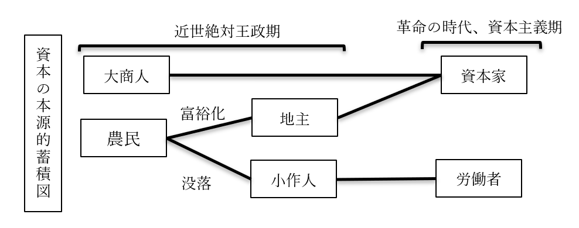
 
<b>～解説ここまで～</b>
  

  
### ○産業資本の拡大
・ところで。「資本」とは一般に、事業や商売を行う際の元手となる資金、資産を指す  
⇒だから例えば「巨大資本」と言ったら「超大金持ち」を指す訳だが、それはカネを溜め込んでいるという意味での「超大金持ち」ではなく、巨額のカネを使って大規模な商売をしている「超大金持ち」である。また、この場合の「超大金持ち」は個人ではなく、会社を指す可能性も高いと言えるだろう  
  
・では、「資本の拡大」と言った場合は、どのような状況を指すだろうか？　産業資本家を例に見てみよう  
  
・一般に、産業資本家が会社を設立し、工場を建設し、労働者を雇用するのは、儲ける為である  
⇒何せ資本主義は、経済活動の自由、自由競争、利潤の追求といったものを肯定する。だから産業資本家も、「作りたい」「売りたい」商品を自由に作ってよいし、自由に売ってよい。また、商品の価格や品質も自分で自由に決め、競い合ってよい。更に、利潤、即ち利益を出す事を目的に商売してよいのだ  
  
・工場で大量生産した商品は顧客に売却され、産業資本家（の会社）の収入となる  
⇒ここから原材料費や人件費、光熱費等々の経費を引いたものが利益、即ち利潤になる訳である  
  
・この利益の一部でも「投資」に回るのであれば、いわゆる「資本の拡大」という状況になる  
⇒即ち、利益を「機械を増設する」「新しい工場を建設する」「新しい社員を雇う」といった形で使う訳である。そうすれば、より多くの商品を作れるようになり、より多くの収入が得られ…端的に言えば、「もっと儲かる」ようになる訳である  
  

<table class="capital-expansion-flow">
  <colgroup>
    <col style="width: 18%;">
    <col style="width: 4%;">
    <col style="width: 10%;">
    <col style="width: 4%;">
    <col style="width: 24%;">
    <col style="width: 4%;">
    <col style="width: 20%;">
    <col style="width: 4%;">
    <col style="width: 12%;">
  </colgroup>
  <tbody>
    <tr>
      <td>工場で商品を作って売る</td>
      <td class="arrow">⇒</td>
      <td>儲かる</td>
      <td class="arrow">⇒</td>
      <td>儲かったカネで工場の機械を増やす</td>
      <td class="arrow">⇒</td>
      <td>より多くの商品を作って売る</td>
      <td class="arrow">⇒</td>
      <td>もっと儲かる</td>
    </tr>
  </tbody>
</table>
  
・マルクス経済学では、このような資本の拡大を説明する際、以下のような言葉を使う  
  
【再生産】：商品の生産を、繰り返し行うこと  
単純再生産：生産規模を拡大せず、同じ規模で再生産を続けること  
【拡大再生産】：得た利益の一部を新たな投資に回し、生産規模を拡大しながら再生産を続けること  
  
### ○産業資本主義の時代の経済観
・先程見たように、産業資本主義の時代、民間の産業資本家は「資本の拡大」を行っている  
⇒「今年は利益が百万円！」「来年は二百万円を目指して機械を増やすぞ！！」とやっている訳である  
  
・では、民間が拡大再生産している間、政府は何をするのか？  
  
・政治分野の復習から始めるのがいいだろう。長い十九世紀に於いて重視された人権は、自由権であった  
⇒復習になるが、革命の時代にしろ、資本の時代にしろ、帝国の時代にしろ、最も重視された人権は「政府は黙って座ってろ」「俺達国民を自由にしろ」の自由権である  
  
・よって、長い十九世紀に於ける理想国家とは、【小さな政府】路線の【夜警国家】である  
⇒国防や治安維持のような、最低限の事しかしない国家を指す言葉が「夜警国家」である。自由権を重視する時代であるから、「何もしない」国家、「何もできない」ぐらい小さい政府が求められるのである  
  
・自由権は、経済的には「俺達にもっと自由に金儲けさせろ」という形を採る  
⇒政治分野第二章で、「経済的自由と言うと、財産権とか、職業選択の自由とか、営業の自由とかがあるよ」という話があったが、その辺の話である  
  
・結果、政府の経済政策として理想とされたのは【自由放任（レッセ・フェール）】であった  
⇒政府が何もせず、自由な経済活動と競争に任せていれば、【「神の見えざる手に導かれて」】経済は発展する…言い方を変えれば、「政府が何もせず、民間を自由にさせておけば、何でかよく分かんないけどとにかく経済は発展する」という考え方が、この時代の経済観なのである  
  
※後に「資本主義の理論」で詳しく述べるが、自由放任政策を主張し、「神の見えざる手」という言葉を使ったのが、誰あろう【『国富論』】を書いた【アダム・スミス】である  

**産業資本主義の時代の経済の基本的な考え方**

|||  
|:----:|:----:|  
|理想の政府|【夜警国家】 【小さな政府】|
|↓の基礎理論提供者|【『国富論』】の【アダム・スミス】|
|理想の経済|【自由放任（レッセ・フェール）】 政府が何もせず、自由な経済活動と競争に任せていれば、【「神の見えざる手に導かれて」】経済は発展する|
|現実の認識|【景気変動（景気循環）】は不可避 【失業者】の発生も不可避
|マル経では↑を…|資本主義経済は［無計画］経済、経済の［無政府］性あり。だから↑のようになる|
  
・上記表にも書いたが、現実問題として、【景気変動（景気循環）】は不可避である  
⇒大雑把に言えば、景気が良くなったり悪くなったりする事を指して「景気変動」や「景気循環」と呼ぶ。これは、資本主義社会に限らず歴史上何度も起きてきたものである。令和八年現在、景気変動をなくす事ができた経済体制は、世界史上ひとつも存在しないと言い切っても言い過ぎではない  
  
・そして、資本主義社会に於いても景気変動が不可避である以上、【失業者】の発生もまた不可避である  
⇒「景気変動が不可避」という事はつまり、不景気になる事もあるという事である。不景気になれば会社が潰れたり、リストラが行われたりするのが世の常である。従って、資本主義社会に於いては（も）、失業者の発生は不可避という事になる  
  
・この二つの不可避の認識は、当時の経済観でも、現代の一般的な経済学でも、変わる事はない  
  
・一方、マルクス経済学は、景気変動の説明の仕方に特色がある  
⇒彼らは、「［無計画］経済」や「経済の［無政府性］」といった言葉を使い、景気変動を説明する。簡単に言うと…  
  
1：資本主義経済では、各企業がそれぞれの判断で商品を生産する  
⇒逆に言えば、政府から「今年はお前の工場で、××という商品を◇◇個作れ！」というような指示は飛んでこない。個々の会社や工場が、自分で判断し、自分で事業計画を立て、商品を生産する  
  
2：但し、全企業が事前に相談し、統一的な計画を立てているわけではない  
⇒各企業は、「これぐらい売れるだろう」とそれぞれ予想し、自由に商品を生産する。マルクス経済学では、このように経済全体を統一する生産計画がないことを、「資本主義経済は［無計画］である」とか「経済に［無政府］性がある」と表現する  
  
３：無計画経済である以上、景気が良くなったり悪くなったりするのは必然である  
⇒国家レベルで計画立ててやってないんだから、当然、「売れると思って沢山作ったけど全然売れなかった」というような場面はいくらでも発生するし、それで大赤字出して潰れる企業も当然、発生する。潰れる企業が多ければ当然、景気は悪くなる。この逆も当然発生し得る訳で、景気変動は論理的に不可避となる  
  
※よって、マルクス経済学においては、失業者の発生もまた、論理的に必然となる  
  
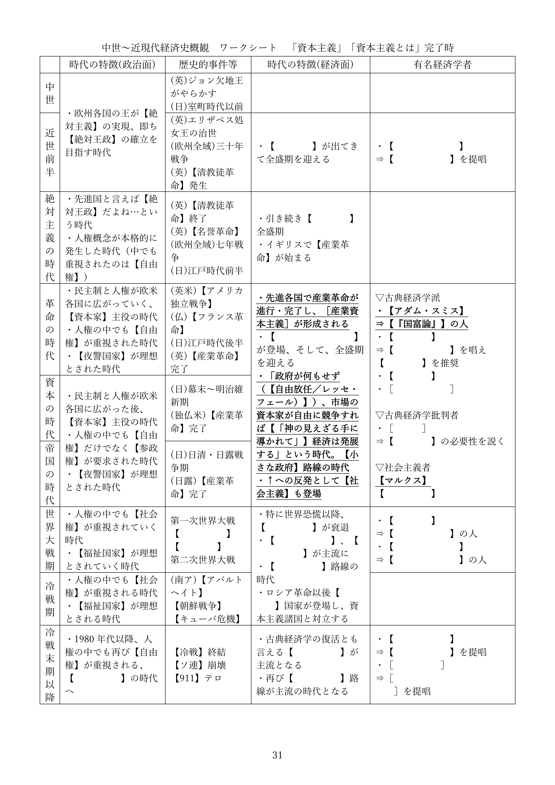  
  
## ●資本主義の修正
### ○概要
・「資本主義社会の基本構造」の冒頭で、以下のように述べた  
  
>・ただ、「資本主義社会」と言っても、時期によって雰囲気は多少異なる  
>⇒例えば、「長い十九世紀」「世界大戦期」「冷戦期」「現代」のそれぞれの社会を見ると、やはり、その在りようは異なる。勿論、全部「資本主義社会」ではあるし、江戸時代の日本から見れば、「全部同じじゃないですか～！」となるぐらいには似ているが…やはり、全く同じではない  
>  
>・本節ではまず、誕生した直後の「資本主義社会」を例に採りつつ、「資本主義」の基本構造を解説しよう  
  
・という訳で、先程まで見てきたのは、基本的には「誕生した直後の資本主義社会」であった  
⇒それが、いわゆる産業資本主義的な社会だった訳である  
  
・今回、「資本主義の修正」では、その後どうなったのか、という点を見ていこう  
  
### ○問題山積  
#### ▽概要  
・政治分野第一章「近世・近代・現代史概略」でも見たが、長い十九世紀の後半は問題山積である  
⇒以下に、簡単に引用してみよう  
  
>・革命の時代が終わった後も、基本的な枠組みは維持された  
>⇒即ち、時代の主役は資本家だったし、人権の中でも特に自由権が大事にされたし、理想国家とは即ち夜警国家を指していた  
>  
>・しかし、自由権の尊重は、厄介な問題を引き起こした  
>⇒資本家の言う「自由」は、結局のところ、自分達に都合のいい「自由」だったのである。例えば資本家層は、以下のような「自由」を行使した  
>  
>例１：労働者を一日に十四時間働かせる「自由」  
>例２：子供であろうとも過酷な労働に従事させる「自由」  
>例３：貧乏な労働者は選挙に行かせない「自由」  
>  
>⇒その癖、金持ちは「貧乏人が貧乏なのは、怠惰で無能だからだ。自己責任である！」と考えるのである。当然、労働者をはじめとする貧困層は、これに対する反動を強めていく事になる  
  
・この手の問題は、言ってみれば、「自由な民主主義社会」の成立と発展に伴うものである  
・そしてこれを経済的な方向から見れば、これは、「資本主義社会の成立と発展に伴う問題」と言える  
⇒この手の問題は勿論、全ての国で同時に発生した訳ではない。例えば世界一産業革命が早かったイギリスなら、革命の時代の末期には発生している。そして、先進国の中では産業革命が遅かった大日本帝国やロシア帝国であっても、帝国の時代末期には、この手の問題が大量に発生するようになっていた  
  
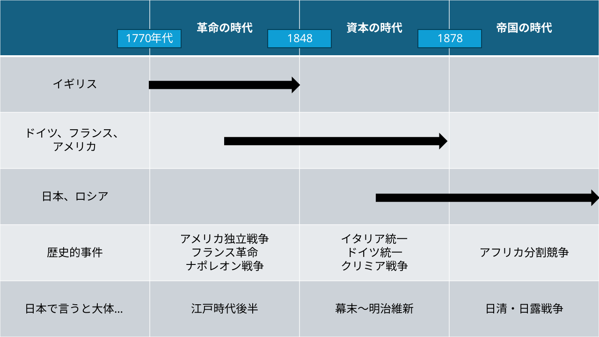  
  
・経済的な観点に絞っても、問題は山積していた。以下にいくつか例を挙げよう  
  
問題例１：貧困問題  
⇒特に都会の貧困問題は、産業革命以前よりも明らかに大規模化・深刻化した。当時は、「工場で働く労働者」ではあるが「家が無い、アパートすら借りられない」という人が大量に発生していた。特にイギリスの首都ロンドンは酷い状況で、今でいう「ネカフェ難民」にあたる人々が大量に発生した。そんな彼らを受け入れたのが「４ペニー・コフィン」や「ペニー・シットアップ」と呼ばれる、劣悪な環境の宿であった  
  
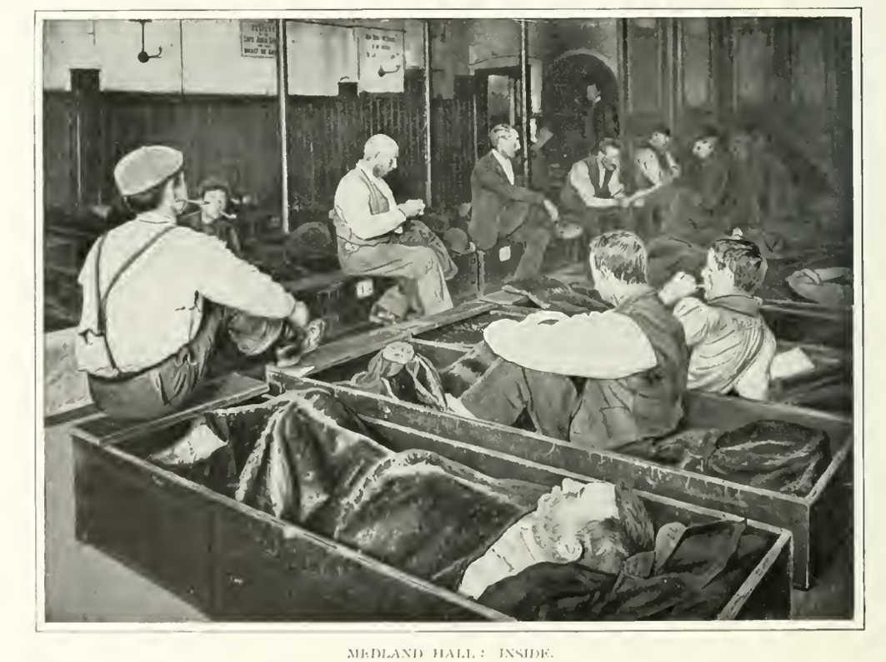
いわゆる「４ペニー・コフィン」。まぁ要するに、棺桶みたいな木箱を並べて、その中で寝る…という宿が「４ペニー・コフィン」である。この時点で、一般読者の皆さんは「なんて酷いんだ！」と憤慨するかもしれないが、これは当時の“ネカフェ難民”の生活水準としてはマシな方で…  
Sims, George Robert, 1847-1922, Public domain, via Wikimedia Commons  
https://commons.wikimedia.org/wiki/File:Living_London;_its_work_and_its_play,_its_humour_and_and_its_pathos,_its_sights_and_its_scenes;_(IA_livinglondonitsw01sims).pdf  
  
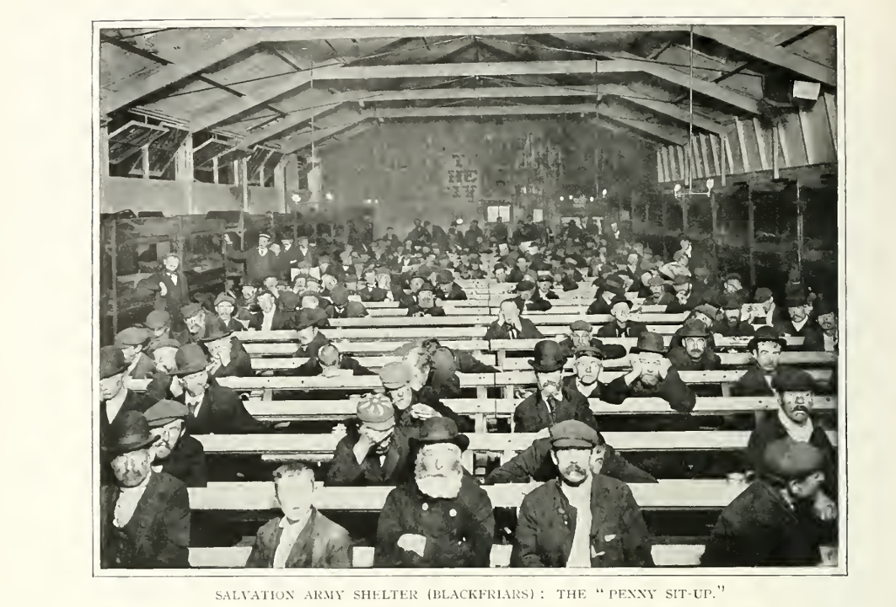
酷いのになるとこんなんである。こちらはいわゆる「ペニー・シットアップ」。見ての通り座って寝る。これももしかしたら長机があるだけマシかもというレベルで、同時代のパリには、「座ったまま、張られたロープへ腕や上半身を載せて眠る」という宿の図版や記録も残っている。  
Sims, George Robert, 1847-1922, Public domain, via Wikimedia Commons  
https://commons.wikimedia.org/wiki/File:Living_London;_its_work_and_its_play,_its_humour_and_and_its_pathos,_its_sights_and_its_scenes;_(IA_livinglondonitsw01sims).pdf  
  
  
問題例２：度重なる不況・恐慌  
⇒恐慌とは、不況の中でも特に酷い不況、即ち大不況を指す言葉である。恐慌と呼ばれるのは、銀行が潰れるような次元のものなので、本当に強烈な不況なのだが…実を言うと長い十九世紀は、恐慌が繰り返し起きている。「十年毎に恐慌起きてないか？」という次元で、繰り返し起きている。有名なものを以下の表にまとめたので、「めっちゃ起きてる…」というのを何となく、感じてほしい  
  
|主な大不況・恐慌|恐慌の中心地|
|:----:|:----:|
|1825年恐慌|イギリス|
|1837年恐慌|アメリカ合衆国、イギリス|
|1847年恐慌|イギリス|
|1857年恐慌|アメリカ合衆国から欧州へ波及|
|1866年恐慌|イギリス|
|1873年恐慌|欧米各国|
|1893年恐慌|アメリカ合衆国|
|1907年恐慌（ニッカーボッカー危機）|アメリカ合衆国から欧州へ波及|
  
問題例３：企業の巨大化  
⇒産業革命が始まったばかりの国というのは、どこも中小企業が多い。しかし長い十九世紀も後半に入ってくると、国の経済すら左右する超巨大企業が出てくる。巨大企業が街全体を所有、経営する例もあった。このような企業の出現は、様々な問題を引き起こす  
  
※現代で例えると…あなたの住む街の働き口が、全てA社のものだったら？　工場も、スーパーも、コンビニも、学校も、全てA社が経営していたら？　相当困るだろう。A社に睨まれたらもう、その町では生きていけないのだ  
  
※この手の超巨大企業の出現による害は、もうちょっと後、「市場の失敗」という節で詳しく解説します  
  
  
#### ▽独占資本主義  
・ところで。マルクス経済学では、先に挙げた問題の中でも、超巨大企業の出現を重視していた  
⇒超巨大企業の出現は、資本主義が新たな段階に入った証拠だと考えるのである。即ち、産業資本主義が［独占資本主義］へと進化した証拠が、超巨大企業の出現だと言う訳である  
  
・まず、産業革命によって誕生したばかりの頃の資本主義社会は、いわゆる産業資本主義の世界である  
⇒産業資本家と呼ばれる金持ちが会社を設立し、工場を建設し、機械を設置し、労働者を雇用して働かせ、商品を大量生産し…以て、儲ける社会である  
  
・産業資本主義の世界は、経済的自由と自由競争の世界でもある  
⇒産業資本家は「作りたい」「売りたい」商品を自由に作ってよいし、自由に売ってよい。また、商品の価格や品質も自分で自由に決め、競い合ってよい  
  
・マルクス経済学では特に「自由競争」が問題とされ、これのせいで超巨大企業は必ず出現する、とする  
⇒一般に、カネを多く持っている企業ほど、大規模な設備投資や値下げ競争を行いやすい。競争に勝った企業は、得た利潤を新たな工場や機械へ再投資し、さらに巨大化していく。また、敗れた企業を買収・吸収することもある。弱い企業の逆転はますます難しくなり、やがて、勝ち続けた企業は超巨大企業となる  
  
・マルクス経済学では、上記のような「勝ち組企業」が拡大する仕組みを、以下の言葉で表現する  
  
［資本の集積］：一つの企業が、得た利潤を再投資することで巨大化する  
［資本の集中］：合併・買収などにより、別々だった複数の企業が一つになる  
  
・こうして出現した超巨大企業を、マルクス経済学では「独占資本」と呼ぶ  
⇒「独占資本」は国の経済さえも支配するほどの存在となる。そのような状態になった資本主義社会、もしくはそういう資本主義の在りようを［独占資本主義］と呼ぶ  
  
・この独占資本主義は、新たな問題を引き起こすだけでなく、既に見たような問題を余計に悪化させる  
⇒そして、資本主義という経済体制そのものが、やがて破綻に至る…という訳である  
  
  
※言うまでもないが、全ての先進国の全ての産業が、「独占資本」と呼ぶべき超巨大企業に支配された訳ではない。確かに「長い十九世紀の序盤と終盤を比べると、序盤の方が中小企業多め、終盤の方が大企業多めだよね？」と言われたらその通りではあるが、それ以上の話ではない  
  
※一方、マルクス経済学では「資本主義社会にはやがて独占資本が出現し、社会を支配する！」「これこそが資本主義の究極にして最後の姿、独占資本主義である！」「ここから資本主義社会は破綻し、崩壊する！」みたいな事を言い出す  
  
### ○修正資本主義の登場
#### ▽概要
・政治分野第一章「近世・近代・現代史概略」でも見たように、世界大戦期になると新しい流行が始まる  
⇒端的に言えば、長い十九世紀の流行は「自由サイコー！」であり、「政府は黙って座ってろ」「俺達国民を自由にしろ」である。しかし世界大戦期になると、自由を多少制限してでも「“みんな”を幸せにしてくれる政府」が求められるようになる  
  
・この手の流行に沿って作られた国家の最たるものがソ連であり、ヒトラー時代のドイツであった  
⇒粛清と虐殺の嵐で少数民族を大量に蒸発させたソ連も、ホロコーストで有名なヒトラー時代のドイツも、結局は「人権とかもういいよ、自由とかもういいよ！」「“みんな”が幸せなのが一番大事なんだろ！」という流行に乗って作られた国家である。まぁ、“みんな”の中に入っていない人達はえらい目に遭った訳だが  
  
・そしてこの流行は、いわゆる「自由主義国家」「民主主義国家」でも大いに流行った  
⇒「自由主義国家」や「民主主義国家」がこの流行を受け入れたものを、公共・政治経済の授業では一般に、【社会権】を重視する【福祉国家】、と整理している。第二次世界大戦後のイギリスや、日本国が典型である。あの自由大好き国家のアメリカ合衆国ですら、この流行の影響を一定量、受けている  
  
・こういった、自由権の制限を許容する流行は、経済にも大きな影響を及ぼした  
⇒即ち、長い十九世紀に於いては、政府は経済に対して「何もしない」を求められた。自由放任（レッセ・フェール）である。一方、世界大戦期になると、「何かしろ！」と言われるようになる。例えば、「今不況なんだったら、景気がよくなるように何かしろ！」と言われるようになる訳である  
  
#### ▽背景と転換点  
・この手の流行の要因として、「近世・近代・現代史概略」では、【ロシア革命】を挙げた  
  
>尚、共産主義（社会主義）者が権力を握った国は例外なく、暴力革命、一党独裁、秘密警察、監視国家…という路線へ進んだ。即ち、「資本家中心の社会を打ち倒し」は「敵対階級の排除」つまり「金持ちを皆殺し」になり、その後の社会は独裁と恐怖政治となり、「革命の裏切り者を殺そう！」系監視国家へと必ず進んだ。言ってみれば、共産主義（社会主義）国家に於ける共産主義（社会主義）は、「金持ちを殺しましょう教」と化した。  
>  
>・上記共産主義（社会主義）が初めて起こした革命がロシア革命であり、初めて作った国がソ連であった  
>⇒この革命によってロシア帝国は滅び、ソヴィエト社会主義共和国連邦（ソ連）が誕生する。そしてソ連は、「金持ちを皆殺し」にし、独裁と恐怖政治を行い、「革命の裏切り者を殺そう！」系監視国家と化した。しかも、世界各国へ「君達も敵対階級を排除しよう！」と宣伝し、スパイを派遣（やる事は「金持ちを殺しましょう」教の宣教）していく。これは第二次世界大戦の原因の一つであり、また、冷戦の原因でもある  
>  
>・当然、ロシア革命及びソ連の「金持ち殺しましょうよ」攻勢に、一般自由主義国家の皆さんは恐怖する  
>⇒何せ、人権だ自由権だとか言って労働者を虐め過ぎたら、金持ち皆殺し国家が誕生したのである。ロシア革命は明らかに、「自由権至上主義はやめましょう」という風潮の誕生に大きな役割を果たした  
  
・無論、要因はこれだけではない。いくらでも挙げる事ができる。例えば…  
  
要因２：そもそも長い十九世紀の間に、金持ちが振り回す「自由」に一般庶民は嫌気がさしていた  
⇒人権の中でも自由権が重視される風潮の中、産業資本家に代表される金持ち達は、労働者を一日に十四時間働かせる「自由」や、子供であろうとも過酷な労働に従事させる「自由」、貧乏な労働者は選挙に行かせない「自由」を行使した訳である。そりゃ「自由」を多少制限してでも、「“みんな”を幸せにしてくれる政府」が求められるようになる  
  
要因３：世界大戦によって、金持ちと貧乏人の間に仲間意識が芽生えた  
⇒平和な時代に於いては、屋敷に住んでいるような金持ちと、貧民街に住んでいるような貧乏人が交流する事は、まぁ皆無とは言わないにせよ非常に少ない。しかし世界大戦では、金持ち・貧乏人の区別なく、同じ「兵士」「戦友」として戦う。結果、金持ちの方が、「貧乏人だろうが俺達の同胞なんだ！」「助けてあげなきゃいかん！」「俺達の自由は多少制限されても構わない！」と思うようになった  
  
要因４：特に都会の貧困問題が深刻だった  
⇒先程、「ペニー・シットアップ」や「４ペニー・コフィン」を見た訳だが…あんな生活を送っていれば、「いや、人権とか自由とかいいから…俺達の生活を何とかしてくれよ」となって当然である  
  
・他にも大量に挙げる事ができる  
・ただ、経済的な面から見て、決定打となったのは【世界恐慌】だと言える  
⇒第一次世界大戦が1914-18。世界恐慌は1929年末。第二次世界大戦は1939-1945。二つの世界大戦の中間地点で起きたのが、世界恐慌である  
  
・1929年末に始まる世界恐慌は、極めて異例、史上最悪と言っていい、とんでもない大不況であった  
⇒既に見たように、長い十九世紀でも、恐慌は繰り返し起きていた。どれも大不況で、会社が潰れたりリストラされたりして、失業者になる人が大量に出た。しかし世界恐慌は、長い十九世紀に起きたどの恐慌とも比べ物にならないほど大規模、かつ深刻な大不況であった  
  

  
<b>～世界恐慌ってどれぐらい凄い不況だったんですか～（クリック・タップして雑談を表示）</b>

  

１：1930年代の大半を通して、アメリカ合衆国の失業率は15％前後かそれ以上。最悪期には25％近く 
⇒例えば失業率20%なら、働いている筈の人の内5人に1人が無職である。この状況を無理矢理今の日本の高校で例えると、仮に30人学級だとして、30人の生徒の内6人前後の家庭で保護者が失業、収入ゼロ…という感じになる。そして、学費が払えず退学、となる生徒も… 
 
２：ドイツ国の被害は特に大きい。一時は失業率が約30%に到達し、会社の倒産も一日平均60以上に 
⇒「倒産」にも色んな種類があるが、全部ひっくるめて言うと、最悪期の1931年には約2万4195件。これを単純に365日で割ると、会社や商店の倒産が、毎日66件あったという事になる 
 
３：大日本帝国も、いわゆる「大卒」の就職率が一時30%台になる大不況に 
⇒この時代の大学生は、旧制専門学校と合わせても16万人ぐらいしかいない。ちなみに、令和三年現在の東京大学、京都大学、慶應大学、早稲田大学、上智大学の在籍者数を全部合わせた数字が16万人行かないぐらい。仮に、現代の日本にはこの五つしか大学が存在せず、その卒業生の就職率が30%台、となると…相当ヤバい不況ですね…… 
 
<b>～本気で世界が終わるんじゃないかって次元の不況です～</b>
  

  
・世界恐慌以降、各国政府は、本格的に経済へ介入するようになる  
⇒長い十九世紀以来、主流の経済学者は、「政府は何もするな」「不況になっても何もするな」と言っていた。「ほっとけばその内よくなる。とにかく政府はなにもするな」という訳で、世界恐慌の時も「何もするな」、即ち自由放任を維持しろと言っていた。しかし、ただでさえ「自由」への反発が強まる中、世界恐慌という極大の不況が発生すると、各国政府はついに、人々の「何かしろ！」という声に従わざるを得なくなったのである  
  
#### ▽修正資本主義  
・ここまで見てきたように、長い十九世紀以来の社会と、特に世界恐慌以降の社会は全く異なる  
⇒公共・政治経済でよく取り上げられる内容を、以下に表としてまとめてみよう  
  
**経済の考え方の変化**  
  
||革命の時代以来の考え方|世界大戦期以降、特に世界恐慌以降出てきた考え方|
|:----:|:----:|:----:|
|重視された人権|【自由権】|【社会権】|
|理想の政府|【小さな政府】路線の【夜警国家】|【大きな政府】路線の【福祉国家】|
|××資本主義|［産業資本主義］|【修正資本主義】|
|↓の基礎理論提供者|【『国富論』】の【アダム・スミス】|［『雇用、利子及び貨幣に関する一般理論』］のジョン・メイナード・【ケインズ】|
|理想の経済政策|【自由放任（レッセ・フェール）】 政府が何もせず、自由な経済活動と競争に任せていれば、【「神の見えざる手に導かれて」】経済は発展する|【ケインズ主義】 政府が市場に介入して、経済を活性化させる（例えば不況の時、好景気になるような経済政策を実施する）|
|備考|【景気変動（景気循環）】は不可避、【失業者】の発生も不可避。政府は、不況だろうが何だろうがとにかく自由放任、何もしない事を求められる|政府は「景気変動の影響を小さくしようとする」「失業者をゼロにしようとする」といった目標に向け、【経済計画】を実施する事を求められる|
|マル経の認識|産業資本主義はやがて独占資本主義に至り、そして破綻、崩壊する|独占資本主義に至った各国が、何とか延命しようと悪あがきしている|
  
・各国政府が自由放任政策を放棄し、経済に介入するようになってからを【修正資本主義】と呼ぶ  
⇒少なくとも日本の公共・政治経済の授業ではこう呼ぶ場合が最も多い。海外の経済学では【混合経済】と呼ぶ場合が多く、近年、公共・政治経済の教科書でも時折見られる表現となってきている  
  
・無論、産業資本主義を採用する社会も、修正資本主義を採用する社会も、どちらも資本主義社会である  
⇒どちらも、「働く人は基本、誰かに雇われて給料を貰い、その金で必要な物を買って生活している」社会である。しかし産業資本主義と修正資本主義ではやはり、毛色が違う。産業資本主義は政府に「何もするな！」と言う社会であり、修正資本主義は政府に「何かしろ！」と言う社会である  
  
・修正資本主義の基礎理論を提供した経済学者は、ジョン・メイナード・【ケインズ】だとされる  
⇒また、「政府は積極的に市場へ介入し、経済を活性化させよう」という考え方を、【ケインズ主義】と呼ぶ事が多い。世界大戦以降、特に世界恐慌以降、各国で採用された経済政策は、後から見ればまさに「ケインズ主義」であった  
  
※何で「後から見れば」なのかと言うと…各国政府が続々と経済に対する本格的な介入を始めた1930年代、当時の先進国首脳の全員がケインズの本を読んでいた訳ではないのである。どちらかと言うと、各国政府が先に「もう流石に黙ってられねぇ、何かやるしかねえ！」と動き始め、後からケインズの理論を見て「ケインズ先生の言う通り！」と理論武装した、という順序である  
  
・修正資本主義下の政府による経済への介入を、【経済計画】と言う  
⇒修正資本主義下の政府は、市場に介入し、経済を“改良”しようとする。その際、政府が計画を立てて経済に介入する…という事で、このように呼ばれる  
  
・【経済計画】の例としては、財政政策、金融政策、市場の失敗への対処を挙げる事ができる  
⇒今全部解説しようとするととんでもない文量になってしまうし、どうせ後で詳しくやるので…今回は代表例として、財政政策の中でも「公共事業」と呼ばれるものを挙げておこう  
  

  
<b>～経済計画の代表例、不況の時に公共事業を増やす～（クリック・タップして雑談を表示）</b>

  

　国がカネを出し、高速道路、ダム、堤防、競技場等々を作る事を指して、公共事業と呼ぶ。修正資本主義的な国家では、不況時に増やすべきものとされている。 
 
　何で不況の時に、国がわざわざカネを出して、高速道路やらダムやら作らねばならないのか？ 
　不況なんだったら、節約すればいいんじゃないのか？ 
　不況なのに何故、ダムやら堤防やら、そんな無駄なものを作るのか？ 
 
　ではまず、不況とはどういう状況か考えてみよう。 
　簡単に言えば、不況とは、国中の会社が儲かっていない状態である。言い方を変えれば、国中の企業の商品が、全然売れていない状態である。 
　逆に言えば、好景気とは、国中の会社がたいへん儲かっている状態である。言い方を変えれば、国中の企業の商品が、飛ぶように売れている状態である。 
 
　よって、不況を脱出して好景気にしたいなら、国中の企業の商品が、沢山売れるようにすればよい。 
 
　ところで、「企業の商品が売れる」というのは、見方を変えれば「誰かが商品を買った」という事である。もうちょっと言えば、「誰かがカネを払って、商品を買った」という事である。 
 
　不況の時は、国中の企業の商品が売れていない。つまり、「誰もカネを払わないし、買わない」。 
　好景気の時は、国中の企業の商品が売れている。つまり、「誰もがカネを払い、買っている」。 
 
　何故、不況の時は「誰もカネを払わないし、買わない」になるのか？ 
　冷静に考えると当たり前である。不況の時は、会社が潰れたりリストラされたりする訳で、失業者が激増する。失業者とは要するに無職であるから、月給ゼロである。月給ゼロの人が国中で大量発生すれば、「カネを払い、商品を買う」をする人の数が減って当然である。 
 
　そこで、公共事業の出番になる訳である。 
　不況になったら、政府は建設会社にカネを払い、ダムや高速道路の建設を発注する。勿論、建設会社の今の社員数ではとても間に合わないように、大規模な工事である。建設会社は、政府から受け取ったカネで新しい社員を雇う。何せ不況であるから、就職したい無職はいくらでもいる。 
 
　結果、公共事業によって、失業者は就職に成功する。就職すれば、「月給ゼロ」から「月給二十万円」や「月給三十万円」に変わる訳である（令和八年現在だったら、大体それぐらいは貰える）。 
 
　「月給ゼロ」が減り、「月給二十万」や「月給三十万」の人が増えれば、当然「カネを払い、商品を買う」をする人の数は増えていく。これは逆から見れば、「企業の商品が、売れるようになった」という事である。 
　それだけではない。ダムや高速道路の建設を受注した建設会社は、工事に必要な鉄、セメント、機械、燃料等を購入する。すると、鉄鋼会社やセメント会社、機械メーカー等々の商品も、「誰もカネを払わないし、買わない」という状態だったところから一転、沢山売れるようになる。 
 
　こうして、商品がまた沢山売れるようになり、国中の企業が「儲かる」ようになっていく。商品が沢山売れるようになれば、景気は回復し、好景気になる筈である。 
<b>～勿論これだけが経済計画じゃないし、不況時にやるべき事でもない。詳しくはまた今度～</b>
  

  
#### ▽ニューディール政策  
・ケインズ主義の実例としてよく挙げられる政策が、アメリカ合衆国の【ニューディール政策】である  
※実施したのは大統領【フランクリン・Ｄ・ルーズベルト】。政治分野では特に第四章の冷戦の歴史でお馴染み、「米国が第二次世界大戦へ参戦した時の大統領」「ソ連が大好きな大統領」「第二次大戦末期に死んだ後、米ソ関係が急速に悪化した」とエピソードが豊富なあの大統領である  
  
・この政策では、政府がカネを出して大々的に公共事業を実施した  
⇒特に有名なのが、［テネシー川］流域にダムを作る公共事業である。米国政府は、この事業の為に一種の国営企業を作り（テネシー川流域開発公社、通称TVA）、世界恐慌で大量に出た失業者を就職させている  
  

  
<b>～実際のところ、どれぐらい効果があったの？～（クリック・タップして雑談を表示）</b>

  

　世界恐慌で未曾有の大不況になった後、各国政府は続々と経済へ介入した。そのやり方はまさにケインズ主義的で、その代表例がニューディール政策…と言われると、「じゃあどれぐらい効果があったの？」となるのは人情である。 
 
　不況対策としてのニューディール政策を一言で総括すると、「効果はあったが、足りない」になるだろう。 
 
　と言うのは、修正資本主義的・ケインズ主義的な、「政府が経済に介入する」によって不景気を好景気に変えたい場合、カネを大量に、ドバドバと注ぎ込む必要がある。ここで尻込みして投入するカネを惜しむと、「効果はあるにはあったけど結局不況のままですよね」になってしまう。 
　ここで、アメリカ合衆国の失業率を見てみよう。 
 
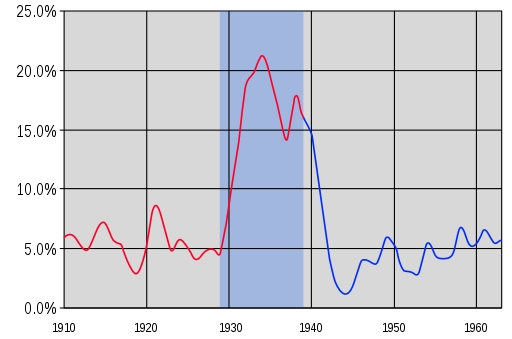 
https://commons.wikimedia.org/wiki/File:US_Unemployment_from_1910-1960.svg 
Pharexia, CC BY-SA 4.0 <https://creativecommons.org/licenses/by-sa/4.0>, via Wikimedia Commons 
 
　基本的に、景気が悪くなると失業率は増え、景気が良くなると失業率は減る。まぁ当たり前である。景気が悪ければ会社が潰れたりリストラされたりで無職が増える訳だから、当然である。よってこのグラフでも、大抵は「失業率の上昇局面：不況」「失業率の下降局面：好景気」と考えられる。 
 
　では改めてグラフを見てみると、アメリカ合衆国は元来、失業率が高くても10%行かない、低いと5%をちょっと割る、ぐらいで推移してきた国だと分かる。そして1920年代の末、即ち世界恐慌が起こるところで急上昇し、一時は失業率が20%を超える訳である。 
 
　この状況で始まったのがニューディール政策である。グラフの1930年代の中盤、失業率が急降下しているところがまさに、ニューディール政策が実施された（例えばテネシー川にダムを作るというので失業者を雇いまくっていた）時期である。 
 
　しかし、失業率が15%を割ったところで、失業率は再び上昇している。 
　これが先ほど言った、「尻込みして投入するカネを惜しむ」である。景気がかなり回復したのを見て、当時の米国は「もう大丈夫だろう」と、それまで続けていた「景気を良くする為に、カネをドバドバ注ぎ込む」という政策にブレーキをかけ始めたのである。 
　結果、不景気に逆戻りしてしまい、失業率も再び急上昇してしまった…という訳である。 
 
　結局、政府による経済への介入は、思い切りが悪いと「効果はあったが、足りない」「効果はあるにはあったけど、結局不況のままですよね」になってしまうのである。これはニューディール政策がまさにそうだったし、何なら、現代日本の第二次安倍政権によるアベノミクス政策もそうであった。 
 
　結局、アメリカ合衆国の経済が完全に復活したのは、第二次世界大戦が始まってからであった。「戦争だから」という大義名分を得てカネをドバドバ注ぎ込んだ結果、米国経済は完全に復活したのである。 
 
<b>～まぁ、思い切ってやり切る、ってのは難しいよね～</b>
  

  
・尚、ニューディール政策は公共事業（ダム建設）ばかり注目されるが、実際には他にも色々やっている  
⇒先にも言ったように公共事業は財政政策に分類されるが、他の政策、例えば金融政策もかなり色々やっている。が、大学受験の問題でも、金融政策について問われる事はほぼない。まぁ金融政策って分かりづらいもんな…金融政策について詳しくは、後々しっかりやります  
  
・一応、ダム建設以外だと、社会政策関係の法律を制定したのは重視される事が多い  
⇒代表例としては失業保険制度（失業しても、一時的に国が生活費を出してくれるから、安心して就職活動してね）や公的扶助制度（現代日本で言う生活保護のような制度）を定めた［社会保障法］や、労働者保護法の［ワグナー法］がある  
  
・ちなみに、［グリーン・ニューディール政策］というものもある。これは年代が全然違うので注意  
⇒2000年代終盤、アメリカ合衆国が、次いで世界中が大不況になった。当時のアメリカ合衆国大統領バラク・オバマは、不景気を好景気に変えるべく、様々な政策を打った。「地球温暖化対策も、景気対策も、両方やる！」という趣がある政策で、F.D.ルーズベルトのニューディールになぞらえ、グリーン・ニューディール政策と呼ばれた  
  
**【ニューディール政策】関係まとめ**  
  
|||
|:----:|:----:|
|実施者|【F.D.ルーズベルト】|
|実施時期|世界恐慌後、1930年代|
|代表政策|［テネシー川］のダム建設 ［社会保障］関連法の整備 ⇒［社会保障法］、［ワグナー法］等|
|後の世で…|［グリーン・ニューディール政策］
  
### ○自由主義の復権、そして…  
・世界大戦期、特に世界恐慌以降に始まった流行は、1970年代（冷戦期の後半にあたる）までは続く  
⇒ここでいう「流行」というのは、「自由権を多少制限してでも“みんな”の幸せが大事」「人権の中では社会権が重視される」「経済的には修正資本主義的、もしくはケインズ主義的」である  
  
・そして、政治分野でも学習したように、1980年代に入るとまた、別の流行が始まる  
⇒1980年代以降、自由権重視・小さな政府賛美の時代が再び始まるのである。大事なところだけ、「近世・近代・現代史概略」から抜き出して以下に示そう  
  
>・冷戦末期となる1980年代、先進各国は大きな変化を経験する  
>⇒この時期になると、先進国各国で「福祉国家路線はもう駄目だ」「やっぱり自由主義が一番！」という声が大きくなってくるのである  
>  
>（中略）  
>  
>・こうして欧米先進国では、反社会権、反福祉国家、反ケインズ的な考え方が流行となった  
>⇒こういった考え方を、まとめて【反ケインズ主義】と呼ぶ場合が多い。一方、反ケインズ主義的な人々が乗った新たな流行は【新自由主義（ネオリベラリズム）】と呼ばれる事が多い  
>  
>（中略）  
>  
>・新自由主義を掲げる人々は、【自由権】を重視した【小さな政府】路線を称賛した  
>⇒【財政赤字】解消、【政治腐敗】の防止等をお題目に、【小さな政府】路線の復活を提唱した。こうして、【自由権】を重視した【小さな政府】路線の国家が、再び人気を得るのである  
>  
>・1980年代に新自由主義を導入し始めた各国の政治指導者としては、以下の者が挙げられる  
>  
>日本国：【中曽根】康弘内閣総理大臣  
>アメリカ合衆国：ロナルド・【レーガン】大統領  
>イギリス：マーガレット・【サッチャー】首相  
>  
>※日本の場合、こういう流れを最初に始めたのは中曾根だが、決定的にしたのは【小泉純一郎】である  
>  
>・また、新自由主義の理論を提供した学者としては、一般にミルトン・【フリードマン】が挙がる  
>⇒新自由主義には様々な流派がある（マネタリズムとか、サプライサイドエコノミクスとか）が、中でも一番有名なのは、【マネタリズム】を提唱したミルトン・フリードマンである  
  
・ここまでの時代の流れをざっくり表にまとめると、以下のようになるだろう  
  
||長い十九世紀|世界大戦期 ～1970年代|1980年代～|
|:----:|:----:|:----:|:----:|
|重視された人権|【自由権】|【社会権】|【自由権】|
|路線|【小さな政府】|【大きな政府】|【小さな政府】|
|代表的な経済観|［産業資本主義］ 【自由放任（レッセ・フェール）】|【修正資本主義】 【ケインズ主義】|【新自由主義】|
|基礎理論提供者|【『国富論』】の【アダム・スミス】|［『雇用、利子及び貨幣に関する一般理論』］のジョン・メイナード・【ケインズ】|【マネタリズム】を提唱したミルトン・【フリードマン】|
  
・尚、上記表に［独占資本主義］という言葉を入れたいのであれば、以下のようにするとよいだろう  
  
産業資本主義：革命の時代～資本の時代  
独占資本主義：帝国の時代～世界恐慌まで  
修正資本主義：世界恐慌～1970年代  
新自由主義：1980年代～  
  
⇒色々言いたい事はあると思うが、時代の変わり目というのはどうしても曖昧にならざるを得ないものである。「ざっくりこんな感じかな」という認識で構わないだろう  
  
・という訳で…1980年代以降、再び「自由」の時代がやってきたのである  
⇒経済の考え方としての新自由主義は、アダム・スミスの考え方と全く同じではないし、100%の自由放任を求める考え方でもない。が、どちらも「自由」を重視し、経済に対する政府の介入を可能な限り減らそうとする…という意味では、非常によく似ている  
  
・そして現代、特に2010年代以降、「自由」への揺り戻しが始まっている  
⇒これも、政治分野で述べた通りである。例えば政治分野第一章「近世・近代・現代史概略」では、以下のように述べた  
  
>過度の経済的自由、過度のグローバル化から、以前何処かで見たような問題が起こっているのが、現代という時代である。例えば、自由権重視の風潮が再来した事により、↓のような自由が行使されるようになってしまった  
>  
>例１：労働者の給料を極限まで減らす「自由」  
>例２：労働者を長時間働かせて残業代も払わない「自由」  
>例３：海外に工場を作って海外の人間を雇い、自国の労働者をクビにする「自由」  
>  
>・結果として、令和八年現在、新自由主義への反発が起きている  
>⇒その象徴が、ドナルド・トランプが合衆国大統領として二度も当選した事実である。彼が当選した理由はいくつもあるが、そのひとつが「アメリカの会社はアメリカに工場を作り、アメリカ人を雇え！」という主張である。これは、（新）自由主義者が信奉する「自由」に真っ向から対立する発言である  
>  
>・現代は流動的な時代である。次の時代の流行がどうなるかは、まだ分からない  
  

  
<b>～ここから雑談～（クリック・タップして雑談を表示）</b>

  

　政治分野第一章「近世・近代・現代史概略」の時もそうだったと思いますが、今回も改めて、「同じ話を繰り返してるなこいつら」と思ったでしょう。その感想は非常に正しい、そう言わざるを得ません。 
 
　それぞれの時代の、主流の経済学者が言ってた事を改めて書き出してみましょう。 
 
　長い十九世紀には、「自由放任こそ正しい！」「政府は経済に口を出すな！」と言っていました。 
　ところが世界大戦期、特に世界恐慌以降は、「自由放任なんて駄目だ！」「政府は経済に介入しろ！」と言い出します。 
　これが1980年代になると、「政府が介入しすぎたから駄目になったんだ！」「もっと自由にしろ！」です。 
 
　そして現代、特に2010年代以降、一般庶民が「自由にしすぎたせいで色々おかしくなってない？」と言い出しています。一部の経済学者も「新自由主義はやりすぎ」と言い出しています。 
 
　何とも忙しい話ですね。 
 
　言うまでもありませんが、論争がある事自体はいい事です。「自由放任こそ正しい！」という人もいていいし、「自由放任なんて駄目だ！」という人もいていいんです。それぞれの学者が理論を構築し、議論を戦わせる事で、学問（この場合は経済学）は発展していきます。 
 
　ただ、気を付けてほしい事がありまして…理論を「信用」する事と、理論を「信仰」する事は違う、という事です。 
 
　例えばマルクス経済学というのは、その理論を「信仰」してしまった人が多い流派です。 
　この流派は、ソ連を始めとした共産主義国家の基礎理論となりましたが、皆さんもご存知の通り、共産主義を採用した国はロクな事になっていません。 
　ソ連は勿論、東欧の共産主義国家は残らず爆発四散しました。中華人民共和国やベトナム社会主義共和国は、共産主義（社会主義）の看板こそ降ろしていませんが、特に経済面は…少なくともマルクスに見せたら「これで共産主義（社会主義）を名乗るな！」とハチャメチャに怒られるでしょう。北朝鮮に至っては最早、共産主義がどうこうとかそういう問題ではありません。 
 
　そう、マルクス経済学（及びマルクス経済学を基礎とした共産主義≒社会主義）というのはまさに、「それ前にやって駄目だった奴じゃん」です。 
 
　ところが、さっきも言った通り、マルクス経済学を「信仰」する人は非常に多かったのです。 
　そういう人達は、共産主義国家が破綻する様子を見ても、「マルクス経済学は間違っていた」とは言わず、「ソ連は正しいマルクス経済学を実践していなかった！」「正しいマルクス経済学なら、絶対に上手くいく！」と主張します。 
 
　勿論、「理論そのものが間違っていたのか、やり方が間違っていたのか」を考える事自体は大切です。理論自体は合ってるのに、その理論を誤解して、間違ったやり方をやってしまった…という可能性は実際、あります。 
 
　しかし、どんな失敗を見ても、「理論は正しいのに、やり方が間違っている」「実行した奴が理論を誤解している」で説明してしまうようになると、もう駄目です。こうなると、その理論は何が起きても「間違いだった」と認める必要がなくなってしまいます。 
 
　これは、理論を「信仰」するあまり、現実を受け入れられなくなると起こる現象です。 
 
　言うまでもなく経済学は宗教ではなく科学（社会科学）です。よって経済学の各種理論も、「信用」する対象であっても「信仰」する対象ではありません。しかし人は、しばしば理論を「信仰」し、神学論争を始めてしまいます。 
 
　これは別に、マルクス経済学に限った話ではありません。古典経済学派（産業資本主義の頃の経済学）だろうと、新自由主義者だろうと、そしてケインズ主義者だろうと、やる時はやります。「俺の言う”正しい話”が理解できないのは、愚かな××主義者だからだ。勉強しろ」という発言を、自然とやってしまいます。 
 
　これは私とて、例外ではありません。私はケインズ主義を支持していますが、「でも、ケインズ主義をやってた筈の欧米先進国は、1970年代に入ると経済がうまく回らなくなってますよね？」「何でですか？」と言われると、どうしても「ちゃんとケインズ主義をやってないから」と言ってしまいがちです。 
　また、私自身、「新自由主義」や「共産主義」といった単語を、無意識の内に「邪悪」「無能」「失敗作」というような意味で使ってしまいがちです。意図せず、自然に、「こいつは所詮新自由主義者だから」という決め付けをしてしまう事があるのです。 
 
　こういう「信仰」の問題は、経済学に限った話ではありません。政治学でも、歴史学でも、教育学でも…何なら日常生活でも同じです。 
 
　だから時折、立ち止まって考える事は大切です。「自分は今、目の前の事実を事実として受け入れ、考えるようにしているか？」「最初から決めていた結論に、後から理屈をつけて正当化するような真似をしているのではないか？」と自分自身を疑ってみるのは大切な事でしょう。 
 
　特に頭のいい人ほど、偏差値の高い人ほど、社会的に偉い人ほど気を付けた方がいいですよ。そういう人は、理屈を考えるのが得意なのだから。誰でも「信」じられるような、見事な理屈を考えられてしまうんですからね。 
 
<b>～ここまで雑談～</b>
  

  
  
  
## ●資本主義の理論  
・資本主義の経済理論について、時系列順に見ていく  
※尚、軽くだが、資本主義以前の経済理論についても取り扱う  
  
### ○資本主義以前  
・絶対主義の時代に於いて、欧州経済は、基本的に【重商主義】経済であった  
⇒重商主義の歴史は長く、誰か一人が作り上げた理論でもないので、重商主義と一口に言っても多種多様である。ただ、「国が商工業を支援してカネを沢山儲ける」という点は全ての重商主義に共通している、と言える  
  
・重商主義を唱えた有名人から一人挙げるなら、イングランド王国の【トーマス・マン】であろう  
⇒重商主義の中でも特に【貿易差額主義】を提唱した男。要するに、自国の商工業を保護したり育てたりして、輸入よりも輸出の額を大きくすれば儲かるよね、というもの  
  
・重商主義の後の経済理論というのは、重商主義への批判を伴って出てくる  
⇒重商主義は基本、「国が商工業を支援する」類のもの。つまり、国が経済活動に口を出す類のものである。一方、誕生したばかりの資本主義は、自由権の重視と共に「国は民間の経済活動に口を出すな」「俺達にもっと自由に金儲けさせろ」という形で出てくる  
  
・［重農主義］も、重商主義への批判を伴って出てきた理論である  
⇒名誉革命後フランス革命以前の時期に、「富の源泉は農業にある」として自由放任を唱えた。この自由放任の発想は、資本主義思想にも影響を与えている  
  
### ○古典派経済学  
・フランス革命に前後して自由放任による資本主義を唱える経済学者が次々と登場する  
⇒一般には、これを近現代経済学の誕生とし、この時期の経済学者達を、【古典（派）経済学者】と呼ぶ。革命の時代に誕生した古典派経済学は、少なくとも帝国の時代までは、世界で最も「正しい」経済学として君臨する事になる  
  
※古典経済学者としてこの後紹介する人物は、一番年下の人でも資本の時代までには死んでいるが、彼らの理論は彼ら自身より長生きであった  
  
#### ▽アダム・スミスと古典経済学の楽観性  
・古典派経済学でいの一番に出てくるのは、やはり【アダム・スミス】である  
⇒主著は【『国富論』】。いわゆる【「神の見えざる手」】発言の人である  
  
・彼の理論の骨子、そして古典経済学の骨子は、その楽観性によって特徴づけられる  
⇒「皆が最善の努力をすれば、社会全体が理想の形になる」、もうちょっと言えば、「頑張って働けば報われる」というプロテスタント的な考え方である  
  
・この楽観性は、【自由放任】主義や［セー（セイ）の法則］によって代表される  
  
１：【自由放任】主義  
⇒政府が何もせず（つまり【自由放任（レッセ・フェール）】）、市場の資本家が自由に競争すれば【「神の見えざる手に導かれて」】経済は発展する  
  
２：［セー（セイ）の法則］  
⇒お堅い言い方をすると、「需要と供給は［自動調節］される」というものである  
※噛み砕いて言えば、「頑張って沢山商品を作りなさい。そうすれば何処かの誰かが買ってくれる」というものである。古典経済学では、「いや、沢山商品作っても、買う側にカネがなかったら売れないんじゃねぇ？」とは考えない。「頑張って働けば報われる」というプロテスタント的な楽観性が、古典経済学の特徴である  
  
#### ▽デイヴィッド・リカード  
・他にも有名な古典経済学者はいる。例えばデイヴィッド・【リカード】である  
⇒主要著書は【『経済学および課税の原理』】  
  
・リカードは【自由貿易】を擁護する【比較生産費説】を展開した  
⇒アダム・スミスの「自由競争すれば経済はよくなる」論を、世界全体に拡大したもの。世界中で自由に競争すれば経済はよくなる、だから自由貿易をしよう、という考え方  
  
・また、【労働価値説】も提唱した  
⇒商品の価格は、商品の生産に必要な労働力で決まる（労働者の賃金で決まる）、というもの  
  
※この人はアダム・スミスと並んで特に重要な古典経済学者である。中でも比較生産費説が非常に重要で、かつ大学受験でも、比較生産費説をお題にした計算問題は頻出。後で問題演習をやるので、そこで具体的に学習しよう  
  
#### ▽トマス・ロバート・マルサス  
・著名な古典経済学者ではあるが、一風変わった部分が有名なのは【『人口論』】の著者である  
⇒即ち、トマス・ロバート・【マルサス】である  
  
・以前から言っているように、「先進国では普通、飢饉は起きない」は［緑の革命］以降の話である  
⇒［緑の革命］は、1940年代から1960年代にかけて起こった、農業技術の一大進歩を指す。緑の革命以前の農業というのは極めて貧弱であり、先進国でさえ、ちょっと人口が増えすぎるとすぐ飢饉になるような有様であった  
  
・欧州諸国が、欧州の外を征服し植民地にしていったのも、農業の貧弱さが理由の一つである  
⇒緑の革命以前は、どんな国でも、人口がちょっとでも増えると「食糧が足りない～」となる。であれば、他国の土地を征服し、余った人間をそこへ「捨てる」必要が出てくる。だから「海外領土」や「新領土」ではなく「植民地」と呼ぶのである  
  
・マルサスは、この事をズバリ『人口論』で指摘した人物として有名である  
⇒その論旨をお堅い言い方で表せば、「人口は［幾何（等比）］級数的に増加するのに対し、食糧は［算術（等差）］級数的にしか増加しない」となる。まぁ要するに、「人口ってのはアホみたいに増えるけど、農作物の収穫量は全然増えねぇぞ」と言ったのである  
  
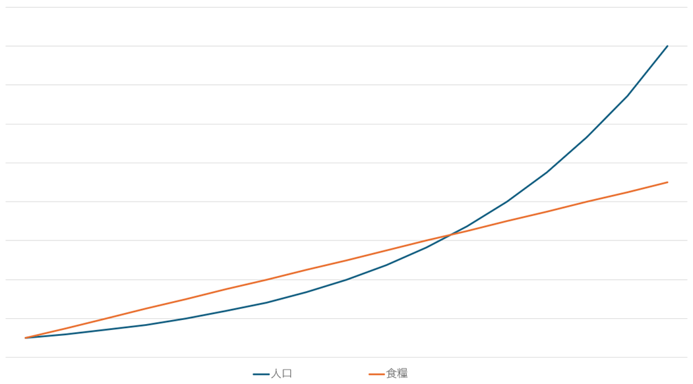  
トマス・ロバート・マルサスの言う「人口は［幾何（等比）］級数的に増加するのに対し、食糧は［算術（等差）］級数的にしか増加しない」をグラフで表したもの。彼は、人口と食糧では増え方が全然違う、という事をこうやって指摘したのである。  
  
※マルサスは更に、「社会保障をやめて貧乏人を死なせるとか、戦争やって人を死なせるとか、そうやって人口を調整しないと、人口爆発からの農作物不足で人類社会が破裂しますよ」というような事も言っている人である。これも結局、古典経済学が自由権を重視するところから来ている。自由権を重視するからこそ「頑張れば報われる」という楽観性を持つし、貧乏人に対して「頑張ってないから報われないんだ」「無能で怠惰な人間が貧乏なのは自己責任」となるのである   
  
#### ▽ジョン・ステュアート・ミル  
・古典派経済学最後の巨人と言えるのが［ジョン・ステュアート・ミル（J.S.ミル）］である  
⇒主著は［『経済学原理』］。公共の倫理分野や倫理の授業では、「ジェレミー・ベンサムの功利主義を改良した哲学者」「『自由論』を書き、自由権の重要性を主張した」といった方面から紹介される人物である  
  
・経済分野に於いては、彼は、「リカードの論を批判しつつも、更に発展させた人物」として扱われる  
⇒例えば労働価値説について、商品の価格は労働者の賃金だけでは決まらない。としている。彼は、［賃金、地代、利潤］の三要素が商品の価格を決める、と主張している  
  
※正直この人は、公共や政治経済の経済分野では、「名前だけ出てくるけど何した人かまではやらない人」ぐらいの扱いである。どちらかと言うと、「この人公共の倫理分野とか、倫理で出てきたよね！」「実は経済学でも有名なんだよ！」というので名前だけ出てくる…みたいな扱いが多い  
  
### ○古典派経済学の批判  
#### ▽概要  
・ちなみに、古典経済学華やかなりし時代からして既に、古典経済学が全肯定されていた訳ではない  
・ある意味J.S.ミルも、古典派経済学の批判者という面がある  
⇒例を挙げれば、弱者救済とかやらなきゃいかん、と言っている。マルサスは弱者を死なせてでも人口調節しなきゃ、と言ってた訳で…  
  
#### ▽フリードリヒ・リスト  
・ここでは批判者として、フリードリヒ・［リスト］を挙げたい  
⇒ドイツ南西部のヴュルテンブルク公国生まれ。主著は［『経済学の国民的体系（政治経済学の国民的体系）』］  
  
※フランス革命と同年に生まれ、革命の時代が終わる直前に死んだ経済学者。長い間小国に分裂していたドイツが統一に向かいつつも、まだ統一されていない、ぐらいの頃の人物である  
  
・彼は、古典経済学で最良の貿易として主張された、自由貿易を批判した人物である  
  
・この自由貿易、実は、いつの時代何処の地域でも、経済的に強い国は主張するものである  
⇒何故か？　まず経済的に強い国と弱い国がどう違うかから考えてみよう  
  
経済的に強い国：高品質な製品を比較的低価格で生産できる  
経済的に弱い国：同じ品質のものを作れなかったり、作れても価格が高かったりする  
※例えば令和の日本国は、高品質な自動車を安く作れる。では、車なんか作った事もない発展途上国が「うちの国でも国産自動車作るぞ！」と言って新しく工場を作ったら？　…という話である  
  
・このような違いがあるからこそ、経済的に強い国は、自由貿易をやれば一方的に儲かるのである  
⇒自由貿易とは要するに、「どの国がどの国へ輸出しても自由」である。そりゃ強い国は自由貿易を主張するに決まっている。強い国の商品は安くて高品質なのだから、輸出すればするほど売れる。そして弱い国の国産品は売れなくなり、国内の産業は死ぬ  
  
・こういう現実を受けたリストは、「最強国家以外は［保護貿易］が必要」としている  
⇒経済的に弱い国でも自由貿易が行われてしまうと、その国では国産品は売れなくなり、国内産業が死ぬ。これを防ぐには保護（高い関税をかける、輸入数量を制限する等）が必要だ、という論である  
  
※関税は、輸入品にかけるもの。これを高く設定すれば、「本来なら輸入品の方が安いのに、高い関税がかかってるせいで国産品の方が安い」という状況も作れる  
  
・ちなみに。保護貿易をする方法は主に二種類ある  
１：［関税］障壁。高い関税をかけて、輸入品の値段を上げるもの  
２：［非関税］障壁。［輸入数量］を制限したり、［入関］手続や［検疫］手続を複雑化したりする  
  
### ○修正資本主義下の理論  
#### ジョン・メイナード・ケインズ
・修正資本主義下（福祉国家期）第一の経済学者は、やはりジョン・メイナード・【ケインズ】である  
・代表作は［『雇用、利子及び貨幣に関する一般理論』］  
  
・ケインズの理論と古典経済学で一番違うのは、【需要】と【供給】どちらを重視するかである  
・古典経済学は「商品を作れば作るほど売れる」という立場  
⇒セーの法則なんかまさにこれ。供給が増えれば需要も拡大する、という考え方  
  
・「買う側に金がねぇのに商品増産したって、売れる訳ねぇだろ」と言ったのがケインズである  
・故にケインズ主義では、需要を重視する  
⇒より正確に言えば、「消費者がきちんと金を払える」という前提に立った、健全な需要。そういう需要が増えれば、合わせて供給を拡大していけばいい、という考え方である。このような需要を、【有効需要】という  
  
・修正資本主義下（ケインズ主義下）の大きな政府は、政府が市場に介入する  
・主なところでは、公共事業を行う。国が金を出して高速道路とかダムとか競技場を作る  
・何故こんな事をするのか？　勿論、有効需要を増やす為である  
  
・例えば、国が金を出して高速道路を作る事とし、人々は高速道路を作る会社に就職する  
・人々は職を得て給料が支払われるので、モノを買えるようになる  
・これは見方を変えれば、需要が生まれるという事でもある  
・だから商品の供給を増やしても、ちゃんと売れる  
・商品が売れるのであれば、景気はよくなるし、新しい会社を作ろうという機運も出てくる  
・そうなれば新しい雇用が生まれて、そこに就職した人はまた給料を得てモノを買えるようになる  
・つまり需要が生まれるので、商品の供給を増やしても問題なくなり…と、後は繰り返し  
⇒こういうのをケインズは、一つの公共投資が［呼び水］となって他の投資に拡大する［乗数］効果によって景気が回復する、と表現した  
  
・また、商品の価格についても、需要が大事だとしたのがケインズである  
・古典経済学では、リカードが労働価値説を唱え、J.S.ミルは価格を決める三要素を唱えた  
⇒どちらも、供給側の視点からのみ商品の価格を論じた  
  
・一方ケインズは、【限界効用価値説】を唱えた  
⇒要するに、「作るのにどんなにカネがかかってたって、需要がなきゃ売れないんだから、値段下げるでしょ」「って事はつまり、商品の価格を決めるのは需要だよ」という理論  
  
・他にケインズの行った古典経済学批判としては、失業者関係がある  
・古典経済学は楽観的なので、失業者問題についても楽観的だった  
⇒「皆が最善の努力をすれば、社会全体が理想の形になる」というのがねっこにあるので、「自由競争で皆が最善の努力をすれば、【完全雇用】が達成される」という風に考えていた。失業者が出るのは、努力が足りないと。ちなみに完全雇用とは、全国民が仕事を持っていて失業者がいない状態の事  
  
・一方ケインズは、自由放任の資本主義で不況が起こるのは当然とした  
・そして、不況になれば解雇される労働者が出るのも当然とした  
⇒こういう失業を、【非自発的】失業と呼ぶ。本人はまだ働きたいのに解雇された、というもの  
  
・だからケインズは、公共事業等で雇用を創出しないと完全雇用にはならないよ、としたのである  
  
#### ヨーゼフ・アロイス・シュンペーター
・尚、ケインズとほぼ同時期の経済学者で、ヨーゼフ・アロイス・【シュンペーター】という人がいる  
・この人は、経済に於いては【イノベーション（技術革新）】が一番大事だ、とした人である  
・即ち、イノベーションによって、古いやり方が破壊され、新しいものが生まれる  
・これを創造的破壊と言うが、イノベーションによる［創造的破壊］によって、景気は上向く  
・逆に、イノベーションがなくなると、不景気になる…このように考えた  
  
・この人は、現代日本に於いて、経済学と言うよりは経営学的に重要な人物である  
・企業の経営者が「イノベーションだ」とか言ってるのをよく見かけるだろう  
・イノベーションが無ければ企業は生き残れないとか、そんな事を言っている筈である  
・その経営者自身、何でイノベーションとか言ってるのか、よく分かっていないだろうが…  
・実は、彼らの言うイノベーションは、シュンペーターの理論が元になっているのである  
⇒実際、シュンペーターはイノベーションによる創造的破壊が無ければ、企業は生き残れないと言っている  
  
・ここからは雑談だが、シュンペーターの言うイノベーションとは、単なる技術革新だけではない  
・以下に挙げる全てを指して、イノベーションと呼んでいる  
  
１：新しい生産物の創出  
２：新しい生産方法の導入  
３：新しい市場・販路の開拓  
４：商品の材料となる、新しい資源及びその供給源の獲得  
５：新しい組織の実現  
※こういうのを知らずにイノベーションイノベーションって譫言のように繰り返すようになると、中身のない意識高い系になっちゃうから気を付けよう！  
  
### ○1980年代以降の理論  
・ケインズ自身は、公共事業とかで不況を脱した後は、増税とかでブレーキをかけろと言っていた  
⇒不況の時こそ、国債をバンバン発行して国家財政を大赤字にして、公共事業をバンバンやりまくる。景気がよくなったら、公共事業を減らしたり増税したりして国家財政を黒字にしろ、みたいな事を言っていた。いわば、「不況時は不況対策をしろ」「好景気の時はブレーキをかけろ。どうせいつかは不況になるんだから、景気を良くしてばっかだと不況になった時とんでもない大恐慌になるぞ」と言っていたのがケインズ  
  
・が、ケインズ主義を採用し福祉国家を目指した各国は、好景気になっても経済政策を変えなかった  
⇒例えば、不況を脱しても大規模な公共事業をやり続けた  
  
・そうなってくると、問題が出てくる  
・一つは、【財政赤字】が発生する事である  
⇒単年度の税収より、支出が多い状態。足りない分は国債を発行して補填する事になる  
※不況の時も好景気も財政赤字だと「この国永遠に赤字だな」になる  
※無論、「ずっと赤字でいいんだ」という人もいるが、「国がずっと赤字なのはよくない」という人は多い  
  
・そしてもう一つが、【インフレーション（インフレ）】の問題である  
・細かい話は後でやるが、「物価が上昇する」事をこう呼ぶ  
・逆に物価が上がらない事を【デフレーション（デフレ）】と呼ぶ  
・そして、一般に経済学では「適度なインフレの時は好景気になる」とされている  
・しかし1970年代頃から、「インフレなのに何故か景気が悪くなる」という状況が出てきたのである  
⇒こういう「インフレなのに何故か不景気」を、【スタグフレーション】と呼ぶ  
  
・この状況で、「やっぱり古典経済学みたいなやり方が正しい！」という人達が出てきた  
⇒「上り調子の時はほっとく」「好景気の時は、調子に乗り過ぎて世界恐慌みたいな事にならないような政策をする」「不景気の時は、景気が上向くような政策をする」みたいにすればいいのに、そうはならない。「公共事業とか、政府がカネを出して景気を刺激するやり方は間違っている！」「自由放任最高！」という人達が出てくるのである  
  
・こうして、【反ケインズ】主義を掲げる［新自由主義］［新保守主義］が出てくる  
⇒この主義を実際に採用したのが、日本なら【中曾根康弘】首相、米国ならロナルド・【レーガン】大統領、英国ならマーガレット・【サッチャー】首相である  
  
・反ケインズ主義の有名どころでは、［サプライサイドエコノミクス］がある  
・そのまんま、「供給側の経済学」という意味  
・名前から分かるように、需要を重視したケインズ主義を批判し、古典経済学を現代風にリバイバルした  
・サプライサイドエコノミクスでは、［減税］や【規制緩和】による自由競争の奨励を骨子とする  
  
・サプライサイドエコノミクスを提唱したので有名なのがアーサー・ベッツ・ラッファーである  
・また、実施したので有名なのが、アメリカ合衆国大統領ロナルド・【レーガン】である  
⇒［新冷戦］期の大統領。［戦略防衛構想(SDI)］を提唱した人  
  
・ただ、レーガン時代の米国は赤字のままだった  
・何せ、彼は減税と規制緩和をした一方で、SDIをやった人である  
・SDIに対抗しようとしたソ連が破産するぐらい、軍隊にカネをかけた人物である  
・更に、当時のアメリカ合衆国は輸入超過の状態で、貿易赤字だった  
・軍事費による［財政赤字］と［貿易赤字］による【双子の赤字】により、赤字のままとなったのである  
  
・また、同じく反ケインズ主義の有名どころとして、【マネタリズム（新貨幣数量説）】がある  
・提唱したのはミルトン・【フリードマン】  
⇒［完全雇用］は無理。ある程度の［自然失業］は仕方ない、つまり、ある程度失業者がいるというのは自然な事だから、これは仕方ないと諦めよう、と考えた人  
  
・マネタリズムでは、「物価とか経済成長は、貨幣の流通量で決まるよ」と考える  
・故に、市場に流通する貨幣の数を適切に操作できれば、経済は安定してよくなる、という立場  
※市場に流通する貨幣の総量を、［マネーサプライ（通貨供給量）］とか［マネーストック］という  
  
・身近なところの例としては、2016年からの日本は金融政策で景気をよくしようとしていた  
⇒金融政策とは要するに、マネーストックを弄ったり、金利を弄ったりする事  
・じゃあどうなりましたかと言うと、お察しください  
・結局、金融政策だけじゃ駄目で、公共事業等による雇用の創出をしないと、どうにもならないのである  
  
  
  
## ●比較生産費説問題演習
### ○問題
（法政大学法国際キャリア平成二十七年）  
  
　下の表は甲国と乙国において、工業製品と農産品をそれぞれ1単位生産するのにどれだけの労働が必要かを表している。この表の内容にもとづいた以下の文章を読み、後の問いに答えよ。ただし、議論を簡単にするため、工業製品および農産品の生産は労働以外の生産要素を必要としないものとする。  
  
||工業製品|農産品|
|:----:|:----:|:----:|
|甲国|2|2|
|乙国|8|4|
  
　工業製品に関しては、(a)国のほうが4倍生産性が高くなっている。同様にして、農産品については、(a)国のほうが2倍生産性が高くなっている。このように、(a)国のほうが工業製品と農産品のいずれについても高い生産性を誇る場合において、各国はどちらか一方の生産に特化したほうが良いのであろうか。それとも両方とも生産したほうが良いのであろうか。  
　農産品の生産量を1単位減らしたときに生産できる工業製品の量は(b)国のほうが多い。逆に、工業製品の生産量を1単位減らしたときに生産できる農産品の生産量は(c)国のほうが多い。このようなとき、(b)国は工業製品に、(c)国は農産品に比較優位を持つという。  
　このような比較優位の構造があるとき、(b)が工業製品、(c)国が農産品の生産に特化することで、両国を合わせた生産水準を高めることができる。これは、(b)国において労働者(d)単位を農産品の生産から工業製品の生産に移すと同時に(c)国において労働者(e)単位を工業製品の生産から農産品の生産に移すことで、工業製品の生産量の合計を変化させることなく農産品の生産量の合計を(f)単位増加させることから確認できる。このとき、両国ともが、自国が比較優位を持つものの生産に特化した上でお互いに貿易を行うことで、貿易の利益を享受できる。  
　例えば、甲国には労働が20単位あり、乙国には労働が60単位あり、貿易が行われるか否かに関わらず各国の労働はどちらかの製品の生産に余すところなく投入される状況を想定してみる。貿易が行われない場合、いずれの国でも、自国で生産した量の工業製品と農産品を自国で消費することになる。ここでは、いずれの国でも、貿易が行われない場合には工業製品が5単位ずつ生産され、消費されるものとする。  
　各国が比較優位を持つものの生産に特化すると、(b)国では工業製品が(g)単位生産され、(c)国では農産品が、(h)単位生産される。その上で、(b)国で生産された工業製品5単位が(c)国で生産された農産品8単位と交換される形で貿易が行われると、各国とも消費できる工業製品の量は変化しないが、消費できる農産品の量は、(b)国で(i)単位増加し、(c)国で(j)単位増加する。  
　以上の結果は、適切な交換比率で貿易が行われると、両国の経済水準がともに改善されるということを意味している。  
  
問１：(a)~(c)に当てはまる国名の組合せとして適切なものを次のア~エから一つ選び、その記号を解答欄にマークせよ。  
ア：(a)甲　(b)乙　(c)甲  
イ：(a)甲　(b)甲　(c)乙  
ウ：(a)乙　(b)乙　(c)甲  
エ：(a)乙　(b)甲　(c)乙  
  
問２：(d)と(e)に当てはまる数値の組合せとして適切なものを次のア~エから一つ選び,その記号を解答欄にマークせよ。  
ア：(d)2,(e)4	イ：(d)4,(e)2	ウ：(d)2,(e)8	エ：(d)8,(e)2  
  
問３：(f)に当てはまる数値として適切なものを次のア~エから一つ選び、その記号を解答欄にマークせよ。  
ア：0.5		イ：1		ウ：2		エ：4  
  
問４：(g)と(h)に当てはまる数値の組合せとして適切なものを次のア~エから一つ選び、その記号を解答欄にマークせよ。  
ア：(g)10,(h)15		イ：(g)10,(h)7.5  
ウ：(g)40,(h)480		エ：(g)40,(h)240  
  
問５：(i)と(j)に当てはまる数値の組合せとして適切なものを次のア~エから一つ選び、その記号を解答欄にマークせよ。  
ア：(i)8,(j)7	イ：(i)5,(j)4	ウ：(i)3,(j)2	エ：(i)7,(j)10  
  
  
### ○解説  
  
#### 模範解答  
問１：イ　　問２：ウ　　問３：イ　　問４：ア　　問５：ウ  
  
  
#### 総論  
・リカードの比較生産費説を使った計算問題  
・…と言うか、現代文＋算数の問題  
・この手の問題は受験で頻出な上、初見だと大体解けない  
・この問題は恐らく、同種の問題の中では最上級に難しいので、ここで慣れておこう  
・また、比較生産費説を理解するのに役立つ問題でもある  
  
・まずこの手の問題に限らないが、問題文をちゃんと読む事  
・空欄や下線部と、その周辺だけしか読まない人が結構いるのだが…  
・特に政経は「これ現代文だろ」というような問題が多く出る  
・だから問題文をちゃんと読まないと解けない問題というのも多くなってくる  
  
・さて、問題文を読んでみると、「甲国と乙国において、工業製品と農産品をそれぞれ1単位生産するのにどれだけの労働が必要か」という表があるのだが、これが分かりづらい  
  

  
・何が分かりづらいって、まず「１単位」という言い方が分かりづらい  
・要は、本当なら「甲国で工業製品を1000個作るのには、200人の労働者が必要」みたいな話なのだが…  
・それだと計算が面倒になるから「甲国で工業製品１単位作るのには、労働力２単位が必要」と言っている  
・そのせいで逆に、分かりづらくなってしまっている  
・だからこんな（↓）風に考えてやればいい  
  
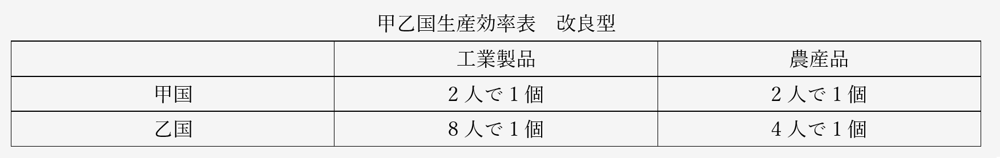
  
・甲国では、工業製品は２人で１個作れる。農産品も２人で１個作れる  
・乙国では、工業製品は８人いれば１個作れる。農産品は４人いれば１個作れる  
・こう考えればいいのだ  
⇒工業製品や農産品といった商品も、労働者も、両方「単位」という言い方で数えているので、こんがらがってしまうのである。この後の問題文では「××を△単位減らす」みたいな文章がちょくちょくでてくるが、その「△単位」が「個」なのか「人」なのか考えながら解いていこう  
  
  
#### 問１  
・では、問題文の続きを見てみよう  
  
`工業製品に関しては、(a)国のほうが4倍生産性が高くなっている。同様にして、農産品については、(a)国のほうが2倍生産性が高くなっている。`  
  
・工業製品に関してみれば、甲国は２人で１個作れるに対し、乙国は１個作るのに８人も必要である  
・つまり、甲国の方が８÷２＝４で４倍、効率的である（生産性が高い）  
・同様に農産品も、甲国は２人で１個作れるのに対し、乙国では１個作るのに４人必要である  
・つまり、甲国に法が４÷２＝２で２倍、効率的である（生産性が高い）  
・こうなると、(a)が甲国なのは確定である  
  
・ついでに言うと、工業製品を作るにせよ農産品を作るにせよ、甲国の方が絶対的に優位な訳だ  
・こういうのを絶対優位と言うのだが、デイビッド・リカードが言いたかったのは比較優位である  
・では、比較優位は、何を問題にするのか？  
  
`このように、(a)国のほうが工業製品と農産品のいずれについても高い生産性を誇る場合において、各国はどちらか１方の生産に特化したほうが良いのであろうか。それとも両方とも生産したほうが良いのであろうか。`  
  
・(a)国（甲国）のような絶対優位にある国は、工業製品も農産品も輸入する必要はなさそうに見える  
・だが本当に、そうなのか？  
・例えば甲国が工業製品を全力で作って、農産品を輸入する  
・そういう風な事をした方が、経済がよくなる可能性はないのか？  
・このあたりに切り込んでいくのが、比較生産費説である  
  
`農産品の生産量を1単位減らしたときに生産できる工業製品の量は(b)国のほうが多い。逆に、工業製品の生産量を1単位減らしたときに生産できる農産品の生産量は(c)国のほうが多い。このようなとき、(b)国は工業製品に、(c)国は農産品に比較優位を持つという。`  
  
・はいここ、ちょっと難しい  
  

  
・農産品は、甲国では２人で１個、乙国では４人で１個作れる  
・そして農産品を１個（１単位）、作るのをやめて、人員を工業製品の生産に回す  
・すると、甲国では２人、乙国では４人、工業製品の増産に回る事になる  
  

  
・こうなる訳である  
・このように、農産品の生産を諦めて工業製品に集中した場合、甲国の方が効率的である  
  
・では、逆の場合はどうか？  
・工業製品は、甲国では２人で１個、乙国では８人で１個作れる  
・そして農産品を１個（１単位）、作るのをやめて、人員を農産品の生産に回す  
・すると、甲国では２人、乙国では８人、農産品の増産に回る事になる  
・そして農産品は、元々、甲国では２人で１個、乙国では４人で１個作れたので…  
  

  
・こうなる筈である  
・このように、工業製品の生産を諦めて農産品に集中する場合は、乙国の方が効率的である  
・比較生産費説というのは、ここが核心なのだ  
  
農産品の生産量を1単位減らしたときに生産できる工業製品の量は(b)＝甲国のほうが多い。逆に、工業製品の生産量を1単位減らしたときに生産できる農産品の生産量は(c)＝乙国のほうが多い。このようなとき、甲国は工業製品に、乙国は農産品に比較優位を持つという。  
  
・こういう事なのだ  
・今回の問題文では、農産品の生産を諦めて工業製品に集中した場合、甲国の方が効率的であり…  
・工業製品の生産を諦めて農産品に集中する場合は、乙国の方が効率的である  
・こういうとき、「甲国は工業製品に比較優位を持つ」「乙国は農産品に比較優位を持つ」と言うのである  
  
・という訳で、(a)が甲、(b)が甲、(c)が乙。問１の答えはイである  
  
#### 問２、３  
・では、更に続きを見ていこう  
  
`このような比較優位の構造があるとき、(b)＝甲国が工業製品、(c)＝乙国が農産品の生産に特化することで、両国を合わせた生産水準を高めることができる。これは、(b)＝甲国において労働者(d)単位を農産品の生産から工業製品の生産に移すと同時に(c)＝乙国において労働者(e)単位を工業製品の生産から農産品の生産に移すことで、工業製品の生産量の合計を変化させることなく農産品の生産量の合計を(f)単位増加させることから確認できる。`  
  
・この辺は、比較優位の説明の続きである  
・「甲国は工業製品に比較優位があるよ」と言っても、それだけでは「だからどうした」で終わる  
・リカードは、「各国が比較優位を持つ商品に特化すれば、世界中が豊かになるよ」と言ったのだ  
・その理論を、(d)(e)(f)を埋める問２と問３で確認してみよう  
  
・話を単純化して考えてみよう  
・甲乙両国が、工業製品も農産品も作っている状態というのは、（↓）である  
  
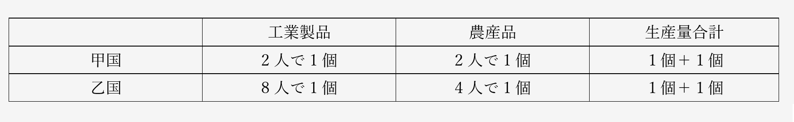
  
・甲国と乙国合わせて、工業製品２個と農産品２個。全部合わせて４個の商品を作っている訳だ  
・ここで、それぞれが比較優位を持つ商品の生産に集中したらどうなるか？  
・即ち、甲国は農産品の生産を諦めて工業製品のみを生産  
・乙国も、工業製品の生産を諦めて農産品のみを生産  
・すると、こう（↓）なる筈である  
  
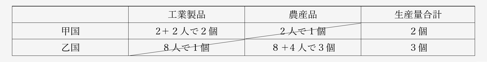
  
・甲国と乙国合わせて、工業製品２個と農産品３個。全部合わせて５個  
・そう、それぞれが比較優位を持つ商品の生産に集中したら、生産できる商品の合計が増えるのである  
⇒先の問題文の「較優位の構造があるとき、(b)＝甲国が工業製品、(c)＝乙国が農産品の生産に特化することで、両国を合わせた生産水準を高めることができる」とは、こういう意味である  
  
・では、ここで出てきた数字を使って、(d)(e)(f)を埋めてみよう  
   
`このような比較優位の構造があるとき、(b)＝甲国が工業製品、(c)＝乙国が農産品の生産に特化することで、両国を合わせた生産水準を高めることができる。これは、(b)＝甲国において労働者(d)単位＝２人を農産品の生産から工業製品の生産に移すと同時に(c)＝乙国において労働者(e)単位＝８人を工業製品の生産から農産品の生産に移すことで、工業製品の生産量の合計を変化させることなく農産品の生産量の合計を(f)単位＝１個増加させることから確認できる。`  
  
・甲国では、農産品を作っていた労働者２人が、工業製品の生産に移動する(d)  
・乙国では、工業製品を作っていた労働者８人が、農産品の生産に移動する(e)  
・そうすると、生産量合計が４個から５個に増える。つまり１個増える(f)  
  
・という訳で、問２はウ、問３はイである  
  
  
#### 問４、５  
・では、残る部分も解いていこう  
  
`例えば、甲国には労働が20単位あり、乙国には労働が60単位あり、貿易が行われるか否かに関わらず各国の労働はどちらかの製品の生産に余すところなく投入される状況を想定してみる。貿易が行われない場合、いずれの国でも、自国で生産した量の工業製品と農産品を自国で消費することになる。ここでは、いずれの国でも、貿易が行われない場合には工業製品が5単位ずつ生産され、消費されるものとする。`  
  
・↑の文章の内容を箇条書きすると、以下のようになる  
１：甲国は労働者が20人、乙国には労働者が60人いる  
２：各国の労働者は必ず、工業製品か農産品を作る  
３：甲乙両国では、工業製品が５個生産される（そして消費される）  
  
・これを元に、↓の表を埋めてみよう  
  
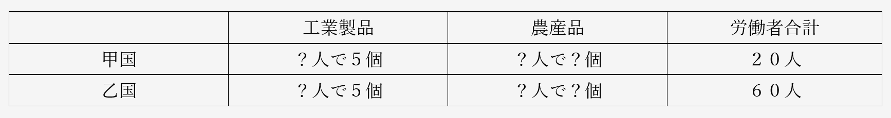
  
・甲国では、工業製品を２人で１個作れる  
・という事は、甲国の工業製品は「１０人で５個」の筈である  
・２０－１０＝１０人で、残る労働者が１０人。この全員が農産品を作る事になる  
・甲国では農産品も２人で１個作れるので、農産品も「１０人で５個」の状態になる  
  
・一方乙国では、工業製品１個作るのに８人必要である  
・５個作るなら、４０人必要。つまり乙国の工業製品は、「４０人で５個」の筈である  
・６０－４０＝２０人で、残る労働者が２０人。この全員が農産品を作る事になる  
・乙国では農産品は４人で１個作れるので、農産品は「２０人で５個」の筈である  
  
・つまり、こう（↓）なる  
  
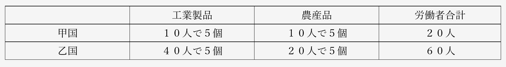
  
・まずは、こういう状況を想定しようという話である  
・では問題文の続きを見てみよう  
  
`各国が比較優位を持つものの生産に特化すると、(b)国では工業製品が(g)単位生産され、(c)国では農産品が、(h)単位生産される。`  
  
・甲乙両国が比較優位を持つ商品の生産に集中した場合を考えろ、という事のようだ  
・つまり、甲で農産品を作っていた１０人を工業製品生産に回す  
・そして、乙で工業製品を作っていた４０人を農産品生産に回す  
  
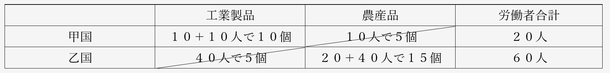
  
・こう（↑）なる訳である  
・つまりこう（↓）なる  
  
`各国が比較優位を持つものの生産に特化すると、(b)＝甲国では工業製品が(g)単位＝１０個生産され、(c)＝乙国では農産品が、(h)単位＝１５個生産される。`  
  
・という訳で、問４の答えはアになる  
・このまま、続きも読んでみよう  
  
`各国が比較優位を持つものの生産に特化すると、(b)＝甲国では工業製品が(g)単位＝１０個生産され、(c)＝乙国では農産品が、(h)単位＝１５個生産される。その上で、(b)＝甲国で生産された工業製品5単位が(c)＝乙国で生産された農産品8単位と交換される形で貿易が行われると、各国とも消費できる工業製品の量は変化しないが、消費できる農産品の量は、(b)＝甲国で(i)単位増加し、(c)＝乙国で(j)単位増加する。`  
  
・当然だが、各国がそれぞれ比較優位を持つ商品に特化しただけでは駄目である  
・甲国では食べるものがなくなり、乙国では工業製品が一切手に入らなくなる  
・だから貿易が必要になる訳である  
  
・問題文を見ると、仮に、甲国は工業製品を５個輸出、乙国は農産品を８個輸出するとしている  
・もしそうだとすると、両国共に工業製品を５個ずつ作っていた頃と比べてどう変わったか？  
  
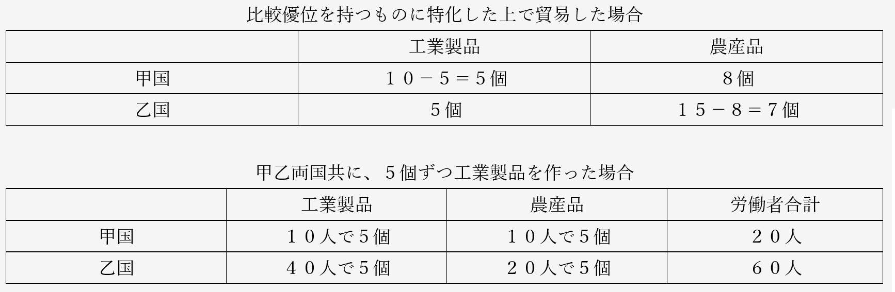
  
・甲乙両国共に、工業製品の数は変わらない  
・しかし、農産品の数は増えている。甲国では３個、乙国では２個、増えている  
・つまり…  
  
`各国が比較優位を持つものの生産に特化すると、(b)＝甲国では工業製品が(g)単位＝１０個生産され、(c)＝乙国では農産品が、(h)単位＝１５個生産される。その上で、(b)＝甲国で生産された工業製品5単位が(c)＝乙国で生産された農産品8単位と交換される形で貿易が行われると、各国とも消費できる工業製品の量は変化しないが、消費できる農産品の量は、(b)＝甲国で(i)単位＝３個増加し、(c)＝乙国で(j)単位＝２個増加する。`  
  
・という訳で、問５の答えはウである  
  
  
・比較生産費説とは、このようなものである  
・「ね？」「だから各国は、比較優位を持つ商品を作って、貿易すればいいんだよ！」  
・これがリカードの言いたかった事で、だからこそ彼は自由貿易を主張した訳である  
・また、労働力ばっかり見ているあたりも、労働価値説を言ったリカードらしいところと言える  
  
・一方で、この主張が、経済的に強い国に極めて有利なものである事も間違いない  
・比較生産費説は、「後進国は背伸びして工場なんか作るな、農業でもやってろｗ」という話を正当化する  
・経済的に最強の国だけが工業製品を作り、他の国から工業化の機会を奪う。そういう事態になってしまう  
・だからこそフリードリヒ・リストは、古典経済学を批判したのである  
  