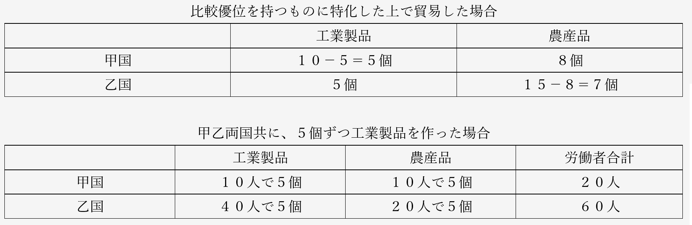

# 資本主義　問題演習  
  
## 経済分野第一章比較優位説問題演習  
  
（法政大学法国際キャリア平成二十七年）  
  
　下の表は甲国と乙国において、工業製品と農産品をそれぞれ1単位生産するのにどれだけの労働が必要かを表している。この表の内容にもとづいた以下の文章を読み、後の問いに答えよ。ただし、議論を簡単にするため、工業製品および農産品の生産は労働以外の生産要素を必要としないものとする。  
  

  
　工業製品に関しては、(a)国のほうが4倍生産性が高くなっている。同様にして、農産品については、(a)国のほうが2倍生産性が高くなっている。このように、(a)国のほうが工業製品と農産品のいずれについても高い生産性を誇る場合において、各国はどちらか一方の生産に特化したほうが良いのであろうか。それとも両方とも生産したほうが良いのであろうか。  
　農産品の生産量を1単位減らしたときに生産できる工業製品の量は(b)国のほうが多い。逆に、工業製品の生産量を1単位減らしたときに生産できる農産品の生産量は(c)国のほうが多い。このようなとき、(b)国は工業製品に、(c)国は農産品に比較優位を持つという。  
　このような比較優位の構造があるとき、(b)が工業製品、(c)国が農産品の生産に特化することで、両国を合わせた生産水準を高めることができる。これは、(b)国において労働者(d)単位を農産品の生産から工業製品の生産に移すと同時に(c)国において労働者(e)単位を工業製品の生産から農産品の生産に移すことで、工業製品の生産量の合計を変化させることなく農産品の生産量の合計を(f)単位増加させることから確認できる。このとき、両国ともが、自国が比較優位を持つものの生産に特化した上でお互いに貿易を行うことで、貿易の利益を享受できる。  
　例えば、甲国には労働が20単位あり、乙国には労働が60単位あり、貿易が行われるか否かに関わらず各国の労働はどちらかの製品の生産に余すところなく投入される状況を想定してみる。貿易が行われない場合、いずれの国でも、自国で生産した量の工業製品と農産品を自国で消費することになる。ここでは、いずれの国でも、貿易が行われない場合には工業製品が5単位ずつ生産され、消費されるものとする。  
　各国が比較優位を持つものの生産に特化すると、(b)国では工業製品が(g)単位生産され、(c)国では農産品が、(h)単位生産される。その上で、(b)国で生産された工業製品5単位が(c)国で生産された農産品8単位と交換される形で貿易が行われると、各国とも消費できる工業製品の量は変化しないが、消費できる農産品の量は、(b)国で(i)単位増加し、(c)国で(j)単位増加する。  
　以上の結果は、適切な交換比率で貿易が行われると、両国の経済水準がともに改善されるということを意味している。  
  
問１：(a)~(c)に当てはまる国名の組合せとして適切なものを次のア~エから一つ選び、その記号を解答欄にマークせよ。  
ア：(a)甲　(b)乙　(c)甲  
イ：(a)甲　(b)甲　(c)乙  
ウ：(a)乙　(b)乙　(c)甲  
エ：(a)乙　(b)甲　(c)乙  
  
問２：(d)と(e)に当てはまる数値の組合せとして適切なものを次のア~エから一つ選び,その記号を解答欄にマークせよ。  
ア：(d)2,(e)4	イ：(d)4,(e)2	ウ：(d)2,(e)8	エ：(d)8,(e)2  
  
問３：(f)に当てはまる数値として適切なものを次のア~エから一つ選び、その記号を解答欄にマークせよ。  
ア：0.5		イ：1		ウ：2		エ：4  
  
問４：(g)と(h)に当てはまる数値の組合せとして適切なものを次のア~エから一つ選び、その記号を解答欄にマークせよ。  
ア：(g)10,(h)15		イ：(g)10,(h)7.5  
ウ：(g)40,(h)480		エ：(g)40,(h)240  
  
問５：(i)と(j)に当てはまる数値の組合せとして適切なものを次のア~エから一つ選び、その記号を解答欄にマークせよ。  
ア：(i)8,(j)7	イ：(i)5,(j)4	ウ：(i)3,(j)2	エ：(i)7,(j)10  
  
  
### 経済分野第一章比較優位説問題演習　解答  
  
#### ○模範解答  
問１：イ　　問２：ウ　　問３：イ　　問４：ア　　問５：ウ  
  
  
#### ○総論  
・リカードの比較優位説を使った計算問題  
・…と言うか、現代文＋算数の問題  
・この手の問題は受験で頻出な上、初見だと大体解けない  
・この問題は恐らく、同種の問題の中では最上級に難しいので、ここで慣れておこう  
・また、比較優位説を理解するのに役立つ問題でもある  
  
・まずこの手の問題に限らないが、問題文をちゃんと読む事  
・空欄や下線部と、その周辺だけしか読まない人が結構いるのだが…  
・特に政経は「これ現代文だろ」というような問題が多く出る  
・だから問題文をちゃんと読まないと解けない問題というのも多くなってくる  
  
・さて、問題文を読んでみると、「甲国と乙国において、工業製品と農産品をそれぞれ1単位生産するのにどれだけの労働が必要か」という表があるのだが、これが分かりづらい  
  

  
・何が分かりづらいって、まず「１単位」という言い方が分かりづらい  
・要は、本当なら「甲国で工業製品を1000個作るのには、200人の労働者が必要」みたいな話なのだが…  
・それだと計算が面倒になるから「甲国で工業製品１単位作るのには、労働力２単位が必要」と言っている  
・そのせいで逆に、分かりづらくなってしまっている  
・だからこんな（↓）風に考えてやればいい  
  

  
・甲国では、工業製品は２人で１個作れる。農産品も２人で１個作れる  
・乙国では、工業製品は８人いれば１個作れる。農産品は４人いれば１個作れる  
・こう考えればいいのだ  
⇒工業製品や農産品といった商品も、労働者も、両方「単位」という言い方で数えているので、こんがらがってしまうのである。この後の問題文では「××を△単位減らす」みたいな文章がちょくちょくでてくるが、その「△単位」が「個」なのか「人」なのか考えながら解いていこう  
  
  
#### ○問１  
・では、問題文の続きを見てみよう  
  
`工業製品に関しては、(a)国のほうが4倍生産性が高くなっている。同様にして、農産品については、(a)国のほうが2倍生産性が高くなっている。`  
  
・工業製品に関してみれば、甲国は２人で１個作れるに対し、乙国は１個作るのに８人も必要である  
・つまり、甲国の方が８÷２＝４で４倍、効率的である（生産性が高い）  
・同様に農産品も、甲国は２人で１個作れるのに対し、乙国では１個作るのに４人必要である  
・つまり、甲国に法が４÷２＝２で２倍、効率的である（生産性が高い）  
・こうなると、(a)が甲国なのは確定である  
  
・ついでに言うと、工業製品を作るにせよ農産品を作るにせよ、甲国の方が絶対的に優位な訳だ  
・こういうのを絶対優位と言うのだが、デイビッド・リカードが言いたかったのは比較優位である  
・では、比較優位は、何を問題にするのか？  
  
`このように、(a)国のほうが工業製品と農産品のいずれについても高い生産性を誇る場合において、各国はどちらか１方の生産に特化したほうが良いのであろうか。それとも両方とも生産したほうが良いのであろうか。`  
  
・(a)国（甲国）のような絶対優位にある国は、工業製品も農産品も輸入する必要はなさそうに見える  
・だが本当に、そうなのか？  
・例えば甲国が工業製品を全力で作って、農産品を輸入する  
・そういう風な事をした方が、経済がよくなる可能性はないのか？  
・このあたりに切り込んでいくのが、比較優位説である  
  
`農産品の生産量を1単位減らしたときに生産できる工業製品の量は(b)国のほうが多い。逆に、工業製品の生産量を1単位減らしたときに生産できる農産品の生産量は(c)国のほうが多い。このようなとき、(b)国は工業製品に、(c)国は農産品に比較優位を持つという。`  
  
・はいここ、ちょっと難しい  
  

  
・農産品は、甲国では２人で１個、乙国では４人で１個作れる  
・そして農産品を１個（１単位）、作るのをやめて、人員を工業製品の生産に回す  
・すると、甲国では２人、乙国では４人、工業製品の増産に回る事になる  
  

  
・こうなる訳である  
・このように、農産品の生産を諦めて工業製品に集中した場合、甲国の方が効率的である  
  
・では、逆の場合はどうか？  
・工業製品は、甲国では２人で１個、乙国では８人で１個作れる  
・そして農産品を１個（１単位）、作るのをやめて、人員を農産品の生産に回す  
・すると、甲国では２人、乙国では８人、農産品の増産に回る事になる  
・そして農産品は、元々、甲国では２人で１個、乙国では４人で１個作れたので…  
  

  
・こうなる筈である  
・このように、工業製品の生産を諦めて農産品に集中する場合は、乙国の方が効率的である  
・比較優位説というのは、ここが核心なのだ  
  
農産品の生産量を1単位減らしたときに生産できる工業製品の量は(b)＝甲国のほうが多い。逆に、工業製品の生産量を1単位減らしたときに生産できる農産品の生産量は(c)＝乙国のほうが多い。このようなとき、甲国は工業製品に、乙国は農産品に比較優位を持つという。  
  
・こういう事なのだ  
・今回の問題文では、農産品の生産を諦めて工業製品に集中した場合、甲国の方が効率的であり…  
・工業製品の生産を諦めて農産品に集中する場合は、乙国の方が効率的である  
・こういうとき、「甲国は工業製品に比較優位を持つ」「乙国は農産品に比較優位を持つ」と言うのである  
  
・という訳で、(a)が甲、(b)が甲、(c)が乙。問１の答えはイである  
  
  
   
#### ○問２、３  
・では、更に続きを見ていこう  
  
`このような比較優位の構造があるとき、(b)＝甲国が工業製品、(c)＝乙国が農産品の生産に特化することで、両国を合わせた生産水準を高めることができる。これは、(b)＝甲国において労働者(d)単位を農産品の生産から工業製品の生産に移すと同時に(c)＝乙国において労働者(e)単位を工業製品の生産から農産品の生産に移すことで、工業製品の生産量の合計を変化させることなく農産品の生産量の合計を(f)単位増加させることから確認できる。`  
  
・この辺は、比較優位の説明の続きである  
・「甲国は工業製品に比較優位があるよ」と言っても、それだけでは「だからどうした」で終わる  
・リカードは、「各国が比較優位を持つ商品に特化すれば、世界中が豊かになるよ」と言ったのだ  
・その理論を、(d)(e)(f)を埋める問２と問３で確認してみよう  
  
・話を単純化して考えてみよう  
・甲乙両国が、工業製品も農産品も作っている状態というのは、（↓）である  
  

  
・甲国と乙国合わせて、工業製品２個と農産品２個。全部合わせて４個の商品を作っている訳だ  
・ここで、それぞれが比較優位を持つ商品の生産に集中したらどうなるか？  
・即ち、甲国は農産品の生産を諦めて工業製品のみを生産  
・乙国も、工業製品の生産を諦めて農産品のみを生産  
・すると、こう（↓）なる筈である  
  

  
・甲国と乙国合わせて、工業製品２個と農産品３個。全部合わせて５個  
・そう、それぞれが比較優位を持つ商品の生産に集中したら、生産できる商品の合計が増えるのである  
⇒先の問題文の「較優位の構造があるとき、(b)＝甲国が工業製品、(c)＝乙国が農産品の生産に特化することで、両国を合わせた生産水準を高めることができる」とは、こういう意味である  
  
・では、ここで出てきた数字を使って、(d)(e)(f)を埋めてみよう  
   
`このような比較優位の構造があるとき、(b)＝甲国が工業製品、(c)＝乙国が農産品の生産に特化することで、両国を合わせた生産水準を高めることができる。これは、(b)＝甲国において労働者(d)単位＝２人を農産品の生産から工業製品の生産に移すと同時に(c)＝乙国において労働者(e)単位＝８人を工業製品の生産から農産品の生産に移すことで、工業製品の生産量の合計を変化させることなく農産品の生産量の合計を(f)単位＝１個増加させることから確認できる。`  
  
・甲国では、農産品を作っていた労働者２人が、工業製品の生産に移動する(d)  
・乙国では、工業製品を作っていた労働者８人が、農産品の生産に移動する(e)  
・そうすると、生産量合計が４個から５個に増える。つまり１個増える(f)  
  
・という訳で、問２はウ、問３はイである  
  
  
#### ○問４、５  
・では、残る部分も解いていこう  
  
`例えば、甲国には労働が20単位あり、乙国には労働が60単位あり、貿易が行われるか否かに関わらず各国の労働はどちらかの製品の生産に余すところなく投入される状況を想定してみる。貿易が行われない場合、いずれの国でも、自国で生産した量の工業製品と農産品を自国で消費することになる。ここでは、いずれの国でも、貿易が行われない場合には工業製品が5単位ずつ生産され、消費されるものとする。`  
  
・↑の文章の内容を箇条書きすると、以下のようになる  
１：甲国は労働者が20人、乙国には労働者が60人いる  
２：各国の労働者は必ず、工業製品か農産品を作る  
３：甲乙両国では、工業製品が５個生産される（そして消費される）  
  
・これを元に、↓の表を埋めてみよう  
  

  
・甲国では、工業製品を２人で１個作れる  
・という事は、甲国の工業製品は「１０人で５個」の筈である  
・２０－１０＝１０人で、残る労働者が１０人。この全員が農産品を作る事になる  
・甲国では農産品も２人で１個作れるので、農産品も「１０人で５個」の状態になる  
  
・一方乙国では、工業製品１個作るのに８人必要である  
・５個作るなら、４０人必要。つまり乙国の工業製品は、「４０人で５個」の筈である  
・６０－４０＝２０人で、残る労働者が２０人。この全員が農産品を作る事になる  
・乙国では農産品は４人で１個作れるので、農産品は「２０人で５個」の筈である  
  
・つまり、こう（↓）なる  
  

  
・まずは、こういう状況を想定しようという話である  
・では問題文の続きを見てみよう  
  
`各国が比較優位を持つものの生産に特化すると、(b)国では工業製品が(g)単位生産され、(c)国では農産品が、(h)単位生産される。`  
  
・甲乙両国が比較優位を持つ商品の生産に集中した場合を考えろ、という事のようだ  
・つまり、甲で農産品を作っていた１０人を工業製品生産に回す  
・そして、乙で工業製品を作っていた４０人を農産品生産に回す  
  

  
・こう（↑）なる訳である  
・つまりこう（↓）なる  
  
`各国が比較優位を持つものの生産に特化すると、(b)＝甲国では工業製品が(g)単位＝１０個生産され、(c)＝乙国では農産品が、(h)単位＝１５個生産される。`  
  
・という訳で、問４の答えはアになる  
・このまま、続きも読んでみよう  
  
`各国が比較優位を持つものの生産に特化すると、(b)＝甲国では工業製品が(g)単位＝１０個生産され、(c)＝乙国では農産品が、(h)単位＝１５個生産される。その上で、(b)＝甲国で生産された工業製品5単位が(c)＝乙国で生産された農産品8単位と交換される形で貿易が行われると、各国とも消費できる工業製品の量は変化しないが、消費できる農産品の量は、(b)＝甲国で(i)単位増加し、(c)＝乙国で(j)単位増加する。`  
  
・当然だが、各国がそれぞれ比較優位を持つ商品に特化しただけでは駄目である  
・甲国では食べるものがなくなり、乙国では工業製品が一切手に入らなくなる  
・だから貿易が必要になる訳である  
  
・問題文を見ると、仮に、甲国は工業製品を５個輸出、乙国は農産品を８個輸出するとしている  
・もしそうだとすると、両国共に工業製品を５個ずつ作っていた頃と比べてどう変わったか？  
  

  
・甲乙両国共に、工業製品の数は変わらない  
・しかし、農産品の数は増えている。甲国では３個、乙国では２個、増えている  
・つまり…  
  
`各国が比較優位を持つものの生産に特化すると、(b)＝甲国では工業製品が(g)単位＝１０個生産され、(c)＝乙国では農産品が、(h)単位＝１５個生産される。その上で、(b)＝甲国で生産された工業製品5単位が(c)＝乙国で生産された農産品8単位と交換される形で貿易が行われると、各国とも消費できる工業製品の量は変化しないが、消費できる農産品の量は、(b)＝甲国で(i)単位＝３個増加し、(c)＝乙国で(j)単位＝２個増加する。`  
  
・という訳で、問５の答えはウである  
  
  
・比較優位説とは、このようなものである  
・「ね？」「だから各国は、比較優位を持つ商品を作って、貿易すればいいんだよ！」  
・これがリカードの言いたかった事で、だからこそ彼は自由貿易を主張した訳である  
・また、労働力ばっかり見ているあたりも、労働価値説を言ったリカードらしいところと言える  
  
・一方で、この主張が、経済的に強い国に極めて有利なものである事も間違いない  
・比較優位説は、「後進国は背伸びして工場なんか作るな、農業でもやってろｗ」という話を正当化する  
・経済的に最強の国だけが工業製品を作り、他の国から工業化の機会を奪う。そういう事態になってしまう  
・だからこそフリードリヒ・リストは、古典経済学を批判したのである  
  