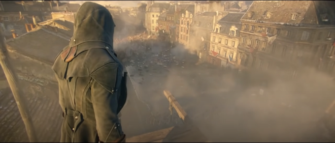
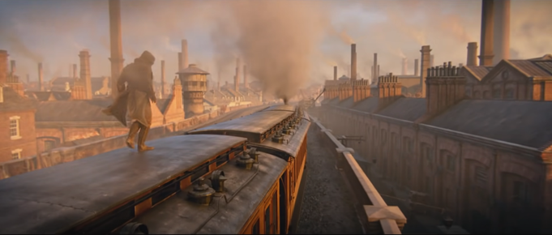
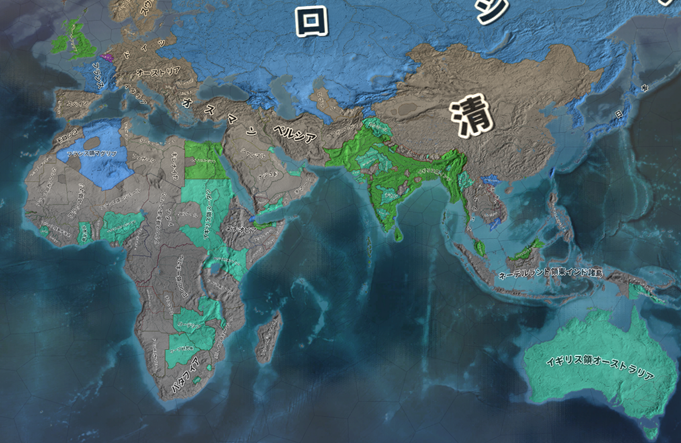

# 産業革命と長い十九世紀  
## ●前置きと資料  
・現代では、欧州と言えば先進国である  
・実際、第一次世界大戦前夜、欧州は世界を支配していたと言っていい  
・ではいつそうなったかと言えば、革命の時代から帝国の時代にかけて、である  
  
  
  
※「×年から×年が△△時代」というのは人によって変わる。上記はあくまで一例である。私の授業では、この時代区分で通す予定  
例：「革命の時代」という概念を最初に言い出した歴史家は、革命の時代を1789年開始としている  
  
・革命の時代前後、イギリスを先頭に、欧米先進国では【産業革命】が起きた  
・この【産業革命】を切っ掛けに、資本主義と呼ばれる現代的な経済が本格的に登場する  
・同様に、【産業革命】を切っ掛けに、欧州は世界を支配する先進地帯となった  
  
・経済分野第一章の冒頭は、「資本主義とは何か」を主題としている  
・その背景知識としてまず、長い十九世紀の歴史を軽く見てみよう  
⇒革命の時代、資本の時代、帝国の時代…という概念を最初に言い出したイギリスの歴史家は、この三時代をまとめて「長い十九世紀」と呼ぶ。実際、この三時代は非常によく似た時代で、ひとつのまとまりとして見ると分かりやすい  
  
※尚、本来公民の授業（つまり公共の授業とか政経の授業とか）では、「長い十九世紀はどんな時代か」はやりません。「世界史でやったでしょ」という感じで、ある程度どんな時代か分かってる事前提で授業が行われます。が、私の授業では先に、「長い十九世紀はどんな時代か」という話をします  
  
・また、以下にワークシートを載せる。このワークシートを埋めながら授業を受けるとよいだろう  
  
  
  
  
## ●ANNO1800  
・実を言えば、欧州は長い間、田舎であった  
・都会とか先進国とか呼ばれるべきは、アジアの国々だった。その最たる例が中華帝国である  
・欧州がこれを完全に追い抜き、世界最先進地帯となったのは、実に革命の時代であった  
・と言うのは、【産業革命】が起きたのが、丁度この頃なのである  
  
・産業革命とは要するに、「機械で商品を大量生産できるようになった」という事である  
・産業革命までは、どんなに進んだ地域であっても結局、職人の手作りで商品を作っていた  
・それを「機械で大量生産」に変えたのが、産業革命なのである  
  
・故に産業革命の以前と以後では、社会の様相が全く違う  
  
  
産業革命が本格化する以前の街並み。フランス革命勃発時のフランス王国首都パリの様子を再現した場面。正直、中世からさして大きく変わってはいない（Assasin’s Creed UnityのE3トレーラーより）  
  
  
産業革命が終わった後の街並み。資本の時代後期、1868年のイギリス首都ロンドンの様子を再現した場面。工場が立ち並び、煙突が煙を吹き、蒸気機関車が疾駆する（Assasin’s Creed SyndicateのE3トレーラーより）  
   
・極端な話、産業革命以前の欧州の街並みは、（都市であっても）中世と本質的には変わらない  
・しかし産業革命が終わると一変する  
・煙突が立ち並び列車が走り回り街灯が闇夜を照らす、近現代的な都市が出現するのである  
  
・当然ながら、産業革命の以前と以後では、国力に歴然と言える差が出る  
⇒産業革命以前の社会では、手作りで商品を作り、馬車で商品を運ぶ。産業革命以後の社会では、機械で商品を大量生産し、鉄道で商品を運ぶ  
  
・この産業革命を世界で最初に始めたのが、欧州という地域であり…  
・欧州の中でも最初に始めたのが、イギリスという国であった  
・イギリスの産業革命は、他の欧州の主要国に対し数十年早く始まり、数十年早く完了したのである  
⇒イギリスの産業革命は、革命の時代が始まる前後に開始し、革命の時代終了とほぼ同時に終わる。一方、イギリス以外で産業革命が本格化するのは、早くても1830年代からである。資本の時代が終わるまでには、どの国でも本格化する。早い国（ドイツ帝国やフランス共和国）なら資本の時代が終わる頃には産業革命を完了し、遅い国（ロシア帝国や大日本帝国）だと帝国の時代に入ってからでないと終わらない  
  
・イギリスの産業革命は、他国に比してこれだけ早かった訳である  
⇒これは即ち、本質的には古代中世と変わらない生産力しか持たない国が多い中、イギリスだけが近現代的な工場で生産する時代が数十年あった、という事実を意味する  
  
・当然ながら、イギリスは世界最強の経済大国となった  
・それは単に「経済力一位」というだけでなく、他の追随を許さない、「圧倒的一位」であった  
・特に資本の時代ともなると、その工業力と経済力によって、世界を支配するようになったのである  
  
・世界の各地が、イギリスという「圧倒的一位」の経済力に屈した  
・イギリスは、海外へ軍隊を送って征服するとか、そんな事をする必要はなかった  
・貿易さえ始まれば、相手は勝手に、安価で高品質なイギリス商品に依存するのである  
⇒そりゃまぁ、工場で商品を大量生産しているのが世界で唯一イギリスだけ、となったら大体の国は「イギリス様お願いします、あなたの安くて高品質な商品を売ってください」と土下座する羽目になる  
  
・だからこそ、資本の時代のイギリスは、植民地を無理に広げる必要がなかった  
・しかし資本の時代が終わる頃ともなると、ドイツ帝国やフランス共和国が猛烈に追い上げてくる  
・どちらも産業革命を終わらせつつあり、結果、イギリスを強烈に追い上げたのである  
・最早イギリスは、「圧倒的一位」ではなく、単なる「経済力一位」になりつつあった  
⇒特にドイツ帝国は、最終的には経済力でイギリスを追い抜く事になる。この事実があるからこそ、第一次世界大戦はドイツ陣営対イギリス陣営という形になった、とも言える  
  
・他国に追い上げられ始めたイギリスは、単に商売するだけ、という訳にはいかなくなってしまった  
⇒ある地域を征服して、「ここはイギリスの植民地」「だからイギリスとだけ貿易しろ」みたいな事もする必要が出てきてしまった  
  
   
・こうして始まったのが、帝国の時代である  
・即ち、欧州各国が【帝国主義】（他国を征服して、どんどん領地を増やしていこう主義）を実践した時代  
・イギリスをはじめとする欧州各国が、世界を征服し分割していった時代である  
  
・この時代の中で、イギリスを始めとした欧米各国は、世界中に大量の植民地を作った  
・帝国の時代が終わる1914年、「欧米の植民地ではない」と素面で言える国家は、ほぼなくなっていた  
  
  
例として、帝国の時代末期の1910年に於ける、イギリスから見た外交関係図。緑と青竹色が、植民地を含むイギリス領である。まさに世界最大の帝国と言える。尚、青はイギリスの同盟国を示している。この時点で既に、世界中が欧米諸国に征服しつくされており、「欧米諸国の植民地ではない」と素面で言える国家はほぼ存在しなくなっていた(Europe Universalis IVのExtended Timeline MOD及び日本語化MODより)  
  
・勿論、この時期に植民地獲得競争が行われたのはこれだけが原因ではない  
・「植民地」の名前の通り、増えすぎた人口を植民させる土地を求めてのものでもある  
⇒第二次世界大戦ぐらいまでは、欧米列強の先進国でさえ、ちょっと人口が増えすぎるとすぐ飢饉になる危険と隣り合わせであった。1940年代から1960年代にかけて起こった緑の革命（農業の技術革新）が終わる事で、ようやく「先進国では普通、飢饉は起きない」になったのである。故に世界大戦以前の世界では、各国は、増えすぎた人口を植民させる土地を求めていた。大日本帝国が満洲を取ろうとしたのにも、ドイツ国が東へ拡大しようとしたのにも、そういう意味がある  
