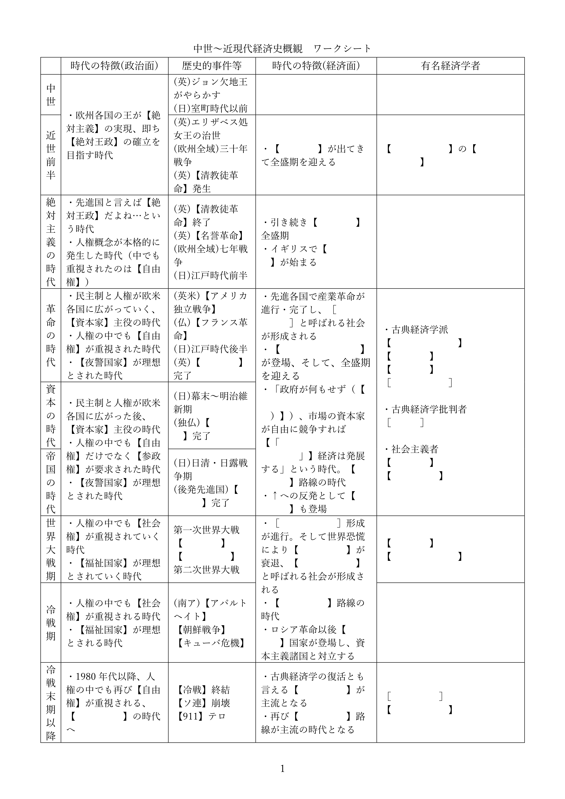
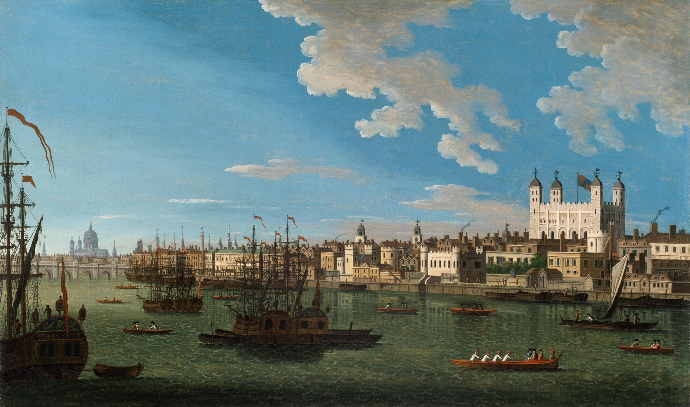
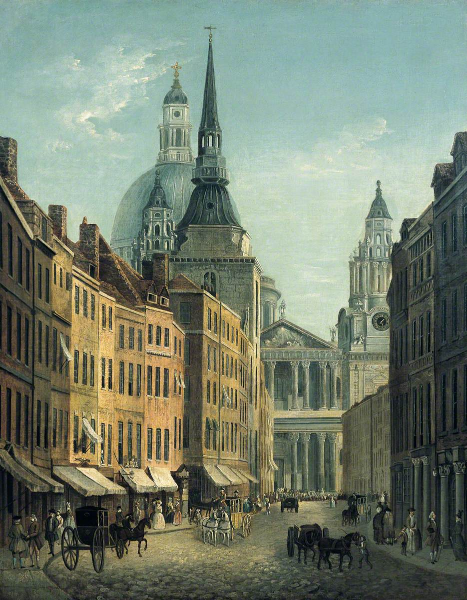
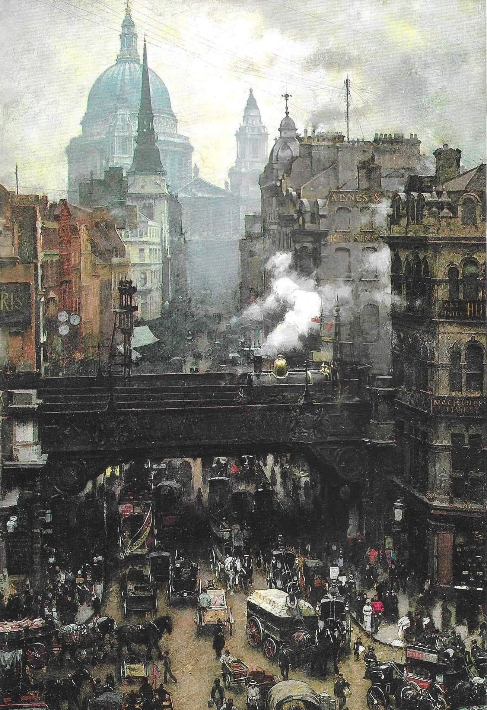
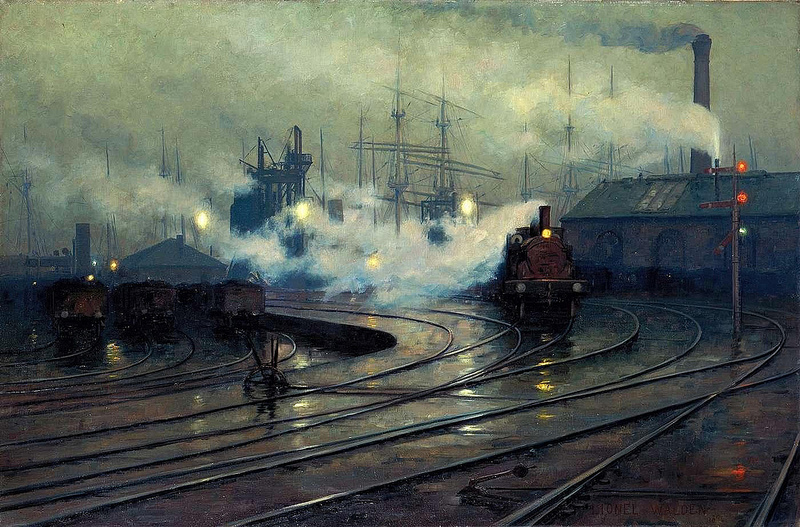
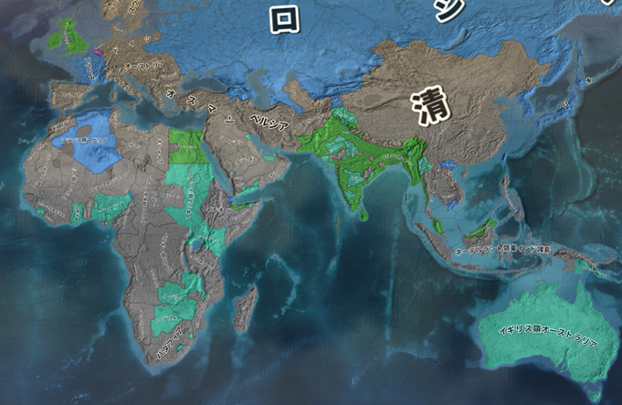

# 産業革命と長い十九世紀  
  
※この授業用資料は、令和六年八月に新規で追加されたものです  
※対応する授業動画はまだありませんが、経済分野の勉強はこの資料から開始する事をお勧めします  
  
## ●前置きと資料  
・経済分野第一章の冒頭は、「資本主義とは何か」を主題としている  
  
・では、「資本主義」とは何か？　例えば、「資本主義社会」というのはどのような社会か？  
⇒雑に言ってしまうと、「働く人の大半が、自分で自分の土地を耕したり、自分で自分の食物や生活用品を作ったりしていない。基本、誰かに雇われて給料を貰い、その金で必要な物を買って生活している」という社会は「資本主義社会」と呼べる  
  
・例えば現代日本は、典型的な「資本主義社会」である  
⇒現代日本は、「大体の大人がどっかの会社の社員で、毎日職場に行って働き、会社から給料を貰って生活している社会」と表現できる。完璧に「資本主義社会」である  
  
・資本主義社会は、中世欧州や江戸時代日本とは、全く異なる社会である  
⇒例えば日本の江戸時代なら、日本人の多くは農民で、自分で土地を耕して生活していた筈である  
  
・では、資本主義社会が本格的に登場してきたのはいつ頃か？　それは、「長い十九世紀」である  
⇒政治分野でも出てきた「革命の時代」「資本の時代」「帝国の時代」をまとめて「長い十九世紀」と呼ぶ  
  
  
  
※「×年から×年が△△時代」というのは人によって変わる。上記はあくまで一例である。私の授業では、この時代区分で通す予定  
例：「革命の時代」という概念を最初に言い出した歴史家は、革命の時代を1789年開始としている  
  
・長い十九世紀を一言で表すなら、「欧州が先進国となった時代」である  
  
・と言うのは、有史以来、欧州が常に先進地域だった訳ではないのである  
⇒無論、現代では、欧州と言えば先進国である。しかし、ドイツやイギリスといった、欧州と言って真っ先に想像される地域は、田舎だった時代が長いのである  
  
・「欧州は先進国」と断言できるようになったのは、長い十九世紀からと言ってよい  
⇒長い十九世紀以前だと、「いやでも、中華王朝の方が進んでるじゃん」等のツッコミが入る可能性がある。しかし長い十九世紀からは、「欧州と言えば先進国」と言っても誰も反論はしない。この時代に欧州は一気に成長し、「欧州が世界を支配する」「欧州こそ世界で最も進んだ地域である」という所まで行くのである  
  
・その切っ掛けは、【産業革命】であった  
⇒長い十九世紀は革命の時代から始まるが…革命の時代前後に産業革命が進んだイギリスを先頭に、後に「列強」と呼ばれる欧米諸国でも、次々と産業革命が起きた。この産業革命によって、欧米各国には資本主義的な経済・社会が本格的に登場する。そしてまた、産業革命の恩恵によって、欧州は世界を支配する先進地域となったのである  
  
・経済分野の勉強はここからである。産業革命の時代たる長い十九世紀の概観、ここから始めよう  
⇒具体的に「資本主義の定義はコレ！」等とやるのはまた今度。暫くの間は、「資本主義」や「資本主義社会」が先進国に登場し、そして定着した、長い十九世紀と呼ばれる時代を概観する。「資本主義」がどんな時代に出てきた概念なのか分からないのに「資本主義」を学ぼう、というのは難しいですからね  
  
※尚、本来公民の授業（つまり公共の授業とか政経の授業とか）では、「長い十九世紀はどんな時代か」はやりません。「歴史総合でやったでしょ」「世界史でやったでしょ」という感じで、ある程度、どんな時代か分かってる事前提で授業が行われます。が、私の授業では先に、「長い十九世紀はどんな時代か」という話をします  
  
※以下にワークシートを載せます。このワークシートを埋めながら授業を受けると、「あ～今この辺の話をしてるんだな」というのが分かりやすいでしょう  
  
  
  
  
## ●ANNO1800  
・既に見たように、欧州が「都会」「先進国」と言って誰も反論しなくなるのは長い十九世紀からである  
・欧州がそこまで一気に成長した要因としてはやはり、【産業革命】を挙げるべきであろう  
  
・産業革命とは要するに、「機械で商品を大量生産できるようになった」という事である  
⇒産業革命までは、どんなに進んだ地域であっても結局、職人の手作りで商品を作っていた。それを「機械で大量生産」に変えたのが、産業革命なのである  
  
・産業革命の以前と以後では、時代の雰囲気というものが全く異なる  
⇒産業革命以前は、百年単位で時間が経っても、素人には街並みの変化すら感じられない。しかし産業革命前の街並みと産業革命後の街並みを比較すると、どんな素人でも「お～、これはだいぶ変わった！」という感想になる  
  
例１：一般欧米人が、「日本の平安時代の貴族の邸宅の絵」と「室町時代の武士の館の絵」を見た場合  
⇒恐らく、「…？」「どっちもエキゾチックな木造住宅で素敵だね！」にしかならない  
  
例２：普通の日本人が、1650年と1750年のイギリスの街並みの絵を見た場合  
⇒やっぱり、「…？」「どれも立派な石造りの都市ですね。何か違いがあるんですか？」にしかならない  
  
例３：普通の日本人が、1790年と1890年のイギリスの街並みの絵を見た場合  
⇒1790年は産業革命が本格化する直前ぐらい、1890年は産業革命が「終わった」とよく表現される時期。こうなると、一般日本人でも「え、全然違うじゃん！」「別世界じゃん！」という反応が出てくる  
  
・では、実際に見てみよう  
  
  
産業革命前、1647年のロンドンの街並み（を描いた↓の絵を一部トリミングしたもの）。これだけだと「あー、なんかよく分かんないけど欧州っぽいね。中世ヨーロッパって感じ？」という風に感じる人が多いだろう。  
https://commons.wikimedia.org/wiki/File:1647_Long_view_of_London_From_Bankside_-_Wenceslaus_Hollar.jpg  
  
  
こちらも産業革命前、1765年頃のロンドンを描いた絵。先程の絵と比べると百年ぐらい経っている訳だが、「じゃあ何か違いますか？」「文明レベルが変わった、時代が進んだ、そう感じられるところってありますか？」と言われると「う～ん…一緒じゃない？」というのが普通の反応であろう。  
https://commons.wikimedia.org/wiki/File:Joseph_Nickolls_-_The_Thames_at_the_Tower_of_London_with_London_Bridge_and_St._Paul%27s_in_the_Distance_-_BF.1986.10_-_Museum_of_Fine_Arts.jpg  
  
  
これも産業革命本格化前、1793年頃のロンドン、ラドゲート通りからセント・ポール大聖堂を見た図。ここまでの三枚、一般日本人からしてみれば「時代？」「文明レベル？」「うーん、全部一緒！ｗ」であろう。  
William Marlow, Public domain, via Wikimedia Commons
https://commons.wikimedia.org/wiki/File:William_Marlow_(1740-1813)_-_View_of_Ludgate_Street_from_Ludgate_Hill,_with_the_West_Front_of_St_Paul%27s_Cathedral,_London_-_0368_-_Bank_of_England_Museum.jpg  
  
  
産業革命後、1887年頃のロンドン、ラドゲート通りからセント・ポール大聖堂を見た図。つい先ほどの図と同じ場所を描いたものなのに、「高架鉄道ができてる！」「蒸気機関車が煙を吐いて走ってる！」「電線も街灯もある！！」…と、全く違う光景が広がっている。  
https://pd.republicdomain.net/index.php?year=1944&author=13206&work=2320  
  
  
ロンドンから西に250km、港湾都市カーディフを描いた図。1894年。三枚目の絵からこの絵で大体百年だが、全く別世界になってしまった。ちなみに一枚目から二枚目も大体百年経っている。同じ百年でこの差である、産業革命がどれぐらい強烈な出来事だったのか、想像がつくだろう。  
Lionel Walden, Public domain, via Wikimedia Commons
https://commons.wikimedia.org/wiki/File:Cardiff_Docks,_Lionel_Walden.jpg  
  
・結局、産業革命の前と後では、文明レベルが全く違うのである。以下で比較してみよう  
  
||産業革命前|産業革命後|
|:----:|:----:|:----:|
|工業|職人による手作り。仮に工場があっても、工場に集まった職人が商品を手作り|工場の中に機械があって、機械を動かして商品を大量生産する|
|商品の主な運搬手段（陸）|馬車か人力|鉄道（蒸気機関車）|
|商品の主な運搬手段（海）|手漕ぎの船か帆船|エンジン付きの船（蒸気船等）|
|夜の街を照らす手段|街灯はあっても少なく、夜道は基本真っ暗|ガス灯などの街灯が整備され、夜の街そのものが明るくなる|
  
・当然ながら、産業革命の以前と以後では、国力に歴然と言える差が出る  
⇒はっきり言えば、江戸時代の日本と産業革命前の欧州にそこまで差は無い。どっちも商品を手作りしているし、陸上で商品を運ぶとなればどっちも人力か馬ぐらいのもの、海で運ぶとなればどっちも手漕ぎの船か帆船…しかし、産業革命後の欧米と江戸末期の日本では最早、比較にならない程の差ができるのだ  
  
・この産業革命を世界で最初に始めたのは、欧州であり、イギリスであった  
⇒どこからを「産業革命が始まった」と称し、どこまでを「産業革命が終わった」とするかは難しい。が、イギリスが最初というのは間違いなく言えるし、革命の時代が終わる頃には、イギリスの産業革命は「本格化した」「完了した」と言っても差し支えない状況にはなっている。図にすると以下のような感じである  
  
  
  
・図で見て分かるように、欧州、特にイギリスの産業革命は、極めて速い時期に起こっている  
⇒イギリスの産業革命は、他の主要国に対し数十年早く始まり、数十年早く完了している。これは即ち、イギリス以外の全ての国が「商品は手作り」「陸上輸送は人力か馬」という状況の中、イギリスだけが「機械で商品を大量生産」「陸上輸送は鉄道」…というような時代が数十年あった、という事実を意味する  
  
・当然ながら、イギリスは世界最強の経済大国となった  
⇒それは単に「経済力一位」というだけでなく、他の追随を許さない、「圧倒的一位」であった。特に革命の時代後期から資本の時代前期にかけて、イギリスはその工業力と経済力によって、世界を支配する“大英帝国”へと進化した  
  
・この時期、世界の各地が、イギリスという「圧倒的一位」の経済力に屈する事となる  
⇒貿易さえ始まれば、相手は勝手に、安価で高品質なイギリス商品に依存した。何せ、「工場で商品を大量生産しているのが世界で唯一イギリスだけ」という状況な訳で…イギリスの商品が世界で最も安く、しかも高品質だったのである。こうなったら大体の国は、「イギリス様お願いします、あなたの安くて高品質な商品を売ってください」と土下座する羽目になる  
  
・だからこそ、当時のイギリスは、【植民地】を無理に広げる必要がなかった  
⇒革命の時代後期から資本の時代前期にかけてのイギリスは、疑う余地なく、世界最強の国家だった。その割に、「海外へ軍隊を送って征服する」という類の行動は少ない。悪名高い阿片戦争にしても、基本的には「俺と貿易しろ」であって征服戦争ではない。この時期のイギリスは経済力が「圧倒的一位」であるが故に、貿易さえ始まればそれでよい、という場合が圧倒的に多いのだ  
  
・しかし資本の時代が終わる頃ともなると、ドイツ帝国やフランス共和国が猛烈に追い上げてくる  
⇒どちらも産業革命を終わらせつつあり、結果、イギリスを強烈に追い上げたのである。特にドイツ帝国は、最終的には工業力でイギリスを追い抜く事になる。最早イギリスは、「圧倒的一位」ではなく、単なる「経済力一位」になりつつあった  
  
・他国に追い上げられ始めたイギリスは、単に「商売」するだけ、という訳にはいかなくなってしまった  
⇒ある地域を征服して、「ここはイギリスの植民地」「だからイギリスとだけ貿易しろ」みたいな事もする必要が出てきてしまった  
  
・こうして始まったのが、帝国の時代である  
⇒即ち、欧州各国が【帝国主義】（他国を征服して、どんどん領地を増やしていこう主義）を実践した時代。イギリスをはじめとする欧州各国が、世界を征服し分割していった時代である  
  
・この時代の中で、イギリスを始めとした欧米各国は、世界中に大量の植民地を作った  
⇒帝国の時代が終わる1914年、「欧米の植民地ではない」と素面で言える国家は、ほぼなくなっていた。この時点で、世界地図のほぼ全てが、「欧米列強」「欧米列強の植民地」「植民地と呼ばれていないだけの半植民地」のいずれかになっていたのである  
  
  
例として、帝国の時代末期の1910年に於ける、イギリスから見た外交関係図。緑と青竹色が、植民地を含むイギリス領である。まさに世界最大の帝国と言える。尚、青はイギリスの同盟国を示している。この時点で既に、世界中が欧米諸国に征服しつくされており、「欧米諸国の植民地ではない」と素面で言える国家はほぼ存在しなくなっていた(Europe Universalis IVのExtended Timeline MOD及び日本語化MODより)  
  

  
<b>～植民地獲得競争が行われた理由って本当に「商売」だけですか？～（クリック・タップして雑談を表示）</b>

  

　勿論、植民地獲得競争が行われた理由は、「商売」だけではない。 
 
　そもそも「植民地」は、その名前の通り、「増え過ぎた人口」「不要な人口」を植民・移民・棄民する土地…という含意がある。 
 
　例えばイギリスの北米植民地（後のアメリカ合衆国、及びカナダ）やオーストラリア植民地（現オーストラリア連邦）は、「増え過ぎた人口」「不要な人口」を植民・移民・棄民する土地という面が明らかにあった。特に後者は、オーストラリア国立博物館すらも、ホームページに堂々と、以下のように書いている。 
 
＞Since the establishment of a penal colony in New South Wales in 1788, Australia had served Britain as a prison and a means of offloading excess people during a period of rapid population growth, rising social and political instability and regular economic downturns. 
＞1788年にニューサウスウェールズに流刑植民地が設立されて以来、<b>オーストラリアはイギリスにとって</b>刑務所として、また急速な人口増加、社会・政治的不安定の高まり、そして度重なる経済不況の時期に<b>余剰人口を押し付ける手段として利用されてきた。</b> 
 
　ちょっと被害者意識持ってるなこいつ？ 
 
　まぁそれはそれとして。植民地獲得競争が行われた理由は一つではない。「商売」の為というのも有力な理由である。が、他方、「植民地」の原義たる植民先の確保、石炭・鉄鋼石・錫・ゴム等々の戦略資源の確保…といった理由があったのは確かである。 
 
　中でも、「増え過ぎた人口」「不要な人口」を植民・移民・棄民する土地の確保、という理由は、重要である。何せ、第二次世界大戦ぐらいまでは農業の技術が未熟であり、先進国でさえ、増加する人口に対して本国で生産される農作物は全く足りていなかったのである。 
　端的に言えば、第二次世界大戦ぐらいまでは、先進国であっても基本、飢饉の危険と隣り合わせだったのである。植民地を獲得し、「増え過ぎた人口」を捨てたり…あるいは、植民地・外国から、農作物を収奪・輸入したりする事によって、何とかしていただけなのだ。 
 
　例えばドイツ帝国は第一次世界大戦開戦直前、食糧の二割程度を輸入していたと言われている。大戦中、ドイツ帝国は食糧輸入がほぼできなくなったが、結果、大戦中の餓死者は四十万人とも七十万人以上とも言われる。 
　これは他の先進国も例外ではない。大日本帝国は常に人口爆発に苦しんでおり、明治維新後はアメリカ合衆国やブラジル、満洲等に移民を大量に送り込んでいた…要するに、「増え過ぎた人口」「不要な人口」を棄民している国の代表格であった。しかも、それでも大日本帝国は食糧輸入国であり、「第二次世界大戦があと一年続いてたら大飢饉だった」等とよく言われている。 
　イギリスですら、第二次世界大戦終結後は、植民地から従来のように食料を収奪できなくなり、飢饉一歩手前まで行った。戦時中にも配給制にならなかったパンが配給制となったのは、その象徴である。大戦によって帝国的な食料調達が機能しなくなった結果、戦勝国なのに食糧不足が戦時中より悪化したのだった。 
 
　このような事情がある以上、各国が、「増え過ぎた人口」「不要な人口」を植民・移民・棄民する土地を必要としたのは当然である。そして先進国の間でも「沢山植民地を持っている国」と「植民地が少ない国」の格差があれば、それは当然、戦争の火種になる。大日本帝国が満洲事変を起こしたのにも、ドイツ国が東へ拡大しようとしたのにも、そういう意味がある。 
 
　この状況は、1940年代から1960年代にかけて起こった、農業技術の一大進歩によって大きく変化する。いわゆる［緑の革命］だが、これによって農作物の生産量は激増し、飢饉の危険性は大いに減った。最貧国と言われるような国が「貧乏で飢饉」というのならともかく、「先進国で飢饉」という危険性は大幅に減少し、植民地を確保する必要性は大いに減ったのである。 
　1940年代から1960年代にかけて、先進国が植民地を手放していく理由のひとつに、緑の革命を挙げる事すらできる。これは、世界の歴史上、極めて大きな変化であった。 
 
<b>～今と違って昔は、植民地は、なくてはならない必需品だったんですね～</b>
  

  
・ともあれ、革命の時代から帝国の時代にかけて、欧米は世界を制する先進地域となった  
⇒世界地図のほぼ全てが、「欧米列強」「欧米列強の植民地」「植民地と呼ばれていないだけの半植民地」のいずれかになっていたのである。数少ない例外が大日本帝国であり、欧米諸国以外で唯一、産業革命を成功させ、「欧米諸国の植民地にされるぐらいなら、俺も植民地を作る側に回ってやる！」を達成した国家であった  
  
・そして、資本主義と呼ばれる社会・経済が完成したのは、実にこの時代であった  
⇒産業革命によって社会が大きく変化し、欧米諸国が世界を制する先進地域になる中で、資本主義という考え方は確立され、資本主義社会が本格的に形成されたのである  
  
・では、ここまでの話を背景知識として、まずは「資本主義」から、経済分野の学習を始めよう  