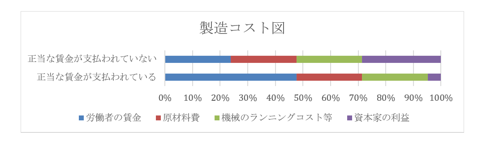

# 社会主義  
  
## ●社会主義とは  
・近現代に於いて、資本主義に対立する概念として扱われるのが【社会主義】である  
・この社会主義とはどういうものか、資本主義と対比しながら見ていく  
※以前も言ったが、社会主義と共産主義について、本稿では「ソ連をはじめとする政治勢力として言う時は共産主義」「経済理論として言う時は社会主義」で呼び分ける。ぶっちゃけ「社会主義とは何か」「共産主義とは何か」というのは神学論争みたいなもので、大学で研究する時はともかく一般知識レベルでは議論するだけ不毛である  
  
|            |資本主義                                    |社会主義        |  
|------------|--------------------------------------------|----------------|  
|生産手段    |私有を認める                                |公有            |  
|利潤の追求  |認める                                      |認めない        |  
|経済の計画性|無計画（修正資本主義の場合、経済計画はある）|計画経済        |  
|景気変動    |起こるもの                                  |理論上は起きない|  
  
  
・社会主義を特徴づける二本柱は、【生産手段】の【公有】と【計画経済】である  
・資本主義は生産手段の私有を認めるが、社会主義は公有のみとする  
⇒社会主義の理論では、「生産手段が社会化される（みんなのものになる）」という言い方。なので公有。ただ、現実の社会主義経済国家は原則、生産手段の【国有化】を行っているので、「【生産手段】の【国有】」という言い方でも別に間違いではない  
※全ての生産手段が公有である以上、社会主義国家に於ける全ての経済活動は公共事業、とも言える  
・また、資本主義は利潤の追求を認め、それ故に自由競争に任され無計画な経済だった  
・一方、社会主義は利潤の追求を認めず、経済は全て計画的に行われる  
⇒その為、無計画な資本主義と違って、不景気と好景気を繰り返すような事はない。社会主義経済は常に一定の成長を行い、景気の変動は起こらない。理論上は、そういう事になっている  
  
・一方、多少政治的な面から見ると、資本主義は資本家と労働者が対立する構造である  
⇒資本家は労働者に給料を払いたくない。労働者は沢山の給料が欲しい。そして資本家と労働者なら基本資本家の方が強いので、放っておくと労働者の待遇はどんどん悪くなり、また貧乏になり、一方で資本家はより金持ちになっていく…という形になる  
・社会主義では、【階級闘争】が極限に達すると、【社会主義革命】が起こると考えた  
⇒ここで言う階級闘争とは、資本家と労働者の対立。また、資本家をブルジョワジー、労働者をプロレタリアートと言う為、社会主義革命を【プロレタリア革命】とも言う  
・革命によって資本家は打ち倒され、労働者の国になる…と考えた訳である  
⇒生産手段の公有、という発想もここから来ている。資本主義なら生産手段は資本家が私有しているが、社会主義革命によって資本家が打ち倒され、労働者皆が共有する、という社会になると考えた  
・こうして、社会主義を実現した国は労働者の楽園になる、というのが社会主義の考え方である  
※政治分野で、ソ連（社会主義経済を採用する国家の代表選手）は「「金持ちを皆殺しにすればみんな幸せになれる」って言って、本当に金持ちを皆殺しにして（ロシア革命）できた国」「世界各国に向けて「君達も金持ちを殺しましょうよ～幸せになれますよ～」」とかやってた、と言ったが、これはそういう事である  
  
## ●社会主義の修正  
### ○社会主義の現実  
・社会主義はその理念と理論上、労働者の楽園である  
・では現実問題として、社会主義を採用した国は労働者の楽園になったか？  
・結論から言えば、全然そんな事はなかった  
・例えば景気変動は、社会主義下では理論上起きない筈である  
・しかし社会主義国家はしばしば不況に見舞われた  
⇒この「理論上」というのが曲者で、「理論上起きないものが起きているのは、社会主義を邪魔する奴がいるからだ！」という話になり、槍玉に挙げられた人が収容所に送られたり殺されたりする。社会主義国家は必ずと言っていいほど自国民を虐殺するし、必ずと言っていいほど全体主義国家になって恐怖政治を布くが、その原因の一部はこういうところにある  
  
・ではどうして、社会主義は労働者の楽園になれなかったのか？  
・一応、教科書レベルでは分配が原因とされる  
⇒資本主義は自由競争の世界なので、頑張った成功者は沢山お金が貰える。一方、社会主義国家はこの自由競争こそが諸悪の根源であるとして、全ての労働者が平等に同じ給料を貰える、とする。故にどんなに頑張っても同じ給料しか貰えないから、労働者から働く意欲が失われた…という風に、社会主義がうまくいかなかった理由を説明する  
  
・ただ、この説明では納得しない人も多いだろう  
・それこそ現代の日本は、どんなに頑張っても基本的に同じ給料しか支払われない  
・と言うか、資本主義自体、ほっといたら資本家が労働者の給料を減らす世界である  
・上記の説明はあくまで教科書的な説明、と捉えた方がいい  
  
・では何故社会主義は失敗したのか？  
・これ説明するとめっちゃ長くなるし、試験に出るとこでもないので、よく言われる話の要点だけ列挙する  
※詳しく知りたい！　という人は是非自分で調べてみてください  
１：「金持ち（資本家）を抹殺して労働者だけの世界にしよう！」と言ってたら、国家が唯一最大の金持ちになった⇒「資本家が労働者をいじめる」が「国家（政治家、官僚）が労働者をいじめる」に変わっただけに終わった  
２：生産手段を国有化＆計画経済な為巨大な国家と巨大な官僚組織が必要⇒この国家と官僚に対するチェック機構がなく（何せ全体主義的恐怖政治が基本）、チェック・アンド・バランスが働かず、国家と官僚が腐敗する一方になった  
３：計画経済は、貧乏な国ならともかくある程度以上豊かになると、細かい需要に対応できなくなる（例えば服。貧乏な国なら、国民全員に数着、国民の制服を配ればいい。しかし豊かになると、皆お洒落したくなる。そういう時、どんなデザインの服を何着生産、とか政府に決められますか？　という話）  
４：生産手段を国有化したという事は、言ってみれば「国が唯一の超巨大企業になった」という事でもある。これは、言ってみれば独占資本主義の究極形とも言える。ところで、独占資本主義はどうなりましたか…？  

  
### ○各国別社会主義の修正  
・ともあれ社会主義は、各国でうまくいかなかった  
・それでもしばらくは、「社会主義の邪魔をする奴がいるからだ！」と内ゲバに勤しんでいた  
・が、1960年代以降ともなると「そもそも社会主義ってもの自体がガバガバなのでは？」と気付き始める  
・この時期以降、各社会主義国家では、デタントも背景にして社会主義の修正が行われていく  
・こういった、改造された社会主義を【修正社会主義】という  
⇒修正資本主義と同じような言い方  
・基本的には、社会主義・全体主義を基本路線にしつつ、資本主義的な要素を取り入れていく感じ  
  
・ソヴィエト社会主義連邦共和国  
・1965年から、［リーベルマン方式］が導入される  
⇒ノルマ以上の生産を達成した組合に報奨金を支払う。平たく言えば、成果に応じたボーナスを容認した  
・1985年に書記長に就任した【ゴルバチョフ】が、【ペレストロイカ】を行っている  
⇒市場原理の導入を行った  
  
・中華人民共和国  
・【毛沢東】が死んだ後の1980年代から、【鄧小平】が【改革開放】政策を採用する  
⇒資本主義要素を取り入れて停滞した経済を打破し、更に近代化していこう、というような政策  
※鄧小平は元々、毛沢東が生きていた頃から「毛沢東の路線じゃ駄目だ」と考えていた人物で、［四つの近代化］を唱えている。その為、失脚して死にかかってもいる  
・この改革開放路線により、中華人民共和国は【社会主義市場経済】を自称している  
・以下、改革開放路線で行われた政策一覧  
  ［農業生産責任制］：ノルマ以上に生産した農作物は農家が自由にしていい  
  ［経済特別区（経済特区）］：指定した地域に市場原理を導入し、外資企業を誘致する  
  ⇒経済特区は法人税率が低い為、母国の高い税率を嫌う企業が税金逃れに他の地域へ移動する、いわゆる［タックス・ヘイヴン（租税回避地）］となった  
・また、欧州の植民地となっていた［香港］と［マカオ］は、［一国二制度］を布いている  
⇒それぞれイギリス、ポルトガルから、二十世紀中に返還された。そして、返還されてから半世紀の間は、返還前から保障されていた自由主義、資本主義を尊重しますよ、という制度。尚、令和二年現在、香港国家安全維持法の成立により、香港の一国二制度は完全に死んだと言っていい。何せ「香港に民主主義を根付かせよう」と言った人であれば、それが外国人であったとしても逮捕できるような状態になった訳なので…  
  
・その他  
・ベトナム社会主義共和国では1986年以降、［ドイモイ政策］を実施。市場原理を導入している  
・旧ユーゴスラヴィア社会主義連邦共和国は例外的に、1950年代から自主管理社会主義を採用している  
⇒分権的計画経済とも。普通の社会主義国家は、計画経済の計画策定を中央政府が全部やる。そうではなく、中央政府は大体の目標を決めて、細かいところは地方団体に投げる体制を採った  
  
## ●社会主義の理論  
### ○マルクス  
・社会主義の理論と言えば、何を措いてもカール・【マルクス】である  
・今でも赤い人達はマルクスを読む  
・彼の【『資本論』】は、社会主義、共産主義にとって、聖典と言ってもよい  
  
・既に述べたように、マルクスは資本主義国家で社会主義革命が起きるのは必然と考えた  
・何せ資本主義は、放っておけば資本家はより金持ちに、労働者はより貧乏になっていく体制である  
・どうしてそうなるかと言えば、資本家が労働者を虐めるから。搾取するからである  
・やがて資本家と労働者の対立（【階級闘争】）が極限に達すると、【社会主義革命】が起こる  
⇒こうして起こる革命を【プロレタリア革命】ともいう  
・革命によって資本家は打ち倒され、労働者の楽園が作られる…という、既に述べた考え方である  
  
・じゃあ、具体的に「資本家に労働者が搾取される」とは具体的に、どういう状態なのか？  
・これを理論化したのが【剰余価値説】である  
・「労働者は、賃金以上の価値を生んでいる」「しかし資本家はその部分を搾取している」  
・これじゃ何を言ってるか分からないので例を挙げよう  
・資本家からすると、商品を高く売れば、また商品の製造コストを下げれば、利益は高くなる  
  

  
・そこで、資本家は、労働者を給料以上に働かせる  
・「この給料ならまぁ、これぐらいの労働時間が相場でしょう」という時間以上に働かせる  
・例えば、給料は一時間につき二千円が相場だとする  
・そして、資本家が日給一万円で労働者を雇い、一日八時間労働させたとする  
・すると労働者は、本来一万六千円分労働したのに、一万円しか貰えない事になる  
⇒六千円分は、タダ働き同然という事になる  
・この六千円分が剰余価値であり、労働者はこの剰余価値を資本家に搾取されている、とした  
  
  
・また、マルクスは歴史についても色々書いていて、彼の史観は【唯物史観】と言われる  
⇒【史的唯物論】とも言う  
  
・彼は、物質的な「生産」こそが、あらゆる歴史の【下部構造（土台）】であるとした  
・そして、政治とか宗教とか文化というものは、その上に乗っかっている【上部構造】だとした  
⇒あらゆる物質的な、商品の生産。農作物の生産、工業製品の生産…そして、その為に結ばれる人間関係（［生産関係］）や、その社会に於いてどれぐらいの商品が生産できるか（［生産力］）。そういうものが、歴史の土台になっている、とした  
  
・ところで、マルクスの書いた事というのは誤解されて後に伝わったものが異様に多い  
⇒いわゆる共産主義についてすら、マルクスは生前から共産主義者に対し、「あいつらが共産主義者なら俺は共産主義者じゃねーよ」みたいな事を言っている  
・唯物史観についてもそうで、「下部構造が上部構造を規定する」というものだとして広まった  
・物質的な生産、言い換えれば経済のありようが政治とか宗教を決める、という論として広まった  
⇒実際にはマルクスは、「下部構造が上部構造を規定するのと同じぐらい、上部構造から下部構造への影響ってのもあるよ」みたいな事を言っている  
  
・他にも、唯物史観とは「人類の歴史は必ず以下のように発展する」という見方だと誤解されてきた  
  原始共産制→古代奴隷制→中世封建制→近代資本主義→共産主義  
  
・だから戦後の日本の歴史学者は、以下のような議論を割としていた  
  「日本だと中世封建制は鎌倉時代なんじゃないか？」  
  「いや、鎌倉までは古代奴隷制で室町からが中世封建制では？」  
  
・じゃあ実際のところどうか？  
・実はマルクスは、「この考え方は西欧のみにしか適用できない仮説です」みたいな事を言っている  
  
・このように「マルクスの言った事」と「マルクスの言った事として広まったもの」は違うのでややこしい  
  
### ○マルクス以外  
・マルクス以外で社会主義の理論を展開した人で言うと、フリードリヒ・【エンゲルス】がいる  
・「マルクス、エンゲルス」とよく並び称されるように、二人は親友であり、盟友だった  
・実業家で金持ちだったエンゲルスは、生涯を通してマルクスに協力し、応援し続けた  
⇒エンゲルスはマルクスより長生きだったが、マルクスの死後、マルクスを第一バイオリン、自分を第二バイオリンに喩えている。それほどまでにエンゲルスはマルクスを応援し、資金面でも思想面でも協力し続けた。最早、金持ちのアイドルオタクが、最推しアイドルを自らプロデュースしているかのような次元であった  
  
・社会主義という思想は、実に、マルクスとエンゲルスの二人三脚によって作り上げられたと言ってよい  
・［共産党宣言］はマルクスと一緒に出したものである  
  
・ただ、後にソ連をはじめとする共産主義勢力を作り上げた理論は、二人のものかと言われると疑問である  
⇒既に見たように、マルクスは生前から共産主義者に対し、「あいつらが共産主義者なら俺は共産主義者じゃねーよ」みたいな事を言っている。そもそもマルクスは、「資本主義による経済発展が極限に達すると、資本家と労働者の対立も極限に達し、社会主義革命になる」と言っていた。その社会主義革命が、経済的には遅れた農業国家のロシア帝国で起きた訳だから、その時点でマルクスの理論から外れている  
・共産主義勢力の理論は、むしろ［レーニン］によって提供された  
⇒ロシア革命を指揮し、初期のソ連の最高指導者となった  
  
・有名な著書は［『帝国主義論』］  
・レーニンは「帝国主義はプロレタリア革命の前夜である」と言っている  
⇒要するに、「資本主義による経済発展が極限に達する」が社会主義革命の前提ではなく、その国が帝国主義を採るようになるのが社会主義革命の前提だ、と言っている。こうして、社会主義は「金持ちを殺せば幸せになれる」「皆も金持ち殺しましょうよ」になっていった  