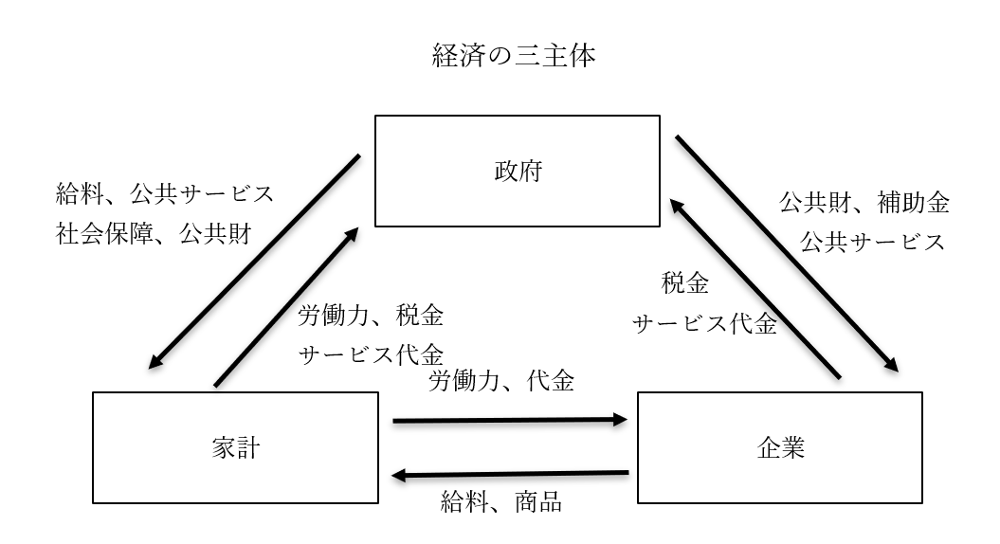

# 経済の三主体  
## ●授業動画一覧＆問題集リンク

|問題集|[ウェブサイト](https://teacheramesaka.github.io/hsworkbookcivics/tag/eco01_04/)||
|:----:|:----:|:----:|
|経済の三主体|[YouTube](https://youtu.be/nM5SuMNI18c)|[ニコニコ動画](https://www.nicovideo.jp/watch/sm39723605)|

## ●概説
・経済活動を行うモノを分類する際、基本的な単位となるものを経済主体という  
・現代のマクロ経済学では、一般的に【家計】【企業】【政府】に分ける  
・この三者が、カネやモノをやりとりして経済が成り立っている、という風に考える  
※他にも、資本家、労働者、地主とか、生産者、消費者みたいな分け方もある  
  

  
・経済の三主体の関係は、概ね前掲の図のようになる  
  
・例えば家計と企業  
・家計（個人）は、社員として企業に［労働力］を提供し、代わりに［給料］を受け取る  
・もしくは、家計から代金を支払い、企業から商品を受け取る  
⇒これがいわゆる［消費］という奴である  
  
・例えば家計と政府  
・家計（個人）は、公務員として政府に［労働］力を提供し、代わりに［給料］を受け取る  
・また、家計は政府に［税金］を支払う  
・一方、政府は［公共財］や［社会保障］を提供する  
※この際、「税金を支払った代償に社会保障や公共財を貰える」訳ではないので注意。もし社会保障が税金の代償であるなら、税金を払えないような本当に貧乏な人は、生活保護（社会保障の代表選手）を受けられないし公共の道路すら利用できないという話になる。勿論、有料の公共サービスであれば、サービスの代金は必要になるが、ここは大の大人でも勘違いしている事なので注意  
※公共財は、「市場の失敗」の「その他の市場の失敗とその対処」で詳しくやりますが、要するに「社会を維持する上で必要だが儲けにならない」モノ。道路とか軍隊とか  
  
  
・例えば政府と企業  
・政府は［公共財］を企業に使わせたり、企業に［補助金］を与えたりする  
・一方、企業は［税金］を支払う。家計と同様、これは公共財や補助金の代償という訳ではない  
・勿論、有料の公共サービスであれば、家計と同様企業も代金を支払って政府からサービスを受ける  
  
・尚、前掲の経済の三主体図は、全てのモノ、サービス、カネの動きを書いたものではない  
・代表的なものを書いただけなので、書いていないモノ、サービス、カネの動きもある  
・例えば「地主で、企業に工場の土地として土地を貸している」という人がいたとする  
・この場合、家計は土地を企業に提供し、企業は地代を支払う  
・他には、投資家の場合は、資金と配当が交換される  
・即ち、家計から株式購入という形で企業に資金を提供し、代わりに企業は配当金を支払う  
※株式（株、株券）とは要するに、企業が「これを買ってくれたら後で儲けに応じてお金（配当金）払いますよー」というチケット（株券）を売り、このチケットを売って集まったカネを使って商売する、というもの  