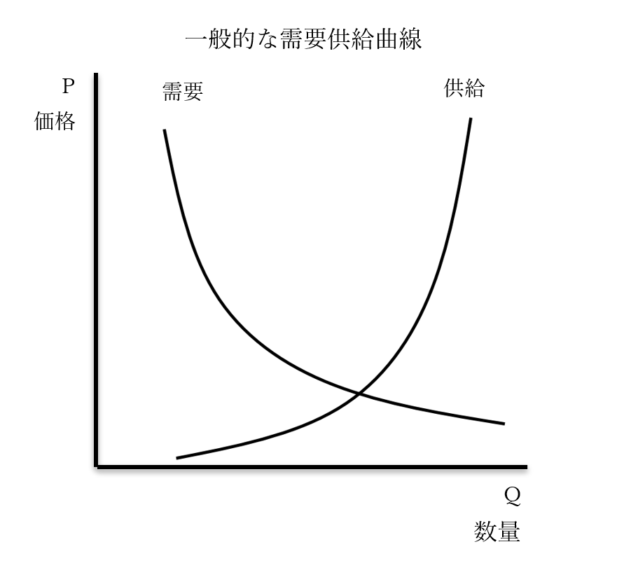
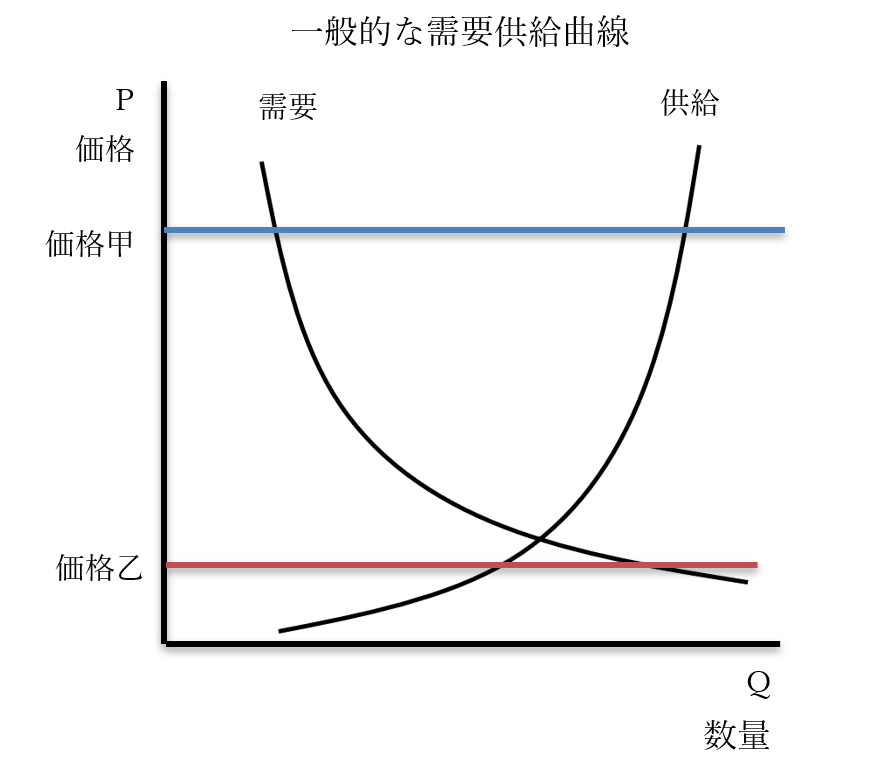
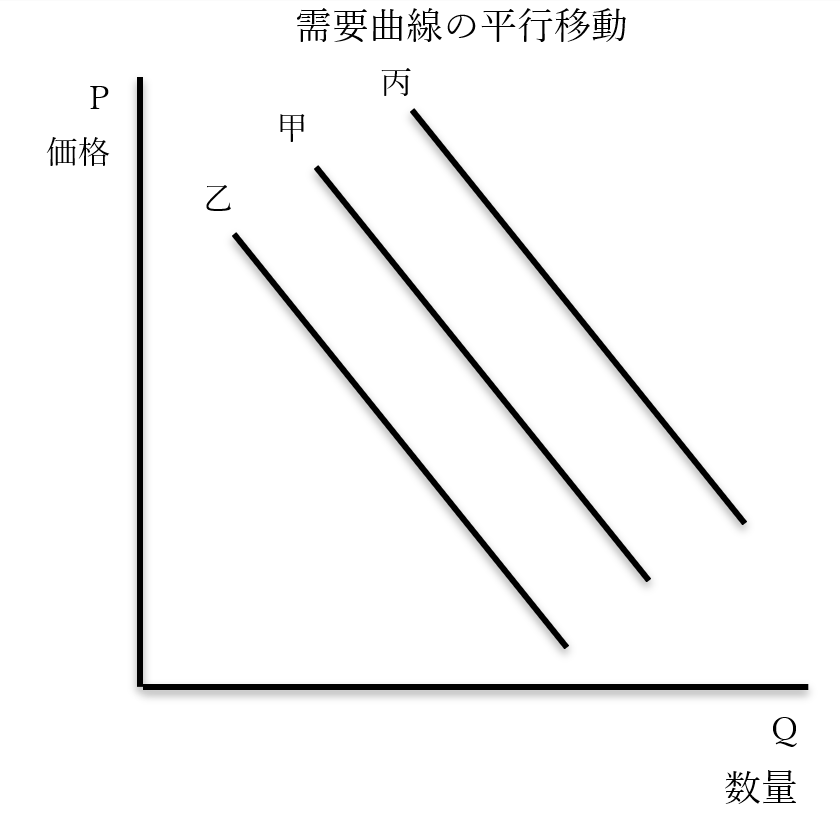
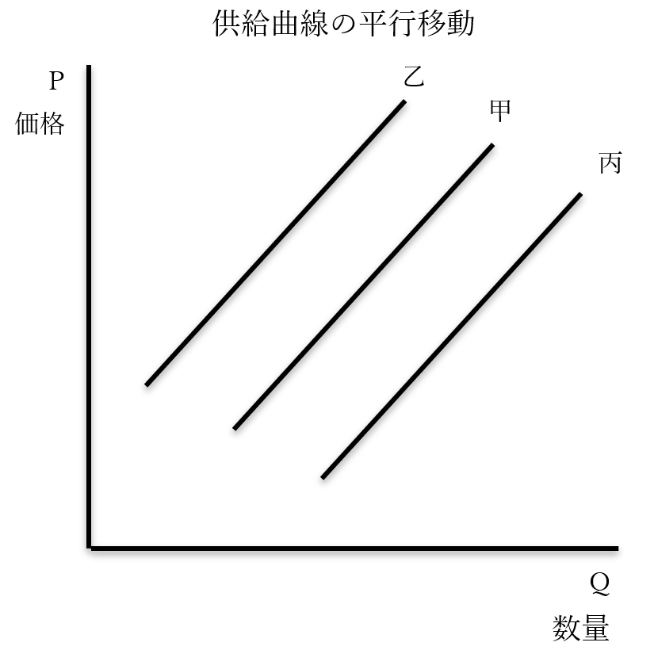
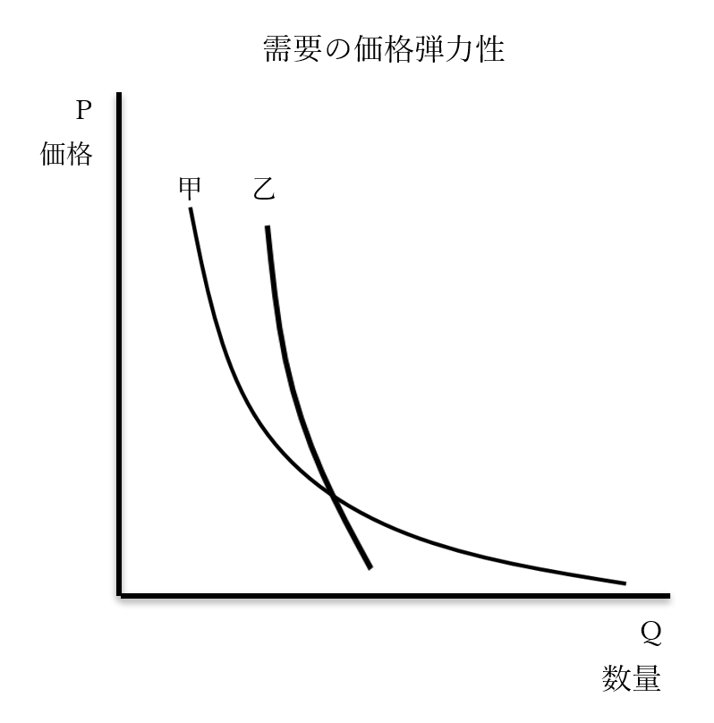
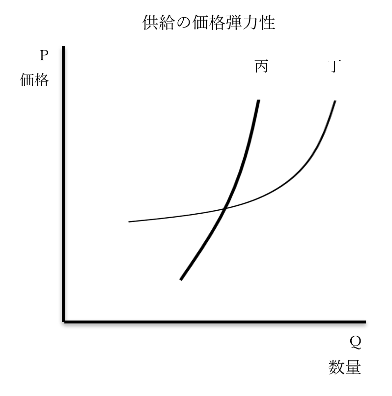

# 需要供給曲線

　経済学は、経済がどうしてこういう風になったのか、という分析と理由付けを行う学問でもある。ただ、分析をするにしても、現実の経済というのは関係する要素があまりにも多い。そこで、［完全競争市場］という理想的な市場をまず想定する場合が多い。理想的な状態なので、当然分析もやりやすい。そこで簡単に分析してから、少しずつ複雑で、現実的な状況の分析へ移っていく訳である。  
　その分析に使うのが、【需要供給曲線】である。究極的には、経済学とは、この曲線を考察する学問と言える。需要供給曲線をあらゆる状況で完璧に描き、また理解できているのであれば経済学を極めたとすら言ってもいい。本節ではこの需要供給曲線について学ぶ。  
  
## ●需要供給曲線の概説  
  

  
・一般的な需要供給曲線では、縦軸を【価格】、横軸を【数量】とする  
※価格、数量と書いていなかったり、PriceのP、QuantityのQと書いてあったりする場合が多い。需要と供給に至っては、基本的に全く書いていない  
  
・一般に【右下がり】になっているのが【需要】曲線である  
⇒需要とは要するに、「商品を買いたい」という話である。高いモノはあまり買いたくない。安いモノなら買いたいという人が沢山いる。つまり、価格が上がると需要は【減少】し、価格が下がると【増加】する  
・一般に【右上がり】になっているのが【供給】曲線である  
⇒高いモノはたくさん売りたい（供給したい）。安いモノはあまり売りたくない（供給したくない）。つまり、価格が上がると供給は【増加】し、価格が下がると【減少】する  
  
・需要曲線と供給曲線が一致する点は、理論上最も適切な価格という事になる  
・理論上、この価格であれば売れ残りもなく、品切れもない  
・こういう価格の事を、【均衡価格】という  
  
  

  
・価格甲のように、均衡価格に比べ高過ぎる価格が設定されている場合、【超過供給】が発生する  
⇒高いモノはあんまり買いたくないから需要は少ない一方で、高いモノを沢山売りたいからと大量生産が行われ、結果、商品が余る  
・超過供給が発生した場合、価格は【下落】する  
⇒超過供給が発生した場合、在庫を大量に抱える事になり、安売りする羽目に陥る為  
  
・価格乙のように、均衡価格に比べ安過ぎる価格が設定されている場合、【超過需要】が発生する  
⇒安いモノは皆が買いたいから需要は多い一方で、安いモノは売ってもあんまり儲からないからと供給が少なく、結果、商品が足りなくなり「買いたいのに買えない」Nintendo Switch現象が続出する  
・超過需要が発生した場合、価格は【上昇】する  
⇒超過需要が発生した場合、皆「買いたいのに買えない」状態なので、多少値上げしたところで売れる。高く売った方が儲かる以上、値上げが行われる  
  
・こうして、適正でない価格が設定されていたとしても、最適な価格へ向けて動いていく作用が起こる  
⇒【価格の自動調節機能】という  
・このように、自由に競争が行われる市場では、意図せずとも最適への動きが起こる  
・この現象を、アダム・スミスは「神の見えざる手」と呼んだ訳である  
⇒そして、どうせ「神の見えざる手」で何とかなるから、と供給を増やし続けた（拡大再生産）結果が、世界恐慌とも言える。世界恐慌の前、モノがあまり売れなくなってきているのに、神の見えざる手を信じて、また「供給は需要を生み出す」と言って拡大再生産が行われ続け、売れない分は投資家による投資や借金で誤魔化していた。世界恐慌には、それが誤魔化しきれなくなって破綻した、という側面がある  
  
## ●平行移動  
  
  
  

・何らかの理由で、需要曲線もしくは供給曲線が動く場合がある  
・この動く事を、平行移動とかシフトとか言う  
  
・需要曲線甲が需要曲線丙に動いた場合、［右上］に平行移動（シフト）した、と表現する  
・需要曲線甲が需要曲線乙に動いた場合、［左下］に平行移動（シフト）した、と表現する  
⇒見た目上は真横にしか動いてないとかそういう場合も、右上、左下、と表記する  
  
・需要曲線が右上に平行移動するのは、以下のような場合である  
１：［国民の所得］が［増加］した  
⇒国民の財布の中身が増えたから、沢山買えるようになった  
２：ある商品が［流行］した  
⇒流行したから皆が欲しがるようになった  
３：［代替財］の価格が［上がった］  
⇒代替財とは、例えばパンに対するお米。朝はご飯派だった人も、米の価格が上がったのでパンにするようになった、みたいな場合  
４：［補完財］の価格が［下がった］  
⇒補完財とは、例えばパンに対するバター。朝はご飯派だった人も、バターの価格が下がったのでパンにするようになった、みたいな場合  
  
・需要曲線が左下に移動するのは、右上の逆となる  
１：［国民の所得］が［低下］した  
２：ある商品の［流行］が終わった  
３：［代替財］の価格が［下がった］  
４：［補完財］の価格が［上がった］  
  
  
  
  
・供給曲線甲が供給曲線乙に動いた場合、［左上］に平行移動（シフト）した、と表現する  
・供給曲線甲が供給曲線丙に動いた場合、［右下］に平行移動（シフト）した、と表現する  
⇒見た目上は真横にしか動いてないとかそういう場合も、左上、右下、と表記する  
  
・需要曲線に左上に平行移動するのは、以下のような場合である  
１：［原材料］が［値上がり］した  
⇒原材料が値上がりすれば、その分は値段に転嫁されて値上がりを起こし、売れる量は減る  
２：［賃金］が［上がった］  
⇒［賃金］が上がれば、その分は値段に転嫁されて値上がりを起こし、売れる量は減る  
３：税（消費税、法人税等）が［引き上げ］られた  
⇒税率が引き上げられれば、その分は値段に転嫁されて値上がりを起こし、売れる量は減る  
  
・需要曲線に右下に平行移動するのは、以下のような場合である  
※大体左上移動の逆だが、一つ要因が追加される  
１：［原材料］が［値下がり］した  
⇒原材料が値下がりすれば、その分は値段に反映されて値下げされ、売れる量が増える  
２：［賃金］が［下がる］  
⇒賃金が下がれば、その分は値段に反映されて値下げされ、売れる量が増える  
３：［税］（消費税、法人税等）が［引き下げ］られた  
⇒税率が引き上げられれば、その分は値段に反映されて値下げされ、売れる量が増える  
４：［イノベーション（技術革新）］が起きた  
⇒イノベーションによって、安く大量生産できるようになった  
  
・ちなみに、「不況時に増税するとか経済死ぬぞ」というのはこのせい  
・不況時はモノが売れなくて（買えなくて）皆困っている  
・なのに増税して値段が上がったらモノが余計売れなく（買えなく）なるんですよ、という  
⇒地震とかで不況なのに「復興増税」とか言って増税（特に消費税・法人税）するとヤバい、という話  
  
・ただ気を付けておいてほしいのは、以上の話はあくまで理論上の話、という事  
・現実に必ずこうなるとは限らない  
・例えば、賃金が下がったからと言って値段も下がるとは限らない  
⇒賃金を下げて値段はそのままにして、増えた利益は経営陣と株主で山分け…というのは、特に1980年代の新自由主義の台頭以降、世界中で繰り返されてきた光景である。そのせいで、「国民所得が下がったから需要が縮小」「でも賃金が下がったから値段が下がる、は起きない」となり、世界中で経済が縮小した。これは日本でも、米国でもそう  
  
～ここから雑談～  
・経済学では、基本的に「あらゆる存在は経済的に合理的である」という前提で研究される事が多い  
・例えば消費者は、同じ品質の商品があれば、１円でも安い方を必ず買う、という風に考える  
・ただ実際には、「この会社が好きだから」というような理由で高い方を買う場合もある訳で…  
⇒経済学が現実離れしているとか、予想を的中させるのが下手糞と言われるのはこの辺が理由の一つ  
  
・まぁ実際、ここ数十年、経済学者の言う通りやればやるほど労働者の待遇は悪くなり、貧富の格差は拡大し、経済は縮小し…となってしまっている訳で、未来を考えるという意味では、近年の経済学は正直、アレである  
・「これは、これこれこういう理由で起こった」と理由付けするのは得意なのだが…  
～ここまで雑談～  
  
## ●価格弾力性  
・需要曲線や供給曲線は、どんな商品でも同じ曲線を描く訳ではない  
・モノによって線が緩やかだったり急だったりする  
・この勾配を表現する時使う単語が［価格弾力性］  
・曲線が緩やかであれば、価格弾力性が［大きい］  
・曲線が急であれば、価格弾力性が［小さい］  
  
  
  
・甲のように需要曲線の緩やかな商品は、［需要の価格弾力性］が［大きい］と言える  
⇒贅沢品のような、なくても困らないもの。また、他の商品で代替できるものは、価格がちょっと上がっただけで一気に誰も買わなくなるので、こうなる  
・乙のように需要曲線の急な商品は、［需要の価格弾力性］が［小さい］と言える  
⇒生活必需品や、他の商品で代替できないものは、価格が上がっても買わざるを得ないので、こうなる  
  
  
  
・丙のように供給曲線の急な商品は、［供給の価格弾力性］が［小さい］と言える  
⇒農作物は大抵の場合、増産しようとしても、そう思ってから一年かかる（作物が実るのに一年かかる）。このように、急に供給を増やせない場合は、価格弾力性が小さくなる  
・丁のように供給曲線の緩やかな商品は、［供給の価格弾力性］が［大きい］と言える  
⇒工業製品は、やろうと思えば工場を二十四時間動かすとかで緊急増産ができなくはない。少なくとも農作物よりは、一気に供給を増やせる。こういう場合は、価格弾力性が大きくなる  
  