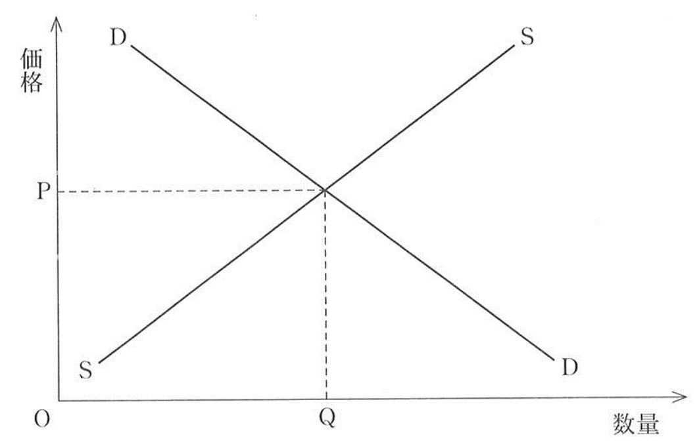
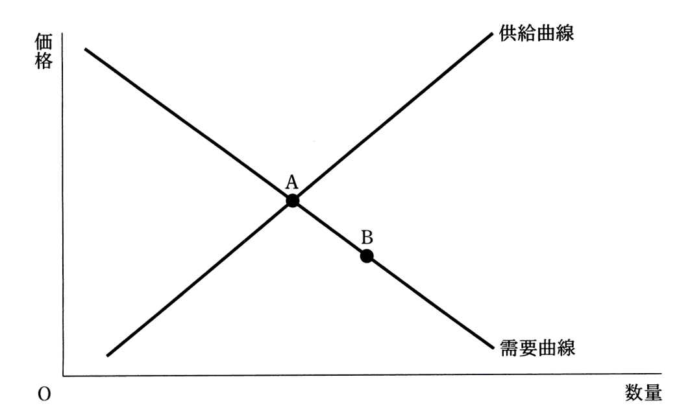
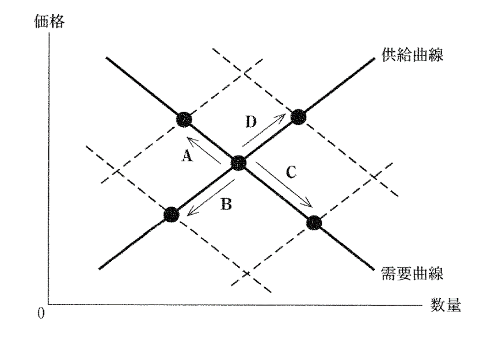
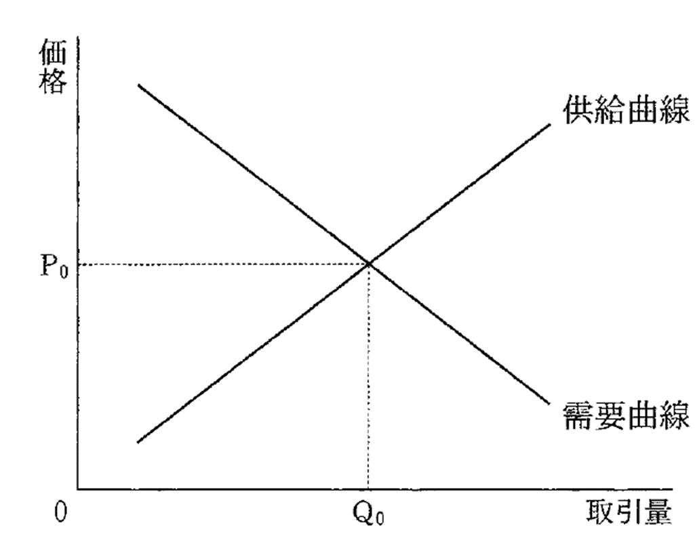
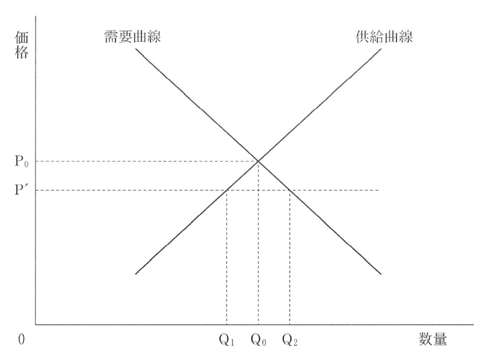

# 経済分野第一章需要供給曲線問題演習  
  
  
## 問題
### 問１：センター試験本試験、2016年、改題  
  
　次の図は、ある財の完全競争市場における需要曲線DDと供給曲線SSとを示したものである。この財を生産するために使用する原材料の価格が低下した場合、そのことによって生じる変化についての記述として正しいものを、下の①～④のうちから一つ選べ。  
  

  
① 需要曲線が右上にシフトし、財の価格が上がる。  
② 需要曲線が左下にシフトし、財の価格が下がる。  
③ 供給曲線が左上にシフトし、財の価格が上がる。  
④ 供給曲線が右下にシフトし、財の価格が下がる。  
   
### 問２：センター試験本試験、2017年、改題  
  
　次の図には、ある財の完全競争市場における当初の需要曲線と供給曲線とが表されている。いま、この市場において、均衡点が AからBに移動したとしよう。このような均衡点の変化を生じさせた要因として最も適当なものを、下の①～④のうちから一つ選べ。  
  

  
① この財を消費する消費者の所得が増加した。  
② この財に対する消費者の人気が高まった。  
③ この財にかけられる税が引き上げられた。  
④ この財を生産する技術が向上した。  
  
  
### 問３：センター試験本試験、2015年、改題  
  
　次の図には、スポーツ用品の需要曲線と供給曲線が実線で描かれている。また、図中の矢印A~Dは均衡の移動を表している。スポーツ用品の生産者は、当初、賃金の安い児童を多く雇用していたが、その後、国際 NGO(非政府組織)の働きかけなどにより、生産者には国際的な労働基準を遵守することが求められるようになったとしよう。そのため、生産者は児童を雇用せず、より高い賃金を支払うようになったとする。他の条件を一定として、当初の均衡から、生産者が高い賃金を支払うようになった後の均衡への移動を表すものとして正しいものを、下の①～④のうちから一つ選べ。  
  

  
①Ａ　　　②Ｂ　　　③Ｃ　　　④Ｄ  
   
### 問４：センター試験本試験、2013年、改題  
  
　下線部について、市場で取引される財によって事故が発生したとき、 「企業(加害者)に過失が認められた場合、企業に被害の賠償を義務づける」というルールが適用されている社会を考える。次の図は、このときの、ある財市場の需要曲線と供給曲線を示している。その後、政府は、「企業(加害者)の過失の有無にかかわらず、企業に被害の賠償を義務づける」というルールに変更したとする。このとき、需要曲線には影響を与えないという条件の下で、このルールの変更が、図で示される市場に与える影響を述べた記述として最も適当なものを、下の①～④のうちから一つ選べ。  
  

  
① 企業は費用が増加すると考えるので、供給曲線は右下にシフトし、財の取引量は、図中のQ0より多くなる。  
② 企業は費用が減少すると考えるので、供給曲線は左上にシフトし、財の取引量は、図中のQ0より少なくなる。  
③ 企業は費用が増加すると考えるので、供給曲線は左上にシフトし、財の取引量は、図中のQ0より少なくなる。  
④ 企業は費用が減少すると考えるので、供給曲線は右下にシフトし、財の取引量は、図中のQ0より多くなる。  
   
### 問５：センター試験本試験、2018年、改題  
  
　次の図は、ある財の市場における需要曲線と供給曲線を実線で示しており、また、価格P0で需給が均衡することを示している。いま、政府によってこの財の価格の上限がP'に規制されたとき、取引される財の数量についての記述として最も適当なものを、下の①～④のうちから一つ選べ。  
  

  
① 取引される財の数量はQ0になる。  
② 取引される財の数量はQ1になる。  
③ 取引される財の数量はQ2になる。  
④ 取引される財の数量は0になる。  
   
## 経済分野第一章需要供給曲線問題演習　解答  
  
### 模範解答
問１：④　　　問２：④　　　問３：①　　　問４：③　　　問５：②  
  
### ○総論  
・センターの過去問見てると、毎年一回は需要供給曲線が出てくる  
・その次元で頻出なのがこの手の問題である  
・そしてまた、話を聞くだけではなく、実際に問題演習してみると理解しやすくなる話でもある  
・そういう訳で、今回の問題で慣れていってほしい  
  
・尚、見ての通り、その殆どが平行移動（シフト）の話である  
・そして平行移動は、究極、以下の二つで説明される  
１：同じ価格の商品でも、買う人は増える（減る）⇒需要曲線が右上（左下）に吹っ飛ぶ  
２：商品を同じ量作るにしても、価格は上がる（下がる）⇒供給曲線が左上（右下）に吹っ飛ぶ  
  
  
### ○問１  
・ある商品の原材料が値下がりした、という話  
・という事は、「商品を同じ量作るにしても、価格は下がる」  
・つまり、供給曲線が右下に吹っ飛ぶ  
・需要供給曲線問題の基本中の基本、極めて素直な問題  
  
  
### ○問２  
・ちょっとひねった問題  
・図を見た感じ、供給曲線が右下に動いたという事っぽいのだが…  
⇒需要供給曲線の交わる点（均衡価格）がAからBに動いたという事は、供給曲線が右下に動いたとしか考えられない。需要曲線は右上か左下にしか動かないし  
・それはともあれ、この問題はどう考えたらいいのか？  
  
・問１のような、素直な問題の考え方はこう（↓）  
「ある商品の原材料が値下がりした」⇒「商品を同じ量作るにしても、価格は下がる」⇒「供給曲線が右下」  
・そうではなくて、こう（↓）いう順番で答えを出せ、というのがこの問題  
「供給曲線が右下」⇒「商品を同じ量作るにしても、価格は下がる」⇒じゃあ何で値下がりした？  
  
・商品が値下がりする要因は④しかない。よって④が正解  
  
  
   
### ○問３  
・問題文が長く、現代文要素も強い問題  
・問題文をよーーーく読むと、要するに「スポーツ用品の労働者の給料が上がった」という話をしている  
・その場合、スポーツ用品の需要供給曲線はどう変化するのか？　という問題である  
  
・となると、少なくともスポーツ用品については、「商品を同じ量作るにしても、価格は上がる」  
・つまり、供給曲線は左上に吹っ飛ぶ筈である  
・逆に需要については、変化は無いだろう  
・国民全員の給料が上がるなら話は別だが、スポーツ用品の労働者だけだからそんな派手には動かない  
  
・左上に吹っ飛んだ結果の①が正解になる  
  
  
### ○問４  
・問題文を読むと、「需要曲線には影響を与えない」とある  
・つまり供給曲線だけ考えればいい  
・そして問題文によると、法改正で製造企業が訴訟されやすくなる、という話である  
・訴訟されやすくなら、その対策として、商品の価格を上げてより多く稼ぐ…というのが予想される  
・いざという時のカネを集めておけば、訴訟されても多少は安心である  
  
・つまり、「商品を同じ量作るにしても、価格は上がる」  
・左上に吹っ飛んだ結果の③が正解になる  
  
  
### ○問５  
・ある意味引っ掛け問題  
・普通、需要供給曲線の問題は平行移動を問う  
・だから皆、平行移動の問題だと思い込む  
・そしてこの問題でも、「価格の上限がP’になったら、どうシフトするんだ…？」と考えてしまう  
  
・しかしよく考えてほしい  
・例えば供給曲線は、「この商品がこの価格になる場合、企業はこれぐらい生産しますよ」である  
・価格がP0なら、企業はQ0個の商品を生産する  
・供給曲線とは、ただそれだけのものである  
  
・だから、もし価格がP’になったら、Q1だけ作る。それで終わりである  
・よって答えは②になる  
  
・別に「商品を同じ量作るにしても、価格は上がる」という訳ではないから、平行移動はしない  
・単に「供給曲線ってなんだっけ」という事だけ考えればいい問題なのだ  
・引っ掛け問題という訳ではないが、受験生が勝手に引っかかる問題である  
    