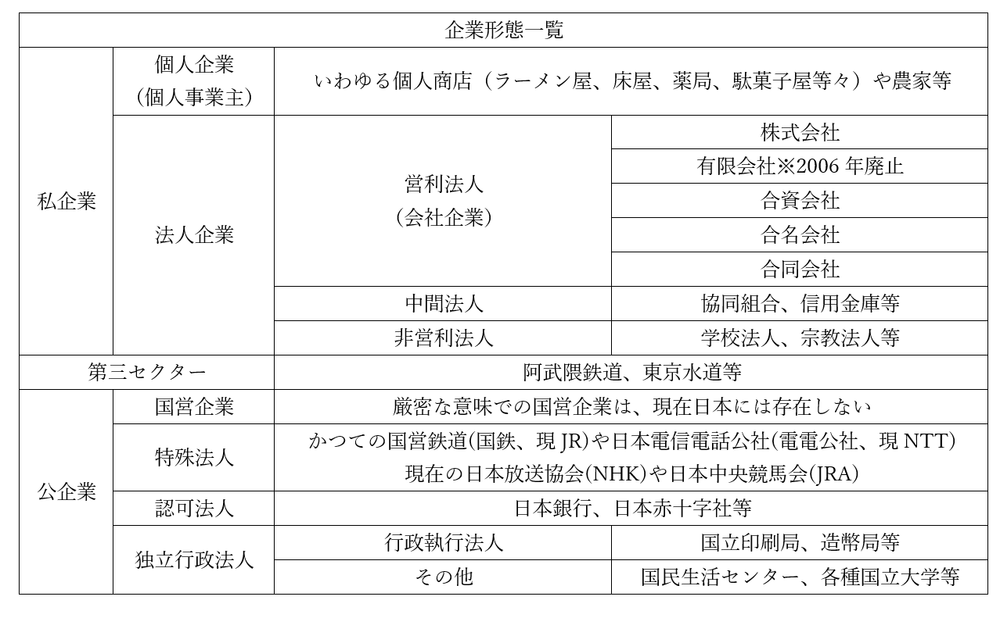
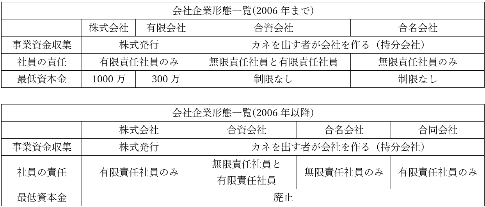

# 企業とは

・ここまで、ただ「企業」と言ってきたが、具体的に日本にはどんな「企業」があるのか？　という話  
  
  
## ●企業の分類  
  

  
・企業は大きく、［私企業］（民間企業）と［公企業］（国有企業的なもの）に分かれる  
  
・私企業はまず、法人として登録しているか、そうでないかに分かれる  
・法人として登録していないのは、個人事業主による個人企業にあたる  
⇒法人として登録するまでもない小規模な個人商店（個人でやってるラーメン屋や床屋）や農家  
・法人として登録している場合は法人企業に分類される  
  
・法人企業は、会社企業、中間法人、非営利法人に分かれる  
・営利法人（会社企業）が、いわゆる会社  
・中間法人は、協同組合や信用金庫等がこれにあたる  
⇒生活協同組合（いわゆるコープ）で買物したり、農業協同組合（JA）のCMを見たりした事があると思うが、ああいうのは「いわゆる会社」ではないが、殆ど会社みたいなもんと言える。それこそコープとか、普通の会社がやってるスーパーと何が違うねん、みたいな。そういうものを中間法人とか言う  
・非営利法人は、学校法人（私立学校）や宗教法人（宗教団体）等がこれにあたる  
⇒少なくとも建前上は「金儲けが目的ではありません」となっているが、まぁ一応企業は企業、というもの  
  
  
・いわゆる会社にあたる営利法人はまた、事業資金の集め方で分類できる  
・株で社外から集めるか、カネを出す者が会社を作るか  
・株で集める場合は【株式会社】【有限会社】  
※株式（株、株券）とは要するに、企業が「これを買ってくれたら後で儲けに応じてお金（配当金）払いますよー」というチケット（株券）を売り、このチケットを売って集まったカネを使って商売するもの  
・カネを出す者が会社を作る場合は、［合資会社］［合名会社］［合同会社］  
⇒この手の会社を総称して持分会社と呼ぶ場合もある  
  

  
※社員の責任とあるが、ここでいう社員とは「会社の資金を出資している人」。一般的な意味での社員とは別なので注意  
  
・株式会社と有限会社は、ともに【株式（株、株券）】を発行できる  
・また、共に【有限責任社員】のみで構成される  
・株式会社と有限会社の違いはその規模で、有限会社は小規模  
・故に［最低資本金］が株式会社は［1000万］、有限会社は［300万］だった  
※最低資本金は、会社を作る時最低限用意するカネ  
※最低資本金制度が導入されたのは、1990年の商法改正の時。この時1000万とか300万という額も決まった  
・2006年の［新会社法］で最低資本金制度がなくなった  
⇒【ベンチャー企業】と呼ばれるような、新しい中小企業を作りやすくしよう、という事でなくした  
・一緒に【有限会社】もなくなった  
⇒正確には、有限会社の新設が不可になった。昔からある有限会社については、株式会社に名前を変えてもいいし、そのままでもいいよ、という形。有限会社を今でも名乗っている企業は割と昔からある企業という事なので、そこで信頼して貰えるかもという事で名乗り続けている企業も多い  
  
  
・持分会社については、基本的に社員（普通の意味の社員でなく、出資者）の責任で分類されている  
  無限責任社員：会社が借金を背負うような展開になった場合、その借金を返す責任も負う社員（出資者）  
  有限責任社員：会社が借金を背負うような展開になった場合でも、その借金を返す責任までは負わない社員（出資者）。自分が出した（出資した）カネを失う事はあるが、それ以上を失う事はない  
・合名会社は、［無限責任社員のみ］  
・合資会社は、［無限責任社員と有限責任社員が両方いる］  
・合同会社は、［有限責任社員のみ］  
・また、合同会社は2006年の［新会社法］で新しく導入された会社形態である  
  
・ここからまた、『企業形態一覧』を見ながら読んでほしい  
  
・私企業と公企業の境界にあるのが［第三セクター］である  
・これは要するに、事業資金を国（か地方自治体）と民間が共同で出資して作った企業である  
・一応、法的には私企業に分類される  
・しかし公的機関が出資している為に、「純粋な私企業か？」と言われると微妙なところ  
⇒経営がやばくなると、国や地方自治体から資金が提供される訳で…  
※普通、企業は「儲かる」事を目的に設立され、運営される。しかし第三セクターは国や自治体にカネを出してもらう為、その目的が「地元の合意」とか「制度の制約」に則って決まってしまう事が多い。結果、儲からず破綻し、地元の合意に基づく目標も達成されないで負債ばかりが積み重なるというのはよくあるパターン  
  
・公企業は、いわゆる国有企業的なものを想像すればよい  
・但し、厳密な意味での国営企業（国が所有し、国が運営する企業）は現代日本には存在しない  
⇒先の表はざっくりでまとめたが、実は特殊法人も独立行政法人も民間の資金が入っている。なので厳密に言えば、公企業としてまとめた部分は国営企業以外、全部第三セクター（もしくは、公私混合企業。第三セクターのもう少し広い言い方）であるとも言える  
・基本的には、特殊法人、認可法人と［独立行政法人］が公企業にあたる  
・ざっくり、以下のように考えるといい  

  特殊法人　　：国が作ってカネも国が出す企業  
  認可法人：民間が作る企業だが、国が特別な法に基づいて認可しないと作れない企業  
  独立行政法人：国が作るがカネは出さない企業  
⇒勿論、例外はある。独立行政法人でも国がカネを出す場合もある。ただ、ざっくり上のような考え方で問題はない  

※ちなみに、日本の国立大学が没落したのは独立行政法人化してからという話がよく聞かれる。法人と言うのは要するに会社なので、国から資金が貰えるとは言え、基本的に私立大学と変わらない。だが国立大学という事でメインの収入源たる学費は安いまま変える訳にもいかず、一方で独立行政法人にしてから、毎年1%ずつ国立大学に支給する予算をカットしていったので、各地の国立大学はカネが足りなくなってジリ貧になった。また、独立行政法人化以降の文部科学省による大学改革は、極めて評判が悪い。建前では「大学は独立行政法人だから自分で主体的にやる事を決めていい」と言いつつ、裏では自分達の意見を聞いたかどうかで運営費交付金を増減させ、仮に失敗しても「我々は指示していない、大学が勝手にやった」と言うからである。しかも、大学の現場の事を何も分かっていない官僚が改革を主導するので、大体失敗する。  
  
## ●株式会社と資金調達  
・一般人からすると意外なのだが、会社というのは借金をしないと事業ができない  
⇒一般には、「会社を作る時はまぁ仕方ないとして、その後は基本、儲けを元手に社員増やしたり設備投資したりして運営していくもん」だという風に考えている人が多いだろうが、そうではない。実際には、借金のような形でドバっとカネを集め、そのカネで設備投資をして、これによって得た儲けで少しずつカネを返していき、一息ついたらまた借金等でドバっと金を集め…というのが普通である  
・これは、「社員はうちの家族です」みたいな規模の会社ですらそうである  
・と言うか、自分の儲けだけで生きていけるぐらい稼げるのは、それこそ大企業ぐらいであると言える  
⇒そして大企業でも、「今年は最終的に黒字になるってのは間違いないんだが、手元の資金が一時的にない」という場合はある。そういう時はやっぱり、何処かからかカネを集めてこないと黒字倒産をかます事になる。米国での例だが、軍需企業（つまり戦争になればめっちゃ儲かる）のダグラス社が、ベトナム戦争の真っ最中に（つまり儲かりまくってる真っ最中に）黒字倒産した事すらある  
・そういう訳で、会社というものは基本、儲けだけでは生きていけない  
・言い換えれば、会社というものは基本、何らかの形で資金を調達しなければならない  
  
・会社の資金調達の方法は大きく分けて三つある  
１：［自己金融］方式。商売して得た利益をいわば「貯金」して作る方式  
２：【直接金融】方式。株式や社債を発行し、これを売ってカネを集める方式  
３：【間接金融】方式。銀行をはじめとする金融機関からカネを借りて集める方式  
  
・「儲けを元手にする」のが１。いわゆる内部留保とかにあたるもの。大企業でないとなかなか難しい  
⇒そして大企業でもこれだけで生きていくのは厳しいので、他の資金調達方法が必要になる  
・２の株式は、「これ買ってくれたら、後で儲けに応じてお金を払います」というもの  
⇒「儲けに応じて」なので、儲けがなかった場合は支払い（配当）がない場合もある。また、株価（株式の値段）は上下するものなので、「株を買ったが大損こいた」もありえる。［自己資本］などとも言われる  
・２の社債は、「借金させてください。後で利息をつけてお支払いします」というもの  
⇒「借金」なので、儲けが出ようが出まいが必ず一定額返して貰える。［他人資本］などとも言われる  
  
・３は、かつて日本でも主流だったもの。1990年代初頭のいわゆるバブル崩壊までは大々的に使われた  
・バブルによる好景気の中、多くの金融機関は貸す必要のない企業にもバンバンカネを貸した  
・そしてバブル崩壊によって不況が来ると、今度は［貸し剥がし］、【貸し渋り】を行った  
⇒貸したカネを期限前に返せというのが［貸し剥がし］。貸してくれって企業が言ってるのに貸さないのが【貸し渋り】。銀行からカネを借りるというのは、好景気の時もだが不況で苦しい時こそ最も大事。そんな時に、銀行は貸し剥がし、貸し渋りを行った  
・当然、不況と貸し剥がし・貸し渋りによって多くの企業が倒産した  
・これ以降、日本企業は銀行というものを信用しなくなる  
・こうして間接金融方式は徐々に減少し、現代では自己金融方式と直接金融方式の比率が増えた  
⇒自己金融方式は一部の大企業にしかできないし、大企業もこれだけで生きていくのは厳しいので、直接金融方式が主流と言える  
※ちなみに、自己金融と直接金融による資金調達が増えたのが、現代日本企業の社員の給料が上がらない理由の一つである。儲けを自己金融で「貯金」し、また直接金融で投資してくれる投資家に「うちは貯金いっぱいあるから健全経営です！」とアピールする。そんな事をしているから、社員にまでカネが回ってこない  
・現代の日本で最も一般的な資金調達は、やはり直接金融方式である  
・その中でも特に、株式発行による自己資本の集積が、やはり主流と言える  
・そこで、株式（及び株式を発行できる株式会社）の仕組みを細かく見ていこう  
  
・株式会社には以下の特徴がある  
１：株主は【有限責任】を負い、会社の儲けに応じて［配当］を受け取り、［株主総会］に出席する  
２：株式会社の最高意思決定機関は［株主総会］。［一株一票］方式で議決を行う  
３：業務執行機関が［取締役会］。そのトップが［代表取締役］で、チェック機関が［監査役］  
  
・会社はまず、「一株いくら」という形で株式（株券）を発行する  
・株式には、［時価］で第三者へ自由に譲渡できる［株式譲渡自由］の原則がある  
・この原則に従って、株式は株式市場で売り出され、投資家によって売買される  
⇒株式の値段が変動するのは、これが理由。皆が買えば株の値段は上がり、皆が売れば下がる。皆が株を買いまくるようであれば、追加で株式を発行すればより資金が集まる  
※株式市場で株を売り出す事を【上場】という  
※株式市場で株を売る、買う、という行為は当然、企業の経営情報、財務情報を元に判断する。故に株式会社では、投資家や株主といった利害関係者に適切な【情報開示（ディスクロージャー）】を行う事が求められる。  
  
・株式を買って保有する者を、株主と言う  
・株式会社は基本的に株式によってカネを集める。故に、株主は会社の出資者であり、所有者とも言える  
・株主は、配当金を受け取る権利と、株主総会に出席する権利を得る  
・一方で、株主は有限責任しか負わない  
⇒株を持つ会社が儲からなかった…どころか、倒産しようが借金しようが、カネを請求されるような事はない。買った株が紙屑になるだけである。「出資者という、実質的な会社の所有者でありながら、所有者としての責任は有限」という事で有限責任、と言われる  
  
・株主総会は、株式会社の最高意思決定機関。国で言えば国会にあたる  
・議決は一株一票  
⇒ある一人の投資家が過半数の株を所有していれば、それだけで、その会社の全てを意のままにできる。ある会社がある会社の株式の過半数を買い占めて、それで会社を買収する、みたいな事も行われている  
・株主総会では、保有する株が【1】%に達していれば、その株主は議題を提案できる  
  
・国会と同じで、株主総会はざっくり「こういう方針で行きましょう」みたいなのを決めるだけ  
・具体的に、どういう商売をどういう計画でやっていくのか決めるのは、業務執行機関の取締役会  
・取締役会の長が代表取締役。いわゆる社長というのは、大体代表取締役の事を言う  
※取締役会のような会社の経営陣が、法令違反によって会社に損害を与えた場合、株主は訴訟を起こせる。特に、一部の株主が株主全体を代表して裁判に訴える場合を【株主代表訴訟】と言う  
  
  
・現代の株式会社では、株主（出資者、つまり所有者）は、あんまり企業の経営に興味を示さない  
・株主にとって大事なのは、儲けを出して株価を上げ、また配当金をたんまり回してくれる事  
・なので、経営については専門家（取締役）に一任する  
・即ち、株主総会とは、有能な専門家を選ぶものであって、株主自身が経営にどうこう言うものではない…  
・こういうような状況を、【所有（資本）と経営の分離】などと言う  
  
・尚、取締役会には監視機関として監査役があり、これは株主総会で選出される  
・但し、2003年の商法改正以降、監査役の代わりに［委員会］を置く事も可能になった  
⇒監査役と委員会は細かく違うが、ざっくり「監査役って役職の社員の代わりに委員会っていう集団で対応してもOK」ぐらいに思っておけばいい  
  
・ちなみに、以上説明してきた話はあくまで基本であって、例外もある  
・例えば、株式会社の発行する株式を、非公開にするという事も認められている  
⇒普通の株式会社の株式は、不特定多数が自由に売買できる。非公開の場合、株式を自由に売り買いする事はできない  
・普通の株式会社は、誰が株主になるか分からず、当然、株主が何を言い出すか分からない  
・その為、株主に経営について口出しされたくない企業が株式を非公開にしている場合は意外と多い
⇒例えば、開発するゲームの内容に口を出されるとそれだけで致命傷になる中小のゲーム企業（『ニーア・オートマタ』や『ベヨネッタ』のプラチナゲームズ等）や、株主に報道内容に口を出されるとそれだけでマズい報道企業（読売新聞や朝日新聞）が挙げられる  
  
  
  
## ●営利企業の非営利活動  
・基本的に、企業というものは利潤を追求する組織である  
・儲かる事が善！　金儲けこそ正義！　という組織と言える  
・特に、営利法人（会社企業）は本来そういうもの  
⇒そういう訳ではない企業が、中間法人やら非営利法人というもの  
  
・しかし近年、営利目的の企業に対しても、社会貢献を求める機運が高まっている  
⇒これには、欧米、特に米国の影響が大きい。欧米は金持ちに対する税金が安かったり、生活保護に代表されるような社会保障があってないような状態だったりする傾向があるのだが、これは「金持ちは貧民救済の為に寄付をするもの」「社会保障は寄付によって行う」というキリスト教的な伝統がある為。米国はこの傾向が特に強い  
※脱線してこの伝統の問題は何かを言うと、「金持ちに気に入られた貧乏人しか救済されない」という事。その為、貧乏人は、「金持ちから見た可哀想さランキング」を競う事になり、また、「こんな奴は落ちぶれて当然だ」と思われるような者は救済されづらくなってしまう。ツイッターで話題となった前澤友作の百万円企画等はまさにその典型例と言える（参考：[https://gendai.ismedia.jp/articles/-/59527](https://gendai.ismedia.jp/articles/-/59527)）。日本はどちらかと言うと、「国が強制的に、金持ちから税金で搾り取る」「その分国が、一括であらゆる貧乏な国民を救済する」みたいな伝統を持っている。ただ日本でも、米国式にしようという動きはある  
  
・話が逸れたが、近年では日本でも、営利企業であっても社会貢献をしろという風潮が強くなっている  
・その概念を、【CSR】という  
⇒Corporate Social Responsibility。直訳すれば「企業（の）社会（的）責任」か  
  
・例えば、【コンプアライアンス（法令遵守）】  
・企業、経営陣、従業員が、法律を守るだけでなく、企業倫理や社会規範を守る事  
・言い換えれば、「儲かれば汚い手を使おうが構わん」という態度はいけない、という話  
  
・例えば、［メセナ］  
・企業が芸術や学問に対して支援を行う事  
・実例として、新聞なんかは実は、昔から文化芸術に結構な支援をしている  
  
・例えば、［フィランソロピー］  
・企業が慈善活動を行う事  
・実例として、銀行が地元の子供向けに無料で経済教室を開く、ボランティア活動が行われている  
  