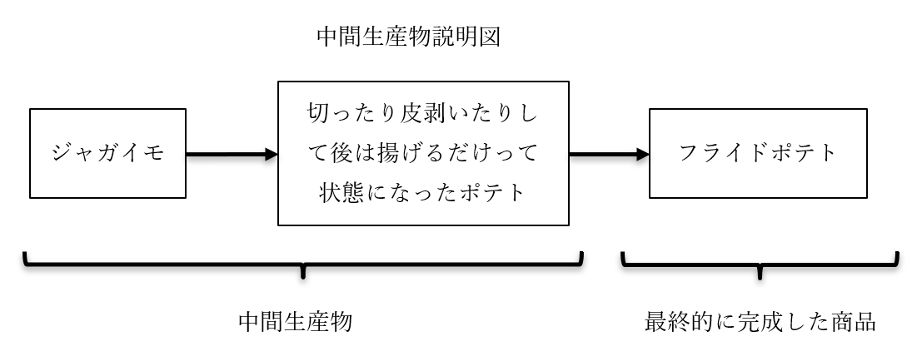
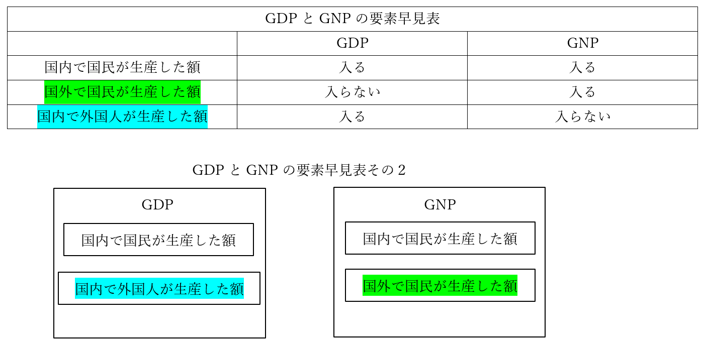
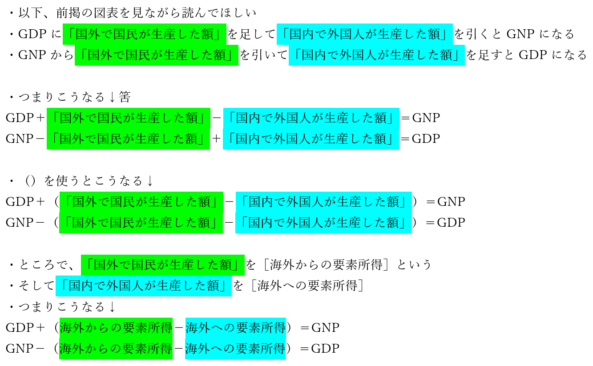
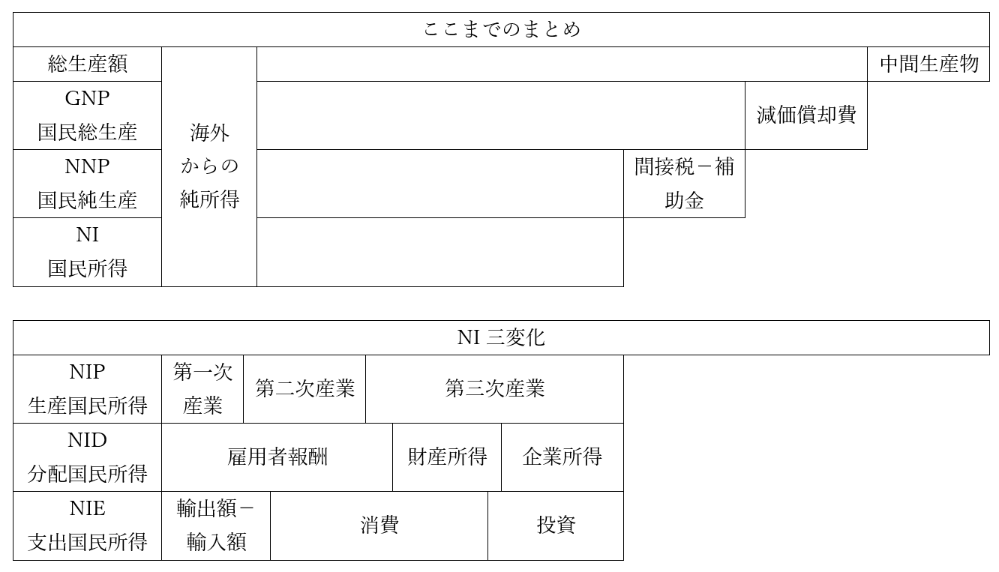

# フローとストック
## ●授業動画一覧＆問題集リンク

|問題集|[ウェブサイト](https://teacheramesaka.github.io/hsworkbookcivics/tag/eco01_01/)||
|:----:|:----:|:----:|
|フローとストック概説|[YouTube](https://youtu.be/h3tfNtEra9I)|[ニコニコ動画](https://www.nicovideo.jp/watch/sm39925644)|
|（広義の）国民所得1／GDPとGNPの概説と変換式|[YouTube](https://youtu.be/WTWX-CdWSrU)|[ニコニコ動画](https://www.nicovideo.jp/watch/sm39925846)|
|（広義の）国民所得2／NNPとNIの概説|[YouTube](https://youtu.be/3gCVe-jyQaQ)|[ニコニコ動画](https://www.nicovideo.jp/watch/sm39925926)|
|（広義の）国民所得3／NI三変化|[YouTube](https://youtu.be/ChDS7M5YLTU)|[ニコニコ動画](https://www.nicovideo.jp/watch/sm39926012)|
|謎指標と国富|[YouTube](https://youtu.be/PPQ2YalZdxw)|[ニコニコ動画](https://www.nicovideo.jp/watch/sm39929624)|

## ●前説
　その人が金持ちかどうか、というのは何となくで判断できても、具体的にどんな金持ちか、というのは基準によって異なる。年収が高い人は基本的には金持ちだろうが、年収が高いからこそ金遣いが荒くて貯金がない、という場合もある。逆に、貯金がある人は金持ちだろうが、貯金があるからこそ働いておらず年収がない、という可能性もある。年収だけ、貯金額だけ、という風に、ひとつの基準では測れないのである。  
　これは国でも同じである。国民がどれぐらい一年で稼いだのか。国内にあるカネの、ある時点での総量はいくらか。そういう観点によって、国がどれぐらい金持ちなのかというのは変わってくる。  
  
  
## ●フローとストック概説  
  
|    |フロー               |ストック                |  
|:----:|:---------------------:|:------------------------:|  
|意味|一定期間に流れた量   |ある一時点に於ける貯蔵量|  
|例  |国民所得（GNP/GDP等）|国富                    |  
  
  
・flowという英単語は、そのまま「流れる」という意味  
・経済学的な意味でのフローは、そこから、「【一定期間】に流れた量」を指す  
⇒もう少し言うと、一般的には「一定期間（普通は一年間）の経済活動の量」という意味で使う。これが多ければ多いほど、その国の経済活動が活発であり、また豊かであるという話になる  
・代表例が【（広義の）国民所得】  
⇒ただ、「国民所得とはつまり一定期間の経済活動の量」と言っても、「経済活動の量って具体的になんだよ」となる。国民所得の場合は、「一定期間に作り出された［付加価値］の総額」「一定期間内の市場取引の総額」をいう場合が多い  
※付加価値とは、商品を作る時、付加された価値。例えばマクドナルドのフライドポテトはMサイズで大体250円ぐらいだが、原材料（ジャガイモ）は20円ぐらいと言われている。ざっくり言えば、250-20=230円が、「マクドナルドがフライドポテトという商品を生産する時作り出した付加価値」である  
  
・一方、ストックは「【ある一時点】に於ける貯蔵量」  
・代表例は【国富】  
⇒その国がどれぐらい豊かか、というのを「ある一定期間、その国でどれぐらい経済活動が行われたか」で見るのがフロー、代表例が国民所得。「ある一時点に於いて、その国がどれぐらい富を［蓄積］したか」で見るのがストック、代表例が国富  
※他にも、それこそマネーストックなんかもストックの一種（何せマネー「ストック」）だが、高校公民レベルでは一般的に、ストックと言えば国富ぐらいの扱い  
  
・以下、フローとストックについて詳しく見ていく  
  
## ●（広義の）国民所得  
### ○GDPとGNP概説  
・フローの代表例は（広義の）国民所得。それはいいのだが、国民所得と言っても計算の仕方が色々ある  
⇒例えば、「海外で経済活動していても、日本人であれば計算に入れる」のか。それとも、「日本国内の経済活動のみに限定する」のか。そして「日本国内の経済活動に限定するとして、外人の経済活動はどうするのか」。そういうので、計算方法がどうしても変わる。なので、国民所得の計算方法が色々決められている。その代表例が【GDP（国内総生産）】と【GNP（国民総生産）】  
※ちなみに、国民所得の計算方法を国連が策定していて、これを［国民経済計算（SNA）］という。GDPやGNPの計算方法は基本的にこれで決まっており、日本は原則これに準じている  
※実は、現在はGNPという計算方法はなくなった（SNAから抹消された。かわいそう）。ほぼ同じ計算方法として［GNI（国民総所得）］というのが使われている。ぶっちゃけ名前が変わっただけだと思っていい。本稿ではこの後もGNPと表記する  
  
・それぞれのフルネーム  
GDP（国内総生産）：Gross Domestic Product  
GNP（国民総生産）：Gross National Product  
GNI（国民総所得）：Gross National Income  
  
・GDPの計算方法：【一年間の国内の総生産額－中間生産物】  
・GNPの計算方法：【一年間の国民の総生産額－中間生産物】  
※「一年間の国民の総生産額」には、国外にいる国民も含む  
※「一年間の国内の総生産額」には、国内にいる外国人も含む  
※「中間生産物」は、原材料、半製品など、最終的に完成した商品の元になったもの  
  
  

  
  
### ○GDPとGNPの変換式  
・誰もがこんがらがって死ぬ奴。わたしもしにました。注意しよう  
  

  

  
・「海外からの要素所得－海外への要素所得」は、一言で［海外からの純所得］と表す場合がある  
・つまりこうなる↓  
GDP＋海外からの純所得＝GNP  
GNP－海外からの純所得＝GDP  
  
### ○国民所得いろいろ  
・ここまで国民所得の代表例としてGDPとGNPを見てきたが、他にも色々な計算方法がある  
・GNPの仲間の【NNP（国民純生産）】、【NI（狭義の国民所得）】が有名  
・NNPは【GNP－減価償却費】  
・NIは【GNP－減価償却費－間接税＋（政府）補助金】  
  
・減価償却費、これがとても説明が難しい  
・商品を生産するのに必要な設備というのは、永久に動く訳ではない  
⇒例えば、今時どんな企業でも使うPC、これは三年ぐらいで買い替えになる  
・ところで、このPCを買うのも、商品製造に必要な経費である  
・なので、PCを買った分の経費は、当然価格に上乗せされる  
・で。PCを毎年買うならいいが、三年ごとに買う訳である  
・じゃあ、PC買った年だけ商品の価格上げて、残りの年は安くするんですか…というと当然しない  
⇒一度のPC買い替えに三百万かかるとして、毎年百万の経費を計上して、それを価格に反映させた方がいい。「今年はPC買い替えるんで…」って言って値段上げて、二年安くして、また値段上げて、っていうのは普通に考えてアホである  
・この、「複数年使う設備の費用を、使う年数で割って毎年計上する」のを減価償却という  
⇒基本的には、企業の会計で使われるもの  
  
・さて、NNPは、「経済活動で新しく生み出された付加価値の合計を純粋に測りたい」時使う  
・そういう時、経費を年割りにしてるだけの減価償却は邪魔になる  
⇒減価償却は価格に転嫁される経費だが、本当に経費なので、減価償却によって上がった分の価格は「新しく生み出された付加価値なんですか？」と言われると微妙。そこで、NNPの登場になる  
  
・NIは、「結局国民は、どれぐらい付加価値を新しく生み出した（儲けた）のよ？」というもの  
・間接税（消費税とか）は、価格には転嫁されるが結局国が受け取るので、国民の稼ぎにはならない  
・逆に、政府から出る補助金は国民の稼ぎになる  
  
・ちなみに、GNPにしろNNPにしろNIにしろ、金額で出す  
・じゃあその金額の基準は、というと、GNPとNNPは【市場価格】  
⇒要は、実際にその商品が売られる時の価格  
・NIの場合は、【要素費用】  
⇒市場価格から、政府による影響を取り除いたもの。消費税とか  
※ざっくり言えば、税込み価格が市場価格、税抜き価格が要素費用  
  

  
  
・NIは、【GNP－減価償却費－間接税＋（政府）補助金】という引き算で求められる  
⇒【GNP－減価償却費－（間接税－（政府）補助金）】でもいい  
・では逆に、足し算でNIを求めるにはどうしたらいいか？  
・生産を足し算する方法、分配を足し算する方法、支出を足し算する方法がある  
  
・生産を足し算するのが【NIP（生産国民所得）】  
⇒「第一次産業がいくら生産したか」「第二次産業がいくら生産したか」「第三次産業がいくら生産したか」を計算して、足し算。ちなみに現代日本の場合、第一次産業の割合はパーセンテージにして一桁台で、［第三次産業］が圧倒的な割合を誇る  
  
・分配を足し算するのが【NID（分配国民所得）】  
⇒労働者への給料（雇用者報酬）、配当金や地代（財産所得）、企業の利潤（企業所得）を足し算。現代日本だと、［雇用者報酬］が最大。ただ、［企業所得］が明らかに増えている  
  
・支出を足し算するのが、【NIE（支出国民所得）】  
⇒貿易黒字or赤字、消費、投資を足し算。現代日本だと、民間の消費、特に［企業による消費］が圧倒的に多い  
  
・では、この三者、果たしてちゃんと同じ額になるか？　言い換えれば「NIP=NID=NIE」になるか？  
・なる！　というのが、マクロ経済学の【三面等価の原則】  
⇒じゃあ現実になるのか？　というとならない。概ね同額にはなるが  
※なんで現実には「NIP=NID=NIE」にならないのか。例えば、全産業が生産した商品の合計額がNIPである。もしその商品が全部売れるのであれば、確かにNIP＝NIEになる筈。じゃあ、作った商品全部売れるんですか、というと売れ残りぐらい出るでしょ、という話になって終わる。三面等価の原則は、「生産された商品が全て売れる」という架空の状況を前提にしている法則なのである。経済学はこういう架空の話も多い  

### ○色々あります謎指標  
　ブータン王国では、「国民総生産とかそんなカネで国が発展してるかどうかなんて古い！」「これからは国民がどれぐらい幸福か、だ！」というので国民総幸福量という謎指標を立ち上げ、二年毎に統計を取っている、というのは知っている人もいるかもしれない。社会科の教科書作る人はこういう謎指標が結構好きで、そうなると受験とかでもよく出る。GNPとかGDPが関わる指標も多いので、一応、ここで有名どころを取り上げておく。  
　尚、読んでいて「何言ってだこいつ」と思ったら…考えるな。感じろ（意識の高さを）。  
  
・【NNW（国民純福祉）】  
・どれだけ福祉が充実しているかという指標  
・GNPから、福祉を低下させるものを引き、福祉を向上させるものを加える  
⇒環境汚染して作った商品の総額とかは引く。余暇時間とかボランティア活動とか家事労働とかを金銭価値に換算して加える  
  
・［グリーンGDP］  
・GDPから、環境破壊による生活の質の低下を金銭価値に換算して引いたもの  
・GNPから引く場合はグリーンGNPになる  
  
・他にも経済企画庁が発表していたPLIとか、NNWと同じようなもののGNWとかがある  
  
## ●国富  
・フローの代表例は（広義の）国民所得。という事で、国民所得を長々と説明してきた  
・本項では、ストックの代表例、国富を紹介  
  
・国富はストックなので、「ある一時点に於ける、蓄積された富」の一種である  
・では具体的にどんな富なのかというと、【資産】である  
⇒一般名詞としての資産であれば、いわゆるカネも資産に含む。しかし、会計とか経済の世界だと、資産というのは「カネになる価値を含むモノ」であって「カネそのもの」は含まない。よって、国富にカネは含まない  
  
・国富は、その国の［個人］［企業］［政府］が保有する資産の合計である  
・資産の内訳としては、［非金融資産］と［対外純資産］がある  
・非金融資産は、建築物、機械、土地、森林、天然資源、公共財など  
・対外純資産はそのまんま、国民が外国に持つ資産のこと  
  
・ちなみに現代日本の場合、対外純資産が異様に多い。何せ世界一である  
・一方で、国富は（GDP世界【三位】の割には）多くない  
・つまり現代日本は、経済規模の割には非金融資産が異様に少ない、ということである  
⇒まぁそりゃ経済成長には健全なインフレが必要なのに、二十年もデフレで不況とかいう糞みたいな経済状況じゃそらそうよなぁ、という話  