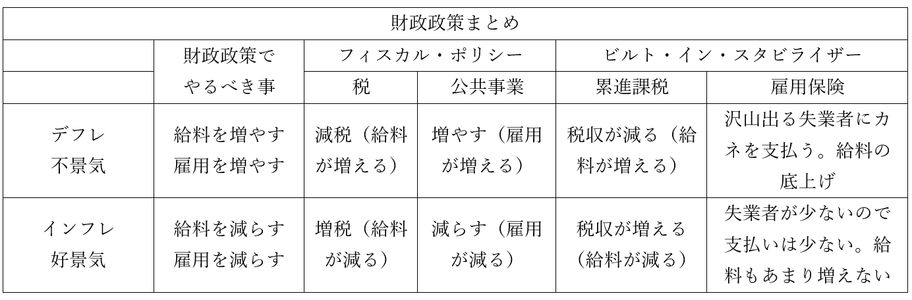

# 財政、予算、会計

・ここまで、現代日本のような資本主義国家の経済の仕組みを見てきた  
・例えば、資本主義下の市場経済を完全に放置していると、市場の失敗が起こる  
⇒「独占市場の発生」、「公共財が存在しなくなる」、「貧富の格差拡大」、「外部経済の発生」  
・また、資本主義下では不況の発生は避けられない。だから「景気対策」が必要  
⇒だから、政府が経済に介入して景気の過熱を抑え、不況から素早く脱せるようにしてやる  
  
・「独占市場の発生」や「外部経済の発生」は、どっちかと言うと政治的な対処を行う事になる  
⇒独占市場については独占禁止法の制定が代表例だし、外部経済も公害対策基本法の制定が代表例  
・一方、「公共財が存在しなくなる」「貧富の格差拡大」「景気対策」は経済的な対処が必要  
  
・「公共財が存在しなくなる」の対処：財政政策による対処  
・「貧富の格差拡大」の対処：財政政策による対処  
・「景気対策」：財政政策、及び金融政策による対処  
・本節は財政政策について見ていく  
※金融政策は、次節で見る  
  
  
## ●財政  
・国は、財政政策によって「公共財が存在しなくなる」「貧富の格差拡大」の対処と「景気対策」を行う  
・財政政策には、主に三つの機能がある。それぞれ以下のように整理できる  
・「公共財が存在しなくなる」の対処：【資源配分調整機能】  
・「貧富の格差拡大」の対処：【所得再分配機能】  
・「景気対策」：【景気調整機能】  
  
  
### ○資源配分調整機能  
・民間企業は、普通、儲からない事はしない  
・故に、資源（元手）を、儲からない公共財に向ける事はない  
・だから国が【公共財】や【公共サービス】を（赤字であろうと）提供する  
⇒言い換えれば、資源の配分を政府が調整する  
  
  
  
### ○所得再分配機能  
・資本主義は放っておくと、金持ちはより金持ちに、貧乏人はより貧乏になっていく  
⇒結局金持ちは貧乏人から搾り取るのが一番儲かるので…これを放っておくと、治安悪化（真面目に働いても金持ちに搾取されるなんて馬鹿らしい。犯罪者になるわ）、革命（金持ちは皆殺しだー！）といった事態が起こる。その実例が、令和二年に起きた米国のBLM騒動やかつてのロシア革命  
  
・これを防ぐ為、国は【累進課税】を行う  
⇒金持ちからは沢山、貧乏人からはちょっとだけ、税金を集める。現代日本の場合は所得税がこれ。大体、年収200万円以下の人は5%を、年収4000万円以上の人は45%を税として支払う事になっている  
・そして、【社会保障】関係にカネを使う  
⇒生活保護、雇用保険（失業した時とかにカネが支払われる）、国民健康保険等  
・こういった、累進課税や社会保障を行うのが所得再分配機能である  
⇒沢山稼いでなくても（所得が低くても）、沢山稼いでいる人（所得が多い人）と同じように暮らせるように再分配する、という機能  
  
・ちなみに、【小さな政府路線】の人、つまり自由権重視の【自由主義者】にとって、この機能は悪である  
・累進課税や社会保障は、廃止すべきものだという話になる  
⇒その人が自由な経済活動で稼いだカネは、その人が使えるべきだ。社会保障なんて、無能な貧乏人の為に有能な金持ちのカネを使うな、という形になる。自由権重視の伝統が強い米国は、だから社会保障が貧弱。特に健康保険は本当にボロボロで、虫歯に十万、出産に百五十万、盲腸の手術に二百万、とか普通にかかる。なので貧乏人どころか普通の人でも、ちょっとでかい病気にかかっただけで人生が終わる。金持ちなら大丈夫だけど…  
  
  
### ○経済安定化機能  
・景気がいい時は、「インフレ」「物価上昇・貨幣価値下落」「需要過剰・供給過少」  
⇒つまり、景気がいい時は貨幣価値を上げたり、需要を減らしたりすればよい  
・景気が悪い時は、「デフレ」「物価下落・貨幣価値上昇」「需要過少・供給過剰」  
⇒つまり、景気が悪い時は貨幣価値を下げたり、需要を増やしたりすればよい  
  
・基本的に、貨幣価値を上げたり下げたりするのは、金融政策でやる  
・財政政策でやるのは、需要を増やしたり減らしたりする方  
・需要とは要するに、消費者が持っているカネ、及び「カネを使いたい」と思う心である  
・消費者というのはつまり国民  
・つまり、国民の給料を増減させたり、雇用を増減させたりすればいい訳である  
  
・国民の給料や雇用を増減させる経済安定化機能は、二つの側面がある  
・ひとつは【補整的（伸縮的）財政政策】。片仮名だと【フィスカル・ポリシー】  
⇒増税したり減税したり、公共事業をやったりするような財政政策  
・もうひとつは、【ビルト・イン・スタビライザー】  
⇒景気がいい時は勝手に給料が減り、悪い時は勝手に給料が増える、というような財政政策を常にやっておく…というもの。累進課税と雇用保険（失業した時とかにカネが支払われる）が代表選手  
  

  
  
・前掲の表を左から見ていく。「財政政策でやるべき事」まではもう見たので、その右から  
  
・不景気の時は減税する。減税すると、国民が使える給料が増える  
・好景気の時は増税する。増税すると、国民が使える給料が減る  
・不景気の時は公共事業を増やす。増やすと、国民の雇用が増える  
・好景気の時は公共事業を減らす。減らすと、国民の雇用が減る  
  
・不景気の時は、当然だが国民の収入が減る。収入が減ると、低い税率で税を払う人が増える  
⇒減税してないのに減税したのと同じ事になり、国民が使える給料が増える  
・好景気の時は、当然だが国民の収入が増える。収入が増えると、高い税率に引っかかる人が増える  
⇒増税してないのに増税したのと同じ事になり、国民が使える給料が減る  
  
・不景気の時は、当然だが失業者が沢山出る。失業者が多いと、雇用保険から手当を受け取る人が増える  
⇒本来失業して給料ゼロになるところが、手当でカネを貰えたという人が増える。雇用保険によって、国民の手持ちのカネが大きく底上げされる。つまり、給料が増えたのと同じ効果がある  
・好景気の時は、当然だが失業者が少ない。失業者が少ないと、雇用保険から手当を受け取る人も減る  
⇒本来失業して給料ゼロになるところが、手当でカネを貰えたという人が減る。雇用保険によって、国民の手持ちのカネが底上げされるという事も少ない  
  
・ちなみに、国の収入の大半は税金である  
・こうやって財政政策を概観すると、不景気の時は税収を減らし、好景気の時は税収を増やすと分かる  
・つまり、不景気の時は【財政赤字】、好景気の時は【財政黒字】になるべきだと分かる  
⇒不景気の時に「財政再建」とか言って財政黒字を目指したら経済が死にますよ、という話が改めて確認できる話。ちなみに赤字財政の事を【積極財政】、政府の財政が「収入＝支出」な状態を目指す事を【均衡財政】と言う場合もある  
  
・尚、好景気の時の増税を、景気対策でなく「財政黒字を目指す」観点から見た場合、注意すべき点もある  
⇒［ラッファー曲線］というものなのだが、要するに「増税し過ぎると、それはそれで税収が減りますよ」という理論。実際、税金が高過ぎると真面目に働くのも馬鹿らしいし、脱税も増える  
※基本的には［反ケインズ］派の理論。レーガン政権期の、サプライサイドエコノミクスの勃興の中で提唱された  
  
## ●予算と会計  
・毎年はじめの通常国会で予算が決まる…というのは多分中学公民でやった知識  
・この、国の予算を国会で決めなければいけないというのを［財政国会中心主義］という  
⇒実際のところ、予算案を作っているのは財務省。別に政治家が予算案を作ってもいいのだが、その技能を持つ政治家がいない為に予算案は財務省が作っている。故に、政治家自身が「赤字財政で景気刺激したい」と思っていても、財務省を動かせなければ何もできない。ちなみに日本の財務省は、均衡財政・財政黒字絶対主義とでも言うべき存在なので…  
・この話はともかくとして、予算はいくつかの種類に分けられる。詳しく見てみよう  
  
  
### ○いつ決めた予算かでの分類  
・ある年の予算は、【四月一日】から翌年の【三月末】までで組む  
※ちなみに、四月一日までに予算が決まらなかった場合、前年度を参考に【暫定予算】を組む  
  
・毎年はじめの通常国会で決まった予算を、【本予算（当初予算）】と言う  
・とは言え、予測不能の事態というのは絶対起こる  
・例えば地震が起きたら、被災した地域の復興資金が必要である  
・このように、本予算を決めた後に追加で予算を組む必要が出てくる場合がある  
・こういう予算を【補正予算】と言う  
・補正予算の中でも、新項目を付け足すのが【追加予算】  
・補正予算の中でも、ある項目からある項目へ資金を流用するのが【修正予算】  
  
  
### ○どの会計かでの分類  
・予算は、大きく三つの会計に分けて作られる  
・【一般会計】【特別会計】【政府関係機関予算】  
  
・政府の収入の中には、「こういう用途に使え」と決まっているものがある  
⇒「この税金による収入は森林整備にしか使っちゃいけません」みたいな奴。こういう「使い道の決まっている収入」を【特定財源】という。何にでも使っていいものは【一般財源】  
・こういう収入と支出は、特別会計と言ってそれ専用の会計を作る  
・また、政府が全額出資している公企業については、政府関係機関予算という専用の会計を作る  
・特別会計と政府関係機関予算に入るもの以外は、全ての収入と支出を一般会計で処理する  
⇒当然、一般会計が主要な予算となる。特別会計と政府関係機関予算は補助的なもの  
  
  
### ○一般会計の様子  
・では、政府予算の主役となる一般会計の、収入と支出はどんな状態になっているか？  
・収入は、【租税】が一番多く、次いで【国債】が多い。この両者で95%とかある  
⇒バブル崩壊後の長期の不況で、税収は伸び悩んでいる。【所得税】や【法人税】の減税もしているから余計  
・支出は、【社会保障関係費】が一番多い。次いで【国債費】、続いて【地方交付税交付金】が多い  
⇒高齢化社会で、社会保障関係費が増える一方  
・また、基本的には「税収＜支出」という状況が続いており、その補填に国債発行が慢性化している  
※ちなみに、税収と支出どっちが高いか、というのを【プライマリーバランス】と呼ぶ事もある  
  
・この財政赤字の慢性化に、政治家や国民は危機感を抱いている  
⇒皆社会科が嫌いなので、「いやそら不況が長引いてるんだから赤字になるでしょ。むしろもっとガツンと赤字にして景気回復させたら？」とはならず、「このままじゃ国が破産する！」「財政黒字にしなきゃ！」となった  
  
・1997年、橋本内閣は［財政構造改革法］を制定した  
⇒この法律により、「景気対策より財政再建、財政黒字化が優先」という態度が鮮明となった  
・翌1998年、小渕内閣は［財政構造改革凍結法］を制定した  
⇒「不況なのに財政黒字化とかやったら経済死ぬぞ」という事で、国債発行して公共事業やろう、というような路線に方針転換した。その為小渕内閣（と続く小泉内閣）期は経済が回復の兆しを見せた時期となった  
※ちなみに、2001年からの小泉内閣期は、財政再建へ向けた緊縮財政が加速した。公共事業費は一気に10%減り、また、【特殊法人】の廃止や民営化、【規制緩和】といった、いわゆる【構造改革】を行っている  
  
  
### ○財政投融資  
・予算ではないが【第二の予算】と呼ばれるものに、【財政投融資】がある  
⇒かつては一般会計の【50%】程度の額があった。そこで第二の予算と呼ばれた  
・これは要するに、国が行う金融活動である  
⇒国が投資したり、国が融資したりする。主に、公共性の高い事業（それこそ道路を作るとかダムを作るとか）に投資・融資する  
・昔は、投資や融資の元手として郵便貯金とかを使っていた  
※昔は、郵便は国営事業だった。なので、郵便の銀行にあたる郵便貯金も、当時は国営だった  
・これが小泉内閣期までのいわゆる構造改革によって、使えなくなった  
⇒財政投融資資金の調達には【市場原理】が導入された。具体的には、特殊な公債によって資金を集める。具体的には国債の一種にあたる【財投債】や、公企業が発行する社債にあたる【財投機関債】がある。実は、奨学金をやっている日本学生支援機構（独立行政法人）なんかも財投機関債を発行している  