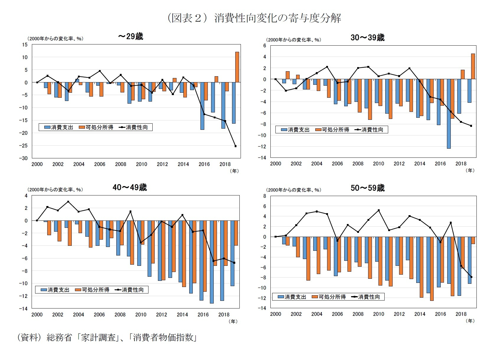
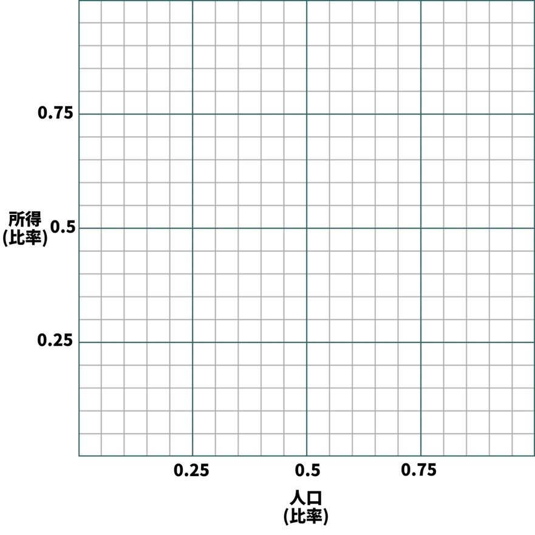
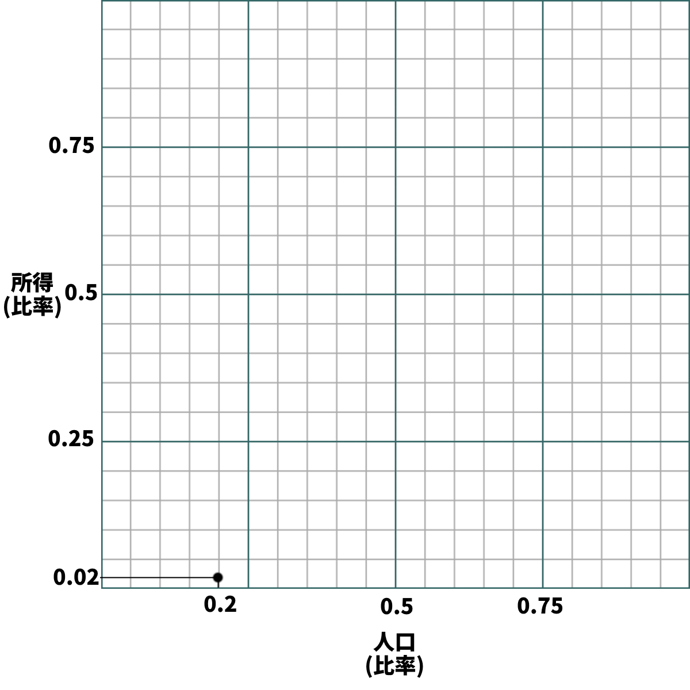
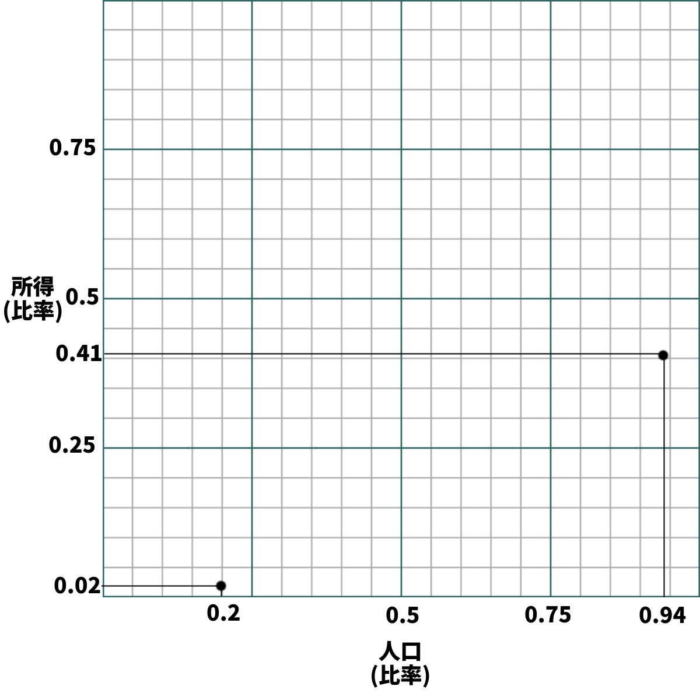
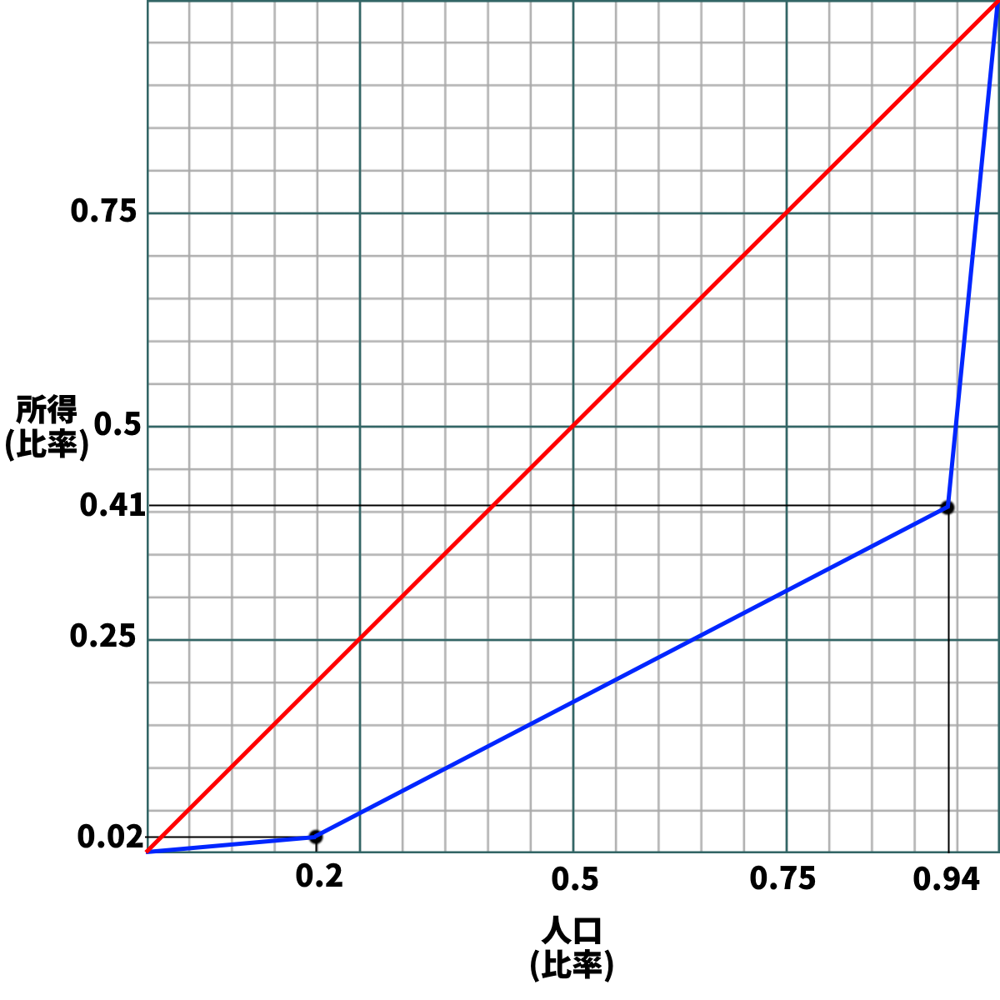
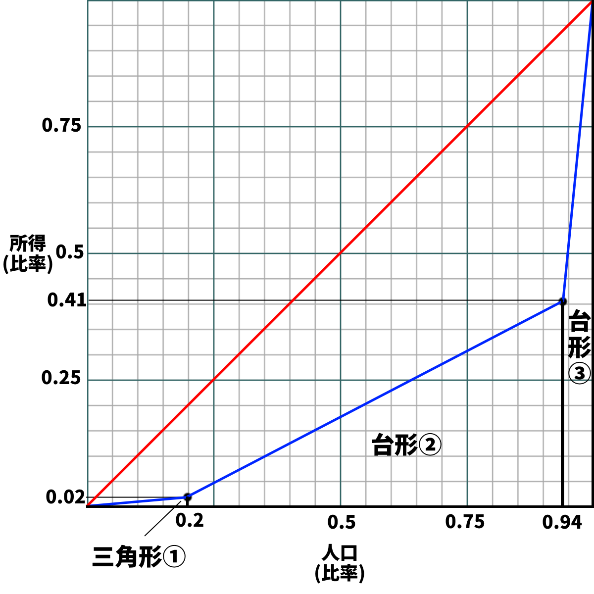
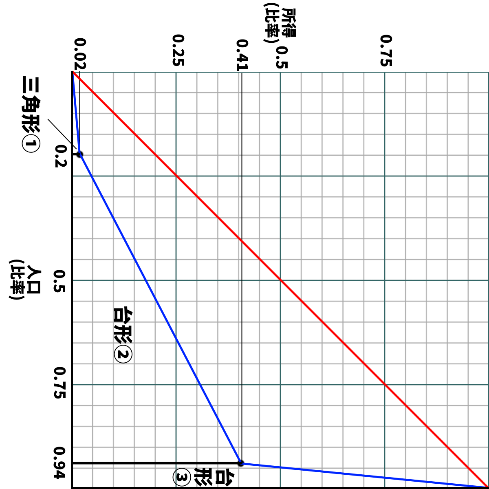
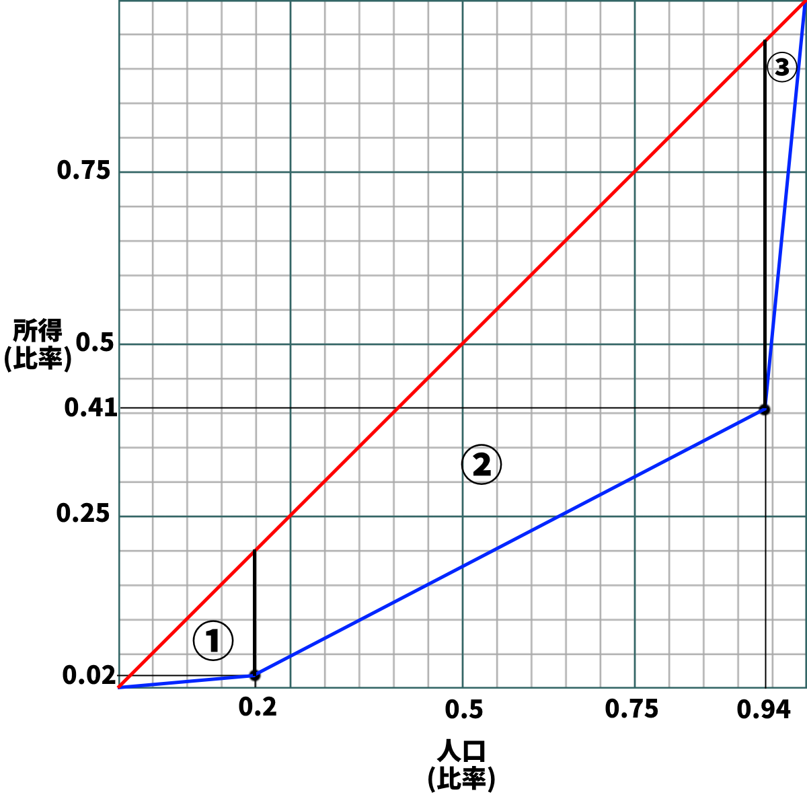

# 貧富の格差を表す指標  
## ●授業動画一覧＆問題集リンク

|問題集|[ウェブサイト](https://teacheramesaka.github.io/hsworkbookcivics/tag/eco01_14/)||
|:----:|:----:|:----:|
|本節の授業動画は|まだできてません|ごめんなさい|

  
## ●可処分所得と平均消費性向  
### ○概要  
・フローとストックを学習した際、その人が金持ちかどうかを一つの指標で見るのは危険だと指摘した  
・収入だけで見ても駄目、貯蓄だけで見ても駄目、と  
・そして実は、この「収入」というのも結構な曲者である  
  
・例えば、ある国のサラリーマンが、毎月一万ドルの給料を貰っていたとする  
・しかしその国の法律で、給料の九割を税金として国に納めなければならないと決まっていたらどうか？  
・月収千ドルである  
  
・同様に、個人経営のラーメン屋の店長が、一年で一億円稼いでいるとする  
・しかしラーメン屋の経営に必要なカネ（人件費や材料費）が、九千九百万円かかっていたらどうか？  
・手元には百万円しか残らない（しかもここから税金を払わないといけない）  
  
・こういった事情があるので、やはり、「その人が稼いだカネの総額」だけを見ていてはいけない  
・この辺の事情を分かりやすくするために、三つの指標がある  
・【収入】と【所得】と【可処分所得】である  
  
  
### ○収入、所得、可処分所得  
・「その人が稼いだカネの総額」を【収入】と呼ぶ  
  
・一方、【収入】から［経費］を引いたものを【所得】と呼ぶ  
・経費とは、「その人がカネを稼ぐのに必要なカネ」である  
⇒例えば、その人が個人経営のラーメン屋の店長だとする。ラーメン屋の経営には、当然、材料費や人件費がかかるし、光熱費も水道代もかかる。そういったカネは、「その人がカネを稼ぐのに必要なカネ」、つまり経費である  
  
・とは言え、所得の全てを好きなように使える訳ではない  
・所得税や住民税といった税金を払わねばならないし、社会保険料も払わねばならない  
※そう。所得税は「お前今年××万円稼いだだろ、その内△△％を税金として払え」というものだが、こは要するに「”収入－経費”の内△△％を税金として払え」というものである。法人税も同様に、「この会社の、今年の”収入－経費”の内△△％を税金として払え」である  
  
※社会保険料について詳しくは経済分野第二章でやるが…皆さんが病院に行った時、保険証を見せれば七割引きで治療して貰える。この保険証を貰うには、カネを払わなければならない（普通は毎月払う）。そういった類のものが、社会保険料である  
  
・繰り返すが、所得は、全て「好きなように使えるカネ」ではない  
・そこで、「その人が自由に使えるカネ」を表す、【可処分所得】という指標がある  
・これは、【所得】から更に、各種の［税金］や［社会保険料］を引いたものを指す  
※基本的には、「“経費以外の、本人が払いたくなくても払わざるを得ないもの”を所得から引く」、と考えればよい  
  
まとめ↓  
  
|||
|:----:|:----:|
|収入|その人が稼いだカネの総額|
|所得|収入－経費|
|可処分所得|所得－税金－社会保険料|
  
豆知識１  
・税金は基本、収入ではなく所得を基準に計算される  
・例えば所得なら、「所得の××％を税金として払え」になる  
⇒漫画家や個人商店の店長が、年度末になると飲み会をやっては「接待交際費」として経費扱いにしているのは、つまりそういう事である  
  
※何なら、赤字になる直前まで経費を使ってくれた方が、国の経済にはよい。税金の場合「国民が稼ぐ」「国が税金として集める」「集めたカネを国が配る（使う）」と三手順かかるが、経費なら「国民が稼ぐ」「稼いだカネを国民が使う」の二手順でよい。そして、誰がどのような名目で使おうが、「カネを使う」と「商品が売れる」はイコールであり、商品が沢山売れれば景気はよくなる。つまりそういう事である  
  
豆知識２  
・何処かの会社で働いて、その対価として貰う給料だけで生活している人  
・いわゆるサラリーマンだが、こういう人には原則、経費が存在しない  
・じゃあ税金計算の上で不利じゃないか！  
・…となるからか、給料による収入に関しては「収入－給与所得控除」を「所得」とする  
⇒給与所得控除がいくらかは、所得税法で決まる。令和二年現在では年収によって変わる方式であり、年収162万5千円までの人の給与所得控除は55万円だった  
  
### ○平均消費性向  
・可処分所得の話をしてしまったので、ついでに［平均消費性向］の話もしておこう  
・これは要するに、「可処分所得の内、どれぐらいを消費に回したか」である  
・もっと分かりやすく言えば、「可処分所得の内、どれぐらいを使ったか」である  
※経済学の領域では、「“最終的にその商品を使う人”が商品を購入する」ことを指して消費と呼ぶ場合が多い。他の意味でも使うが、政治経済の授業とかで「消費」が出てきたら基本この意味である  
  
・平均消費性向とはこういうものなので、計算はそんなに難しくない  
・「今月の可処分所得が百万円」の人が「今月八十万円使った」なら、平均消費性向は80%である  
※ちなみに、残りの二十万円（20%）は、普通に考えたら貯金に回っている。故に、この20%を平均貯蓄性向と呼ぶ  
  
～ちょっと雑談～  
　特に景気が悪い時、この平均消費性向は重要である。  
　要は、商品が全然売れない（誰も商品を買わない）から景気が悪い訳で…景気をよくするには、商品が沢山売れるようにする（皆が商品を買うようにする）事が必要である。その為には、可処分所得を増やすだけでなく、平均消費性向も上げなければならない。  
　なのだが、現代日本は1990年代初頭のバブル崩壊以来、三十年以上に渡って不況である。新自由主義の導入もあって、可処分所得は減少傾向を続けた。そして国民も、（元の国民性もあるとは言え）節約に力を入れるようになっていった。  
  

ニッセイ基礎研究所　『生涯所得から考える消費支出の動向と、拡大のための政策』  
https://www.nli-research.co.jp/report/detail/id=65484?pno=2&site=nli  
  
　前掲図表は、「可処分所得」「平均消費性向」（と「消費支出」）が、2000年と比較して何%変化したかを示す。この図表は2019年までのものなので、COVID-19、いわゆる新型コロナウィルスの流行による影響は出ていない。  
　さて、この図表を見ると、二十九歳以下…言い換えれば、生まれてこの方「景気が悪い日本」しか知らない世代は、特に平均消費性向の低下が顕著である。2019年には可処分所得の大幅な改善が見られているのに、平均消費性向はとんでもなく下がっている。それだけ節約志向、貯蓄志向になっていると言える。  
  
　何故、こうなってしまったのか？  
  
　勿論、「TVやら新聞やら学校やらで“もう日本は終わりだ！”みたいな事言われ続けて育ってきたんだからそうなるだろ」というのも一つとしてある。“もう日本は終わりだ！”みたいな言説自体は妄言に過ぎないが、妄言であろうとそういう言葉をかけ続ければ人の精神に影響はある。  
　しかしそれだけではない。例えば現代日本の労働環境の劣悪さや、社会保障への大きな不信感が、「無駄遣いせず貯金しておこう」という傾向を生んでいる部分は充分にある。  
　もうすぐ経済分野は第二章に突入し、労働問題や社会保障を取り扱う。そういう問題意識も持ちながら、学習を続けてほしい。  
～雑談終わり～  
  
  
  
  
## ●ローレンツ曲線とジニ係数  
### ○概要  
・世の中には、貧富の格差を直接的に、数字で表す指標が存在する  
・その代表例が【ジニ係数】であり、これの算出に使うのが【ローレンツ曲線】である  
⇒前者はイタリア人のコラード・ジニが、後者はアメリカ人のマックス・オットー・ローレンツが開発したものであり、この名前がある  
  
・ジニ係数は０から１の数字であり、【０に近ければ平等、１に近ければ格差社会】である  
  
・具体的には、ジニ係数は各人の所得がどれぐらい平等かを表している  
・１ならば、たった一人の王みたいな人以外全員所得ゼロ、全ての所得を王が独占、みたいな状態  
・逆に０ならば、全員の所得が完全に平等である  
⇒一般に、0.4を超えたあたりからは、反乱を含む騒乱が多発する次元の超格差社会であるとされる  
  
※ちなみに。当然ながら、本物の上流階級とは即ち、「生まれた瞬間から一生遊んで暮らせるだけの財産がある」人達である。「必死こいて働いて年収何千万だの何億だの」というのは、本物ではない。本物の上流階級、例えば貴族はそもそも、働く必要がないのである。なので、所得の大小だけを測ってるとその辺が判別できないという問題は実際ある  
  
↓まとめ↓  

|||
|:----:|:----:|
|ジニ係数|貧富の格差を数字で表す指標 ０から１の数字表され、０に近ければ平等、１に近ければ格差社会|
|ローレンツ曲線|↑の算出に使う|
  
  
### ○ジニ係数の算出  
・さてでは、そのジニ係数の算出はどうしたらよいのか？  
・せっかくであるから、ついでに解説しておこう  
⇒覚える必要があるか？　と言うと微妙だが、近年（令和五年現在）、その辺を問う問題が大学受験でも増える傾向にあるのは事実である。大抵は「本文読めば解き方書いてあるだろ」系の問題ではあるのだが、まぁ初見でいきなりそういう問題にぶつかるよりは、一度触っておいた方がいいだろうという事で…  
  
・今回は、一昔前妙に流行った『世界がもし100人の村だったら』から数字を拾ってこよう  
・この本によると、世界がもし100人の村なら「すべての富のうち６人が59％をもってい」る  
・そして「74人が39％を」「20人が、たったの２％」の富を持つという  
⇒言い換えると、現代の世界は「上位6%の人間が、富の59%を持つ」「中位74%の人間が、富の39%を持つ」「下位20%の人間が、2%の富を持つ」という話。なかなかの格差社会である。今回はこの数字を使ってローレンツ曲線を作り、ジニ係数を計算しよう  
※この本では「富」と書いてあって「所得」とは書いていないが、この際細かい事は気にしない事にする  
  
  
  
  
手順１：  
・まずこういう感じで、横軸を人口、縦軸を所得とする   
  
  
  
手順２－１：  
・数字を元に、点を打っていく  
・例えば今回、「下位20%の人間が、2%の富を持つ」ので…  
・「人口の0.2が、0.02の富を持つ」形で、点を打つ  
・他の点も、同じように打っていく  
  
  
  
手順２－２：  
・例えば今回、「下位20%の人間が、2%の富を持つ」「中位74%の人間が、富の39%を持つ」  
・言い換えれば「下位0.2の人間が、0.02の富を持つ」「中位0.74の人間が、富の0.39を持つ」  
  
・つまり次に点を打つべきは…  
・横軸（人口）は、0.2から0.74右に行ったところ（0.2+0.74で0.94のところ）  
・縦軸（所得）は、0.02から0.39上に行ったところ（0.02+0.39で0.41のところ）  
  
※ちなみにこれは、「上位6%の人間が、富の59%を持つ」を表す点でもある。これは「上位0.06の人間が、富の0.59を持つ」なので、横軸は1-0.06の0.94に、縦軸は1-0.59の0.41に点を打つ事になる  
  
  
  
手順３：  
・点を打ち終わったら、線を二本引いて、ひとまずローレンツ曲線は完成である  
  
１：「０・０（左下）から１・１（右上）」の線  
⇒図中赤、真ん中通ってる線。均等分布線と呼ぶ  
２：「０・０（左下）から打った点全てを通り、１・１（右上）」に至る線  
⇒図中青、下に膨らんでる線。厳密にはこの線を指してローレンツ曲線と呼ぶ  
  
・この後、二つの線に囲まれた部分の面積を求めれば、それがジニ係数である  
・大学入試でも、このようなローレンツ曲線を示して「はいジニ係数計算してください」問題は出る  
・ただ、こんな複雑な図形、単純には計算できない。そこでどうするかと言うと…  
  
  

手順４－１：  
・こんな風に、各点から下へ線を引けばいいのである  
・すると、三角形①、台形②、台形③の三つの図形が出現する
⇒台形②台形③は、横に90度倒せば算数の教科書でよく見た台形になる
  
  
  
  
手順４－２：  
・後は、三角形①、台形②、台形③の面積を計算して、黄色のマーカーで囲った三角形から引けばいい  
  
ジニ係数　＝　長さ１の辺が二つある直角二等辺三角形－三角形①－台形②－台形③  
  
・黄色マーカー三角形は、長さ１の辺が二つある直角二等辺三角形なので、面積は簡単に出せる  
・要は底辺１高さ１の三角形なので、底辺×高さ÷２、つまり1×1÷2でよい  
  
ジニ係数　＝　(1×1÷2)－三角形①－台形②－台形③  
  
・続いて、三角形①、台形②、台形③の面積を出していこう  
・三角形①は底辺0.2、高さ0.02の三角形なので、0.2×0.02÷2で算出できる  
  
  
  
手順４－３：  
・台形②は、横に倒して考えればよい  
・例えば右に90度回転させてしまえば上底0.02、下底0.41、高さ(0.94-0.2)の台形になる  
・よって、台形②は(0.02+0.41)×(0.94-0.2)÷2で算出できる  
  
・台形③も、同様に考えればよい  
・右に90度回転させてしまえば、上底0.41、下底1、高さ(1-0.94)の台形になる  
・よって、 (0.41+1)×(1-0.94)÷2で算出できる  
  
・以上のことから、計算式は以下のようになる  
  
ジニ係数　＝　長さ１の辺が二つある直角二等辺三角形－三角形①－台形②－台形③  
ジニ係数　＝　(1×1÷2)－三角形①－台形②－台形③  
ジニ係数　＝　(1×1÷2)－(0.2×0.02÷2)－((0.02+0.41)×(0.94-0.2)÷2)－((0.41+1)×(1-0.94)÷2)  
ジニ係数　＝　0.5－0.002－0.1591－0.0423　＝　0.2966  
  
  
  
ちなみに：  
・別解として点から上に線を引いて、三つの図形の面積を計算するのでも解ける  
・ただ正直、こっちの方がちょっと面倒ではある  
  
※ここまで、数字は池田香代子『世界がもし100人の村だったら』。この本が出版されたのは2001年であり、その後貧富の格差は更に拡大している  
※現代社会は2001年当時でも「上位6%の人間が、富の59%を持つ」格差社会である。が、それでもジニ係数が0.3ぐらい。反乱含め騒乱が多発するという0.4に到達する社会がいかにヤバいかが分かるだろう  
  
※ここまで、方眼紙は以下を使用  
Bobarino, CC BY-SA 3.0 <http://creativecommons.org/licenses/by-sa/3.0/>, via Wikimedia Commons  
https://commons.wikimedia.org/wiki/File:Graph-paper.svg  
