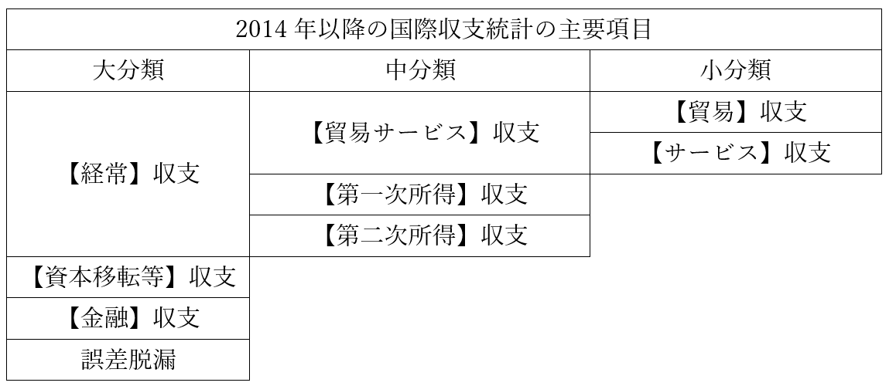
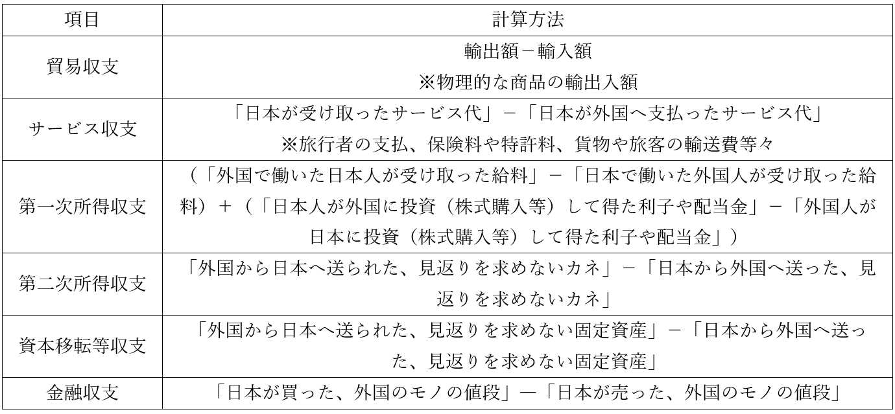

# 国際経済の仕組み

・国際経済とは、主に貿易を基礎とする  
・ある国が、商品を輸出する。ある国が、商品を輸入する  
・基本的には、その繰り返しが国際経済を形作っている  
・この国際経済を理解する上で、最低限必要な知識を身に付けよう  
  
## ●為替の変動  
○為替そのものの概要  
・以前、為替を「「現金以外の方法で決済を行う」ものの総称」と説明した  
・実は、為替はもう一つの意味で使われる事もある  
・それが「異なる二国間の通貨を交換する」という意味である  
  
・例えば、自国通貨と外国通貨を交換する場合  
・この場合、当然ながら、ある基準に沿って交換する事になる  
⇒例えば一ドル百円とか、一ユーロ百円とか  
・この基準の事を、【外国為替相場】と呼ぶ  
⇒相場をレートと呼んだり、外国が省略されたりするので注意  
  
・この外国為替相場には、大きく分けて二種類ある  
・相場がずっと変わらない【固定為替相場制】、日々変わる【変動為替相場制】である  
⇒これも為替が省略される事があるので注意  
  
・かつての日本は、【固定】為替相場制であった  
・終戦直後の1949年から1973年まで、【一】ドルは【三百六十】円であった  
※米ドル。以後、本項のドルは全て米ドルである  
・これが1973年から、【変動】為替相場制へと移行する  
・日本円の価値は、上がったり下がったりするようになった訳である  
  
  
  
### ○為替の変動の概要  
・日本円の価値が高くなる事を【円高】と呼ぶ  
・同様に日本円の価値が低くなる事を【円安】と呼ぶ  
  
・例えば、元々は一ドル百円だったとする  
⇒つまり、百円で一ドルが買えた  
・これがもし、一ドル百二十円になったとする  
⇒つまり、百円で一ドルを買えなくなった。一ドル買いたかったら、余計に二十円必要になった⇒という事は、円の価値が低くなっている⇒円安（ドル高）  
  
・逆に、元は一ドル百円だったのに、一ドル八十円になったとする  
⇒元は百円で一ドルが買えた⇒それが、一ドル買うのに百円も必要なくなった。八十円で充分となった⇒という事は、円の価値が高くなっている⇒円高（ドル安）  
  
|元の円ドル相場|円高ドル安例|円安ドル高例|  
|:--------------:|:------------:|:------------:|  
|1ドル100円    |1ドル80円   |1ドル120円  |  
  
  
・この辺、インフレ／デフレと同じである  
・例えば、ジュース一本の値段が百円から二百円になったらインフレ（物価上昇、貨幣価値下落）  
・逆に、ジュース一本の値段が百円から五十円になったらデフレ（物価下落、貨幣価値上昇）  
⇒外国為替相場にせよ、インフレ／デフレにせよ、片方が上がったら片方が下がるのである  
  
|元のジュースの値段|インフレ（物価上昇、貨幣価値下落）例|デフレ（物価下落、貨幣価値上昇）例|  
|:-----:|:----:|:----:|  
|1本100円          |1本200円                            |1本50円                           |  
  
  
  
  
  
### ○為替の変動の要因  
・色々あるが、基本はインフレ／デフレと近いものがある  
・例えば、インフレ  
・インフレは、「物価上昇、貨幣価値下落」で「需要過剰、供給過少」である  
⇒つまり、「商品の需要に対して供給が少なすぎる」「皆が買いたいと思っているのに全然流通していない」だと、物価が上がる  
⇒もっとざっくり言ってしまえば、「皆が買いたいと思う商品」「皆が買う商品」は価値が上がる  
  
・これを通貨に、例えば円とドルに置き換えてやればよい  
・即ち、円高ドル安は、「円の価値上昇、ドルの価値下落」で「円の需要過剰、円の供給過少」である  
⇒つまり「皆がドルで円を買いたいと思っていれば、円の価値は上がる」訳である。もっと言えば、皆が［「ドルを売って円を買う」］形でドルと円を交換してくれれば、円の価値は上がる  
  
・では、どんな状況だと、皆がドルで円を買いたがるか（円高ドル安になるか）？  
例１：日本の金利が【上がった】  
例２：日本が貿易【黒字】になった  
例３：海外からの旅行者が［増えた］  
例４：［海外］から［日本］への投資が増えた  
例５：［海外］でインフレが［進行］した  
例６：日本円は信頼できるがドルは信頼できない、となった  
⇒こういう時、皆が「ドルで円を買う」をやり、円高ドル安になる。それぞれの例を、以下で詳しく見ていこう  
  
  
皆がドルで円を買いたがる例１：日本の金利が【上がった】  
⇒例えば、日本円で買える日本国債。国債は「一万円でこのチケットを買ってください」「●年後に、一万百円お支払いします」みたいなもの。これが、「一万円で買って、数年後一万千円返却」になったら？　皆日本国債を買いたがるだろう。ただいかんせん、日本国債は日本円でしか買えない。となると、普段は日本円を使っていない外国人も、「ドルで円を買う」をしなければならない  
※アメリカ人なら「ドルで円を買う」し、勿論EUの人なら「ユーロで円を買う」し、イギリス人なら「ポンドで円を買う」。以下しばらくの間、外国通貨をドルで代表させる  
  
皆がドルで円を買いたがる例２：日本が貿易【黒字】になった  
⇒日本国が米国に対し、大幅な貿易黒字だとする。日本からは沢山の商品がアメリカへ輸出され、アメリカ人が大量のカネを支払う。ところでこの支払われるカネは、大抵ドルである（買った人がアメリカ人なので当然と言えば当然）（アメリカ人は普通、ドルを使う）。日本側は大量のドルを受け取る訳だが、日本でドルを持っていてもあまり意味がない。そこで、受け取ったドルを日本円に交換する。つまり、ドルを円で買う  
  
皆がドルで円を買いたがる例３：海外からの旅行者が［増えた］  
⇒日本円を基軸通貨にしているのは現在、日本国だけである。アメリカ人はドルを、イギリス人はポンドを、普段使っている。しかし日本に来たら、当然、日本円がなければ何もできない。だから日本に来た旅行者は、それこそ「ドルで円を買う」をしなければならない  
  
皆がドルで円を買いたがる例４：［海外］から［日本］への投資が増えた  
⇒外国人が日本へ投資する、という事はあり得ない事ではない。例えば外国人の資産家が「今日本の企業の株価がどんどん上がってるな」「よし、俺も日本の企業の株を買おう」となれば、これは「海外から日本への株式投資」である。他にも、外国人が日本に工場を作ったり、ホテルを作ったり、そういうのも「海外から日本への投資」である。  
⇒海外から日本へ投資する場合、日本円が必要である。それこそ、「外国人が日本に工場を作る」となれば、日本円を払って土地を買い、日本円で建設会社を雇い…としなければならない。その為にはやはり、「ドルで円を買う」をしなければならない  
  
皆がドルで円を買いたがる例５：［海外］でインフレが［進行］した  
⇒海外、例えばアメリカ合衆国でインフレが進行するとどうなるか。インフレとは「物価上昇・貨幣価値下落」である。つまり、アメリカ人はアメリカ産の商品を買いたくなくなる（高いから）。むしろ、外国（例えば日本国）の安い商品を買おうとする。とは言え、日本の商品はやはり、日本円で支払う必要がある。つまり、普段ドルを使っているアメリカ人が日本の商品を買うには、やはり「ドルで円を買う」が必要になる。  
  
皆がドルで円を買いたがる例６：日本円は信頼できるがドルは信頼できない、となった  
⇒まず前提として…歴史を見れば分かるように、国の経済というのは大爆発する事がある。それこそ戦争で負けて滅んだ、とかがなくても、駄目な時は駄目。例えばジンバブエ共和国は、経済政策の大失敗によりハイパーインフレ（つまり物価大暴騰、貨幣価値大暴落）を起こした。2004年のインフレ率は600%越え。つまり物価は前年比七倍以上になり、通貨の価値は前年比七分の一以下になった  
⇒で、仮に米国がこれから、大不況になりそうだとする。「アメリカの経済もいつまでもつか分からんな…」「となると、アメリカの経済力、アメリカ合衆国への信頼に裏打ちされたドルの価値も、暴落してしまうかもしれん」「手持ちのドル、何かいいモノに交換しておきたいな」「お！　日本円とかいう、まず暴落しない通貨あるやんけ！　ドルで円買お」  
※ちなみにこれ、冗談ではなくよくある。何だかんだ言って日本国は「三十年不況なのに経済力は世界三位」とかいう謎の国なので、その経済力は物凄く信用されている。で、世界的に不況になると、何故か円高になる。いわゆる【リーマンショック】（詳細は後述）の後の世界的な大不況時も、何故か円高になった  
  
～ここでちょっと雑談～  
　世界的に不況になると何故、日本は円高になるのか。一応、これを説明し得る要因はいくつかあって、それが例えば円キャリートレードである。  
　円キャリートレードの前提は、日本が長い間やっているゼロ金利政策である。日本の金利がゼロという事はつまり、日本ではカネを借りやすいという事である。  
　例えば、「アメリカの金融商品（株とか）を売り買いして儲けたい」となったとする。が、元手がない。どこかでカネを借りて、それを元手に儲けたい。そういう時、普通ならアメリカでドルを借りればいいのだが…日本で日本円を借りるのである。何せ日本はゼロ金利政策をやっている。「アメリカでドルを借りて運用。後々利子つけて返す」のと「日本で日本円を借りて、日本円でドルを買って、アメリカで運用。後々、ドルで日本円を買って返す」のなら、後者の方がお得なのだ。  
　で、世界的に大不況となると当然、金融商品を売り買いしても儲からないから一旦お休みしよう、という連中が大量にでてくる。そういう連中が、「ドルで日本円を買って返す」を一気にやると…そりゃまぁ、ドルで円を買ってるんだから日本円は高くなりますね。  
～雑談終わり～  
  
・では、どうしたら逆に、円安ドル高になるか？  
・今まで説明した事の逆を考えればいい訳である  
  
・デフレは、「物価下落、貨幣価値上昇」で「需要過少、供給過剰」である  
⇒つまり、「商品の需要に対して供給が多すぎる」「誰も買いたいのに思ってないのに商品の在庫だけはある」だと、物価が下がる  
⇒もっとざっくり言ってしまえば、「皆が買いたくない思う商品」「皆が売る商品」は価値が下がる  
  
・これを通貨に、例えば円とドルに置き換えてやればよい  
・即ち、円高ドル安は、「円の価値下落、ドルの価値上昇」で「円の需要過少、円の供給過剰」である  
⇒つまり「皆がドルで円を買いたくないと思っていれば、円の価値は下がる」訳である。もっと言えば、皆が［「円を売ってドルを買う」］形で円とドルを交換すると、円の価値は下がる  
  
・では、どんな状況だと、皆円でドルを買いたがるか？  
  
例１：日本の金利が［下がった］  
例２：日本が貿易【赤字】になった  
例３：海外からの旅行者が［減った］  
例４：［日本］から［海外］への投資が増えた  
例５：［日本］でインフレが［進行］した  
例６：ドルは信頼できるが日本円は信頼できない、となった  
  
  
・今までの話を総合して考えると、以下のように考えてもいいかもしれない  
日本の経済力が強くなる：円高  
日本の経済力が弱くなる：円安  
  
### ○為替の変動の結果  
・ここまで「どうなったら為替が変動するか」という要因を見た  
・ここから「為替が変動した後どうなるか」という結果を見る  
⇒円高ドル安になったらどうなるのか、円安ドル高になったらどうなるのか、という話  
  
・例えば、今まで「1ドル100円」だったのが「1ドル50円」になった場合、これは円高である  
・「1ドル100円」時代に、日本円で200円の商品は、米ドルだと2ドルで買える  
・「1ドル50円」になってしまうと、日本円で200円の商品は、米ドルだと4ドル払わないと買えない  
⇒商品としての価値は変わらず「200円」なのだが、アメリカ合衆国に持っていくと、為替相場の関係で、値段が2ドルから4ドルまで上がってしまった訳である  
  
・つまるところ、円高になると輸出品の値段が【上がる】  
・こうなってしまうと当然、日本の商品を買いたいと思うアメリカ人は減る  
・つまり、円高になると輸出量が【減る】  
  
・輸入についても同様の事が言える  
・即ち、「1ドル100円」時代に、米ドルで2ドルの商品は、日本円だと200円で買える  
・「1ドル50円」になってしまうと、米ドルで2ドルの商品は、日本円だと100円で買えてしまう  
⇒商品としての価値は変わらず「2ドル」なのだが、アメリカ合衆国から日本国へ輸入すると、替相場の関係で、値段が200円から100円まで下がってしまった訳である  
  
・つまるところ、円安になると輸入品の値段が【下がる】  
・こうなってしまうと当然、アメリカの商品を買いたいと思う日本人は増える  
・つまり、円高になると【輸入量が増える】  
※ちなみに、円高になって輸入する時の価格が安くなっているのに、日本国内で売る時の値段は据え置きにすると、それはそれでかなり儲かる。この時の利益を、【円高差益】と呼ぶ  
  
・そして、円安（ドル高）になった場合は、上記の説明の真逆が起こる訳である  
・即ち、円安になると輸出量が【増える】。そして輸入量が【減る】  
  

|    |輸出品  |輸出量|輸入品  |輸入量|  
|:----:|:--------:|:------:|:--------:|:------:|  
|円高|値上がり|減る  |値下がり|増える|  
|円安|値下がり|増える|値上がり|減る  |  
  
  
・まとめるとこの（↑）ようになる  
  
・こういった話をもう一歩進めると、こう覚えてしまえばいいという話になる  
・要するに円高は輸出に【不利】で輸入に【有利】  
・要するに円安は輸出に【有利】で輸入に【不利】  
  
  
・ところで。円安になると、日本は貿易【黒字】に向かう筈である  
⇒円安は輸出有利、輸入不利。つまり輸出量（売る量）が増えて輸入量（買う量）が減る訳だから当然  
※逆に円高なら、貿易【赤字】に向かう筈である  
  

|    |輸出|輸入|貿易収支|  
|:----:|:----:|:----:|:--------:|  
|円高|不利|有利|赤字化  |  
|円安|有利|不利|黒字化  |  
  
  
・この変動相場制、意外とよくできているものである  
・ここまで見てきて分かるように、その国の経済力が上がると円高に、下がると円安になる  
・経済力が低いという事は、作れる商品も安かろう悪かろうの物しか作れないという事である  
・安かろう悪かろうの商品なのだから当然、可能な限り価格を下げて輸出したい  
・そして、経済力が低い国の通貨は安くなる。自国通貨が安い国は、輸出した商品の価格も安くなる  
  
・ただ、じゃあいつまでも輸出でバリバリ稼げるかと言うと、そういう事はない  
・以前、「日本が貿易黒字を続けると【円高】になる」という話をした事を思い出してほしい  
・そう、自国通貨が安いからと輸出で稼ぎ続けると、その国の通貨は高くなっていくのである  
・通貨が高くなれば、輸出した商品の価格は高くなる  
・つまり、いつまでも自国通貨安で稼ぎ続ける事はできないようになっているのである  
  
・ちなみに、為替相場の変動で損をしたり得をしたりする不確実性の事を【為替リスク】と呼ぶ  
・また、円高になって輸入品の仕入れ値が下がったのに、国内で売る時の値段を  
・更に、円高になり過ぎて輸出が低調になり、不況になる事を【円高不況】と呼ぶ  
⇒現代日本の経済は、基本的に内需（日本国内での生産と消費）が中心で、GDPの八割以上が内需である。ただ、何せ人口が増えていない、どころか減っている上に三十年不況、しかも企業も国も国民（消費者）にカネを回す気なし…みたいな状態である。故に、輸出が景気変動の大きなカギを握っており、輸出が増えると景気は回復傾向に向かい、輸出が減ると大不況へ、となってしまう。これが、「日本経済は内需が八割以上」でありながら、日本人が皆「日本は貿易立国」「輸出が死んだら日本は死ぬ」と思い込む原因の一つである  
  
  
  
## ●貿易取引の仕組み  
・為替には二つの意味がある。「現金以外の方法で決済を行う」と「異なる二国間の通貨を交換する」  
・前者については以前、銀行の為替業務を以下のように説明した  
  
～ここから引用～  
・為替業務  
・為替とは、「現金以外の方法で決済を行う」ものの総称  
例：銀行振込、クレジットカード決済、小切手、口座振替（銀行引き落とし）等々  
・また、仮に外国のオンライン通販サイトでモノを買ったとする  
・その場合、本来ならドルやらユーロやら、その国の通貨を払わないといけない  
・じゃあお店でドル札とかユーロ札とかを買って、それを国際郵便で送らないといけないのか？  
・そんな事はない。クレジットカードとか使えば、それで決済できる  
・こういうのを、外国為替とか言う。国内でやる為替は内国為替  
～ここまで引用～  
  
・今回、これをもっと具体的に説明する事で、貿易取引の実際の仕組みを説明しよう  
・と言うのは、現在の貿易取引の仕組は複雑なのである  
⇒はっきり言って、学んでない人からすると想像の埒外  
※昔は、「商品Aを船に積んで出航」「輸出先に着いたら商品Aを売って商品Bを買う（現金で取引、もしくは物々交換）」「商品Bを船に積んで帰港」みたいな単純な取引が多かったのだが…  
  
  
  

  
  
・ここでは、「日本の輸出業者」が「米国の輸入業者」へ「車」を輸出するとしよう  
・これは逆に言えば、「日本の輸出業者」が「米国の輸入業者」へ「車」を「売る」という事である  
・もっと言えば、「米国の輸入業者」が「日本の輸出業者」から「車」を「買う」という事でもある  
・つまり、米国の輸入業者はカネを払う必要があり、日本の輸出業者は車を引き渡す必要がある  
  
①：米国の輸入業者から日本の輸出業者へ、「あなたのところの車を●●輌買います」と連絡が行く  
②：米国の輸入業者が使っている銀行から、日本の輸出業者へ信用状が届く  
※日本の輸出業者からしてみれば、米国の輸入業者は外国の企業。輸入業者が世界に名前を轟かす超有名企業なら話は別だが…そうでもなければ、「聞いたこともない外国の企業なんて、カネ払ってくれるんか」となる。そこで輸入業者は、銀行から「この人はちゃんとお金払ってくれますよ」という信用状を発行して貰う  
  
③：日本の輸出業者から米国の輸入業者へ、車が発送される  
※車なら大抵船で送る。今でも、貿易で一番使われるのは船である。陸続きの国なら鉄道や自動車の場合もあるし、軽い荷物なら飛行機を使う場合もある。が、ここでは取り敢えず、船に載せて車を出荷した事にする  
  
④：日本の輸出業者が、使っている銀行へ荷為替手形を発行する  
※②で受け取った信用状や、③で発送した時作った「我が社はちゃんと車を船に積んで送り出しました」という船積書類を添えて、一種の請求書を作成する。その請求書が荷為替手形である、と考えていい  
※銀行は、極端な話、金貸しが本業である。当然、借金とかの取り立ても得意。という事で、請求書を銀行に渡して、銀行に取り立てをやって貰う  
  
⑤：日本の銀行が、米国の銀行へ荷為替手形を送付  
※いくら銀行でも他国の人間から取り立てるのは得意ではないから、その国の銀行に頼む  
  
⑥：米国の銀行が、米国の輸入業者へ「代金を支払え」と請求  
⑦：米国の輸入業者が、米国の銀行へ支払いを行う  
※ここで使われるのは、米国の自国通貨。つまりドル  
  
⑧：米国の銀行から、日本の銀行へ送金する  
※この際、「一ドル百円」みたいな外国為替相場に応じて、ドルが円へと交換される  
  
⑨：日本の銀行から日本の輸出業者へ、代金が支払われる  
  
  
  
  
## ●国際分業  
・国際経済とは、主に貿易を基礎とする  
・ある国が、商品を輸出する。ある国が、商品を輸入する  
・基本的には、その繰り返しが国際経済を形作っている  
  
・国際経済に参加する国は一般に、「得意な商品」というものを持っている  
・分かりやすいところで言えば、現代日本は自動車という「得意な商品」を持っている  
・サウジアラビア王国のような中東産油国ならば、石油が「得意な商品」である  
  
・故に、日本国は「得意な商品」たる自動車や機械類をサウジアラビア王国へ輸出する  
・逆に、サウジアラビア王国の「得意な商品」たる石油を、日本国は輸入する  
・このような、一種の分業体制を【国際分業】と呼ぶ  
  
・国際分業にも二種類ある。【垂直的分業】と【水平的分業】である。これから詳しく解説する  
  
  
### ○垂直的分業  
・かつて、西欧先進国が世界中の植民地や東欧国家に対してやったもの  
・また、現在でも、先進国が発展途上国に対してやっているもの  
  
・基本的には、以下のようなものである  
  
|          |輸出    |輸入    |  
|:----------:|:--------:|:--------:|  
|先進国    |工業製品|一次産品|  
|発展途上国|一次産品|工業製品|  
  
※商品の中で「（主に自然から採取されたまま）ほぼ加工していないもの」を［一次産品］と呼ぶ  
  
・例えば、発展途上国は一次産品、例えばカカオの豆を先進国へ輸出する  
・先進国が、輸入したカカオの豆を使って缶コーヒーを生産。途上国を含めた各国へ輸出する  
⇒缶コーヒーは工場の機械で作る製品であり、当然工業製品である  
  
・これの何が問題かと言うと、先進国は更に豊かに、途上国はより貧乏になっていってしまうのである  
・と言うのは、当たり前だが、原料と工業製品なら、当然後者の方が高く、利益が出る  
⇒カカオの豆と缶コーヒー、どちらが高いかという話である  
  
・言ってみれば、発展途上国は、既に金持ちな先進国が更にカネを儲ける手助けをしている状態なのだ  
※ちなみに、「うちも工業製品を作れるようになろう！」というので工業化しようとして、そして失敗した発展途上国も数多い。先進国から借金し、また技術指導も受けて工場を作るのだが…結局「発展途上国にできたばかりの工場」で作られた製品と「先進国の工場」で作られた製品なら、大抵、後者の方が売れる。何なら、前者の製品は全然売れない。結果、工業化する為に作った工場はひたすら赤字を垂れ流すばかりとなり、国の経済がガタガタになる…という  
  
  
### ○水平的分業  
・主に先進国間で行われる国際分業  
・要は、「自国でもバリバリ作っているような商品同士を輸出入し合う」というものである  
  
・例えば自動車は、現代日本の「得意な商品」である  
・同様に、現代のドイツ地域もやはり、自動車を「得意な商品」としている  
・そして現代日本には、ドイツのメーカーの車が輸入されている  
・同様に、現代日本の車はドイツへ積極的に輸出されている  
⇒日独共に、自動車は「得意な商品」である。そして日本車には日本車の、ドイツ車にはドイツ車のいいところがある。だから日本の人でもドイツ車が欲しくなる時はあるし、ドイツの人でも日本車が欲しくなる時はある。だから、互いが互いに自動車を輸出入し合う…こういうのが、水平的分業である  
  
・基本的にwin-winの関係になりやすい  
⇒垂直的分業の場合はwin-loseというか搾取する側とされる側と言うか…  
  
  
  
  
## ●国際収支  
・貿易赤字、と言われて、「意味不明」と思う人は早々いないだろう  
・例えば日本国が、75兆円分の商品を輸出し、77兆円分の商品を輸入したとする  
・この場合、貿易赤字である  
・貿易黒字なら、輸出額の方が大きく、輸入額の方が小さい訳である  
  
・このような、国際的に黒字か赤字か、という話を細かく見るのが【国際収支】である  
・そしてこの国際収支は、様々な項目から成り立っている  
  

  
  
・以下、上記二つの図表を見ながら読み進める事を推奨する  
※ちなみに、国際収支の統計が前掲図表のようになったのは、2014年から。それ以前はもう少し違う形になっていた  
  
  
### ○経常収支  
・一般人が「黒字」「赤字」と言っているのは大抵、【経常】収支である  
・経常収支は【貿易サービス】収支、【第一次所得】収支、【第二次所得】収支に分かれる  
・貿易サービス収支は、更に【貿易】収支と【サービス】収支に分かれる  
  
・貿易収支とは、要するに「輸出額－輸入額」である  
・ところで、外国から日本へカネが支払われるのは、何も物理的な商品の輸出だけではない  
・例えば外国人旅行者は日本へカネを落とすし、保険料、通信料、特許料等々も同様である  
・こういった、物理的な商品ではない、サービス商品による収支が、サービス収支である  
⇒カネが日本に流入したらプラスで計上、カネが日本から流出したらマイナスで計上  
  
・第一次所得収支は、主に二種類。給料と利子、配当金である  
給料例１：外国で働いた日本人が受け取った給料は、プラス  
給料例２：日本で働いた外国人が受け取った給料は、マイナス  
利子、配当金例１：日本人が外国に投資（株式購入等）して得た利子や配当金は、プラス  
利子、配当金例２：外国人が日本に投資（株式購入等）して得た利子や配当金は、マイナス  
⇒要は、カネが日本に流入したらプラスで計上、カネが日本から流出したらマイナスで計上  
  
・第二次所得収支は、見返りを求めないカネの移動である  
例１：先進国から発展途上国への資金援助  
例２：地震や津波に被災した国への義捐金  
⇒一般に、先進国は赤字になる。先進国は発展途上国へ無償の援助をよくやるが、無償で援助される事は殆ど無い為  
※やっぱり、カネが日本に流入したらプラスで計上、カネが日本から流出したらマイナスで計上  
  
  
### ○資本等移転収支  
・第二次所得収支と同様、見返りを求めないもの  
・但し第二次所得収支と違って、移動するのは固定資産等である  
⇒固定資産は、土地、建物、機械類を含む工場等。基本的には「簡単に現金化できない」「普通、決済（支払い）の手段としては使えない」もの全般を固定資産と呼ぶ  
  
・仮に機械として、機械が日本へ流入したらプラスで計上、機械が日本から流出したらマイナスで計上  
  
  
### ○金融収支  
・注意が必要なのがコレ  
⇒と言うのは、今まで使ってきた「日本に流入したらプラス、日本から流出したらマイナス」が使えないのである  
・むしろ、日本が他国のモノを買うとプラス、外国が日本のモノを買うとマイナスになる  
⇒つまり、カネが日本に流入したらマイナスで計上、カネが日本から流出したらマイナスで計上となる  
  
・これは、金融収支の考え方が他の収支と異なるところに由来する  
・他の収支は、基本、「いくらカネを稼いだか」という考え方に立脚している  
・一方金融収支は「日本が他国のモノを買ったという事は、日本の資産が増えた」と考える  
⇒日本の資金（カネ）は減っているが、日本の資産は増えている、という事  
※ちなみに、輸入にかかったカネとかもここで［プラス］として計上される為、［「経常収支＋資本移転等収支－金融収支」は原則、ゼロになる］  
  
  
### ○誤差脱漏  
・先に見たように、原則、「経常収支＋資本移転等収支－金融収支」はゼロである  
・しかし、必ずそうなるとは限らない  
・どこの統計をひっくり返しても出てこないが、しかし間違いなく「何処かにカネが消えている」とか  
・逆に、どの統計にも載っていないが、「何処からかカネが湧いた」とか  
・そういう事が発生し得る  
  
・結局のところ、一国の経済というのは、全てを観測できる訳ではない  
・それこそマフィアやヤクザが動かすカネというのは、国が把握できるものではない  
・ちゃんとした企業の活動だって、国が全て把握できる訳ではない  
・そうなるとどうしても「カネが消えた」「カネが湧いた」が発生する  
・これが、誤差脱漏である  