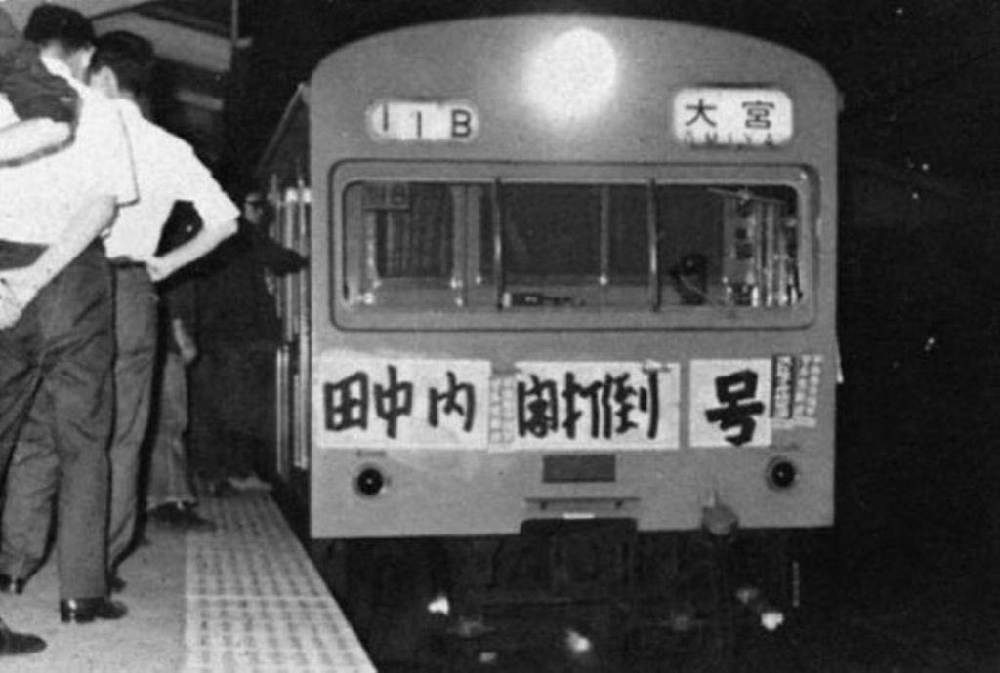
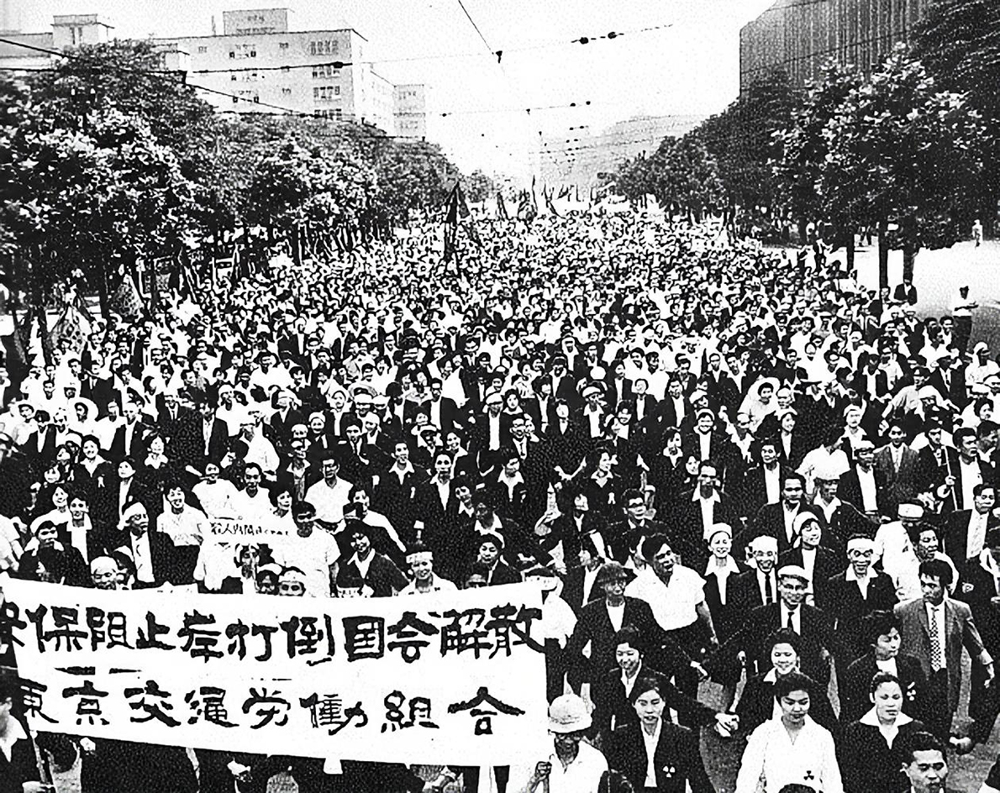

# 労働問題
## ●授業動画一覧＆問題集リンク
### ○問題集リンク

[公民問題集ウェブサイトの「労働問題」タグ問題一覧はこちら](https://teacheramesaka.github.io/hsworkbookcivics/tag/eco02_01/)  

### ○労働問題の歴史

||||
|:----:|:----:|:----:|
|世界の労働問題の歴史1|[YouTube](https://youtu.be/0txRujiqUoM)|[ニコニコ動画](https://www.nicovideo.jp/watch/sm40014305)|
|世界の労働問題の歴史2|[YouTube](https://youtu.be/c-5NkziNiBk)|[ニコニコ動画](https://www.nicovideo.jp/watch/sm40028818)|
|日本の労働問題　概説|[YouTube](https://youtu.be/sn1rhIMt0ks)|[ニコニコ動画](https://www.nicovideo.jp/watch/sm40028865)|

### ○労働三法（労働基準法）

||||
|:----:|:----:|:----:|
|概説、原則1|[YouTube](https://youtu.be/3OuI5coc-u4)|[ニコニコ動画](https://www.nicovideo.jp/watch/sm40029002)|
|原則2|[YouTube](https://youtu.be/bJgbRZ60BTw)|[ニコニコ動画](https://www.nicovideo.jp/watch/sm40074432)|
|法律、労働協約、就業規則、労働契約|[YouTube](https://youtu.be/ezimALwhcD8)|[ニコニコ動画](https://www.nicovideo.jp/watch/sm40074442)|
|労働時間|[YouTube](https://youtu.be/yGIGIkzcnwE)|[ニコニコ動画](https://www.nicovideo.jp/watch/sm40074459)|
|休日、賃金の支払い、労働基準監督署|[YouTube](https://youtu.be/DSvXWp0lA3E)|[ニコニコ動画](https://www.nicovideo.jp/watch/sm40074502)|
|その他労働基準法あれこれ|[YouTube](https://youtu.be/PxSwCN-OBHY)|[ニコニコ動画](https://www.nicovideo.jp/watch/sm40074593)|

### ○労働三法（労働組合法、労働関係調整法）

||||
|:----:|:----:|:----:|
|概要|[YouTube](https://youtu.be/UKat8QsvOvU)|[ニコニコ動画](https://www.nicovideo.jp/watch/sm40074619)|
|労働組合の形態（ショップ制）|[YouTube](https://youtu.be/-hmkbVKDm8I)|[ニコニコ動画](https://www.nicovideo.jp/watch/sm40074662)|
|労働委員会（概説）|[YouTube](https://youtu.be/ZNRTIwexS_E)|[ニコニコ動画](https://www.nicovideo.jp/watch/sm40097643)|
|労働争議と労働委員会|[YouTube](https://youtu.be/huh5-QFgnNQ)|[ニコニコ動画](https://www.nicovideo.jp/watch/sm40104012)|

### ○今日的な労働問題

||||
|:----:|:----:|:----:|
|崩壊した、日本の伝統的な労働環境1|[YouTube](https://youtu.be/3itqngpqiL8)|[ニコニコ動画](https://www.nicovideo.jp/watch/sm40122223)|
|崩壊した、日本の伝統的な労働環境2|[YouTube](https://youtu.be/vStFtYrsi5I)|[ニコニコ動画](https://www.nicovideo.jp/watch/sm40122351)|
|労働力のダンピング1|[YouTube](https://youtu.be/ZCNqRPN-1lc)|[ニコニコ動画](https://www.nicovideo.jp/watch/sm40142265)|
|労働力のダンピング2|[YouTube](https://youtu.be/w7OhnKG9Ezg)|[ニコニコ動画](https://www.nicovideo.jp/watch/sm40142320)|

※普通、問題集リンクも動画一覧も一つの表にまとめるのですが、労働問題は流石に動画量が多いので分割しました  

## ●前説
・政治分野でも見たように、経営者にとって「有能な社員」とは、極論を言えば、奴隷である  
  

  
<b>～懐かしの雑談再掲～
（クリック・タップして雑談を表示）</b>

  

　例えば、「有能な社員」とはどのような者か？　普通の高校生であれば、「一人で十人分の仕事ができるような人」と答えるだろう。 
　では仮に、あなたが会社の社長だとする。そしてあなたは、以下の二種類の内、どちらかを自社に採用できる…という状態だとする。その場合あなたは、どちらを取るだろうか？ 
 
１：「一人で十人分の仕事ができる」「年収二千万円」を一人 
２：「一人で一人分の仕事ができる」「年収百万円」を十人 
 
　あなたが会社の経営者なら、２を取る筈である。その方が、人件費が安くなるのだから。では、ここで更に、以下のような選択肢が現れたらどうなるだろうか？ 
 
３：「一人で0.5人分の仕事しかできない」「けど年収ゼロでいい人」を二十人 
※法的・道徳的な問題はないものとする 
 
　あなたが合理的な社長なのであれば、この３を、迷わず取る筈である。人件費ゼロで済むのだから。 
　結局のところ、企業とは、利益をとにかく増やそうとする存在である。そして利益最大化を徹底するなら、経営者にとって「有能な社員」とは「能力がある」者ではない。「タダ同然の給料」で「いくらでも働いてくれる」者こそが“経営者にとって有能な社員”である。 
 
　この論理を極限まで突き詰めれば、経営者が求める理想の労働者とは即ち、奴隷となるのである。 
 
<b>～政治分野第一章の「近世・近代・現代史概略」の「各時代の特徴」からでした～</b>
  

  
・しかしながら、令和の日本国は、人権を重視した民主主義国家という事になっている  
⇒人権を重視するというのであれば…特に、日本国憲法が言う通り、「国民は、すべての基本的人権の享有を妨げられない」「基本的人権は、侵すことのできない永久の権利」というのであれば、日本人を奴隷として働かせるのは非常にマズイ  
  
・よって、経営者が労働者を好き勝手に扱えないようにする仕組みが必要となる  
⇒その代表例が、労働基準法による労働条件の規制や、労働三権に基づく労働組合の活動である  
  
・本節では、このような労働者保護の仕組みと、その歴史について学習していこう
  
※本当にやばい企業というのは、そういうのに触れた事のない皆さんの想像を絶します。参考として、
諏訪符馬先生の漫画を貼っておきます：[https://x.com/fuumasuwa/status/1396011121744572419](https://x.com/fuumasuwa/status/1396011121744572419)  
  
## ●政治分野の復習
・日本国憲法［二十七］条に【勤労権】、［二十八条］に【労働三権】が定められている  
  
|権利|概要|つまり…|
|:----:|:----:|:----:|
|【勤労権】|働く権利|「国民には労働の意思があるのに仕事がなくて労働できない」という状況を解消すべく、国が［職業安定所（ハローワーク）］を設置する|
|【団結権】|【労働組合】を結成する権利|労働者は、「給料上げろ！」「休みを増やせ！」といった事を要求する為の団体、即ち労働組合を作ってよい|
|【団体交渉権】|【労働組合】が団体で使用者と交渉する権利|労働者は、労働組合という集団として、「給料上げろ！」「休みを増やせ！」といった要求を会社に出し、交渉してよい|
|【団体行動権（争議権）】|【労働争議】をする権利|会社側との交渉がうまくいかないのであれば、労働者は、労働組合の皆で実力行使をしていい|
  
・団体行動権（争議権）にて保障される労働争議としては、以下の手段がある  
  
|労働争議の種類|概要|
|:----:|:----:|
|【同盟罷業（ストライキ）】|労働者が示し合わせて、一斉に、仕事を完全放棄する|
|【怠業（サボタージュ）】|労働者が示し合わせて、意図的に怠けて仕事をする（仕事を完全放棄するところまではしない。意図的にサボる）|
|【ピケッティング】|労働組合として、ストライキに参加しない労働者が仕事をしようとするのを阻止したり、ストライキへの参加を勧誘したりする|
|【ロックアウト】|使用者側による対抗手段。職場を閉鎖して、労働者を働かせない（ので給料も払わなくてよくなる）というもの。要するにストライキの逆|
  
・労働者を保護する様々な制度や法律は、主に勤労権と労働三権を根拠としている  
⇒その代表例が、労働三法（【労働基準法】【労働組合法】【労働関係調整法】）である。以下、まずは労働三法について見ていこう  
  
## ●労働三法（労働基準法）  
### ○概説  
・日本国憲法制定に前後して、いわゆる労働三法が制定されていく  
⇒日本国憲法は1946年制定、1947年施行。一方労働三法は1945年に【労働組合】法、1946年に【労働関係調整】法、1947年に【労働基準】法が制定されている  
  
・本項はこの内、労働基準法を対象とする  
⇒基本的には、「労働者は、最高でも○時間までしか働かせちゃ駄目」「労働者を、最低限これぐらいは休ませてやれ」みたいな事が書いてある法律である  
  
・まず、労働基準法は労働三権に基づいた法律<u>ではない</u>点をチェックしたい  
⇒労働基準法は、基本的には【勤労権】、即ち日本国憲法［二十七条］に基づいている  
  
>日本国憲法第二十七条　すべて国民は、勤労の権利を有し、義務を負ふ。  
><u>２　［賃金、就業時間、休息］その他の勤労条件に関する基準は、法律でこれを定める。</u>  
>３　児童は、これを酷使してはならない。  
  
※労働三法も労働三権もどっちも「三」、で、労働基準法は労働三法の一種…というところでここを勘違いする人が多く、大学入試でもそこそこの頻度で狙われている  
  
・また、労働基準法は、生存権に基づいている側面もある  
  
>日本国憲法第二十五条　すべて国民は、健康で文化的な最低限度の生活を営む権利を有する。  
>２　国は、すべての生活部面について、社会福祉、社会保障及び公衆衛生の向上及び増進に努めなければならない。  
  
⇒労働基準法は、「労働者は、最高でも○時間までしか働かせちゃ駄目」「労働者を、最低限これぐらいは休ませてやれ」みたいな事が書いてある法律である。こういう規定を通じて、労働者に健康で文化的な最低限度の生活、即ち［人たるに値する生活］を実現しよう、という側面がある  
  
>労働基準法第一条　労働条件は、労働者が<u>人たるに値する生活</u>を営むための必要を充たすべきものでなければならない。  
>２　この法律で定める労働条件の基準は最低のものであるから、労働関係の当事者は、この基準を理由として労働条件を低下させてはならないことはもとより、その向上を図るように努めなければならない。  
  
※労働基準法を守らない企業は、労働者に「人たるに値する生活」を営めないようにしている、とも言える。これは見方によっては、「労働基準法を守らない企業は、労働者に奴隷労働をさせている」という読み方も可能である  
  
### ○労働基準法の原則  
・労働基準法には、原則がいくつかある  
⇒労働基準法の最初の方に書かれている。ここでは、一般に七原則とされるものを取り上げて紹介する  
  
  
#### ▽労働条件の最低基準の遵守  
・労働基準法に規定された条件を絶対に守りなさい、というものである  
  
>労働基準法第一条　労働条件は、労働者が人たるに値する生活を営むための必要を充たすべきものでなければならない。  
>２　この法律で定める労働条件の基準は最低のものであるから、労働関係の当事者は、この基準を理由として労働条件を低下させてはならないことはもとより、その向上を図るように努めなければならない。  
  
⇒労働基準法は、使用者が「守っていればそれで十分」と開き直るための法律ではない。労働基準法ギリギリまで労働条件を悪化させるような真似をしている時点でむしろ、労働基準法を遵守しているとは言えないのである。なお、現実には「労働基準法なんか守ってたら潰れる」とか言ってるような経営者が大量にいるので気をつけましょう  
  
  
#### ▽［労使対等］の原則  
・少なくとも建前上、使用者（経営者）と労働者（社員）は対等である、というものである  
  
>労働基準法第二条　労働条件は、労働者と使用者が、対等の立場において決定すべきものである。  
>２　労働者及び使用者は、労働協約、就業規則及び労働契約を遵守し、誠実に各々その義務を履行しなければならない。  
  
⇒政治分野第一章の「法の支配と法治主義」のところで、私人と私人は対等である事を原則とする（企業と個人であっても）、と言ったが、それと同じ。労働条件（給料、出社時間、退社時間、休日等々）は使用者が一方的に決め、労働者に押し付けていいものではない。なお、現実には「給料に文句があるなら辞めろ」とか言うような経営者が大量にいるので気をつけましょう  
  
  
#### ▽【均等待遇】の原則  
・労働者の【思想】【信条】等を理由として差別してはならない、というものである  
  
>労働基準法第三条　使用者は、労働者の国籍、信条又は社会的身分を理由として、賃金、労働時間その他の労働条件について、差別的取扱をしてはならない。  
  
⇒要するに、「外国人なんだから給料安くていいだろ」「あいつは外国人だからキツいシフトを多めに入れても文句言わないだろ」「あの宗教を信じている奴は面倒だから昇給させなくていいだろ」といった真似はするな、という話である。ブラック企業は、こういう差別を「合理的な経営判断」みたいな顔でやりがちなので気をつけましょう   
  
#### ▽【男女同一賃金】の原則  
・労働者が【女性】だからというのを理由に【賃金】を安くする、という事の禁止である  
  
>労働基準法第四条　使用者は、労働者が女性であることを理由として、賃金について、男性と差別的取扱いをしてはならない。  
  
⇒均等待遇の原則だけで充分なような気もするが、そもそも労働基準法は、制定されたのが終戦直後である。まだまだ「女は結婚したら退職するもんでしょ」どころか「女が大学行くのなんか生意気」が普通にあった時代であり、故にわざわざ別口で設定している…という側面がある  
  
  
#### ▽強制労働の禁止  
・そのまんま、強制労働をさせてはいけないという原則である  
  
>労働基準法第五条　使用者は、暴行、脅迫、監禁その他精神又は身体の自由を不当に拘束する手段によつて、労働者の意思に反して労働を強制してはならない。  
  
⇒「この令和の世の中に強制労働～？」と思うかもしれないが、令和二年にも岡山県で、「社員を職場に軟禁し、木刀で殴る等しながら強制的に働かせた」というので不動産会社社長が逮捕される事件があった。令和の時代を生きる人間にとっても、強制労働は他人事ではないのである  
  
  
#### ▽中間搾取の排除  
・「仕事を紹介する」等と言って、給料を「ピンハネ」するような行為を禁止する原則である  
  
>労働基準法第六条　何人も、法律に基いて許される場合の外、業として他人の就業に介入して利益を得てはならない。  
  
⇒要するに、「お前の働き口を世話してやるから、その代わり、お前が働いて稼いだ金の一部はウチがもらうぞ」という真似は、勝手にやってはいけない、という話である。現代日本には、派遣会社のように法律で特別に認められた仕組みもあるが、そういう例外を除けば、他人を働かせてその賃金を横から抜くような商売は許されない  
  

  
<b>～合法ですらこれですよ～（クリック・タップして雑談を表示）</b>

  

　労働基準法第六条を見ての通り、現代日本に於いては中間搾取が原則禁止されており、法律で特別に認められた例外のみが認められる。「じゃあその例外って何よ」と言うと、例えば派遣会社がそうなのだが…派遣会社という合法的なビジネスですら、その実態はあまりにもえげつない。という事で、「合法なのですらこれですよ、況して野放しにしたらどうなるか…」という意味で、派遣会社を例に見てみよう。 
 
　派遣会社にも色々あるが、ここでは、学校教員の派遣会社を例に見てみよう。学校教員というのは実は、全員が全員学校に雇われている訳ではなくて、派遣会社から派遣されて来ている人もいるのである。筆者も派遣教員として働いた事があるし、この文章を読んでいる人も高校生が多いと思われるので、教員派遣会社は身近な例と言えるだろう。 
 
　まず、派遣会社が広告を出す。「教員の仕事探してる人いませんか！」「弊社に登録すれば、仕事を紹介します！」「登録料無料！」というような広告である。これに釣られた人が、派遣会社に登録をする。 
　続いて、派遣会社が学校に営業をかける。「教員の数足りてますか？」「足りないなら派遣しますよ！」という訳である。で、きちんと運営している学校であっても「教員が急病で突然入院、復帰は未定」みたいな事態は起こる訳で、派遣会社に「英語の先生を一人派遣してくれ」というような発注をする訳である。 
　この発注を受けて、派遣会社は、登録をしていた人をその学校に送り込むのである。 
 
　ここまではいいのだが、問題はここからである。 
　学校は、教員を働かせる以上、当然、その労働の対価に当たるカネを支払わねばならない。但し派遣の場合、「学校が教員本人にカネを払う」形にはならない。「学校が派遣会社にカネを払う」「その上で、派遣会社が教員本人にカネを払う」という二重構造になる。 
　で、今回は仮に、「学校が派遣会社に月20万円払う」としよう。その場合、筆者の経験からすると、「派遣会社から教員本人」に払われるカネは、大体、月12万円から14万円ぐらいである。つまり、金額にして月8万円から6万円、割合にして3割から4割ほどが、派遣会社の取り分になる訳である 
 
　一応、この「ピンハネ」は、全部が派遣会社の「利益」になるわけではないのだが…それはそれとして、「合法的」な商売ですらこれである。労働基準法が「業として他人の就業に介入して利益を得」ることを「中間搾取」と呼んで原則禁じているのも、当然だろう（労働基準法第六条の見出しが「中間搾取の排除」になっている）。 
 
<b>～バイトでも、できるだけ直接雇用の仕事を探しましょう～</b>
  

  
#### ▽公民権行使の保障  
・例えば労働者が「選挙に行く」と言う場合、使用者はそれを阻止してはならない、という原則である  
  
>労働基準法第七条　使用者は、労働者が労働時間中に、選挙権その他公民としての権利を行使し、又は公の職務を執行するために必要な時間を請求した場合においては、拒んではならない。但し、権利の行使又は公の職務の執行に妨げがない限り、請求された時刻を変更することができる。  
  
⇒選挙で投票に行く、住民投票に行く、（裁判の裁判員に選ばれたから）裁判に行く…というような行為を、「公民権の行使（公民としての権利）」や「公の職務の執行」と呼んでいる。そういう用事で仕事を休む事を、使用者は拒んではならないという規定である。なお、「選挙？　仕事を休んでまで行くの？」「裁判員？　そんなもので仕事を休むの？「社会人としての自覚が足りないんじゃない？」とか言い出すのは、ブラック企業あるあるである  
  
### ○法律、労働協約、就業規則、労働契約  
・労働者の労働条件（給料とか、就業時間とか、休日とか）を決めるものは四種類ある  
⇒即ち、法律、［労働協約］、就業規則、［労働契約］の四種である  
  
||概要|備考|
|:----:|:----:|:----:|
|法律|国会で定められたもの|代表例が【労働基準法】。他にも［最低賃金法］等もある|
|労働協約|労働組合と企業が結ぶもの|労働組合がなければ作れない|
|就業規則|企業が作るもの||
|労働契約|労働者と企業が個別に結ぶ契約|一般に、入社する時に雇用条件通知書を貰ったり雇用契約書に署名したりするが、それらの書類に書いてある内容と思えばよい|
  
※表中の最低賃金法は、「バイトだろうが何だろうが、最低限、時給××円払いなさい」というような法律である。都道府県別に決まっており、例えば令和七年現在の北海道の最低賃金は時給1075円である  
  
・基本的に、優先順位は［法律＞労働協約＞就業規則＞労働契約］である  
⇒この令和の世の中になっても、「うちは労働基準法やってないから」「労働基準法なんて知らないよ、俺の言う通り死ぬまで働け」という企業はいくらでもある。そういう会社は勿論「ブラック企業」であり「違法企業」なのだが、実は、法律以外にも優先順位があるのだ  
  
例１：  
就業規則に「うちの社員は全員、毎日十二時間働け！」と書いてある  
法律（労働基準法）に「一日の労働時間の上限は八時間まで」と書いてある  
⇒法律が優先（就業規則の「十二時間働け！」は無効）  
  
例２：  
社員が入社する時に書いた契約書（労働契約）に、「休日は月に一日」と書いてある  
法律（労働基準法）に「最低限、休日は週に一日」と書いてある  
⇒法律が優先（労働契約の「休日は月に一日」は無効）  
  
例３：  
就業規則に「休日は週に二日」と書いてある  
法律（労働基準法）に「最低限、休日は週に一日」と書いてある  
⇒就業規則が優先（優先順位が下でも、労働者に有利な内容ならそっち優先）（と言うかそもそも、労働基準法は第一条に「最低基準」と書いてある）  
  
例４：  
就業規則に「休日は週に二日」と書いてある  
労働契約に「休日は週に三日」と書いてある  
⇒労働契約が優先（優先順位が下でも、労働者に有利な内容ならそっち優先）  
  
※例１の場合、「就業規則の、就業時間の項目」だけが無効となる。違反箇所が一つでもあったからと言って、就業規則全部が無効になる訳ではない。例２も「労働契約の、休日の項目」だけが無効になる  
  
※例３、例４も意外と大事。特に例３。「労働基準法に、休日は週に一日って書いてある！　だから、休日は二日以上あっちゃいけないの！」みたいな事を言い出す会社は本当に存在する。本当に、冗談抜きで、本当の本当に、存在する  
  
※なお、こういった、労働組合がいかに重要な存在であるかを示すものでもある。何せ、就業規則（会社側が作った規則）よりも、労働協約（会社と労働組合が合意して作った規則）の方が上なのだ  
  
### ○労働時間、法定休日  
#### ▽原則  
・労働基準法では、【法定労働時間】が定められている  
⇒具体的には、労働時間は一日に【八時間】まで、週【四十時間】まで、と定められている  
  
>労働基準法第三十二条　使用者は、労働者に、休憩時間を除き一週間について【四十時間】を超えて、労働させてはならない。  
>②　使用者は、一週間の各日については、労働者に、休憩時間を除き一日について【八時間】を超えて、労働させてはならない。  
  
※ここで重要なのは、「一日に【八時間】まで、週【四十時間】まで」、という部分である。八時間や四十時間はあくまで、上限である。しかし先にも見たように、「労働基準法に、労働時間は一日八時間って書いてある！　だから、労働者は必ず八時間職場にいなきゃいけないの！！」等と言い出す会社は本当に存在する。何なら筆者もそういう職場に勤めた事がある。気をつけよう  
  
・また、週に一日の法定休日が、労働基準法で規定されている  
  
>労働基準法第三十五条　使用者は、労働者に対して、毎週少くとも一回の休日を与えなければならない。（後略）  
  
※会社の求人を見ると、「完全週休二日制」と書いてあったり、「週休二日制」と書いてあったりする。一般に、「完全週休二日制」なら毎週必ず二日の休みがある。一方、「週休二日制」は、二日休める週もあるが、毎週必ず二日休めるとは限らない、という意味である。詐欺じゃん、と思うかもしれないが、労働基準法上の法定休日の考え方の基本は「毎週一日」なので、違法にはならない  
  
※法定休日に関しては、厳密に言えば、「四週間を通じて四日以上」というやり方もあるのだが…基本的には、「原則、法定休日は週一日」と覚えてしまって問題はない  
  
#### ▽三六協定  
・労働者を一日に十時間働かせたり、週に一日も休みを与えなかったりするのは違法である  
⇒先の「原則」で見た通り、労働時間は一日八時間まで、週四十時間まで、そして休日は最低でも週に一日。これを守らないのは違法、と言うか犯罪であり、労働基準法第百十九条にも、「六月以下の拘禁刑又は三十万円以下の罰金に処する」と記載がある  
  
・しかし現実には、いわゆる「残業」や「休日出勤」は日本各地で行われている  
⇒それも違法行為としてではなく、合法的に行われている。と言うのも、労働基準法第三十六条や三十七条に、「残業」や「休日出勤」を合法にするやり方が書かれているのである。その要点は以下の通りである  
  
１：使用者と労働者の間で、いわゆる【三六協定】を結ぶ  
２：三六協定に従い、使用者は労働者に対し、割増賃金を支払う  
  
※三六協定には、「法定労働時間を越えて働かせる場合があります」「休日に労働させる場合もあります」「そういう場合は割増賃金を支払います。具体的には時給を××パーセント増やします」というような事が書かれている  
  
※三六協定は、その会社の労働者の過半数が参加する労働組合が存在するのであればその労働組合と会社が締結する。そういう労働組合が存在しない場合は、いわゆる「労働者過半数代表」が締結する  
  
※「労働者過半数代表」は、その会社の社員全員を代表して交渉する人。一般的に、労働者が選挙をして選ぶ。勿論、会社が指名した人がなる…というのは認められない  
  
>労働基準法第三十六条　使用者は、当該事業場に、労働者の過半数で組織する労働組合がある場合においてはその労働組合、労働者の過半数で組織する労働組合がない場合においては労働者の過半数を代表する者との書面による協定をし、厚生労働省令で定めるところによりこれを行政官庁に届け出た場合においては、第三十二条から第三十二条の五まで若しくは第四十条の労働時間（以下この条において「労働時間」という。）又は前条の休日（以下この条において「休日」という。）に関する規定にかかわらず、その協定で定めるところによつて労働時間を延長し、又は休日に労働させることができる。（後略）  
  
>第三十七条　使用者が、第三十三条又は前条第一項の規定により労働時間を延長し、又は休日に労働させた場合においては、その時間又はその日の労働については、通常の労働時間又は労働日の賃金の計算額の二割五分以上五割以下の範囲内でそれぞれ政令で定める率以上の率で計算した割増賃金を支払わなければならない。（後略）  
  
・つまるところ、協定を結んだ上で割増賃金を払えば、「残業」は合法になるのである  
⇒逆に言えば、協定を結ばずに「残業」や「休日出勤」をさせたり、協定を結んでいてもその分の割増賃金を払わなかったりするのであれば、やっぱり犯罪である。先と同様、「六月以下の拘禁刑又は三十万円以下の罰金」になる  
  
※ちなみに。残業代を払わなかった場合、誰が拘禁刑になったり罰金刑になったりするかと言えば、勿論、会社の経営者である。…なのだが、何故か、「残業は犯罪だぞ！」と労働者に言ってくる会社というのは現実に存在する。気をつけよう  
  
・尚、この割増賃金、「残業」と「休日出勤」は別物である  
⇒法的には、いわゆる「残業」を「時間外労働」、いわゆる「休日出勤」を「休日労働」と呼ぶ事が多い。例えば、単なる時間外労働（残業）なら割増率は25%でいいが、休日出勤だと割増率は35%まで上げないと駄目…というような場合がある  
  
・ところで。三六協定を結んだからと言って、働かせ放題になる訳ではない  
⇒もっと言えば、三六協定を結んで残業代を払っているからと言って、働かせ放題になる訳ではない。一般的な三六協定では、時間外労働（残業）は「月45時間、年間360時間まで」という制限がある  
  
・尚、三六協定の上限すらも突破しそうな場合は、「特別条項付三六協定」を結ぶ事も可能ではある  
⇒労働基準法第三十六条五項曰く、「当該事業場における通常予見することのできない業務量の大幅な増加等に伴い臨時的に」長時間労働をさせます、という場合に結ぶ事が可能。こちらの場合、上限は以下のようになる  
  
１：月45時間を突破できるのは年6回まで　※時間外労働（残業）  
２：年間720時間以内　※時間外労働（残業）  
３：単月で100時間未満　※時間外労働（残業）＋休日労働（休日出勤）  
４：「２か⽉平均」「３か⽉平均」「４か⽉平均」「５か⽉平均」「６か⽉平均」が全て１⽉当たり80時間以内　※時間外労働（残業）＋休日労働（休日出勤）  
  
※ここまで三六協定とそれに基づく残業と残業代について見てきたが、注意が必要なのは、「一日八時間、週四十時間以上の労働は、原則として違法であり犯罪」という事である。「三六協定を結べば、ある程度までは合法になる」というものに過ぎない。そして、労働組合や労働者過半数代表が、三六協定の書面に判子を押さなければ、三六協定は締結されないのである  
  
※試験に出る、受験に出るとか関係なく、この辺の知識は大事に覚えておきましょう。そして会社で働くようになってから、残業まみれになったら学んだ事を思い出し、労働基準監督署か労働問題に強い弁護士に相談しましょう。日本人は社会科が嫌いなので、違法労働させてる会社なんて掃いて捨てるほどあります  
  
#### ▽様々な労働形態と定額働かせ放題  
・普通の会社は、出社したら（昼休みとかを除けば）就業時間終了までずっと働いている  
⇒例えば労働時間が八時間の会社があるとして、朝八時に業務開始、十二時から一時まで昼休み、五時まで働いたら労働終了、みたいな感じで働いている  
  
・上記のような普通の労働とは別の制度が、労働基準法で認められている  
⇒【フレックスタイム】制、【変形労働時間】制、【裁量労働（みなし労働）】制である  
  
・【フレックスタイム】制は、出社・退社の時間を労働者が自分で決める労働形態である  
⇒一定期間（三ヶ月以内）の総労働時間が、法定労働時間の枠に収まっていればOK  
  
・【変形労働時間】制は、忙しい時と暇な時で労働時間の長さを変える労働形態である  
⇒週単位、月単位、年単位のどれかで見て、法定労働時間の枠に収まっていればOK。フレックスタイム制と違い、いつ出社していつ退社する、というのは会社側が指定可能  
  
例：居酒屋は普通、平日は夕方から夜まで営業、休日だけ昼から夜まで営業している。つまり、居酒屋を経営する企業は普通、「週末だけ忙しく、平日は暇」である。こういう企業が、「週末だけ十時間労働、平日は五時間労働」というような労働形態を採用する…というのは、典型的な変形労働時間制である  
  
・【裁量労働（みなし労働）】制は、「みなし労働時間」を定めて「その時間労働したと見做す」ものである  
⇒「みなし労働時間」を「六時間」と決めたのであれば、実際に働いたのが十時間だろうが一時間だろうが、六時間働いたと見做す、というもの。どんな会社・どんな仕事でも使える制度ではなく、一部の業務に限って認められている  
  
・これらは労働者にとって益になる事もあるが、害になる事も非常に多い。注意が必要である  
⇒本来、上記三種の制度を採用している会社であっても労働時間に上限はあるし、残業代も発生し得る。しかしながら、上記三種の制度を「定額働かせ放題」だと思い込んでいる企業は多い。即ち、「うちは変形労働時間制です」と言っておけば労働者を定額で（残業代なしで）、無制限に働かせられると思い込んでいる…というようなブラック企業が、非常に多いのである  
  
※令和八年現在、フレックスタイムはまだしも、変形労働時間制と裁量労働制は…制度的にも非常に複雑で禁止事項が多く、経営者に悪意が無かったとして、適正に運用するのも一苦労である。筆者自身、「これ、変形労働時間制を定額働かせ放題だと勘違いしてるな？」という学校の求人を見た事があるし、「定額働かせ放題」で検索するとかなりの頻度で裁量労働制の記事が出てくる始末である。おかしいと思ったら、労働基準監督署か弁護士事務所へどうぞ  
  
### ○有給休暇  
・労働基準法には、【年次有給休暇】、通称有休が規定されている  
⇒労働者が労働日（本来なら出勤すべき日）に休んだ場合、企業は、その労働者の給料を減らす事ができる。しかしこの有休を使った休みは、企業は給料を支払わねばならない。言い方を変えれば、「給料を貰いながら休む」制度が有休である  
  
>労働基準法第三十九条　使用者は、その雇入れの日から起算して六箇月間継続勤務し全労働日の八割以上出勤した労働者に対して、継続し、又は分割した十労働日の有給休暇を与えなければならない。（後略）  
  
・週五日以上出勤する社員であれば、六ヶ月以上勤務した場合、法律上は最低［十日］の有休が発生する  
⇒新入社員が六ヶ月勤務した時点で、法律上は最低でも十日の有給休暇が発生する。もちろん、会社がそれ以上の日数を与えても構わない。以後、有給休暇は毎年付与され、法律上の最低日数も少しずつ増え、最終的には［二十日］となる  
  
※但し、出勤すべき日の八割以上出勤していなければならない。言い方を変えると、会社は、出勤すべき日の20%以上を欠勤する激ヤバ社員に対しては、有給休暇を付与する必要はない  
  
・勿論、いわゆるアルバイト（非常勤、パート）でも有休は発生する  
⇒仮に週一日出勤のアルバイトであったとしても、入社してから六ヶ月経過し、かつ出勤すべき日の八割以上に出勤しているならば、有給休暇が発生する（流石に日数は、週五日出勤の社員より少なくなるが）  
  
・有給休暇の取得（使用）に際しては、使用者（会社）は、原則、これを拒んではならない  
⇒極端な話、「この日に新作のゲームが出るんで、一日中ゲームする為に有給休暇使って休みます」でも拒否できないし、給料は支払わねばならない。一応会社側も、「その日は勘弁して。別の日にしてくれ」と言う事はできるのだが、単に「業務多忙」だからでは駄目、と厚生労働省の資料にはっきり書かれてしまっている  
  
・有休も、違法な扱いをしている企業が多い制度である  
⇒「そもそも人が足りてないから、一人有休取られただけで業務が麻痺する」というような状態を放置したまま、労働者の有休の使用を拒否する企業もある。筆者自身、体調不良で有休を使用すると申請したら解雇された経験がある（勿論、違法ムーブなので、その後大騒動にした）。バイトには有休を認めない、という違法企業も非常に多い。おかしいと思ったら労働基準監督署か弁護士事務所へ  
  
・一方で、現代日本社会の「休みづらい」問題も存在する  
⇒長年日本は、有給休暇取得率が低いと言われ続けてきた。「うちの社員は有休を取れって言ってるのに休まないんで困るよ」と言う経営者も多い。しかしよく考えてほしいのだが、「忙しすぎて休めない」職場を作っているのは誰かと言えば、勿論、使用者（経営者）である。使用者が沢山人を雇ったり、仕事を減らしたりして、労働者が「自分が休んだら職場に迷惑がかかる」と思わないようにすればいいだけの事なのだ  
  
※こういう事情から、令和元年から、「年十日以上の有給休暇が付与される労働者に対しては、少なくとも年五日、会社が責任を持って有給休暇を取得させねばならない」旨の制度が導入された。尚、「うちの社員は有休を取れって言ってるのに休まないんで困るよ」と言う経営者は、相変わらず掃いて捨てるほどいる   
  
### ○その他労働基準法あれこれ  
#### ▽賃金の支払い  
・労働基準法では、賃金の支払いは以下のように支払う事を定めている  
  
１：賃金は、［通貨］で支払う  
２：賃金は、本人に［直接］支払う  
３：賃金は、一括で全額を支払う  
４：賃金は、月に一回以上支払う  
５：賃金は、一定の日に支払う  
  
⇒つまり、賃金を現物で支給したり、分割支払いしたりするのは原則、違法である  
  
>労働基準法第二十四条　賃金は、通貨で、直接労働者に、その全額を支払わなければならない。（後略）  
>②　賃金は、毎月一回以上、一定の期日を定めて支払わなければならない。ただし、臨時に支払われる賃金、賞与その他これに準ずるもので厚生労働省令で定める賃金（第八十九条において「臨時の賃金等」という。）については、この限りでない。  
  
※令和のブラック企業で多いのが、「労働者に自社商品を無理矢理買わせる」、いわゆる自爆営業である。コンビニで売れ残り商品をアルバイトに買わせる、アパレルで制服扱いの最新服を自費購入させる、等の例が有名である。しかもこれが、無理矢理買わせた商品の代金を控除して（差し引いて）給料を支払う…となれば、先に挙げた要素の３、「賃金は、一括で全額を支払う」に違反する犯罪となる（三十万円以下の罰金刑。まぁ無理矢理買わせてる時点で既にパワハラなので、別の法に触れているのだが…）  
  
#### ▽労働基準監督署  
・労働基準法が守られているかどうかを監視する機関として、［労働基準監督署］がある  
⇒企業の労働基準法違反に対し立入調査を行い、是正勧告や使用停止命令を出し、重大・悪質な事案では労働基準監督官が警察官のような捜査も行う組織である。即ち、行政府に所属するが、労働基準法については警察・裁判所的な機能を持つ、いわゆる［準司法］組織にあたる機関である  
  
※労働基準監督署に言えば何でもハッピーエンド、必ず問題が解決する…なんて事は当然、ありません。担当者によって動いてくれる・くれないがかなりあります（筆者の実体験）し、労働基準法違反を証明する証拠がないと動かない（動けない）場合も多いです。自衛の意味でも、日記ぐらいはつけるようにしましょう  
  
※労働基準法違反があったら必ず労働基準監督署を使わねばならない、という訳ではない。直接裁判に訴える事もできる。この場合、判決が出るまでは［仮処分］が出る事が多い  
  
※労働基準監督署に行くにせよ、裁判に訴えるにせよ、証拠はあった方がいいです。労働問題で裁判になった場合、日記も証拠になるので、勤怠時間や上司に言われた事など、しっかり記録しておくと自衛になります。ペン型ボイスレコーダー等を使用して音声証拠を残しておくのも有効です  
  
#### ▽年少者の雇用  
・労働基準法では、［十五歳］未満の雇用を原則禁止している  
⇒何処の中学校でも基本、「中学生はバイト禁止」と言われるが…何の事はない、校則以前に労働基準法で禁止されているのである  
  
>労働基準法第五十六条　使用者は、児童が満十五歳に達した日以後の最初の三月三十一日が終了するまで、これを使用してはならない。  
>②　前項の規定にかかわらず、別表第一第一号から第五号までに掲げる事業以外の事業に係る職業で、児童の健康及び福祉に有害でなく、かつ、その労働が軽易なものについては、行政官庁の許可を受けて、満十三歳以上の児童をその者の修学時間外に使用することができる。映画の製作又は演劇の事業については、満十三歳に満たない児童についても、同様とする。  
  
・［十八歳］未満については、時間外労働や深夜勤務等を原則禁止している  
⇒前者については、十八歳未満は三六協定の適用外、という形にしている。後者については、「十八歳未満は××時から××時まで、働かせちゃ駄目！」という形で規定されている  
  
>労働基準法第六十条　第三十二条の二から第三十二条の五まで、第三十六条、第四十条及び第四十一条の二の規定は、満十八才に満たない者については、これを適用しない。（後略）  
>労働基準法第六十一条　使用者は、満十八才に満たない者を午後十時から午前五時までの間において使用してはならない。ただし、交替制によつて使用する満十六才以上の男性については、この限りでない。（後略）  
  
・未成年者（【十八歳】未満）については、親が本人の代わりに労働契約を結ぶ事を禁止している  
⇒令和四年三月までは【二十歳】で成人だったのが、同年四月から【十八歳】で成年となった。結果、労働基準法でも、「未成年者」の基準が変わっている  
  
>労働基準法第五十八条　親権者又は後見人は、未成年者に代つて労働契約を締結してはならない。  
>②　親権者若しくは後見人又は行政官庁は、労働契約が未成年者に不利であると認める場合においては、将来に向つてこれを解除することができる。  
>労働基準法第五十九条　未成年者は、独立して賃金を請求することができる。親権者又は後見人は、未成年者の賃金を代つて受け取つてはならない。  
  
#### ▽女子労働者保護規定
・政治分野第一章の復習だが、日本は1985年に【女子差別撤廃条約】を批准している  
⇒同じく復習だが、その前年に、［男女雇用機会均等法］を制定し、［国籍法］を改正している。これは、女子差別撤廃条約を批准する為の措置である  
  
・実を言うと、この時、労働基準法も変えている  
⇒当時の労働基準法では、女子労働者の保護規定がかなり強かったのだが、女子差別撤廃条約批准に合わせて緩和されたのである。具体的には、【時間外労働】について規制があったり、【深夜業】が禁止されていたりしたのだが、この規制が緩和された  
  
・これらの女子労働者保護規定は、1997年の改正でかなり撤廃され、原則、男子労働者と同等となった  
⇒今でも認められている女子労働者保護規定としては、【生理休暇】と【産前産後休暇】あたりが代表例である。【育児休業】については、男子労働者にも定められているので女子労働者のみのものではない  
  
## ●労働三法（労働組合法、労働関係調整法）  
### ○労働組合法と労働関係調整法の概要  
・労働三権を基礎として作られた法律の代表例として、労働組合法と労働関係調整法がある  
  
【労働組合法】：労働三権（団結権、団体交渉権、団体行動権）全体を具体的な法律にまとめたもの  
【労働関係調整法】：労働三権の中でも団体行動権による労働争議に的を絞った法律  
  
・どちらの法律も、第一条を見ればその要諦は理解できるようになっている  
  
>労働組合法第一条　この法律は、労働者が使用者との交渉において対等の立場に立つことを促進することにより労働者の地位を向上させること、労働者がその労働条件について交渉するために自ら代表者を選出することその他の団体行動を行うために自主的に労働組合を組織し、団結することを擁護すること並びに使用者と労働者との関係を規制する労働協約を締結するための団体交渉をすること及びその手続を助成することを目的とする。  
  
⇒つまり、労働組合法は以下の二つがその要諦である  
  
１：労働者（社員）と使用者（企業、会社の社長）が対等であるという［労使対等］を原則とする  
２：労働者が団結し、［団体交渉］を通じて［労働協約］を結び、労働条件の向上を図る事を目的とする  
  
>労働組合法第一条２　刑法（明治四十年法律第四十五号）第三十五条の規定は、労働組合の団体交渉その他の行為であつて前項に掲げる目的を達成するためにした正当なものについて適用があるものとする。但し、いかなる場合においても、暴力の行使は、労働組合の正当な行為と解釈されてはならない。  
>刑法第三十五条　法令又は正当な業務による行為は、罰しない。  
  
⇒実は労働組合法第一条には２項があるのだが、これは、団体行動権を行使して労働争議となった際、正当な手続きに沿った労働争議であれば、一見すると何かしらの罪に問われたり損害賠償請求の対象になったりしそうなものであっても不問とする…という旨の内容である。だから安心して労働争議やっていいよ、という訳である  
  
>労働関係調整法第一条　この法律は、労働組合法と相俟つて、労働関係の公正な調整を図り、労働争議を予防し、又は解決して、産業の平和を維持し、もつて経済の興隆に寄与することを目的とする。  
  
⇒とは言え、今日はこっちのスーパーがストライキ、明日はあっちのレストランがロックアウト、明後日はそっちの電車がストライキ、みたいになっても困る訳で…労働関係調整法は、労働争議の【予防】や、深刻化した労働争議の【解決】を目的に作られている  
  
### ○労働組合の形態（ショップ制）  
#### ▽各ショップ制の概要  
・労働組合には、強制加入のものから、加入脱退自由のものまで、様々な形態がある  
⇒ここでは労働組合の形態として代表的な、［オープン・ショップ］［クローズド・ショップ］［ユニオン・ショップ］の三種を見ていこう。簡単にまとめると以下のようになる  
  
|形態|概要|
|:----:|:----:|
|［オープン・ショップ］|従業員が労働組合に入るのも辞めるのも完全に自由|
|［クローズド・ショップ］|とある労働組合ととある企業が、「我が組合に属していない者を、従業員として採用してはならない」という労働協約を結んだ場合|
|［ユニオン・ショップ］|とある労働組合ととある企業が、「この会社に従業員として採用された者は、入社後我が労働組合に入らなければならない」という労働協約を結んだ場合|
  
・オープン・ショップは、近年になって作られた労働組合に多く見られる  
※また、公務員が加入する労働組合は強制的にこれとなる。国家公務員法及び地方公務員法に、公務員の労働組合はオープン・ショップ制でなければならないと定められている  
  
・クローズド・ショップは、［職種別労働組合］や［産業別労働組合］が強い場合に見られる形態である  
⇒日本ではほぼ見られない形態で、「日本では見られない」「日本では皆無」とする解説も多い  
  
>クローズド・ショップの例：「日本教員労働組合」という、教員免許さえ持っていれば誰でも入れる労働組合があったとする。そして日本教員労働組合が「うちの組合員以外採用するな」という労働協約を、とある学校に認めさせたとする。そうなると、この学校はもう、日本教員労働組合の組合員しか採用できなくなる。  
  
・［ユニオン・ショップ］  
⇒［企業別労働組合］が強い場合によくみられる形態で、日本に古くからある労働組合も割とこれが多い  
  
>ユニオン・ショップの例：「株式会社グリーングリーン」という会社があり、「みどり労働組合」という組合もあったとする。そして、グリーングリーン社の労働者の過半数がみどり労働組合に入っているとする。この時「株式会社グリーングリーンに入社した者は、入社後みどり労働組合に入らなければならない」という労働協約が結ばれた場合、グリーングリーン社の新入社員は強制的に、みどり労働組合に加入させられる。  
  
※尚、労働組合法には実は、これらのショップ制については殆ど記述がない。僅かに、「ユニオン・ショップ制を定める労働協約を結ぶんだったら、“その会社の労働者の過半数を代表する労働組合”じゃなきゃ駄目ヨ」という旨の内容が労働組合法七条に書いてあるぐらいで、オープン・ショップもクローズド・ショップも記載されていない。まぁオープン・ショップはわざわざ書くような事ではないと言えばそうだし、クローズド・ショップも、そもそも「日本では見られない」「日本では皆無」とか普通に言われちゃうぐらいの存在だし……  
  
#### ▽ユニオン・ショップあれこれ  
・ユニオン・ショップの場合、労働組合を抜けたら会社からも解雇されるのが普通である  
※これはクローズド・ショップもそう  
  
・ただし、実際には解雇に至らない場合も多く、これを［尻抜けユニオン］と言う  
※理論上、「尻抜けクローズド」もある筈なんですが、少なくともこの単語を私が見た事はありませんね…  
  
・また、労働組合を抜けて別の労働組合に入った者を、「組合員じゃないから」で解雇するのは違法となる  
⇒先の「グリーングリーン社」と「みどり労働組合」の例で、仮に、この会社が薬局を経営する会社だったとする。そして、ある社員が「みどり労働組合」を抜けて、薬剤師なら誰でも入れる労働組合に入ったとする。で、グリーングリーン社が「みどり労働組合との協約があるから」でこの人を解雇すると、裁判になったらまず勝てない  
  
・ユニオン・ショップ制労働組合の欠点として、労働組合幹部と企業の癒着が発生しやすさが挙げられる  
⇒ユニオン・ショップ制労働組合は、組合員が全員、どこかの企業の社員になる。その為、企業からすると誰が何をしているか簡単に把握できる。よって、会社の重役が労働組合員幹部に対して「昇進させてあげるからさ、今度やるって言ってるストライキ中止にしてよ」とかも簡単にできてしまう。これは一応、労働組合法で禁止されている行為ではあるのだが…  
  
※日本の労働組合は、ユニオン・ショップ制のものが結構多く…この欠点のせいで、日本の労働組合は役に立っていない場合が多い、という指摘もよく見られる。逆に言えば、だからこそ「ユニオンを抜けても別の労働組合に入ればセーフ」ルールが大事とも言える   
  
#### ○労働委員会（概説）  
・【労働委員会】は、労働組合法に基づき作られている組織である  
⇒ちょっと面倒なのが、「労働委員会を作るよ」というのは労働組合法に書いてあるのだが、「労働委員会は、具体的にはこういう事をするよ」というのは労働関係調整法に書いてあるものが多い…というところである  
  
・労働委員会は、労働組合関係の法令に特化した［準司法］組織と説明される事が多い  
⇒「行政府に所属する」が、「特定の法令に関しては警察・裁判所的機能を持つ」組織を、高校の政治経済等では［準司法］組織と分類する  
  
※つまるところ、労働委員会は、労働組合版労働基準監督署と言える組織である。ただ、労働基準監督署はどちらかと言うと「労働関係の警察」という色が強いが、労働員会は「労働関係の裁判所」という色が濃い  
  
・労働委員会は、［使用者］委員、［労働者］委員、［公益］委員から構成される  
⇒使用者（企業）と労働者双方の意見を取り入れつつ、第三者委員も入れるという形での構成である  
※各委員の代表例としては、使用者委員は大企業の社長、理事、顧問といった人々、労働者委員は大規模な労働組合の幹部、公益委員は弁護士や大学教授が挙げられる  
  
・労働委員会の大きな仕事として、【不当労働行為】を取り締まる事がある  
⇒不当労働行為とは、使用者が労働者や労働組合に対して行う、【労働三権】を侵害する行為である。以下に代表例を挙げよう  
  
|事例|例|
|:----:|:----|
|不利益取り扱い|・使用者（会社）が、ある労働者（社員）を、「労働組合に入っているから」という理由で降格させた ・使用者（会社）が、ある労働者（社員）を、「ストライキに参加したから」という理由で解雇した ・使用者（会社）が、「労働組合に入っている者は昇進させない」と言った|
|団体交渉拒否|・使用者（会社）が、労働組合からの団体交渉申し込みに対し、「要求を受け入れる意志はないので、交渉もしません」と拒否した ・使用者（会社）が、労働組合との団体交渉に応じたものの、毎回「要求事項について検討する」とだけ返答し続け、最終的に交渉を打ち切った|
|支配介入、【経費援助】|・使用者が、会社に都合のよい労働組合を作らせようとした ・使用者（会社）が、労働組合に資金を渡した|
|【黄犬契約】|・使用者（会社）が新入社員を雇う際（労働契約を結ぶ際）、労働組合に入らない事を条件とした|
  
※キリスト教圏では、黄色は卑怯者、裏切者の色である（イエスを裏切ったユダのイメージカラーが黄色）。yellow dogはそのまま卑怯者という意味だし、企業と癒着して労働者の味方をしない労働組合をyellow union（黄色組合）と呼ぶ。そこからの直訳で、黄犬契約という言葉も日本にも入ってきたのである  
   
・不当労働行為があった場合、それぞれの地方の労働委員会に申し立てを行う事ができる  
⇒不当労働行為発生から【一年】以内の申し入れであれば、労働委員会は救済に動いてくれる。労働委員会は、【調査】と【審問】の後、申し立てが事実であると判断すれば救済命令を出してくれる  
  
※別に労働委員会に申し立てずとも、直接裁判に訴えても構わない。この辺は労働基準監督署と同様である  
  
・尚、使用者（企業）も、地方労働委員会の言い分に不服であれば、反撃もできる  
  
１：中央労働委員会への申し立て  
※この場合、中央労働委員会が改めて調査と審問を行う  
２：裁判に訴える  
※この場合、訴訟の種類で言えば［行政訴訟］になる。労働委員会という行政機関が出した命令（行政府が出した命令）に対する裁判になる為である  
  
#### ○労働争議と労働委員会  
・労働争議というのは労働者の当然の権利だが、頻発したり、泥沼化したりするのは望ましくない  
⇒先にも言ったが、今日はこっちのスーパーがストライキ、明日はあっちのレストランがロックアウト、明後日はそっちの電車がストライキ…みたいになっても困る訳である  
  
・特に鉄道のような公益性・公共性の高いものが突然、ストライキで止まったら大変である  
⇒例えば神奈川県の相模鉄道（相鉄線）は、一日に百万人以上が利用する（令和五年現在、相鉄公式）。神奈川県外の人間にはほぼ名前を知られていない鉄道ですらこれなので、突然止まったら大変な事になる  
  
・労働関係調整法はこういった事情から作られており、主に以下の方法で、労働争議を予防・解決する  
  
１：公益事業の労働争議については、通知制度を設ける  
⇒公益事業で労働争議をする場合は、［十日前］までに通知せねばならない（労働関係調整法第三十七条）。また、国民生活に重大な影響が出ると判断された場合は、内閣総理大臣が［五十日間］の争議禁止を命令できる（労働関係調整法第三十八条。条文では「緊急調整」という言い方をしている）  
  
２：労働委員会が、［斡旋］、［調停］、［仲裁］によって労働争議を解決する  
⇒労働関係調整法による労働争議早期解決の主役。以下の順番で行う  
  
①：［斡旋］。労働委員会が、労働組合、使用者（企業）の交渉の場を取り持つ  
②：［調停］。対立する両者に対し、労働委員会が解決案を提示する。この解決案に［法的拘束力はない］  
③：［仲裁］。対立する両者に対し、労働委員会が解決案を押し付ける（［法的拘束力］あり）  
  
※ちなみに、労働組合が政治闘争にかまけて労働者の待遇向上を放置したり、組合幹部が企業と癒着して労働運動を放棄したりした結果、労働組合法や労働関係調整法に基づく本来的な労働運動は現状、「非常に少ない」と評するより他ない状況にある。「うちの労働組合なーんの役にも立たねーな」と思ったら、別の労働組合を探してみたり、自分で作ったりしてみるのもよいだろう  
  
※尚、従来型の労働運動の主役だった労働組合が役に立たなくなった結果、個人レベルでの労働問題が起きるようになり、これに対応するべく［労働審判法］や労働契約法といった法律が制定されている。その成果は充分なのかと言われると…それはまぁ…相変わらずブラック企業が蔓延ってるところから言うと…そうですね……  
  
## ●労働問題の歴史  
### ○世界の労働問題の歴史  
#### ▽労働問題の興り  
※高校の社会科、特に公民で「世界の××の歴史」と言ったら、それはかなり高い確率で「欧米の××の歴史」に言い換えられる。公共や政治経済に於ける労働問題も、同様である  
  
・一般に、労働問題は、産業革命と共に発生したとされる  
⇒広く言えば、古代や中世の農民一揆、農民反乱も、労働問題と言えばそうである。とは言え、例えば中世欧州の農民とは、「貴族の所有物」「貴族の財産」であって、「人権を認められた人間」ではなかったし、「会社に雇われて働く社員」とはかなり趣が違うので…「会社に雇われて働く社員」が大量に発生する、産業革命と共に労働問題も発生した、という説明が一般的である  
  
・世界最初の労働運動は、1811年イギリスの［ラッダイト運動］であるとされる  
  
・ラッダイト運動は、フランス革命からのナポレオン戦争の真っ最中に起きた事件である  
⇒この時期、イギリスでは産業革命がかなり進行しており、それまで手作りだった商品が、どんどん機械で作れるようになっていった。いわゆる［工場制手工業（マニュファクチュア）］（工場に職人を集め、商品を手作りしている）から［工場制機械工業］（工場の中に機械があり、機械を動かして商品を大量生産する）への移行期であり、機械を導入した工場から次々と手作り職人が解雇される、という事態も起きていた  
  
・ラッダイト運動は、解雇された手作り職人による、機械の打ち壊し運動であった  
⇒機械を壊して、「俺達を再び雇え！」という訳である。言ってみれば、中世的な農民一揆から、現代的な労働争議への過渡期にあたる運動であった  
  
#### ▽チャーチスト運動  
・結局のところ、ラッダイト運動は限界が見えている運動でしかなかった  
⇒機械という便利なものが開発されてしまった以上、それを導入する流れは止まらない。手作り職人と機械の関係は、令和の現代で言えば、イラストレーター（手描きで絵を描く人）と生成AIの関係に近いと言えるかもしれない  
  
・一方で、産業革命の進展と人権思想の浸透の中、労働者の待遇は悪化する一方であった  
⇒政治分野で何度も述べたが、産業革命が起こった革命の時代に於いて、人権と言えば【自由権】である。そして自由権が尊重される社会では、会社の社長は「社員の給料を減らす自由」や「社員の休みを減らす自由」を思う存分行使するのである  
  
  
  
・故に、革命の時代に続く資本の時代、帝国の時代では、【参政権】が求められるようになる  
⇒「俺達労働者の代表を議会に送り込んで、労働者の待遇を改善して貰おう」という訳である。実際、資本の時代と帝国の時代は、先進各国で【（男子）普通選挙】権を求める運動が頻発した時代であった  
  
・特にイギリスは、世界で最初に産業革命を完遂した国だけあって、この手の運動の開始も早かった  
⇒いわゆる【チャーチスト運動】は、革命の時代の終盤、1830年代には始まっている。これは（男子）普通選挙運動である一方、労働組合が関わったりストライキも伴っていたりする等、労働運動の走りと言える運動でもあった  
  
※実際、政治経済の教科書では、「世界最初の労働運動」として、ラッダイト運動と共にチャーチスト運動が紹介される場合が多い  
  
#### ▽社会主義と労働運動  
・歴史上、労働問題がややこしくなる主な原因の一つとして、社会主義の存在があった  
⇒ここで言う社会主義は、後にマルクス＝レーニン主義、つまり、ソ連的な社会主義に繋がる類の社会主義である。この手の社会主義は究極のところ、「労働者を虐める資本家を皆殺しにして、新しい社会を作ろう」である。後の歴史を見れば、社会主義者が権力を握った国は例外なく、暴力革命、一党独裁、秘密警察、監視国家…という路線へ進んだ事が分かる。言うまでもなく、十九世紀や二十世紀の政治家にとっても、社会主義とは危険思想であった。そして社会主義者は、労働組合の活動にとても熱心に参加するのである  
  
・故にこそ、政治家から見れば、労働問題は「労働者を虐めたらいかんでしょ」で済む単純なものではない  
⇒政治家から見ても、資本家が「社員の給料を減らす自由」や「社員の休みを減らす自由」を無制限に行使するのは問題と映る。とは言え、そういう「自由」に反対の声をあげている労働組合は…と思ってそちらを見ると、社会主義こと「金持ち皆殺し教」の人が大量に混じっている。これは判断に困る。誰だって困る  
  
※先に挙げたチャーチスト運動も、結局は政府によって鎮圧されるのだが、チャーチズムが単なる選挙制度改革運動ではなく、社会主義的・革命的な運動とも結びついていると警戒されたからでもある。実際、チャーチスト運動は本来（男子）普通選挙獲得運動ではあるのだが、社会主義者も普通に混じっていた。結果、「今の労働者の扱われ方はナンボなんでも酷すぎる」旨の演説をしている国会議員でも、それはそれとして「チャーチスト運動そのものは認めない」と言い出す始末であった  
  
・革命の時代末期に始まるチャーチスト運動ですらこれである。しかも社会主義はこの後、更に勢いを増す  
⇒以下で、社会主義の興隆に関する主要な事例を拾ってみよう  
  
１：1864年、［第一インターナショナル］（［国際労働者協会］）が結成  
⇒あのカール・マルクスも自ら参加。社会主義の普及と社会主義革命を全世界的に目指す。内部の意見対立によって1876年には解散  
  
２：1889年、［第二インターナショナル］が結成  
⇒あのフリードリヒ・エンゲルスも参加。第一は「労働者と社会主義者の国際組織」という趣だったが、こちらは「各国の社会主義政党と労働組合の国際組織」という色が濃い。第一次世界大戦に対する対応を巡って内部対立が激化、崩壊する  
  
３：1917年、［ロシア革命］が起こる  
⇒ここからロシア内戦が生起、最終的には、1922年、ソヴィエト社会主義共和国連邦、通称ソ連の誕生で決着する。世界初の社会主義国家の誕生であった  
  
４：1919年、［第三インターナショナル］が結成される  
⇒［コミンテルン］とも。第一次世界大戦で成立したソ連の主導によって結成。他国の革命家を支援する一方、各国の共産党を事実上「ソ連の出先機関」として動かした。第二次世界大戦の進展に伴い活動が縮小、1943年に解散  
  
５：第二次世界大戦後は、ついに、冷戦が始まる  
⇒世界が西側（米国）陣営と東側（ソ連）陣営に分かれて争った時代の開幕。これは言い方を変えれば、世界が資本主義と社会主義に分かれて対立した、という事態である。尚、1947年には、コミンテルンを受け継ぐ組織としてコミンフォルムが結成されている  
  
・このような状況では、各国の政治家も単純に「労働者を守ろう」とは言いづらい  
⇒資本家が労働者に滅茶苦茶やるのはやめさせたい。が、下手に「労働者を守ろう」をやると、社会主義者が勢いづく。どうにも困る訳である。だからドイツ帝国のように、「社会主義は弾圧する」「それはそれとして、労働者を保護する政策を推進する」というような形になる場合が多い  
  
・ここで実例として、アメリカ合衆国を挙げよう  
  
労働者保護政策：1935年、労働者の団結権、団体交渉権を認める［ワグナー法］を作った  
⇒世界恐慌の後、ちょうど【ニューディール政策】をやっている頃で、この法律もニューディール政策の一環。社会主義っぽいものが大嫌いなお国柄（令和になっても、米国で“日本を見習って我が国でも国民皆保険制度を作ろう”とか言ったら“社会主義者だ！”と言われるぐらいである）にも拘わらずこのような法律が制定された背景には、世界恐慌の凄まじさもあったし、ロシア革命の恐怖（労働者を虐め過ぎると革命が起きる）もあった  
  
弾圧政策：1947年、労働組合の権限を大きく制限する［タフト・ハートレー法］を作った  
⇒背景には、冷戦が始まって米ソが対立するようになった、という事情がある。冷戦が激化する中、親ソ的な社会主義者は裏切者であるという意識が強まり、政府や議会による調査・摘発・粛清（いわゆる赤狩り）が進められていった。後にこれは、マッカーシズムと呼ばれる大規模な社会主義弾圧運動へと発展していく。この法律も、そうした赤狩りの初期段階に作られている  
  
※やはり、社会主義が強い影響力を持って存在していると、単に「労働者を守ろう」とは言いづらい。何せ社会主義は最終的に暴力革命を目指すが、その手始めに「労働者の味方」という体で労働組合に参加する…というのが大量にいる。この二律背反が、米国のような、ワグナー法で労働運動合法化の方向に行ったかと思ったら、タフト・ハートレー法で労働運動を弾圧する方向に行ってしまう例を作るのである  
  
### ○日本の労働問題の歴史  
#### ▽明治～大正期  
・日本の労働問題の歴史も、やはり、産業革命以後のものが取り上げられる事になる  
⇒日本の産業革命は、世界的にみれば資本の時代から帝国の時代に起こっている。即ち、開国、明治維新後の富国強兵・殖産興業の時代である。この時代に日本にも工場労働や資本主義が浸透し、労働問題が発生する訳である  
  
  
  
・この時期、日本も諸外国同様、人権の中でも自由権が重視され、労働者の待遇は悪化する傾向にあった  
⇒自由権が尊重される社会では、会社の社長は「社員の給料を減らす自由」や「社員の休みを減らす自由」を思う存分行使する…というのは、何処の時代、何処の国でも同じである  
  
例：官営模範工場として有名な富岡製糸場は、当初官営（国営）であり、一日の労働時間は八時間、毎週日曜日は休み、年末年始休暇と夏期休暇が十日ずつ…と、当時としては極めて好条件であった。しかし、民間に払い下げられると（民間の会社に経営されるようになると）、一日の労働時間は十時間を超え、休みは月二回に減る等、待遇は悪化した  
  
・このような状況である上、既に諸外国には、労働組合もあった  
⇒よって、日本でも帝国の時代に入ると労働組合による労働運動が始まるようになる  
  
・その例として、日清戦争後の1897年の、［労働組合期成会］の結成を挙げる事ができる  
⇒日本の各社・各業界に労働組合を作っていきましょう、応援します、みたいな組織。これによって誕生した日本初の労働組合が［鉄工組合］である  
  
・一方で、社会主義も既に、世の中には存在していた  
⇒それこそ先に挙げた労働組合期成会ができたのは、第二インターナショナル結成から十年近く経った後の出来事である  
  
・結果として、大日本帝国政府もまた、諸外国でよく見た路線を採用する事になる  
⇒即ち、オットー・フォン・ビスマルク時代のドイツ帝国と同様の、「社会主義は弾圧する」「それはそれとして、労働者を保護する政策を推進する」という、アメとムチの形である  
  
ムチ政策例１：1900年の治安警察法制定  
⇒労働者の団結権や争議行為を厳しく制限し、労働組合の活動を弾圧。先に挙げた労働組合期成会も解散に追い込んだ  
  
アメ政策例１：1911年の［工場法］制定  
⇒現代の【労働基準法】のご先祖様にあたる法律。政府の方では早くも1880年代後半から必要性が議論されていたのだが、資本家層（や、資本家層を票田とする国会議員）の激しい反対もあって、制定が1911年までずれこんでしまった法律でもある。ちなみに制定から施行までも五年かかっているので、いかに資本家層の抵抗が激しかったかが分かるだろう  
  
ムチ政策例２：1925年の【治安維持法】制定  
アメ政策例２：1925年の【普通選挙法】制定  
  
#### ▽昭和期  
・第二次世界大戦の先進国は皆、国家の全てを戦争に使って勝利を目指す、国家総動員を基本とした  
⇒日本も国家総動員を行う中で、労働組合も［大日本産業報国会］に編入される事となる  
  
・敗戦後、日本を占領したGHQの方針が、良くも悪くも、戦後日本の労働運動の方向性を決めた  
⇒政治分野で見た通り、GHQは戦前の日本を「ヤバい独裁者に支配された圧政国家」と考え、「我々は解放軍です！」「日本はこれから民主国家に生まれ変わります！」という路線を採用した。これが本当に、良くも悪くも、戦後日本の労働運動の方向性を決めたのである  
  
・良い面から見ていこう。良い面は主に以下のようなものである  
  
１：治安維持法をはじめとした労働運動抑圧法の撤廃  
２：日本国憲法が制定され、憲法の次元で【労働三権】が保障される  
３：日本国憲法制定に前後して、いわゆる【労働三法】が制定される  
  
⇒このような政策により、戦後日本国は労働者が手厚く保護された国家となった。また、勿論、労働組合による労働運動を行う自由が保障された国家ともなった  
  
・一方でGHQは、治安維持法等で弾圧された人々を、「独裁国家の被害者」と見て解放してしまった  
⇒先にも再確認したように、GHQは戦前の日本を「ヤバい独裁者に支配された圧政国家」と考えていた。何故、大正の日本が普通選挙法と同時に治安維持法を制定しなければならなかったか、その事情をよく理解していなかった。治安維持法で投獄された政治犯も活動を禁止されていた共産党も、全て、純粋な「独裁国家の被害者」だと思って解放してしまった  
  
・結果として、戦後の労働組合には、社会主義者が大量に入り込み、大問題を引き起こす事になる  
  
例：二・一ゼネスト  
⇒ストライキは、労働組合にとって当然の手段である。複数の労働組合が合同でストライキをするのも、やはり、当然の手段である。しかし普通、その目的は「給料を上げろ！」や「休みを増やせ！」である。ところが1947年、全国の労働組合（それも中心は、公務員の労働組合）が、「吉田茂内閣（当時）の倒閣」を目的にストライキをやると言い出したのである。いわゆる二・一ゼネストであり、しかもこのゼネストは、日本共産党の全面的な支援を受けていた  
  
※ついでに言えば、先に見た通り、ソ連はコミンテルンやコミンフォルムを通じ、各国の共産党を事実上「ソ連の出先機関」として動かしていた。事ここに至り、GHQ（と言うか米国側）も「ヤバい」と気付き、二・一ゼネストの弾圧に動いた。そして翌1948年には、公務員の争議行為禁止が本格化し、公務員に対する労働三権制限が進んでいくのであった  
  
## ●今日的な労働問題  
### ○崩壊した、日本の従来的な労働環境  
・戦後日本の雇用慣行は、かつては次の三つを柱にしていた  
１：【終身雇用】  
⇒新卒（新しく卒業した高校生、大学生等）を一括で採用し、定年で退職するまで雇い続ける  
２：【年功序列】  
⇒若い頃は給料が低く、勤続年数が増えると給料が増える  
３：【企業別労働組合】  
⇒労働組合は企業ごとに作られる  
  
⇒要するに会社は、新卒で新世代の新入社員を一括採用する。入社したばかりの頃は給料も低いが、定年まで雇ってもらえるし年数で給料も上がっていく。逆に言えば、会社側も途中でクビにしたり給料上げないって事をしたりするつもりがない。真面目に働いてさえいれば昇給していくしクビにもならないから、社員も真面目に働く。だから、企業と組合が喧嘩する必要もあまりない。企業別労働組合で、企業と組合が戦うよりもむしろ協調してやっていく…そういう社会であった  
  
※旧来の日本の労働組合が、企業と戦うと言うよりは協調してやっていくやり方を、［労使協調主義］と呼ぶ。とは言え全く戦わない訳でもなく、全国の労働組合の中にはゴリゴリの武闘派もいた訳で、程度問題ではあった  
  
・こういった日本の労働形態は、バブル崩壊以降、本格的に崩れていった  
⇒1980年代終盤から1991年頃にかけて、日本経済は「バブル景気」という好景気であった。しかし1991年に「バブル景気」が終わって以降、日本国は三十年以上ずっと不況、という「失われた三十年」を経験する。この「失われた三十年」の中で、先に挙げた三つの柱はグズグズに崩れていった  
  
※バブル崩壊以前の1980年代から、新自由主義の流行により、戦後日本の従来的な労働環境は崩れ始めていた。しかし本格的に崩れたのは、やはり「失われた三十年」である  
  
・崩れた理由を、以下に三つ挙げよう  
  
理由１：不況により、企業が社員を「守るべき家族」ではなく「カットすべきコスト」と考え始めた  
理由２：「無能にカネを払うな、有能な俺にカネを払え」思想に労働者が賛成した  
理由３：労働組合が本格的に企業と戦わなくなった  
  
・理由１は重大である。革命の時代や資本の時代にあった大問題が、再来したのである  
⇒前説でも見たように、“経営者にとって有能な社員”とは、「タダ同然の給料」で「いくらでも働いてくれる」者であり、この論理を極限まで突き詰めれば、経営者が求める理想の労働者とは即ち、奴隷である。だからこそ、自由権が重視された革命の時代や資本の時代では、資本家が、「社員の給料を減らす自由」や「社員の休みを減らす自由」を無制限に行使する問題が起きたのである。これが再来したのだ  
  
・では、バブル崩壊以降、会社の経営者はどのような形で「自由」を行使したのか？　いくつか例を見よう  
  
例１：正社員を減らし、非正規雇用・派遣雇用を増やす  
⇒非正規雇用とは要するに、アルバイトやパートである。現代日本では、正社員をクビにするのはかなり難しい。労働基準法等に守られているからである。しかしアルバイトやパート、派遣は、正社員に比べかなりクビにしやすい  
  
※大抵のアルバイト、パートは一年契約なので、契約が切れたところでサヨウナラすれば問題になりづらい。だから令和の日本は、四十代や五十代になっても正社員になれず、バイトの掛け持ちでしか生きていけない労働者が多い  
  
例２：更に正社員も、新卒一括採用は継続しつつ、安く使い倒す  
⇒新卒一括採用、実はかなり安く済むやり方である。求人は各大学や高校に出せばいいし、「新卒で採用されたばかりの人は給料が低い」というのは昔からそうなので、給料も最初は安く済ませられる。後は、正社員の給料の昇給を抑え、また、長時間労働させ、残業代も払わない（いわゆる【サービス残業】）事によってコストカットできる  
  
※念の為言っておくが、サービス残業は違法であり犯罪である  
  
例３：年功序列による給与制度を廃し、成果主義賃金（実力給）を導入する  
⇒実力給と言えば聞こえはいいが、「君には実力がある、給料アップ！」「お前には実力がない、給料ダウン」というのを誰が決めるかと言えば、勿論、会社の経営者である。そして、会社の経営者から見て、本当に有能な社員とは何か、と言うと…  
  
例４：正社員であろうとも、必要であればクビにする  
⇒いわゆる【リストラ】。実際には、日本の正社員は法律でガチガチに守られているので、大抵の解雇は裁判に訴えれば勝てる。のだが、そこまでする労働者はあんまりいない  
  
※企業のやり方は年々狡猾になっており、「保険会社が、介護事業部を作る」「辞めさせたい社員を、介護事業部に送り込む」「営業や事務仕事ばかりやっていた社員がいきなり介護という超肉体労働に投げ込まれた結果、当然のように辞める」というようなやり方も出てきている  
  
例５：給料を低くしやすい若い者で、しかも高スキルな者を求めようとする  
⇒十代二十代が経験不足なのは当たり前で、経験不足なのに高スキルというのは一部の天才だけなのだが、企業はそういう存在を求めるようになった  
  
・地獄かな？  
⇒本来、このような「自由」の行使に対し、労働者層や労働組合は反対の声をあげるのが普通である。しかしながら、先に見た理由２と理由３を見れば分かるように、そうはならなかった  
  
理由２：「無能にカネを払うな、有能な俺にカネを払え」思想に労働者が賛成した  
⇒以前政治分野で見たが、自由権が重視される社会は、実力主義社会になる。そして「努力すれば成功できる」という考え方が広がり、裏返って、「努力しない者は失敗する」となる。革命の時代や資本の時代でも見られたこの思想は、新自由主義の興隆と共に復活し、労働者層が自ら、「実力給」や「非正規雇用の増加」といった施策を歓迎した。無能（怠惰な人間）に払われなくなったカネが、有能な自分（努力している自分）に払われるようになると、無邪気に信じたのである  
  
理由３：労働組合が本格的に企業と戦わなくなった  
⇒「失われた三十年」で長い不況が続く中、企業別労働組合が多い日本の労働組合は、「会社が潰れたら我々もおしまいだ」という意識で動いた。結果、会社がリストラしても抵抗せず、会社が給料を上げなくても抵抗せず、会社が非正規雇用ばかり増やしても抵抗しなかった  
  
・結果として「失われた三十年」では、企業の競争力も下がったのだった  
⇒短期的には、人件費を削れば利益は出やすい。しかし、非正規・派遣労働者ばかりに頼れば、長期的に技能を蓄積する熟練労働者は育ちにくい。また、熟練した正社員もリストラや定年退職で現場から去っていく。こうして、企業を支える人材が薄くなり、日本企業全体の競争力低下にもつながったのである  
  
#### ○労働組合の退潮  
・令和の現代日本の労働問題の筆頭として、労働組合の機能不全を挙げる事ができるだろう  
⇒労働組合組織率（全国の労働者の内、どれぐらいの割合が労働組合に入っているか）は、令和五年現在、約16%程度まで落ち込んでいる。これだけ数が少なければ、労働組合がマトモに機能しなくなって当然である  
  
※社員百人の会社で、百人全員が入った労働組合があって、その労働組合が「給料上げろ！」「上げないならストライキするぞ！」とやれば効果的…というのが労働組合である。これが八十人や五十人でも、効果はかなりあるだろう。しかし十人程度なら、無視しようと思えば無視できる範囲である  
  
・勿論、戦後の労働組合は、最初から組織率が低かった訳ではないし、活動していなかった訳でもない  
⇒1950年代に入った時点で、組織率は50%を超えていた。その後低下するものの、1980年代までは30-40%程度で推移していた。同様に、少なくとも1980年代までは、日本全国の労働組合は活発に活動していた  
  
・では何故労働組合は、現在、機能不全を起こしているのか？　理由をいくつか挙げてみよう  
  
１：長い不況の中、労働組合が保身に走った  
⇒「崩壊した、日本の従来的な労働環境」で見たように、バブル崩壊以降、労働組合が本格的に戦わなくなってしまった  
  
２：活動内容があまりにも政治的過ぎた  
⇒「労働問題の歴史」で見たように、労働組合には社会主義者が入ってきてしまうものである。これは戦後日本でもそうだったというのも、「日本の労働問題の歴史」で見た通りである。そうであるが故に、労働組合が労働問題をほっぽらかして、政治闘争を行ってきた歴史がある  
  

1970年代の国鉄労組の政治色の強い活動の例として知られる写真（出典不詳）  
  
・例えば↑は、1970年代の、日本国有鉄道の労働組合によるものである  
⇒見ての通り、電車に「田中内閣打倒号」と書いてある。1970年代になっても、鉄道の労働組合が、「給料上げろ号」でも「休みを増やせ号」でもなく「田中内閣打倒号」と書いていたのである  
  

See page for author, Public domain, via Wikimedia Commons  
https://commons.wikimedia.org/wiki/File:1960_Protests_against_the_United_States-Japan_Security_Treaty_02.jpg  
  
・↑は1960年代の、安保闘争の写真である  
⇒見ての通り、「安保阻止」（日米安全保障条約の締結阻止）「岸打倒」（岸内閣やめろ）「国会解散」といった要求がデカデカと書かれている。そしてその下に、「東京交通労働組合」と、これまたデカデカと書いてある。労働組合なのに政治色が強すぎる…  
  
・実際、全国の労働組合の連合組織（協力組織）にも、明らかな政治色があった  
  
例１：1950年に結成された［日本労働組合総評議会（総評）］  
⇒戦後日本最大の連合組織だったが、1950年代中には「日本社会党支持」を運動方針に明記、反戦平和運動を推進した…と言えば聞こえはいいが、それこそ先の「安保阻止」「岸打倒」「国会解散」の「東京交通労働組合」は、ここの傘下である  
  
例２：1989年に結成された［全国労働組合総連合（全労連）］  
⇒総評の後継組織のひとつで、令和六年現在、下記の連合と合わせ二大勢力になっている存在。…なのだが、警察庁のHPに堂々と「日本共産党の指導、援助により結成された」と書かれてしまっている。「戦争させない・9条壊すな！総がかり行動実行委員会」等にも参加している  
  
例３：1987年に結成された［日本労働組合総連合会（連合）］  
⇒こちらも総評の流れを汲み、全労連と並ぶ二大勢力。…なのだが、民主党の支持母体として大変有名である。民主党崩壊後は、基本的には立憲民主党の支持母体の一つとなっている（令和六年現在）  
  
※結局、労働者は、自分の労働条件をよくしたいから労働組合に入るのであって、「自衛隊解散」とか「君が代・日の丸反対」を求めて入るのではないのである。にも拘らず政治闘争を活発にやっているのだから、労働組合の凋落も当然と言えるだろう   
  
#### ○労働力のダンピング  
・令和日本の労働問題の本質は、「労働力の不当廉売（ダンピング）」にあると言えるだろう  
⇒不当廉売（ダンピング）というのは、不当なまでに、異常なまでに安くモノを売る事である。これの労働力版が、現代の労働問題の本質と言える。即ち、「労働力」（労働者の労働）を不当に安く売る・異常に安く買う、という行為の横行である  
  
・ここで主役となるのが、いわゆる【非正規】雇用である  
⇒非正規雇用とは、【アルバイト、パートタイム労働者、派遣労働者】といったものを表す概念である。中でも派遣がひとつの象徴となっており、「非正規、特に派遣」といった形で併記される事も多い。本稿の「崩壊した、日本の従来的な労働環境」でもそのように表記している  
  
・非正規雇用の労働者は、給料を極めて低く抑えられている  
⇒と言うかそもそも、アルバイトとかパートというのは本来、あくまで内職的なポジションであった。有閑主婦の小遣い稼ぎとか、大学生の社会経験を兼ねた小遣い稼ぎとか、そういう「小遣い稼ぎ」ポジションだからこそ、給料が安いのである  
  
・要するに、アルバイトの掛け持ちでしか生きていけない労働者が出てくるなんて、想定外なのである  
⇒何歳になっても正社員になれず、「小遣い稼ぎ」の掛け持ちで生きていく人間が出てくる…というのは、現代日本社会を設計した時には、全く想定されていなかった事態なのである  
  
※状況次第で最低賃金と［生活保護］の逆転が起き得るのは、これが理由である。最低賃金法で定められた最低賃金は、そのまま非正規労働者の給料として採用される場合が多いが…生活保護の支給額と最低賃金による稼ぎを比べると［生活保護］の方が高くなる事がある。これは当然の事で、「小遣い稼ぎ」しかできない人が出てくるとは、想定されていないのだ  
  
※脱線ついでに言うと、こういう時、「生活保護の連中は贅沢だ、生活保護の支給額を下げろ。最低賃金で働いてる俺達みたいに苦しめ」と言うのは、自分の首を絞めるだけである。「最低限の生活が生活保護なんだろ。じゃあ最低限の生活ができるようになるまで最低賃金を上げろよ」ならwin-winになれる可能性もあるが…  
  
・アルバイトの掛け持ちで生きる人を【フリーター】と呼ぶが、現実には、そういう人は沢山いる  
⇒就職氷河期と呼ばれる、バブル崩壊後の1993年から2005年ぐらいまでに新卒だった人達は、特にアルバイトの掛け持ち以外で生きていけていない率が高い。令和八年現在、基本的に彼らは四十代か五十代だが、この歳になってもアルバイト以外の仕事がない（つまり小遣い稼ぎ程度の給料しか貰えない）人はかなり多いのが実情である  
  
・こういった人々は、働いても働いても貧乏という事で【ワーキングプア】と呼ばれている  
⇒当然、子作りどころか結婚もできない人は多い。これだけが原因ではないにせよ、出生率の低下と無関係とは言えない  
   
  
・こういう状況の中で、いわゆる【派遣】と呼ばれる労働形態は極めて大きな存在感を持っている  
⇒派遣の具体的な業態については、「労働三法（労働基準法）」の「労働基準法の原則」の「中間搾取の排除」を参照。元々は［労働者派遣法］に定められた専門業種でしか認められていない形態であったが、新自由主義の流行の中、適用範囲が急拡大した（1999年の改正で原則自由化、2004年の改正で製造業も解禁）  
  
・令和八年現在も、派遣労働は、日本の労働力市場で大きな存在感を持っている  
⇒日本の企業は新卒一括採用という「安い」採用に慣れ切っており、自分で社員を集めるのが得意ではない。だから、派遣会社に頼んでしまう。自分で集める非正規よりは高いが、正社員よりは安い。それに、派遣社員は自社の社員ではないので、アルバイトやパートよりも更にクビにしやすい  
  
・また、様々な形での脱法行為が日々編み出され、実践されている  
  
例：労働基準法は原則、あらゆる労働者に認められる。あくまで「労働者」に認められるというだけなので、使用者（例えば会社の社長）には当然、認められない。個人事業主（個人でラーメン屋をやってますとか、個人でイラストレーターやってますとか、そういう人達は個人事業主）にも認められない。…じゃあ、社員をみんな、個人事業主ってことにしてしまおう！！  
  
※社員を個人事業主にしてしまえば（「うちの会社は社員ほぼいません、仕事は全部外注してます」って建前にしてしまえば）労働基準法の適用はなく、働かせ放題、給料削り放題、待遇悪化し放題になる…というものである。ウーバーイーツなんかは世界中で問題になっている  
  
・こういった労働力のダンピングがマズいという事は、政府もある程度は認識している  
⇒1991年以来の「失われた三十年」の中、景気回復は、多くの内閣にとって課題である。そして、景気を回復させたいなら、「商品がバンバン売れる」状態にしなければならない。その為には、「商品をバンバン買えるぐらい、人々の財布にカネが入っている」状態にしなければならない。となれば、一般庶民の待遇を良くし、給料を上げたい…と考えるのは当然であり、そのような政策を打つのも当然である  
  
・しかし、現代の企業は「社員」を「カットすべきコスト」として認識しており、なかなかうまくいかない  
  
>例１：労働契約法の改正で、有期雇用契約の非正規雇用労働者は、契約が五年を超えて更新された場合、無期契約へと契約変更を要請できる…という制度が導入された  
>  
>※有期雇用契約：「あなたを一年、うちで雇います」「来年？　知らん」「もしかしたら契約更新でもう一年働いて貰うかもね」みたいな契約。クビにしたい時は「来年の契約？　更新しませんよ。一年契約って言ったじゃん」でいいので、クビを切りやすい。非正規雇用はこれが非常に多い  
>  
>※無期雇用契約：非正規雇用は非正規雇用だが、「いつまで」という期限がない。この社員をクビにする場合、契約期間中のクビとなるので、正社員に準じたクビにしなければならない。そして日本の正社員は法律でガチガチに守られているので、大抵の解雇は裁判に訴えれば勝てる。つまり、滅茶苦茶クビにしづらい  
>  
>結果：契約変更申し込み権が発生する直前になったら、企業が契約を打ち切るようになった  
  
※この世は地獄です…一応、「これ明らかに無期転換阻止で契約切ってるでしょ」という場合は許されない（裁判すれば勝てる）と厚生労働省は説明しているが、少なくとも筆者の経験から言うと、令和の学校業界ではよく見る案件だし争っている人もほぼ見ない  
  
・政府が打っている対策としては、他にも以下のようなものがある  
  
例２：［パートタイム・有期雇用労働法］の制定と改正  
⇒いわゆるパート、アルバイト、有期雇用の労働者を保護する法律。2020年の改正からは、【同一労働同一賃金】の原則も強化された。これは、正社員と非正規雇用労働者の間にある、不合理な待遇差をなくそうとするものである  
  
※同一労働同一賃金は、例えば、「バイトだろうが何だろうが、正社員と同じ仕事をしているのであれば同じ給料を支払いなさい」という話である。尚、この世は地獄なので、「なるほど、つまり正社員の待遇をバイトと同レベルに落とすって話だな？」とか言われている  
  
例３：［労働審判法］の制定  
⇒「ある日突然会社をクビになった、裁判だ！」…と言っても、日本の裁判は、判決まで一年以上かかるのが普通である。それじゃあ困る、という事で、「解雇」「給料の未払い」といった労働問題関係に限って、裁判所が概ね三ヶ月程度で判断してくれるものである  
  
※審判の内容に不服であれば、地方裁判所での裁判に移行する  
  
・こんな状況であるから、いわゆる【ニート】が増えて社会問題になるのも当然と言えば当然である  
⇒ニートは英語でNEETであり、【Not in Education, Employment or Training】。要するに、「教育を受けてもいないし、雇用されていないし、職業訓練も受けていない」という意味である。こんな地獄に、誰が好き好んで突っ込むのか…という話である  
  
・ただ、ニートが増えていたのは、要は「親がカネを持っている世代」だったというのが大きい  
⇒日本の従来的な労働環境が、完全に崩壊する前に就職していた世代、という事。企業は「昇給」は抑えたが、社員が今貰っている給料を減らすというのはあまりできなかった。なので、完全崩壊前に就職していた世代は、結構カネを持っている  
  
・ただ、今は「親もカネを持っていない世代」が急速に増えている  
⇒こんな地獄でカネなんか持てる訳ないだろという話である。その為、今後ニートが減っていく可能性もまた、あると言える  
  
※筆者の教員経験からしても、令和に入るか入らないかぐらいから、「大学進学は奨学金が前提」という家庭が明らかに増えている。それだけ、日本の一般家庭にお金がないのである  
  
・とにかくこの世は地獄なので、労働者としては知識をつけ、自衛を心掛けるようにしよう  
⇒常に日記等証拠を残しておく、ヤバいと思ったら労働基準監督署、弁護士事務所、労働組合へ相談。この手の問題に強い人は社会主義者も多いが、そこはそれとして、うまく立ち回りましょう  
