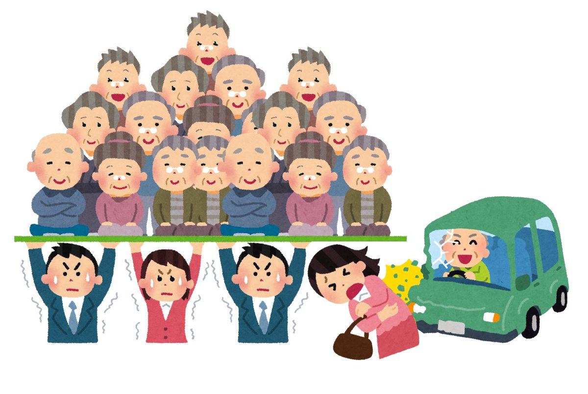

# 社会保障

　人間の人生には、病気、負傷、出産、育児、老齢、失業といった、様々な危険が内包されている。ベンチャー企業のオーナーとして肩で風を切る生活をしていた男が、車に轢かれて半身不随になるかもしれない。企業での出世に全てを賭けていた女が、ある日突然会社が倒産して無一文になるかもしれない。人は誰しも、自分ではどうしようもないところで貧困に陥る可能性を抱えている。そして、そういう事故的なものに遭わなくとも、人は必ず老いる。  
　言ってみれば、それを「自己責任」と切り捨てるのが自由主義とも言える。事故に遭うのは、遭った奴が悪い。事故に遭ってしまうような無能を蹴落とし、有能な俺が稼げるように…そういう自由もある。  
　一方で、これを自己責任とはとても言えない、という立場もある。社会権を重視し、福祉国家を目指すような人というのは、この手の立場になる。そしてこれには、人道主義的な意味だけでなく、功利主義的な、一種の損得勘定的な側面もある。  
　例えば失業は自己責任だとして、そのままほっぽらかしておいたら、その失業者はホームレスになって二度と労働者として復帰できなくなる可能性がある。また、ホームレスまで行かなくても、「食っていく」為に暴力団やマフィアのような集団に入ってしまう可能性もある。これは治安の面でもよろしくないし、何より、ただ「一度失業した」というだけで、その人を労働力として二度と扱えなくなるのは、その社会の損失である。社会が、国家が成長していくにはやはり、労働者に働いて貰わねば。となれば、失業者が再起できるような仕組みが必要である。失業してもしばらくの間生活を保障してやるとか、次の会社の就職を世話してやるとか。この辺の労働力に対する考え方は、受刑者に対する更生主義とも近いものがある。  
　出産育児だって同じである。現代の日本では、子供を産んでから大学卒業まで育てるとして、全て国公立に進学しても二千五百万円。全て私立なら四千万円ぐらいかかる。かつての「年収五百万は負け組」時代ならともかく、年収五百万あれば御の字で大体の人は三百万前後で四苦八苦してる今の状況で、「子供作りたくて作ったんだろ、お前ら親が全部やれや」とやれば、出生率は下がって当然である。そして、子供の生まれない国は亡ぶ。  
　故に、人の人生に潜む危険を「自己責任」で切り捨てず、貧困に陥りそうな人、もしくは貧困に陥った人を救ってやった方が、その国はうまく回る。治安面でも、政治面でも、経済面でも。国民の貧困の予防、及び貧困の救済を国が行う事を、【社会保障】という。今回はこの社会保障について見ていこう。  
  
  
## ●整理  
・社会保障は、主に以下の四種類から成る  
・【社会保険】：国が【保険料】を集め、これを元手に、問題が起こった者にカネを支給する  
⇒具体例としては医療保険、雇用保険、年金等々。尚、「誰でも入れる保険料の安い保険」を実現するべく、【公費】も一部使われている  
・【公衆衛生】：上下水道の整備や、保健所の設置等。費用の元手は、ものによって変わる  
・【公的扶助】：貧困者に対する支援を行う。費用は【公費】で賄われる  
・【社会福祉】：貧困者に限らず、社会的弱者に対する支援を行う。費用は【公費】で賄われる  
  
  
## ●欧米の社会保障の流れ  
・貧民を救済しようという動き自体は、どの国でも昔から、何らかの形であった  
・日本にも、江戸時代には無宿養育所や加役方人足寄場があった  
・ただ、現代日本の社会保障は欧米のものを範に採る  
・なのでまずは、欧米の社会保障がどのような流れに沿って出てきて、そして発展したかを確認する  
  
・欧米では、中世以来、弱者救済は国ではなくキリスト教会が行うものだった  
・国として、初めて［公的扶助］を行ったとされるのが［イングランド王国（イギリス）］である  
⇒1601年の、いわゆる［エリザベス救貧法］  
・とは言え中近世は基本的に弱肉強食、自力救済の世界なので社会保障の整備は遅々として進まなかった  
⇒特に中世は国家の統治機構が貧弱というのも大きい。「権利を侵害された」「誇りを傷つけられた」となれば自分の武力を以って復讐を行う権利が、中世の自由民には合法的に認められていた  
・また単純に、中近世は機械がないので、奴隷がいなければ経済が成り立たなかったというのも大きい  
⇒当然ながら、奴隷がいるような社会では社会保障という話にはなかなかならない  
  
・社会保障に向けた動きが本格化するのは、やはり革命の時代に資本主義が発達してから  
・この時代に産業革命も起こり、奴隷労働を機械で代替できるようになって社会に余裕が生まれた  
・同時に労働者も待遇改善を求め、チャーチスト運動等を起こすようになっていく  
・そして、社会主義という考え方も誕生してくる  
  
・既に見たように、ソ連崩壊までは各国政府も単純に「庶民を守ろう」とは言いづらい  
・何せ社会主義という「金持ちを殺しましょう」教が、庶民の味方みたいな顔をして跋扈しているのである  
・この状況で、社会保障を大きく前進させたのが、プロイセン王国及びドイツ帝国だった  
⇒ドイツ帝国は、以前触れた理性王国プロイセンを中心に統一されて誕生した国である。即ち、「理性的である」「合理的である」事を至上命題にし、「圧政は合理的ではないからしない」「人権を保護するのは理性的行為だから、国家が法を制定して人権を守る」というような発想の国である  
  
・労働者の弾圧は理性的ではないが、さりとて社会主義革命も合理的とは言い難い  
・結果、［社会保険］という現代の社会保障の大黒柱を創出しながら、一方では社会主義弾圧政策を行った  
⇒実は、現代の社会保障の中心は社会保険である。そして、この社会保険は、理性王国プロイセンの血を受け継ぐドイツ帝国で初めて出現した。これを主導したのは、ドイツ統一期～ドイツ帝国初期の宰相として活動した“鉄血宰相”［ビスマルク］であり、この政策は［飴と鞭］政策と呼ばれた。大体十九世紀後半ぐらい、日本は開国したがまだ日清戦争はしてない、ぐらい頃の話である  
※ちなみに、一方では庶民を保護し、一方では「金持ちを殺しましょう」教を弾圧するという飴と鞭政策は、大日本帝国が【普通選挙法】と【治安維持法】を同時に制定したのと似たような方策と言える  
  
・続いて、世界恐慌後の米国の【ニューディール政策】政策にて、［社会保障］関係の法律が制定された  
・実は、社会保障という言葉は、この時初めて作られた  
※ただ何せ米国での話なので、いわゆる社会保障が完備された法律ではない。社会保険、公衆衛生、公的扶助、社会福祉といった「いわゆる社会保障」が完備された社会保障法が初めてできたのは、1938年のニュージーランドである  
  
・第二次世界大戦期から戦後にかけて、福祉国家路線を大々的に実行したのがイギリスである  
・これは、労働党が力を持ったのが大きい  
⇒労働党は現代イギリスの二大政党の一つ、労働者の味方党。もう一つが保守党  
※イギリス労働党は、第二次世界大戦前にも政権を取った事があるのだが、世界恐慌の真っ最中だったり、一年も政権が持たなかったり、内輪揉めしたりでその時はあんまり成果がなかった  
・第二次世界大戦中、イギリスは挙国一致内閣を組んだ  
※今は政策論争とかやめて、全国民・全政党一丸となって頑張りましょう内閣。「大日本帝国かな？」「全体主義じゃん」と思うかもしれないが、自由主義国家でも災害とか戦争とかなるとこうなるのが普通。と言うか、これに関しては災害とか戦争でも足の引っ張り合いしてる率が妙に高い日本がおかしい  
・労働党が政権に参画する中で、イギリスのこれからの社会保障を考える委員会が設立される  
・この委員会が1942年に出した報告書が、世に名高い【ビバリッジ（ベヴァリッジ）報告】である  
⇒国家が国民に対し、最低限度の生活を保障するという【ナショナル・ミニマム】の概念を取り入れて作成された  
・そして戦後の総選挙では労働党が勝利  
・戦後イギリスは、ビバリッジ報告に基づいた国家を目指す事になる  
⇒【ゆりかごから墓場まで】と言われる、国が国民を手厚く保護する【社会権】重視の【福祉国家】へ向かった  
  
・戦後の西側国家は、基本的にどの国も福祉国家へ向かった  
※例外は、自由権が大好きで社会保障とか大っ嫌いな米国ぐらい  
・しかし、1980年代以降の【新自由主義】の採用以降、風向きが変わる  
⇒新自由主義の採用は即ち小さな政府路線の採用であり、小さな政府に向かうに必要なのは「減税」「無駄な支出の削減」であった。そして、社会的弱者を守る社会保障費は「無駄な支出」と見做された。新自由主義は「有能な俺にカネを払え」「無能にカネを払うな」なので、「いざという時に備えてカネを貯蓄していない無能にカネを払うな」となるのは当然と言えば当然だった  
  
・一応、社会保障を削減する一方という訳でもなく、社会保障を拡充・改変しようという動きもなくはない  
例１：イギリスのブレア政権（在任1997年～2007年）による社会保障改革  
例２：米国のオバマ政権（在任2009年～2017年）による社会保障改革  
⇒ただ、どうだったかと言えばうまくいったとは言い難い。ブレア政権末期には選挙で大敗が続いたが、これは社会保障政策の失敗も要因として大きく、英労働党は、令和二年現在もこの時のダメージから回復しきれていない。一方オバマ政権は、医療保険と言えば金持ち向けぐらいしかない米国に、「庶民でも、国民であれば皆医療保険に入れる」［オバマケア］政策を推進したが、保険会社の圧力に屈して「庶民の医療費負担が増える」とかいうウルトラＣを決め、2016年大統領選挙で民主党候補ヒラリー落選の素地を作った。この時共和党候補として当選したのがトランプである  
  
  
  
## ●日本の社会保障  
### ○概説  
・開国後の日本の社会保障法としては、［恤救規則（じゅっきゅうきそく）］がある  
・これは、極貧者救済を目的とした［公的扶助］法であった  
⇒明治政府は、これ以前から貧者救済政策をやってはいた。ただ地方によってやり方が異なるとかがあったので、先行の貧者救済政策をまとめ、初めて統一的な法令の形としたのが恤救規則だった。少なくとも開国後、日本初の公的扶助法である  
・この恤救規則は1929年に救護法となり、戦後になると生活保護法へ受け継がれる  
・また、1922年には社会保険の中でも医療保険に属する、健康保険法が作られている  
・一方、社会保険の中でも年金は、1941年には労働者年金保険法ができている  
⇒軍人を含む官僚の年金は明治の頃からあったが、国民一般向けに拡充され始めたのはこの頃  
  
・このように、大日本帝国も徐々にではあるが、社会保障の拡充を行ってはいた  
・とは言え、日本の社会保障が一気に充実するのは、やはり日本国憲法制定が契機である  
・日本国憲法制定と同時並行で、次々と社会保障関係の法律が制定されていく  
・現代日本の社会保障の原型は、基本的に終戦直後に出来上がったと言ってよい  
  
・その後、日本は朝鮮戦争による特需で経済を復活させ、高度経済成長期に突入する  
・高度経済成長期が終わった直後に1973年から、社会保障により一層力を入れようという風潮が出てくる  
⇒現代でよくみられる「経済成長より○○」みたいなのの先駆け。と言ってもこの頃は「経済成長よりも、格差是正して皆で豊かになろう」だったので特に問題はない。現代の自己啓発本でよく見られるような「経済成長より清貧」とか言い始めたらもう何がしたいのか意味不明だが。貧乏になると人は死ぬんですよ  
・ともあれこの頃に、老人の医療費無料化等が行われ、より一層福祉国家度を増した  
  
・風向きが変わるのは、やはり1980年代  
・日本でもこの頃から、社会保障費は「不要な支出」と見做され始める  
⇒例えば、1983年に【老人保健法】が制定され、老人の医療費は再び有料となった  
・バブル崩壊以後の不況で、この傾向は加速している  
  
・ただ、だからと言って日本の社会保障費は減っていない。その総額は、年々増え続けている  
⇒ちょくちょく社会保障の給付額は減らされているのだが、単純に高齢者が増え続けて若者（つまり税とか保険料を納める現役労働者）が増え続けているので、結果として社会保障費も増え続けている  
・但し、ＧＤＰ比の社会保障給付額で言うと、先進国の中ではかなり低い  
⇒低いから日本の社会保障はクソ、高い国の社会保障は優秀、という話でもない。実を言えば、米国の社会保障給付額はＧＤＰ比で日本よりも高いのだが、じゃあ米国の社会保障はどうですかと言われるとガバガバである。盲腸の手術に二百万とか普通にかかるので、貧乏人どころか普通の人でも、ちょっとでかい病気にかかっただけで人生が終わる世界である。「高負担高福祉」「福祉先進国」とされる北欧でも、例えばスウェーデン王国には寝たきり老人がいない。寝たきりになった時点で治療を受けられなくなって死ぬからである。そう考えると現代日本の場合は「額の割によくやってる」とは言えるだろう  
  
・さて、ここから先は日本の社会保障について細かく見るが、現代日本の社会保障は社会保険が主力である  
※他国でもだいたい主力だが、日本の場合は特に主力。2016年度の社会保障の給付額を見ると、社会保険の一種「年金」だけで、総額の46.5%である  
・なのでまずは社会保険を見て、それから他の社会保障も見ていこう  
  
※参考：社会保障の整理をもう一回  
・【社会保険】：国が【保険料】を集め、これを元手に、問題が起こった者にカネを支給する  
⇒「誰でも入れる保険料の安い保険」を実現するべく、【公費】も一部使われている。具体例としては医療保険、雇用保険、年金等々  
・【公衆衛生】：上下水道の整備や、保健所の設置等。費用の元手は、ものによって変わる  
・【公的扶助】：貧困者に対する支援を行う。費用は【公費】で賄われる  
・【社会福祉】：貧困者に限らず、社会的弱者に対する支援を行う。費用は【公費】で賄われる  
  
### ○社会保険概説  
・一般に、保険というのは、保険料を支払っておいて、いざという時にカネを給付して貰うものである  
⇒つまり、ある集団が共同でカネを出し合い、そのカネを備蓄する。そしてその集団の内誰かが事故にあった、とかでカネが必要になれば、備蓄したカネを給付して救済する  
・社会保険は国がやっているものだが、保険なので、国民は保険料を支払う必要がある  
・一方で、社会保険は保険料だけでなく、【公費】（国のカネ）も投入されている  
⇒民間の保険のように、保険料だけで社会保険を運営しようとすると、社会保険料が高くなりすぎる。そこで、国が補助している。これによって「安い保険料で」「誰でも社会保険に入れて」「いざという時には給付が受けられる」という構図になる  
  
・社会保険と一口に言っても、色んな種類がある。日本の場合は以下の五つ  
１：【雇用保険】：失業した時とかに給付金が貰える保険  
２：【医療保険】：医者にかかる時、給付金が貰える保険  
３：【年金保険】：高齢者になった時、及び障害者になった時に給付金が貰える保険  
４：［労働災害補償保険］：仕事関係で被害に遭った時、給付金が貰える保険  
５：【介護保険】：介護が必要になった時、給付金が貰える保険  
  
・それぞれ個別に見ていく  
  
  
### ○雇用保険  
・主に、労働者が［失業］した時、給付金を受けられる保険  
⇒失業以外だと、育児休業とかでも給付を受けられる  
・元々は1947年に制定された［失業保険］法が根拠  
・1974年になると、［雇用保険］法に発展した  
  
・雇用保険の保険料は、事業主（会社）と労働者で折半になる  
・雇用保険に入れる労働者を雇っている企業は、必ず雇用保険に入らなければならない  
・特に正社員の場合、「会社都合」退職か「自己都合」退職かで給付を受けられる期間が違うので注意！  
⇒会社都合退職の方が長く給付を受けられる。クビなのに、退職届に「一身上の都合」とか書くと自己都合退職になるから絶対に書かないように！　また、クビなのに会社から送られてきた離職票に「自己都合」と書いてあったら弁護士に相談するのが一番手っ取り早い  
・非正規雇用の場合、基本的には週に二十時間働いていると、雇用保険に入れないといけない  
⇒ちなみに学校の非常勤講師が、必ずと言っていいほど週に二十時間未満しか授業していないのはこれも理由である。二十時間越えると保険に入れないといけなくなる。という訳で私も学校で雇用保険に入れてもらった事はないです  
※非正規雇用という事はつまり、アルバイトも対象。アルバイトでもバリバリ働く人はきっちり会社に確認する事！　雇用保険に入った事は「雇用保険資格取得等確認通知書（被保険者通知用）」で確認できるので、ちゃんと貰いましょう  
  
  
  
### ○医療保険  
・現代日本は、割と世界でも珍しい、「いつでも」「どこでも」「誰でも」医療にかかれる国である  
・保険証さえ提示すれば、いつでもどこでも誰でも、低額で適切な治療を受ける事ができる  
⇒一般的には、治療費の［三割］しか払わなくていい。高齢者だと一割だったり、小学生未満は二割だったりとかの変化はある  
・また、治療費が高額になる場合、一定以上は支払わなくていいという制度まである  
⇒いわゆる高額療養費制度。月あたりの医療費（病院及び薬局で支払った額）が一定額（人によって違う。計算式はググれば出てくる）を越えた場合、公的機関に申請すれば後からカネを給付してくれる制度。給付までは時間がかかるので、一時的にカネを無利子で貸してくれる高額医療費貸付制度というのもある。入院とかあったら必ず利用しましょう！  
  
・この日本の医療保険、どんな働き方をしているかで入る保険が違う。保険料もそれぞれで違う  
・一般的な、民間の正社員は健康保険  
※週に二十時間働いてるとか、労使で合意があるとかがあれば、非正規雇用でも入れる  
・船員として働いてる人は船員保険  
・国家公務員、地方公務員、私学の教職員は、各種共済  
⇒例えば私学の教職員なら私学共済というのがある。一応非正規雇用でも入れるが、二十時間以上働いていないと入れないので、私は入れた事がありません  
・上記以外の人は、基本的に国民健康保険に入る  
⇒元々経営者とか向けなので、保険料は結構高め。ただ非正規雇用者もここに入るので、そこが厳しい  
※七十五歳以上の人、六十五歳から七十四歳で一定の障害があると認定された人は、［後期高齢者］医療制度というのを使う  
※また、子供や専業主婦のような「何らかの形での労働者ではなく誰かに養われている」という場合は、養ってくれている人の保険に「扶養家族」という形で入る。お母さんが専業主婦、お父さんは船員、という家の高校生なら、普通は船員保険の扶養家族という形で医療保険に加入している  
  
|                                    |                                    |  
|------------------------------------|------------------------------------|  
|医療保険まとめ                      |                                    |  
|民間の正社員                        |健康保険                            |  
|船員                                |船員保険                            |  
|国家公務員、地方公務員、私学の教職員|各種共済（私学の教職員なら私学共済）|  
|上記以外の人（経営者、フリーター等）|国民健康保険                        |  
  
  
  
・上記の医療保険の中では、後期高齢者医療制度以外だと【国民健康保険】の成立が一番遅い  
・国民健康保険の成立は1958年  
・何で遅いかと言うと、この保険は基本的に経営者が対象なのである  
・そして経営者は基本的に金持ちなので必要性が薄く、作られるのも遅かった。  
⇒国民健康保険はフリーターも対象だが、この頃、フリーターというのはほぼ存在しなかった。当時は、働くなら正社員になるのが当然で、アルバイトとかパートとかは「小遣い稼ぎ」だった  
・国民健康保険の成立により、全国民が医療保険に加入する【国民皆保険】制度が成立した  
  
### ○年金保険  
・年金とは、「老齢」「障害」「遺族」「退役軍人」等の理由により、毎年一定額の金銭を給付するもの  
・保険料が必要なものと必要ないものがあるが、日本の場合は保険料が必要  
⇒保険料を払っていなければ、年金も受け取れない  
  
・現代日本の年金制度は、以下のような特徴を持っている  
１：【国民皆年金】：国民全員が何らかの形で年金保険へ加入する  
２：社会保険：保険料が必要。保険料を支払っていない場合は年金の支給も受けられない  
３：老齢、障害、遺族年金：この三つの理由によって、年金が支給される  
⇒具体的な条件は、老齢は六十五歳到達。障害は二級以上の精神・身体障害。遺族は、死んだ者によって養われていた子のある配偶者、及び子。これを条件として、年金が支給される  
４：複数の年金保険：年金保険が複数あり、人によって入る保険が異なる  
⇒国が用意する年金保険が、複数ある。勿論、民間の保険会社が作った年金保険もある  
５：賦課方式：基本的には、現役世代が払った保険料と国のカネで年金を給付する  
⇒かつては積立方式だった。今は、積立方式要素もゼロではないが、基本は賦課方式  
  
・日本の年金は種類が多く分かりづらいが、よく［二階建て］と言われる  
・三階建てと言われる事もある。概念図を次に示す  
  
|                      |                                                        |                                        |  
|----------------------|--------------------------------------------------------|----------------------------------------|  
|三階建て年金制度概念図|                                                        |                                        |  
|                      |民間の正社員、船員、国家公務員、地方公務員、私学の教職員|←に該当しない者（経営者、フリーター等）|  
|三階部分              |各種企業年金（任意）各種民間年金（任意）                |各種民間年金（任意）                    |  
|二階部分              |厚生年金（義務）                                        |国民年金基金（任意）                    |  
|一階部分              |国民年金（義務）                                        |                                        |  
  
  
・全ての二十歳以上の国民は、【国民年金】に加入する  
⇒全ての国民が加入する年金保険なので、【基礎年金】とも呼ばれる。1985年にこの形へ改正された  
  
・また二階部分として、民間企業の正社員等は【厚生年金】に加入する  
⇒該当者は、民間の正社員、船員、国家公務員、地方公務員、私学の教職員。つまり、医療保険で国民健康保険以外のどれかに入れる人達  
※非正規雇用でも、厚生年金に入れる範囲は増えている。非正規雇用になる場合は要google検索  
※1985年から2015年までは、国家公務員、地方公務員、私学の教職員を対象にした【共済年金】というのがあった。2015年から、厚生年金に統合された  
  
・一方、二階部分として、経営者やフリーター向けに［国民年金基金］が用意されている  
⇒国民年金や厚生年金と違い、加入は任意。導入は1991年  
  
・三階部分としては、各種の企業年金と、民間保険会社が用意する民間の年金がある  
⇒企業年金は、企業が任意で加入。民間の年金は個人が任意で加入する  
  
|        |                                                                                                      |  
|--------|------------------------------------------------------------------------------------------------------|  
|年金年表|                                                                                                      |  
|終戦直後|この時点で、船員年金や共済年金といった、労働者向け年金が存在した                                      |  
|1959年  |国民年金法制定。これまで年金がなかった、経営者にも年金制度ができた。これによって、国民皆年金が確立する|  
|1961年  |国民年金法施行（国民皆年金の実施）                                                                    |  
|1985年  |国民年金法改正。基礎年金と厚生年金・共済年金の二階建てに                                              |  
|1986年  |改正国民年金法施行。二階建ての年金制度が実施される                                                    |  
|1991年  |経営者やフリーター等、厚生年金・共済年金という二階に入れない人向けに、国民年金基金設置                |  
|2015年  |共済年金が厚生年金に統合される                                                                        |  
  
※こういう流れなので、1985年の改正には、「多数あった公的年金の一元化・再編」という目的もある  
  
・また、日本の公的年金は元々［積立］方式だったが、現在は事実上、［賦課］方式に移行している  
⇒最初は積立方式。その後［修正積立］方式と言われるようになり、今は【修正賦課】方式と言われている  
・積立方式は、保険料として本人が払ったカネを貯めておいて、受給できるようになったら給付する方式  
⇒ただ貯めるだけでなく、本人が払った保険料を［運用］（投資とか）して増やし、これを財源とする場合もある。かつての日本年金はこれで、［財政投融資］で増やそうとしてた。一方、健全な経済成長が続いている場合、［インフレ］が続いている（つまりカネの価値が落ちている）為、年金として充分なカネを用意できない場合も多い  
・賦課方式は、今年給付するカネを、今年集まった保険料で賄う方式  
⇒今の日本はこれ。つまり、今年金を受け取っている人は、「かつて自分が支払ったカネ」ではなく、「現役で働いて保険料を支払っている人のカネ」を受け取っている  
※公的年金は社会保険なので、国のカネ（国庫、公費）も財源である。なのでより正確には、「現役で働いて保険料を支払っている人のカネ」と「国のカネ」を受け取っている事になる。国のカネがなければ、誰でも入れるような保険料の安い年金保険にならない  
※積立方式か賦課方式かという話は社会保険全体に言える話ですが、ほぼ年金関係でしか出てこないのでここで紹介しました  
  
・詳しくは後でやるが、先進国の例に漏れず、日本も高齢化が進行している  
・つまり、年金を受け取る老齢人口が増え、保険料を支払う現役で働く人口が減っている  
・そして、現代日本の公的年金は、基本的に賦課方式である  
⇒つまり、給付しなければならない年金は増える一方で、集まる保険料は減る一方。賦課公式は、このように［人口構造］の影響を受けやすい  
  
  
・そういう訳で、「このままでは年金制度はヤバイ」とマスコミが危機感を煽りまくった  
・更に、1980年代の新自由主義以降、社会保障を「不要なコスト」と見做す傾向が出てきた  
・そして、高齢化社会により、老齢人口が増えた  
⇒この三つが悪魔合体して、えらい事になっている。つまり、若者から見ると、「このままでは年金制度はヤバイ」らしい。そもそも社会保障は「不要なコスト」だし、その内削減されて、俺達が定年を迎える頃には、ロクな年金は貰えないだろう。一方で、今は高齢化社会で老齢人口が多い。老齢人口が多いという事はつまり、選挙で高齢者に優しい政治家ばかり当選するだろう。結局、今の年寄りは、逃げ切って、俺達は散々年金の保険料支払わされたのに、いざ自分が高齢者になってもロクなカネを貰えないだろう…  
  
・こういう事情で、現役世代、特に若い世代の年金［未加入］者、保険料［未納］者が増えている  
⇒保険料を納めていなければ、いざ障害を負った時や高齢者になった時年金を貰えないのだが、「どうせ俺達はまともな年金なんか貰えない」と思っているので、まぁ納めませんよねという。今や年金未加入者・未納者は［四割］に達しており、国民年金の財源も、公費が［二分の一］になってしまった（元は三分の一だった）  
※こういう世代間対立は、現在深刻化しつつある。と言うか、深刻化しつつあるからこそ、↓のような絵がツイッターでバズるのである  
  
  
出典：https://togetter.com/li/1339882　令和二年九月七日閲覧  
  
  
・本来なら、政府が「大丈夫です！　我々はこの年金制度をきちんと維持します！」とか言う必要がある  
・もっと言えば、高齢化社会になっているのが根本問題なので、少子化対策をきちんとやらないといけない  
・が、政府は少子化対策をまるでやってこなかった  
⇒どころか、金融庁は「老後は二千万貯蓄してないときついぜ」とか言い出すし、令和二年の自民党総裁選では「自助共助公助」（基本は自助努力、自助努力で駄目なら助け合い。それでも駄目なら公共が手を貸す。つまり、「国は積極的に国民を助けようとはしませんよ」という宣言）とか言い出す始末である。そりゃ年金未納問題なんて絶対に解決せんわ、という奴  
  
～ところで偉そうに言ってるけどどうしたらいいと思うんですか～  
　選挙は白紙委任状ではないので、自分の選挙区の政治家に、電話やら投書やらで常に圧力をかけ続ける。時と場所を問わず、新自由主義的な自己責任の風潮は批判する。…それぐらいしかないんじゃないですかね…  
～悲しいなぁ～  
  
### ○労災保険  
・何らかの形で仕事が関係した傷病について、金銭の給付を行うのが［労災保険］である  
⇒正式には［労働者災害補償保険］  
  
・基本的には、金銭が給付されるのは二種類。業務災害と通勤災害  
・業務災害は、労働中の傷病  
⇒屋根工事の会社で働いていて、屋根工事中屋根から落っこちた、とか。過労死や激務による自殺にも、労災が適用されて保険金が支払われる場合がある  
・通勤災害は、通勤中の傷病  
⇒通勤に使っていた電車が脱線して怪我した、とか  
  
・［使用者（雇用主）］が入るもので、保険料もすべて［使用者（雇用主）］が支払う  
・一人でも労働者を雇っている使用者は、原則、必ず労災保険に入らねばならない  
⇒例外事項は非常に少ない。それこそ、健康保険や厚生年金にも入れない私みたいな短時間労働者（フリーターともいう）（アルバイトってつらいですね）であっても、労災保険は適用される  
・また、労働災害発生時に於ける保険金給付の申請とかも、使用者が行う  
  
※労災、つまり労働災害は、（通勤中の事故とかもうこれどうしようもないだろみたいなものはともかくとして）本来であれば発生してはならないものである。その為、労働災害が起きた後、会社が適切な対応をしたとしても、会社には相応のペナルティがある。だからこそ、容易には労働災害を認めようとせず、個人の責任であって会社は関係ないという態度をとろうとする企業は後を絶たない。退職後であろうが、会社が保険料支払っていなかろうが、手続きを踏めばちゃんと労災の適用は受けられるので、「会社の仕事が原因で怪我したor病気になったのに会社が何もしてくれん」という時は労働問題に強い弁護士へ  
  
### ○介護保険  
・日本人は思ったより長生きするようになった  
・割と本気で「人生百年」だと思ってないと酷い目に遭いかねない、そんな長生き時代である  
・そうなると当然、誰であっても介護を受ける可能性を考えねばならない  
・じゃあ、社会保険として【介護保険】も必要ですよね？　という話になる  
⇒できたのは割と最近で、2000年  
  
・［四十歳］以上の全国民が対象。四十歳以上になると保険料を支払う事になる  
・運営主体は［市町村］なので、保険料を徴収するのも［市町村］である  
⇒ちなみに、介護保険の保険料支払いの財源は保険料が［50%］、国庫が［25%］、都道府県が［12.5%］、市町村が［12.5%］。要するに、保険料と公費で半々に分けて、公費は国と地方が半々、地方は地方で都道府県と市町村が半々  
  
・介護保険の特徴として、保険料の給付を受けるのに認定が要る、というのがある  
⇒医療保険の場合、保険証さえ持っていれば、あとは医療機関で保険証見せれば、医療費が軽減される。逆に介護保険の場合、自分で「俺介護要るわ」と思って介護施設に行っただけでは、保険証を見せようが何だろうが全額自己負担になる  
・具体的には、介護サービスを受ける前に、【要介護】認定というのを受けなければならない  
⇒申し込み先は［市町村］。判定する人が、自宅もしくは入院先に来て調査して報告書を［介護認定審査会］に上げ、この審査会が最終的な判断を下す  
  
・要介護認定によって、［自立、要支援１～２、要介護１～５］に分類される  
⇒介護保険発足当初は要支援１要支援２というのはなく、［要支援］のみだった。2005年の改正で増えた  
・自立だと、介護保険は一切使えない  
・要支援だと、訪問介護や通所リハビリ（いわゆるデイケア）とかを使う時、料金が割引になる  
・要介護だと、更に様々な介護サービスを受ける時、料金が割引になる  
⇒特に、特別養護老人ホーム（いわゆる特養、「国のカネで入れる老人ホーム」みたいな奴）は要介護３から行ける  
  
・介護保険を使って介護サービスを受ける場合、料金が割引される  
・具体的には、所得に応じて【一割】から三割が自己負担となる  
⇒言い換えれば、九割引から七割引という事  
※2005年から、食費と居住費については自己負担となった  
  
・社会保障を「不要なコスト」と見做す傾向は、介護保険にも影響を与えている  
⇒2005年の改正で要支援が増えたとか、食費と居住費が自己負担になったとかは、これの影響と言える  
  
### ○公的扶助  
※参考：社会保障の整理をもう一回  
・【社会保険】：国が【保険料】を集め、これを元手に、問題が起こった者にカネを支給する  
⇒「誰でも入れる保険料の安い保険」を実現するべく、【公費】も一部使われている。具体例としては医療保険、雇用保険、年金等々**←ついさっきまでで、個別にやった**  
・【公衆衛生】：上下水道の整備や、保健所の設置等。費用の元手は、ものによって変わる**←深くやらない**  
・【公的扶助】：貧困者に対する支援を行う。費用は【公費】で賄われる**←****これからやる**  
・【社会福祉】：貧困者に限らず、社会的弱者に対する支援を行う。費用は【公費】で賄われる  
  
・貧困等の理由により、生活に困窮している者を支援するのが公的扶助である  
・無拠出制を採り、費用は全て【公費】  
⇒保険料や税金を払っていないから公的扶助を受けられないという事はない。全ては公費（国庫）で賄われる。そもそも保険料や税金が払えないような困窮者を助けようという話であって、ここで「俺は税金払ってるのに楽しやがって」とか妬むのは発想が古代レベルである  
  
・日本の公的扶助は、【生存権】に基づく【生活保護法】によって行われる  
⇒生存権は【朝日訴訟】と［堀木訴訟］で【プログラム規定説】って奴。覚えてます？　覚えてなければ政治分野の人権のところをどうぞ  
  
・生活扶助（もしくは生活保護）は、最後の【セーフティ・ネット】とかよく言われる  
・昔は、家族・親族・地域の善意による助け合いが、困った人間の世話をしていた  
・しかし、現代はそういった助け合いが少なくなりつつある  
・と言うか、家族・親族・地域の助け合いって、そんないいもんばかりでもない  
⇒例えばお見合い結婚は、基本的には親族や地域による助け合いの一種である。恋愛結婚では結婚できない人にも、親族や地域が相手を見つけてきてくれる。しかし、この助け合いがあったからこそ、「いい歳になったんだから結婚しろ」という圧力が生まれる。何だったら、「あんな歳になっても結婚しないようなのは人格に問題があるんだ」と攻撃される事すらある。親戚からそういう事を言われたくないから実家に帰らない、という人は結構多い  
・だから、家族・親族・地域の善意による助け合いではなく、国が助けましょうという概念ができた  
・これがセーフティ・ネットと言っていい  
・それこそ、雇用保険なんかもセーフティ・ネットの一種と言っていい  
⇒失業している人（困っている人）を、国が助ける（給付金を支給する）。セーフティ・ネットとは即ち、困っている人を国が助けるという話であると考えるとよい  
・生活保護は、貧困でどうにもならなくなった人を救う、最後のセーフティ・ネットと言える  
  
  
・一般に生活保護と言うと、貧乏で生きていけない人にカネを支給するものと思われている  
・実際、ざっくりその考え方でいいのだが、生活保護ならいつでも何でもカネが出る訳ではない  
・まず、［資産活用］の原則というのがある  
⇒資産があるならそれ使ってね、という事。ここから、生活保護を受けている家族の所得の合計が生活保護基準額に届かない場合、足りない分を扶助するという［補充性］の原則が採用されている  
  
・また、生活保護は何にでもカネを出す訳ではない  
・実を言うと、生活保護法で八つの扶助項目が決まっている。この項目に応じて扶助が行われる  
⇒［生活］、教育、［住宅］、［医療］、［介護］、出産、生業、葬祭  
※例えば、貧乏で済むところがなければ住宅扶助で家を世話します、貧乏で医療も受けられないなら医療費を世話します、貧乏で葬式も出せないなら葬式の費用を世話します、みたいな感じ  
・額で言うと、［医療］扶助が一番多く、次いで［生活］扶助、［住宅］扶助となる  
  
### ○社会福祉  
・単純に福祉とか社会福祉と言ったら、「人々が幸福に生きる」為の取り組み全てである  
・だから公的扶助も社会保険も社会福祉と言えば社会福祉  
・一方社会保障の分類としては、以下のようなものを言う  
  困窮していないかもしれないが何かしらの［社会的不利（ハンディキャップ）］のある者に、各種のサービスを【公費】で提供するもの  
⇒身体障害者、精神障害者、父子家庭、母子家庭等。困窮していれば公的扶助の対象になる  
  
・代表例は児童福祉法、身体障害者福祉法、知的障碍者福祉法、老人福祉法、母子及び寡婦福祉法  
⇒上記に生活保護法を加えて、［福祉六法］と言う事もある  
  
・例えば身体障害者であれば、身体障害者福祉法に基づき、身体障害者手帳が貰える  
・手帳には等級が書いてあり、障害の程度によって等級が変わる  
・等級が高い（障害が重い）と、障害年金が貰える  
⇒精神障害者、知的障害者も根拠法とか手帳の名前が違うだけで、基本は同じ  
  
・ところで、ここまで見てきた社会保障は、人道主義だけでなく功利主義的な視点からも制度化されている  
  
～ここから引用～  
例えば失業は自己責任だとして、そのままほっぽらかしておいたら、その失業者はホームレスになって二度と労働者として復帰できなくなる可能性がある。また、ホームレスまで行かなくても、「食っていく」為に暴力団やマフィアのような集団に入ってしまう可能性もある。これは治安の面でもよろしくないし、何より、ただ「一度失業した」というだけで、その人を労働力として二度と扱えなくなるのは、その社会の損失である。社会が、国家が成長していくにはやはり、労働者に働いて貰わねば。  
～ここまで引用～  
  
・つまり、一度失業しただけでその人の労働力が失われるのは「もったいない」のである  
・同様に、障害者福祉にも「もったいない」の精神がある  
⇒即ち、「障害者だから働けないなんて「もったいない」。障害者だろうと、是非労働力として社会で活躍して貰いたい」  
  
・そういう流れでできたのが、［障害者自立支援法］  
・例えば、地域で一種の職業訓練サービスが行われているが、これはこの法律による  
⇒作業所を作ってそこに障害者が通い、作業を行う。お金もちょっと貰える。これを通して、「仕事をする」というのを学んでいく  
・また、障害者雇用促進法もこの流れの中でできている  
・この法律では、「障害者雇用」という枠で、従業員の2%程度の障害者を雇わねばならない、とされている  
⇒令和二年現在、2.2%と決められているので、従業員が千人なら二十二人雇う必要がある。実際にはもっと複雑なルールがあるのだが、ざっくりそんな感じ。尚、この比率は今後上げられていく予定  
  
・ちなみに、［障害者自立支援法］では、福祉サービス利用料は一律［一割］が自己負担、とされていた  
⇒一律って事はつまり、障害が重い（つまり利用料が高くつく）人ほど自己負担率が上がるのでは？　なんだこの［逆進性］は、消費税か、という事もあって［障害者総合支援法］へと改正された  