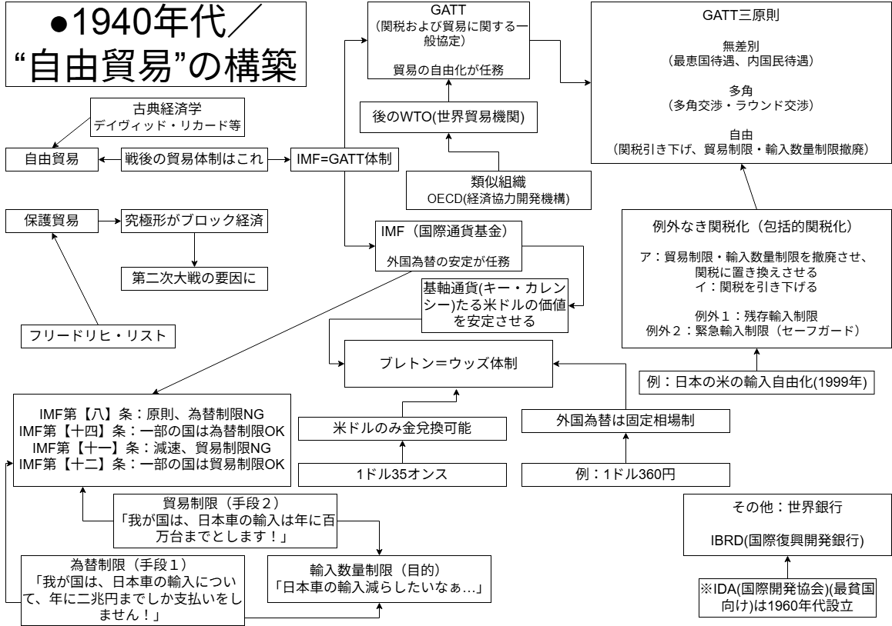
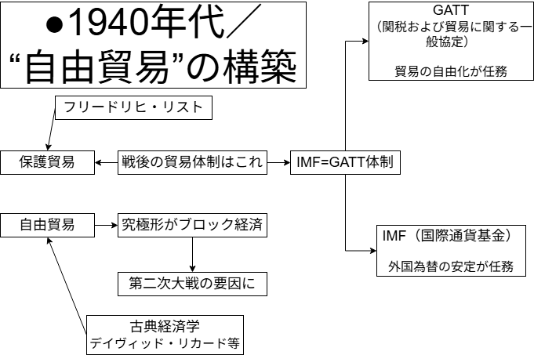
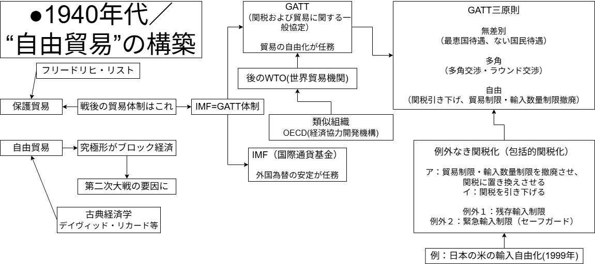
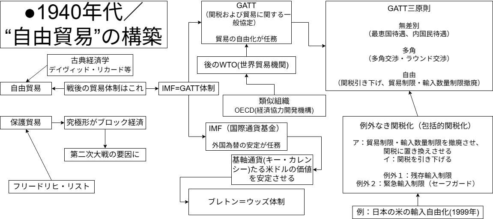
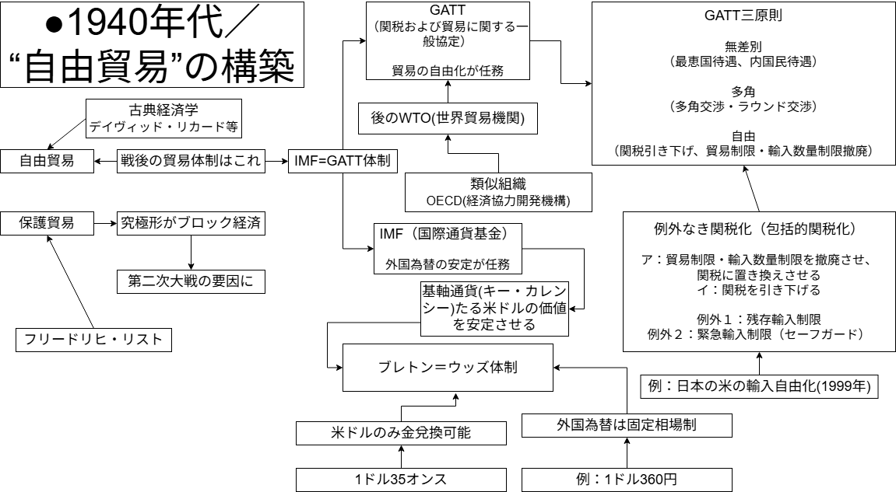
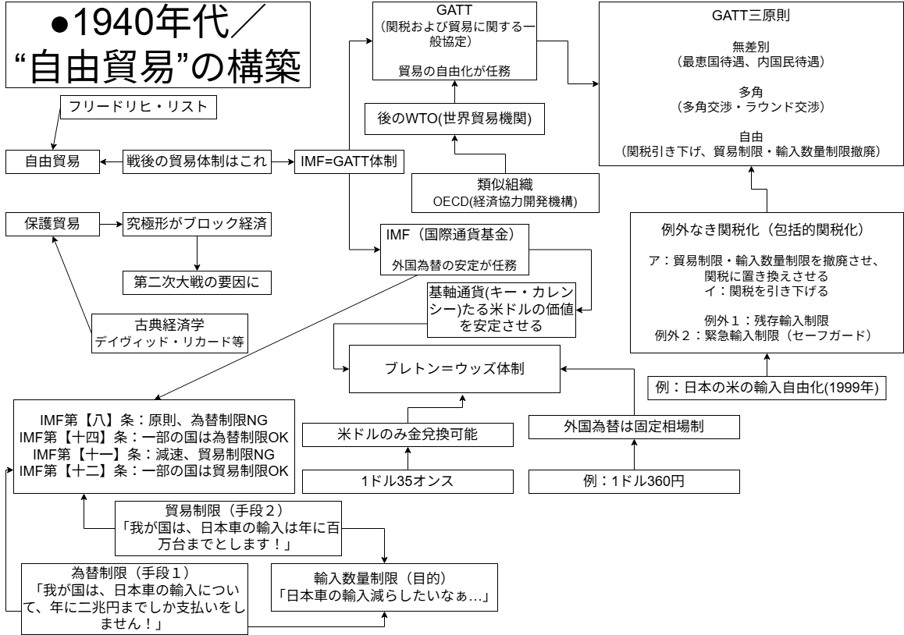
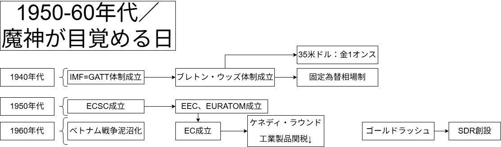
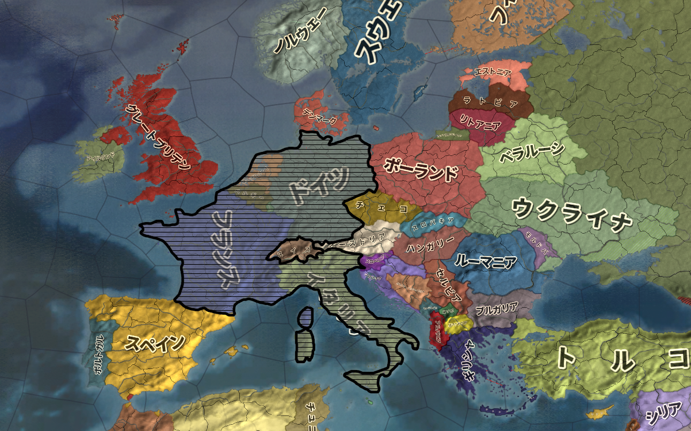
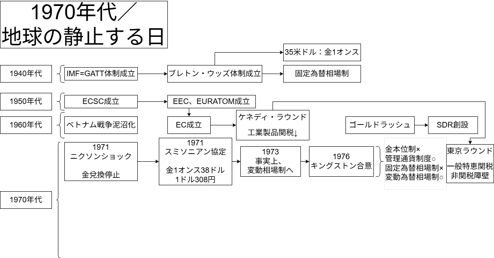
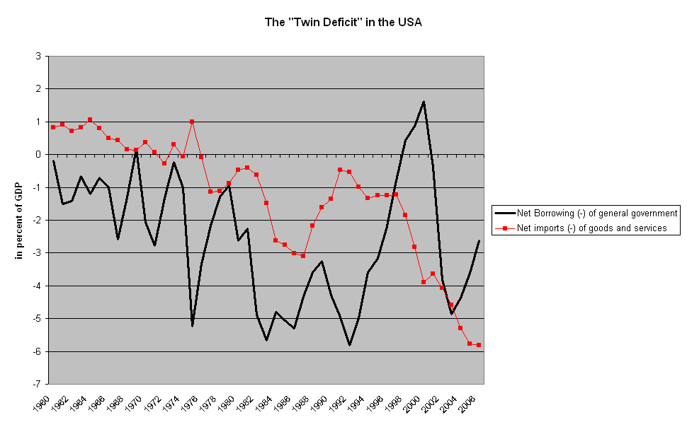

# 国際経済通史
## ●授業動画一覧＆問題集リンク

|問題集|[ウェブサイト](https://teacheramesaka.github.io/hsworkbookcivics/tag/eco02_03/)||
|:----:|:----:|:----:|
|戦後の貿易体制1|[YouTube](https://youtu.be/p1iZOlBjO0A)|[ニコニコ動画](https://www.nicovideo.jp/watch/sm40379478)|
|戦後の貿易体制2|[YouTube](https://youtu.be/URgZZ28T80E)|[ニコニコ動画](https://www.nicovideo.jp/watch/sm40379917)|
|戦後の貿易体制3|[YouTube](https://youtu.be/-2xjCkC1eCQ)|[ニコニコ動画](https://www.nicovideo.jp/watch/sm40386877)|
|1980年代までの通史1／概要|[YouTube](https://youtu.be/Z605J1xn8-E)|[ニコニコ動画](https://www.nicovideo.jp/watch/sm40387787)|
|1980年代までの通史2／為替制限|[YouTube](https://youtu.be/2Np7ktN2V_M)|[ニコニコ動画](https://www.nicovideo.jp/watch/sm40416743)|
|1980年代までの通史3／世界銀行|[YouTube](https://youtu.be/zf-M8ZlXFt0)|[ニコニコ動画](https://www.nicovideo.jp/watch/sm40416806)|
|1980年代までの通史4／米国の経済覇権の動揺|[YouTube](https://youtu.be/_mk-SyHWOi8)|[ニコニコ動画](https://www.nicovideo.jp/watch/sm40423608)|
|1980年代までの通史5／旧IMF体制の動揺と崩壊1|[YouTube](https://youtu.be/8WV2JbRqt6E)|[ニコニコ動画](https://www.nicovideo.jp/watch/sm40425442)|
|1980年代までの通史6／旧IMF体制の動揺と崩壊2|[YouTube](https://youtu.be/Bmh3BvYQUHw)|[ニコニコ動画](https://www.nicovideo.jp/watch/sm40440777)|
|1980年代までの通史7／1970年代の国際経済1|[YouTube](https://youtu.be/POXbkwRP7kg)|[ニコニコ動画](https://www.nicovideo.jp/watch/sm40442386)|
|1980年代までの通史8／1970年代の国際経済2|[YouTube](https://youtu.be/3iL-IcPPO7E)|[ニコニコ動画](https://www.nicovideo.jp/watch/sm40442429)|
|1980年代までの通史9／1970年代の国際経済3|[YouTube](https://youtu.be/aQiKX_n3d-U)|[ニコニコ動画](https://www.nicovideo.jp/watch/sm40476369)|
|1980年代までの通史10／1980年代の国際経済1|[YouTube](https://youtu.be/jumwuRvogHg)|[ニコニコ動画](https://www.nicovideo.jp/watch/sm40480306)|
|1980年代までの通史11／1980年代の国際経済2|[YouTube](https://youtu.be/SpUIK7RQBzQ)|[ニコニコ動画](https://www.nicovideo.jp/watch/sm40485058)|

## ●前説
・戦後の国際経済史は、1980年代までについては、通史として概観しやすい  
・それ以降については、テーマ史として個別に見た方がいい  
・という訳で、まず通史として扱える、1980年代までを扱う  
  
## ●1940年代／“自由貿易”の構築  
### ○資料
#### ▽「1940年代／“自由貿易”の構築」の範囲
| 年代 | 日本政治史 | 国際政治史 | 国際経済史 | 日本経済史 |
|:---:|:---:|:---:|:---:|:---:|
| 1940年代 | 終戦 | 終戦 ↓ 冷戦開幕 | IMF＝GATT体制成立 ブレトン・ウッズ体制成立 | 三大経済民主化  傾斜生産方式 ↓ 経済安定九原則 ↓ ドッジ・ライン／シャウプ勧告 |
| 1950年代 | 五十五年体制成立 | 朝鮮戦争 旧植民地独立・連帯 ↓ 「雪融け」 ↓ 東西対立再開 | ECSC・EEC・EURATOM成立 | 朝鮮特需 神武景気 ↓ 鍋底不況 ↓ 岩戸景気 |
| 1960年代 | 自民党優位 | キューバ危機 ↓ 「核戦争するぞ詐欺」 ↓ 東西両陣営内部分裂 ↓ デタント | 米国経済覇権に陰り （EC成立／ケネディ・ラウンド／SDR創設 など） | 岩戸景気 ↓ オリンピック景気 ↓ 昭和40年不況 ↓ いざなぎ景気 |
| 1970年代 | 保革伯仲 | デタント ↓ 核軍縮 ↓ ソ連アフガン侵攻 ↓ 新冷戦 | ①ブレトン・ウッズ体制崩壊 ②二度の石油危機と国際経済の構造変化 | 安定成長期へ ↓ 省エネルギー型産業への転換 ↓ 石油危機不況から世界最速級で回復 |
| 1980年代〜1991年 | 五十五年体制崩壊 | 新冷戦 ↓ ゴルバチョフ登場 ↓ マルタ会談・冷戦終結宣言 ↓ ソ連崩壊 | 新冷戦 双子の赤字・日米貿易摩擦 ↓ プラザ合意 | 日米貿易摩擦 ↓ プラザ合意 ↓ 円高不況 ↓ バブル景気 ↓ バブル崩壊開始 |
  
#### ▽「1940年代／“自由貿易”の構築」の板書完成版


**～板書ここまで～**  
  

  
※1940年代は内容が盛り沢山なので、板書の内容もかなり大量にあります。この後、↑の完成版の板書を少しずつ作っていく過程を見せていきますので、最初から完成版を読み込む必要はありません  
  
### ○概要  
※この概要は、以前勉強した内容が全部頭に入っていれば、一瞬で終わる。が、そういう人ばかりではないと思われるので…「復習」という形で、以前の学習内容を折り畳み、下の方にぶら下げてある。クリックすれば展開して読めるようになるので、適宜、確認してほしい  
  
・戦後国際経済史という観点から見ると、1940年代は、「戦後の制度を作った時代」である
⇒よって、暫くの間、1940年代にできた制度の話をしていく事になる。この「概要」では、それらの制度がどのような発想の下に作られたか、という点を確認する  
  
・貿易には主に、二つの考え方がある。【自由貿易】と［保護貿易］である  
  
※自由貿易が何か…は流石に、「何処の国が何処に何を輸出しようが自由」「ウチの国が何処から何を輸入しようが自由」という話だと分かるだろうが、「保護貿易って何だっけ」「保護貿易ってどういう必要性から出てきたんだっけ」となる人は一定数いるだろう。そういう人は、下記の「復習その１」と「復習その２」を参照しよう  
  
・そして、保護貿易の究極形とでも言えるものが、第二次世界大戦直前に実施された  
⇒【ブロック】経済である。そしてブロック経済は、第二次世界大戦の主要な要因の一つである。「あれ、そうだっけ？」となった人は、下記の「復習その３」を参照しよう  
  
・第二次世界大戦終結後、西側（米国）陣営と東側（ソ連）陣営が争う冷戦の時代が始まる  
・この内、米国率いる西側陣営については、【自由貿易】を志向している  
⇒この選択は、（少なくとも建前上は）第二次世界大戦という惨禍の反省によるものとされている  
  
・自由貿易を実現する為、第二次世界大戦終結直後に活動を始めたのが【IMF】と【GATT】である  
⇒戦後の西側の国際経済はこの二つの組織によって規定されており、故に【IMF＝GATT体制】等と呼ばれる  
  
※尚、「国際経済史」とか「戦後の国際社会」とか言った時、大抵、ソ連及び東側諸国は「国際経済」「国際社会」の中に入っていない。「国際経済」「国際社会」という言葉は大抵、アメリカ合衆国率いる西側諸国のみを指す。その為、この後も基本的には「国際経済」と言ったら西側諸国の話をしている（ソ連及び東側諸国の話はしていない）と思ってほしい  
  
※よって今後は、以下のような言い方に変わると思ってほしい  
  
>×　⇒戦後の**西側の**国際経済はこの二つの組織によって規定されており、故に【IMF＝GATT体制】等と呼ばれる  
>○　⇒戦後の国際経済はこの二つの組織によって規定されており、故に【IMF＝GATT体制】等と呼ばれる  
  
**◇ここまでの板書**  
  
  

▽アダム・スミス  
・古典派経済学でいの一番に出てくるのは、やはり【アダム・スミス】である  
⇒主著は【『国富論』】。いわゆる【「神の見えざる手」】発言の人である  
  
・彼の理論の骨子、そして古典経済学の骨子は、その楽観性によって特徴づけられる  
⇒「皆が最善の努力をすれば、社会全体が理想の形になる」、もうちょっと言えば、「頑張って働けば報われる」というプロテスタント的な考え方である  
  
・この楽観性は、【自由放任】主義や［セー（セイ）の法則］によって代表される  
  
１：【自由放任】主義  
⇒政府が何もせず（つまり【自由放任（レッセ・フェール）】）、市場の資本家が自由に競争すれば【「神の見えざる手に導かれて」】経済は発展する  
  
（中略）  
  
▽デイヴィッド・リカード  
・他にも有名な古典経済学者はいる。例えばデイヴィッド・【リカード】である  
⇒主要著書は【『経済学および課税の原理』】  
  
・リカードは【自由貿易】を擁護する【比較生産費説】を展開した  
⇒アダム・スミスの「自由競争すれば経済はよくなる」論を、世界全体に拡大したもの。世界中で自由に競争すれば経済はよくなる、だから自由貿易をしよう、という考え方  
  
（後略）  
**～復習その１終わり～**
  

  

▽フリードリヒ・リスト  
・ここでは批判者として、フリードリヒ・［リスト］を挙げたい  
⇒ドイツ南西部のヴュルテンブルク公国生まれ。主著は［『経済学の国民的体系（政治経済学の国民的体系）』］  
  
※フランス革命と同年に生まれ、革命の時代が終わる直前に死んだ経済学者。長い間小国に分裂していたドイツが統一に向かいつつも、まだ統一されていない、ぐらいの頃の人物である  
  
・彼は、古典経済学で最良の貿易として主張された、自由貿易を批判した人物である  
  
・この自由貿易、実は、いつの時代何処の地域でも、経済的に強い国は主張するものである  
⇒何故か？　まず経済的に強い国と弱い国がどう違うかから考えてみよう  
  
経済的に強い国：高品質な製品を比較的低価格で生産できる  
経済的に弱い国：同じ品質のものを作れなかったり、作れても価格が高かったりする  
※例えば令和の日本国は、高品質な自動車を安く作れる。では、車なんか作った事もない発展途上国が「うちの国でも国産自動車作るぞ！」と言って新しく工場を作ったら？　…という話である  
  
・このような違いがあるからこそ、経済的に強い国は、自由貿易をやれば一方的に儲かるのである  
⇒自由貿易とは要するに、「どの国がどの国へ輸出しても自由」である。そりゃ強い国は自由貿易を主張するに決まっている。強い国の商品は安くて高品質なのだから、輸出すればするほど売れる。そして弱い国の国産品は売れなくなり、国内の産業は死ぬ  
  
・こういう現実を受けたリストは、「最強国家以外は［保護貿易］が必要」としている  
⇒経済的に弱い国でも自由貿易が行われてしまうと、その国では国産品は売れなくなり、国内産業が死ぬ。これを防ぐには保護（高い関税をかける、輸入数量を制限する等）が必要だ、という論である  
  
※関税は、輸入品にかけるもの。これを高く設定すれば、「本来なら輸入品の方が安いのに、高い関税がかかってるせいで国産品の方が安い」という状況も作れる  
  
・ちなみに。保護貿易をする方法は主に二種類ある  
１：［関税］障壁。高い関税をかけて、輸入品の値段を上げるもの  
２：［非関税］障壁。［輸入数量］を制限したり、［入関］手続や［検疫］手続を複雑化したりする  
**～復習その２終わり～**
  

  

４：ブロック経済  
⇒第一次世界大戦以降、世界各国は活発に貿易を行っていた。ところが1929年末から、アメリカ合衆国が大不況に陥り…貿易で繋がっていた他の国々も、連鎖的に大不況へと陥った。いわゆる世界恐慌である。この結果、「やっぱ自由貿易って駄目だわ」となり、植民地を持つ国々は、自分の植民地とだけ貿易する、いわゆるブロック経済を形成した。そうなると、ドイツ国や大日本帝国に代表される、植民地を持たない（持っていても少ないか小さい）国々は「え、俺ら生きていけないじゃん」となり、「じゃあ、お前らの植民地力づくでも奪うわ。戦争になっても死ぬよりはまし」みたいな形になった  

**～復習その３終わり～**
  

  
### ○GATT  
#### ▽概要  
・GATTの正式名称は【関税および貿易に関する一般協定】である  
⇒名前の通り、本来は【貿易の自由化】を目的とした国際条約である。しかし、GATTの締約国は、現代の【WTO（世界貿易機関）】の先駆としての活動をしていた  
  
※実際、GATTはWTOの発足（1995年）に合わせて解消（消滅）している  
  
#### ▽GATT三原則概要  
・具体的にどんな活動をしていたかと言うと…GATT三原則に即して交渉を行っていた  
⇒という訳で先にGATT三原則を見よう。GATTは、現代のWTOと同じく三つの原則を掲げている  
１：［無差別］　　２：［多角］　　３：【自由】  
  
#### ▽無差別の原則  
・GATT三原則の「無差別」とは、要するに無差別の［最恵国待遇］である  
⇒即ち、GATT／WTO加盟国がある加盟国に対して与えた有利な貿易条件は、全加盟国に与えたものと見做すものである  
  
・また、無差別の［内国民待遇］も認められる  
⇒これは、「GATT／WTO加盟国から輸入して国内に入った商品は、国内の商品と同等に扱う」というものである。だから例えば「輸入品は消費税二倍」みたいな法律は、少なくともGATT／WTO加盟国の商品に対しては作れない  
  
#### ▽多角の原則  
・GATT三原則の「多角」とは、貿易上の問題は［多角交渉］によって解決する、というものである  
⇒この多角交渉を［ラウンド交渉］とも呼ぶ。その為、GATT／WTOによる交渉は、「△△・ラウンド」と呼ばれる。例えばウルグアイで行われた交渉は、ウルグアイ・ラウンドと呼んでいる  
  
※このラウンド交渉は、1940年代後半から令和八年現在まで何度も行われている。その具体的な一覧と内容については、後の「国際経済テーマ史」で扱うので、今は「へ～そうなんだ～…」ぐらいに留めておいてよい  
  
#### ▽自由の原則  
・GATT三原則の「自由」とは無論、「自由貿易の推進」だが、「完全に自由」という意味でもない  
⇒即ち、「自由な商売を実現しましょう！」という形で交渉をするのだが、「貿易に関し、一切の規制は存在してはならない！」というような話でもない  
  
※GATTができた時点でも、各国には、貿易に関する規制が色々と存在していた。そういった規制を、できるだけ透明で予測可能な方法に統一し、段階的に自由化していこう、という考え方である  
  
・具体的には、【例外なき関税化（包括的関税化）】と呼ばれる形で貿易自由化が行われてきた  
  
ア：【貿易制限（輸入数量制限）】を撤廃させ、【関税】に置き換えさせる  
イ：【関税】を引き下げる  
⇒貿易制限（輸入数量制限）は、「この商品は△△個までしか輸入しない」というような制度である  
  
・つまり、GATT／WTOは【関税】の存在そのものは認めている訳である  
⇒逆に言えば、GATT／WTOは【貿易制限（輸入数量制限）】を認めていない。何なら、GATT／WTOの規則で禁止している  
  
・が、世の中いつも規則通りに回る訳ではない  
⇒即ち、「GATT／WTOに参加しているが、貿易制限（輸入数量制限）をやり続けている」という国は、GATT発足以来存在し続けている  
  
・この、「GATT／WTOに参加しているが、貿易制限をやり続けている」には、二種類ある  
  
１：［緊急輸入制限（セーフガード）］：GATT／WTOの規則の規則で例外的に認められているもの  
⇒ある商品の輸入が急増し、国内の産業が壊滅しそうになった…というような時に、緊急特別の措置として認められるものである  
  
２：［残存輸入制限］：本来GATT／WTOの規則には違反しているもの  
⇒違反なのだが、「これは自由貿易とは別枠、別枠です！」と言い張って輸入制限を続けているものである。GATT／WTOの活動の継続に伴って、徐々に減っている  
  
残存輸入制限の例：第二次世界大戦直後の混乱期以降、日本国が長年【米】を輸入しないようにしていたのは、典型的な残存輸入制限である。ウルグアイ・ラウンドで「残存輸入制限だろこれ！」と詰められまくった結果、1999年以降、米の輸入は自由化された
  
### ○GATT／WTOに類似の組織  
・GATT／WTOに類似の組織として、【OECD（経済協力開発機構）】というものがある  
  
・OECDの特徴としては、以下の通りである  
  
１：基本的には先進国が参加している  
⇒故に「先進国クラブ」等と呼ばれる。「先進国って何？」「OCEDに入ってる国」なんて会話が発生する事もある  
２：「交渉」ではなく「話し合い」をする機関…というのが原則である  
⇒その為、OECDで決まった事は大抵、紳士協定になる  
３：政治と軍事を除く、幅広い分野を対象とする  
  
・これらの特徴を現代のWTOと比較すると、以下のようになる  
  
|組織|特徴１|特徴２|特徴３|
|:----:|:----:|:----:|:----:|
|WTO|世界中の国々が参加している。最早参加していない方が例外という次元|「交渉」をする。結果は国際条約と同等の強制力を持つ|基本的に貿易のみを取り扱う|
|OECD|基本的には先進国が参加している|「交渉」ではなく「話し合い」をする。結果は紳士協定になる|政治と軍事を除く、幅広い分野を対象とする|

**ここまでの板書**  
  
  
### ○IMFとブレトン・ウッズ体制  
#### ▽IMFの概要  
・IMFは、正式名称を【国際通貨基金】と言う  
⇒この組織については、既に[政治分野第四章の最後](https://teacheramesaka.github.io/highschoolpolitics/04_06.html)で述べている。現代のIMFは、「各国への融資」と「経済政策の提言と勧告」が注目される存在である  
  
・しかし、設立当初、IMFに本来の任務として期待されたのは、【外国為替】の安定であった  
⇒即ち、第二次世界大戦後、アメリカ合衆国は世界最強の経済力を持つようになった。そのアメリカ合衆国の通貨、【ドル（米ドル）】。これの価値を安定させる、もっと言えば、ドルの価値を固定する事が、IMF本来の最重要任務であった  
  
※ここまで真面目に経済の学習をしてきた人は、「いや…カネの価値が変わるなんて当たり前の事では？」と思うだろう。それはその通りで、物価が上がれば貨幣価値は下がるし、物価が下がれば貨幣価値は上がる。それが普通である。しかし、普通の人間にとっては、「カネの価値が変わるって…何？」「一万円は、百年経っても一万円じゃないの？」という感覚が一般的である。言ってみれば、普通の人間の一般的な価値観に寄り添って、ドルの価値を安定（固定）しようとしたのがIMFだった訳である  
  
・大戦直後の国際経済に於いて、唯一の基軸通貨だった米ドルの価値の安定。これがIMFの使命であった  
⇒国家間の決済（支払）に広く用いられる通貨を、【基軸通貨（キー・カレンシー）】と呼ぶ。国内の取引には米ドルを使っていない国でも、貿易取引の決済（支払）手段としては、米ドルを認める場合が多い。このような通貨を基軸通貨と呼ぶが、第二次世界大戦直後、米ドルは国際経済で唯一の基軸通貨であった  
  
※勿論、東側諸国ではソ連のルーブルが基軸通貨であった。が、先にも触れた通り、こういう時の「国際経済」にソ連や東側諸国は入らない  
  
・具体的には、この後にやる【ブレトン・ウッズ体制】によって、米ドルの価値を安定（固定）した  
⇒IMFは、この体制を創設、維持する為に作られた組織と言って過言ではない  
  
**ここまでの板書**  
  
  
#### ▽ブレトン・ウッズ体制の概要  
・ブレトン・ウッズ体制の簡単な定義は、以下の三点から構成する事ができる  
  
１：第二次世界大戦後に成立した、国際経済に於ける通貨の仕組みである  
２：米ドルを唯一の【兌換】通貨とする  
３：各国の通貨は、米ドルとの【固定為替相場】制とする  
  
・以下、一つずつ解説していこう  
  
>１：第二次世界大戦後に成立した、国際経済に於ける通貨の仕組みである  
  
・これはもういいだろう。ブレトン・ウッズ体制は1945年以降に成立した体制である  
⇒戦後国際経済を通貨から見た場合、1945年から1972年までを一つの時代とする事ができる。この時代そのものを、「旧IMF体制」や「ブレトン・ウッズ体制」と呼ぶ場合もある  
  
>２：米ドルを唯一の兌換通貨とする  
  
・米ドルを、国際社会で唯一【金】兌換可能な通貨とした。これがブレトン・ウッズ体制の中核である  
⇒「[復習用資料：経済分野第一章／通貨とは何か](https://teacheramesaka.github.io/highschooleconomics/01_08.html)」で見たように、紙幣にも二種類ある。兌換紙幣と不換紙幣である。ブレトン・ウッズ体制では、国際社会でアメリカ合衆国だけが【金本位制】を採り、アメリカ合衆国の通貨だけに金との兌換機能を持たせている  
  
・具体的には、ブレトン・ウッズ体制下の交換比率は、「金１オンスで【35】米ドル」である  
  

  
・近代に入ると、各国は通貨として紙幣を発行するようになる  
  
・十九世紀ぐらいまでは、紙幣は希少金属によってその価値を保障されていた  
⇒例えば大日本帝国は1897年から、「日本円1円は0.75gの金と交換できる」としていた。要は、「我が国の紙幣は、確かに印刷された紙かもしれません！」「でも、この印刷された紙は、決まった量の金と交換できます！」「だから安心して使ってください！」という形  
  
・こういう、金属との交換を認める紙幣を［兌換］紙幣とか言う  
・また、その国の保有する金の保有量を元に通貨を発行する体制を、【金本位制】と言う  
⇒銀の保有量を元に通貨を発行するなら【銀本位制】。基本的には金本位制を採る国が多く、この手の希少金属の保有量を元に通貨を発行する体制は一般に、金本位制という言葉で代表される  
**～復習終わり～**  
  

  
・世界大戦が始まるまでは、各国が独自に、金本位制で通貨を発行していた  
・冷戦に入ると、米国だけが金本位制を採り、米ドルのみが兌換紙幣となったのである  
※より詳しく言うと、革命の時代から帝国の時代にかけて、先進国は金本位制へ移行、金兌換による兌換紙幣を発行するようになった。が、1914年から始まる第一次世界大戦でそれどころではなくなり金本位制は破綻。第一次世界大戦終結後、金本位制復帰の機運が出てくるが、1929年末から起こる世界恐慌でまたご破算に。結局、第二次世界大戦終結後にブレトン・ウッズ体制が構築される中、アメリカ合衆国だけが金本位制に復帰するのである  
  
>３：各国の通貨は、米ドルとの固定為替相場制とする  
  
・これは即ち、米ドルと各国通貨の交換比率を固定した、という事である  
⇒例えば、1ドルは【360】円であった。1951年も、1952年も、1953年も、1954年も…1960年も、1970年も、ずっと「1ドル：360円」であった  
  
**ここまでの板書**  
  
  
#### ▽ブレトン・ウッズ体制の背景と本質  
・ここまでブレトン・ウッズ体制を学習してきて、学習者には、二つの疑問が浮かんでいるであろう  
  
１：「金本位制みたいなザ・欠陥制度を何故大戦後にわざわざ復活させるのか？」「その時その時でカネの価値が変わるなんて当たり前の事なのに、何故わざわざカネの価値を固定させようとするのか。どう考えても失敗にするに決まっているのでは？」  
  
２：「カネの価値を固定させたいというのは分かったが、じゃあ何でわざわざ、“米国だけ金本位制”という特殊な形態を採用したのか？」  
  
・それぞれに解説を加えていこう  
  
>１：「金本位制みたいなザ・欠陥制度を何故大戦後にわざわざ復活させるのか？」「その時その時でカネの価値が変わるなんて当たり前の事なのに、何故わざわざカネの価値を固定させようとするのか。どう考えても失敗にするに決まっているのでは？」  
  
・既に見たように、ブレトン・ウッズ体制は、「普通の人間の一般的な価値観」に寄り添った体制である  
⇒何度も言うが、真面目に経済の学習をしてきた人からすれば、「その時その時でカネの価値が変わるなんて当たり前の事でしょ」というのは当然の思考である。物価が上がれば貨幣価値は下がるし、物価が下がれば貨幣価値は上がる、それは経済の基本である。しかし、普通の人間にとっては、「カネの価値が変わるって…何？」「一万円は、百年経っても一万円じゃないの？」という感覚が一般的である  
  
※そして、もうちょっと踏み込んで言えば、世の中は経済の勉強をきちんとやっている人ばかりではない。工場やコンビニで働く一般庶民も、ムズカシイ大学を出た政治家も、意外と、「普通の人間の一般的な価値観」で生きている。となれば、「普通の人間の一般的な価値観」に寄り添った体制を構築しようとするのは当然であろう  
  
・故にこそ、ブレトン・ウッズ体制の目的は、「カネの価値は永遠不変」の実現にあった  
⇒だから、アメリカ合衆国を金本位制に復帰させ、1ドル35オンスという交換比率を設定したのである。これで、「1米ドルには金35オンスの価値がある」という形で、価値を固定する  
⇒同様に、各国の通貨を、米ドルに対する固定為替相場制としたのである。例えば日本円は1ドル360円。これで、間接的にだが、「360円には金35オンスの価値がある」という形で、価値を固定する  
  
・この［ドル・金本位制］こそが、ブレトン・ウッズ体制の本質であると言ってよいだろう  
  
>２：「カネの価値を固定させたいというのは分かったが、じゃあ何でわざわざ、“米国だけ金本位制”という特殊な形態を採用したのか？」  
  
・これの理由は割と単純で、「終戦直後の国際経済に於いて、米国の経済力が圧倒的だった」からである  
⇒戦後の国際社会に於いて、アメリカ合衆国は世界最強の工業力を持ち、巨額の貿易黒字を叩き出し…そして、金の保有量でも世界最高だった。第二次世界大戦終結直後、アメリカ合衆国のドルが国際経済に於いて唯一の基軸通貨となったのも、これが理由だったと言ってよいだろう  
  
・そんな米国の通貨を中心に、戦後の国際経済を組み立てようとしたのがブレトン・ウッズ体制なのである  
⇒圧倒的一位の経済力を誇るアメリカ合衆国のドルを兌換可能とし、信用を与え、価値を安定させ、基軸通貨とする。各国の通貨は兌換不可でも、米ドルと交換できるから、間接的に米国の金本位制に参加できる。そして各国の通貨の価値もまた、固定相場を採用する事によって、安定する…こういう筋書きである  
  
#### ▽為替制限と貿易制限  
・まず、【輸入数量制限】、【貿易制限】、【為替制限】という言葉の意味と関係を整理しておきたい  
⇒為替制限は新出単語だが、その他二つについては最近見た筈である。即ち、「▽GATT」のところで、「輸入数量制限（貿易制限）」という言い方をした筈なのだ。これを見た学習者は、「輸入数量制限≒貿易制限」というような理解をしただろう。その違いの詳細を明らかにしてから、本題に移りたい  
  
・まず抑えたいのは、輸入数量制限は「目的」、貿易制限と為替制限は「手段」という関係である  
⇒例えば米国人が「日本車の輸入減らしたいなぁ（輸入数量制限したいなぁ）」と思ったとして、それを実現するやり方として、貿易制限と為替制限という二つのやり方があるのだ  
  
|やり方|概要|例|
|:----:|:----:|:----:|
|貿易制限|輸入する商品の量の上限を指定する|米国人「我が国は、日本車の輸入は年に百万台までとします！」|
|為替制限|輸入する商品に支払う額の上限を設定する|米国人「我が国は、日本車の輸入について、年に二兆円までしか支払いをしません！」|
  
・では本題に行こう。既に見たように、第二次世界大戦後の国際経済は、自由貿易を旨としている  
⇒GATTにせよIMFにせよ、自由貿易の為の国際機関である。ブレトン・ウッズ体制も勿論、自由貿易を旨とする  
  
・であるからして、原則的には、貿易赤字になろうが何だろうが、自由な貿易を認めねばならない  
⇒自由貿易という事は、原則誰がどんな商売をしようが自由という事である。当然、何処かの国の政府が「やっばーい☆貿易赤字多すぎ☆だからもう輸入やめます☆」とか、そういう事をしてはいけない訳である  
  
・実はIMFの規約に、そういう事が書いてある。第【八条】と【十一条】である  
⇒具体的には、八条に［為替制限］の禁止が、十一条に［貿易制限］の禁止が書かれている  
  
・とは言え、既に見たように、完全に自由貿易にしていると発展途上国の産業が壊滅する  
⇒経済的に強い国の商品と発展途上国の商品であれば、当然強い国の商品の方が安くて高品質である。だから、貿易を完全に自由にしてしまうと、途上国の国民は皆、強い国の商品を買う。逆に言えば、途上国の国民が皆、国産品を買わなくなる。こうして途上国の企業は次々と倒産し、ただでさえ弱かった経済が更に弱体化する  
  
・故にIMFには、場合によっては輸入数量制限を認める条文がある。第【十二条】と【十四条】である  
⇒具体的には十二条に、一部の国には［貿易制限］を承認する旨が書かれている。同様に、十四条には、一部の国には［為替制限］を承認する旨が書かれている  
  
・まとめると、以下のようになる  
  
IMF第【八】条：国際貿易に参加する国は原則、［為替制限］しちゃ駄目ですよ  
IMF第【十四】条：IMFから指定を受けた一部の国は、［為替制限］してもいいですよ  
IMF第【十一】条：国際貿易に参加する国は原則、［貿易制限］しちゃ駄目ですよ  
IMF第【十二】条： IMFから指定を受けた一部の国は、［貿易制限］してもいいですよ  
  
・十四条や十二条は、基本的には、発展途上国や戦災からの復興中の国に適用される  
⇒具体例を挙げれば、敗戦で経済がガタガタになった戦後日本がそうである。日本国が【十一条】国になったのは［1963］年、【八条】国になったのは［1964］年である  
  
**ここまでの板書**  
  
  
### ○IMF＝GATT体制まとめ  
・ここまで長々とIMF＝GATT体制の話をしてきたが、その話をまとめると以下のようになる  
  
１：戦後の国際経済は、自由貿易主義に立脚する  
２：戦後の国際経済を基礎付けたのはIMF＝GATT体制である  
３：GATT締約国は、関税を引き下げる等、自由貿易の実現に向けて活動した  
４a：IMFは、ブレトン・ウッズ体制の創設と維持に尽力した  
４b：IMFとブレトン・ウッズ体制の目的は、「国際貿易の基軸通貨となる米ドルの価値の安定」である  
４c：ブレトン・ウッズ体制の軸は、「米ドルのみ金兌換可能」と「固定為替相場制」である  
  
### ○世界銀行  
・ブレトン・ウッズ体制成立の背景には「米国の経済力が圧倒的一位だった」という事実がある  
⇒だからこそ米ドルが唯一の基軸通貨となり、故にこそ、ドル・金本位制とも呼べるブレトン・ウッズ体制が成立し得たのである  
  
・何故こうなったかと言えば、第二次世界大戦があったからである  
⇒第二次世界大戦に於いて、多くの先進国が戦場となり、被害を受けた。一方、アメリカ合衆国の本土は、ほぼ被害を受けなかった。だからこそ、第二次世界大戦直後のアメリカ合衆国は「圧倒的一位」なのである。他の先進国が焼け野原になっているからこその一位なのだ  
  
・とは言え、被災した各国を放っておく訳にはいかない  
⇒米国の敵に回った東側諸国はともかく、西側諸国については、復興して米国の味方になってもらわねばならない。その為には、復興の為のカネを何処かが出してやらねばならない。また、時代的に、「発展途上国にも開発のカネを出して、豊かな国になって貰おう」という話も出てくる頃であった  
  
・そういう流れから、設立されたのが、いわゆる【世界銀行】である  
  
・まず1946年に設立されたのが、【IBRD(国際復興開発銀行)】である  
⇒名前の通り、「第二次世界大戦で被災した国の復興」及び「発展途上国の開発」の為に融資を行う（借金ではあるがカネを出す）…という目的で設立された銀行である  
  
※ちなみに、IBRD設立と前後して実行された【マーシャル・プラン】も、「第二次世界大戦で被災した国の復興」の為に多額のカネを出している。と言うか、少なくとも終戦直後の欧州の復興に関しては、IBRDよりマーシャル・プランの方が大きな役割を果たした  
  
・IBRDは、復興と開発の原資とする為の米ドルを、［長期］で融資する  
⇒長期で融資、というのは要するに、「これ一応借金だけどそんなに焦って返さなくていいよ」という話である  
  
・尚、世界銀行と呼ばれる組織としてはもう一つ、【IDA（国際開発協会）】がある  
⇒こちらは、発展途上国とすら呼びづらい、最貧国向けに融資を行う機関である  
  
※IBRDだけを世界銀行と呼ぶ事もあれば、IBRDとIDAを合わせて世界銀行と呼ぶ事もある。何なら、IBRDを［第一世界銀行］、IDAを［第二世界銀行］と呼ぶ事すらもある  
  
・実はこのIDAの設立は1960年であり、1940年代の話ではない  
⇒大学受験でもここまで細かい知識を問うてくる事はほぼない。「へー、そうなんだ」ぐらいに思っておけばそれでいいだろう  
  
**ここまでの板書**  
  
  
・ところで、[政治分野第四章の最後](https://teacheramesaka.github.io/highschoolpolitics/04_06.html)のそのまた最後で世界銀行に触れた時、こんな話（↓）をしたが…  
  

  
・世界銀行  
・【国際復興開発銀行(IBRD)】と【国際開発協会(IDA)】を合わせてこう言う  
・各国の保証を受けた機関に対し、融資を行っている  
・日本も、国鉄が世界銀行から融資を受け、以って東海道新幹線建設、とかやっている  
・1980年代以降、財政が悪化した発展途上国に対しIMFと共同で経済政策を押し付けるようになる  
⇒何せいつでも緊縮財政大好きなIMFの経済政策なので、その途上国の国家財政が壊れてしまい、結果、世界銀行のカネがなければ生きていけないようになる…というような事態が起きている。故に、IMFと共に批判される事も多い  
**～復習終わり～**  
  

  
・上記のような事をやり始めるのは、書いてある通り1980年代以降の話である  
・ブレトン・ウッズ体制の頃は、復興と開発目的の融資を普通に行っていたと言ってよいだろう
  
## ●1950-60年代／魔神が目覚める日  
### ○資料
#### ▽「1950-60年代／魔神が目覚める日」の範囲
| 年代 | 日本政治史 | 国際政治史 | 国際経済史 | 日本経済史 |
|:---:|:---:|:---:|:---:|:---:|
| 1940年代 | 終戦 | 終戦 ↓ 冷戦開幕 | IMF＝GATT体制成立 ブレトン・ウッズ体制成立 | 三大経済民主化  傾斜生産方式 ↓ 経済安定九原則 ↓ ドッジ・ライン／シャウプ勧告 |
| 1950年代 | 五十五年体制成立 | 朝鮮戦争 旧植民地独立・連帯 ↓ 「雪融け」 ↓ 東西対立再開 | ECSC・EEC・EURATOM成立 | 朝鮮特需 神武景気 ↓ 鍋底不況 ↓ 岩戸景気 |
| 1960年代 | 自民党優位 | キューバ危機 ↓ 「核戦争するぞ詐欺」 ↓ 東西両陣営内部分裂 ↓ デタント | 米国経済覇権に陰り （EC成立／ケネディ・ラウンド／SDR創設 など） | 岩戸景気 ↓ オリンピック景気 ↓ 昭和40年不況 ↓ いざなぎ景気 |
| 1970年代 | 保革伯仲 | デタント ↓ 核軍縮 ↓ ソ連アフガン侵攻 ↓ 新冷戦 | ①ブレトン・ウッズ体制崩壊 ②二度の石油危機と国際経済の構造変化 | 安定成長期へ ↓ 省エネルギー型産業への転換 ↓ 石油危機不況から世界最速級で回復 |
| 1980年代〜1991年 | 五十五年体制崩壊 | 新冷戦 ↓ ゴルバチョフ登場 ↓ マルタ会談・冷戦終結宣言 ↓ ソ連崩壊 | 新冷戦 双子の赤字・日米貿易摩擦 ↓ プラザ合意 | 日米貿易摩擦 ↓ プラザ合意 ↓ 円高不況 ↓ バブル景気 ↓ バブル崩壊開始 |
  
#### ▽「1950-60年代／魔神が目覚める日」の板書

  

  

  
**～板書ここまで～**  
  

  
### ○概要  
・第二次世界大戦が終わった直後、1940年代は、米国が「圧倒的一位」を誇る最強の経済大国であった  
⇒IMF=GATT体制の中で成立したブレトン・ウッズ体制は、まさに、「米国が圧倒的一位」という状況を前提として誕生した体制であった  
  
・1950年に入っても、「米国が圧倒的一位」という状況は変わらない  
・しかし1960年代ともなると、「米国が圧倒的一位」という図式は現実のものではなくなってくる  
⇒少なくとも1950年代の段階では、国際経済は「完全に米国の天下」と言って差し支えない状況であった。これが1960年代になると、「米国が一位なのは変わらないが、他国が追い付いてくる」「ブレトン・ウッズ体制は維持されているが、その前提は崩壊しつつある」という状況へ移行するのである  
  
・1960年代の米国の失速自体は、政治分野の「戦後国際政治史」で既に指摘している  
⇒1962年のキューバ危機の後、米ソは「核戦争するぞするぞ詐欺」を始め、PTBTやNPTといった条約を結ぶようになる。結果、西側陣営でも東側陣営でも内部抗争が起き、西側ではフランス共和国がNATOを離脱、東側では中ソが戦争一歩手前まで行った…というような話である  
  
・1960年代の国際政治は、明確に、「米国が圧倒的一位」という時代が終わった事を示すものであった  
⇒「米国が圧倒的一位」なのであれば、フランス共和国はNATOを抜けない。同様に、ベトナム戦争の泥沼化もまた、「米国が圧倒的一位」でなくなった証拠だったと言えよう。最終的に勝ったとは言え、世界最強の筈の米軍が、ベトナム社会主義共和国「如き」に「手を焼いた」のである  
  
・「1950-60年代／魔神が目覚める日」では、更に二つの視点から、米国の失速の様子を見ていこう  
  
１：競争相手の復活―EC成立とケネディ・ラウンド  
２：ドルの信認低下の論理的帰結―SDRの創設  
  
### ○競争相手の復活―EC成立とケネディ・ラウンド  
・1960年代に「米国が圧倒的一位」でなくなった理由の一つとして、競争相手の復活がある  
⇒1960年代に入ると、先進各国が復興を終え、米国の競争相手として再び台頭してくるのである。代表例としては［日本国］と［西ドイツ（ドイツ連邦共和国）］が挙げられるだろう。それこそ、日本国がGNP世界二位にまで成長したのは1960年代の話である  
  
・しかも1960年代の米国が置かれた状況は、ただ「競争相手が復活してきた」というだけではなかった  
⇒かつて競争相手だった欧州諸国が、経済的に協力して、米国の経済覇権に挑戦してくるのである  
  
・ここで、時計の針を一度、1950年代に戻そう  
  
・1952年、［ECSC（欧州石炭鉄鋼共同体）］が誕生する。加盟国は以下の通りであった  
  
１：【ドイツ】連邦共和国（いわゆる現在の［ドイツ］であり、冷戦期の［西ドイツ］）  
２：【フランス】共和国  
３：［ベルギー］王国  
４：［ネーデルラント（オランダ）］王国  
５：［ルクセンブルク］大公国  
６：［イタリア］共和国  

現代の欧州の地図に、EU原加盟国（ECSC時代からの加盟国）を黒の横線で塗ったもの。現代の地図なので、ECSC結成当時の地図とは違うところに注意。  
Europa Universalis IV(Paradox Interactive)から。Extended timeline MOD及び日本語化MOD使用
  
・これは名目上、当時の花形産業であった鉄鋼業の共同市場を、国家を横断して形成するものであった  
⇒資本の時代ぐらいから1960年代ぐらいまでは、先進国の花形産業と言えば鉄鋼業である。また、鉄鋼業の前提となるのは、原料としての鉄鉱石と燃料としての石炭…という図式に関して言えば、現代でも続いている  
  
・ただ実際には、戦勝国たる仏が、敗戦国たる独伊を経済的に支配しようとするものでもあった  
⇒とは言えフランス共和国は、第二次世界大戦では一ヶ月半でドイツ国に降伏し、アメリカ合衆国（とイギリスとソ連）に「代わりに勝って貰った」国であり…その目論見はあまりうまくいかず、どちらかと言うと「加盟国の経済を統合する」という方向で話が進んでいく事になる  
  
・この、欧州国家の経済的な統合は、ECSCに留まらなかった  
⇒「雪解け」期が終わり、日本国も国連に参加した直後の1957年、ローマ条約が結ばれる。この条約によって、［EEC（欧州経済共同体）］と［EURATOM（欧州原子力共同体）］という二つの連合体が誕生する。最早、欧州国家の経済統合は、鉄鋼業に留まらなくなっていた  
  
・結局、ECSC、EEC、EURATOMが合体する形で、［EC（欧州共同体）］が誕生する  
⇒1967年に誕生したこのECこそは、現代の【EU（欧州連合）】の母体となる組織である。ただでさえかつての欧州先進国が復興してきた上に、経済連合まで組んできたのである  
  
・この欧州に於ける経済統合の進展に脅威を覚えたのは、誰あろうアメリカ合衆国であった  
⇒結局、「米国が圧倒的一位」だったのは、他の先進国が戦争で焼け野原になっていたからである。他の先進国が復活してくるだけで危ないのに、その多くが経済連合を組んでくるとなれば、米国とて平静ではいられない  
  
※ここで「いや、別に同盟国が強くなる分にはいいでしょ」と思ったそこのアナタ。それは実際そう。ただ考えてほしいのは、IMF＝GATT体制にしろ、ブレトン・ウッズ体制にしろ、「圧倒的一位」の米国が作った、「米国が圧倒的一位」を前提にした、世界支配のシステムだったという点である。それが同盟国であっても、「米国が圧倒的一位」を揺るがせるのであれば、対処せねばならない  
  
・実際のところ、EECとEURATOMができた時点で既に、米国は焦っていた  
⇒欧州の経済統合の進展に対し、米国は「欧州市場から米国製品が締め出されるのではないか」と考えていた。もう少し噛み砕いて言うと、「欧州が自給自足してしまい、米国製品が欧州へ輸出できなくなるのではないか」と考えていたのである  
  
・この焦りは、GATTにおける［ケネディ・ラウンド］の開始を促す重要な要因となった  
⇒1964年から始まり、1967まで続いた多角交渉である。工業製品に対する関税の大幅引き下げを実現した、初の多角交渉であった  
  
※米国としては、これからも欧州へ商品を輸出したい。ところで当時、工業製品と言えば先進国の主力商品である。当然、工業製品は米国の主力商品でもある。そういう商品の関税をGATT締約国全体で引き下げれば、欧州が経済連合を組んだとしても、米国は欧州へ商品を輸出し続けられるだろう…と、そう考えたのであった。そんな策を弄さねばならないぐらい、「米国が圧倒的一位」は過去の話になっていたのである  
  
### ○ドルの信認低下の論理的帰結―SDRの創設  
#### ▽ゴールドラッシュ  
・これまで様々な側面から見てきた通り、1960年代には、「米国が圧倒的一位」ではなくなった  
・連動して、米ドルもまた、かつてのような圧倒的な信用を失う。その象徴が［ゴールドラッシュ］である  
  
・この事件は少し難解なので、丁寧に説明しよう  
  
・ここまで真面目に経済の学習をしてきた人の貨幣価値に対する思想は↓であろう  
  
１：カネの価値が変わるなんて当たり前  
２：物価が上がれば貨幣価値は下がるし、物価が下がれば貨幣価値は上がる  
３：そもそも近現代国家の通貨は、国家に対する信用で発行されている  
  
・一方、普通の人間の一般的な価値観では、貨幣価値に対する思想は↓であろう  
  
ア：カネの価値が変わるって…何？  
イ：一万円は、百年経っても一万円じゃないの？  
  
・ブレトン・ウッズ体制は、「普通の人間の一般的な価値観」に寄り添って作られている  
・しかし、近現代の通貨に関して言えば、「普通の人間の一般的な価値観」は間違っているのだ  
⇒実際のところ、「近現代国家の通貨は、国家に対する信用で発行されている」が正しいのだ。人々は、「アメリカ合衆国は軍隊も経済も世界最強、そんな国のおカネだからドルも安心して使えるな！」というような事を考えてドルを使っているのである。人々は、「世界最強の米国」を「信用」しているからこそ、ドルを安心して使っているのだ  
  
・では、米国が「圧倒的一位」「世界最強」ではなくなったらどうなるか？  
⇒勿論、人々は「米国ももう信用できないな。俺が持ってるドル、今の内に何か別のモノに交換しておいた方が安全だな」と考え始める訳である  
  
・ではここで問題。ブレトン・ウッズ体制の根幹とは何であったか？  
⇒一つは外国為替相場を固定為替相場制にする事。もう一つは…そう、「35ドルにつき1オンスの金（ゴールド）との交換を保障する」である  
  
・結果として起きたのが、［ゴールドラッシュ］であった  
⇒「米国ももう信用できないな。俺が持ってるドル、今の内に何か別のモノに交換しておいた方が安全だな」という不安が広がる中で、ブレトン・ウッズ体制が「35ドルにつき1オンスの金との交換を保障します！」と言っていたものだから、各国政府や各国の中央銀行がドルと金を交換、米国の金準備（米国が保有する金の量）が急速に減る…という事件である。1960年代に、何度も繰り返し起きている  
  
※このゴールドラッシュというのは、かつてアメリカ大陸で金鉱山が発見された事件にちなんだ名称である  
  
#### ▽SDRの創設  
・ゴールドラッシュに象徴されるように、米ドルは、唯一の基軸通貨という地位を失いつつあった  
⇒米国は「圧倒的一位」の経済力を失い、連動して米ドルの信用も失い、結果としてゴールドラッシュも起こした。それぐらい米ドルの信用が失われてくれば、当然、「別に貿易の支払いって米ドルじゃなくてよくない？」という国も出てくる。そうなればもう、米ドルは、唯一の基軸通貨ではなくなるのである  
  
・1969年に創設された［特別引出権(SDR)］は、ある意味、この現実を追認したものであった  
⇒即ち、1960年代終盤には、誰の目にも米国は「圧倒的一位」ではなくなっていたし、人々は「貿易の代金の支払いは、世界最強のアメリカが発行した米ドル以外ありえない！」とも思わなくなっていた。その現実を追認するかのように出た制度が、SDRであった  
  
・SDRは、経済力に応じてIMF加盟各国に配分される、一種のカネである  
・そして、以下のような事に使える  
  
>A国「米ドルで輸入の支払いしたいんだけど、うち今米ドルあんま持ってないんだよな。…あ、そうだ（唐突）。B国って最近対米貿易黒字でしょ。なら米ドル持ってる筈じゃん。うちのSDRと引き換えにB国の米ドル貰おう。IMF、仲介してくれ」  
>IMF「ええんやで。B国ちゃん、A国がSDRと米ドル交換したいって」  
>B国「了解したやでー。じゃあ米ドルをA国送るわ。代わりにSDRくれ」  
  
・…このように、自国保有のSDRを、IMFの仲介によって他国の保有する外国通貨と交換できるのである  
  
・このSDRは、貿易決済そのものに用いられる通貨ではなかった  
⇒SDRを使って、輸入した商品の支払いをする、というような事は起きなかった  
  
・それでも、金でもなければ米ドルでもない、第三の国際的な価値単位が創設されたという事実は重い  
⇒ブレトン・ウッズ体制は、「米国が圧倒的一位」という国際社会に立脚し、「米ドルのみを基軸通貨とする」事を前提とした、金と米ドルを国際経済の中心に据えた体制であった。そんなブレトン・ウッズ体制の維持を使命とするIMFが、金でも米ドルでもない第三のカネを作らざるを得なかった。この事実は、最早、米ドルのみを基軸通貨とするブレトン・ウッズ体制が限界に来た事を意味していた  
  
## ●1970年代／地球の静止する日
### ○資料
#### ▽「1970年代／地球の静止する日」の範囲
| 年代 | 日本政治史 | 国際政治史 | 国際経済史 | 日本経済史 |
|:---:|:---:|:---:|:---:|:---:|
| 1940年代 | 終戦 | 終戦 ↓ 冷戦開幕 | IMF＝GATT体制成立 ブレトン・ウッズ体制成立 | 三大経済民主化  傾斜生産方式 ↓ 経済安定九原則 ↓ ドッジ・ライン／シャウプ勧告 |
| 1950年代 | 五十五年体制成立 | 朝鮮戦争 旧植民地独立・連帯 ↓ 「雪融け」 ↓ 東西対立再開 | ECSC・EEC・EURATOM成立 | 朝鮮特需 神武景気 ↓ 鍋底不況 ↓ 岩戸景気 |
| 1960年代 | 自民党優位 | キューバ危機 ↓ 「核戦争するぞ詐欺」 ↓ 東西両陣営内部分裂 ↓ デタント | 米国経済覇権に陰り （EC成立／ケネディ・ラウンド／SDR創設 など） | 岩戸景気 ↓ オリンピック景気 ↓ 昭和40年不況 ↓ いざなぎ景気 |
| 1970年代 | 保革伯仲 | デタント ↓ 核軍縮 ↓ ソ連アフガン侵攻 ↓ 新冷戦 | ①ブレトン・ウッズ体制崩壊 ②二度の石油危機と国際経済の構造変化 | 安定成長期へ ↓ 省エネルギー型産業への転換 ↓ 石油危機不況から世界最速級で回復 |
| 1980年代〜1991年 | 五十五年体制崩壊 | 新冷戦 ↓ ゴルバチョフ登場 ↓ マルタ会談・冷戦終結宣言 ↓ ソ連崩壊 | 新冷戦 双子の赤字・日米貿易摩擦 ↓ プラザ合意 | 日米貿易摩擦 ↓ プラザ合意 ↓ 円高不況 ↓ バブル景気 ↓ バブル崩壊開始 |
  
#### ▽「1970年代／地球の静止する日」の板書

  

  

  
**～板書ここまで～**  
  

  
### ○概要  
・1970年代の国際経済は、概ね、三つの流れから見る事ができる  
  
１：ブレトン・ウッズ体制崩壊  
⇒ブレトン・ウッズ体制の根幹たる金本位制と固定為替相場制が崩壊し、世界中が管理通貨制度と変動為替相場制へと移行した  
  
２：二度の石油危機と国際経済の構造変化  
⇒二度の石油危機によって世界中が大不況に陥った。ブレトン・ウッズ体制の崩壊もあり、世界を支配する新たな枠組みとして、「G?」という概念が模索されるに至る  
  
３：自由貿易体制そのものは維持しようという努力  
⇒その現れが、GATTの［東京］ラウンドである。この多角交渉では、［非関税障壁］の国際ルール化を話し合ったり、いわゆる［一般特恵関税］が定められたりした  
  
※一般特恵関税は、「先進国は、発展途上国からの輸入品については特に［税率を引き下げる］」という決まり  
  
・この内、公共や政治経済の国際経済史で重視されるのは１と２である  
⇒よって、この後、１と２を詳しく見ていく事とする  
  
### ○ブレトン・ウッズ体制の崩壊  
#### ▽ニクソン・ショック  
・既に見たように、1960年代末の時点で既に、ブレトン・ウッズ体制は限界に来ていた  
⇒そもそも「米国が圧倒的一位」という状況を前提とした体制なので…1960年代末の時点で、米国は、「一位」ではあっても「圧倒的一位」ではなくなっていた  
  
・1971年八月。ついにその時が来た。【ニクソン・ショック（ドル・ショック）】である  
⇒時の米国大統領リチャード・【ニクソン】がついに、金とドルの交換を停止したのである。米ドルは金という裏付けを失い、ブレトン・ウッズ体制は崩壊したのだった  
  
・ブレトン・ウッズ体制の崩壊は、【固定】為替相場制の崩壊でもあった  
⇒金と交換できない以上、米ドルの価値は「アメリカ合衆国政府はどれぐらい信用できるか」「アメリカ合衆国の経済はどれぐらい強いか」というようなモノに基づくしかない。どれぐらい信用できるか、どれぐらい強いかなんてのは当然、その時々で変わる。故に、【変動】為替相場制にならざるを得ない  
  
・という訳で、一口に「ブレトン・ウッズ体制の崩壊」と言っても、崩壊した制度は二種類ある  
  
１：【金本位制】  
⇒ドルと金が兌換できなくなった。［兌換］紙幣が発行できなくなり、［不換］紙幣のみを発行する【管理通貨制度】へと移行せざるを得なくなった  
  
２：【固定】為替相場制  
⇒既に見た通り、【変動】為替相場制へと移行せざるを得なくなった  
  
#### ▽スミソニアン協定  
・とは言え、米国はどうにかして、旧来の体制を維持したがった  
⇒ニクソン・ショックによって崩壊したブレトン・ウッズ体制を、何とかして復活させようとしたのである  
  
※「ブレトン・ウッズ体制は崩壊した、なら崩壊したでいいじゃん」「何で復活させようとするんだよ」と思うかもしれない。これには勿論、米国経済を国際経済の中心に位置づけたかった、という米国の動機もあるだろう。また、そもそもブレトン・ウッズ体制が「一般人の普通の価値観」に寄り添って作られた制度だった事も思い出したい。人間、「普通」が崩壊したら、「普通」に戻そうとするものである  
  
・そこで、1971年十二月、【スミソニアン協定】が結ばれる  
  
・この協定は要するに、ブレトン・ウッズ体制の復活であった  
⇒即ち、米ドルだけが金との交換を保証され、外国為替相場は固定とする、という体制の復活である  
  
・但し、ブレトン・ウッズ体制に比べ、米ドルの価値が下がっていた  
⇒例えば、金と米ドルの交換レートは「金1オンス：［38ドル］」。同様に米ドルと日本円の交換レートは「1ドル：［308］円」。ブレトン・ウッズ体制の頃は【35ドル】で金１オンス手に入ったし、【360】円払わなければ１ドルが手に入らなかった事を考えると、米ドルの価値は下がっている  
  
※スミソニアン協定のように、通貨の価値を下げる事を「切り下げ」と呼ぶ  
  
#### ▽終焉  
・しかし、相場は固定されても、「人々が心の中で思う米ドルの価値」は変化し続けた  
⇒「人々が心の中で思う米ドルの価値」は、「人々の米国政府に対する信用」である。そんなもの、日々のニュースを聞く中で変動するに決まっている。米国が金兌換をやめました、というニュースを聞けば、人々は米国政府を信用しなくなるだろう。米国が1ドル308円の大幅な円高ドル安に合意しましたというニュースを聞けば、人々は「やっぱりな」と思ってもっと米国政府を信用しなくなるだろう。そんな時代に、為替相場が固定できるだろうか？  
  
・結局、1973年には事実上、外国為替相場は、【変動】為替相場制へと移行する  
・1976年に至って、米国とIMFもついにブレトン・ウッズ体制復活を公式に諦める事となる  
⇒いわゆる【キングストン合意】がこの年、結ばれる。米国もIMFも、この合意までは、何とかブレトン・ウッズ体制を復活させられないかと模索していた。結局、「無理でしょ」という事になり、「金本位制廃止」「固定為替相場制廃止」という現状を追認する事にしたのが、キングストン合意である  
  
・こうして、金本位制は完全に崩壊した  
⇒近世末期から欧米先進諸国で使われてきた金本位制という機構は、完全に闇へと葬られたのだった  
  
・そして世界各国は、完全な【管理通貨制度】と【変動為替相場制】へと移行したのであった  
※全ての国が変動為替相場になった訳ではない。発展途上国には、固定為替相場を維持した国もある。ただ、「先進国だったらまず、管理通貨制度で変動為替相場制だよね」という時代になったのは確かである  
  
・以前、「通貨とは何か」という単元で、以下のような話をした  
  
>※二十世紀中葉ぐらいまでは、金本位制と管理通貨制の中間みたいな状態だった。この辺の詳しい話は後でやる予定。ともあれ、現代では完全な管理通貨制の下、完全な不換紙幣を発行している国が多い。少なくとも日本はそういう国の一つ  
  
・「この辺の詳しい話」が、ここまでで終わった訳である  
  
**◇ここまでの板書**

  
### ○二度の石油危機と国際経済の構造変化  
#### ▽第一次石油危機  
・既に見たように、ブレトン・ウッズ体制の崩壊は四つの段階を踏んでいる  
  
1971年夏：ニクソン・ショックによる金兌換停止  
1971年冬：スミソニアン協定によるブレトン・ウッズ体制の限定的な復活  
1973年初春：スミソニアン協定すらも機能しなくなる。事実上、ブレトン・ウッズ体制が崩壊  
1976年初春：現状を追認、ブレトン・ウッズ体制の復活を諦める  
  
・つまるところ、1973年には事実上、ブレトン・ウッズ体制は崩壊していた訳である  
  
・言うまでもなく、ブレトン・ウッズ体制の崩壊は、戦後国際経済の基本的枠組みの崩壊である  
・しかも1973年秋になると、国際経済を更に破壊する事件が起きる  
⇒第四次中東戦争からの、第一次【石油危機（オイルショック）】である  
  
・第四次中東戦争は、汎アラブ主義を掲げるアラブ諸国とイスラエル国の間に起きた最後の大戦争である  
⇒この時、アラブの産油国から成る【OPEC（石油輸出国機構）】は「ユダヤ人（イスラエル）を支援する奴は潰す」とばかりに欧米諸国への石油禁輸、もしくは石油価格の大幅値上げ（一年間でほぼ【四】倍）を行った  
  
・この時期、既に先進国では「燃料と言えば石油」の時代になっていた  
⇒火力発電所の燃料も、自動車の燃料も、工場の燃料も、船舶の燃料も…全て石油が主力になっていた。もっと言えば、化学肥料や合成樹脂（プラスチック）を石油からバリバリ作るようになっていた時代でもある  
  
・にも拘わらず、この時代の先進国は皆、安価な中東産石油に頼り切っていた  
⇒そんな状況で、中東産石油が禁輸されたり、価格が一年で四倍になったりしたらどうなるか…という話である。この石油危機は、ブレトン・ウッズ体制の崩壊に負けず劣らず、戦後の国際経済を根底から破壊し得る強烈な事件であった  
  
・ブレトン・ウッズ体制の事実上の崩壊に続く石油危機は、以下のような結果をもたらした  
  
１：世界的な大不況の時代となった  
⇒基本的に、1970年代は世界中が不況。いわゆる［世界同時］不況  
  
２：【スタグフレーション】を引き起こした  
⇒ケインズ主義的な経済学では、「インフレなら好景気、デフレなら不景気」。しかし石油危機による石油の価格高騰は、「インフレなのに不景気」という事態を生み出した。各国政府は適切な対応策が分からず、世界同時不況は長期化した  
  
３：新たな国際経済の枠組みとして、「G?」とでも言うべき概念が模索された  
⇒この後詳しく解説する  
  
#### ▽新たな枠組み：概要  
・1970年代には、「米国が世界の中心として国際経済を支える」というやり方が完全に通用しなくなった  
⇒1970年代は、ただでさえ「米国が圧倒的一位」という図式が完全に崩れた時代である。いやまぁ1960年代の時点で崩れていたと言えばそうだが、1970年代にもなると、その事実がブレトン・ウッズ体制の崩壊という形で表に出てきた。その上で石油危機による世界同時不況までやってくる訳で…  
  
・ブレトン・ウッズ体制が事実上崩壊した1973年初春、既に、「G?」の萌芽があった  
⇒独仏英米四国の財務大臣が集まり、「今後の国際経済どうする？」という会議をしていた  
  
・この会議が、新たな国際経済の枠組みの前身となった  
⇒即ち、この四国に日本国を加えた［五］ヶ国を、「先進国」「主要国」とし、五ヶ国での合議と協力によって国際経済を支えていこう…という発想が出てくるのである  
  
・これがいわゆる、［G5］である  
⇒G5参加国に、敗戦国たる日本国とドイツ連邦共和国（西ドイツ）がいる点に注目してほしい。第二次世界大戦で戦災に遭ったかつての先進国の復興が概ね完了したのが1960年代と考えれば当然と言えば当然だが、かつての敗戦国すら、1970年代には「主要国」「先進国」と呼ばれる存在になっていたのである  
  
・そして1975年には、「この五ヶ国で毎年、国際会議を開こう」という提案が合意される  
⇒この国際会議こそ、【サミット】や【主要国首脳会議】、【先進国首脳会議】と呼ばれる会議である  
  
#### ▽新たな枠組み：サミット  
・G5～G8の政府首班・国家元首が集まって会議をするものである  
※後述するが、「Ｇ＋数字」は増えたり減ったりする  
  
・各国首相や大統領が出席する  
・また、サミット本体に前後して、各国の大臣が「××大臣会合」に出席したりもする  
⇒例えば令和五年の広島サミットでは、サミット本体（各国首相や大統領が出席するもの）は広島で、五月に行われた。その一方で、四月には軽井沢で「外務大臣会合」が、五月には金沢で「教育大臣会合」が、七月には東京で「司法大臣会合」が…といった形で、様々な会合が行われている  
  
#### ▽新たな枠組み：「Ｇ＋数字」  
・先に述べたように、1973年の独仏英米四国の財務大臣会議が元になった概念である  
⇒即ち、この四国に日本国を加えた［五］ヶ国、即ち［G5］を「先進国」「主要国」とする概念である。G5で毎年サミットを開く、というのが当初の予定であった  
  
・しかしこの「Ｇ＋数字」、結局［G8］まで増え、しかもその後［G7］に減るという複雑な経過を辿る  
  
当初の予定…G5  
⇒参加国は日本国、ドイツ連邦共和国、フランス共和国、イギリス、アメリカ合衆国  
  
G5で第一回サミットをやろうとしたらイタリア人が乗り込んできちゃった…G6  
⇒参加国はG5＋イタリア共和国  
  
第二回サミット開催時にカナダが増えた…［G7］  
⇒参加国はG5＋イタリア共和国＋カナダ  
  
冷戦後の［デンバー］サミットで【ロシア連邦】が増えた…［G8］  
⇒参加国はG5＋イタリア共和国＋カナダ＋【ロシア連邦】  
  
2014年のクリミア危機でロシア連邦が除名されちゃった…［G7］  
⇒参加国はG8－【ロシア連邦】  
  
・これに加えて、「G7やG8になった後も、当初予定のG5だけで集まる」というような場合がある  
・ここが非常にややこしいところなので、注意してほしい  
⇒特に気を付けてほしいのが、1980年代のところでやる【プラザ合意】で、既にG7になっていたにも拘わらず、この時プラザホテルに集まったのは【G5】であった  
  
#### ▽新たな枠組み：財務大臣・中央銀行総裁会議  
・サミットや「Ｇ＋数字」に絡んで気を付けてほしいのが、【財務大臣・中央銀行総裁会議】である  
・この会議、今となってはサミット本体に付随する関係閣僚会合として開かれる事が多い  
⇒例えば令和五年の広島サミットでは、他の「外務大臣会合」や「教育大臣会合」のように新潟で、「サミット本体に付随する関係閣僚会合」として開いている  
  
・が、既に見たように、サミットも「Ｇ＋数字」も、元を辿れば独仏英米四国の財務大臣会議である  
⇒そうであるが故に、財務大臣・中央銀行総裁会議は少し特殊な会議となっている  
  
・例えば、サミットに関係なく、独自に実施される事がある  
⇒この典型例にして気を付けてほしいところもやはり、1980年代のところでやる【プラザ合意】である。この時開かれた会議は【財務大臣・中央銀行総裁会議】であり、しかもこの年のサミットとは関係なかった  
  
※プラザ合意の年のサミットは1985年ボンサミット、開催地はドイツ連邦共和国である。一方、プラザ合意に至った財務大臣・中央銀行総裁会議が行われたのはアメリカ合衆国ニューヨークのプラザホテルだった  
  
#### ▽サミット開催、そして世界同時不況へ  
・1975年、第一回サミットが開かれた  
⇒既に見たように、「本来G5でやろうとしたところ、イタリア人が乗り込んできてG6になった」のがこの第一回である  
  
・第一回サミットの議題は当然、世界的な不況への対処である  
  
・しかしながら、国際的な大不況はなかなか収まらなかった  
・どころか、1978年の【イラン】革命が、国際政治にも国際経済にも、大きな打撃を与える事となる  
⇒当時のイランはパフラヴィー朝イラン帝国である。世俗化、西洋化、近代化と言える路線を走っていたが、イラン革命という名のイスラム原理主義革命によってイラン・イスラム共和国へと変態する事になる  
  
・イラン革命が国際政治と国際経済に与えた影響を簡単にまとめると、以下のようになる  
  
国際政治：［新冷戦］の開始  
⇒イスラム原理主義が自国勢力圏アフガニスタンにも伝播する事を危惧したソ連が、1979年末に軍を投入。これを受けて米国は「まーたソ連が侵略してるよ、やっぱソ連は駄目だ」と言い出し、再び米ソが激しく対立し始める。いわゆる新冷戦である  
  
国際経済：第二次【石油危機（オイルショック）】の発生、［世界同時不況］の継続  
⇒イランは当時、既に強力な産油国の一つだった。それが内乱によって石油を輸出できなくなり、しかも前年から予定されていた石油価格値上げもあって、再び石油危機が起きた。結果として、［世界同時不況］は収まる様子もなく、そのまま1980年代へ突入するのである  
  
※基本的には、1983年ぐらいまでは世界的に不況である。勿論、例外的に早く不況を抜け出す国もあったが、世界的に見ればやはり、1980年代序盤は不況の時代である  
  
**ここまでの板書**  

  
## ●1980年代／夢と復讐の果て  
### ○資料
#### ▽「1980年代／夢と復讐の果て」の範囲
| 年代 | 日本政治史 | 国際政治史 | 国際経済史 | 日本経済史 |
|:---:|:---:|:---:|:---:|:---:|
| 1940年代 | 終戦 | 終戦 ↓ 冷戦開幕 | IMF＝GATT体制成立 ブレトン・ウッズ体制成立 | 三大経済民主化  傾斜生産方式 ↓ 経済安定九原則 ↓ ドッジ・ライン／シャウプ勧告 |
| 1950年代 | 五十五年体制成立 | 朝鮮戦争 旧植民地独立・連帯 ↓ 「雪融け」 ↓ 東西対立再開 | ECSC・EEC・EURATOM成立 | 朝鮮特需 神武景気 ↓ 鍋底不況 ↓ 岩戸景気 |
| 1960年代 | 自民党優位 | キューバ危機 ↓ 「核戦争するぞ詐欺」 ↓ 東西両陣営内部分裂 ↓ デタント | 米国経済覇権に陰り （EC成立／ケネディ・ラウンド／SDR創設 など） | 岩戸景気 ↓ オリンピック景気 ↓ 昭和40年不況 ↓ いざなぎ景気 |
| 1970年代 | 保革伯仲 | デタント ↓ 核軍縮 ↓ ソ連アフガン侵攻 ↓ 新冷戦 | ①ブレトン・ウッズ体制崩壊 ②二度の石油危機と国際経済の構造変化 | 安定成長期へ ↓ 省エネルギー型産業への転換 ↓ 石油危機不況から世界最速級で回復 |
| 1980年代〜1991年 | 五十五年体制崩壊 | 新冷戦 ↓ ゴルバチョフ登場 ↓ マルタ会談・冷戦終結宣言 ↓ ソ連崩壊 | 新冷戦 双子の赤字・日米貿易摩擦 ↓ プラザ合意 | 日米貿易摩擦 ↓ プラザ合意 ↓ 円高不況 ↓ バブル景気 ↓ バブル崩壊開始 |
  
#### ▽「1980年代／夢と復讐の果て」の板書

  
### ○概要  
・1980年代の開幕は、新冷戦の開始とほぼ同時、かつ世界同時不況が継続中…という状況であった  
・そんな始まり方をした1980年代だが、国際経済史的には、三つの側面が注目される  
  
１：1980年代初頭の世界経済  
２：米国経済と日米貿易摩擦  
３：日米貿易摩擦と米国主導の国際経済秩序再編  
  
・それぞれ、一つずつ見ていく事にしよう  
  
### ○1980年代初頭の世界経済  
・既に見たように、1980年代は、石油危機に荒れた世界同時不況を引き継いでいる  
⇒1970年代は、二回の石油危機の中で、先進国も発展途上国も不況に陥った。世界中が同時に不況になった事から、世界同時不況と言う訳である。1980年代初頭は、この不況が世界的に続いている状態であった  
  
・不況の時は、金持ちも苦しいが庶民の方がもっと苦しい  
・これは国も同じで、先進国よりも発展途上国の方が苦しい  
⇒実際、第二次オイルショックの後（つまり1980年代）、【累積債務】危機が発生する。これは中南米で多く起こったが、アフリカでも起きている  
  
・累積債務危機とは何か。要は、増大した［対外債務］が返済不可能になりかかった、という事件である  
⇒もう少し嚙み砕いて言うと、「溜まりに溜まった外国からの借金が、返せない」というのが、累積債務危機とか累積債務問題と呼ばれるものである  
  
※対外債務、即ち外債は、平たく言えば外国からの借金である。詳しくは「[通貨とは何か](01_08.md)」を参照してほしいが…例えば、日本政府が米国政府から借金をしており、その借金を米ドルで払わねばならないとしたら。かつ、返済期限が来ているのに、手元に米ドルがなかったら。これは非常にマズイ訳である。日本円で返していいなら、日本円を印刷すればいいが…  
  
・累積債務危機は、ただ発展途上国の国家財政が破綻しかかった、というだけの問題ではない  
⇒と言うのは、正直、ここまでの累積債務危機の説明を聞いただけだと、多くの学習者は「へ～、途上国って大変なんだねぇ」と思うだけで終わってしまう。しかし、「多くの発展途上国が、溜まりに溜まった外国からの借金を返せなくなりそう」というのは、その国だけの問題では済まないのだ  
  
・即ち、累積債務危機は［国際金融］危機となり、先進国の経済にも多大な悪影響を与えた  
⇒以下で、その機序を説明しよう  
  
１：貸したカネが返ってこないとなると、貸した国は大損である  
⇒一般的に、発展途上国にカネを貸すのは先進国である。つまり、発展途上国が「ごめんなさい、借金の返済ができませんでした」をやってしまった場合、先進国も大損となる  
  
２：１があるので、実際に債務不履行が起きなくても、「ヤバいんじゃない？」という噂が広まる  
⇒「対外債務返せないんじゃないのこの途上国」という状況が発生すると、貸した方の先進国も「この先進国、大損こくかも」というので政府に対する信用が暴落する  
  
３：政府に対する信用が暴落すれば、政府に対する信用で発行している貨幣の価値も暴落する  
⇒勿論、自国通貨の価値が下がれば輸出で儲かるようにはなるのだが…「今まで1ドル100円だったけど、明日から１ドル200円です」みたいな次元で一気に為替相場が変わると、それはそれで困る  
  
※このように、「ある一つの国が、借金返せなくなりそう」となると、面倒な事態が連鎖的に発生してしまう。これは、いわゆる金融危機の典型的な形である  
  
・1970年代が生み出した世界同時不況は、1980年代に入っても国際経済の大きな重荷だったのである  
⇒二度の石油危機に起因する世界同時不況は、1983年頃までは続く事になるのだった  
  
### ○米国経済と日米貿易摩擦  
・ここからは、混迷の1980年代に於いて、米国はどのような舵取りをしたのか…という話である  
⇒既に見たように、1980年代初頭は新冷戦が始まった時期である。その上世界的な不況の中、累積債務危機が国際金融危機化してすらいる。そんな状況を米国がどうやって乗り切ろうとしたのか、という点を暫く見ていく事とする  
  
・政治的にも経済的に見ても、1980年代米国は、【レーガン】の大統領就任が契機となる  
⇒ロナルド・ウィルソン・レーガン。国際政治史で既に見たように、［新冷戦］に合わせて［戦略防衛構想(SDI)］を推進した大統領である。彼の大軍拡政策は、対抗しようとしたソ連の大軍拡を招き―その財政負担に耐えられなくなったソ連を破綻させる事になる  
  
・レーガンが大統領になった時の米国経済は、以下のような状況に苦しんでいた  
  
１：石油危機以来の【スタグフレーション】による不況  
２：１が好転しそうな気配がない  
２a：世界同時不況に累積債務危機まで起きており、「輸出で復活」は無理そう。経常（貿易）収支も赤字  
２b：何なら財政収支も赤字。つまるところ、財政政策をやっていない訳でもない  
  
・これは深刻であったと言ってよい。ケインズ主義経済学では理解も解決もできない状況だったのである  
  
問題１：この時期まで、経済学の主役として絶対的に君臨していた理論と言えば、ケインズ主義である。ケインズ主義的な経済学で言えば、「インフレは好景気、デフレは不景気」。しかし当時の米国で起きていたのは、「インフレしているのに不景気」というスタグフレーションである  
  
問題２：しかも、ケインズ主義では「景気が悪い時は金融緩和（カネの価値を下げる）と積極財政（公共事業を増やす等）をしろ」だが…この当時の米国は両方やっている。カネの価値が下がっているからインフレ（スタグフレーション）なのだし、財政赤字になっているところから分かるように、財政政策だってやっている（例えば公共事業を増やす、というような事をしている）筈なのだ  
  
・こういった事態に対する処方箋として歴史の表舞台に立ったのが、【新自由主義】だったのである  
⇒反ケインズ主義や新自由主義は、スタグフレーションに対する解決策として導入された側面があるのだ  
  
※以前、[「経済分野第一章／資本主義」](01_01.md)で学習したと思うが…1980年代からは、再び、自由権を重視する風潮が流行るようになる。例えば福祉国家路線が人気をなくし、再び小さな政府、夜警国家的な政府が志向されるようになるし、経済的にも、古典経済学の自由放任主義のリバイバルみたいなものが出てくる。こういう、かつての自由権重視路線のリバイバルみたいなものを総称して新自由主義と言う  
  
・レーガンが導入したのは、新自由主義の中でも［サプライサイドエコノミクス］であった  
⇒同じ新自由主義でも、「具体的にこういう政策をしよう」というのは人によって違う。サプライサイドエコノミクスは、アーサー・ベルツ・［ラッファー］らが提唱したもので、［減税］や【規制緩和】による自由競争の奨励、そして供給の強化の重視を骨子とする  
  
・サプライサイドエコノミクスを導入した、レーガン政権の経済政策をレーガノミクスと呼ぶ  
⇒このレーガノミクス、毀誉褒貶あって評価が難しいというのが正直なところである。何なら、レーガン政権期の米国経済そのものがそう。それもあってか、公共や政治経済の教科書では、レーガノミクス及びレーガン政権期の米国経済は、以下のように記述されている事が多い  
  
レーガノミクスの特徴：高【金利】政策  
レーガン期米国経済の特徴１：【ドル高】の進行  
レーガン期米国経済の特徴２：【双子の赤字】の慢性化  
  
・特徴１は、レーガノミクスの高金利政策の論理的帰結と言えるだろう  
  
※詳しくは「[経済分野第一章／国際経済の仕組み](01_16.md)」で復習してほしいが…例えば、ドルで買える米国の国債を考えてみよう。国債は、「×年後に、101ドルお支払いします」というチケットを100ドルで売る、というようなものである。これが、「×年後に、110ドルお支払いします」になったら？　世界中の人々が米国債を買いたがるだろう。ただ勿論、米国債はドルで買わねばならないので、例えば日本人なら「円を売ってドルを買う」をした上で米国債を買う事になる。こうして世界中の人がドルを買えば、当然、ドルは高くなる（皆が買うカネは高くなる、皆が売るカネは安くなる）  
  
・一方、双子の赤字についてはまず意味を確認し、その上で前提から確認せねばならない  
  
・双子の赤字は、ある国家が、「財政赤字」かつ「経常収支（もしくは貿易収支）も赤字」の状態を指す  
⇒特に、レーガノミクス実施以降の、1980年代米国のものを指して言う。尚、後者の指標については、経常収支を使う事もあれば、貿易収支を使う事もあり、貿易サービス収支を使う事もある  
  

  
双子の赤字の図。GDP比で財政収支と貿易サービス収支を示したもの。黒線が財政収支、赤線が貿易サービス収支である。いずれも、下に行くほど赤字が大きくなる。例えば1988年は、GDP比で5%以上の財政赤字である。  
Alex1011, CC BY-SA 4.0 <https://creativecommons.org/licenses/by-sa/4.0>, via Wikimedia Commons  
https://commons.wikimedia.org/wiki/File:TwinE.PNG  
  
・上記図を見て分かる通り、1980年代に入った時点で既に、米国経済は赤字＆赤字であった  
⇒即ち、黒線（財政収支）も赤線（貿易サービス収支）も赤字であった  
  
・しかしレーガンが大統領に就任する1981年以降、黒線も赤線も急落している  
⇒即ち、財政赤字も貿易サービス収支の赤字（ひいては経常収支の赤字）も急増している。この部分が、いわゆる「双子の赤字」である  
  
・このようになった原因は、いくつかある  
  
１：新冷戦に対応するべく、SDIを推進する等、特に軍事関係の公共事業が大幅増となった  
⇒公共事業が増えれば財政赤字が増えるのは当然  
  
２：レーガノミクスで高金利政策をやった結果、ドル高が進行した  
⇒自国通貨が高くなると、輸入が増えて輸出が減る。元々貿易赤字だったところにドル高で更に輸入が増えたのだから、経常（貿易）収支の赤字が増えて当然  
  
３：いわゆる【日米貿易摩擦】が起きるぐらい、日本からの輸入が激増していた  
⇒特に、米国の看板産業だった自動車では、「日本車は爆売れ」「アメ車はうーん…そうですねぇ……」というような状態になった。結果、米国自動車産業では工場閉鎖とリストラの嵐が吹き荒れた。それぐらい、日本からの輸入が増えていたのが1980年代の米国であった  
  
・レーガン政権としては、この双子の赤字を何とかしたいところであった  
⇒財政赤字は、景気回復の為に必要なものでもあるのでまぁ仕方ないとして…問題は、経常（貿易）収支の赤字であった。既に見た通り、この赤字は、日本国という同盟国との外交問題でもあったのである。この後は、この外交問題を中心に見ていこう  
  
### ○日米貿易摩擦と米国主導の国際経済秩序再編  
・双子の赤字を解消するには、どうしても、日米貿易摩擦の解決が必要であった  
⇒もう少し言えば、日本からの輸入を減らす必要があった  
  
・当時の米国が日本からの輸入を減らすとなると、問題が三つあった  
  
１：そもそも、それだけ日本経済が強くなり、米国経済が弱くなってきていた  
⇒自由貿易の国際社会に於いて、「経済的に強い国」が輸出で儲け、「経済的に弱い国」が赤字を垂れ流すのは普通の光景である。当時の日本は、「日本のGNPは近い将来、米国のGNPを必ず追い越す」「それは当然の未来である」…と、このように思われていた  
  
２：しかも米国は、自由貿易体制を作った張本人だった  
⇒戦後の国際経済は自由貿易を旨としたが、その為のIMFにしろGATTにしろ、米国が作ったようなものである。だからこそ、ブレトン・ウッズ体制はドルを世界の中心に置く体制となった訳で…  
  
３：その上、米国が高金利政策を実施してドル高にしていた  
⇒ドル高なのであれば、米国の輸出が減って輸入が増え、貿易赤字が増えるのは当たり前である。そして、貿易赤字を垂れ流すような「経済的に弱い国」の通貨は、値下がりするのが普通…なのに、高金利政策のせいでドル安にならず、当然、貿易赤字も減らない  
  
・この三つを、米国はその軍事力を背景に、日本を“恫喝”する事で解決した  
⇒「同盟国を恫喝！？」「お前が弱くなったのが悪いんだろ！？」「え、っていうか自由貿易体制ってアメリカ、お前が作ったんだろ！？」と思うかもしれないが…この辺、細かくきちんと話すと長くなるので、詳細は「経済分野第四章／日本経済史」に譲りたい。ただ、日本企業の新製品の設計図を米国企業に無料で開示させたり、「これ以上輸入が増えたら経済制裁するぞ法」を作ったりして、日本に圧力をかける形での解決を図ったのは事実である  
  
・この政策の総仕上げこそが、1985年の【プラザ合意】であった  
  
・まず、プラザ合意を教科書的に、無味乾燥に概要だけ眺めよう  
  
>時期：1985年秋  
>場所：アメリカ合衆国ニューヨーク市プラザホテル  
>参加者：【G5】（日米英独仏）の大蔵大臣、財務大臣にあたる人々  
>⇒「G?は、G7やG8になった後も、当初予定の五ヶ国だけで集まって会議する事がある」の実例  
>⇒「【財務大臣・中央銀行総裁会議】は、サミットに関係なく実施される事がある」の実例  
>  
>合意内容：円【高】ドル【安】誘導  
  
・このプラザ合意が、どれほど歴史的に重要だったかを説明するのは、なかなか難しい  
⇒一つ例を挙げるとすれば…令和に入る頃から、米中新冷戦という言葉が使われるようになった。アメリカ合衆国と中華人民共和国は主に、経済的に対立し、貿易戦争の観を呈している。その中華人民共和国では、1980年代以後の日本を「反面教師」として参照する事がままある。即ち、「日本はプラザ合意で米国に屈し、その後衰退したのだ。我々は日本の轍を踏んではならない」という訳である。この場合、プラザ合意は、日本の「敗北」と「衰退」の象徴と言える  
  

プラザ合意前後のドル・円相場推移。プラザ合意前は1ドル250円前後ぐらいだったのが、プラザ合意後急速に円高が進行、1988年には1ドル120円に迫っている。筆者はよく「去年は1ドル200円だったのが、今年1ドル100円になったら円高だよ」等と極端な例を挙げるが、その極端な例が笑えなくなる勢いである。  
Monaneko, CC BY 3.0 <https://creativecommons.org/licenses/by/3.0>, via Wikimedia Commons  
https://commons.wikimedia.org/wiki/File:USD-JPY_(Plaza_Accord).svg  
  

  
・ともあれ、プラザ合意によって、為替相場は急激に円【高】に動いた  
⇒[「経済分野第一章／国際経済の仕組み」](01_16.md)でやった通り、円高になると輸出に不利である。先の画像を見て分かる通り、プラザ合意前は1ドル250円前後ぐらいだったのが、1988年には1ドル120円に迫っている。つまり…プラザ合意前に日本車を米国で、4000ドルで売ったとする。すると日本円で100万円ぐらいになる。ところが、1988年に同じ車を同じ4000ドルで売っても、50万円にもならないのである  
  
・このような変化が、日本国にとって打撃でない訳はなかった  
・同様に、この変化は、米国経済にとって福音となったのである  
⇒日本の輸出は不利になり、一方で、米国の輸出は有利となった。言い方を変えれば、日本国は輸出であまり稼げなくなり、逆に、米国企業は輸出で有利な立場となった  
  
・結局このプラザ合意は、米国が、再び国際経済の中心に返り咲こうとする試みであった  
⇒1960年代に「圧倒的一位」ではなくなった米国は、1970年代、「GNP世界一位」ではあっても国際経済の中心と言い切れる存在ではなくなってしまった。しかも1980年前半には、「日本はやがて米国のGNPを抜く」という予測が、確実な未来の予測として語られる状況となった。窮地に立たされた米国が、独仏英を巻き込んで日本を封じ込め、再び国際経済の中心に立とうとしたのがこのプラザ合意だった、とも言えるだろう  
  
※実は欧州諸国も、日本の輸出攻勢に負けそうになっており…米国が提案したプラザ合意（円高誘導の合意）は、欧州諸国にとっても渡りに船だったと言えよう  
  
・尚、1987年には、［ルーブル合意］が結ばれている  
⇒こちらは、「いくら何でも急激にドル安になりすぎ」「ちょっと一旦ドル安を止めよう」という国際合意である。円が高くなる（そして自国通貨が安くなる）分には、欧米諸国にとっては輸出で稼げるようになるし、嬉しいのだが…そんな彼らが「ちょっと一旦ドル安を止めよう」と思うぐらいには、プラザ合意後の円高ドル安は急激だったのである  
  
  
### ○この後の予告  
・ここまで、1980年代までの国際経済を通史としてやってきた  
・国際政治もそうだったが、1990年代以降は経済的にも多極化の時代に入る  
⇒即ち、国際政治史が、1980年代まで（もしくは1991年のソ連崩壊まで）は米ソの対立を軸に一本道のストーリーとして語れたが、その後はテーマごとに話をしないと難しい…というのと同じように、1990年代以降は、国際経済史もまた、テーマごとに話をしないと難しい  
  
・よって、この後の話は国際経済テーマ史という形で語っていく事になる  
  
・尚、国際経済の多極化は、1980年代後半には既に、目に見える形で兆候が出てきている  
  
・その最たる例が、いわゆるアジア【NIEs（新興工業経済地域）】、［アジアの四小龍］である  
⇒［大韓民国］［香港］［中華民国（台湾）］［シンガポール共和国］の四国をこう呼ぶ  
  
・これらの国々は、1970年代までは、「国際経済の主役級の国」として扱われる事はまずなかった  
⇒一応、1960年代、もしくは1950年代から、経済は急成長していた。しかし、いくら急成長していると言っても、結局発展途上国である事に変わりはなかった  
  
・しかし四小龍は、1980年代後半から1990年代前半にかけて、ついに「国際経済の主役級の国」となる  
⇒一人当たりGDPで見ても、この時期には、先進国と同水準になっている。1990年代からは韓国や台湾のような中小国ですら、先進国として存在感を発揮し始めるのだから、やはり、1990年代以降の国際経済史を一本道のストーリーにするのは不可能と言えるだろう  
  
※尚、アジアの四小龍はアジアNIEsとも呼ばれる…と先程言ったが、NIEs自体には「新興工業地域」を指す一般名詞であり、大韓民国や香港だけを指す言葉ではない。当然、1980年代に「NIEs」と言った時と、現代に「NIEs」と言った時では、別の国を指す事になるだろう  
