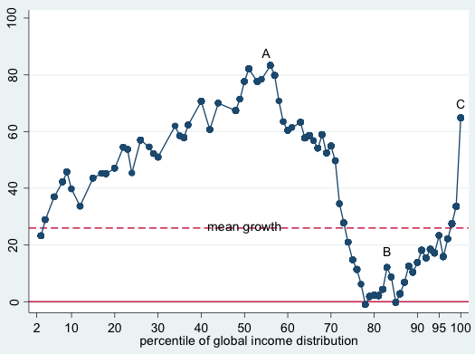
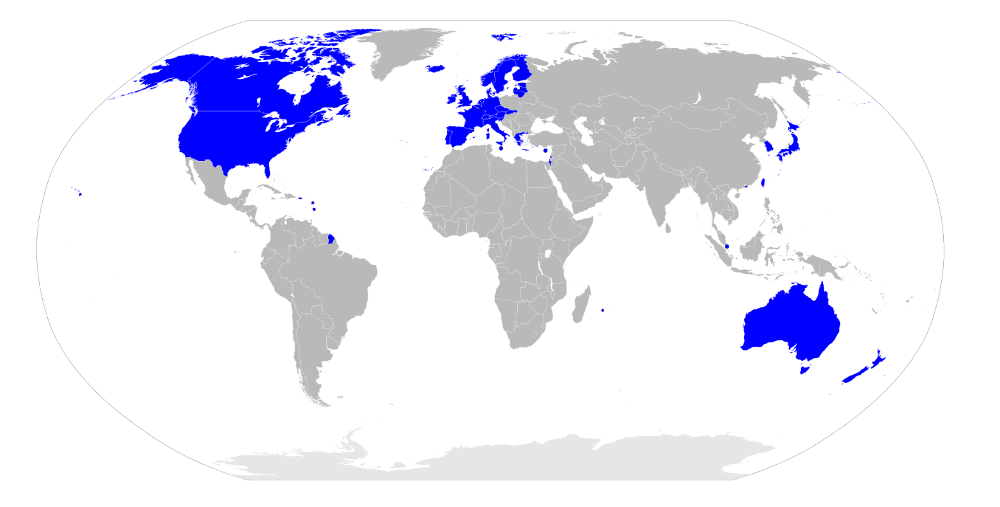

# 国際経済テーマ史

## ●新IMF体制の諸特徴  
・戦後の国際経済史を通貨から見た場合、旧IMF体制と新IMF体制、と分ける事が多い  
・ブレトン・ウッズ体制期が【旧IMF体制】、ブレトン・ウッズ体制崩壊後が【新IMF体制】である  
  
・新IMF体制の最大の特徴はやはり、外国為替相場が【変動】相場制になったという点である  
・これによって、株と同じように［投機］目的でカネを売り買いする者が急増した  
⇒例えば、「この会社には頑張ってほしいな」と思って株を買い、そのまま株価が上がるのを眺めながら時折貰える配当金や割引券を貰う…というのは投資。逆に投機というのは一種のギャンブルで、「価格が低い内に買い、価格が高くなったら売る」を繰り返して利益を得ようとするもの。株では元々行われていたものだが、外国為替相場が変動相場になってから、カネでも行われるようになった  
  
・もう一つの特徴として、相場を操作する為の介入が行われるようになった、というのがある  
  
・例えば、何かしらの理由で急激に円高ドル安になってしまったとする  
※日本経済が強くなったから、アメリカ経済が弱くなったから、というので自然に、ゆっくりと円高ドル安になるのならばいい。そうではなくて、１ドル１００円だったのがたった一日で１ドル９０円になってしまうような、そういう急激な変化があったとする  
  
・急激な為替相場の変化は、当然ながら貿易や景気に悪影響を与える  
・よって、この円高ドル安を緩やかにしなければならない  
・という訳で、日本銀行が大規模な「ドル買い、円売り」を行う…  
⇒ドルを買って円を売れば、円安ドル高になる  
  
・こういうような、為替相場に対する介入、というものは変動相場制だからこそ行われるものである  
⇒変動相場制の国に於いて、政府等が相場へ介入する事を認める体制を、［管理フロート制］と呼ぶ事もある。現在、大国で最も派手に相場介入をやっているのが中華人民共和国。自国通貨の価値を、自国の実力よりもかなり安くする事によって、輸出が有利になるようにしている  
  
・こういった為替相場への介入は、複数の国で同時に行う事もある。［協調介入］である  
・と言うのは、「この通貨、もっと高くor安くしないとまずいよね」というのは現実に存在する  
⇒プラザ合意の時がまさにそう  
・そういう時、各国が協力してその通貨を買うor売る事で、為替相場を操作する  
・プラザ合意やルーブル合意は、その代表例と言える  
・このような事が行われるようになったのも、やはり新IMF体制になってからの特徴と言えるだろう  
  
  
・尚、ブレトン・ウッズ体制崩壊によって、米ドルは世界で唯一の基軸通貨の地位を失ったが…  
・今でも米国はGDP一位な訳で、「基軸通貨の一つ」としては、まだその地位を保っている  
⇒今のところ、基軸通貨と呼んで差し支えなさそうなのは米ドル、人民元、ユーロ、日本円、英ポンドの五種  
## ●ソ連の死とロシアの復活  
・戦後の国際経済体制と言うのは、主に西側陣営によって作られたものである  
・故に、東側陣営はそこへ参加していなかった  
・当然、東側陣営頭目たるソ連も参加していなかった  
  
・しかし、1989年の冷戦終結と、1991年のソ連崩壊が全てを変えてしまった  
・以後、旧東側陣営もまた、国際経済に参加するようになっていく  
  
・ロシア地域に関して言えば、誕生当初のロシア連邦の経済は、はっきり言ってズタボロだった  
⇒ゴルバチョフの改革は結局、「破綻するのは確定してる。後はいつまでもつかどうか」という状態だったソ連を「ぎりぎりまで引っ張ったらロシア地域は再起不能になる。早めに破綻させよう」という結果を生んだ。だからこそソ連崩壊ロシア連邦誕生当初のロシア経済はボロボロ（何せ国を破綻させた訳なので）  
  
・勿論、早めに破綻させたから傷は浅く済んだし、その内復活できる余地も出てくるのだが…  
・少なくとも、1990年代の間はどん底だった  
・一応、1997年の［デンバー］サミットで、ロシア連邦はサミットへの正式参加を認められる  
⇒第二回サミット以来［G7］だったものが、ついに［G8］になった訳である  
・ただ、最大の問題はこの後に来た  
  
・と言うのは、そもそも1990年代自体が、景気の明暗がはっきり分かれた時代であった  
・1980年代まで苦戦していた米国、そして欧州各国は景気が良かった  
・一方、日本やロシア地域については、不景気や危機が目立った時代と言える  
⇒日本は、1990年代初頭にバブル崩壊からの大不況へ突入している  
・そして1990年代後半、二つの危機が連鎖して起きる  
・即ち、1997年の【アジア通貨危機】と1998年の【ロシア金融危機】である  
・連鎖して起きた通貨危機により、ロシア連邦の経済情勢は、どん底まで落ちるのである  
  
  
### ○アジア通貨危機  
・既に見たように、ブレトン・ウッズ体制崩壊時、多くの国は変動為替相場へ移行した  
・しかし、発展途上国を中心に、固定為替相場を維持した国もあった  
・即ち、１ドル３６０円、というような固定した相場を維持した国もあったのである  
・例えばタイ王国は、１ドル２５バーツという固定相場を採用していた  
⇒バーツはタイ王国が発行する通貨  
  
・ところで。固定相場というのは、ただ「１ドル２５バーツ」と宣言すれば維持されるものではない  
・例えば、人々が「１ドル５０バーツ」程度の価値しかバーツには無い、と思ったとする  
・なのに、バーツの価値は１ドル２５バーツ（つまり人々が思う相場の二倍の価値）のまま  
・こうなってしまうと、人々は延々とバーツを売り、ドルを買うだろう  
・仮にそれが違法であっても、バーツを売り、ドルを買うだろう  
⇒違法な相場で、例えば「１ドル３０バーツ」とか「１ドル４０バーツ」という相場で交換しよう、という者が出てきても、人々は喜んで応じ、バーツを売ってドルを買うだろう  
  
・こうなってしまうと、固定相場も糞もなくなり、固定相場制は崩壊する  
  
・という訳で、固定相場制と言えど、政府は固定相場を宣言しただけでは駄目である  
・政府や中央銀行が、為替市場に介入しなければならない  
⇒例えば民間で「バーツを売ってドルを買う」というのが延々と続いているなら、政府は「ドルを売ってバーツを買う」を延々と繰り返し、相殺しなければならない  
※実を言えば、固定相場制を維持する方法はもう一つあるのだが、ここでは横に置いておく  
  
・さて、話は1990年代のアジアに戻る  
・1990年代序盤は、アジア各国が輸出を軸に経済成長を遂げた  
・一方中盤からは、アジア各国の経済成長は鈍化した。要するに、景気が悪くなった  
  
・普通、景気が悪くなった国の通貨の価値は下がる  
・ところがタイ王国は、１ドル２５バーツの固定相場制であった  
・そして1990年代中盤から、ドルが高い状態が続いた  
⇒米国経済が苦境にあった1980年代に結ばれたプラザ合意以降、暫くの間、米ドルは比較的安価だった。しかしその後の米国経済は、1990年代前期から2000年代初期にかけて【ITバブル】に沸いたのもあって、復調してきた。また、1990年代のクリントン政権は、米国を重工業や製造業を中心とする国ではなく、金融業やIT産業を中心とする国へ改造した。つまり、米国はドル安を維持して他国へ商品を輸出する、というのを重視しなくて良くなった。むしろドル高にした方が、米国の金融商品（株式や通貨、国債を含む債券）の価値は高くなるし、各国はこぞって米国の金融商品を買う。そういう流れがあって、1995年からは「強いドル」と呼ばれる政策が採用され、米ドルは従来に比べて高価な状態が続く。何なら令和三年現在も、この「強いドル」は続いている  
  
  
・つまりタイ王国は  
１：1990年代後半には景気が悪くなっていた  
２：にも拘らず、１ドル２５バーツという固定相場を採用していた  
３：しかもドルの価値が上がったので、バーツの価値も一緒に上がってしまった  
⇒こうして、「景気が悪い」のに「自国通貨の価値が高い」という状況に陥ったのである  
  
・「景気が悪い」というのは、つまりタイ王国政府に対する信用が低い状態である  
・当然、人々は心の中で「タイ王国政府が発行してる通貨（バーツ）も信用できない」と思う  
・だと言うのに、バーツの「公式の」価値は、ドル上昇に伴って上がってしまった  
  
・これは即ち、「バーツを売ってドルを買う」を民間が行うと予想される状況であった  
⇒「バーツは本当ならもっと安い筈の通貨だ」「なのに、固定相場制でしかもドルと連結してるせいで、今なら、本来の価値よりもかなり多くのドルと交換できる」「今の内に、ドルに交換しておこう」  
・もしそうなるのであれば、政府は「ドルを売ってバーツを買う」で対抗せねばならない  
・ここに目を付けたのが、［ヘッジファンド］と呼ばれる投資集団であった  
  
・ヘッジファンドは、要するにハイリスクハイリターンな取引を好む投資集団である  
⇒客からカネを集め、投機をやって巨額の利益を引き出そうとする。基本的に他人の迷惑とか生活とかそういうものを考えないで無茶な取引をやるので、一般からは嫌われていると思っていい。変動相場制への移行から、短期的な［資金運用］を好む金融機関はあったが、ヘッジファンドは本当に極端な存在と言える  
  
・ヘッジファンドは、バーツを売って売って売りまくった  
・ひたすらにバーツを売りまくって、ドルを買い漁った  
・当然、タイ王国政府は「ドルを売ってバーツを買う」で対抗したのだが…  
・不景気なタイ王国の政府の手元には、あまりドルがなかった  
  
・結局、タイ王国政府は手持ちのドルを使い切ってしまう  
・ヘッジファンドは、それでもバーツを売り続けた  
・こうしてタイ王国政府は降参。固定相場制の放棄と変動相場制の導入を宣言した  
  
・これが、アジア通貨危機の始まりとなった事件である  
・一国が音を上げるほどに売られまくったバーツは、当然大暴落した  
・これによって、タイ王国は経済危機に突入した  
⇒何故自国通貨が暴落すると経済危機に突入するのか。色々理由はあるが…例えば、タイ王国は当時、対外債務（外国からの借金）をドル建てで行っていた。要するに、外国からドルを借りて、後でドルを返す、という事をしていた訳である。ところがバーツの価値は大暴落、元は１ドル２５バーツだったものが、半年後には１ドル５０バーツを突破するほどになった。これは要するに、バーツの価値が二分の一になった、という事であり、ドルを買うには二倍のバーツが必要になったという事であり―実質、ドル建て対外債務が二倍になった、という事である  
  
・ところで。話は変わるようだが、現代の世界各国は、貿易で繋がっている  
・特に1980年代後半以降は、いわゆる【グローバル化】の進行で、密接に繋がるようになった  
⇒【グローバリゼーション】と言われる事もある。ヒト、【モノ（商品）】、【カネ（資本）】、情報等が、今までとは比べ物にならない規模で国境を越えるようになり、国際的な経済活動が活発化した。背景には、各国の経済【自由化】が進み、またIT技術が進歩した、というようなものがある  
  
  
・故にこそ、タイ王国の経済危機は、速やかに他国へ伝播した  
・距離的に近く経済的な結びつきも強い東南アジア各国は特に強い影響を受け、次々と経済危機に陥った  
⇒東南アジア各国は、この頃既に［ASEAN(東南アジア諸国連合)］を結成し、経済的に強く結びついていた。経済的に強く結びついた相手が、国が破綻しかねないような危機に陥ったら、それはそうなる  
※1980年代はアジアNIESが急成長した時期だったが、1990年代中盤までは、ASEANに参加した国々が急成長した時代であった。そして1990年代終盤、アジア通貨危機によって、経済危機を迎えるのである  
  
・こうして、アジアの通貨危機はアジアの経済危機となったのである  
⇒ASEAN地域に多くの投資をしていた［韓国］でもウォンが暴落。日本でも日本長期信用銀行が破綻する等、アジア全体の経済危機となった  
※各国は手をこまねいていた訳ではなく、発端となったタイ王国からして、【IMF】が緊急融資している。また日本国も、G7各国やIMFと協調しながら、【ODA（政府開発援助）】を含む支援をしている。それでも、危機になってしまったのである  
  
・当然ながら、アジア以外の地域でもやはり、景気は後退したのだった  
  
  
### ○ロシア金融危機  
・アジア通貨危機の煽りを食った最大の例は、ロシア金融危機とも言えるだろう  
・既に見たように、1991年のソ連崩壊で誕生したロシア連邦の経済は、ボロボロであった  
・脱税が横行し、マフィアがのさばり、公的賃金や公的年金の支払いは頻繁に停止され…  
・山のような対外債務も抱えていた  
・国が破綻した訳だから当たり前だが、1990年代のロシア経済はズタボロだったのである  
  
・ロシア経済にとって希望の星は、天然資源の輸出であった  
・意外かもしれないが、今でもロシア経済にとっては、天然資源の輸出は重要産業の一つである  
⇒石油や天然ガス、希少資源の輸出は今でも、ロシア経済にとって重要。特に石油  
  
・ところで。1997年から始まったアジア通貨危機は、全世界的に景気を後退させた  
・平たく言えば、世界中で景気が悪くなった  
・景気が悪くなれば商品は売れなくなるし、商品を作ったり運んだりする事も少なくなる  
・つまり、石油をはじめとする天然資源も、売れなくなったり価格が下がったりする  
・こうして、ただでさえ国内経済がガタガタだったロシア連邦は、輸出でも稼げなくなった  
  
・輸出減はそのまま収入減となった  
・「ロシア政府は信用できない」となり、ルーブル安が止まらなくなった  
⇒ルーブルはロシア連邦の通貨  
・対外債務を返せそうな気配はなく「借金の利子を返す為に借金する」状態になった  
・ドル建てで借金している事の多かった銀行も、次々と破綻した  
  
・こうして、ロシア経済は破滅的な状況に直面した。これがロシア金融危機である  
  
  
### ○その後のロシア経済  
・1999年頃には、ロシア経済は底を打った  
・ロシア経済は再び上昇し始める  
⇒ゴルバチョフが早めに破綻させたお陰で傷は浅く、復活できる余地があった。またこの頃から石油の価格も上がり始め、これに合わせて輸出で稼げるようになった  
  
・以後、ロシア経済は躓く時期こそあるものの、概ね順調に回復している  
⇒だからこそ、「GDPこそ世界十位程度だが、世界三位の軍備を誇る大国の一角」という令和三年現在の地位を築けたのである  
  
・尚、ロシア経済が復調し始めた2000年から大統領をやっていたのが、ウラジーミル・【プーチン】である  
・だからこそプーチンは国家の英雄として、国民から信望を集める事ができたのである  
  
  
## ●2000年代の金融危機  
### ○アルゼンチン通貨危機  
・2000年代には、ざっくり数えて二回の金融危機があった  
・その内一つは、アジア通貨危機によく似た危機だった  
・即ち、2001年の［アルゼンチン］通貨危機である  
  
・と言うのは、アルゼンチン共和国は１ドル１ペソの固定相場制を採用していた  
⇒ペソはアルゼンチン共和国の通貨  
・この為替相場は、アルゼンチン経済の実力を考えれば、高すぎるものであった  
  
・しかもアジア通貨危機以降、各国の外国為替相場は次々と安くなった  
・にも拘らず、アルゼンチン共和国は１ドル１ペソを維持し続けた  
・通貨の価値が高すぎる国は、輸出で不利になる  
・しかもアルゼンチン共和国は、輸出で強くなってきた国  
・その輸出で苦戦するようになったアルゼンチン経済は、急速に悪化していった  
  
・結局、2001年には債務不履行（デフォルト）を宣言  
⇒要するに、「借金を返すカネがありません。借金の支払いができません」という宣言。いわゆる「△△国が破産した」という表現は、この債務不履行宣言の事を指す  
・これが、アルゼンチン通貨危機である  
  
  
  
### ○リーマンショック  
・アルゼンチン通貨危機は、世界的にそこまで大きな影響を与えた訳ではない  
・しかし、2000年代に起きたもう一つの金融危機は、世界中を大不況に叩き落した  
・それが、2000年代の後半に起きた【リーマンショック】である  
⇒一連の金融危機については、【サブプライム・ローン】金融危機とか色々な言い方がある。が、ここでは取り敢えず、一番衝撃的だったリーマンショックに代表させて表記する  
  
・基本的に米国経済というものは、1990年代を通して好調であった  
・1970年代にはオイルショックに、1980年代初期にはその後遺症と双子の赤字に苦しんだが…  
・1985年にはプラザ合意によって米ドルを下げる事に成功  
・更に、この頃から米国経済は、【ITバブル】と呼ばれる好景気に沸いた  
・勿論、あらゆる好景気はいつしか不景気に変わる  
⇒この不景気に変わった時、景気が良すぎると落差で大不況になる。政府の経済政策としては、「ちょっとだけ不景気」になるよう調節するというのが腕の見せ所。そしてこの時、ITバブル後の不況を「ちょっとだけ不景気」程度に収める事に成功した  
  
・ITバブルは、2001年のいわゆる【911テロ（アメリカ同時多発テロ）】を契機に終わる  
・この好景気を綺麗に終わらせた米国は、以後も比較的好調な経済を維持していた  
・その中で、【サブプライム・ローン】が出てくる。これが、後に金融危機の発端となるのである  
⇒ローンは借金。サブは「△△より下」。プライムは「優良」。つまりサブプライム・ローンとは、「優良顧客よりは下の顧客向けの借金」。平たく言ってしまえば、「駄目な顧客向けの借金」である。駄目な顧客向け、だとあまりにも露骨過ぎるのでこういう名前になっている  
  
・サブプライム・ローンは、「駄目な顧客」に借金をさせる  
・その「駄目な顧客」の基準はどんなものかと言えば、例えば過去五年以内に破産したとか  
・この時点で既に、読者は「いやそんな奴にカネ貸しちゃ駄目だろ」と思う筈である  
・しかしサブプライム・ローンは、そういう人にカネをバリバリ貸すものである  
・それも、一万円とか十万円程度の小さなカネではない  
・何百万何千万、場合によっては億単位のカネを貸すのである  
  
・と言っても勿論、米国の金融業界も、「駄目な顧客」はカネを返せない可能性があると分かっていた  
・そこで、いくつか仕掛けをした  
・その内最大のものは、「【不動産（住宅）】購入に絞ってカネを貸し、及びそれを担保にした」である  
  
・担保とは、借金した側（債務者）がカネを返せない時、代わりとするものである  
例：友人Aに、「月末までに返済」という約束で一万円貸したとする。しかしその友人Aは、月末までにカネを返せる見通しが立たなかった。そこで、「じゃあもう一万円返さなくていいよ」「代わりに友人A、お前が持ってるゲーム機を貰うぞ」という話になったとする。この場合、ゲーム機が担保になっている  
  
・つまり…  
・米国の金融業者は、「これから二千万円の家を買う」人に「その家を担保に二千万貸した」のである  
・仮に「駄目な顧客」がカネを返せなくなっても、金融業者は不動産を入手できるのである  
※実際この通りにした訳ではないが、話を単純化するとこうなる  
  
・しかも、2000年代の米国は、【不動産（住宅）】価格が上がり続けていた  
⇒2000年代の米国は、皆が不動産を買う時代であった。皆が買いたいと思う（需要がある）物は値段が上がる、というのは経済の基本である  
・「皆」というのはアメリカ人だけでなく、外国人もだった  
・投資、という形で、米国の不動産を買った訳である  
⇒日本人も、この時米国不動産への投資をしている。と言うのは、2000年代中盤までの日本国は【量】的金融緩和政策をやっていたのである。結局デフレは解消できなかったが、貨幣流通量自体は当然、増えた。そのカネで、米国に投資した訳である  
  
・ともあれ、2000年代の米国の不動産は、値上がりを続けた  
・これが、サブプライム・ローンというビジネスに追い風となった  
⇒つまり…「これから二千万円の家を買う」人に「その家を担保に二千万貸し」、三年後、債務者が返せなくなって「二千万円の家」が手に入ったとする。「二千万円の家」は、その三年の間に値上がりして「二千五百万円の家」とか「三千万円の家」になっていたりする。その家を転売してしまえば、金融業者はがっぽり、ぼろ儲けである  
  
・まさに悪徳高利貸し（サブプライム・ローンは高利だった）、という感じだが…  
・このローンは、借りる側にも利益があった  
  
・仮に、年収三百万円の男がサブプライム・ローンで四千万円借りて四千万円の家を買ったとする  
・当たり前だが、年収三百万でこんな借金、返しきれる訳がない  
・とは言えサブプライム・ローンなら、しばらくは何とかなる  
⇒サブプライム・ローンの特徴の一つとして、「金利はクッソ高いが、最初の方は返す額が少なくてもいい」というのがある為。裏を返せば、しばらく経つと返す額がドカンと上がる、という事でもあるので、大体そこで返せなくなるのだが…  
  
・で、数年後「もうこれ以上借金返し続けるのは無理」となったとする  
・その時には、家を売ればいいのである  
・何せ不動産の価格は上がり続けているので、四千万円の家は四千五百万円とかになっている筈  
・家を売ったカネで借金を一括返済すればいいし、しかも儲かる  
  
・そういう訳で、サブプライム・ローンは米国で大流行した  
・金融業者はカネを貸せば貸すほど儲かるし…  
・借りる側も、借りれば借りるほど儲かる  
・流行らない筈がなかった  
  
・貸すカネが足りないぐらい、という状況を背景に、米国の金融業者は【証券】を作った  
⇒即ち、「このチケットを買ってくれた人には、サブプライム・ローンで儲かったカネの一部をお渡しします」というチケットを作った訳である  
・いわゆる［債権］の【証券】化という奴だが…  
・サブプライム・ローンで儲ける金融業者は、このチケットを売って資金を集めた  
  
・勿論それだけではなかなか売れないので、［（信用）格付け］会社に格付けして貰う事も忘れない  
・格付けとは何か、と言うと…投資をする人というのは、何でもかんでも知っている訳ではない  
・例えば、「この国債、めっちゃ金利高いし買いたいな」となったとする  
・この場合、「でも聞いた事もない国だな…本当にカネ払ってくれるのかな」ともなり得る  
・そういう時、格付け会社による格付けを調べるのである  
・格付け会社は「この国債は信頼できる」「この証券は信頼できない」みたいなのを格付けしている  
・人々は、これを参考に金融商品を買う（投資する）訳である  
  
・ともあれそんな訳で、サブプライム・ローンという商売は、とにかく儲かった  
・外国人も含む投資家からカネを集め、そのカネを貸し、土地を転がして儲ける…  
・かつての日本でもあった、いわゆる「バブル」という奴である  
  
・しかし、である  
・このサブプライム・ローンは、要するに、「不動産の価格が上がっている」から成立する  
・逆に言えば、不動産の価格が上がらなくなったら、成立しないのである  
・そして実際、不動産の価格上昇は、2006年には急速に鈍化するのである  
  
・考えてみれば、当たり前の話である  
・不動産の価格上昇が続けば、安い家というのはなくなる  
・その内、年収三百万円の人間でも、一億とか十億とか払わないと家を買えなくなる訳である  
・いくら「不動産の価格は上がり続けてます！」「適当なところで売っちゃえばOK！」と言われても…  
・年収三百万円の人間が、一億借りて一億の家を買うか？　という話である  
  
・そういう訳で、不動産を買う人の数（需要）が減った  
・需要が減れば、価格も下がる  
・2007年に入ると、不動産価格は下がり始めた  
・サブプライム・ローンは不動産価格の上昇が前提であり、下がるようなら成り立たない  
・こうして、サブプライム・ローンという商売は破綻した  
⇒これは同時に、右も左もサブプライム・ローンという商売に手を染めていた、米国金融業界が「ヤバイ」という事実でもあった。もっと言えば、「工業製品を作って輸出するみたいなのはもうやめよう」「これからは金融ですよ。カネを転がして儲けるんです」という方向に舵を切った米国経済全体が「ヤバイ」という話でもあった。そしてまた、サブプライム・ローン関係の【証券】を買っていた、世界中の投資家や金融機関もまた、「ヤバイ」という話だったのである  
  
・そして2008年  
・米国の投資銀行最大手、【リーマン・ブラザーズ】・ホールディングスが経営破綻  
・負債総額6000億ドル（１ドル100円として、60兆円）という、米国史上最大の倒産であった  
・ここを起点として、米国経済は大不況へ突入する  
⇒いわゆる【リーマンショック】というのは、これの事を言う  
  
  
・何だかんだと言って、米国は今でも世界一位の経済規模を誇る  
・そしてまた、現代の経済はグローバリゼーションの進行により、世界規模で密接に繋がっている  
・況してサブプライム・ローンという商売は、証券のせいで世界中の投資家や金融機関と繋がっていた  
・つまり、米国の大不況は、全世界に波及したのである  
  
・これが、サブプライム・ローンに端を発した金融危機であった  
⇒この金融危機による被害が比較的軽微だった日本ですら、バブル崩壊以降の不景気が更に悪化。当時政権を握っていた自民党への不満も高まり、民主党への政権交代が起こる事になる  
  
・そしてリーマンショックの直後、欧州で再び経済危機が起こるのである  
  
## ●地域統合  
・リーマンショックの直後に起きた経済危機を理解するには、EUを理解せねばならない  
・そしてEUとは、地域経済統合、もしくは地域統合の最大の例と言える  
・そこで、ここで地域経済統合について、見てみよう  
  
  
### ○概要に行く前に、思想的背景  
・第二次世界大戦後、「世界は一つになろう」というような理想論が台頭した  
・国連なんかも、言ってみればその理想論が背景の一つとしてある  
・勿論、国連は戦勝国による戦勝国の為の戦後支配組織として出発したが…  
・理想論を背景にして出てきた、また理想論を背景に発展してきたという面は否定し得ない  
・その理想論の雰囲気を完全に表現しているのが、ジョン・レノンの「Imagine」である  
  
|英語歌詞|拙訳|  
|:----:|:----:|  
|Imagine there's no Heaven|想像してみなよ、天国なんてないんだと|  
|It's easy if you try|やってみれば、難しくないと分かるだろう|  
|No Hell below us|地下に地獄なんてある訳が無い|  
|Above us only sky|僕らの上には空があるだけだ|  
|Imagine all the people|想像してみなよ、ただ人々が|  
|Living for today|今日という日を生きているだけだって|  
|||  
|Imagine there's no countries|国のない世界を想像してごらんよ|  
|It isn't hard to do|実現するのはそう難しくない|  
|Nothing to kill or die for|国の為に殺したり殺されたりしないんだ|  
|And no religion too|そして、宗教もないんだ|  
|Imagine all the people|想像してみなよ、全ての人々が|  
|Living life in peace|平和に生きているって|  
|||  
|You may say I'm a dreamer|君は僕を夢見がちだと言うかもしれない|  
|But I'm not the only one|でも僕は決して一人じゃない|  
|I hope someday you'll join us|いつの日か君も加わってほしい|  
|And the world will be as one|そして世界は一つになるんだ|  
|||  
|Imagine no possessions|想像してごらんよ、何も所有しないって|  
|I wonder if you can|君ならできるよ|  
|No need for greed or hunger|欲に溺れる事も、飢える事もない|  
|A brotherhood of man|人類は皆兄弟なんだ|  
|Imagine all the people|想像してみなよ、全ての人々が|  
|Sharing all the world|世界を共有するところを|  
|||  
|You may say I'm a dreamer|君は僕を夢見がちだと言うかもしれない|  
|But I'm not the only one|でも僕は決して一人じゃない|  
|I hope someday you'll join us|いつの日か君も加わってほしい|  
|And the world will live as one|そして世界は一つになるんだ|  
  
・見ての通り、だいぶヤバい感じの曲である  
例１：「国のない世界」が平和とは限らない。万人の万人に対する闘争状態にだってなり得る  
⇒実際、内戦等で政府が崩壊し無政府状態になった国は、大抵えげつない勢いで人が殺し合っている  
例２：「全ての人々が世界を共有する」筈だった社会主義は自国民を殺しまわった  
⇒ポル・ポトおじさんに至っては本読んでたら死刑、眼鏡かけてたら死刑、手が綺麗だから死刑、の世界である。ソ連だってウクライナで意図的に飢饉を起こし、一千万人という規模で人を殺している  
  
・しかし、そういう現実を無視して、理想郷へ向かおうという意識は存在した  
・地球全部は無理でも、欧州から国境をなくし、欧州を一つにしよう、という理想論  
・この理想論と「商売は一国だけでやるより複数の国にまたがってやった方が儲かる」が悪魔合体したもの  
・それこそがEUである、と、このように言えるだろう  
  
・故に、地域統合の代表例たるEUは、最初から同床異夢だったと言える  
・「欧州という地域を（少なくともある程度までは）統合しよう」というのは共通認識だったろうが…  
・その最終的な目標が夢物語なのか、現実的な金儲けなのか、そこは一致していなかった  
・もっと言えば、「よくわかんないけど平和になるなら」程度の事しか考えていない者も多かった  
・だからこそEUは、後に大きな問題を引き起こし、今や死にかかっているのである  
  
・そのEUの軌跡を追ったり追わなかったりしながら、地域（経済）統合について学ぶとしよう  
  
  
### ○WTOの限界と地域統合  
・ところで先程、こう（↓）言った  
⇒この理想論と「商売は一国だけでやるより複数の国にまたがってやった方が儲かる」が悪魔合体したもの。それこそがEUである、と、このように言えるだろう  
  
・これは間違いなくそうなのだが、悪魔合体する必要はあったのだろうか？  
・と言うのは、「商売は一国だけでやるより複数の国にまたがってやった方が儲かる」なら、WTOがある  
・実際、GATT時代も含めて、WTOは自由貿易の拡大に精を出してきた  
・即ち、「商売は一国だけでやるより複数の国にまたがってやった方が儲かる」の実現の為活動してきた  
・ならば、理想論と悪魔合体して地域統合をやる必要があるのか？　という話になる訳だが…  
  
・実のところ、WTOの活動というのは行き詰りつつある  
・と言うのは、WTOはその原則の一つとして、「多国間（ラウンド）交渉」を持っている  
・当たり前だが、交渉に参加する国の数が多ければ多いほど、交渉は複雑化する  
・そしてWTOは今や、164ヶ国（令和三年現在）が参加する超巨大組織である  
・結果として現代のWTOによる交渉は、なかなかうまくいかないという現実があるのだ  
⇒実際、WTOでは2001年から【ドーハ】・ラウンドが開催されているが、令和三年現在も交渉が続いている。二十年交渉をやって、それでも妥結に至らないという事である  
  
・代わって自由貿易の旗振り役となったのが、少数の国家で貿易自由化の協定を結ぶものである  
・代表例が【FTA（自由貿易協定）】と【EPA（経済連携協定）】である  
  
・一般的に、【FTA】締約国は、互いが互いに【関税】を撤廃して貿易を自由化する  
・同様に【EPA】締約国は一般に、ヒト、モノ、カネ、全ての移動を自由化する  
⇒この辺の区別は、実際のところ厳密ではない。大雑把に考えてもいいだろう  
  
・FTAにせよEPAにせよ、WTOのように百とか二百の国で交渉したりはしない  
・多くても二桁行くか行かないか程度の国が、貿易自由化を行うのである  
・故に交渉がしやすく、実現もしやすい  
  
・FTAの有名どころとしては、何よりも【NAFTA（北米自由貿易協定）】がある  
⇒アメリカ、カナダ、メキシコの三国が参加したFTA  
・また、東南アジアの【AFTA（ASEAN自由貿易地域）】も有名  
⇒ただのFTAではなく、FTAからもう一歩踏み込んだものになっている。【ASEAN（東南アジア諸国連合）】に参加する各国が参加している  
  
・日本国の場合は、EPAを積極的に結んでいる  
⇒有名どころでは、ウラン埋蔵量が多い（つまり日本の原子力発電所の燃料の供給元として有望な）［オーストラリア］と結んだEPAがある。 また、［インドネシア共和国］、［フィリピン共和国］、［ベトナム社会主義共和国］といった国々ともEPAを結んでおり、東南アジア出身の出稼ぎ労働者が日本で増えているのはEPAを締結したからこそである  
  
・従来、日本は同じ先進国として競争相手となる国、地域とはFTA/EPAを結んでいなかった  
⇒分かりやすいところで言うと［アメリカ合衆国］や［EU］、［中華人民共和国］  
・しかし近年、そういう国ともFTA/EPAを結ぶ例が出てきている  
・これは基本的には、自由貿易を志向しまた外交手腕に優れた安倍晋三内閣総理大臣（当時）の成果である  
  
例１：2019年には［EU］とEPAを結んでいる  
例２：2020年には［米国］と事実上のFTAにあたる条約（日米貿易協定）を結んでいる  
例３：当初は［米国］も参加していた、［TPP（環太平洋パートナーシップ）］の交渉に参加。結局米国は途中で離脱してしまい、2018年［CPTPP（環太平洋パートナーシップに関する包括的及び先進的な協定）］として発効した  
※自由貿易は、しばしば国内の産業を破壊する。NAFTAを結んだ後の米国がそうで、「高い給料要求するアメリカ人使うより、メキシコ人雇って奴隷労働させた方が儲かるわ（笑）」となった米国企業が米国人労働者を使わなくなった。この反省があるが故に、ドナルド・トランプ米国大統領（当時）がTPPから離脱したのである  
※実際日本でも、特に［農業］を中心にTPP参加には反対が大きかった。基本的に日本の農業は「政府の保護で何とか生きてる」「政府の保護を失ったら速やかに死ぬ」ものである為、自由貿易で関税が下がって農作物が大量輸入されるようになると…お察しください  
  
・ともあれ、WTOが行き詰まる中、自由貿易推進の旗手はFTAやEPAとなった  
・そして、FTAやEPAを結んだ地域が、やがて、より高度な地域統合の基盤となる  
・そのように、考えられている  
⇒例えばAFTAは、FTAから更に発展して東南アジア地域統合の地盤になる事が期待されている  
### ○統合の段階  
・地域統合には段階があるとされる。即ち…  
１：【自由貿易地域】  
⇒【FTA】を結んでいる段階。その地域内で、関税が撤廃される  
２：【関税同盟】  
⇒１からもう一歩進んで、地域外について共通の関税を設置する  
３：【共同市場】  
⇒更に進んで、地域内に於ける「ヒト、モノ、カネ」の移動を自由化する。言い方を変えると、資本や労働力等の生産手段についても移動を自由化する  
４：［経済同盟］  
５：［完全経済同盟］  
⇒４と５の差は曖昧。「ある程度共通の財政政策、金融政策が行われるようになった」のが４、「完全に共通の財政政策、金融政策が行われた状態。超国家機関が設置され、域内の中央銀行が設立された状態」が５、という話ではあるのだが…どこまでが４でどこまでが５かと言われると、微妙なところ  
  
・例えば、EUは５とされる事もあるし、４とされる事もある  
・他には、AFTAは１の範囲には収まらないがまだ２に辿り着いている訳ではない、というところ  
  
  
### ○EUの栄光  
・既に見たように、EUは前身がいくつかある  
  
・まず「雪解け」期の1951年にできた［ECSC（欧州石炭鉄鋼共同体）］  
⇒この時から加盟しているのが、［ドイツ］連邦共和国（いわゆる現在の［ドイツ］であり、冷戦期の［西ドイツ］）、［フランス］共和国、イタリア共和国、ベルギー王国、ネーデルラント（オランダ）王国、ルクセンブルク大公国の七ヶ国である  
・そして1957年、ローマ条約でできたEEC（欧州経済共同体）とEURATOM（欧州原子力共同体）  
・この三つが合体する形で、［EC（欧州共同体）］が誕生するのである  
⇒誕生は1967年。1973年にはイギリス、アイルランド、デンマーク王国が加盟した為、当時は［拡大EC］と呼ばれた。要するに、この三国が入る前のECと、入った後の大きくなったECを分けて呼びたい時に、こう呼んでいたのである  
  
・このECは、先の統合の段階で言えば、【関税同盟】にあたるものだった  
・これが、1993年の【マーストリヒト】条約までには、本格的な【共同市場】へ発展する  
・さらに同条約でECは、【EU（欧州連合）】へと名を変え、本格的な統合へ動き出すのである  
⇒共同市場への発展で大きな役割を果たしたのが、1985年の単一欧州議定書と［シェンゲン］協定である。前者はそのまま、欧州という地域を一つの市場にしようという、まさに共同市場へ向けた議定書。後者は、要するに「加盟国間の国境審査の撤廃」である。即ち、この協定に参加した国同士の間では、パスポート審査等がなくなるのである。例えばフランス共和国からベルギー王国への移動が、東京都から千葉県へ移動するかのような、自由なものになるのだ。共同市場という、「ヒト、モノ、カネ」の移動の自由化に、大きな役割を果たす協定であった。この協定は後に、1999年の【アムステルダム】条約で、EUの法律として採用された  
  
・マーストリヒト条約によるEUの誕生は、欧州に於ける地域統合への大きな前進であった  
・と言うのは、元々ECは地域「経済」統合の試みであり、地域統合と言っても経済的な面に留まっていた  
・欧州委員会や欧州議会のような超国家的性格を持つ機関も、あるにはあったが…  
・あくまで、地域「経済」統合の為の組織であった  
・これが、【政治】統合に向けて、本格的に動き出したのである  
  
・即ち、EUを統一国家にするのである  
・経済的にも政治的にも完全な統合が成った後の国名は、欧州連邦が予定されていた  
・【アムステルダム条約】では、外交、安全保障の分野を含めた欧州の統合を進めようとした  
・EUの憲法にあたる［リスボン］条約も、2009年には発効している  
・そして実際、統一国家に向けての機関も整備されていった  
  
・国会にあたる立法機関は、［欧州議会］  
・内閣にあたる行政機関は、［欧州委員会］  
・裁判所にあたる司法機関は、［欧州裁判所］  
・そして欧州の最高意思決定機関は、［EU大統領］（通称。正式には［欧州理事会議長］）  
  
・更に、経済統合という意味では、目玉にあたる統一通貨【ユーロ】が整備された  
・EUに参加する各国は、それぞれ独自の通貨を使うのではない  
・統一された通貨、ユーロを使うのである  
・その発行を含め、EUの中央銀行としての任にあたる【欧州中央銀行(ECB)】も整備された  
  
・加盟国もどんどん増えた  
・当初は西欧の国が多かったが、東欧の国もどんどん増え、2013年には［28］ヶ国となった  
⇒2004年に旧東側国家を中心として十ヶ国が加盟。2007年には、ブルガリア共和国とルーマニアが、2013年にはクロアチア共和国が参加して、［28］ヶ国となった。東欧の国々の参加は、EUの［東方］拡大と言われている  
※尚、令和三年現在は、【イギリス】の離脱により［27］ヶ国となっている  
  
・欧州限定とは言え、国のない世界は、目の前にあるかに見えた  
・ジョン・レノンの言うような夢物語が、理想郷が、すぐそこにあるかに見えた  
  
  
### ○EUという悪夢  
・現実は甘くなかった  
・EUという存在は様々なところで問題を起こしつつある  
・EU統合の推進は、欧州人民を幸福にするどころか、不幸にしてしまった訳である  
・その事情を、一般教養として、知っておくべきだろう  
⇒この辺の事情を知る上でとてもいい文章を筆者の友人が書いているので、後で引用する。まずは、その文章の前半部分だけを分かりやすく、授業にも使える形にしたものを提供する  
  
・さて。では、何故EU統合の推進によって人は不幸になるのか？  
・主な要因としては三つある  
  
１：既存政党の機能不全と国民主権の崩壊  
２：グローバル化と格差の拡大  
３：エリートと大衆の断絶  
  
・私の授業では、この内１の「既存政党の機能不全と国民主権の崩壊」を取り上げよう  
⇒２、３が気になる人は、後で引用する文章の方を是非読んでみてほしい  
  
・さて、「既存政党の機能不全と国民主権の崩壊」とはどういう事か？  
・これは要するに、「政党がどれもこれも同じようなものになってしまった」という事である  
・即ち、EUという「お上」の指示には無条件に従う政党ばかりになってしまったのだ  
  
・例えば、フランソワ・オランドというフランスの政治家がいる  
・彼はフランスの社会党第一書記を長く務めた男である  
・そんな彼は、2012年から五年間、フランス共和国大統領も務めたのだが…  
  
・社会党を名乗る党は、どこの国でも革新政党であり、左翼政党である  
・即ち労働者の味方党であり、「金持ちから沢山税金を取って、貧乏な人に配ろう」系の党である  
・そんな党の最高位を長く務めた男を、フランス人は大統領として選んだ訳だ  
・即ちオランドを大統領に選んだ時の民意とは、「庶民を助けてくれ」だった筈である  
  
・にも拘らず、オランド大統領は富裕層優遇政策を次々と打ち出した  
・庶民を、貧乏人を切り捨てて、大企業や金持ちを優遇したのである  
・これは要するに、EUという「お上」が「こういう経済政策をやれ」と言ったのに従ったからであった  
  
・即ち、EU構成国の人々は、誰に投票しようがどの政党を選ぼうが、あまり意味はない  
・保守政党を選ぼうが革新政党を選ぼうが、結局EUという「お上」の決めた事に従わされる  
・「庶民を助けてくれ」と左翼政党を選んでも、「お上」が「金持ち優遇しろ」と言えばそれまで  
・これは国民主権と民主主義の崩壊と言っていいだろう  
  
・何故こんな事になったのか？  
・と言うと、近年のEUが中央集権化を、即ち「地域統合」を進めているからである  
  
・例えば2013年五月、ツー・パックというのが導入された  
・これによって、EUに所属する各国は、予算案をEUへ提出する義務を負うようになった  
・そしてEUは、この予算案を見た上で「これじゃ駄目、やり直し」とできるようになったのである  
・こうして、少なくとも経済的な側面からは、各国政府は「国民の代表」ではなくなった  
・「EU本部の出先機関」「EU本部の政策の執行者」になってしまったのである  
  
・それでも、予算案を見て駄目出しをするEUの機関が民主的に選ばれていればいいのだが…  
・それをやるのは、欧州委員会という組織である  
・そして欧州委員会の構成員は、一国につき一人、各国政府が選出する  
⇒議院内閣制の首相ならまだ、国民が直接選べないまでも「どの政党の奴にするか」程度は選べるが…  
  
・まぁそれでも、百歩譲って、欧州委員会がEU人民の為の経済政策をやってくれるならいい  
・EUに参加する国に住む全ての人々が幸せになれるように、やってくれるならいい  
  
・ところで。話は変わるようだが、現代的な資本主義社会では、放っておくと格差は広がっていく  
・放っておくと金持ちはより金持ちに、貧乏人はより貧乏になっていく  
・同様に、放っておくと都会にはますます人が集まり、経済が発展する  
・そして、放っておくと田舎からは人がいなくなり、経済的に死ぬ  
  
・だからこそ、国は地方へ沢山の補助金を出さなければならない  
・都会は放っておいても勝手に儲けるし発展するが、田舎は放っておいたら死ぬ  
・故に国が介入し、例えば都会が儲けたカネを税として取り上げ、田舎にばらまく訳である  
⇒日本国も、地方交付税という形でこれをやっている  
  
・ところで、EUではこういう財政政策が禁止されている  
・誰あろう、EUを生んだマーストリヒト条約そのものが、これを禁止している  
  
・EUに参加した国は、ユーロという同一の通貨を使っている  
・だから、まるで地方自治体であるかのように、自分で自分の通貨を発行できない  
・どころか、ツー・パック導入以降は、好きな予算を組む事すら許されない  
・だというのに、EUという「政府」は、地方自治体と化した「国」を、補助金で助けない  
・結果、EUに参加した国の中では、格差がどんどん広がっていく  
・貧乏な「国」はどんどん貧乏に、裕福な「国」はどんどん豊かになっていくのである  
  
・…とまぁ、この時点で既に、EUがいかに大きな問題を抱えているか、分かってもらえるだろう  
・実際には、他にも問題を抱えている  
  
・例えば、格差が拡大したし…  
⇒EUの地域統合推進に限らずグローバル化推進という政策全体に言える事だが、「ヒト、モノ、カネ」の移動を自由にする。この自由化推進と、新自由主義という「実力主義」の横行が悪魔合体するとどうなるか。NAFTAを結んだ後の米国企業のように、「高い自国人使う必要ないじゃん（笑）」「安い外国人雇って奴隷労働させればめっちゃ儲かるじゃん（笑）」みたいなのが発生する。結果、先進国の労働者はどんどん待遇を悪くされ、没落し、逆に先進国の金持ちは儲ける。こうして、貧富の格差が拡大する  
  
・例えば、エリートと大衆が分断されたし…  
⇒これも、EUの地域統合推進に限らずグローバル化推進という政策全体に言える事だが…EU統合を推進するエリート達は、自国に於ける貧富の格差拡大を放置した。例えば自国人の労働者が、外国人労働者との競争に晒されて次々と待遇を悪くされる中、金持ちエリートは「見てるか我が国の労働者諸君（笑）」「こうやって安い給料でも勤勉に働くのが真の労働者だぞ（笑）」とやってる訳である。日本でも「上級国民」という言葉が生まれ、富裕層が敵視される状況が生まれているが、EU諸国での状況はもっと酷い  
  
・この辺、詳しく知りたい人は是非、これから引用する文章を読んでほしい  
・詳しく知りたいという訳ではなくとも、EUが様々な歪みを生んでいるというのは、知っておこう  
・結局のところ、EU構成国民の皆が皆、「統一国家欧州連邦を作ろう」と思っていた訳ではないのだ  
・現実的な金儲けを考えている者、ふんわりと「平和になるなら」で賛成していた者、色々である  
・その同床異夢が、とんでもない悪夢を生み出してしまった  
・「国のない世界を想像してごらん」と言っていたら、大変な事になってしまった  
・その辺は、抑えておいてほしい  
  
・という訳で以下、筆者の知人が以前書いた文章を、一部分かりやすいよう改変しつつ、引用する  
※改変については本人の承諾済み  
  
～ここから引用～  
  
  　EU統合の目的は何であろうか。それは色々な説明が可能であろうが、本質的には「欧州諸人民の幸福の維持と増進」に他ならないと言えるだろう。戦争を起こさないため、とか、経済発展のため、など色々に言えるが、結局それは、欧州に住む人民の幸福のためである筈だ。その「幸福」が、平和とか、経済発展とか、人権擁護とか、様々な形で表出しているに過ぎない。そういう「欧州諸人民の幸福の維持と増進」のために、EU統合は様々な形でのグローバル化を進めている。  
  　では、EU統合の進展によって、人々は幸福になったのであろうか。幸福は維持され、また増進したのであろうか。どうも、一概にそうとは言えないようである。端的に言って、もし、一概に「EU統合によって欧州人民は幸福になった」と言えるのであれば、イギリスはEUを離脱しないのである。  
  　むろん、問題はイギリスだけではない。西欧だけを見ても、フランスでも、ドイツでも、EU統合の進展による弊害が人民を苦しめている現実がある。そうでなければ、ポピュリズムの躍進は起きない筈である。人民の幸福の増進のためのEU統合、その進展が、逆に不幸を増進してしまっている。これをジレンマと呼ばずして、何と言うべきであろうか。  
  　今回は、EU統合とグローバリズムを引き金に起きたポピュリズムの躍進、その原因を考察しながら、EU諸人民を幸せにする筈だったEU統合がどのような形で人々を不幸にしてしまったのか、EU統合の生み出した不幸とはどのような形なのか…という観点から、話を進めていこう。  
 
 
  ●ポピュリズムの躍進  
 
  　さて、欧州ではポピュリズムが躍進しているが、それは何故なのか。その原因について、水島治郎著『ポピュリズムとは何か』（中公新書）は三つの要因を挙げている。そのどれもが、EU統合に深くかかわっており、またEU統合の進展によって「諸人民の幸福」ではなく「諸人民の不幸」が増進してしまった結果をみる事ができる。  
  　まず、ポピュリズム躍進の理由、その第一と第三を見てみよう。  
 
 
  ●理由の第一：既成政党の機能不全、国民主権の崩壊  
 
  　第一は、既成政党がどれもこれも似たようなものになってしまった、という点である。  
  　『またヨーロッパにおいては、グローバル化とEU統合の進展という事態のもとで、一九九〇年代以降、各国における主要政党間の政策距離の狭まりは顕著となる。古賀光生が指摘するように、EU統合の進展に伴う規制緩和の推進、歳出の抑制、福祉支出削減などの諸改革について、ほぼすべての既成政党が受け入れる姿勢をとった。左派政党、とりわけ社会民主主義政党は、ほぼすべての既成政党が受け入れる姿勢をとった』 （『ポピュリズムとは何か』62p）  
  　これは、重大な事である。一般的に、右派、即ち保守党は「資本家の味方党」であり、左派、即ちリベラル党は「労働者の味方党」だ。極右党に見られがちな、かつての国家社会主義ドイツ労働者党も、その実はリベラル党である。無論、軍隊や資本家といった保守層と妥協した事もあり政治的右派要素は強い。だが一方で、貴族出身者の多い当時の軍を「国民の軍隊」と思わず、新たな、国民による国民のための軍を作ろう、という政策すら党内にあったリベラル党なのだ。当然、経済的にもリベラルな左派党―即ち「労働者の味方党」であった。この党の政権下では労働者は厚く保護されたし、そんな中で世界初のフレックスタイム労働が始まった事も、驚くにはあたらない。  
  　翻って、例えば現代のフランスを見てみよう。現在、フランスは大統領選の真っ最中であるが、現職のオランド大統領は社会党である。リベラル党であり、労働者の味方である筈だ。故に、本来ならば労働者優遇の…例えばフランスの高い失業率、その対策といった政策が期待される。ところが、エマニュエル・トッドが複数の著書で繰り返し失望を露わにしているように、その政策はむしろ富裕層優遇であり、「資本家の味方」のようですらあった。毎日新聞に『オランド政権:相次ぐ企業優遇策に「それでも社会党か」』 という記事が載ったのも、またその極めて低い支持率も、決して理由のない事ではない。リベラル党を選んでも、保守党を選んでも同じ政策しか行われないのであれば、それは民主主義の意味を持たず、既存政党と政治への失望を誘う。  
  　そして、リベラル党も保守党も大して変わらない存在になってしまった原因がEU統合にあると、先程の引用文章に（恐らくは、図らずも）はっきりと示されている。各国の政権を握った既成政党が、しかし自律的に政治を行っていない。言い換えれば、国民や国家のためでなく、EUのために政治を行っているのだ。そのため、国民が選挙でどう投票しようとも、その選挙で選ばれた政治家に国民の選択が反映されない。本来、労働党が選挙で勝てば、それは労働者の味方をしてほしいという民意の表れであり、保守党が勝てば、資本家の味方をしてほしいという民意の現れであると言える。少なくとも経済政策の限りは、そう言える。だが、実際にはどちらが勝とうともEUの味方をするばかりで、何も変わらない…つまり、各国民が自分たちの未来、そして自分たちの国家の未来を選択できなくなっている。各国民から自己決定の権利が奪われている訳である。  
  　ポスト国民国家の時代に向けて欧州を一つの国家にするのであれば、それはそれで人民に自己決定の権利がなければならない。現状ではそれが奪われていると、そう認識されている部分がある。そして、それは不幸であると、認識されている。例えば、イギリスのEU離脱の国民投票、その離脱賛成派に最も重視されたのはイギリス議会の主権回復であった。  
  　この投票の調査については、英国の保守系の政治家でもあるマイケル・アシュクロフトの調査が有用である。そこには、『Nearly half (49%) of leave voters said the biggest single reason for wanting to leave the EU was “the principle that decisions about the UK should be taken in the UK”.』（引用者訳：離脱に投じた人の内49%が、イギリスの事はイギリスで決めるべきだ、と言っている）とあるのだ。  
  （http://lordashcroftpolls.com/2016/06/how-the-united-kingdom-voted-and-why/, 平成二九年四月三〇日閲覧）  
 
  　ところで、ここまで、既成政党が皆同じになってしまった理由を、「既成政党が投票者、ひいては国民の味方をせずEUの味方をするから」と説明してきた。では、EUの味方をするとは、具体的にはどういう事か。  
  　普通は、EUの最高意思決定機関たる欧州理事会や、政策執行機関である欧州委員会の意思に従う事であると言えよう。だが、エマニュエル・トッドは、それはドイツに従う事に他ならないと言う。もっと言えば、ドイツの政治首脳に従うという事だ。  
 
  　『われわれにはもはや「指導者層（指導する層）」はいません。すでに述べた通り、「指導される層」しか存在しないのです』『オランドの強硬姿勢など、実際には何の効力も持ちません。物事を決めるのはドイツなのです』 （エマニュエル・トッド著『問題は英国ではない、EUなのだ』（文春新書）34p）  
 
  　実際のところ、ドイツがEUにおいて主導的な立場を演じているのは事実である。また、トッドの言葉を全面的に肯定せずとも、少なくとも『われわれにはもはや「指導者層（指導する層）」はいません。すでに述べた通り、「指導される層」しか存在しないのです』というのは真実を照らしている。  
  　と言うのは、EUは特にユーロ危機以降、特に財政面では中央集権化が進んだ。ヨーロピアン・セメスター、シックス・パックといった各種の改革によってそれが成された。一例としてツー・パックを挙げよう。  
 
  　『二〇一三年五月のツー・パック導入によって、ユーロ圏各国が中期的な財政政策や構造改革案に基づき公表した翌年の予算案を、欧州委員会が精査し、必要があれば予算案の修正・再提出を求めることが義務づけられた』 （遠藤乾著『欧州複合危機』 (中公新書)19p）  
 
  　こういったEUの中央集権化は、当然ではあるが、各国の統治権の縮小を進めるものであり、また主権を制限するものである。まさしく、『これらの措置は、著しい集権化をブリュッセル（EU本部）にもたらす。なんとなれば、主権者が選んだ代表が定める予算を、外部の人間が策定前にレビューし、たとえば民営化のあり方から税や年金の水準にいたるまで、口をはさむことを意味するのである』(『欧州複合危機』 19p） という事である。  
  　これは即ち、各国の政府が「主権者たる国民の代表」でなくなる事を意味する。むしろ「EU本部の出先機関」「EU本部の政策の執行者」にしてしまう。既成政党がどれも一緒のものになってしまっても、むしろ当然である。  
 
  　EU加盟国を国でなくする、言い換えれば、EUを複数の国による一種の同盟から、「ヨーロッパ連邦国」とでも言うべき一つの国に作り替えてしまおう、という考え方を否定する欧州人民からすれば、こういう中央集権化の進行自体が、一種の不幸である。当然、それによる既成政党の機能不全も、不幸である。  
  　一方で、そういう考え方を肯定し、「ヨーロッパ連邦国」建国を肯定する人民からしてみると、中央集権化の進行自体は、むしろ幸福であろう。ただし、そういう人民であっても、自らが主権者であり、自己決定の権利を持つと意識できなければ、それはやはり不幸に感じて当然である。また、「ヨーロッパ連邦国」首脳たるドイツ、もしくはEU本部が、欧州諸人民の幸福に配慮した政治を行わなければ、やはり不幸に感じるであろう。  
  　『欧州複合危機』はいう。『本来、単一通貨圏においては、産業構造の相違や集積効果などから、豊かな階層や地域に富が集まる傾向があり、それに対してなんらかの富の移転を同時並行で行わないと、格差が固定ないし拡大することになる』『しかしながら、ユーロ圏においては、財政の直接移転はマーストリヒト条約で禁止されており、それゆえに、国債買い上げなどの、いわば裏口から同様の機能が果たされてきたといえる。それに対しても、条約違反であるとの声はドイツなどで多く聞かれ、実際に憲法訴訟は幾度も定期されてきた。そうした状況下で、財政を一部でも共有化し、豊かな国から貧しい国への再分配がなされる見込みはいまのところなく、財政統合は手付かずのままとなっている』 (21-22p)  
 
 
  ●理由の第三：グローバル化と格差の拡大  
 
  　第三の要因は、EU統合の進展に伴うグローバル化、それによる格差の拡大である。先の項の最後で、同一通貨圏では何らかの形で富の移転、即ち再分配を行わなければ格差が拡大するが、EUにはそういう仕組みがないという点を指摘した。それ故に、EU加盟国内では富める国と富めぬ国の差は固定、あるいは拡大するのだが、それとは別に、一国の中でも格差の拡大が起きている。  
 
  　『二〇世紀末以降進んできた、産業構造の転換と経済のグローバル化は、一方では多国籍企業やIT企業、金融サービス業などの発展を促し、グローバル歳に大企業や高所得者が集中する結果をもたらした。他方で経済のサービス化、ソフト化は、規制緩和政策とあいまって「柔軟な労働力」としてのパートタイム労働や派遣労働などの不安定雇用を増大させており、低成長時代における長期失業者の出現とあわせ、「新しい下層階級」（野田昌吾）を生み出している。  
  　こうして「勝ち組」と「負け組」の二極分化が顕在化するなかで、後者の人々、すなわち「近代化の敗者」において、グローバル化やヨーロッパ統合を一方的に受け入れる政治エリートに対する不信が高まっていく。ポピュリズム政党は生活や雇用が脅かされている「敗者」を代表する存在として、エリートの進めるグローバル化やヨーロッパ統合に反対し、支持を集めることに成功した』 （『ポピュリズムとは何か』67p）  
 
  　エマニュエル・トッドはしばしば、『グローバリゼーション・ファティーグ』という言葉を使う。ファティーグとは疲れを意味する。いわば、グローバル化疲れという意味の、彼の造語だ。彼は、イギリスやアメリカといった国の人々がグローバル化に疲れ、ネイションの再構築を求めているとはっきり述べている。
  　どうしてグローバル化に疲れてしまったのかと言えば、それは、「勝ち組」と「負け組」の二極化である。それを端的に示しているのが、elephant chart、象のグラフなどと呼ばれる有名な図だ。これは、経済学者のブランコ・ミラノヴィッチが提示したものである。
  
  
  （http://voxeu.org/article/greatest-reshuffle-individual-incomes-industrial-revolution, 平成二九年五月一日閲覧）  
 
  　この図は、横軸で世界中の人間を、所得順に並べている。Ｂは先進国、つまり欧州先進国やアメリカのような国の中産階級や労働階級、Ｃは、世界でもトップクラスの、ごく一部の富裕層だ。一方、世界的に中位に属するＡはだいたい、中国やインドの人々が多い。  
  　一方、縦軸は、どれぐらい実質所得を増やしたか、という点を表す。期間は、グローバリゼーションが進行した西暦1988年から2008年である。こうしてみると、先進国ではものの見事に中産階級や労働階級が没落しているのが分かる。上層中産階級、もしくは下層富裕層とも言える層すら成長から取り残され、その一方で、ごく一部の超富裕層（と、途上国の国民）が大きく成長している事が分かる。  
  　つまり、グローバリゼーションによって儲かった、もしくは成長できたのは、先進国においてはごく一部の超富裕層のみ。先進国の国民の圧倒的多数を占める、超富裕層以外の人民は、軒並み没落している。これで、グローバル化に疲れない方がおかしい。そして、EU統合はグローバル化を進める試みなのであるから、EU統合に反対する者が出てくるのも当然であるし、そういう主張をするポピュリズム政治家、政党が支持を得るのもまったく正当であると言える。  
 
  　グローバル化や、その一つの試みであるEU統合によって、何故富裕層以外が没落したのか。理由の一つとして挙げられるのは、移民である。  
 
  　『多くの東欧移民が農場や食品加工工場で働いているのだが、雇用者が最低賃金を合法的に支払っていても、「エージェントなどによる中間搾取が激しく、移民労働者は約三分の一しか実質受け取っていない」という。それでも喜んで働くのだと。「そうした低賃金で働くことはイギリスの労働者には不可能だから、結果的にイギリス人労働者を追い出すことになる」とさらに続いた』 （『欧州複合危機』116-117p）  
 
  　これはイギリスの例であるが、同じような話はドイツでもフランスでも…EUのみならずグローバル化の進行した国で多く見られる。EUではないので個別の例は挙げないが、これはアメリカでもそうで、『ルポ トランプ王国』（金成隆一著、岩波新書）には、同じような例がたくさん出てくる。  
 
  　ただし、中産階級や労働階級が没落したのは、その全ての原因が移民にある訳ではない。これはあくまで、労働力という商品をダンピング（不当に安くする事をこう呼ぶ）しているという問題であり、移民は所詮、誰の目にも映る氷山の一角であるというだけに過ぎない。  
  　企業が収益を増加させるには、大きく分けて二つの方法がある。商品を高く売るか、商品製造にかかるコストを下げるかである。前者は正当なインフレがなければ難しい。では後者だが、これにも大きく分けて二つやり方があり、人件費や設備費といった必要経費を削るやり方と、商品の原料を安く仕入れるやり方がある。この内、グローバル化によって行われたのは前者である。  
  　先程のイギリスの例で言えば、高い金のかかるイギリス人労働者を、安い金で働く移民労働者に挿げ替えた事で、企業が儲かるようになった訳である。この移民の例は、あくまで一例に過ぎない。いわば、グローバル化を進める上で行われた、規制緩和に代表された政策が、こういう労働力のダンピングを可能にしたのである。非正規労働を増やし、正社員を減らすという日本でお馴染みのやり方も、その一例である。  
  　そうなれば、労働者は没落するに決まっているし、大企業の経営層でもあるごく一部の超富裕層が大いに儲かるのも、また当たり前の事である。同時に、大企業が強くなれば、中産階級が経営する中小企業や個人商店が苦しくなるのも、当然の話である。シャッター街と化した商店街と元気に営業するイオン、というよくある日本の図式と同じ事である。  
  　これはまた、ネオリベとネオコンの妥協による新自由主義の実行という形でも論じるべきものだが、紙幅とテーマからずれるという二重の問題により、ここでは論じない。  
 
 
  ●理由の第二：エリートと大衆の断絶  
 
  　さて、先程、『ポピュリズムとは何か』はポピュリズムの躍進に三つの要因を挙げていると述べた。その第二というのは、エリートと大衆の断絶である。即ち、『政党エリートや団体指導者がもはや人々の「代表者」として意識されず、むしろほかの特定利益を代弁する既得権の擁護者として認識される』（『ポピュリズムとは何か』65p）。
  　『ポピュリズムとは何か』では、その原因を、既成団体の弱体化に求めている。例えば、労働組合はかつて、労働者なら誰でも入るような組織であり、この組織を通じて、政党も支持者を獲得していた。しかし現代では、労働スタイルの多様化により加入者は減少し、結果、労働組合も、ひいては既成政党（この場合は労働党）も、労働者という有権者層を把握できなくなった。故に、断絶が起こったとするのである。  
 
  　しかしこの説明では十分ではない。先ごろのアメリカ大統領選が、エスタブリッシュメントと庶民の対決というような図式に描かれた事は記憶に新しい。今やエリート層―彼らは政治や文化を主導するエリートであるが、言うまでもなく、同時に富裕層でもある―は、大衆の代表者、もしくはリーダーとは見られなくなりつつある。彼らはエスタブリッシュメント、即ち支配階級、既成勢力…言い換えれば既得権益層の代表者であり、その権益を守る者であると考えられるようになっている。  
  　その原因の一つとしては、先進国においては彼らだけが儲け、それ以外は没落した、という厳然たる事実がある。それは、先程の象の図にもはっきりと出ている。グローバリゼーションやEU統合が進む中で、富裕層≒エリート層だけが儲け、それ以外の一般人は没落した。にも拘わらず、エリート層はそれこそが唯一の道であると、グローバル化をやめない。となれば、一般人から「彼らは自分たちの利益を守っているだけだ」と言われても仕方ないと言えるだろう。  
 
  　また、現代のエリート層が多くの場合、低所得層や低学歴層に対し冷淡であるのも、この状況を加速させているとみるべきだろう。本来、そのエリートが保守であればともかく、リベラルであれば、弱者の味方である筈である。ところがそのリベラルは、自分達の守るべき弱者が、しかし自分達の意に沿わない動きをした場合、冷淡、もしくは攻撃的となる。  
  　リベラルを標榜するニューズウィークが載せた『一般人に大切な決断を託す国民投票はこんなに危険』（http://www.newsweekjapan.jp/stories/world/2016/10/post-5951.php　,平成二九年四月三〇日閲覧）は、その典型的なものである。この記事は『今年になってわれわれが何かを学んだとすればそれは、国民投票を行って重要な決定を一般人に託すことの危険性だ。イギリスのブレグジット（EU離脱）を決めた国民投票はもちろんのこと、先週末のコロンビア和平の是非を問う国民投票、ハンガリーの難民受け入れに関する国民投票にいたるまで、われわれは国民が馬鹿な選択ばかりするのを見てきた』と述べ、『愚かな国民投票・住民投票は他にもある』と各種の投票を列挙している記事である。  
  　言うまでもない事だが、国民投票は民主主義の根幹の一つであり、またデモクラシーの根幹の一つでもある。無論、何でもかんでも国民投票一点突破にすればデモクラシーを、特に立憲主義を破壊し得る。が、「一般人に大切な決断を託す」のが危険、「国民は馬鹿な選択をする」、というような論調は、今や多くの先進国（この中には欧州各国も当然含まれる）で採用されている国民主権と民主主義の否定であり、また、エリートによる大衆の蔑視である。  
 
  　この、エリートと大衆の乖離、断絶という問題については、気をつけなければいけない事がある。と言うのは、エリートの側についているのは、必ずしも、ごく一部の超富裕層以外全て、という訳ではない。例えば、ブレグジット、即ちイギリスのEU離脱の是非を問うその国民投票では、離脱支持が51.89%、残留支持が48.11%と僅差であった。  
  　ここで、この国民投票の結果が判明した時の様子を、『ポピュリズムとは何か』から引用してみよう。本書は、控え目にこう表現する。  
 
  　『国民投票の結果が明らかになると、メディアやインターネットでは驚きとともに、裏づけのない主張を掲げて離脱を先導した政治リーダーたちへの非難、「無責任」な票を投じた離脱賛成者への厳しい批判が噴出した。インターネットには、「私たちの未来を奪わないで」という若者たちの悲痛な叫びが溢れた。投票結果確定後に「EUとは何か」という言葉が多数献策されたことが報じられると、EUについて知識もないまま有権者の多くが離脱に票を投じたとの印象が広がった』  
  　『その結果、国際的な問題に関心もない低学歴で中高年の「後ろ向き」の人々が、排外的な感情に駆られ、ヨーロッパを目指す将来ある若者たちに軛を負わせた、というイメージが流布していく』 （『ポピュリズムとは何か』186p）  
 
  　考えてみれば、これは侮蔑的な事である。EU離脱反対に票を投じた者達は、賛成に投じた者を、こう見ているのだ。「低学歴」で「中高年」であり「排外的な感情」のままに行動する「無責任」な存在だ、と。  
  　国民投票の直後における、言論空間に噴出したこのような剥き出しの感情は、イギリス社会の分断を暴露したと言えよう。  
  　実際、ブレグジットの国民投票で離脱に票を投じた人間は、その多くが、中高年であり、田舎に住んでおり、低学歴であった。一方、残留に票を投じた人間は、若者で、都市部に住んでおり、また高学歴、という人間が多い。無論、若者であっても離脱に票を投じる場合もあれば、田舎に住んでいても残留に投じる場合もあるが、先のアシュクロフトの調査以外にも、多くの調査がこれを裏付けている。  
  　勿論、都市部に若者が多いとか、彼らが高学歴であるとか、逆に、田舎に中高年が多いとか、彼らが低学歴であるとか、それそのものが問題である訳ではない。例えば、若者が高学歴で中高年が低学歴、という事実だが、ほとんどの先進国において、高学歴化が進んだのは近年の話であり、今の中高年の時代には、高校や大学に行く人間は少なかった。それが反映されただけの話である。  
  　また、両者で意識が異なるという事もよく指摘される。高学歴の多い若者世代はコスモポリタン志向であり、中高年世代は昔ながらの保守的な価値観を重んじる…というようなものだ。これも、それ自体は悪い話ではない。  
  　問題は二つ。まず、田舎在住・中高年・低学歴の多いこの層が、既成政党に無視されてきた事。この層は基本的に労働者層であり、EU統合に伴うグローバル化で大きな打撃を受けた層である。しかしながら、既に述べた通り、既成政党はEUに唯々諾々と従うばかりで、保守党が政権を取ろうがリベラル党が政権を取ろうが、何も変わらなかった。故に、彼らの民意は無視されてきたと言える。その意識が「自分達は置き去りにされた、忘れ去られた」という認識を生む。  
  　もう一つは、グローバル化に賛成する都市部在住・若者・高学歴の多い層が、グローバル化こそが正義でありこれに反対するものは悪であり愚かであると観念している点である。エリートに追随する彼らには、明らかにそういう意識がある。でなければ、「低学歴」で「中高年」という事実はともかく、「排外的な感情」のままに行動する「無責任」な存在だという侮蔑的な表現は出てこないだろう。  
 
  　『今回の投票後に表出した離脱賛成者への批判的視点は、実はかつてジョーンズが『チャブたち』で赤裸々に示したような、中産階級の労働者層に対する侮りのまなざしと共通するものがあった。知的生活とは程遠いところにある、粗野でその日暮らしの人々。グローバルな時代に背を向け、狭い地方に閉じこもって移民や外国人を拒む、偏狭な人々。国民投票は、このような侮蔑的なまなざしを言語化し、「正しい批判」というお墨付きを伴って言論空間に流布させるという、思わぬ機会を提供したといえよう』 （『ポピュリズムとは何か』186p）  
 
  　これは、ドナルド・トランプの当選した大統領選でも見られた光景である。こちらでは、ヒラリー支持者がトランプ支持者を襲撃するという事件すら頻発した。  
  　基本的にグローバル化は自由主義の極地であり、格差の是正は行われない。行ったとしても、それは全世界規模における、「先進国の中産・労働階級の没落」「途上国や貧困国の大衆の地位向上」という形で行われ、超富裕層は儲かる…という形で行われる。  
  　Twitterにおける日本の反グローバリスト界隈で一時話題になったツイートに、『先進国の住民が1人没落して困窮することで、発展途上国の住人は数人が、困窮レベルから、中産階級のローエンドくらいには来れるので、先進国での格差拡大は、全世界的には格差縮小になっている、と何度言ったらわかるのだろうか。これ、良い悪いの価値判断を超えた事実記述的な言説なのだよね。』 （https://twitter.com/tabbata/status/791067716769591297, 平成二九年五月一日閲覧） というものがある。  
  　このツイートをした者は経済学者でも何でもないが、グローバリズムの核心を突いていると言えるだろう。実際に没落し困窮している労働者層にこれを言ったとして、誰が納得するであろうか。まして、労働者が貧困に喘ぐ中で、富裕層は儲けているのである。  
  　端的に言って、エリートやそれに追随する者と、それ以外の国民の断絶はポピュリズムの躍進の原動力の一つであり、また、EU統合やグローバリズムが国民を不幸にする効果の一形態であると言えよう。その点、フランス人であるエマニュエル・トッドは、イギリスはまだ元ロンドン市長ボリス・ジョンソンのような人物がエリートの側から出てくるが、フランスはそういう人物が出てきそうもない、と嘆いている。  
～ここまで引用～  
### ○EUの挫折（含ギリシア危機）  
・「国のない世界を想像してごらんよ」と言えば、まるで理想郷のようである  
・現実には、EUという地域統合の試みは、悪夢を生み出してしまった  
・悪夢でなかったとしても、少なくとも、EUという地域統合が「不幸だ」と思う人々はいた  
・だからこそ、【イギリス】はEUを離脱する事になったのである  
⇒この離脱を、一般に【ブレグジット】と呼ぶ。イギリスを指す「British」と離脱を指す「exit」を組み合わせた造語である。2016年の国民投票で離脱が決定し、2020年のはじめ、正式に離脱した  
  
・実際のところ、EUが味わった挫折は、イギリスの離脱だけではない  
・例えば、EUは［憲法］を作ろうとした事がある  
・［EU憲法（欧州憲法）］と呼ばれるもので、EU憲法条約を結び、EU憲法を制定しようとした  
・しかしながら、フランス共和国とネーデルラント（オランダ）王国の［国民投票］で否決されている  
⇒結局、［リスボン］条約という形に作り直す事で、実質的なEU憲法は誕生した。とは言え、欧州を一つの国にしようとする人々から見れば、一度は憲法制定が否定されたというのは、大きな挫折と言える  
※ちなみに、いわゆるEU大統領の地位が認められたのはこのリスボン条約による  
  
・そしてEUにとって、ブレグジットに並ぶ汚点  
・それは、あのリーマンショックの直後に起きた、【ギリシア】危機であった  
⇒ここまで見てきた流れを復習すると、1970年代にブレトン・ウッズ体制が崩壊。1980年代には米国がスタグフレーションに苦しみ、また先進各国で新自由主義が導入され始める。そしてアジア通貨危機が1997年。サブプライム・ローンが本格的に焦げ付き、世界的な不況を惹起するのが2007年。リーマン・ブラザーズが死んでいわゆるリーマンショックとなるのが2008年  
  
・事の発端は、2009年のギリシア共和国に於ける政権交代であった  
・ギリシアでは2004年以来、新民主主義党が政権を握っていたのだが…  
・サブプライム・ローンに端を発した世界的な経済危機で、ギリシア経済もボロボロだった  
・そんな中、2009年末に政権交代が行われた訳だが、ここでとんでもない事実が発覚した  
・新民主主義党政権が、一種の粉飾決算をしていたのである  
・即ち、ギリシア共和国という国が抱える財政【赤字】を、隠蔽していたのである  
⇒新民主主義党政権は、ギリシアの財政赤字をGDPの５％程度と発表していた。それが実際には、１０％を超えるものだという事が判明してしまったのである  
  
・そして2010年初。この事実が国外でも報道され始め、問題が表面化する  
・しかも、ギリシア政府の赤字を補填していた国債は、対外債務であった  
⇒日本国がやっているような、日本円でしか買えない国債を売る、というのではなかった。もしそうなら、極端な話、日本円を刷ればカネは返せる。しかし対外債務である場合…例えば日本国政府がドルを米国から借りる、となると、そうはいかない  
  
・と言うのは、ギリシアはユーロを採用していたのである  
・ユーロは、欧州中央銀行が発行するものであって、ギリシア共和国政府がどうこうできるものではない  
・だからギリシア共和国は、日本国のように「日本円でしか買えない国債を売る」とかはできない  
・対外債務以外で、赤字を補填できないのである  
・そしてその対外債務が、隠蔽されていた訳である  
  
・既に見たように、貸したカネが返ってこないとなると、貸した国は大損である  
・「対外債務返せないんじゃないのこの国」が発生すると、その国に対する信用も暴落するが…  
・一方で、その国に貸していた国もまた、「この国大損こくかも」で信用が暴落する  
⇒そうなれば、対外債務返せなさそうな国のみならず、その国にカネを貸していた国もまた、不況になり得るのである  
  
・そしてこの当時、ギリシア共和国にカネを多く貸していたのは、ドイツ連邦共和国であった  
⇒先に見た文章で、エマニュエル・トッドに、実質的にEUを支配するとされたあの国である。また、フランス共和国もかなり貸していた  
  
・ただでさえ、EUには財政【赤字】を一定の枠内に収める、という規定がある  
・その上ギリシア共和国は、よりによってEUの指導者を怒らせるような形になった  
・しかも、「ギリシアがやばいらしい」という話は、不況と赤字に喘ぐ他のEU構成国へ伝播した  
・ギリシアの経済危機は、瞬く間にユーロ危機へと発展したのである  
⇒特に、［ポルトガル］共和国、【イタリア】共和国、［アイルランド］、ギリシア共和国、【スペイン】王国の五ヶ国が深刻であった。この五ヶ国は、その頭文字を取って［PIIGS］と呼ばれる  
  
・このような状況であるから、ドイツ連邦共和国を中心に、国際的な対策が採られた  
・いわゆるサミット、G8も、「このような事は二度と起こさないようにしよう」と話し合っている  
⇒ギリシア危機発生と同年の2010年の、いわゆるムスコカ・サミットで、先進各国は2013年までに財政【赤字】を半減させよう、という取り決めが行われている。尚、日本については例外とされた  
  
・ただ、EUを含めた国際社会が、ギリシア共和国に対し冷淡だった事は覚えておいていいだろう  
⇒2010年代と言えば、まだまだ新自由主義が強い頃である。実力主義が世界的に蔓延しており、「無能で怠惰なギリシアが死ぬのは勝手だが、勤勉で有能な俺達に迷惑をかけるな」という風潮が明らかにあった。例えばギリシアは公務員の多い国でその待遇もよかったのだが、当時、その点を指弾して「ギリシア人はぬるま湯に浸かった怠惰な連中だ」というような風潮は明らかにあった  
  
・実際、IMFとEUは、金融支援と引き換えに、改革を求めた  
・即ち、増税や、支給する年金の減額、公務員の待遇悪化、公共事業の削減等々…  
・要するに財政黒字を目指せと、緊縮財政をやれと、ギリシアに求めたのである  
・既にやったように、こういう事を不況時にやると余計不況になる  
・当然の結果としてギリシア経済は大いに落ち込み、大不況になった  
  
・当然、ギリシア人はIMFとEUの言いなりな政府に反発  
・選挙では反緊縮の急進左派連合が勝利し、IMF及びEUと再交渉する事になるが…  
・ドイツ人もフランス人も、ギリシア人という「無能で怠惰」な人々の言う事を聞く事はなかった  
・結果、ギリシア共和国のGDPは、大きく落ち込む事となった  
⇒ギリシア危機が発生する直前の2008年、ギリシア共和国のGDPは3545億（米ドル）。金融支援が終わった2018年は、2181億。六割程度にまで、GDPが減ってしまった訳である  
  
### ○その他の地域統合  
・欧州では、EU以外にももう一つ、地域統合の試みがあった  
・その名も［EFTA（欧州自由貿易連合）］  
⇒EUの前身にまだ入っていなかった頃のイギリスが作ったもの。基本的には、「EUやその前身には参加したくないが、欧州に於いて多国間での商売をしたい」という国向けのもの  
※統合の段階で言うと、自由貿易地域にあたる  
  
・現在、EFTAは「EUに入らずともEUという共同市場に参加できる」ものとして機能している  
⇒令和三年現在の加盟国は四ヶ国だが、どれもEUには加盟していない  
※イギリスが作ったものではあるが、イギリスはもう参加していない。イギリスがECに参加した時にEFTAから抜けてしまった為である  
  
  
・北米では【NAFTA（北米自由貿易協定）】がある  
⇒アメリカ、カナダ、メキシコの三国が参加したFTA。統合の段階で言うと、自由貿易地域にあたる  
・南米では、［MERCOSUR（南米南部共同市場）］がある  
⇒アルゼンチン共和国、ブラジル連邦共和国、パラグアイ共和国、ウルグアイ東方共和国が中心となった、共同市場。名前に反して、南米のほぼ全域が参加している  
※NAFTAとMERCOSURを軸に、南北アメリカ大陸で自由貿易地域を作ろうという構想（いわゆるFTAA、米州自由貿易地域）もあったが、頓挫している  
  
・東南アジアではやはり、【ASEAN（東南アジア諸国連合）】が有名  
・最初は外務大臣会議みたいなものであったが、1993年、【AFTA（ASEAN自由貿易地域）】が発足  
・統合の段階としては、自由貿易地域と関税同盟の間といったところ  
※ヘッジファンドにアジア通貨危機を起こされたのはここ  
  
・地域統合には、もっと広い範囲のものもある  
・［APEC（アジア太平洋経済協力会議）］や［TPP（環太平洋パートナーシップ協定）］がそうである  
・TPPは、既に見たように、設立交渉には当初、［米国］も参加していた。が、後に離脱  
・結局2018年に［CPTPP（環太平洋パートナーシップに関する包括的及び先進的な協定）］として発効  
⇒加盟国は、日本国、シンガポール共和国、ニュージーランド、カナダ、メキシコ合衆国等。基本的には、自由貿易地域を環太平洋で作ろう、というもの  
  
・一方APECは、本来自由貿易地域ですらない、もっと緩いものだった  
・言ってみれば、「太平洋沿岸諸国政府の会合」ぐらいのものであった  
・これが、1995年のいわゆる［ボゴール］宣言で、自由貿易地域に進化させよう、となった  
⇒この年はインドネシアの［ボゴール］で会合が行われた為、この名前がある。この宣言では、2020年までの自由貿易地域化が目標となった。ただ、現実には、この目標は実現しなかった  
※例えばAPECには、互いが互いの存在そのものを認めていない、中華人民共和国と中華民国が同時に参加している。これは、APECがただの会合だったからこそできた事である。またAPECには、中華人民共和国と鋭く対立するアメリカ合衆国も参加しており、とてもではないが、自由貿易地域など作れる筈もなかった  
※ただ、このボゴール宣言がきっかけとなって、TPPの交渉が始まったという側面はある  
  
## ●2010年以降の国際経済  
・2000年代末から2010年代初頭は、世界的な大不況となった  
⇒サブプライム・ローンの焦げ付きに端を発した不況は2007年頃から始まり、2008年にリーマンショックとして大爆発を起こす。更に2009年の政権交代に端を発したギリシア危機は、そのままユーロ危機となった  
・そしてこの時期以降、明らかに世界の勢力図が変わったのである  
  
・まずはここまでの勢力図を整理しよう  
・第二次世界大戦の終戦直後、経済力的にも、軍事力的にも、世界は米ソの圧倒的な二強状態だった  
・ソ連は一旦横に置いて西側陣営だけ見ると、米国の経済覇権が怪しくなってくるのが1960年代である  
・復興を終えた先進国が、米国に追いついてきたのである  
・日本国は、1968年にアメリカ合衆国に次ぐGNP世界二位に浮上  
※当時はGDPではなくGNPが使われていた  
・また欧州各国も、1967年にECを誕生させ、経済連合を本格化させる  
  
・この、米日欧、という図式はしばらく、維持された  
⇒即ち、軍事的にも経済的にも依然世界一位の最強国家だが、圧倒的という訳ではなくなったアメリカ合衆国。今は世界二位だが、やがては米国を抜くであろう経済大国日本国。そして世界三位の経済規模を誇るドイツ連邦共和国を擁し、経済統合を進めて存在感を発揮する欧州…という図式である  
  
・1970年代にはアジアNIESが、1980年代前半は東南アジア諸国が高度経済成長を遂げた  
・しかし、米日欧の地位を揺るがす事はなかった  
・アジアNIES諸国や東南アジア諸国が、国際経済、ひいては国際政治の重要な役者にはならなかった  
・だが、その次に来る2000年代  
・後から見れば、この2000年代が契機であった  
  
・何故、2000年代が契機になったか？  
・それは勿論、日本国の勢いが完全になくなったというのもある  
⇒日本の不況は1990年代初頭のバブル崩壊から始まっているので、2000年代には十年という事になる。まぁそれは勢いがなくなって当然  
・だがそれよりも重大なのは、この当時出てきた【BRICS】である  
⇒元はBRICsと呼ばれており、ブラジル連邦共和国、ロシア連邦、インド、中華人民共和国を指していた。今では南アフリカ共和国を加えたBRICS表記が一般的  
  
・BRICSの共通点は、2000年代に経済成長を遂げた、という点にある  
・また、「大国になり得る条件」が揃っている国々でもあり、将来有望でもあった  
⇒どの国も「国土が大きい」「天然資源が豊富」「人口が多い」という、大国になり得る条件を揃えていた  
  
・実際には、ブラジル連邦共和国と南アフリカ共和国は駄目だった訳だが…  
・中華人民共和国は、後に世界二位の経済大国兼世界二位を争う軍事大国となった  
・インドは、中華人民共和国を掣肘し得るアジアの地域大国となった  
・そしてロシア連邦は、経済規模は十位程度ながら、世界二位を争う軍事大国として復活したのである  
  
  
・現代の図式は、複雑化しつつあるが、重要な役者は米中日欧、次いで印露と言っていいだろう。即ち…  
  
|  |  |  
|:----:|:----:|  
|アメリカ合衆国|軍事的にも経済的にも最強ながら、往時の勢いはない  |  
|中華人民共和国|経済的には不動の二位、軍事的にも二位を争い、米国の覇権に挑戦する |  
|日本国  |米国のアジアの相棒として、中華人民共和国に対峙する世界三位の経済大国|  
|欧州諸国|ロシア連邦を第一の仮想敵国としており、米中対立にはどっちつかず。また、EUの矛盾に苦しんでいる側面もあり、統一感は失われつつある（例えばEUを抜けたイギリスはアジアで日米に協力する姿勢を見せている一方、EUを主導するドイツ連邦共和国は中華人民共和国寄りの姿勢を見せている）|  
|ロシア連邦 |経済的には十位程度で小粒ながら、軍事的には二位を争う軍事大国。欧州と対立する一方、米国とも対立している。特に中東での勢力拡大に熱心 |  
|インド  |南アジアの地域大国。経済も順調に成長している。中華人民共和国の暴走を掣肘し得る準主役級の役者だが、一番やりたいのはパキスタン・イスラム共和国の殲滅である|  
  
  
・このような現代の図式は、BRICSの存在抜きには成立し得ないのである  
・そしてBRICSは、2000年代に成長し始めた  
・しかも、2000年代末にサブプライム・ローンに端を発した大不況が世界を覆う  
・震源地となった米国の経済は大打撃を受け、余波を受けた日本でも自民党政権が転覆するほどだった  
・更に欧州では、リーマンショックの余波がギリシア危機を生み出し、やはり大打撃を受けた  
・米日欧というかつての主役三者が大打撃を受ける中で、他の国が躍進したのである  
  
・例えば、リーマンショックが起きた2008年には、初の［G20］が開かれた  
⇒G8各国に中華人民共和国やインド、ブラジル連邦共和国等の新興国を加えたもの  
・より正確に言えば、G20参加国の閣僚級会議なら、1999年からやっていた  
・ただ、G20参加国によるサミット、即ちG20参加国による首脳会談は2008年に初めて行われた  
⇒よく［金融サミット］などと呼ばれるG20首脳会談の初の実施。それは、2000年代末に始まった米日欧の後退に合わせた、新興国の台頭を意味するものでもあったのである  
  
・ちなみに、同年、G8の方でもサミットを開いている  
・日本国【洞爺湖】にて開かれた、【洞爺湖】サミットである  
・そしてこのサミットでは、主に環境問題について話し合われたのだが…  
・当時から今（令和三年現在）まで、二酸化炭素排出量世界一位の【中華人民共和国】が招待されている  
⇒G8にすら、中華人民共和国が招かれるようになった。それは、中華人民共和国の台頭を象徴する出来事だったと言えよう。また、二酸化炭素排出量が世界一という事は、この国が世界有数の工業国となった、という話でもある  
  
・このように、2000年代末から2010年代初頭にかけて、新興国が台頭した  
・中でも特に大きな勢いを得たのが、中華人民共和国とロシア連邦であった  
・そして先に大きな動きを見せたのは、やはり中華人民共和国であった  
・この国は2000年代を通して輸出による経済成長を続けており、外貨を豊富に所有していた  
⇒輸出で儲けるという事はつまり、外国がカネを支払う、という事である。当然、外国の通貨が手に入る。そして貿易黒字で経済成長したという事は、外国の通貨が手元に溜まる、という事  
  
・中華人民共和国の外貨準備高は、2000年代中盤には日本国を抜いて世界一となったのである  
・この大量の外貨を元手に、中華人民共和国は［政府］ファンドを設立する  
⇒ファンドは一般に基金と訳されるが、要は「投資に使う目的で集めた大量のカネ」、もしくは「そのカネを運用する団体」。ヘッジファンドのファンドも、後者の意味で使われている  
  
・そしてこの政府ファンドを使って、アメリカ合衆国の［国債］を買い漁った  
⇒サブプライム・ローンに端を発した大不況に対し、米国は国債発行による赤字財政という王道で対処した。オバマ政権のいわゆる［グリーン・ニューディール政策］である。そのお陰で、失われた三十年になった日本と違い、米国は経済を回復させた訳だが…その国債は勿論、米国内部でも売られたが、外国も買った。その最大の例が、中華人民共和国だったのである  
※令和三年現在、米国国債を最も多く持っている国は【中華人民共和国】。二番目は【日本国】である  
※ちなみに、サブプライム・ローンから始まる大不況は、日本に於けるバブル崩壊による不況とよく似ている。そして日本国は国債発行による赤字財政という王道の対策を渋った結果長期不況になったが、米国は本気で赤字財政をやった為、比較的短い時間で不況を脱した  
  
・更に、2014年、［BRICS銀行（新開発銀行）］が設立される  
・これはBRICS五ヶ国が創設した、BRICS版IMFのようなものである  
⇒IMFは終戦直後、米国を中心として設立されたもの。国連の機関として公平、公正な立場で「各国への融資」や「経済政策の提言と勧告」をやると言っても…かつて欧米諸国に植民地支配されたり、欧米諸国の敵国だったりした経緯を持つBRICS諸国としては、やはり自前のIMFを持っておきたい  
・そしてこの銀行運営の主導権を握ったのは、やはり急速に経済を成長させる中華人民共和国であった  
  
・勿論、ロシア連邦も負けてはいない  
・2011年には、いわゆる［アラブの春］を契機に、［シリア内戦］が起こる  
・このシリア内戦に、ロシア連邦は政権側（アサド大統領側）で介入  
・令和三年現在もロシア連邦が続けている、中東への影響力拡大の本格的な開幕であった  
  
・更に2014年には、【ウクライナ】へ軍事侵攻する  
・いわゆる【クリミア危機（ウクライナ東部紛争）】である  
・この戦争は、当時の米国大統領バラク・オバマの弱腰を読み切ってのものだった  
⇒彼の一代前、ジョージ・ウォーカー・ブッシュ大統領は、良くも悪くも「ナメられたら殺す」「米国がナンバーワンだ」という大統領だった。オバマはその野蛮さを批判した、「話せば分かる」という類の政治家であった。ロシア連邦大統領プーチンは、ブッシュならばともかく、オバマならばロシアが戦争したとて軍事介入はしない、と読み切ったのである  
  
・これらの軍事行動は、「ロシア」の復活を世界に印象付けるものとなった  
・そういった軍事行動が可能なまでに、「ロシア」は、経済的にも軍事的にも、復活したのである  
・国際政治、そして国際経済の重要な役者として、復活したのだ  
  
・一方で米国のオバマ大統領も、リーマンショックから早期に経済を復興させる事には成功した  
・後を継いだトランプ大統領(2017-2021)に至っては、米国の勢いをかなりの程度まで回復させた  
・令和三年現在、今後世界がどう転ぶかは、まだ誰にも分からない  
## ●1980年代以降のGATT／WTO  
・既に、『戦後の貿易体制』の『GATTの概要』で、GATT／WTOについては概観した  
・その後、国際経済史を見る中で、ケネディ・ラウンドや東京・ラウンドも見た  
・また、先の地域統合で、WTOが限界を迎えているという話もした  
・ただ、1980年代以降、GATT／WTOが具体的に何をやっていたか、という話はあまりしていない  
⇒強いて言えば、ドーハ・ラウンドこれいつ終わるんだ、ぐらい  
・そこで、ここでまとめて見ていこう  
  
  
### ○ウルグアイ・ラウンド  
・1986年から始まった［ウルグアイ］・ラウンドは、GATTとして最後のラウンド交渉となった  
・この交渉では、農業の数量制限【撤廃】が主眼となった  
⇒即ち、農業貿易の【自由】化を目指し、従来存在していた農業製品の輸入数量制限を【関税】化しよう、というのが主に議論された訳である  
  
・これは日本国にとって、関係の深い問題であった  
・と言うのは、日本国は従来、［米］を一切、輸入してこなかったのである  
・これは、［米］の輸入数量をゼロにしていたからであった  
  
・しかしGATTの目指す【例外なき関税化】は、農業にも食指を伸ばしてきたのである  
⇒GATT／WTOの原則［自由］とは、要は「貿易の障壁となるものは関税以外認めない（逆に言えば関税の存在そのものは認める）」「非関税障壁（例えば輸入数量制限）は関税に置き換える」「段階的に関税を下げる」というものである。例外なき関税化は、「非関税障壁は関税に置き換える」にあたる  
  
・結局日本国は、GATTに参加して世界的な自由貿易体制に参加し、輸出で稼いでいた訳である  
・例外なき関税化に屈する他はなく、例外なき関税化は［米］にも適用される事となる  
⇒ウルグアイ・ラウンドが終わるのは1994年だが、1993年、日本国は米の輸入自由化に同意。1995年から極少数を輸入する準備期間（この少数の輸入量を［最低輸入量（ミニマム・アクセス）］と呼ぶ）を経て、1999年から米の輸入は自由化された  
  
・尚、ウルグアイ・ラウンドと日本、というのでは米の輸入自由化ばかりが取り上げられるが…  
・実を言えば、【牛肉】や蜜柑（果汁含む）も自由化されている  
  
・また、ウルグアイ・ラウンドでは、【知的所有権】の保護なんかも取り上げられている  
・更に、【WTO（世界貿易機関）】の設置が決定されたのも、この交渉である  
・既に見たように、GATTは本来あくまで条約であって、機関ではなかった  
・GATTに参加した各国が、後のWTOみたいな活動をしていただけであった  
・そういう状態はやめて、ちゃんとWTOを作りましょうと、このラウンドで決まったのである  
  
・こうして、ウルグアイ・ラウンドが終わった翌年の1995年、WTOが誕生する事になる  
  
  
  
### ○WTO誕生  
・WTOは、GATTの発展版であり、基本的にはGATTを受け継いでいる  
・故にGATT三原則の【自由】、［無差別］、［多角］も受け継いでいる  
・当然、【例外なき関税化】も受け継いでいるし、【関税】の引き下げ方針も引き継いだ  
・また、無差別の［最恵国待遇］、［内国民待遇］の方針も受け継いでいだ  
  
・一方、変わったところもある  
・例えば、［TRIPS協定］ができた  
⇒「WTO各国は、知的所有権を最低限、これぐらいは保障しよう」というもの。ウルグアイ・ラウンドで知的所有権が議論された結果でもある  
・また、貿易は国と国の関係によって成り立つ以上、どうしても紛争は起きる  
・その紛争を裁定する、裁判所的な機能が、WTOになって強化された  
  
・では、GATT／WTOは一般に、どのような形で紛争を解決するのか？  
・まず、貿易問題がこじれた当事国の内一国が、GATT／WTOに申し立てを行う  
・申し立てを受けたGATT／WTOは、取り敢えず、紛争当事国同士で話し合いをさせる  
・話し合いで解決しそうにない場合、申立国は、小委員会（パネル）の設置を要求できる  
⇒国連とよく似ている。最初は紛争当事国に話し合いをさせるが、駄目そうなら組織として介入する  
  
・このパネル設置要求が大きく変わっており、GATTは【コンセンサス】方式だった  
⇒即ち、GATT締約国が全会一致で「よし、パネルを設置してこの紛争を解決しよう！」と言わない限り、設置できなかった  
・これが、WTOでは【ネガティブ・コンセンサス（逆コンセンサス）】方式になった  
⇒即ち、WTO加盟国が全会一致で「いや、パネル設置なんかする必要ないでしょ」と言わない限り、設置されるように変わった  
  
・さて、パネル設置後はどうなるか？  
・「紛争当事国は、こうこうこうしなさい」という勧告を出すのがパネルの仕事である  
・当事国の全員がこれに大人しく従えばいいのだが、そうなるとは限らない  
・この場合、勧告に従わない当事国に対し、申立国は【対抗措置】を採る事ができる  
⇒仮に全加盟国の過半数が反対しようとも、この状況であれば対抗措置を採っていい、というのがWTO  
  
例：  
・イギリスがフランス共和国に対し、極めて高い関税を設定したとする  
・そしてフランス共和国は、WTOにこの件を提訴  
・WTOは英仏での話し合いを促す  
⇒ここで妥協が成立すればそこで終わりだが、成立しなかった場合は次へ進む  
・そこでフランス共和国は、小委員会（パネル）の設置を要求  
⇒ここでネガティブ・コンセンサス方式が使われる  
・パネルは問題を話し合い、勧告を出す  
⇒ここでは、イギリスに関税を下げろという勧告を出したとする  
・ここでイギリスが勧告に従えば、そこで終わりである  
・一方従わなかった場合、フランス共和国はイギリスに対し、輸入数量制限等の対抗措置を採れる  
### ○2000年代以降のWTO  
・取り上げるべき事はいくつかあるが、やはりその第一は【ドーハ】・ラウンドだろう  
・2001年から始まったこのラウンド交渉は、令和三年現在も終わっていない  
・理由としては勿論、WTO加盟国数が増えすぎたというのが最大のものであろう  
・一方で、紛糾するような話を取り扱っているから、というのも理由として挙げられる  
  
・例えば【アンチダンピング】措置の濫用防止  
⇒【アンチダンピング】措置とは何かと言えば、「これ明らかに安すぎるだろ」「完全にこっちの国内産業潰すつもりで無茶な値下げして輸出してきてるじゃん」みたいな商品に対しては、高い関税をかける…みたいなもの。この措置の濫用防止と言ったところで、「じゃあどこまでがダンピングなんですか」「じゃあどこまでがアンチダンピング措置なんですか」から始まってしまう  
・他にも、【関税】上限設定や貿易という面から見た【環境】等、難しい問題を話し合っている  
  
・また、加盟国の増加も指摘しておくべきだろう  
・2001年には【中華人民共和国】、2002年に【中華民国（台湾）】が加盟  
・更に2007年に【ベトナム社会主義共和国】、2012年に【ロシア連邦】が加盟している  
  
・この中で特筆しておくべきは、無論、中華人民共和国である  
・と言うのは、GATT／WTOは自由貿易を旨とし、関税の引き下げや最恵国待遇を原則とする  
・つまるところ、輸出が強い国にとって都合のいい組織が、WTOである  
⇒WTO加盟国はWTO加盟国に対し、輸入数量制限のような非関税障壁を撤廃し、また関税を引き下げる必要がある。そして最恵国待遇により、ある国に対しては高い関税、ある国に対しては低い関税というのはできない。あらゆるWTO加盟国に対して、低い関税という形になる。輸出が強い国にとっては最高に儲かる環境である  
  
・中華人民共和国は、2000年代の初頭には既に、重工業が発展していた  
・即ち、「輸出で稼ぐ国」になり得る状態だった  
・そんな状態の中華人民共和国がWTOに加盟した結果、どうなったか？  
⇒今まで「共産主義はちょっと…」と、中華人民共和国に対して高い関税をかけていた国が、一斉に関税を引き下げる事になったのである。何せWTOには最恵国待遇という原則があるので、特定の加盟国にだけ高い関税をかけ続ける、というのにはできないのだ  
  
・2000年代に中華人民共和国が急激に経済成長したのには、こういう事情もあったのである  
・WTOという西側世界が作った組織に入り、世界中に商品を輸出しまくった  
・こうして中華人民共和国は【世界の工場】となった  
・欧米中心の国際経済を、その内側から食い破ったのである  
  
## ●南北問題  
### ○南北問題  
・南北問題とは、要するに格差問題である  
・即ち、一般に北半球には【先進国】が多い  
・そして一般に、南半球には【発展途上国（開発途上国、後進国）】が多い  
・この南北の格差を問題とするのが、南北問題である  
  
  
Public domain, created by en:User:Spacepotato. Based on the public domain work Image:BlankMap-World6.svg., Public domain, via Wikimedia Commons  
https://commons.wikimedia.org/wiki/File:IMF_advanced_economies_2008.svg  
  
・「言うほど先進国って北ばっかりか？」という事で持ってきたのが前掲図  
・青が、2008年にIMFが発表した先進国一覧に載っている国である  
・真ん中より上が北半球、青が先進国、灰色が途上国…となると、南北での差は歴然と言える  
  
・何故ここまで露骨に差が出るのか？  
・先の図を見ると、青は基本、かつて植民地を持っていた国ばかりである  
・逆に言うと、灰色なのはかつて植民地だった地域が多い  
※例外もある。植民地と言えるほどの植民地を持っていなかった日本国が青かったり、共産主義で経済的にオウンゴール決めて途上国扱いされてるだけで植民地だった訳ではないロシア連邦が灰色だったりするのがそう。ただ、基本的には植民地を持っていた側が青、植民地だった側が灰色である  
  
・そして、植民地を持っていた側と植民地だった側は、その頃から【垂直的分業】をしていたのである  
  
～ここから復習～  
○垂直的分業  
・かつて、西欧先進国が世界中の植民地や東欧国家に対してやったもの  
・また、現在でも、先進国が発展途上国に対してやっているもの  
  
・基本的には、以下のようなものである  

| |輸出 |輸入 |  
|----------|--------|--------|  
|先進国 |工業製品|一次産品|  
|発展途上国|一次産品|工業製品|  
  
※商品の中で「（主に自然から採取されたまま）ほぼ加工していないもの」を［一次産品］と呼ぶ  
  
・例えば、発展途上国は一次産品、カカオの豆を先進国へ輸出する  
・先進国が、輸入したカカオの豆を使って缶コーヒーを生産。途上国を含めた各国へ輸出する  
⇒缶コーヒーは工場の機械で作る製品であり、当然工業製品である  
  
・これの何が問題かと言うと、先進国は更に豊かに、途上国はより貧乏になっていってしまうのである  
・と言うのは、当たり前だが、原料と工業製品なら、当然後者の方が高く、利益が出る  
⇒カカオの豆と缶コーヒー、どちらが高いかという話である  
  
・言ってみれば、発展途上国は、既に金持ちな先進国が更にカネを儲ける手助けをしている状態なのだ  
～ここまで復習～  
  
・特に状況が酷かったのが、アフリカ地域や中南米地域である  
・強制的に「欧米先進国の天然資源or農作物供給地帯」という役割を背負わされてしまった  
・欧米先進国によって、いわゆる［モノカルチャー経済］にされてしまった国も多い  
⇒単一、もしくは少数の農作物のみをひたすら作っては売り、作っては売り、というので成り立つ経済をこう呼ぶ。例えば中米のホンジュラス共和国は、かつてアメリカ合衆国の支配下で、ひたすらバナナだけ作っては売るだけの国にされてしまった過去を持つ。典型的な、モノカルチャー経済構造にされてしまった訳である。令和三年現在でも、この国のバナナ産業への依存度は高い  
  
・この南北の格差というものが本格的に問題になってきたのは、1960年代からである  
・その背景には、勿論、この頃までに多くの植民地が独立した、というのもある  
⇒アフリカの年が1960年  
・一方で、いわゆる［緑の革命］がこの頃までに概ね終わった、というのも大きい  
  
・と言うのは、以前から言っているように、つい最近まで、飢饉というのはよく起きていた  
・第二次世界大戦期までは、人口がちょっとでも増えすぎると飢饉になったのである  
・風向きが変わるのは、主に1940年代から始まる、［緑の革命］による  
・即ち、様々な農業技術の革新により、農業生産量が飛躍的に増えたのである  
⇒ハーバー・ボッシュ法による化学肥料の開発、及び、大量収穫が可能な品種の開発。この二つが特に大きかった。昔は肥料なんて家畜や人間の糞尿ぐらいしかなかったし、仮に無尽蔵に肥料があったとしても、肥料をあげすぎた小麦や稲は、生りすぎた実が重すぎて倒れてしまった。これが、化学肥料の開発によって石油から無尽蔵に肥料を作れるようになり、品種改良によって肥料を大量投入しても倒れなくなったのである  
  
  
・この緑の革命によって、世界中の農業生産量が激増した  
・人口爆発による飢餓という話は過去のものとなった  
・何なら、「重工業が盛んな先進国ですが、農作物も輸出しまくってます」なんて国も登場した  
⇒代表例がアメリカ合衆国。農業大国でもあり、令和三年現在も、世界の農産物・食糧品輸出額は世界一位である  
  
・さて、以前から言っているように、インフレは「物価上昇・貨幣価値下落」「需要過剰・供給過少」  
・同様に、デフレは「物価下落・貨幣価値上昇」「需要過少・供給過剰」である  
・つまり、ある商品の供給が過剰だと、その商品の価格（物価）は下落する  
  
・緑の革命で、農作物の生産量は飛躍的に増えた  
・当然、農作物の価格は下落する  
・安く、たくさんの農作物が手に入るというのは、飢餓の撲滅という意味では理想的なのだが…  
  
・問題は、南半球に多い発展途上国である  
・既に見たように、発展途上国は多くの場合農業国であり、農作物を輸出して稼いでいた  
・何なら、モノカルチャー経済にされてしまって、単一の農作物を作っていた国すらあった  
・そんな国々にとって、農作物の価格下落は、「死ね」と言われているに等しい  
・だからこそ、1960年代以降、南北問題に焦点が当たるようになったのである  
  
・1964年、ついに【UNCTAD（国連貿易開発会議）】が設立される  
・これは、南北問題の解決を主眼にした国連機関である  
・UNCTADの第一回会議では、初代事務局長ラウル・［プレビッシュ］が報告を行った  
⇒この報告を、一般に［プレビッシュ］報告と呼ぶ  
  
・この報告は、［援助よりも貿易を］というスローガンを掲げたものだった  
・即ち、必要なのは、発展途上国が貿易で儲けられるようにすることだ、と言うのである  
・その為に、［一般特恵関税］の導入を求めていた  
⇒後に、GATTの［東京］ラウンドで実際に導入されたアレ。「先進国は、発展途上国からの輸入品については特に［税率を引き下げる］」というもの。ちなみに東京ラウンドは1973年から1979年である  
  
・結局、自由貿易というのは、先進国だけが得をする制度な訳である  
・だから発展途上国は、一種の「公正な取引」を求めたのだった  
⇒いわゆる、【フェアトレード】の考え方。途上国の商品を安く買い叩くのではなく、途上国の商品は途上国の商品として、適正な値段で取引するようにしましょう、という考え方  
  
・尚、発展途上国の厳しい現実から、後にスローガンは［援助も貿易も］となった  
・そして、【ODA（政府開発援助）】はGNPの［0.7%］を基準にしよう、と決まった  
  
・ODAとは要するに、先進国から途上国への、国家による援助の総称である  
・よって、補助金だけを指す訳ではない  
⇒例えば医療技術の指導をしたり、病院の設立を支援したり。海賊が出るような沿岸地域の国なら、自前の海軍や海上警備部隊で退治できるように支援したり  
  
・尚、このODA、実は以前紹介した【OECD（経済協力開発機構）】と密接な関係がある  
・と言うのは、以前見たように、この組織は先進国が参加するものである  
・故に、途上国支援を行う下部組織、【DAC（開発援助委員会）】を持っている  
・この委員会で、ODAについて様々な話し合いが行われているのである  
  
・ちなみに、ODAの「GNPの0.7%」という基準だが近年、GNPという指標は廃れてきている  
・故に近年は、GNIが使われるようになってきている  
・さて、このGNP／GNIの0.7%という基準、日本国はどうなのか？  
・令和三年現在、日本国はこの基準を越えて【いない】  
⇒2019年時点で、GNIの0.29%  
  
・と言っても、どうしようもなく額が低いという訳ではなく、世界五位ではある  
⇒2021年時点。結局、現代日本の経済規模は世界三位なので、0.3%程度しか突っ込んでいなくても相当の額にはなるのである。GDPの1%しかつぎ込んでいない自衛隊だって、世界有数の軍隊にはなっている。つまりそういう事である  
※ちなみに、かつては日本の援助額は一位だった。1990年代は、1990年以外全て一位であった。しかし不況が長引き、2001年に誕生した［小泉］内閣がODA削減を決定。以降、一位から滑り落ちた。そういう意味では「日本も落ちたなぁ」感はある  
  
・また、日本のODAとしては、［ODA大綱］を指摘しておくべきだろう  
・これは、従来の日本国のODAの指針としてきたものである  
⇒軍事費が多すぎる国への援助の禁止や、環境破壊に繋がる場合の援助の禁止が盛り込まれている。また、軍事については関わらない、軍事関係には一切援助しない、といういかにも戦後日本らしい内容もあった  
  
・このODA大綱が、2015年に［開発協力大綱］に変わった  
⇒ODA大綱があくまで「貧困解消」のみに焦点を当てていたのに対し、こちらはもっと広い意味での途上国支援の基本方針。勿論貧困解消の支援もやるが、一方で、「この国が強くなれば日本の安全保障上助かる」とか「この国の経済が強くなれば、日本も貿易で儲けられる」というような話も積極的にやりましょう、というもの。また軍事についても、軍隊は戦争だけする訳ではない（自然災害の救助活動もするし、政情不安な国なら警察みたいな仕事もする）という事で、柔軟な姿勢を示している  
  
・ついでに言うと、戦後日本のODAには、［戦後補償］の意味合いもあった  
・即ち、［大韓民国］や［中華人民共和国］に対するODAは、賠償金的な意味合いも持っていたのだ  
⇒中華人民共和国へのODAは、小泉政権期に大幅に減らされ、2018年には完全に終了した。今や世界二位の経済大国なのだし、そもそも仮想敵国でもあるのだから当然と言えば当然だが。大韓民国については、1990年に終了した  
  
  
### ○南南問題  
・発展途上国は、その多くが農業国であり、だからこそ発展途上国という立場から抜け出せない  
・発展途上国から抜け出したいなら、やはり工業を興す必要がある  
・なのだが、必ず工業化が成功に終わる訳ではない  
  
～ここから復習～  
※ちなみに、「うちも工業製品を作れるようになろう！」というので工業化しようとして、そして失敗した発展途上国も数多い。先進国から借金し、また技術指導も受けて工場を作るのだが…結局「発展途上国にできたばかりの工場」で作られた製品と「先進国の工場」で作られた製品なら、大抵、後者の方が売れる。何なら、前者の製品は全然売れない。結果、工業化する為に作った工場はひたすら赤字を垂れ流すばかりとなり、国の経済がガタガタになる…という  
～ここまで復習～  
  
・結局、1960年代には同じ発展途上国だった国々の中でも、二極化が起きてしまうのである  
・即ち、工業化の成功等で経済成長し、先進国の仲間入りへ向かって前進する国と…  
・工業化の失敗等で貧乏なままの国と、である  
  
・前進できた国の代表例は、【産油国】と1970年代のアジア【NIES】だろう  
  
・アジアNIESは、工業化に成功した最たる例である  
⇒特に［大韓民国］［香港］［中華民国（台湾）］［シンガポール共和国］は、アジアの四小龍とかアジアの四小虎とか呼ばれた  
・また、産油国、つまり石油を産する国は、とにかく石油を掘って右から左へ売るだけで儲かる  
・二度のオイルショックを経て石油が値上がりした、と言うのも大きい  
⇒産油国が儲かる例として、リビアを挙げよう。この地域は、かつては北アフリカの最貧国に数えられる国であった。ところが石油が見つかった。独裁者カダフィが支配した時代のリビア（正式には大リビア・アラブ社会主義人民ジャマーヒリーヤ国。1977年から2011年）は石油の輸出で儲けており、社会保障が充実していた。水や食糧、電気といったインフラ系はタダ同然だったし、無職には補助金を出していた。国民が皆家や自動車を持てるようにしよう、という政策も行われていた。それほどまでに、産油国は儲かるのである。尚、アラブの春の時欧米が「独裁政権は糞」「民主主義サイコー」と特に深く考えずカダフィ政権を壊した結果、内戦になって大惨事になった模様。まともな国としての体を成すのすら、いつになるやら…  
※ちなみに北欧のデンマーク王国は社会保障が充実しているが、実はここも産油国である  
  
・一方、工業化の失敗等で貧乏なままの国は、総称して【LDC（後発発展途上国）】と呼ぶ  
・単純に、最貧国とか失敗国家などと呼ばれる事も多い  
・LDC各国は様々な困難を抱えており、今後発展していけるか不透明な状態が続いている  
例１：太平洋や北米のLDCは小さな島国が多く、ただでさえ人口は少ないし天然資源もない、国土も狭い、自然災害が来たら国全体が被災する…と頭が痛い状態  
例２：LDCは内戦で国が壊れてしまい失敗国家化した国も多い。例としてソマリアを挙げれば、ソマリア内戦以来、「ソマリア連邦共和国」という国の体を成せていない。国内に軍閥が割拠したり（要は戦国大名みたいなのが各地にいてそれぞれが勝手に支配してる状態）、北部が事実上独立してしまったり…2021年には、「大統領の任期が来たから選挙しなきゃいけないのに、その選挙ができない」状況に陥った  
  
### ○途上国のもう一つの戦略  
・発展途上国、もしくは小国の戦略として、もう一つ【タックス・ヘイヴン（租税回避地）】がある  
・タックス・ヘイヴンとは、法人税等の一部の税率が非常に少ない場所を言う  
  
～例～  
・太平洋に浮かぶ島国があるとする  
・この国は非常に小さく、人口も少なく、産業らしい産業もあまりない  
・その国が、税率を非常に低く設定するとする  
  
・ところで、日本の金持ちは、累進課税等がある為高い税金を払わねばならない  
・そんな日本の金持ちが、自分の資産をこの島国に移したら？  
・税率が低いから、金持ちにとっては得である  
  
・島国側としても、何もない島に金持ちが資産を持ってきてくれる訳である  
・その資産から多少なりとも税が集まるかもしれないし…  
・金持ちが別荘作ってくれたり、地元で買い物とかしてくれたりするかもしれない  
～例終わり～  
  
・このタックス・ヘイヴンで成り立つ国というのも多い  
⇒スイス連邦やルクセンブルク大公国が有名  
・何せ元手が不要で、とにかく税を低くすればいいのだ  
  
・そしてこのタックス・ヘイヴンは、今や大きな問題を引き起こしている  
・当然と言えば当然で、現代的な国家というのは、金持ちから多く税金を集めるのが普通である  
・金持ちからは沢山、貧乏人からはちょっとだけ税を集め…  
・そして補助金的なものは、貧乏人に手厚くする  
・新自由主義によってこの傾向は薄れたとは言え、福祉国家の時代から、この基本は変わっていない  
・それが、タックス・ヘイヴンを使えば、金持ちは税を払わなくて済むのである  
・大企業、特に多国籍企業もまた、タックス・ヘイヴンを使って税を払わないようにしようとする  
・タックス・ヘイヴンは、言ってみれば、国際的な脱税支援なのである  
  
・他にも、麻薬取引やマフィアの資金が、タックス・ヘイヴンを利用していたりもするのである  
⇒タックス・ヘイヴンは利用者の情報を外部に漏らさない、というのを徹底する。と言うかそうしないと、外国の金持ちが安心して資産を預けてくれない。結果、麻薬取引のカネのような、闇のカネにとっても都合がよくなる  
  
・実際のところ、タックス・ヘイヴンは現代社会の最大の闇の一つである  
・世界中の金持ちが、財界人が、政治家が、タックス・ヘイヴンを利用し、節税を…脱税をしているのだ  
・だからタックス・ヘイヴン関係の文書が流出すると、大騒動になるのである  
⇒2016年のパナマ文書、2017年のパラダイス文書等  