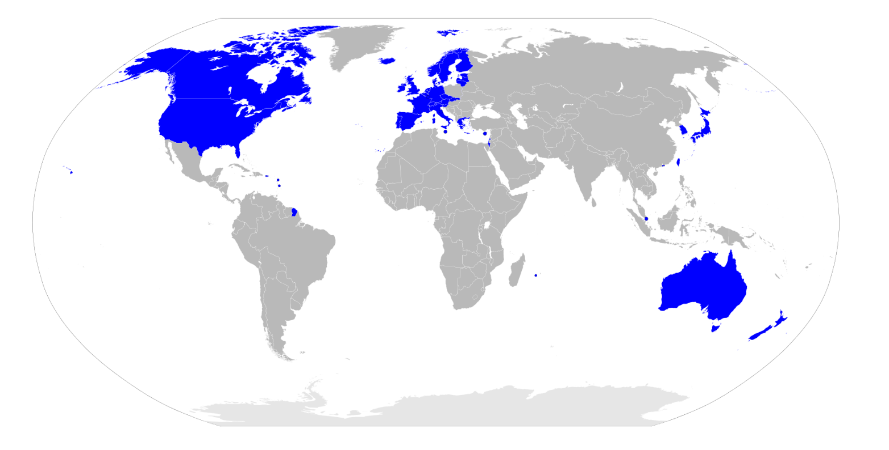

経済分野　復習用資料集  
  
  
  
　この資料は、高校公民の政治分野をまとめたものです。  
　言ってみれば、「私家版教科書　高校公民　経済分野」です。  
  
  
  
  
●凡例  
【】：極めて重要度の高いもの。何を措いても暗記するもの  
［］：高得点を目指すなら、また私大受験とかを考えているのであれば覚えておいた方がいいもの  
  
  
  
  
目次  
  
############# [経済分野第一章　経済の仕組み5]()  
###################### [資本主義6]()  
################################ [●資本主義とは6]()  
################################ [●資本主義の修正9]()  
################################ [●資本主義の理論15]()  
###################### [社会主義22]()  
################################ [●社会主義とは22]()  
################################ [●社会主義の修正23]()  
################################ [●社会主義の理論25]()  
###################### [資本主義と社会主義のまとめ28]()  
###################### [経済の三主体29]()  
###################### [需要供給曲線31]()  
################################ [●需要供給曲線の概説32]()  
################################ [●平行移動34]()  
################################ [●価格弾力性37]()  
###################### [市場の失敗40]()  
################################ [●独占市場40]()  
################################ [●その他の市場の失敗とその対処47]()  
###################### [企業とは49]()  
################################ [●企業の分類49]()  
################################ [●株式会社と資金調達52]()  
################################ [●営利企業の非営利活動55]()  
###################### [通貨とは何か56]()  
################################ [●商品貨幣と信用貨幣56]()  
################################ [●市場に流通する通貨59]()  
###################### [フローとストック63]()  
################################ [●フローとストック概説63]()  
################################ [●（広義の）国民所得64]()  
################################ [●国富69]()  
###################### [経済成長率70]()  
################################ [●経済成長率概説70]()  
################################ [●経済成長率の計算方法71]()  
###################### [景気変動とインフレ、デフレ72]()  
################################ [●景気変動をインフレ、デフレから見る72]()  
################################ [●景気変動の周期76]()  
################################ [●インフレ、デフレ色々76]()  
###################### [財政、予算、会計78]()  
################################ [●財政78]()  
################################ [●予算と会計81]()  
###################### [金融政策と銀行83]()  
################################ [●日本銀行83]()  
################################ [●市中銀行86]()  
###################### [税88]()  
###################### [国際経済の仕組み91]()  
################################ [●為替の変動91]()  
################################ [●貿易取引の仕組み98]()  
################################ [●国際分業100]()  
################################ [●国際収支102]()  
############# [経済分野第二章　社会福祉105]()  
###################### [労働問題106]()  
################################ [●労働問題の歴史107]()  
################################ [●労働三法（労働基準法）109]()  
################################ [●労働三法（労働組合法、労働関係調整法）114]()  
################################ [●今日的な労働問題118]()  
###################### [社会保障122]()  
################################ [●整理122]()  
################################ [●欧米の社会保障の流れ123]()  
################################ [●日本の社会保障125]()  
###################### [今日的な福祉問題138]()  
################################ [●人口問題138]()  
################################ [●老人福祉問題141]()  
###################### [消費者問題142]()  
################################ [●概要と消費者基本法142]()  
################################ [●様々な消費者保護143]()  
###################### [公害問題、環境問題146]()  
################################ [●歴史的経緯の概略146]()  
################################ [●具体的な公害対策、環境問題対策148]()  
############# [経済分野第三章　戦後国際経済史152]()  
###################### [国際経済通史157]()  
################################ [●戦後の貿易体制157]()  
################################ [●1980年代までの通史161]()  
###################### [国際経済テーマ史172]()  
################################ [●新IMF体制の諸特徴172]()  
################################ [●ソ連の死とロシアの復活173]()  
################################ [●2000年代の金融危機179]()  
################################ [●地域統合184]()  
################################ [●2010年以降の国際経済202]()  
################################ [●1980年代以降のGATT／WTO205]()  
################################ [●南北問題208]()  
############# [経済分野第四章　日本経済史214]()  
###################### [明治維新から終戦まで214]()  
###################### [終戦直後218]()  
################################ [●三大経済民主化218]()  
################################ [●戦後混乱期221]()  
###################### [高度経済成長期226]()  
################################ [●第一次高度経済成長期227]()  
################################ [●転換期229]()  
################################ [●第二次高度経済成長期230]()  
################################ [●高度経済成長期の特徴231]()  
###################### [安定成長期234]()  
################################ [●安定成長への転換235]()  
################################ [●ポストオイルショック236]()  
################################ [●日米貿易摩擦239]()  
################################ [●バブル景気243]()  
###################### [失われた三十年246]()  
################################ [●バブル崩壊247]()  
################################ [●橋本内閣という端緒250]()  
################################ [●小泉内閣という決定打255]()  
################################ [●実感なき経済成長258]()  
################################ [●大不況、アベノミクス、そして現代へ260]()  
###################### [日本経済テーマ史263]()  
################################ [●産業構造の転換263]()  
################################ [●中小企業267]()  
################################ [●農業270]()  
################################ [●地方と都市の格差275]()  
****  
  
  
# 経済分野第一章　経済の仕組み  
  
　経済は、一般的な感覚とは異なる。それこそ、家計とは異なる。無論、家計と同じ感覚でいい場合もあるが、家計と同じ感覚だと話がおかしくなる場合も多い。ここでは、いわゆる合成の誤謬というものを例に挙げよう。  
　ある企業の業績が悪化したとする。そういう時は、まずは無駄をなくして節約する、つまり支出を抑えようとするのが一般的である。その為に、不要な社員を解雇したり、社員の給料を減らしたりするというのも一般的な対応である。この対応は、「支出を抑える」という家計的な感覚によるものである。そしてまた、その観点から見てこの対応は合理的なものであり、実際、少なくとも短期的には会社によい効果をもたらすだろう。  
　しかし、これが一企業の対応に留まらないとしたら。  
　国中のあらゆる企業が、社員を解雇したり、社員の給料を減らしたりしたら、どうなるだろうか。  
　企業の社員とは、企業に勤めて商品を生産する労働者であると同時に、市場に流通する商品を買う消費者でもある。そして企業が生産する商品の大多数は、この労働者兼消費者が購入する。企業の経営者は金持ちなので、労働者兼消費者の何倍も消費するが給料の割には使わないし、そもそも数が少なすぎる。やはり大多数の商品は、労働者兼消費者によって購入される。  
　さて、この労働者兼消費者の収入がなくなったり（解雇）、減ったり（給料減）すれば、どうなるか。当然、必要なもの以外買わなくなる。と言うか、買えなくなる。つまり、企業の生産する商品が、売れなくなってしまう。こうして、企業の商品は売れなくなり、業績は悪化する。  
　「支出を抑える」という行為は、少なくとも短期的に見れば効果がある筈だし、また合理的な行動であった筈である。しかし、国中のあらゆる企業が行う事によって、むしろ自分の首を絞める結果に陥ってしまう。このようなものを、「合成の誤謬」という。  
　このように、経済は一般的な感覚で考えると大きな間違いを起こしてしまう。先の例は、1980年代の新自由主義の台頭後（自由権重視が再び強まった後）、実際に起きている事である。このような間違いは、一つには、人々が経済を一般的な感覚で、家計のような感覚で捉えてしまったからこそ起きている。だからこそ、この経済分野で、経済についてしっかり学んでほしい。  
  
## 資本主義  
  
## ●資本主義とは  
○資本主義の基本  
・本節ではまず、誕生した直後の資本主義を例にして、資本主義とは何かを見ていく  
・資本主義は、【産業革命】と市民革命のあった、革命の時代に発生した  
⇒十八世紀以前。名誉革命、アメリカ独立戦争、フランス革命といった革命が続いた、革命の時代。自由権が重視された時代。資本家が時代をリードし、資本家の「もっと自由に金儲けさせろ」が最大限尊重された時代。この時期に、資本主義が完成する。この時期の資本主義を、例に採る  
  
・一般的に、資本主義経済とは、以下のように定義される  
定義：【生産手段】の【私有】を認めるという意味での【私有財産制】を認める経済  
・生産手段とは、商品を生産する為の手段。工場、機械、土地など  
※一般的には、私有財産制と言ったら財産の私有（個人による所有）を認めるもの。但しこの場合は、生産手段の私有を認める、という意味で使われている、という事  
  
・この時期に儲けるとしたら、工場の機械を動かして商品を生産し、それを売るのが基本  
・この工場とか機械を持っているのが、金持ち。いわゆる【資本家（ブルジョワジー）】  
・金持ちでない一般人は、こういう生産手段を持っていない。いわゆる【労働者（プロレタリアート）】  
  
・生産手段（工場とか機械）は、持ってるだけじゃ意味がない  
・動かして、商品を生産しなければ意味がない  
・資本家一人で工場の機械全部動かす訳にもいかない  
・そこで、労働者に工場で働いて貰う。代わりに資本家は、労働者に金を払う  
⇒つまり、資本家は［生産手段］を提供し、労働者は［労働力］を提供するという関係になる  
  
|                      |                                              |                                                        |  
|----------------------|----------------------------------------------|--------------------------------------------------------|  
|労働者と資本家、対照表|                                              |                                                        |  
|                      |資本家                                        |労働者                                                  |  
|生産手段              |持っている                                    |持っていない                                            |  
|労使関係              |労働者に、工場で機械を使わせる労働者に金を払う|資本家の工場で、資本家の機械を使う労働力を提供する      |  
|本音                  |労働者に金払いたくない労働者を長時間働かせたい|資本家は俺達にもっと金を払え資本家は俺達をもっと休ませろ|  
  
  
  
○資本主義の誕生  
  
・十八世紀をはじめとする革命の時代に、資本主義経済は誕生した  
・誕生したばかりの頃の資本主義は、［産業資本主義］などと呼ばれる  
  
・革命の時代以前の工業は、［手工業］だった  
⇒代表が［工場制手工業（マニュファクチュア）］。工場に人を集めて手作りする  
・革命の時代に産業革命が発生し、機械で大量生産できるようになった  
⇒工場制手工業から、［工場制機械工業］へ進化した  
・ここから、工場に労働者と機械を集めて大量生産し、儲ける産業資本家が登場した  
・この産業資本家が中心となって経済を回すのが［産業資本主義］である  
  
・ところで、いつの世にも金持ちはいるから、資本家の存在は分かるだろう  
・問題は労働者。労働者はどこから来たのか？  
・と言うのは、一般に中世とか近世の庶民というと、農民を思い起こす筈である  
・そして農民というのは普通、自分の土地を耕して農業をしている  
⇒つまり農民は普通、「自分の土地」という生産手段を持っている  
・生産手段を持たない労働者。彼らは何処から来たのか？  
  
・実は彼らは、没落した農民が主である  
・近世の欧州は、農民の間で格差の拡大が進行した時代でもある  
・その格差拡大の中で、没落した（貧乏になった）農民は自分の土地を失い、小作人となっていった  
⇒自分の土地を持たず、他人の土地を借りて耕している農民  
・こういう没落農民達が、工場に集まって賃金労働者になっていくのである  
・逆に、没落しなかった農民は地主等の富裕層となり、やがて産業資本家となっていく  
⇒言ってみれば、近世に農民内で貧富の格差が拡大した事によって、資本主義経済に必須の「資本家」と「労働者」が揃った、とも言える。こういう、資本主義の前提が揃う動きの事を［資本の本源的蓄積］と呼ぶ事がある  
※ただ、最近は「これ貧富の格差が拡大してどうこうじゃなくて、農業技術が進んで農作物が沢山取れるようになって人口が増えて、その増えた人達が工場労働者になっただけじゃない？」みたいな説が出てきています。産業革命発祥の地イギリスなんかでは、これが有力です  
  
  
```  
大商人  
```  
  
```  
資本家  
```  
  
```  
農民  
```  
  
```  
地主  
```  
  
```  
小作人  
```  
  
```  
労働者  
```  
  
```  
没落  
```  
  
```  
富裕化  
```  
  
```  
資本の本源的蓄積図  
```  
  
```  
近世絶対王政期  
```  
  
```  
革命の時代、資本主義期  
```  
  
  
○利潤追求  
・資本主義経済はまた、（特に資本家による）【利潤の追求】を認める体制である  
  
・ある生産設備で生産が繰り返される事を【再生産】と言う  
・ところで、商品が売れれば売れるほど、資本家は儲かる  
・資本家は普通、利潤を追求する（利益を増やそうとする）ので、商品を大量に生産しようとする  
・つまり、資本主義経済では【拡大再生産】が基本となる  
⇒工場で商品を生産する。それで儲かる。儲かったら、更に儲ける為に工場や機械を増やす。また工場で商品を生産する。また儲かる。儲かったら…と繰り返す  
  
・では、民間の資本家が拡大再生産している間、政府は何をするか  
・この時期の政府の経済政策は【自由放任（レッセ・フェール）】が基本となる  
⇒この時期は、「俺達にもっと自由に金儲けさせろ」という自由権が重視された時代。故にこの時期の政府の理想は【夜警国家】。国防とか治安維持みたいな最低限の事しかしない、小さな政府。政府が何もせず、市場の資本家が自由に競争すれば、【「神の見えざる手に導かれて」】経済は発展する（【『国富論』】の【アダム・スミス】）という考え方が、この時代の経済観  
  
・つまるところ、資本主義経済に於いては、経済は［無計画］経済である  
・言い方を変えれば、資本主義経済は［無政府］性を持つ  
・無計画である以上、需要と供給が一致しない事態は起こり得る  
・当然、過剰供給による売れ残りや、それによる企業の業績悪化、倒産等も起こり得る  
・ひいては、「好景気⇒不況⇒回復期⇒好景気…」みたいな【景気変動（景気循環）】も避けられない  
・また、不況が避けられない以上、【失業者】の発生も避けられない  
  
## ●資本主義の修正  
・資本主義の誕生は既に見たので、その後資本主義がどう変わっていったかを見ていく  
  
  
### ○十九世紀後半～二十世紀初頭  
・次の諸図で説明するような事態が進行していった  
  
  
```  
A社  
```  
  
```  
B社  
```  
  
```  
C社  
```  
  
```  
D社  
```  
  
```  
独占資本主義図その  
一  
```  
  
```  
某国国内市場  
```  
  
```  
E社  
```  
  
```  
F社  
```  
  
```  
G社  
```  
  
```  
H社  
```  
  
```  
I社  
```  
  
```  
J社  
```  
  
```  
K社  
```  
  
```  
L社  
```  
  
```  
M社  
```  
  
```  
M社  
```  
  
```  
N社  
```  
  
```  
※様々な資本家の作った様々な企業が自由に競争するのが、初期の資本主義  
```  
  
  
  
```  
A社  
```  
  
```  
B社  
```  
  
```  
C社  
```  
  
```  
D社  
```  
  
```  
独占資本主義図その  
二  
```  
  
```  
某国国内市場  
```  
  
```  
E社  
```  
  
```  
F社  
```  
  
```  
G社  
```  
  
```  
H社  
```  
  
```  
I社  
```  
  
```  
J社  
```  
  
```  
K社  
```  
  
```  
L社  
```  
  
```  
N社  
```  
  
```  
O社  
```  
  
```  
※自由競争の世界なので、勝ち負けが出る。勝者は敗者を吸収する  
```  
  
```  
M社  
```  
  
  
  
```  
A社  
```  
  
```  
B社  
```  
  
```  
C社  
```  
  
```  
D社  
```  
  
```  
独占資本主義図その  
三  
```  
  
```  
某国国内市場  
```  
  
```  
E社  
```  
  
```  
F社  
```  
  
```  
G社  
```  
  
```  
H社  
```  
  
```  
I社  
```  
  
```  
J社  
```  
  
```  
K社  
```  
  
```  
L社  
```  
  
```  
M社  
```  
  
```  
M社  
```  
  
```  
N社  
```  
  
```  
※大企業の方が、中小企業より強い。勝者はひたすら勝ち続ける  
```  
  
  
  
```  
A社  
```  
  
```  
B社  
```  
  
```  
C社  
```  
  
```  
D社  
```  
  
```  
独占資本主義図その  
四  
```  
  
```  
某国国内市場  
```  
  
```  
E社  
```  
  
```  
F社  
```  
  
```  
G社  
```  
  
```  
H社  
```  
  
```  
I社  
```  
  
```  
J社  
```  
  
```  
K社  
```  
  
```  
L社  
```  
  
```  
M社  
```  
  
```  
M社  
```  
  
```  
N社  
```  
  
```  
※やがて、一部の大企業による寡占状態となる  
```  
  
  
・資本主義経済に於ける競争というのは、カネを多く持っている方が強い  
・また産業資本主義は、利潤追求を肯定し、政府は介入せず自由競争に任せる  
・この二つの合わせ技が問題だった  
  
・カネを多く持っている方が強いので、勝者となった大企業はそのまま勝ち続ける  
・しかも自由放任で政府が介入しないので、弱い企業の救済策や逆転要素も特にない  
・結果、勝ち続けた少数の企業が、経済を支配するようになってしまうのである  
  
・こうした、企業が巨大化していく流れを［資本の集積］［資本の集中］などと言う  
⇒ある一社が利潤を追求した結果巨大化するのを資本の集積という。そうやって巨大化した、少数の巨大企業が結託するのを資本の集中という。［カルテル］、［トラスト］、［コンツェルン］などと呼ばれるのは後者  
・また、少数の巨大企業によって支配される資本主義を、［独占資本主義］と言う  
・一方、経済を支配する少数の巨大企業については、［独占資本］と言う  
  
・ちなみに十九世紀後半～二十世紀初頭は、［植民地］獲得競争が盛んに行われた時期でもある  
⇒こういう、植民地を獲得するべく他国を征服したり、戦争したりするのを［帝国主義］という  
・この時期の植民地獲得競争は、［独占資本］によって主導された面もある  
⇒この頃になると、独占資本が更なる拡大再生産を行っても、もう国内には商品が行き渡り切っていて売上が増えない、という状況になっていた。そこで、他国の領地を切り取って植民地とし、増産した商品を植民地の住人に売りつけて儲けようとしたのである  
※勿論、この時期に植民地獲得競争が行われたのはこれだけが原因ではなく、「植民地」の名前の通り、増えすぎた人口を植民させる土地を求めてのものでもある。第二次世界大戦ぐらいまでは、欧米列強の先進国でさえ、ちょっと人口が増えすぎるとすぐ飢饉になる危険と隣り合わせであった。1940年代から1960年代にかけて起こった緑の革命が終わる事で、ようやく「先進国では普通、飢饉は起きない」になったのである。故に世界大戦以前の世界では、各国は、増えすぎた人口を植民させる土地を求めたのである。大日本帝国が満洲を取ろうとしたのにも、ドイツ国が東へ拡大しようとしたのにも、そういう意味がある  
  
・尚、独占資本主義期末期の1917年、社会主義革命によってソ連が誕生している  
  
### ○1930年代～1980年代  
・独占資本主義は、1920年代には絶頂期を謳歌した  
・特にアメリカ合衆国は、今でもアメリカの黄金時代と語り継がれる黄金の20年代を楽しんだ  
・が、その絶頂期は唐突に終わる。1929年の世界恐慌である  
  
  
```  
A社  
```  
  
```  
B社  
```  
  
```  
C社  
```  
  
```  
D社  
```  
  
```  
独占資本主義図その  
四  
```  
  
```  
某国国内市場  
```  
  
```  
E社  
```  
  
```  
F社  
```  
  
```  
G社  
```  
  
```  
H社  
```  
  
```  
I社  
```  
  
```  
J社  
```  
  
```  
K社  
```  
  
```  
L社  
```  
  
```  
M社  
```  
  
```  
M社  
```  
  
```  
N社  
```  
  
```  
※やがて、一部の大企業による寡占状態となる  
```  
  
  
・先に、独占資本主義は↑こういう風に、少数の巨大企業による寡占状態と述べた  
・これ、悪いところが沢山あるが、一番まずいのは「一社でも傾いたらヤバい」という事である  
※他の悪いところは、『市場の失敗』でやります  
  
・「一社でも傾いたらヤバい」とはどういう事か？  
・例えば先の図で言えば、G社でもI社でもいいが、傾いて大リストラを断行したらどうなるか？  
・物凄い数の失業者が出る。その上、再就職先は殆ど無いのである。それだけで大不況は不可避になる  
・これがもし、A社もG社もI社も、一斉に傾いたらどうなるか？  
・それが現実に起き、しかも世界規模でドミノ倒しとなったのが、世界恐慌である  
  
・ここにきて、産業資本主義以来の【自由放任】はマズいという話になる  
⇒「景気変動は避けられないものだから不況ってのは必ず来るし、仕方ない」「放っておけば勝手に回復期に入って、また好景気になる」等とは言っていられないほどの大不況になった  
※例えば、ドイツ国では通貨の価値が完全に破壊され、パンを買うにもトランクいっぱいの紙幣が必要になるほどであった。これで「仕方ない」「ほっとけばまたよくなる」とか言えるのは異常者ぐらいである  
  
・本来自由放任を旨とした資本主義は、この挫折を機に【修正資本主義】となっていく  
・【福祉国家】的な【大きな政府】路線が、世界のトレンドとなる  
⇒産業資本主義以来の保守的（自由主義的）な理想は、【夜警国家】を理想とする【小さな政府】路線。またこの辺りから、【自由権】を制限して【社会権】を重視しよう、という流れも強くなっていく  
※勿論、世界恐慌とは別に、当時既にソ連が誕生していた、というのも福祉国家・大きな政府路線を後押しした。「労働者を虐め過ぎると革命が起きる」という感覚が、大企業の自由を制限して社会権を重視しよう、という意識を生んだ  
  
  
・修正資本主義下の大きな政府に於いては、政府が市場に介入し、景気を上向かせる政策を行う  
・このように、計画を立てて経済に介入する事を【経済計画】という  
・主なところではやはり、公共事業  
⇒国が金を出して高速道路を作る、ダムを作る、競技場を作る等々  
・こういう政策に理論を提供したのがジョン・メイナード・【ケインズ】  
⇒政府が市場に介入して公共事業等で経済を活性化させよう、と考える事を【ケインズ主義】と呼ぶ  
※必ず公共事業でなければならない訳ではない。要は「不況なんだから仕事がなくて当然、仕事がなきゃ労働者の懐には給料が入らない、給料がなければ人々はカネを使わない、カネが使われないのであれば企業の商品は売れない、だから余計に不況が酷くなる」「だから、政府が労働者の仕事を提供してやれ」という話。故に公務員を増やすとかでも構わないのだが、普通、「政府が労働者の仕事を提供」すると言うと公共事業の増加に行き着く。なのでこの後の話でも、代表例として公共事業を挙げ続けます  
  
・著名な例として、アメリカ合衆国の【ニューディール政策】がある  
※実施したのは大統領【フランクリン・Ｄ・ルーズベルト】。米国が第二次世界大戦へ参戦した時の大統領でもあり、ソ連が大好きな大統領でもあり、第二次大戦末期に死んだ後米ソ関係が急速に悪化した、あの大統領である  
・この政策では、政府が金を出して［テネシー河］にダムを作る等の公共事業を実施した  
・世界恐慌で大量に出た失業者が、この公共事業関連会社に就職した  
⇒失業者が多ければ不景気になるし、失業者が少なければ不景気から回復する  
※実際には、ニューディール政策は世界経済のみならず米国経済を復活させるにも不充分だった。大きな政府路線による、政府が市場に介入して不況から回復させる政策には、カネを大量に、ドバドバと注ぎ込む必要がある。ここで尻込みして投入するカネを惜しむと、「効果はあるにはあったけど結局不況のままですよね」になる。これはニューディール政策でも、現代日本の第二次安倍政権によるアベノミクス政策でも変わらない。実際、ニューディール政策は不充分だった為、米国経済が本格的に復活したのは第二次世界大戦参戦後である。「戦争だから」という大義名分を得てカネを市場にドバドバ突っ込んだ結果、米国経済は完全に復活した  
  
・尚、ニューディール政策はダム建設ばかりが注目されるが、実際には他にもやっている  
・特に、［社会保障］法を制定したのは重要と言える  
⇒何せ米国は伝統的に自由権重視で、今でも社会保障が死ぬほど貧弱である。そんな伝統を持つ米国で、例えば［ワグナー法］のような労働者保護法が制定された。それほどまでに、世界恐慌後の混乱は凄かった  
※ちなみに、2008年のリーマンショックに端を発した世界的な不況に際して、当時のオバマ大統領は、［グリーン・ニューディール政策］というのをやっている。名前は勿論、ルーズベルトのニューディール政策から引っ張ってきている  
  
### ○1980年代～現在  
～ここから引用～  
・冷戦という、資本主義＆自由主義国家vs共産主義＆全体主義国家の対立がこの頃、終わる  
⇒「金持ち殺しましょうよ」攻勢がなくなり、「労働者を虐め過ぎたら革命になる」という恐怖が薄まった  
・また、福祉国家の行う公共事業というのは、要するにバラマキという側面がある  
・不況の時は、国民が皆、仕事がなくて金もないという状況なので当然バラマキが必要  
・一方で、好景気でも不況と同じ調子で金をバラマキ続けると【財政赤字】が積もる  
・また、長くバラマキ続けると、政府と業者の癒着等も起こってくる  
  
・こうして、【財政赤字解消、政治腐敗の防止】等を目的に、また、革命の恐怖がなくなった事も背景に、再び【自由権】を重視した【小さな政府路線】へ向かう  
例：日本の【中曽根】首相、アメリカの【レーガン】大統領、イギリスの【サッチャー】首相ら  
※これがいわゆる、［新保守主義（ネオコンサバティズム）］と［新自由主義（ネオリベラリズム）］による現代的な国家  
～ここまで引用～  
  
・要するに、修正資本主義（もしくはケインズ主義）には大きく二つの柱があった  
１：ソ連の存在。「労働者を虐め過ぎると革命が起こる」という恐怖  
２：不況の存在とその解消  
  
・が、1980年代ごろには、修正資本主義をもってしても経済が伸び悩むようになる  
⇒実を言うと、この時経済が伸び悩むようになった理由は、今となってもよく分かっていない。この辺の話はまた後でするので、今は↓のように解釈するといい  
⇒「修正資本主義の公共事業とかは、言ってみれば不況対策。不況でもないのにずーっとやっていれば、それはおかしくなるに決まっている」  
※実際、修正資本主義の元になったケインズ自身は、「好景気になったら増税して公共事業も減らせ」と言っている。だが多くの国は、好景気になっても公共事業をやり続けたし、増税もしなかった  
  
・ここから、【反ケインズ主義】が力を持つようになる  
⇒政治的な反ケインズ主義が新保守主義、経済的な反ケインズ主義が新自由主義、と考えてもいい。かつての産業資本主義の時代のように、政府は市場に介入せず、「神の見えざる手」に任せるのがいい、とする立場が力をつけた  
・また、1990年代ソ連自体が消滅し、革命の恐怖も消えた  
・こうして、再び時代は【小さな政府】路線へ向かう  
  
・例えば日本国で、この小さな政府路線を決定的にしたのは【小泉純一郎】政権である  
・この時期、【郵政民営化】に代表される［特殊法人］の統廃合、民営化が大々的に推進された  
・また、【規制緩和】によって、自由な競争を奨励した  
  
  
・そして令和二年現在  
・産業資本主義～独占資本主義の時期にあったような問題が、再び起こるようになっている  
⇒それこそ、「独占資本主義かな？」というぐらい中小企業が淘汰され、大企業による独占市場が様々な業種で誕生している。GAFA(Google/Apple/Facebook/Amazon)という単語は、まさに現代が独占資本主義の状態にある事を証明しているものとも言える  
  
・では、具体的にどのような問題が起こってきているか。日本を例に採ろう  
・例えば規制緩和により、極めて制限された形でしか使えなかった派遣社員が大々的に使えるようになった  
・資本家からしてみれば、正社員より派遣社員の方がいい  
⇒正社員は給料も高いし、いつでもクビにできる訳でもない。一方派遣社員は非正規雇用なので給料が安く済み、いつでもクビにできる。だから資本家は正社員を採用しなくなり、派遣社員ばかり使うようになった。こうして、誰も彼もが派遣社員に、非正規雇用になり、いつクビを切られるか分からない低賃金労働に従事せざるを得なくなった  
  
・更には、資本家はカネのかかる日本人を雇いたくないとすら考えるようになる  
⇒移民の推進を政治家に働きかけたり、工場を海外に移したり。また、外国人技能実習生（その名の通り、外国人の実習生）を実質的な奴隷労働者としてこき使っている企業もある。こうして、一般日本人はどんどん貧乏になっていき、ごく一部の資本家だけが金持ちになっていく  
  
・当然、こうなると、反新自由主義や「また修正資本主義にしよう」という動きが出てくる  
・米国の例だが、トランプ政権誕生などは、その実例と言える  
⇒トランプ政権の方針の一つが、「アウトソーシングをやめろ、賃金の安い国に外注するな。アメリカに工場作ってアメリカ人を雇い、アメリカでモノを作れ」である。まさしく反自由主義  
  
～ここから雑談～  
　「同じ話を繰り返してるなこいつら」と思ったと思います。  
　ぶっちゃけた話、経済政策なんて「上り調子の時はほっとく」「好景気の時は、調子に乗り過ぎて世界恐慌みたいな事にならないような政策をする」「不景気の時は、景気が上向くような政策をする」でいいんですよね。  
　なのに、「自由放任の自由主義経済こそいついかなる時も最高だ！」「いや、公共事業でバリバリ雇用を生み出す政策こそいついかなる時も最高だ！」みたいな事をやるから、こういう事になる。  
～ここまで雑談～  
  
## ●資本主義の理論  
・資本主義の経済理論について、時系列順に見ていく  
・尚、資本主義以前の経済理論についても取り扱う  
  
  
### ○資本主義以前  
・近世絶対王政期の欧州経済は、基本的に【重商主義】経済だった  
・重商主義と言っても多種多様だが、共通して「国が商工業を支援する」類の経済である  
・重商主義を唱えた有名人から一人挙げるなら、イングランド王国の【トーマス・マン】  
⇒重商主義の中でも特に【貿易差額主義】を提唱した男。要するに、自国の商工業を保護したり育てたりして、輸入よりも輸出の額を大きくすれば儲かるよね、というもの  
  
・重商主義の後の経済理論というのは、重商主義への批判を伴って出てくる  
・誕生したばかりの資本主義が自由主義と一緒に出てくるのは、これが理由でもある  
⇒重商主義は基本、「国が商工業を支援する」類のもの。つまり、国が経済活動に口を出す類のもの。一方、誕生したばかりの資本主義は、アダム・スミスの「神の見えざる手」に代表される、「国は民間の経済活動に口を出すな」「俺達にもっと自由に金儲けさせろ」という自由権の重視と共に出てくる  
  
・［重農主義］も、重商主義への批判を伴って出てきた理論  
・名誉革命後、フランス革命以前の時期に、自由放任を唱えた  
・この自由放任の発想は、後に資本主義へ影響を与える  
  
  
### ○古典派経済学  
・フランス革命に前後して、自由放任による資本主義を唱える経済学者が次々と登場する  
・この時期の経済学者達を、【古典（派）経済学者】と言う  
・この古典派経済学は、当時最盛期を迎え世界の覇権国として君臨した大英帝国で発展した  
  
・古典派経済学でいの一番に出てくるのは、やはり【『国富論』】の【アダム・スミス】である  
⇒政府が何もせず（つまり【自由放任（レッセ・フェール）】）、市場の資本家が自由に競争すれば【「神の見えざる手に導かれて」】経済は発展する、というのが彼の理論の骨子であり、また古典経済学の骨子  
※拡大再生産で商品を増産⇒供給拡大⇒合わせて需要も拡大⇒また拡大再生産⇒また供給拡大⇒合わせてまた需要も拡大…という風に、需要と供給は［自動調節］される、という楽観的な考え方。これを［セーの法則］とか言う。「皆が最善の努力をすれば、社会全体が理想の形になる」というプロテスタント的な考え方  
  
・他にも有名な古典経済学者はいる。例えばデイビッド・【リカード】である  
⇒主要著書は【『経済学および課税の原理』】  
・リカードは【自由貿易】を擁護する【比較生産費説】を展開した  
⇒アダム・スミスの「自由競争すれば経済はよくなる」論を、世界全体に拡大したもの。世界中で自由に競争すれば経済はよくなる、だから自由貿易をしよう、という考え方  
・また、【労働価値説】も提唱した  
⇒商品の価格は、商品生産に必要な労働力で決まる、というもの  
  
・著名な古典経済学者ではあるが、一風変わった部分が有名なのは【『人口論』】の著者である  
・即ち、トーマス・ロバート・【マルサス】である  
・以前から言っているように、「先進国では普通、飢饉は起きない」は緑の革命以降の話  
⇒緑の革命は1940年代から1960年代にかけて起こった。これ以前の農業生産量というのは、極めて貧弱であり、欧米列強の先進国でさえ、ちょっと人口が増えすぎるとすぐ飢饉になった  
・故に、増えすぎた人口を植民させる土地が必要とされ、植民地獲得競争が行われた訳だが…  
・マルサスは、この事をズバリ『人口論』で指摘したので有名である  
⇒人口は［幾何（等比）］級数的に増加するのに対し、食糧は［算術（等差）］級数的にしか増加しない、と述べた。要するに、人口はアホみたいに増えるものだが食糧生産は全然増えねぇぞこれ、と言った  
※更に、社会保障をやめて貧乏人を死なせるとか、戦争やって人を死なせるとか、そうやって人口を調整しないと、人口爆発からの農作物不足で人類社会が破裂しますよ、というような事も言っている人である。冷酷なようだが、自由権を重視すると「無能が貧乏なのは自己責任だろ努力しろ。貧乏から抜け出せないのは無能で怠惰だからだ」になりがちで、マルサスはこの自由権を重視した古典経済学者の重鎮である。んでしかも人口爆発を指摘した訳だから、そりゃそうなる  
  
・古典派経済学最後の巨人と言えるのが［ジョン・ステュアート・ミル（J.S.ミル）］である  
・彼はリカードの論を批判しつつも、更に発展させた  
・例えば労働価値説について、商品の価格は賃金、地代、利潤の三要素から決まる、と主張している  
  
  
  
### ○古典派経済学の批判  
・ちなみに、古典経済学華やかなりし時代からして既に、古典経済学が全肯定されていた訳ではない  
・ある意味J.S.ミルも、古典派経済学の批判者という面がある  
⇒例を挙げれば、弱者救済とかやらなきゃいかん、と言っている。マルサスは弱者を死なせてでも人口調節しなきゃ、と言ってた訳で…  
  
・ここでは、批判者としてヴュルテンブルク公国生まれの経済学者フリードリヒ・［リスト］を挙げたい  
※ドイツが統一に向かいつつも、まだ統一されていない、ぐらいの頃の経済学者。主著は［『経済学の国民的体系（政治経済学の国民的体系）』］  
・彼は、古典経済学で最良の貿易として主張された、自由貿易を批判した人物である  
・この自由貿易、実は、いつの時代何処の地域でも、経済的に強い国は主張するものである  
  
・強い国は、優秀な製品を比較的低価格で生産できる  
・弱い国は、同じ品質のものを作れなかったり、作れても価格が高かったりする  
・だから強い国は、自由貿易を主張する  
⇒自由貿易とは要するに、「関税とかかけるんじゃねぇ。どの国のどの商品も同じ土俵で勝負しようや」である。そりゃ強い国は自由貿易を主張するに決まっている。強い国の商品は安くて高品質なのだから、輸出すればするほど売れる。そして弱い国の国産品は売れなくなり、国内の産業は死ぬ  
※関税は、輸入品にかけるもの。これを高く設定すれば、「本来なら輸入品の方が安いのに、高い関税がかかってるせいで国産品の方が安い」という状況も作れる  
  
・こういう現実を受けたリストは、「最強国家以外は［保護貿易］が必要」とした  
⇒自由貿易をやると国産商品が、強国の高品質低価格な輸入商品に完全敗北し、国内産業が死ぬ。これを防ぐには、高い関税をかける等の保護貿易が必要だ、という論。実際、例えば今の日本の農業は、関税によって守られていなければとっくの昔に壊滅している。2019年に発効した日欧EPAでチーズの関税が撤廃となった際、「ただでさえ死にかけの日本の酪農を殺す気か」と騒がれたのにはそういう事情がある  
  
・ちなみに。保護貿易をする方法は主に二種類ある  
・一つは、高い関税をかけて、輸入品の値段を上げるもの。いわゆる［関税］障壁  
・もう一つは、［非関税］障壁である  
⇒［輸入数量］を制限したり、［入関］手続や［検疫］手続を複雑化したり。そういうのでも、輸入品を減らし、自国産業を保護する事は可能である  
  
### ○修正資本主義下の理論  
・修正資本主義下（福祉国家期）第一の経済学者は、やはりジョン・メイナード・【ケインズ】である  
・代表作は［『雇用、利子及び貨幣に関する一般理論』］  
  
・ケインズの理論と古典経済学で一番違うのは、【需要】と【供給】どちらを重視するかである  
・古典経済学は「商品を作れば作るほど売れる」という立場  
⇒セーの法則なんかまさにこれ。供給が増えれば需要も拡大する、という考え方  
・「買う側に金がねぇのに商品増産したって、売れる訳ねぇだろ」と言ったのがケインズ  
・故にケインズ主義では、需要を重視する  
⇒より正確に言えば、「消費者がきちんと金を払える」という前提に立った、健全な需要。そういう需要が増えれば、合わせて供給を拡大していけばいい、という考え方である。このような需要を、【有効需要】という  
  
・修正資本主義下（ケインズ主義下）の大きな政府は、政府が市場に介入する  
・主なところでは、公共事業を行う。国が金を出して高速道路とかダムとか競技場を作る  
・何故こんな事をするのか？　勿論、有効需要を増やす為である  
・例えば、国が金を出して高速道路を作る事とし、人々は高速道路を作る会社に就職する  
・人々は職を得て給料が支払われるので、モノを買えるようになる  
・これは見方を変えれば、需要が生まれるという事でもある  
・だから商品の供給を増やしても、ちゃんと売れる  
・商品が売れるのであれば、景気はよくなるし、新しい会社を作ろうという機運も出てくる  
・そうなれば新しい雇用が生まれて、そこに就職した人はまた給料を得てモノを買えるようになる  
・つまり需要が生まれるので、商品の供給を増やしても問題なくなり…と、後は繰り返し  
⇒こういうのをケインズは、一つの公共投資が［呼び水］となって他の投資に拡大する［乗数］効果によって景気が回復する、と表現した  
  
・また、商品の価格についても、需要が大事だとしたのがケインズである  
・古典経済学では、リカードが労働価値説を唱え、J.S.ミルは価格を決める三要素を唱えた  
⇒どちらも、供給側の視点からのみ商品の価格を論じた  
・一方ケインズは、【限界効用価値説】を唱えた  
⇒要するに、「作るのにどんなにカネがかかってたって、需要がなきゃ売れないんだから、値段下げるでしょ」「って事はつまり、商品の価格を決めるのは需要だよ」という理論  
  
・他にケインズの行った古典経済学批判としては、失業者関係がある  
・古典経済学は楽観的なので、失業者問題についても楽観的だった  
⇒「皆が最善の努力をすれば、社会全体が理想の形になる」というのがねっこにあるので、「自由競争で皆が最善の努力をすれば、【完全雇用】が達成される」という風に考えていた。失業者が出るのは、努力が足りないと。ちなみに完全雇用とは、全国民が仕事を持っていて失業者がいない状態の事  
・一方ケインズは、自由放任の資本主義で不況が起こるのは当然とした  
・そして、不況になれば解雇される労働者が出るのも当然とした  
⇒こういう失業を、【非自発的】失業と呼ぶ。本人はまだ働きたいのに解雇された、というもの  
・だから、公共事業等で雇用を創出しないと完全雇用にはならないよ、としたのである  
  
・尚、ケインズとほぼ同時期の経済学者で、ヨーゼフ・アロイス・【シュンペーター】という人がいる  
・この人は、経済に於いては【イノベーション（技術革新）】が一番大事だ、とした人である  
・即ち、イノベーションによって、古いやり方が破壊され、新しいものが生まれる  
・これを創造的破壊と言うが、イノベーションによる［創造的破壊］によって、景気は上向く  
・逆に、イノベーションがなくなると、不景気になる…このように考えた  
  
・この人は、現代日本に於いて、経済学と言うよりは経営学的に重要な人物である  
・企業の経営者が「イノベーションだ」とか言ってるのをよく見かけるだろう  
・イノベーションが無ければ企業は生き残れないとか、そんな事を言っている筈である  
・その経営者自身、何でイノベーションとか言ってるのか、よく分かっていないだろうが…  
・実は、彼らの言うイノベーションは、シュンペーターの理論が元になっているのである  
⇒実際、シュンペーターはイノベーションによる創造的破壊が無ければ、企業は生き残れないと言っている  
  
・ここからは雑談だが、シュンペーターの言うイノベーションとは、単なる技術革新だけではない  
１：新しい生産物の創出  
２：新しい生産方法の導入  
３：新しい市場・販路の開拓  
４：商品の材料となる、新しい資源及びその供給源の獲得  
５：新しい組織の実現  
※こういうのを知らずにイノベーションイノベーションって譫言のように繰り返すようになると、中身のない意識高い系になっちゃうから気を付けよう！  
  
### ○1980年代以降の理論  
・ケインズ自身は、公共事業とかで不況を脱した後は、増税とかでブレーキをかけろと言っていた  
⇒不況の時こそ、国債をバンバン発行して国家財政を大赤字にして、公共事業をバンバンやりまくる。景気がよくなったら、公共事業を減らしたり増税したりして国家財政を黒字にしろ、みたいな事を言っていた。いわば、「不況時は不況対策をしろ」「好景気の時はブレーキをかけろ。どうせいつかは不況になるんだから、景気を良くしてばっかだと不況になった時とんでもない大恐慌になるぞ」と言っていたのがケインズ  
・が、ケインズ主義を採用し福祉国家を目指した各国は、好景気になっても経済政策を変えなかった  
⇒例えば、不況を脱しても大規模な公共事業をやり続けた  
  
・そうなってくると、問題が出てくる  
・一つは、【財政赤字】が発生する事である  
⇒単年度の税収より、支出が多い状態。足りない分は国債を発行して補填する事になる  
※不況の時はむしろ財政赤字でいいのだが、好景気でも財政赤字だと「この国永遠に赤字だな」になる  
  
・そしてもう一つが、【インフレーション（インフレ）】の問題である  
・細かい話は後でやるが、「物価が上昇する」事をこう呼ぶ  
・逆に物価が上がらない事を【デフレーション（デフレ）】と呼ぶ  
・そして、一般に経済学では「適度なインフレの時は好景気になる」とされている  
・しかし1970年代頃から、「インフレなのに何故か景気が悪くなる」という状況が出てきたのである  
⇒こういう「インフレなのに何故か不景気」を、【スタグフレーション】と呼ぶ  
  
・この状況で、「やっぱり古典経済学みたいなやり方が正しい！」という人達が出てきた  
⇒「上り調子の時はほっとく」「好景気の時は、調子に乗り過ぎて世界恐慌みたいな事にならないような政策をする」「不景気の時は、景気が上向くような政策をする」みたいにすればいいのに、そうはならない。「公共事業とか、政府がカネを出して景気を刺激するやり方は間違っている！」「自由放任最高！」という人達が出てくるのである  
・こうして、【反ケインズ】主義を掲げる［新自由主義］［新保守主義］が出てくる  
⇒この主義を実際に採用したのが、日本なら【中曾根康弘】首相、米国ならロナルド・【レーガン】大統領、英国ならマーガレット・【サッチャー】首相である  
  
・反ケインズ主義の有名どころでは、［サプライサイドエコノミクス］がある  
・そのまんま、「供給側の経済学」という意味  
・名前から分かるように、需要を重視したケインズ主義を批判し、古典経済学を現代風にリバイバルした  
・サプライサイドエコノミクスでは、［減税］や【規制緩和】による自由競争の奨励を骨子とする  
  
・サプライサイドエコノミクスを提唱したので有名なのがアーサー・ベッツ・ラッファー  
・また、実施したので有名なのが、アメリカ合衆国大統領ロナルド・【レーガン】である  
⇒［新冷戦］期の大統領。［戦略防衛構想(SDI)］を提唱した人  
・ただ、レーガン時代の米国は赤字のままだった  
・何せ、彼は減税と規制緩和をした一方で、SDIをやった人である  
・SDIに対抗しようとしたソ連が破産するぐらい、軍隊にカネをかけた人物である  
・更に、当時のアメリカ合衆国は輸入超過の状態で、貿易赤字だった  
・軍事費による［財政赤字］と［貿易赤字］による【双子の赤字】により、赤字のままとなったのである  
  
・また、同じく反ケインズ主義の有名どころとして、【マネタリズム（新貨幣数量説）】がある  
・提唱したのはミルトン・【フリードマン】  
⇒［完全雇用］は無理。ある程度の［自然失業］は仕方ない、つまり、ある程度失業者がいるというのは自然な事だから、これは仕方ないと諦めよう、と考えた人  
・マネタリズムでは、「物価とか経済成長は、貨幣の流通量で決まるよ」と考える  
・故に、市場に流通する貨幣の数を適切に操作できれば、経済は安定してよくなる、という立場  
※市場に流通する貨幣の総量を、［マネーサプライ（通貨供給量）］とか［マネーストック］という  
  
・身近なところの例としては、2016年からの日本は金融政策で景気をよくしようとしていた  
⇒金融政策とは要するに、マネーストックを弄ったり、金利を弄ったりする事  
・じゃあどうなりましたかと言うと、お察しください  
・結局、金融政策だけじゃ駄目で、公共事業等による雇用の創出をしないと、どうにもならないのである  
  
  
  
  
  
  
## 社会主義  
  
## ●社会主義とは  
・近現代に於いて、資本主義に対立する概念として扱われるのが【社会主義】である  
・この社会主義とはどういうものか、資本主義と対比しながら見ていく  
※以前も言ったが、社会主義と共産主義について、本稿では「ソ連をはじめとする政治勢力として言う時は共産主義」「経済理論として言う時は社会主義」で呼び分ける。ぶっちゃけ「社会主義とは何か」「共産主義とは何か」というのは神学論争みたいなもので、大学で研究する時はともかく一般知識レベルでは議論するだけ不毛である  
  
|            |                                            |                |  
|------------|--------------------------------------------|----------------|  
|            |資本主義                                    |社会主義        |  
|生産手段    |私有を認める                                |公有            |  
|利潤の追求  |認める                                      |認めない        |  
|経済の計画性|無計画（修正資本主義の場合、経済計画はある）|計画経済        |  
|景気変動    |起こるもの                                  |理論上は起きない|  
  
  
・社会主義を特徴づける二本柱は、【生産手段】の【公有】と【計画経済】である  
・資本主義は生産手段の私有を認めるが、社会主義は公有のみとする  
⇒社会主義の理論では、「生産手段が社会化される（みんなのものになる）」という言い方。なので公有。ただ、現実の社会主義経済国家は原則、生産手段の【国有化】を行っているので、「【生産手段】の【国有】」という言い方でも別に間違いではない  
※全ての生産手段が公有である以上、社会主義国家に於ける全ての経済活動は公共事業、とも言える  
・また、資本主義は利潤の追求を認め、それ故に自由競争に任され無計画な経済だった  
・一方、社会主義は利潤の追求を認めず、経済は全て計画的に行われる  
⇒その為、無計画な資本主義と違って、不景気と好景気を繰り返すような事はない。社会主義経済は常に一定の成長を行い、景気の変動は起こらない。理論上は、そういう事になっている  
  
・一方、多少政治的な面から見ると、資本主義は資本家と労働者が対立する構造である  
⇒資本家は労働者に給料を払いたくない。労働者は沢山の給料が欲しい。そして資本家と労働者なら基本資本家の方が強いので、放っておくと労働者の待遇はどんどん悪くなり、また貧乏になり、一方で資本家はより金持ちになっていく…という形になる  
・社会主義では、【階級闘争】が極限に達すると、【社会主義革命】が起こると考えた  
⇒ここで言う階級闘争とは、資本家と労働者の対立。また、資本家をブルジョワジー、労働者をプロレタリアートと言う為、社会主義革命を【プロレタリア革命】とも言う  
・革命によって資本家は打ち倒され、労働者の国になる…と考えた訳である  
⇒生産手段の公有、という発想もここから来ている。資本主義なら生産手段は資本家が私有しているが、社会主義革命によって資本家が打ち倒され、労働者皆が共有する、という社会になると考えた  
・こうして、社会主義を実現した国は労働者の楽園になる、というのが社会主義の考え方である  
※政治分野で、ソ連（社会主義経済を採用する国家の代表選手）は「「金持ちを皆殺しにすればみんな幸せになれる」って言って、本当に金持ちを皆殺しにして（ロシア革命）できた国」「世界各国に向けて「君達も金持ちを殺しましょうよ～幸せになれますよ～」」とかやってた、と言ったが、これはそういう事である  
## ●社会主義の修正  
### ○社会主義の現実  
・社会主義はその理念と理論上、労働者の楽園である  
・では現実問題として、社会主義を採用した国は労働者の楽園になったか？  
・結論から言えば、全然そんな事はなかった  
・例えば景気変動は、社会主義下では理論上起きない筈である  
・しかし社会主義国家はしばしば不況に見舞われた  
⇒この「理論上」というのが曲者で、「理論上起きないものが起きているのは、社会主義を邪魔する奴がいるからだ！」という話になり、槍玉に挙げられた人が収容所に送られたり殺されたりする。社会主義国家は必ずと言っていいほど自国民を虐殺するし、必ずと言っていいほど全体主義国家になって恐怖政治を布くが、その原因の一部はこういうところにある  
  
・ではどうして、社会主義は労働者の楽園になれなかったのか？  
・一応、教科書レベルでは分配が原因とされる  
⇒資本主義は自由競争の世界なので、頑張った成功者は沢山お金が貰える。一方、社会主義国家はこの自由競争こそが諸悪の根源であるとして、全ての労働者が平等に同じ給料を貰える、とする。故にどんなに頑張っても同じ給料しか貰えないから、労働者から働く意欲が失われた…という風に、社会主義がうまくいかなかった理由を説明する  
  
・ただ、この説明では納得しない人も多いだろう  
・それこそ現代の日本は、どんなに頑張っても基本的に同じ給料しか支払われない  
・と言うか、資本主義自体、ほっといたら資本家が労働者の給料を減らす世界である  
・上記の説明はあくまで教科書的な説明、と捉えた方がいい  
  
・では何故社会主義は失敗したのか？  
・これ説明するとめっちゃ長くなるし、試験に出るとこでもないので、よく言われる話の要点だけ列挙する  
※詳しく知りたい！　という人は是非自分で調べてみてください  
１：「金持ち（資本家）を抹殺して労働者だけの世界にしよう！」と言ってたら、国家が唯一最大の金持ちになった⇒「資本家が労働者をいじめる」が「国家（政治家、官僚）が労働者をいじめる」に変わっただけに終わった  
２：生産手段を国有化＆計画経済な為巨大な国家と巨大な官僚組織が必要⇒この国家と官僚に対するチェック機構がなく（何せ全体主義的恐怖政治が基本）、チェック・アンド・バランスが働かず、国家と官僚が腐敗する一方になった  
３：計画経済は、貧乏な国ならともかくある程度以上豊かになると、細かい需要に対応できなくなる（例えば服。貧乏な国なら、国民全員に数着、国民の制服を配ればいい。しかし豊かになると、皆お洒落したくなる。そういう時、どんなデザインの服を何着生産、とか政府に決められますか？　という話）  
４：生産手段を国有化したという事は、言ってみれば「国が唯一の超巨大企業になった」という事でもある。これは、言ってみれば独占資本主義の究極形とも言える。ところで、独占資本主義はどうなりましたか…？  
  
### ○各国別社会主義の修正  
・ともあれ社会主義は、各国でうまくいかなかった  
・それでもしばらくは、「社会主義の邪魔をする奴がいるからだ！」と内ゲバに勤しんでいた  
・が、1960年代以降ともなると「そもそも社会主義ってもの自体がガバガバなのでは？」と気付き始める  
・この時期以降、各社会主義国家では、デタントも背景にして社会主義の修正が行われていく  
・こういった、改造された社会主義を【修正社会主義】という  
⇒修正資本主義と同じような言い方  
・基本的には、社会主義・全体主義を基本路線にしつつ、資本主義的な要素を取り入れていく感じ  
  
・ソヴィエト社会主義連邦共和国  
・1965年から、［リーベルマン方式］が導入される  
⇒ノルマ以上の生産を達成した組合に報奨金を支払う。平たく言えば、成果に応じたボーナスを容認した  
・1985年に書記長に就任した【ゴルバチョフ】が、【ペレストロイカ】を行っている  
⇒市場原理の導入を行った  
  
・中華人民共和国  
・【毛沢東】が死んだ後の1980年代から、【鄧小平】が【改革開放】政策を採用する  
⇒資本主義要素を取り入れて停滞した経済を打破し、更に近代化していこう、というような政策  
※鄧小平は元々、毛沢東が生きていた頃から「毛沢東の路線じゃ駄目だ」と考えていた人物で、［四つの近代化］を唱えている。その為、失脚して死にかかってもいる  
・この改革開放路線により、中華人民共和国は【社会主義市場経済】を自称している  
・以下、改革開放路線で行われた政策一覧  
  ［農業生産責任制］：ノルマ以上に生産した農作物は農家が自由にしていい  
  ［経済特別区（経済特区）］：指定した地域に市場原理を導入し、外資企業を誘致する  
  ⇒経済特区は法人税率が低い為、母国の高い税率を嫌う企業が税金逃れに他の地域へ移動する、いわゆる［タックス・ヘイヴン（租税回避地）］となった  
・また、欧州の植民地となっていた［香港］と［マカオ］は、［一国二制度］を布いている  
⇒それぞれイギリス、ポルトガルから、二十世紀中に返還された。そして、返還されてから半世紀の間は、返還前から保障されていた自由主義、資本主義を尊重しますよ、という制度。尚、令和二年現在、香港国家安全維持法の成立により、香港の一国二制度は完全に死んだと言っていい。何せ「香港に民主主義を根付かせよう」と言った人であれば、それが外国人であったとしても逮捕できるような状態になった訳なので…  
  
・その他  
・ベトナム社会主義共和国では1986年以降、［ドイモイ政策］を実施。市場原理を導入している  
・旧ユーゴスラヴィア社会主義連邦共和国は例外的に、1950年代から自主管理社会主義を採用している  
⇒分権的計画経済とも。普通の社会主義国家は、計画経済の計画策定を中央政府が全部やる。そうではなく、中央政府は大体の目標を決めて、細かいところは地方団体に投げる体制を採った  
  
## ●社会主義の理論  
### ○マルクス  
・社会主義の理論と言えば、何を措いてもカール・【マルクス】である  
・今でも赤い人達はマルクスを読む  
・彼の【『資本論』】は、社会主義、共産主義にとって、聖典と言ってもよい  
  
・既に述べたように、マルクスは資本主義国家で社会主義革命が起きるのは必然と考えた  
・何せ資本主義は、放っておけば資本家はより金持ちに、労働者はより貧乏になっていく体制である  
・どうしてそうなるかと言えば、資本家が労働者を虐めるから。搾取するからである  
・やがて資本家と労働者の対立（【階級闘争】）が極限に達すると、【社会主義革命】が起こる  
⇒こうして起こる革命を【プロレタリア革命】ともいう  
・革命によって資本家は打ち倒され、労働者の楽園が作られる…という、既に述べた考え方である  
  
・じゃあ、具体的に「資本家に労働者が搾取される」とは具体的に、どういう状態なのか？  
・これを理論化したのが【剰余価値説】である  
・「労働者は、賃金以上の価値を生んでいる」「しかし資本家はその部分を搾取している」  
・これじゃ何を言ってるか分からないので例を挙げよう  
・資本家からすると、商品を高く売れば、また商品の製造コストを下げれば、利益は高くなる  
  
  
  
・そこで、資本家は、労働者を給料以上に働かせる  
・「この給料ならまぁ、これぐらいの労働時間が相場でしょう」という時間以上に働かせる  
・例えば、給料は一時間につき二千円が相場だとする  
・そして、資本家が日給一万円で労働者を雇い、一日八時間労働させたとする  
・すると労働者は、本来一万六千円分労働したのに、一万円しか貰えない事になる  
⇒六千円分は、タダ働き同然という事になる  
・この六千円分が剰余価値であり、労働者はこの剰余価値を資本家に搾取されている、とした  
  
  
・また、マルクスは歴史についても色々書いていて、彼の史観は【唯物史観】と言われる  
⇒【史的唯物論】とも言う  
  
・彼は、物質的な「生産」こそが、あらゆる歴史の【下部構造（土台）】であるとした  
・そして、政治とか宗教とか文化というものは、その上に乗っかっている【上部構造】だとした  
⇒あらゆる物質的な、商品の生産。農作物の生産、工業製品の生産…そして、その為に結ばれる人間関係（［生産関係］）や、その社会に於いてどれぐらいの商品が生産できるか（［生産力］）。そういうものが、歴史の土台になっている、とした  
  
・ところで、マルクスの書いた事というのは誤解されて後に伝わったものが異様に多い  
⇒いわゆる共産主義についてすら、マルクスは生前から共産主義者に対し、「あいつらが共産主義者なら俺は共産主義者じゃねーよ」みたいな事を言っている  
・唯物史観についてもそうで、「下部構造が上部構造を規定する」というものだとして広まった  
・物質的な生産、言い換えれば経済のありようが政治とか宗教を決める、という論として広まった  
⇒実際にはマルクスは、「下部構造が上部構造を規定するのと同じぐらい、上部構造から下部構造への影響ってのもあるよ」みたいな事を言っている  
  
・他にも、唯物史観とは「人類の歴史は必ず以下のように発展する」という見方だと誤解されてきた  
  原始共産制→古代奴隷制→中世封建制→近代資本主義→共産主義  
・だから戦後の日本の歴史学者は、以下のような議論を割としていた  
  「日本だと中世封建制は鎌倉時代なんじゃないか？」  
  「いや、鎌倉までは古代奴隷制で室町からが中世封建制では？」  
・じゃあ実際のところどうか？  
・実はマルクスは、「この考え方は西欧のみにしか適用できない仮説です」みたいな事を言っている  
  
・このように「マルクスの言った事」と「マルクスの言った事として広まったもの」は違うのでややこしい  
  
### ○マルクス以外  
・マルクス以外で社会主義の理論を展開した人で言うと、フリードリヒ・【エンゲルス】がいる  
・「マルクス、エンゲルス」とよく並び称されるように、二人は親友であり、盟友だった  
・実業家で金持ちだったエンゲルスは、生涯を通してマルクスに協力し、応援し続けた  
⇒エンゲルスはマルクスより長生きだったが、マルクスの死後、マルクスを第一バイオリン、自分を第二バイオリンに喩えている。それほどまでにエンゲルスはマルクスを応援し、資金面でも思想面でも協力し続けた。最早、金持ちのアイドルオタクが、最推しアイドルを自らプロデュースしているかのような次元であった  
  
・社会主義という思想は、実に、マルクスとエンゲルスの二人三脚によって作り上げられたと言ってよい  
・［共産党宣言］はマルクスと一緒に出したものである  
  
・ただ、後にソ連をはじめとする共産主義勢力を作り上げた理論は、二人のものかと言われると疑問である  
⇒既に見たように、マルクスは生前から共産主義者に対し、「あいつらが共産主義者なら俺は共産主義者じゃねーよ」みたいな事を言っている。そもそもマルクスは、「資本主義による経済発展が極限に達すると、資本家と労働者の対立も極限に達し、社会主義革命になる」と言っていた。その社会主義革命が、経済的には遅れた農業国家のロシア帝国で起きた訳だから、その時点でマルクスの理論から外れている  
・共産主義勢力の理論は、むしろ［レーニン］によって提供された  
⇒ロシア革命を指揮し、初期のソ連の最高指導者となった  
  
・有名な著書は［『帝国主義論』］  
・レーニンは「帝国主義はプロレタリア革命の前夜である」と言っている  
⇒要するに、「資本主義による経済発展が極限に達する」が社会主義革命の前提ではなく、その国が帝国主義を採るようになるのが社会主義革命の前提だ、と言っている。こうして、社会主義は「金持ちを殺せば幸せになれる」「皆も金持ち殺しましょうよ」になっていった  
  
  
## 資本主義と社会主義のまとめ  
  
  
```  
   
```  
  
```  
  
```  
  
```  
重商主義  
```  
  
```  
批判  
```  
  
```  
これじゃ資本家と労働者の格差広がり過ぎてえらい事になるぞ  
```  
  
```  
古典経済学  
```  
  
```  
重農主義  
```  
  
```  
批判  
```  
  
```  
自由放任  
小さな政府  
無計画経済  
```  
  
```  
マルクス  
```  
  
```  
ロシア革命  
```  
  
```  
世界恐慌  
```  
  
```  
ケインズ主義  
修正資本主義  
```  
  
```  
自由放任してたら恐慌になってもうた  
```  
  
```  
やっぱり自由放任じゃ駄目だな  
```  
  
```  
労働者虐め過ぎると革命起きるのか、怖いなぁ  
```  
  
```  
財政赤字  
政治腐敗  
インフレ  
```  
  
```  
反ケインズ  
```  
  
```  
マネタリズム  
サプライサイドエコノミクス  
```  
  
```  
やっぱ自由放任が一番！  
```  
  
```  
十九世紀まで  
```  
  
```  
一九八○年代まで  
```  
  
```  
一九八○年代以降  
```  
  
```  
ソ連崩壊  
```  
  
```  
もう革命なんか怖くねぇ！  
```  
  
  
## 経済の三主体  
  
・経済活動を行うモノを分類する際、基本的な単位となるものを経済主体という  
・現代のマクロ経済学では、一般的に【家計】【企業】【政府】に分ける  
・この三者が、カネやモノをやりとりして経済が成り立っている、という風に考える  
※他にも、資本家、労働者、地主とか、生産者、消費者みたいな分け方もある  
  
  
```  
経済の三主体  
```  
  
```  
労働力、代金  
  
  
給料、商品  
```  
  
```  
政府  
```  
  
```  
家計  
```  
  
```  
企業  
```  
  
```  
給料、公共サービス  
社会保障、公共財   
   
　　　　　　　　　　労働力、税金  
　　　　　　　　　　サービス代金  
```  
  
```  
　　　　　　　　公共財、補助金  
　　　　　　　　　　公共サービス  
 　　　　税金  
　　　サービス代金  
```  
  
  
・経済の三主体の関係は、概ね前掲の図のようになる  
  
・例えば家計と企業  
・家計（個人）は、社員として企業に［労働力］を提供し、代わりに［給料］を受け取る  
・もしくは、家計から代金を支払い、企業から商品を受け取る  
⇒これがいわゆる［消費］という奴である  
  
・例えば家計と政府  
・家計（個人）は、公務員として政府に［労働］力を提供し、代わりに［給料］を受け取る  
・また、家計は政府に［税金］を支払う  
・一方、政府は［公共財］や［社会保障］を提供する  
※この際、「税金を支払った代償に社会保障や公共財を貰える」訳ではないので注意。もし社会保障が税金の代償であるなら、税金を払えないような本当に貧乏な人は、生活保護（社会保障の代表選手）を受けられないし公共の道路すら利用できないという話になる。勿論、有料の公共サービスであれば、サービスの代金は必要になるが、ここは大の大人でも勘違いしている事なので注意  
※公共財は、「市場の失敗」の「その他の市場の失敗とその対処」で詳しくやりますが、要するに「社会を維持する上で必要だが儲けにならない」モノ。道路とか軍隊とか  
  
  
・例えば政府と企業  
・政府は［公共財］を企業に使わせたり、企業に［補助金］を与えたりする  
・一方、企業は［税金］を支払う。家計と同様、これは公共財や補助金の代償という訳ではない  
・勿論、有料の公共サービスであれば、家計と同様企業も代金を支払って政府からサービスを受ける  
  
・尚、前掲の経済の三主体図は、全てのモノ、サービス、カネの動きを書いたものではない  
・代表的なものを書いただけなので、書いていないモノ、サービス、カネの動きもある  
・例えば「地主で、企業に工場の土地として土地を貸している」という人がいたとする  
・この場合、家計は土地を企業に提供し、企業は地代を支払う  
・他には、投資家の場合は、資金と配当が交換される  
・即ち、家計から株式購入という形で企業に資金を提供し、代わりに企業は配当金を支払う  
※株式（株、株券）とは要するに、企業が「これを買ってくれたら後で儲けに応じてお金（配当金）払いますよー」というチケット（株券）を売り、このチケットを売って集まったカネを使って商売する、というもの  
  
  
## 需要供給曲線  
  
　経済学は、経済がどうしてこういう風になったのか、という分析と理由付けを行う学問でもある。ただ、分析をするにしても、現実の経済というのは関係する要素があまりにも多い。そこで、［完全競争市場］という理想的な市場をまず想定する場合が多い。理想的な状態なので、当然分析もやりやすい。そこで簡単に分析してから、少しずつ複雑で、現実的な状況の分析へ移っていく訳である。  
　その分析に使うのが、【需要供給曲線】である。究極的には、経済学とは、この曲線を考察する学問と言える。需要供給曲線をあらゆる状況で完璧に描き、また理解できているのであれば経済学を極めたとすら言ってもいい。本節ではこの需要供給曲線について学ぶ。  
  
## ●需要供給曲線の概説  
  
  
```  
一般的な需要供給曲線  
```  
  
```  
P  
価格  
```  
  
```  
Q  
数量  
```  
  
```  
需要  
```  
  
```  
供給  
```  
  
  
・一般的な需要供給曲線では、縦軸を【価格】、横軸を【数量】とする  
※価格、数量と書いていなかったり、PriceのP、QuantityのQと書いてあったりする場合が多い。需要と供給に至っては、基本的に全く書いていない  
  
・一般に【右下がり】になっているのが【需要】曲線である  
⇒需要とは要するに、「商品を買いたい」という話である。高いモノはあまり買いたくない。安いモノなら買いたいという人が沢山いる。つまり、価格が上がると需要は【減少】し、価格が下がると【増加】する  
・一般に【右上がり】になっているのが【供給】曲線である  
⇒高いモノはたくさん売りたい（供給したい）。安いモノはあまり売りたくない（供給したくない）。つまり、価格が上がると供給は【増加】し、価格が下がると【減少】する  
  
・需要曲線と供給曲線が一致する点は、理論上最も適切な価格という事になる  
・理論上、この価格であれば売れ残りもなく、品切れもない  
・こういう価格の事を、【均衡価格】という  
  
  
```  
一般的な需要供給曲線  
```  
  
```  
P  
価格  
```  
  
```  
Q  
数量  
```  
  
```  
需要  
```  
  
```  
供給  
```  
  
```  
価格甲  
```  
  
```  
価格乙  
```  
  
  
・価格甲のように、均衡価格に比べ高過ぎる価格が設定されている場合、【超過供給】が発生する  
⇒高いモノはあんまり買いたくないから需要は少ない一方で、高いモノを沢山売りたいからと大量生産が行われ、結果、商品が余る  
・超過供給が発生した場合、価格は【下落】する  
⇒超過供給が発生した場合、在庫を大量に抱える事になり、安売りする羽目に陥る為  
  
・価格乙のように、均衡価格に比べ安過ぎる価格が設定されている場合、【超過需要】が発生する  
⇒安いモノは皆が買いたいから需要は多い一方で、安いモノは売ってもあんまり儲からないからと供給が少なく、結果、商品が足りなくなり「買いたいのに買えない」Nintendo Switch現象が続出する  
・超過需要が発生した場合、価格は【上昇】する  
⇒超過需要が発生した場合、皆「買いたいのに買えない」状態なので、多少値上げしたところで売れる。高く売った方が儲かる以上、値上げが行われる  
  
・こうして、適正でない価格が設定されていたとしても、最適な価格へ向けて動いていく作用が起こる  
⇒【価格の自動調節機能】という  
・このように、自由に競争が行われる市場では、意図せずとも最適への動きが起こる  
・この現象を、アダム・スミスは「神の見えざる手」と呼んだ訳である  
⇒そして、どうせ「神の見えざる手」で何とかなるから、と供給を増やし続けた（拡大再生産）結果が、世界恐慌とも言える。世界恐慌の前、モノがあまり売れなくなってきているのに、神の見えざる手を信じて、また「供給は需要を生み出す」と言って拡大再生産が行われ続け、売れない分は投資家による投資や借金で誤魔化していた。世界恐慌には、それが誤魔化しきれなくなって破綻した、という側面がある  
  
## ●平行移動  
  
  
```  
需要曲線の平行移動  
```  
  
```  
P  
価格  
```  
  
```  
Q  
数量  
```  
  
```  
　　乙　 　 甲　　    丙  
```  
  
・何らかの理由で、需要曲線もしくは供給曲線が動く場合がある  
・この動く事を、平行移動とかシフトとか言う  
  
・需要曲線甲が需要曲線丙に動いた場合、［右上］に平行移動（シフト）した、と表現する  
・需要曲線甲が需要曲線乙に動いた場合、［左下］に平行移動（シフト）した、と表現する  
⇒見た目上は真横にしか動いてないとかそういう場合も、右上、左下、と表記する  
  
・需要曲線が右上に平行移動するのは、以下のような場合である  
１：［国民の所得］が［増加］した  
⇒国民の財布の中身が増えたから、沢山買えるようになった  
２：ある商品が［流行］した  
⇒流行したから皆が欲しがるようになった  
３：［代替財］の価格が［上がった］  
⇒代替財とは、例えばパンに対するお米。朝はご飯派だった人も、米の価格が上がったのでパンにするようになった、みたいな場合  
４：［補完財］の価格が［下がった］  
⇒補完財とは、例えばパンに対するバター。朝はご飯派だった人も、バターの価格が下がったのでパンにするようになった、みたいな場合  
  
・需要曲線が左下に移動するのは、右上の逆となる  
１：［国民の所得］が［低下］した  
２：ある商品の［流行］が終わった  
３：［代替財］の価格が［下がった］  
４：［補完財］の価格が［上がった］  
  
  
```  
供給曲線の平行移動  
```  
  
```  
P  
価格  
```  
  
```  
Q  
数量  
```  
  
```  
　　乙　 　　甲　　 　　丙  
```  
  
  
・供給曲線甲が供給曲線乙に動いた場合、［左上］に平行移動（シフト）した、と表現する  
・供給曲線甲が供給曲線丙に動いた場合、［右下］に平行移動（シフト）した、と表現する  
⇒見た目上は真横にしか動いてないとかそういう場合も、左上、右下、と表記する  
  
・供給曲線が左上に平行移動するのは、以下のような場合である  
１：［原材料］が［値上がり］した  
⇒原材料が値上がりすれば、その分は値段に転嫁されて値上がりを起こし、売れる量は減る  
２：［賃金］が［上がった］  
⇒［賃金］が上がれば、その分は値段に転嫁されて値上がりを起こし、売れる量は減る  
３：税（消費税、法人税等）が［引き上げ］られた  
⇒税率が引き上げられれば、その分は値段に転嫁されて値上がりを起こし、売れる量は減る  
  
・供給曲線が右下に平行移動するのは、以下のような場合である  
※大体左上移動の逆だが、一つ要因が追加される  
１：［原材料］が［値下がり］した  
⇒原材料が値下がりすれば、その分は値段に反映されて値下げされ、売れる量が増える  
２：［賃金］が［下がる］  
⇒賃金が下がれば、その分は値段に反映されて値下げされ、売れる量が増える  
３：［税］（消費税、法人税等）が［引き下げ］られた  
⇒税率が引き上げられれば、その分は値段に反映されて値下げされ、売れる量が増える  
４：［イノベーション（技術革新）］が起きた  
⇒イノベーションによって、安く大量生産できるようになった  
  
・よく言う「不況時に増税するとか経済死ぬぞ」も、この平行移動で説明できる  
・不況時はモノが売れなくて（買えなくて）皆困っている  
・なのに増税して値段が上がったらモノが余計売れなく（買えなく）なるんですよ、という  
⇒地震とかで不況なのに「復興増税」とか言って増税（特に消費税・法人税）するとヤバい、という話  
  
・ただ気を付けておいてほしいのは、以上の話はあくまで理論上の話、という事  
・現実に必ずこうなるとは限らない  
・例えば、賃金が下がったからと言って値段も下がるとは限らない  
⇒賃金を下げて値段はそのままにして、増えた利益は経営陣と株主で山分け…というのは、特に1980年代の新自由主義の台頭以降、世界中で繰り返されてきた光景である。そのせいで、「国民所得が下がったから需要が縮小」「でも賃金が下がったから値段が下がる、は起きない」となり、世界中で経済が縮小した。これは日本でも、米国でもそう  
  
～ここから雑談～  
・経済学では、基本的に「あらゆる存在は経済的に合理的である」という前提で研究される事が多い  
・例えば消費者は、同じ品質の商品があれば、１円でも安い方を必ず買う、という風に考える  
・ただ実際には、「この会社が好きだから」というような理由で高い方を買う場合もある訳で…  
⇒経済学が現実離れしているとか、予想を的中させるのが下手糞と言われるのはこの辺が理由の一つ  
  
・まぁ実際、ここ数十年、経済学者の言う通りやればやるほど労働者の待遇は悪くなり、貧富の格差は拡大し、経済は縮小し…となってしまっている訳で、未来を考えるという意味では、近年の経済学は正直、アレである  
・「これは、これこれこういう理由で起こった」と理由付けするのは得意なのだが…  
～ここまで雑談～  
  
## ●価格弾力性  
・需要曲線や供給曲線は、どんな商品でも同じ曲線を描く訳ではない  
・モノによって線が緩やかだったり急だったりする  
・この勾配を表現する時使う単語が［価格弾力性］  
・曲線が緩やかであれば、価格弾力性が［大きい］  
・曲線が急であれば、価格弾力性が［小さい］  
  
  
```  
需要の価格弾力性  
```  
  
```  
P  
価格  
```  
  
```  
Q  
数量  
```  
  
```  
甲　   乙  
```  
  
  
・甲のように需要曲線の緩やかな商品は、［需要の価格弾力性］が［大きい］と言える  
⇒贅沢品のような、なくても困らないもの。また、他の商品で代替できるものは、価格がちょっと上がっただけで一気に誰も買わなくなるので、こうなる  
・乙のように需要曲線の急な商品は、［需要の価格弾力性］が［小さい］と言える  
⇒生活必需品や、他の商品で代替できないものは、価格が上がっても買わざるを得ないので、こうなる  
  
  
```  
供給の価格弾力性  
```  
  
```  
P  
価格  
```  
  
```  
Q  
数量  
```  
  
```  
丙　　　　丁  
```  
  
  
・丙のように供給曲線の急な商品は、［供給の価格弾力性］が［小さい］と言える  
⇒農作物は大抵の場合、増産しようとしても、そう思ってから一年かかる（作物が実るのに一年かかる）。このように、急に供給を増やせない場合は、価格弾力性が小さくなる  
・丁のように供給曲線の緩やかな商品は、［供給の価格弾力性］が［大きい］と言える  
⇒工業製品は、やろうと思えば工場を二十四時間動かすとかで緊急増産ができなくはない。少なくとも農作物よりは、一気に供給を増やせる。こういう場合は、価格弾力性が大きくなる  
  
～おまけの雑談～  
　ところで、令和三年現在、転売行為がよく問題になっている。代表例はニンテンドースイッチという商品で、いつまで経っても品薄で、転売屋が買い占め、高額で転売するのが問題になっている。転売する奴が糞というのはまぁ横に置いておくとして、何故このような事が起こるのか？　これは、実は、需要供給曲線を使って説明できる（し、その限界も分かる）。需要供給曲線の総まとめとして、考えてみよう。  
　品薄が起きるのは、「均衡価格より低い価格」の時である。こういう時、その商品は「需要過剰」「供給過少」（買いたいと思う人の数に対して、生産される商品の数が少なすぎる）の状態にある。じゃあ、どうしたらいいのか？　需要供給曲線の理論に従えば、均衡価格になるまで価格を上げればいい。そうすると需要は減り（買いたいと思う人は減り）、供給量（生産される商品の数）は増えるので、品薄を発生させる要因が二つとも、解消される筈である。  
　このように、完全競争市場という理想的な市場を想定し、需要供給曲線という分析手段を使えば、綺麗にすっきり、状況を説明できるのである。何なら、処方箋もちゃんと用意できる。できるのだが、そういう理論通りに行かないのが、現実である。  
  
　現実の世界では…少なくとも現代日本に於いては、値上げはそう簡単にできるものではない。原因は色々あるだろう。例えば、日本の一般国民が貧乏になってきている、というのが挙げられる。1991年のバブル崩壊以来の三十年に渡る不況の中、極一部の金持ちが更に金持ちになっていく中で、一般日本人はどんどん貧乏になってきている。給料が上がる気配はなく、いつクビを切られるか分からない。そんな状況では、「スイッチ売れまくってるから値上げしまーすｗｗｗ」なんてやったら炎上不可避であろう。また、日本人は社会科を真面目に勉強しないので、そもそも需要供給曲線なんて概念誰も知らない、というのもあるだろう。値上げが正統な品薄解消手段だと知らなければ、値上げする企業を「横暴」と見るのも当然である。  
　まぁ原因が何であれ、任天堂はスイッチを値上げしなかった。では、品薄を解消する手段は他にはないのか？　…と言うと、一応、無い訳ではない。  
　一つは、任天堂（製造業者）が「値上げせずに供給を増やす（生産量を増やす）」である。要するに、品薄というのは「需要過剰」「供給過少」な訳で、値上げしたくないなら沢山作ればいい訳である。需要供給曲線とかそういうの無視して、とにかく沢山作って売れば、「需要過剰」「供給過少」は解消される。  
　もう一つは、小売店が値段を上げる事である。小売店というのは、実際に消費者へ商品を販売する業者を言う。と言うのは、現代に於いて、製造業者（この場合は任天堂）から直接商品を買う、という人は少ない。スイッチのようなゲーム機であれば、家電量販店（ヨドバシカメラ等）やゲームショップ（ゲオ等）で買う筈である。ここが値上げをすればいいのだ。値段を上げれば需要が減少し、品薄は解消される。  
  
　では、現実にはどうなったか？  
　スイッチの製造業者、つまり任天堂は、値上げしなかった。どころか、供給もさして増やさなかった（生産量を増やさなかった）。また、小売店も値上げしなかった。任天堂が「この価格で打ってね」と言った価格そのままで、売り続けた。  
　任天堂も小売店も、リスクを嫌ったのだ。両者ともに、値上げによる炎上のリスクを嫌った。そしてまた、任天堂に関して言えば、在庫を嫌った。「生産量を増やしたとして、作り過ぎちゃって余っちゃったらどうしよう…」というので、増産してもちょっとだけしかしなかった。  
　つまり、供給側が「需要過剰」「供給過少」の状況を放置し続けた訳である。生産量は増やさず、値上げもしない。すると、どうなってしまうか？　転売屋が出てくるのである。品薄とは即ち、「需要過剰」「供給過少」であり、これはまた「値上げしても買う人はいる」という状況だと言い換えられる。となると、スイッチを定価で買って高く転売したとして、買う人はいる訳である。  
　結局、悪いのは誰かと言えば、（転売屋を除けば）製造業者と小売店である。  
　小売店が勝手にスイッチを値上げすれば、間違いなく、人々は小売店を叩くだろう。守銭奴と言って叩き、SNSで炎上させるだろう。しかし、元はと言えば製造業者が「需要過剰」「供給過少」を放置しているからこうなっている訳である。製造元が値上げもしない、生産数も増やさない。小売店も値上げしない。じゃあ転売すれば儲かるね…これは、ちゃんと社会科を勉強していれば分かる事なのだ。皆社会科が嫌いなのでよく分かってないのである。  
　そしてスイッチは転売屋に買い占められ、高額で転売される。  
  
　ちなみにこの状況を放置するとどうなるかと言うと…「需要と供給を人為的に弄れば、儲かる」と思いつく者が出てくる。例えば、「「需要過剰」「供給過少」ではない商品であっても、買い占めてしまえば「供給過少」になり、「需要過剰」にもなり、結果として値上がりする」という事をやろうとする者が出てくる。ある程度安定して需要のある商品を買い占めて、人工的に「需要過剰」「供給過少」の状態を作り出し、値段を吊り上げて儲けようとする訳である。令和三年現在、ホビー商品（分かりやすく言えばガンダムのプラモデルとか）等々で実際に起きている事である。  
　こういう、需要と供給を人為的に弄って儲ける、というのは株とか通貨の取引の世界では当然の商取引として横行している行為ではある。後々国際経済史でやる、アジア通貨危機なんかはまさにそれである。そういう点も含めて、「健全で公正な商取引とは何か」というのは、一度立ち止まって考えてみるのもいいだろう。  
～ここまで雑談～  
## 市場の失敗  
  
・市場経済というのは、便利なものである  
・今の日本で計画経済をやるとして、「どんなデザインの服を何着生産する」のが最善かなんて分からない  
・市場経済に任せれば、自由競争によって、その辺がある程度まではうまくいくのである  
  
・しかし市場経済にも欠点はある  
・その最たるものが、経済分野第一章の最初で紹介した合成の誤謬に由来するものである  
・個人や企業が、それぞれ最も得する合理的な行動を採ったのに、結果的に経済が悪化する事はあり得る  
・こういう、「市場経済に任せただけでは効率的にならない」ものを【市場の失敗】という  
  
  
## ●独占市場  
・【独占市場】は、市場の失敗の中でも、特に有名かつ重要なもの  
・まずは市場の失敗としてこれを細かく見て行った上で、他の市場の失敗についてもざっくり見る  
・尚、【寡占市場】とか【独占・寡占市場】とか言ったりする  
⇒基本的には、こういう時の独占と寡占は同じ意味で使えると思って構わない  
※例えば、米国内の自動車のシェアが、A社50%、B社50%という状態だとする。この場合、寡占（寡（少）ない企業に占められている）と言うべきだろうが、「A社とB社によって独占されている」と言っても別に間違いではない。こういう時、独占と寡占を厳密に区別してもしょうがないのである。尚、あるひとつの会社が全てを支配する、という厳密な意味での独占市場はあまり存在せず、「独占市場」と言えば基本、少数の大企業による寡占状態を指す場合が多い  
  
・独占市場として最も有名な例は、十九世紀後半から世界恐慌前に見られた、独占資本主義期だろう  
・独占市場には悪い影響が色々ある  
・無論、数社が倒れただけで経済全体に打撃がとなるのもその一つだが、他にもある  
  
・分かりやすいところでは、サービス・商品の質の悪化や、価格の上昇が起きる  
・例えば、日本で流通する自動車は、100%がC社の製品だとする  
・すると、C社が価格を釣り上げたとしても、日本人はC社の車を買うしかない  
・すると、C社が車の質を下げたとしても、C社の車を買うしかない  
⇒C社が車の質を下げて、しかし価格を維持して、浮いたコストは利益に…とやったとしても、日本人はC社の車を買うしかない。だってC社の車しか存在しないんだから  
  
・こういう事が何故起こってしまうかというと、自由競争がないからである  
・自由競争があれば、ライバル社の製品に勝つべく、質を上げたり価格を下げたりしようとする  
・しかし独占市場では、ライバル社と競争しないので、低品質高価格製品が淘汰されない  
⇒そして、できる事なら「生産するのにコストがあんまりかからない」低品質製品を高価格で売ってがっぽり稼ぎたい、というのが企業の本音である。結果として、競争がなくなれば、消費者は低品質高価格製品を買わざるを得なくなる  
  
  
・また、日本で流通する鉛筆はD社製品が50%、E社製品が50%だとする  
・すると、D社とE社が密談して、「鉛筆の値段は必ず100円って事にしましょう」とかできてしまう  
・もちろん、更に密談して「120円に値上げしましょっか」とかもできてしまう  
  
・そもそも、自由放任による資本主義、市場経済というのは、自由競争が前提である  
・自由競争がなくなれば、話がおかしくなって当然と言える  
⇒自由競争の結果自由競争がなくなり、資本主義がおかしくなるというのも皮肉と言える  
・なお、社会主義による計画経済でも同じような事態が起きる  
⇒何せ、社会主義は「金持ち（資本家）は悪！」と言って金持ちを消滅させたら、国が唯一の金持ちになってしまった、という奴なので…いわば、国による独占市場なのである。だからソ連で低品質製品が蔓延したのも、ソ連が倒れたのも、独占市場の悪影響という側面が大きい  
  
・機械を使って何かを作る、という業種は、特に独占市場が発生しやすい  
・設備投資（機械の購入・設置）をたくさんした方が、有利になりやすい為  
⇒小規模な企業が一個か二個の機械で細々で作るより、大量の機械で大量生産した方が安く、大量に作れる。要は［資本の集積］をした方が、安く大量に作れる。大量の設備投資をした大企業の方が安く大量に作れる事を、［規模の利益（スケールメリット）］という。ただでさえカネを大量に持ってる企業の方があんまりカネのない企業より強いのに、このスケールメリットにより、機械を使って何か作るという分野では大企業が圧倒的に強く、大企業による寡占状態になりやすい  
※かつては、工業がその典型例だった。最近では、農業も機械化が進んでこの傾向がある。世界最大級の農業を持つ米国には、穀物メジャーと呼ばれる超大企業がいる  
  
  
  
### ○独占の形態  
・普通、特定の一社だけが単独で独占市場を作っているという場合は少ない  
・少数の大企業が何らかの形で集まって、独占市場を形成するというのが一般的  
⇒いわゆる［資本の集中］  
・では何らかの形ってどんなのがあるんや、と言うと代表は［カルテル］、［トラスト］、［コンツェルン］  
  
・カルテル（協定）  
・市場を独占する大企業が、何かしらの協定を結ぶ形  
⇒「この種の製品の価格は○○円」「この種の製品は年間○○個生産する」みたいな  
※厳密には協定を結ぶ事をカルテルと言うが、これに近い状態であればざっくり、カルテルと呼んでしまう場合もある。例えば、協定を結ばず「暗黙の了解」として実質的な協定を結んでいる状態をカルテルと呼ぶ、とか。また、資本家は誰も労働者に金を払いたくないなんて、こりゃ低賃金カルテルじゃないか、みたいに言う場合もある  
  
・トラスト（合併）  
・同業他社と［合併］して、巨大企業になる事  
⇒合併でなく［買収］と表現する事もある。また両方合わせて［M&amp;A］と言う事も  
・生き残っていく為に双方同意の上で友好的に合併する場合と、同意を得ない［敵対的買収］がある  
・ちなみに、異業種と合併して巨大化する場合は［コングロマリット］という  
  
・コンツェルン  
・トップ企業の下に、複数の子会社を含む企業が従属するもの  
⇒分かりやすいところで言えば、いわゆる財閥やグループ企業と言われるものが例になる。ソニーグループのトップにソニー本社があって、その下にはソニーインタラクティブエンタテインメント(SIC)とかソニーピクチャーズ(SP)とかがあって、SICの下には色んなゲーム制作会社があって、SPの下にも色んな映画制作会社があって…みたいな、ピラミッド形式が特徴  
  
### ○独占市場ではよくあること  
・独占市場では、仮にカルテルが形成されていなくとも、似たような事態が発生する場合が起こる  
・既に見たように、なるべく製造費用が安い製品を高く売りたい、というのが企業の本音である  
・だから本当は、価格競争なんてしたくない。むしろ価格を上げたい、というのが本音  
・こういう企業の本音と、寡占市場による競争の乏しさが、【管理価格】を生む  
  
・仮に、日本で流通する鉛筆はD社製品が60%、E社製品が40%だとする  
・そして仮に、D社が「うちの鉛筆は100円！」と言って売っていたとする  
・これを見たE社が、「それならうちも100円で売ろう」となる事があるのである  
・この例で言えば、D社が【プライス・リーダー】、D社の100円という価格が【管理価格】  
  
・もし鉛筆を作って売る会社が十も二十もあれば、話は違うだろう  
・いくつかの企業が低価格でモノを売ろうとし、価格の面でも自由競争が起こるだろう  
・市場が寡占状態だと健全な自由競争が起きないので、カルテルがなくてもこのような事態になりがち  
・この辺の事情を表す言葉が、【価格の下方硬直性】と【価格の上方弾力化】  
  価格の下方硬直性：価格が下がりにくい状態  
  価格の上方弾力化：価格が上がりやすい状態  
⇒価格が下がりやすく上がりやすいので、［インフレ］が起きやすい、とも言い換えられる  
  
・とは言え、価格の下方硬直性と上方弾力化が起きている寡占市場でも、競争はゼロではない  
・少数の大企業が市場を牛耳っているとは言え、少しでもシェアを上げようと競争自体はする  
・しかしその競争は、一般に、広告に金をかける【非価格競争】によって行われる  
⇒再び独占資本主義経済と化した現代に於いて、消費者の行動は広告に左右されてしまう…という事を述べたのが、ジョン・ケネス・［ガルブレイス］の［ゆたかな社会］である。彼は現代の消費者は広告や宣伝に左右されやすいと指摘し、その事を［依存効果］と呼んだ  
※新自由主義を採用した結果、現代は基本的に独占資本主義経済となっており、故に価格競争は余り行われず、代わりに広告による非価格競争が激しく行われている。いわゆる広告代理店やマスコミが巨大な権力を握っているのは、この広告を担うからである。一方で、youtuberが広告費で収益を挙げられるのは、広告による非価格競争が激しいから、とも言えるだろう  
  
・非価格競争が激しいのは、自由競争による価格競争が見られなくなったからである  
⇒A社製品とB社製品どっちを買うか、となった時に一番分かりやすい差異であるところの価格で競争が行われなくなったから、変わって広告による競争が行われるようになった  
・このような特徴を持つ現代では、［デモンストレーション効果］も大きい意味を持つ  
⇒ある消費者の行動が他の消費者に効果を及ぼすものを、デモンストレーション効果という。分かりやすく言うと、「友達が買ってたから、私もこれ買ってみよう！」みたいな奴  
  
### ○独占市場への対処  
・ここまで見てきたように、独占市場は基本、悪影響ばかりである  
・なので、独占市場が起きないようにしよう、という対処もいくつかある  
・その代表例が【独占禁止法】  
※他にも、不正競争防止法や下請法等、独占市場の発生を防ぐ法律はいくつかあり、総称して競争法という。競争法とは要するに、「独占市場が起きないような規制をしよう」という法律である。ちなみに、1980年以来の新自由主義の台頭以降、【規制緩和】という言葉がよく聞かれるが、これは要するに、競争法による規制を緩和・撤廃しようという事だと理解すればいい。そして規制緩和の結果、独占市場が次々と生まれ、金持ちはより金持ちになり、労働者はどんどん貧乏になっていった  
  
・独占禁止法は、終戦直後の1947年、【GHQ】の指示によって誕生した  
※戦後日本の経済史については、経済分野第二章で詳しくやるのでここではざっくりやるに留めます  
・終戦直後、GHQは日本経済の改革を行った  
⇒この改革の表の顔が「日本経済の民主化（軍国主義体制の打破）」。裏の顔が「日本が米国に挑戦するような大国に二度とならないよう、改造する」  
・この改革の内の一つが【財閥解体】  
⇒財閥は、ざっくり言えば、戦前日本の経済を牛耳った巨大コンツェルンの総称。三菱財閥とか三井財閥とかそういうの。今でいう三菱グループとか三井グループとかの前身  
※ここまで、巨大企業の寡占による弊害ばっかり言ってきたが、大企業というのは、ないならないで経済的によくない。国内大企業が一切存在しないと、特に、外資系の巨大資本に勝てなくなってしまう。GHQは、財閥という大企業を徹底的に解体し、また二度と作れないようにする事で、日本の国際的な競争力を削ごうとした  
・この財閥解体の手段として、独占禁止法が制定された  
⇒二度と財閥みたいな巨大企業が作られないようにしよう、という法律を作ろうとした。言い換えれば、独占市場を作れるような巨大企業を作れないようにしよう、という法律である  
  
・その成立経緯から、成立当初の独占禁止法はかなり厳しい  
・［不公正な取引方法］や、［不当な取引制限］の禁止を謳っている  
・具体的には、【持株会社】と［カルテル］は原則禁止とされた  
⇒カルテルについては、適用除外カルテルは例外とされた。例えば特許は、取得者が一定期間独占的に使っていい、としている  
※持株会社は、ある会社が他の株式会社の株を買い取り、支配する事。例えば、A社とB社（この内A社はどんな会社でもいいがB社は株式会社）があったとして、A社がB社の株の過半数を買い取る。株式会社に於いては、経営上重要な決断は過半数の株を持つ人間が賛成しないとできない。つまり、B社の株の過半数を持つA社は、B社を支配できる…と、こんな感じ  
  
  
・そしてその成立経緯から、日本が独立を回復してGHQがいなくなると独占禁止法は緩和される  
・今まで独占市場の悪影響についてばかり述べてきたが、実は、中小企業ばっかりというのも悪影響がある  
・小規模な企業ばかりの市場では、過度の競争（過当競争）が起こってしまう  
例：他の会社の商品に勝つ為に、価格を下げよう。利益が圧迫されるが仕方ない。…やべぇ、他の会社がうちより更に値下げしてきた。仕方ない、もっと価格を下げよう。その分労働者の給料をカットしよう。倒産するよりはいいだろ…げっ、他の会社がもっと値下げしてきた。それなら原材料を品質の悪い奴にして、検査も簡単にしよう。そしたらその分価格を下げられる。品質が落ちるが仕方ない…  
※この手の過当競争は、現代日本でもよく起こっている。1980年代以来の規制緩和は、大企業を作りやすくする一方で、小規模な企業の乱立による過当競争をも生み出してしまった。結局、自由競争による資本主義経済というのは、「適度な競争」によって経済がよくなっていく、というものであって、競争が少なすぎても多過ぎても駄目なのである。故に、「適度な競争」になるように調整するのが政府の役割、とも言える  
  
・また、過当競争が起きないにしても、大企業があるとないとでは国際的な競争力が違う  
・そういった事情から、独立回復後、緩和の方向で独占禁止法は改正されている  
・まず、1953年、［再販売価格維持］制度ができ、これが独占禁止法の適用除外と指定された  
⇒すごくざっくり言うと、書籍、雑誌、音楽レコード等は、カルテルを結んで価格競争をしないようにしましょう、という制度。書籍に「定価」、つまり「定められた価格」とかいう露骨にカルテルっぽいものが書いてあるのはこれが理由である  
※書籍や音楽は文化的なものであって、価格競争をするようなものではない。中身で勝負するものだ、というような趣旨でできた制度  
  
・更に、1953年に独占禁止法は改正される  
・この時、［カルテル］の規制が一部緩和された  
・具体的には、［不況カルテル］と［合理化カルテル］が認められた  
  不況カルテル：不況故に商品の価格が製造費を割ってしまうような時に認められるカルテル  
  合理化カルテル：業績不振の業界が、合理化を進める中で認められるカルテル。不況カルテルを結んだだけじゃ足りない、というような場合に結ばれる事が多い  
  
・1997年には、【金融ビッグバン】の一環として、【持株会社】が解禁された  
⇒金融ビッグバンが何かと言うのは、日本経済史になってしまうので後でやります  
  
～ここから雑談～  
　希望小売価格、というのがある。代表的にはゲームなんかに設定されている。製造業者（メーカー）が「この値段で売ってほしいなぁ（ちらっ）」という感じで定めた価格である。小売店（ゲームで言うなら、家電量販店やらゲームショップやら）は、これを基準にした価格で商品を売る。  
　これ、「カルテルみたいなもんなんじゃないの」という風に思うかもしれない。実際、そういう要素はあると言える。例えば、希望小売価格より安く売っている小売店があったとして、製造業者がその小売店に「ウチの製品をそんな安く売るな」とか言ったら完全にアウト。独占禁止法でしょっぴける。ただ、希望小売価格自体はセーフ…という感じに今のところなっている。  
～ここまで雑談～  
  
・ところで、ここまでカルテル禁止だの、持株会社禁止だのと言ってきた  
・言ってきたが、禁止しているからには取り締まりをしなければならない  
・では具体的に誰が取り締まるのか？　実は、【公正取引委員会】が行う  
⇒独占禁止法に代表される、不当な競争を取り締まる法律に違反していないかどうかの監視、及び違反に対する処罰を行う組織。内閣府（つまり行政府）に属するが、自由競争版警察兼裁判所みたいな組織である。その為、［準司法］組織、とか言われる  
※ちなみに、内閣府（行政府）に属する為、公正取引委員会が出す処罰はいわゆる【行政処分】にあたる。普通、処罰は司法府によって決められるが、場合によっては行政府によって処分が下される場合もあり、これを行政処分という。身近なところでは、違反運転による運転免許の取り消しとかは行政処分である。あれは警察や裁判所が決めているのではなく、各都道府県の行政府に属する公安委員会が決めている  
  
・この公正取引委員会も、法改正や組織改編の影響を受けている  
・例えば2006年の改正は、公正取引委員会の仕事に大きい影響があった。具体的には  
１：違反カルテルへの【課徴金】（罰金みたいなもの）の引き上げ  
２：【内部告発者】への罰則の減免措置導入  
・2009年には、景品表示法に基づく取り締まりについては、この年誕生した【消費者庁】に引き継いだ  
・また、2013年には独占禁止法が改正され、公正取引委員会の準司法権限が縮小された  
⇒これまでは、公正取引委員会の処分が不服だとした場合の申し立ては、公正取引委員会自身によって審理されていた。「これじゃ、裁判官と検察官が同一人物の刑事裁判みたいなもんやんけ」という事で、不服申し立ては【東京地方裁判所】が審判を行う事になった  
  
## ●その他の市場の失敗とその対処  
・独占市場以外にも勿論、市場の失敗はある  
・主なものでは［公共財］が存在しなくなる、［貧富の格差］拡大、【外部経済】の発生がある  
・それぞれ、ざっくり紹介していく  
  
  
### ○公共財  
・公共財とは、道路、公園、ダム、警察、軍隊、公衆衛生といったものを指す  
・要するに、「社会を維持する上で必要だが儲けにならない」モノであると言っていい  
・こういうものは、民間市場に任せても儲からないので作らない  
⇒正確には、儲かる形でしか作らない。例えば、民間市場の作る警察は、料金を払っている相手しか守らない形になる（警備会社なんかは実際そう）。警備会社なら顧客だけ守っていればいいが、警察なのであれば、税金を払ってない国民であろうとも殺人犯に狙われていたら保護してやる…みたいに動いて貰う必要がある。そういう、儲けにならないモノを民間企業は作らない  
  
・公共財の定義としては、［非排除性］と［非競合性］を持つ、というのがある  
・特定の人は利用できない、というような事態が起きない事を非排除性という  
例：誰であっても利用できる。道路を建設した費用を出していない人でも、その道路を利用できる  
・多くの人が利用でき、利用を巡って競合が発生しない、という事を非競合性という  
例：軍隊によって侵略から守られ安全に生活できる、という利益は、国民でありさえすれば競合しない  
※道路などは、基本的には皆で利用できる（競合しない）が、過剰に人が集まれば渋滞する（競合する）ので、厳密に言えば公共財ではない。が、一般的には、そういうものも含めて「社会を維持する上で必要だが儲けにならない」であればざっくり公共財と言ってしまう場合が多い  
  
・対策として、政府が公共財を提供する  
⇒公共財の提供は、夜警国家が理想とされた時代ですら「それぐらいはやれ」と言われていた政府の基本的機能のひとつである  
  
### ○貧富の格差  
・資本主義の根本は、自由な競争である  
・競争である以上、勝者と敗者が出る  
・また、カネを持っている方が勝ちやすい  
⇒カードゲームでも、普通は手札の多い方が有利である。資本主義の競争に於いては、カネが手札になる  
・勝者はカネを手にして次の勝者になり、敗者はカネを失って次の敗者になっていく  
・こうして、金持ちは更に金持ちに、貧乏人は更に貧乏になっていく  
  
・対策として、政府は経済的な【結果の平等】をある程度保障してやらねばならない  
・例えば、生活保護や国民健康保険のような【社会保障】が必要となる  
⇒敗者となっても健康的で文化的な生活ができる、もしくは、敗者となっても敗者復活戦に挑める、というのであれば、自由競争によって勝ち負けがついてもさしたる問題ではない。こういうのを、【セーフティ・ネット】とか呼ぶ事もある  
・また、【累進課税】のような制度も必要となってくる  
⇒金持ちからはガッツリ税金を取り、貧乏人からは殆ど税金を取らない、という制度。例えば月給百万の人と月給十五万の人がいたとして、前者は月給の半分も使わないだろうが、後者は殆ど使い切ってしまうだろう（今時家賃でも八万とか取られるし、まともな食生活をすれば食費は五万ぐらい行く。月給十五万なんてその時点でほぼ残らない）。この状態で、両者から同じ額の税金を集めるのは余りに不公平である、というところから来る制度。この観点から考えると、誰にでも同じ額を払わせる消費税なんかは最悪に近い税制であると言える。まぁそもそも、余程バブルでもない限り消費税に褒めるところなんてないのだが…  
  
  
### ○外部経済  
・市場経済が、市場には関係ないところに影響を及ぼしてしまう事を外部経済と言う  
・外部経済にはいい影響と悪い影響があるが、市場の失敗で言う場合は大体悪い影響を指す  
⇒特に悪い影響を及ぼす外部経済を指して、【外部不経済】とか【外部負経済】とか言う事もある  
・悪い影響として代表的なのは［土壌汚染］を含む【公害】  
⇒工場の傍を流れる川は、「商品を○○個作りました」「需要が多過ぎて、売り切れ続出」「商品をもっと増産するべく、工場の機械を追加で購入」みたいな市場経済には、全く関係ない。しかし、工場が汚水をその川に流してしまえば、公害が起きる。このように、市場に関係ない第三者に、しかし市場が原因で何らかの影響が起きる、というのが外部経済  
  
・悪い外部経済の対処としては、公害対策の法律の制定が挙げられる  
・この際、【外部不経済の内部化】と言われる事が原則となる  
・何で企業が公害で周囲を汚染しまくっても気にしないかと言えば、関係ない（外部）からである  
・身も蓋もなく言えば「周辺住人は嫌かもしれないけど、俺は嫌な思いしてないから」という事である  
・そこで、「公害で汚染した奴は、その汚染に対処する費用を自分で負担しなさい」という法律を出す  
・すると、企業にとっても公害は他人事ではなくなり、公害対策費用は商品製造費用の一種となる  
・つまり、公害は市場経済の内部の話になる。だから内部化  
  
## 企業とは  
  
・ここまで、ただ「企業」と言ってきたが、具体的に日本にはどんな「企業」があるのか？　という話  
  
  
## ●企業の分類  
  
|            |                      |                                                                                                           |                                |  
|------------|----------------------|-----------------------------------------------------------------------------------------------------------|--------------------------------|  
|企業形態一覧|                      |                                                                                                           |                                |  
|私企業      |個人企業（個人事業主）|いわゆる個人商店（ラーメン屋、床屋、薬局、駄菓子屋等々）や農家等                                           |                                |  
|            |法人企業              |営利法人（会社企業）                                                                                       |株式会社                        |  
|            |                      |                                                                                                           |有限会社※2006年廃止            |  
|            |                      |                                                                                                           |合資会社                        |  
|            |                      |                                                                                                           |合名会社                        |  
|            |                      |                                                                                                           |合同会社                        |  
|            |                      |中間法人                                                                                                   |協同組合、信用金庫等            |  
|            |                      |非営利法人                                                                                                 |学校法人、宗教法人等            |  
|第三セクター|阿武隈鉄道、東京水道等|                                                                                                           |                                |  
|公企業      |国営企業              |厳密な意味での国営企業は、現在日本には存在しない                                                           |                                |  
|            |特殊法人              |かつての国営鉄道(国鉄、現JR)や日本電信電話公社(電電公社、現NTT)現在の日本放送協会(NHK)や日本中央競馬会(JRA)|                                |  
|            |認可法人              |日本銀行、日本赤十字社等                                                                                   |                                |  
|            |独立行政法人          |行政執行法人                                                                                               |国立印刷局、造幣局等            |  
|            |                      |その他                                                                                                     |国民生活センター、各種国立大学等|  
  
  
・企業は大きく、［私企業］（民間企業）と［公企業］（国有企業的なもの）に分かれる  
  
・私企業はまず、法人として登録しているか、そうでないかに分かれる  
・法人として登録していないのは、個人事業主による個人企業にあたる  
⇒法人として登録するまでもない小規模な個人商店（個人でやってるラーメン屋や床屋）や農家  
・法人として登録している場合は法人企業に分類される  
  
・法人企業は、会社企業、中間法人、非営利法人に分かれる  
・営利法人（会社企業）が、いわゆる会社  
・中間法人は、協同組合や信用金庫等がこれにあたる  
⇒生活協同組合（いわゆるコープ）で買物したり、農業協同組合（JA）のCMを見たりした事があると思うが、ああいうのは「いわゆる会社」ではないが、殆ど会社みたいなもんと言える。それこそコープとか、普通の会社がやってるスーパーと何が違うねん、みたいな。そういうものを中間法人とか言う  
・非営利法人は、学校法人（私立学校）や宗教法人（宗教団体）等がこれにあたる  
⇒少なくとも建前上は「金儲けが目的ではありません」となっているが、まぁ一応企業は企業、というもの  
  
  
・いわゆる会社にあたる営利法人はまた、事業資金の集め方で分類できる  
・株で社外から集めるか、カネを出す者が会社を作るか  
・株で集める場合は【株式会社】【有限会社】  
※株式（株、株券）とは要するに、企業が「これを買ってくれたら後で儲けに応じてお金（配当金）払いますよー」というチケット（株券）を売り、このチケットを売って集まったカネを使って商売するもの  
・カネを出す者が会社を作る場合は、［合資会社］［合名会社］［合同会社］  
⇒この手の会社を総称して持分会社と呼ぶ場合もある  
  
|                            |                |                                    |                |        |  
|----------------------------|----------------|------------------------------------|----------------|--------|  
|会社企業形態一覧(2006年まで)|                |                                    |                |        |  
|                            |株式会社        |有限会社                            |合資会社        |合名会社|  
|事業資金収集                |株式発行        |カネを出す者が会社を作る（持分会社）|                |        |  
|社員の責任                  |有限責任社員のみ|無限責任社員と有限責任社員          |無限責任社員のみ|        |  
|最低資本金                  |1000万          |300万                               |制限なし        |制限なし|  
  
  
|                            |                |                                    |                |                |  
|----------------------------|----------------|------------------------------------|----------------|----------------|  
|会社企業形態一覧(2006年以降)|                |                                    |                |                |  
|                            |株式会社        |合資会社                            |合名会社        |合同会社        |  
|事業資金収集                |株式発行        |カネを出す者が会社を作る（持分会社）|                |                |  
|社員の責任                  |有限責任社員のみ|無限責任社員と有限責任社員          |無限責任社員のみ|有限責任社員のみ|  
|最低資本金                  |廃止            |                                    |                |                |  
  
※社員の責任とあるが、ここでいう社員とは「会社の資金を出資している人」。一般的な意味での社員とは別なので注意  
  
・株式会社と有限会社は、ともに【株式（株、株券）】を発行できる  
・また、共に【有限責任社員】のみで構成される  
・株式会社と有限会社の違いはその規模で、有限会社は小規模  
・故に［最低資本金］が株式会社は［1000万］、有限会社は［300万］だった  
※最低資本金は、会社を作る時最低限用意するカネ  
※最低資本金制度が導入されたのは、1990年の商法改正の時。この時1000万とか300万という額も決まった  
・2006年の［新会社法］で最低資本金制度がなくなった  
⇒【ベンチャー企業】と呼ばれるような、新しい中小企業を作りやすくしよう、という事でなくした  
・一緒に【有限会社】もなくなった  
⇒正確には、有限会社の新設が不可になった。昔からある有限会社については、株式会社に名前を変えてもいいし、そのままでもいいよ、という形。有限会社を今でも名乗っている企業は割と昔からある企業という事なので、そこで信頼して貰えるかもという事で名乗り続けている企業も多い  
  
  
・持分会社については、基本的に社員（普通の意味の社員でなく、出資者）の責任で分類されている  
  無限責任社員：会社が借金を背負うような展開になった場合、その借金を返す責任も負う社員（出資者）  
  有限責任社員：会社が借金を背負うような展開になった場合でも、その借金を返す責任までは追わない社員（出資者）。自分が出した（出資した）カネを失う事はあるが、それ以上を失う事はない  
・合名会社は、［無限責任社員のみ］  
・合資会社は、［無限責任社員と有限責任社員が両方いる］  
・合同会社は、［有限責任社員のみ］  
・また、合同会社は2006年の［新会社法］で新しく導入された会社形態である  
  
・ここからまた、『企業形態一覧』を見ながら読んでほしい  
  
・私企業と公企業の境界にあるのが［第三セクター］である  
・これは要するに、事業資金を国（か地方自治体）と民間が共同で出資して作った企業である  
・一応、法的には私企業に分類される  
・しかし公的機関が出資している為に、「純粋な私企業か？」と言われると微妙なところ  
⇒経営がやばくなると、国や地方自治体から資金が提供される訳で…  
※普通、企業は「儲かる」事を目的に設立され、運営される。しかし第三セクターは国や自治体にカネを出してもらう為、その目的が「地元の合意」とか「制度の制約」に則って決まってしまう事が多い。結果、儲からず破綻し、地元の合意に基づく目標も達成されないで負債ばかりが積み重なるというのはよくあるパターン  
  
・公企業は、いわゆる国有企業的なものを想像すればよい  
・但し、厳密な意味での国営企業（国が所有し、国が運営する企業）は現代日本には存在しない  
⇒先の表はざっくりでまとめたが、実は特殊法人も独立行政法人も民間の資金が入っている。なので厳密に言えば、公企業としてまとめた部分は国営企業以外、全部第三セクター（もしくは、公私混合企業。第三セクターのもう少し広い言い方）であるとも言える  
・基本的には、特殊法人、認可法人と［独立行政法人］が公企業にあたる  
・ざっくり、以下のように考えるといい  
  特殊法人　　：国が作ってカネも国が出す企業  
  認可法人：民間が作る企業だが、国が特別な法に基づいて認可しないと作れない企業  
  独立行政法人：国が作るがカネは出さない企業  
⇒勿論、例外はある。独立行政法人でも国がカネを出す場合もある。ただ、ざっくり上のような考え方で問題はない  
※ちなみに、日本の国立大学が没落したのは独立行政法人化してからという話がよく聞かれる。法人と言うのは要するに会社なので、国から資金が貰えるとは言え、基本的に私立大学と変わらない。だが国立大学という事でメインの収入源たる学費は安いまま変える訳にもいかず、一方で独立行政法人にしてから、毎年1%ずつ国立大学に支給する予算をカットしていったので、各地の国立大学はカネが足りなくなってジリ貧になった。また、独立行政法人化以降の文部科学省による大学改革は、極めて評判が悪い。建前では「大学は独立行政法人だから自分で主体的にやる事を決めていい」と言いつつ、裏では自分達の意見を聞いたかどうかで運営費交付金を増減させ、仮に失敗しても「我々は指示していない、大学が勝手にやった」と言うからである。しかも、大学の現場の事を何も分かっていない官僚が改革を主導するので、大体失敗する。  
  
## ●株式会社と資金調達  
・一般人からすると意外なのだが、会社というのは借金をしないと事業ができない  
⇒一般には、「会社を作る時はまぁ仕方ないとして、その後は基本、儲けを元手に社員増やしたり設備投資したりして運営していくもん」だという風に考えている人が多いだろうが、そうではない。実際には、借金のような形でドバっとカネを集め、そのカネで設備投資をして、これによって得た儲けで少しずつカネを返していき、一息ついたらまた借金等でドバっと金を集め…というのが普通である  
・これは、「社員はうちの家族です」みたいな規模の会社ですらそうである  
・と言うか、自分の儲けだけで生きていけるぐらい稼げるのは、それこそ大企業ぐらいであると言える  
⇒そして大企業でも、「今年は最終的に黒字になるってのは間違いないんだが、手元の資金が一時的にない」という場合はある。そういう時はやっぱり、何処かからかカネを集めてこないと黒字倒産をかます事になる。米国での例だが、軍需企業（つまり戦争になればめっちゃ儲かる）のダグラス社が、ベトナム戦争の真っ最中に（つまり儲かりまくってる真っ最中に）黒字倒産した事すらある  
・そういう訳で、会社というものは基本、儲けだけでは生きていけない  
・言い換えれば、会社というものは基本、何らかの形で資金を調達しなければならない  
  
・会社の資金調達の方法は大きく分けて三つある  
１：［自己金融］方式。商売して得た利益をいわば「貯金」して作る方式  
２：【直接金融】方式。株式や社債を発行し、これを売ってカネを集める方式  
３：【間接金融】方式。銀行をはじめとする金融機関からカネを借りて集める方式  
  
・「儲けを元手にする」のが１。いわゆる内部留保とかにあたるもの。大企業でないとなかなか難しい  
⇒そして大企業でもこれだけで生きていくのは厳しいので、他の資金調達方法が必要になる  
・２の株式は、「これ買ってくれたら、後で儲けに応じてお金を払います」というもの  
⇒「儲けに応じて」なので、儲けがなかった場合は支払い（配当）がない場合もある。また、株価（株式の値段）は上下するものなので、「株を買ったが大損こいた」もありえる。［自己資本］などとも言われる  
・２の社債は、「借金させてください。後で利息をつけてお支払いします」というもの  
⇒「借金」なので、儲けが出ようが出まいが必ず一定額返して貰える。［他人資本］などとも言われる  
  
・３は、かつて日本でも主流だったもの。1990年代初頭のいわゆるバブル崩壊までは大々的に使われた  
・バブルによる好景気の中、多くの金融機関は貸す必要のない企業にもバンバンカネを貸した  
・そしてバブル崩壊によって不況が来ると、今度は［貸し剥がし］、【貸し渋り】を行った  
⇒貸したカネを期限前に返せというのが［貸し剥がし］。貸してくれって企業が言ってるのに貸さないのが【貸し渋り】。銀行からカネを借りるというのは、好景気の時もだが不況で苦しい時こそ最も大事。そんな時に、銀行は貸し剥がし、貸し渋りを行った  
・当然、不況と貸し剥がし・貸し渋りによって多くの企業が倒産した  
・これ以降、日本企業は銀行というものを信用しなくなる  
・こうして間接金融方式は徐々に減少し、現代では自己金融方式と直接金融方式の比率が増えた  
⇒自己金融方式は一部の大企業にしかできないし、大企業もこれだけで生きていくのは厳しいので、直接金融方式が主流と言える  
※ちなみに、自己金融と直接金融による資金調達が増えたのが、現代日本企業の社員の給料が上がらない理由の一つである。儲けを自己金融で「貯金」し、また直接金融で投資してくれる投資家に「うちは貯金いっぱいあるから健全経営です！」とアピールする。そんな事をしているから、社員にまでカネが回ってこない  
・現代の日本で最も一般的な資金調達は、やはり直接金融方式である  
・その中でも特に、株式発行による自己資本の集積が、やはり主流と言える  
・そこで、株式（及び株式を発行できる株式会社）の仕組みを細かく見ていこう  
  
・株式会社には以下の特徴がある  
１：株主は【有限責任】を負い、会社の儲けに応じて［配当］を受け取り、［株主総会］に出席する  
２：株式会社の最高意思決定機関は［株主総会］。［一株一票］方式で議決を行う  
３：業務執行機関が［取締役会］。そのトップが［代表取締役］で、チェック機関が［監査役］  
  
・会社はまず、「一株いくら」という形で株式（株券）を発行する  
・株式には、［時価］で第三者へ自由に譲渡できる［株式譲渡自由］の原則がある  
・この原則に従って、株式は株式市場で売り出され、投資家によって売買される  
⇒株式の値段が変動するのは、これが理由。皆が買えば株の値段は上がり、皆が売れば下がる。皆が株を買いまくるようであれば、追加で株式を発行すればより資金が集まる  
※株式市場で株を売り出す事を【上場】という  
※株式市場で株を売る、買う、という行為は当然、企業の経営情報、財務情報を元に判断する。故に株式会社では、投資家や株主といった利害関係者に適切な【情報開示（ディスクロージャー）】を行う事が求められる。  
  
・株式を買って保有する者を、株主と言う  
・株式会社は基本的に株式によってカネを集める。故に、株主は会社の出資者であり、所有者とも言える  
・株主は、配当金を受け取る権利と、株主総会に出席する権利を得る  
・一方で、株主は有限責任しか負わない  
⇒株を持つ会社が儲からなかった…どころか、倒産しようが借金しようが、カネを請求されるような事はない。買った株が紙屑になるだけである。「出資者という、実質的な会社の所有者でありながら、所有者としての責任は有限」という事で有限責任、と言われる  
  
・株主総会は、株式会社の最高意思決定機関。国で言えば国会にあたる  
・議決は一株一票  
⇒ある一人の投資家が過半数の株を所有していれば、それだけで、その会社の全てを意のままにできる。ある会社がある会社の株式の過半数を買い占めて、それで会社を買収する、みたいな事も行われている  
・株主総会では、保有する株が【1】%に達していれば、その株主は議題を提案できる  
  
・国会と同じで、株主総会はざっくり「こういう方針で行きましょう」みたいなのを決めるだけ  
・具体的に、どういう商売をどういう計画でやっていくのか決めるのは、業務執行機関の取締役会  
・取締役会の長が代表取締役。いわゆる社長というのは、大体代表取締役の事を言う  
※取締役会のような会社の経営陣が、法令違反によって会社に損害を与えた場合、株主は訴訟を起こせる。特に、一部の株主が株主全体を代表して裁判に訴える場合を【株主代表訴訟】と言う  
  
  
・現代の株式会社では、株主（出資者、つまり所有者）は、あんまり企業の経営に興味を示さない  
・株主にとって大事なのは、儲けを出して株価を上げ、また配当金をたんまり回してくれる事  
・なので、経営については専門家（取締役）に一任する  
・即ち、株主総会とは、有能な専門家を選ぶものであって、株主自身が経営にどうこう言うものではない…  
・こういうような状況を、【所有（資本）と経営の分離】などと言う  
  
・尚、取締役会には監視機関として監査役があり、これは株主総会で選出される  
・但し、2003年の商法改正以降、監査役の代わりに［委員会］を置く事も可能になった  
⇒監査役と委員会は細かく違うが、ざっくり「監査役って役職の社員の代わりに委員会っていう集団で対応してもOK」ぐらいに思っておけばいい  
  
・ちなみに、以上説明してきた話はあくまで基本であって、例外もある  
・例えば、株式会社の発行する株式を、非公開にするという事も認められている  
⇒普通の株式会社の株式は、不特定多数が自由に売買できる。非公開の場合、株式を自由に売り買いする事はできない  
・普通の株式会社は、誰が株主になるか分からず、当然、株主が何を言い出すか分からない  
・その為、株主に経営について口出しされたくない企業が株式を非公開にしている場合は意外と多い  
⇒例えば、開発するゲームの内容に口を出されるとそれだけで致命傷になる中小のゲーム企業（『ニーア・オートマタ』や『ベヨネッタ』のプラチナゲームズ等）や、株主に報道内容に口を出されるとそれだけでマズい報道企業（読売新聞や朝日新聞）が挙げられる  
  
  
  
## ●営利企業の非営利活動  
・基本的に、企業というものは利潤を追求する組織である  
・儲かる事が善！　金儲けこそ正義！　という組織と言える  
・特に、営利法人（会社企業）は本来そういうもの  
⇒そういう訳ではない企業が、中間法人やら非営利法人というもの  
  
・しかし近年、営利目的の企業に対しても、社会貢献を求める機運が高まっている  
⇒これには、欧米、特に米国の影響が大きい。欧米は金持ちに対する税金が安かったり、生活保護に代表されるような社会保障があってないような状態だったりする傾向があるのだが、これは「金持ちは貧民救済の為に寄付をするもの」「社会保障は寄付によって行う」というキリスト教的な伝統がある為。米国はこの傾向が特に強い  
※脱線してこの伝統の問題は何かを言うと、「金持ちに気に入られた貧乏人しか救済されない」という事。その為、貧乏人は、「金持ちから見た可哀想さランキング」を競う事になり、また、「こんな奴は落ちぶれて当然だ」と思われるような者は救済されづらくなってしまう。ツイッターで話題となった前澤友作の百万円企画等はまさにその典型例と言える（参考：[https://gendai.ismedia.jp/articles/-/59527](https://gendai.ismedia.jp/articles/-/59527)）。日本はどちらかと言うと、「国が強制的に、金持ちから税金で搾り取る」「その分国が、一括であらゆる貧乏な国民を救済する」みたいな伝統を持っている。ただ日本でも、米国式にしようという動きはある  
  
・話が逸れたが、近年では日本でも、営利企業であっても社会貢献をしろという風潮が強くなっている  
・その概念を、【CSR】という  
⇒Corporate Social Responsibility。直訳すれば「企業（の）社会（的）責任」か  
  
・例えば、【コンプアライアンス（法令遵守）】  
・企業、経営陣、従業員が、法律を守るだけでなく、企業倫理や社会規範を守る事  
・言い換えれば、「儲かれば汚い手を使おうが構わん」という態度はいけない、という話  
  
・例えば、［メセナ］  
・企業が芸術や学問に対して支援を行う事  
・実例として、新聞なんかは実は、昔から文化芸術に結構な支援をしている  
  
・例えば、［フィランソロピー］  
・企業が慈善活動を行う事  
・実例として、銀行が地元の子供向けに無料で経済教室を開く、ボランティア活動が行われている  
  
## 通貨とは何か  
  
・我々は、印刷された紙をやれ諭吉だ万札だと有難がっている  
・しかしあらゆる紙幣は、究極、印刷された紙に過ぎない  
・硬貨だって、果たして百円玉を構成する金属に百円の価値はあるのか？　と言うとまずない  
・では、印刷された紙にしろ謎金属にしろ、こういう通貨を何故、人々は有難がっているのか？  
・そもそも通貨とは何か？  
・そんな感じの話  
  
  
## ●商品貨幣と信用貨幣  
・中近世では、希少金属そのものが通貨の価値を保障した  
・例えば金貨は、要するに「金○g」という意味で価値を認められ、使われていた  
⇒江戸時代の日本の銀に至っては、銀の重さを計量して使っていた。「お会計銀100gになります」「はいこれ」「ちょっと計ってみますね…あーこれなら銀120gですね。お釣りの銀20gです」みたいな感じ  
  
・近代に入ると、各国は通貨として紙幣を発行するようになる  
・十九世紀ぐらいまでは、この紙幣は希少金属によってその価値を保障されていた  
・例えば大日本帝国は1897年から、「日本円1円は0.75gの金と交換できる」としていた  
⇒要は「我が国の紙幣は、確かに印刷された紙かもしれません！」「でも、この印刷された紙は、決まった量の金と交換できます！」「だから安心して使ってください！」という形  
・こういう、金属との交換を認める紙幣を［兌換］紙幣とか言う  
・また、その国の保有する金の保有量を元に通貨を発行する体制を、【金本位制】と言う  
⇒銀の保有量を元に通貨を発行するなら【銀本位制】。基本的には金本位制を採る国が多く、この手の希少金属の保有量を元に通貨を発行する体制は一般に、金本位制という言葉で代表される  
  
・ただこの金本位制、欠点があった  
・その国の金の保有量までしか、通貨を発行できないのである  
⇒経済成長が続く限り、商品の数は増え、取引は増える。取引が増えれば、その取引に使うカネがより多く必要になる。だと言うのに、金本位制だとカネの発行がいつかできなくなってしまう。また、不況によるデフレ（物価下落、カネの価値上昇）対策としては、公共事業による雇用の創出と共に通貨の流通量を増やす事が効果的だが、そういう事も難しい  
・世界恐慌後、世界各国で金本位制の廃止が起こるのは、この辺の事情と無関係ではない  
※実際には、世界恐慌で金本位制が廃止されるのには様々な理由があるんですが、重要ではないしここではざっくり「自由に通貨を発行できない」という理由で廃止に向かって行った、と思ってください  
  
・金本位制に代わって採用されたのが、【管理通貨】制である  
・ざっくり言えば、政府（もしくは政府の中央銀行）の判断で、好きなだけ通貨を発行できる、という制度  
・この管理通貨制の下では、基本的に［兌換］紙幣ではなく［不換］紙幣が発行される  
⇒不換紙幣は、その名の通り金とか銀との交換が保障されていない紙幣  
※二十世紀中葉ぐらいまでは、金本位制と管理通貨制の中間みたいな状態だった。この辺の詳しい話は後でやる予定。ともあれ、現代では完全な管理通貨制の下、完全な不換紙幣を発行している国が多い。少なくとも日本はそういう国の一つ  
  
・さて、では管理通貨制下の不換紙幣は、一体何によって保障されているか？  
・言い換えれば、何故「一万円札」は「一万円」の価値を認められているか？  
・基本的にはこれは、政府に対する信用である  
⇒要するに、日本政府が「このチケット（一万円札）には一万円の価値があります」「信用してください」と言っている。それを日本国民や世界の人間が信用しているから、「一万円札」は「一万円」の価値を認められている  
  
・勿論国によって信用のさせ方は色々ある  
・例えば中華人民共和国は、米ドルを根拠に人民元を発行している  
⇒中華人民共和国は貿易黒字で相当量の米ドルを溜め込んでいる。そして政府は、国民が政府を信頼していない事を痛いぐらいよく知っている。そこで、「うちにはアメリカのドルがいっぱいあります。人民元が信頼できくても、いざって時はドルに交換できる！」「だから皆さん、安心して人民元を使ってください！」みたいな感じ  
※逆に言えば、中華人民共和国が米国と喧嘩しても絶対勝てないのはこの辺に理由がある。対米貿易黒字がなくなるだけで通貨の発行が厳しくなるので、米国は関税を上げて貿易の収支を均等にすればいい。それだけで、中華人民共和国は経済的に悲鳴をあげる事になる  
  
・管理通貨制下の通貨の発行は、金の保有量とかに左右されない  
・特に日本のような、自国への信頼を根拠に自国通貨を発行している国は、ほぼ無限に通貨を発行できる  
⇒勿論、通貨は発行すればするほど価値が下がる（そして物価が上がる。要は【インフレ】が起きる）。通貨の価値が紙と同レベルまで落ちたら意味がないので、実際には「インフレ（物価上昇、通貨価値下落）が許容できる範囲内で」無限に発行できる、という形になる  
  
  
～ここから雑談～  
　日本のような国の場合、完全に「このチケット（一万円札）には一万円の価値があります」「信用してください」で通貨を発行している。要するに、信用で通貨を発行している。信用通貨である。  
　ところで、国債というものがある。これは政府が行う一種の借金と、よく説明される。一万円の国債なら、「日本政府は、この一万円と利息（0.05%なら五百円）を、期限までに必ずお支払いします」「信用してください」というものである。特に国債の場合、政府がカネを払ってくれなさそうでも強制的に徴収する手段がないので、本当に信用だけで成り立っている。  
　さて。  
　一万円札という、「このチケット（一万円札）には一万円の価値があります」「信用してください」  
　一万円の国債という、「日本政府は、一万円と利息を期限までにお支払いします」「信用してください」  
　似ていないだろうか。  
　結局、一万円札も日本政府への信用を元に発行しているのである。一万円札という通貨と一万円の国債は、一体何が違うのだろうか。近年の経済学に於いて、「国債は通貨の一形態に過ぎない」と主張するものがあるのには、こういう事情がある。  
　現代日本が、結構な量の国債を発行しているのは有名である。財政赤字を補填する為だ。これを人は借金と呼び、減らさねばならないと考えている。しかし、国債が通貨の一種だと考えると、どうだろうか。そして日本は、重度のインフレにならない限りは、無限に通貨を発行できる制度を採用しているという事と組み合わせて考えると、どうなるだろうか。  
　「今は不景気でデフレ（物価下落、通貨価値上昇）なんだから、公共事業とかバンバンやって雇用を創出しないといかん。きちんとした給料があるから皆物を買おうと思うんだし、給料がなけりゃ物は売れないし、物が売れなきゃ景気はよくならんのじゃ」「あ？　財政赤字？　うるせぇ国債発行して補填しろ。インフレがヤバくてこれ以上通貨を発行できねぇってんならともかく、今は不況でデフレだぞ。まともなインフレ率になるまで国債も通貨もバリバリ発行しろ」  
　こうなる訳である。実際、日本は二十一世紀に入ってからずっとデフレである。また、国債の利息も減り続けている（信用されている国債は皆買いたいので、低い利息でも買う。信用ならない国債は皆買いたがらないので、少しでも買って貰えるよう利息を上げねばならない。日本の国債は、この利息が異常に低い）。そして、経済成長には適度なインフレが必要。となると、不況を脱出するにはどうすればいいか、おのずと見えてくる。  
　そして、国債を「借金」と呼ぶのがマズいという話も、よく分かるようになる。勿論、国債は国債でも、例えば日本政府の発行した国債がドルで支払うものだったら、話が違ってくる。ドルは日本政府の信用で成り立っているものではないし、これは普通に借金と言っていいだろう。まぁ現代日本の場合、日本円でしか国債を発行していないので…  
　ちなみに蛇足の蛇足になるが、ＥＵ諸国はこの手の技が使えない。ＥＵ諸国は自国で通貨を発行するという制度を放棄して、ユーロという通貨を導入してしまったからである。自国の信用を元手に、通貨とその一種の国債を発行するという錬金術ができない。景気のいい時ならともかく、不景気だと致命的である。  
～ここまで雑談～  
  
## ●市場に流通する通貨  
○現金通貨と預金通貨  
・一般的に、紙幣や硬貨だけが「通貨」だと思われている  
・実は、それ以外の通貨もある。まずはそこから  
・紙幣や貨幣の事は［現金通貨］という  
⇒日本の場合は、紙幣（日本銀行券）と硬貨（貨幣）  
・そしてもう一つ、［預金通貨］というのがある  
⇒代表例は、文字通りの銀行預金。また、小切手や手形等も含まれる。要するに、「紙幣や硬貨という形になってはいないが、支払いや決済に使えるような形にはなっているもの」と捉えるといい  
  
～ここから雑談～  
　通貨の発行は基本的に政府の管轄だが、大体どの国でも、発行を直接的に担当するのはその国の中央銀行である。現代の日本であれば、日本銀行が発行している。千円札や一万円札をよく見ると、「日本銀行券」と書いてあるのが分かる。日本円とは、本質的には「日本銀行のチケット」なのである。もう少し言うと、「日本政府に頼まれて日本銀行が発行したチケット」。  
　まぁ何が言いたいかと言うと、要するに、銀行というのは通貨を発行する機能を持っているという話である。そして、預金もまた通貨に含まれるというところから、近年の経済学では「中央銀行以外も、実は通貨を発行している」という風に考えるようになっている。  
　例えば、A銀行がB社に一千万円を貸したとする。  
　普通の人は、こう考える。「A銀行が持っている一千万円分の通貨を、一時的にB社に渡した」と。  
　しかし、考えてみてほしい。今時、一千万貸すと言っても、トランクに紙幣を一千万円詰め込んで渡す、という貸し方はしない。そういう貸し方をするなら間違いなく「A銀行が持っている一千万円分の通貨を、一時的にB社に渡した」となるが、そういう貸し方はまず、しない。B社の預金口座が一千万円増えて、それで終わりである。  
　そう、今時「カネを貸す」というのは「預金口座の数字が増える」なのである。  
　そして、預金もまた、通貨である（預金通貨）。  
　という事は、これは、「A銀行が、B社向けに、一千万円分の通貨を発行した」という風に考えられる筈である（と言うか、そう考えないと話がおかしくなる）。実は現代に於いては、銀行は中央銀行でなくとも通貨を発行できるのである。  
　そう考えると、銀行がカネを貸せる限界は、銀行が貯蔵しているカネの総量ではない、という事になる。銀行はカネを貸すと言っても無から通貨を創造できる訳で、銀行が溜め込んだカネの総量によって貸せるカネの上限が決まる筈はない。では何によって上限が決まるかと言えば…それは、「貸す相手の返済能力」だろう。カネを貸す以上、返済して貰わねばならん訳で。返済能力以上は貸せない（通貨を発行できない）訳である。  
　こういう、直感と言うか一般的な感覚とは全く異なる事態が、経済の世界では沢山発生する。なので、今の内にそういう感覚に慣れておいた方がいい。経済学部に行かなくても、銀行に勤務しなくても、経済からは逃げられないのである。経済政策を決めるのは政治家で、その政治家を選ばねばならないのだから。経済が悪くなれば人は死ぬ訳で、経済って大事。  
～ここまで雑談～  
  
  
○マネーストックの分類  
・市場に流通する通貨の総量を操作するのは、経済政策の重要な柱である  
※例えば不景気な時はだいたいデフレ（物価下落、通貨価値上昇）で通貨の量が足りないので、市場に流通する通貨の量を増やしてやる必要がある。勿論それだけでは駄目なのはレーガノミクスやアベノミクスが証明していて、公共事業による雇用の創出が必要なのだが…  
  
・市場に流通する通貨の総量を、かつては［マネーサプライ］、今は［マネーストック］という  
・「市場に流通する通貨の総量」とはつまり、現金通貨と預金通貨の合計である  
・ただ預金通貨については「どこまでを預金通貨と認めるか」という部分でちょっと問題がある  
⇒例えば普通預金は、いつでもどこでもすぐに現金化できる（現金通貨に変えられる）。しかし、定期預金は、決められた年数経つか解約しないと現金化できない。普通預金はともかく、定期預金は預金通貨として扱っていいのか？　という疑問が当然出てくる  
  
・そこで、M1、M2、M3、広義流動性という四つの分類がある  
・ここでめんどくさいのはマネーサプライ時代にもM1\~M3の分類があった事である  
・そして、マネーサプライ時代とマネーストック時代で、同じM1、M2、M3でも分類の仕方が違う  
・ここでは、マネーストック時代の分類を扱う  
  
・M1  
・現金通貨＋一部を除く要求支払預金  
※要求支払預金とは、普通預金や当座預金のような、いつでも現金化できる預金  
※一部を除く、と言うのは、「M1の言う要求支払預金は小切手・手形を含まない」という意味  
  
・M2  
・現金通貨＋要求支払預金＋準通貨（定期性預金）＋一部の譲渡性預金  
※準通貨（定期性預金）とは、定期預金のような、いつでも現金化できる訳ではない預金  
※［譲渡性］預金（ＣＤとも言う）は、他人に譲渡可能な定期預金。企業が決済とかに使うもので、最低額千万とかが多い。一部、と言うのは、主に外国の銀行が対象外という事  
  
・M3  
・現金通貨＋要求支払預金＋準通貨（定期性預金）＋全ての譲渡性預金  
  
・広義流動性  
・M3に、投資信託や国債、外債、社債等を加えたもの  
●国債  
### ○種類と原則  
・政府や地方公共団体が発行する債券を、【公債】と言う  
・政府（国）が発行するなら【国債】。地方公共団体が発行するなら【地方債】  
※債という字は、返済する、返済させる、みたいな意味の字。だから、カネを借りた人は返済する責務がある、という事で債務者。カネを貸した人は返済させる権利がある、という事で債権者。同様に、返済しますからお金ください、という券が債券。借用証みたいなもの  
  
・国債についての規定は財政法に書いてある  
・財政法に規定された国債は色々な種類があるが、取り敢えず二種類覚えておけばいい  
⇒【赤字国債（特例国債）】と【建設国債】。この二種類は普通国債と言われる、一般的な国債である  
・この両者の違いを理解するついでに、一般会計について知っておこう  
  
・政府の収入の中には、「こういう用途に使え」と決まっているものがある  
⇒「この税金による収入は森林整備にしか使っちゃいけません」みたいな奴  
・そういう収入と支出は、特別会計と言ってそれ専用の会計を作る  
・また、政府が全額出資している公企業については、政府関係機関予算という専用の会計を作る  
・特別会計と政府関係機関予算に入るもの以外は、全ての収入と支出を一般会計で処理する  
  
・赤字国債は、一般会計の収入不足を補うもの  
※要するに、政府の収入より支出の方が多いからその赤字を補填する、というもの  
・赤字国債は、財政法によって原則、発行を禁止されている  
※財政法は基本的に「国債は借金！」「借金はいけない事！」みたいな発想で作られている  
※実際には、毎年【財政特例法】を作って発行している  
  
・建設国債は、［公共事業］専用の国債  
・財政法では、「借金は借金だけど後の世代に公共財を残すからセーフ」という扱い  
  
・国債の原則として一番有名なのは、【日銀引き受け】の禁止である  
⇒政府が発行した国債を、日本銀行が直接買う事を禁止するもの  
※中央銀行はカネを発行できる。言ってみれば、無限にカネを生み出せる機関。無限に金を生み出せる機関が国債を買ってくれる（政府にカネを流してくれる）というのをあまりに安易にできるようにすると、無茶苦茶な財政をやりがち…という事で、大体の国で禁止されている。こういう、中央銀行が直接国債を買うのを財政ファイナンスとか言う  
  
・そういう事情で、国債は中央銀行（日本銀行）が直接買ってはいけない事になっている  
・国債は基本的に、市中（民間）の金融機関に売却する  
⇒市中の金融機関は、更に個人の投資家とかに売却する、という感じ  
・こういうのを、【市中消化】の原則という  
※ちなみに、後でやるが、日銀が有価証券（国債とか社債）を買い取る、買いオペというのもある。実は、「政府が発行したばかりの国債」を日本銀行が買うのが駄目ってだけで、「一度民間の金融機関に流れた国債」を買い取るのは問題ない。そして、アベノミクス以降、日銀は無制限に国債を買い上げているので、「これ実質財政ファイナンスでは？」とか言われている  
### ○財政健全化と国債  
・国債を考える上で避けて通れないのが、国債は借金だという話である  
・借金であるからには返さねばならないし、利子もつけないといけない  
・その為、国債をバリバリ発行している国は、政府支出のかなりの割合を国債費が占める  
・こういう状態を【財政の硬直化】とか言う  
※現代日本の場合、令和二年の一般会計支出で23%ぐらい  
  
・また、国債を発行し過ぎると［クラウディング・アウト］というのが起こる場合もある  
・国債を大量に発行すると、「あ、この国やべーんだな」となって国債が売れなくなる  
・売れない国債を売るには、金利を上げるしかない  
⇒これにつられて市中銀行の金利も上がってしまうと、企業は銀行からカネを借りづらくなる。基本的に国債を発行しまくってる時というのは不況でデフレ。なのに銀行からカネを借りづらくなるという事はつまり、通貨流通量が減る。まずいですね、という話  
※現代日本の場合、国債の金利はまるで上がっていない  
  
・現代日本でこういう状況が起きてるかどうかはともかくとして、国債発行し過ぎるとこういう事が起きる  
・直感的に、こういうのはよくない、と考えるのは当然の発想である  
・政府の支出は税収だけで賄う。そういう健全な財政を目指すべきだという話になるのは普通である  
・財政赤字の国がそういう事をするならば、当然、収入を増やして支出を減らさなければならない  
・つまり、増税したり公共事業を減らしたりしなければならない  
・そして、この話をする時に気を付けねばならない事は、既に雑談という形で喋った  
⇒日本のような、「自分の国に対する信用のみで通貨を発行する」国が「自分の国の通貨で国債を発行する」場合、単純な借金と考えてはいけないのである  
  
・勿論、日本がいくら信用で通貨を発行できる国だと言っても、無限に国債発行していいという話でもない  
・日本の普通国債残高は2014年度末で780兆円。なかなか凄い額である  
・結局、何でこうなっているかというと、要するに中途半端なのである  
・公共事業を全くやらない訳ではないが、かと言って景気が回復するぐらい大規模にやる訳でもない  
・金融緩和は大規模にやるが（アベノミクス）、公共事業を増やす訳でもない  
・中途半端にダラダラやってるから、景気が回復しないのに国債発行額が延々と増えるのである  
※中途半端にダラダラやってるから、国債発行額が凄い事になってる割に金利が全く上がらないのだとも言える。日本の国債発行ペースは、景気回復ができるほどの量でもないし、日本国債の価値を下げるほどの量でもない、という事  
・必要なのは、景気が回復するまで思いっきり国債を発行して、景気刺激策を打つ事  
・そして景気がちゃんと回復したら、公共事業を減らしたり金融引き締めしたり増税したりする事である  
⇒アベノミクスも結局、効果が無かったのではなく、「効果はあったがパワーが足りない。もっとガツンとやらないとデフレは終わらない」という話なのである  
  
## フローとストック  
  
　その人が金持ちかどうか、というのは何となくで判断できても、具体的にどんな金持ちか、というのは基準によって異なる。年収が高い人は基本的には金持ちだろうが、年収が高いからこそ金遣いが荒くて貯金がない、という場合もある。逆に、貯金がある人は金持ちだろうが、貯金があるからこそ働いておらず年収がない、という可能性もある。年収だけ、貯金額だけ、という風に、ひとつの基準では測れないのである。  
　これは国でも同じである。国民がどれぐらい一年で稼いだのか。国内にあるカネの、ある時点での総量はいくらか。そういう観点によって、国がどれぐらい金持ちなのかというのは変わってくる。  
  
  
## ●フローとストック概説  
  
|    |                     |                        |  
|----|---------------------|------------------------|  
|    |フロー               |ストック                |  
|意味|一定期間に流れた量   |ある一時点に於ける貯蔵量|  
|例  |国民所得（GNP/GDP等）|国富                    |  
  
  
・flowという英単語は、そのまま「流れる」という意味  
・経済学的な意味でのフローは、そこから、「【一定期間】に流れた量」を指す  
⇒もう少し言うと、一般的には「一定期間（普通は一年間）の経済活動の量」という意味で使う。これが多ければ多いほど、その国の経済活動が活発であり、また豊かであるという話になる  
・代表例が【（広義の）国民所得】  
⇒ただ、「国民所得とはつまり一定期間の経済活動の量」と言っても、「経済活動の量って具体的になんだよ」となる。国民所得の場合は、「一定期間に作り出された［付加価値］の総額」「一定期間内の市場取引の総額」をいう場合が多い  
※付加価値とは、商品を作る時、付加された価値。例えばマクドナルドのフライドポテトはMサイズで大体250円ぐらいだが、原材料（ジャガイモ）は20円ぐらいと言われている。ざっくり言えば、250-20=230円が、「マクドナルドがフライドポテトという商品を生産する時作り出した付加価値」である  
  
・一方、ストックは「【ある一時点】に於ける貯蔵量」  
・代表例は【国富】  
⇒その国がどれぐらい豊かか、というのを「ある一定期間、その国でどれぐらい経済活動が行われたか」で見るのがフロー、代表例が国民所得。「ある一時点に於いて、その国がどれぐらい富を［蓄積］したか」で見るのがストック、代表例が国富  
※他にも、それこそマネーストックなんかもストックの一種（何せマネー「ストック」）だが、高校公民レベルでは一般的に、ストックと言えば国富ぐらいの扱い  
  
・以下、フローとストックについて詳しく見ていく  
  
## ●（広義の）国民所得  
### ○GDPとGNP概説  
・フローの代表例は（広義の）国民所得。それはいいのだが、国民所得と言っても計算の仕方が色々ある  
⇒例えば、「海外で経済活動していても、日本人であれば計算に入れる」のか。それとも、「日本国内の経済活動のみに限定する」のか。そして「日本国内の経済活動に限定するとして、外人の経済活動はどうするのか」。そういうので、計算方法がどうしても変わる。なので、国民所得の計算方法が色々決められている。その代表例が【GDP（国内総生産）】と【GNP（国民総生産）】  
※ちなみに、国民所得の計算方法を国連が策定していて、これを［国民経済計算（SNA）］という。GDPやGNPの計算方法は基本的にこれで決まっており、日本は原則これに準じている  
※実は、現在はGNPという計算方法はなくなった（SNAから抹消された。かわいそう）。ほぼ同じ計算方法として［GNI（国民総所得）］というのが使われている。ぶっちゃけ名前が変わっただけだと思っていい。本稿ではこの後もGNPと表記する  
  
・それぞれのフルネーム  
GDP（国内総生産）：Gross Domestic Product  
GNP（国民総生産）：Gross National Product  
GNI（国民総所得）：Gross National Income  
  
・GDPの計算方法：【一年間の国内の総生産額－中間生産物】  
・GNPの計算方法：【一年間の国民の総生産額－中間生産物】  
※「一年間の国民の総生産額」には、国外にいる国民も含む  
※「一年間の国内の総生産額」には、国内にいる外国人も含む  
※「中間生産物」は、原材料、半製品など、最終的に完成した商品の元になったもの  
  
  
```  
ジャガイモ  
```  
  
```  
切ったり皮剥いたりして後は揚げるだけって状態になったポテト  
```  
  
```  
フライドポテト  
```  
  
```  
中間生産物  
```  
  
```  
中間生産物説明図  
```  
  
```  
最終的に完成した商品  
```  
  
  
### ○GDPとGNPの変換式  
・誰もがこんがらがって死ぬ奴。わたしもしにました。注意しよう  
  
|                        |        |        |  
|------------------------|--------|--------|  
|GDPとGNPの要素早見表    |        |        |  
|                        |GDP     |GNP     |  
|国内で国民が生産した額  |入る    |入る    |  
|国外で国民が生産した額  |入らない|入る    |  
|国内で外国人が生産した額|入る    |入らない|  
  
  
  
```  
国内で国民が生産した額  
```  
  
```  
国内で国民が生産した額  
```  
  
```  
GDP  
```  
  
```  
GNP  
```  
  
```  
国内で外国人が生産した額あ額  
```  
  
```  
国外で国民が生産した額  
```  
  
```  
GDPとGNPの要素早見表その２  
```  
  
  
・以下、前掲の図表を見ながら読んでほしい  
・GDPに「国外で国民が生産した額」を足して「国内で外国人が生産した額」を引くとGNPになる  
・GNPから「国外で国民が生産した額」を引いて「国内で外国人が生産した額」を足すとGDPになる  
  
・つまりこうなる↓筈  
GDP＋「国外で国民が生産した額」－「国内で外国人が生産した額」＝GNP  
GNP－「国外で国民が生産した額」＋「国内で外国人が生産した額」＝GDP  
  
・（）を使うとこうなる↓  
GDP＋（「国外で国民が生産した額」－「国内で外国人が生産した額」）＝GNP  
GNP－（「国外で国民が生産した額」－「国内で外国人が生産した額」）＝GDP  
  
・ところで、「国外で国民が生産した額」を［海外からの要素所得］という  
・そして「国内で外国人が生産した額」を［海外への要素所得］  
・つまりこうなる↓  
GDP＋（海外からの要素所得－海外への要素所得）＝GNP  
GNP－（海外からの要素所得－海外への要素所得）＝GDP  
  
・「海外からの要素所得－海外への要素所得」は、一言で［海外からの純所得］と表す場合がある  
・つまりこうなる↓  
GDP＋海外からの純所得＝GNP  
GNP－海外からの純所得＝GDP  
  
### ○国民所得いろいろ  
・ここまで国民所得の代表例としてGDPとGNPを見てきたが、他にも色々な計算方法がある  
・GNPの仲間の【NNP（国民純生産）】、【NI（狭義の国民所得）】が有名  
・NNPは【GNP－減価償却費】  
・NIは【GNP－減価償却費－間接税＋（政府）補助金】  
  
・減価償却費、これがとても説明が難しい  
・商品を生産するのに必要な設備というのは、永久に動く訳ではない  
⇒例えば、今時どんな企業でも使うPC、これは三年ぐらいで買い替えになる  
・ところで、このPCを買うのも、商品製造に必要な経費である  
・なので、PCを買った分の経費は、当然価格に上乗せされる  
・で。PCを毎年買うならいいが、三年ごとに買う訳である  
・じゃあ、PC買った年だけ商品の価格上げて、残りの年は安くするんですか…というと当然しない  
⇒一度のPC買い替えに三百万かかるとして、毎年百万の経費を計上して、それを価格に反映させた方がいい。「今年はPC買い替えるんで…」って言って値段上げて、二年安くして、また値段上げて、っていうのは普通に考えてアホである  
・この、「複数年使う設備の費用を、使う年数で割って毎年計上する」のを減価償却という  
⇒基本的には、企業の会計で使われるもの  
  
・さて、NNPは、「経済活動で新しく生み出された付加価値の合計を純粋に測りたい」時使う  
・そういう時、経費を年割りにしてるだけの減価償却は邪魔になる  
⇒減価償却は価格に転嫁される経費だが、本当に経費なので、減価償却によって上がった分の価格は「新しく生み出された付加価値なんですか？」と言われると微妙。そこで、NNPの登場になる  
  
・NIは、「結局国民は、どれぐらい付加価値を新しく生み出した（儲けた）のよ？」というもの  
・間接税（消費税とか）は、価格には転嫁されるが結局国が受け取るので、国民の稼ぎにはならない  
・逆に、政府から出る補助金は国民の稼ぎになる  
  
・ちなみに、GNPにしろNNPにしろNIにしろ、金額で出す  
・じゃあその金額の基準は、というと、GNPとNNPは【市場価格】  
⇒要は、実際にその商品が売られる時の価格  
・NIの場合は、【要素費用】  
⇒市場価格から、政府による影響を取り除いたもの。消費税とか  
※ざっくり言えば、税込み価格が市場価格、税抜き価格が要素費用  
  
|                |                ||              |  
|----------------|----------------||--------------|  
|ここまでのまとめ|                ||              |  
|総生産額        |海外からの純所得||中間生産物    |  
|GNP国民総生産   |                ||減価償却費    |  
|NNP国民純生産   |                ||間接税－補助金|  
|NI国民所得      |                ||              |  
  
  
|               |              |          |          |  
|---------------|--------------|----------|----------|  
|NI三変化       |              |          |          |  
|NIP生産国民所得|第一次産業    |第二次産業|第三次産業|  
|NID分配国民所得|雇用者報酬    |財産所得  |企業所得  |  
|NIE支出国民所得|輸出額－輸入額|消費      |投資      |  
  
  
・NIは、【GNP－減価償却費－間接税＋（政府）補助金】という引き算で求められる  
⇒【GNP－減価償却費－（間接税－（政府）補助金）】でもいい  
・では逆に、足し算でNIを求めるにはどうしたらいいか？  
・生産を足し算する方法、分配を足し算する方法、支出を足し算する方法がある  
  
・生産を足し算するのが【NIP（生産国民所得）】  
⇒「第一次産業がいくら生産したか」「第二次産業がいくら生産したか」「第三次産業がいくら生産したか」を計算して、足し算。ちなみに現代日本の場合、第一次産業の割合はパーセンテージにして一桁台で、［第三次産業］が圧倒的な割合を誇る  
  
・分配を足し算するのが【NID（分配国民所得）】  
⇒労働者への給料（雇用者報酬）、配当金や地代（財産所得）、企業の利潤（企業所得）を足し算。現代日本だと、［雇用者報酬］が最大。ただ、［企業所得］が明らかに増えている  
  
・支出を足し算するのが、【NIE（支出国民所得）】  
⇒貿易黒字or赤字、消費、投資を足し算。現代日本だと、民間の消費、特に［企業による消費］が圧倒的に多い  
  
・では、この三者、果たしてちゃんと同じ額になるか？　言い換えれば「NIP=NID=NIE」になるか？  
・なる！　というのが、マクロ経済学の【三面等価の原則】  
⇒じゃあ現実になるのか？　というとならない。概ね同額にはなるが  
※なんで現実には「NIP=NID=NIE」にならないのか。例えば、全産業が生産した商品の合計額がNIPである。もしその商品が全部売れるのであれば、確かにNIP＝NIEになる筈。じゃあ、作った商品全部売れるんですか、というと売れ残りぐらい出るでしょ、という話になって終わる。三面等価の原則は、「生産された商品が全て売れる」という架空の状況を前提にしている法則なのである。経済学はこういう架空の話も多い  
○色々あります謎指標  
　ブータン王国では、「国民総生産とかそんなカネで国が発展してるかどうかなんて古い！」「これからは国民がどれぐらい幸福か、だ！」というので国民総幸福量という謎指標を立ち上げ、二年毎に統計を取っている、というのは知っている人もいるかもしれない。社会科の教科書作る人はこういう謎指標が結構好きで、そうなると受験とかでもよく出る。GNPとかGDPが関わる指標も多いので、一応、ここで有名どころを取り上げておく。  
　尚、読んでいて「何言ってだこいつ」と思ったら…考えるな。感じろ（意識の高さを）。  
  
・【NNW（国民純福祉）】  
・どれだけ福祉が充実しているかという指標  
・GNPから、福祉を低下させるものを引き、福祉を向上させるものを加える  
⇒環境汚染して作った商品の総額とかは引く。余暇時間とかボランティア活動とか家事労働とかを金銭価値に換算して加える  
  
・［グリーンGDP］  
・GDPから、環境破壊による生活の質の低下を金銭価値に換算して引いたもの  
・GNPから引く場合はグリーンGNPになる  
  
・他にも経済企画庁が発表していたPLIとか、NNWと同じようなもののGNWとかがある  
  
## ●国富  
・フローの代表例は（広義の）国民所得。という事で、国民所得を長々と説明してきた  
・本項では、ストックの代表例、国富を紹介  
  
・国富はストックなので、「ある一時点に於ける、蓄積された富」の一種である  
・では具体的にどんな富なのかというと、【資産】である  
⇒一般名詞としての資産であれば、いわゆるカネも資産に含む。しかし、会計とか経済の世界だと、資産というのは「カネになる価値を含むモノ」であって「カネそのもの」は含まない。よって、国富にカネは含まない  
  
・国富は、その国の［個人］［企業］［政府］が保有する資産の合計である  
・資産の内訳としては、［非金融資産］と［対外純資産］がある  
・非金融資産は、建築物、機械、土地、森林、天然資源、公共財など  
・対外純資産はそのまんま、国民が外国に持つ資産のこと  
  
・ちなみに現代日本の場合、対外純資産が異様に多い。何せ世界一である  
・一方で、国富は（GDP世界【三位】の割には）多くない  
・つまり現代日本は、経済規模の割には非金融資産が異様に少ない、ということである  
⇒まぁそりゃ経済成長には健全なインフレが必要なのに、二十年もデフレで不況とかいう糞みたいな経済状況じゃそらそうよなぁ、という話  
  
## 経済成長率  
  
　よく「○○国は毎年○○％の経済成長を遂げており…」みたいなニュースを見る筈。このニュースが、具体的に何を言ってるのかを理解するのが本節のテーマ。  
  
  
## ●経済成長率概説  
  
・GDPやGNPは要するに、「ある一定期間、その国でどれぐらい経済活動が行われたか」  
・このGDPやGNPを、今年の分と去年の分で比べると「○％増えた」「○％減った」みたいになる  
・このGDPやGNPが「○％増えた」「○％減った」というのを【経済成長率】という  
・現在では、一般的に【GDP（国内総生産）】を使う。本稿でも以後、GDPのみを使う  
  
・例えば、去年のGDPが100兆円、今年のGDPが110兆円だとする  
・この場合、GDPが10兆円増えた事になる。つまり、10%増えた事になる  
・これはつまり、GDP基準で10%の経済成長を遂げた、と表現できる  
・経済成長率という言葉の理解は、基本的にはこの考え方でいい  
  
・ただ、ここでひとつ問題がある  
・GDPというのは、国内で生産された商品の総額をベースにしている  
※GDPの計算式は「一年間の国内の総生産額－中間生産物」  
・この「商品の総額」どうやって求めるのか？  
・勿論、価格×個数を無数に足し算して求める  
・ところで価格（物価）は、上がったり下がったりする  
・つまり、物価が上がると、生産した商品の数は同じであっても、GDPは増えてしまう  
  
・例えばさっきの「去年のGDPが100兆円、今年のGDPが110兆円」  
・この場合GDPが10%増えた訳だが、実は、去年と今年で物価が10%上がったとすればどうだろう？  
⇒「なんや、GDPが10%増えたって言っても、ただ物価が上がっただけやん」「経済成長なんて全くしとらんやんけ」になってしまう  
  
・つまり、経済成長率を求めるにしても、物価を考慮するのかしないかで、全く話が変わってくる  
・物価を考慮しない経済成長率を【名目経済成長率】、考慮する経済成長率を【実質経済成長率】と言う  
・同様に、物価を考慮しないGDPを【名目GDP】、考慮するGDPを【実質GDP】と言う  
・ここから、それぞれの算出方法について述べるが、その際に使うのが【GDPデフレーター】  
  
・GDPデフレーターは、「ある時からある時までにどれぐらい物価が上がったか」を示すもの  
・基本的に、GDPデフレーターは百分率で示す  
・例えば、去年と今年で物価が10%上がったなら、GDPデフレーターは110となる  
・同様に、十年前と今年で物価が35%上がったなら、GDPデフレーターは135となる  
  
## ●経済成長率の計算方法  
  
○公式  
※基準年次と比較年次：仮に去年と今年のGDPを比べる場合、去年が基準年次、今年が比較年次  
  
・名目GDP：統計で出たその年のGDPそのまま  
・GDPデフレーター：物価が10%上がったなら110、という形  
・実質GDP：［名目GDP÷GDPデフレーター×100］  
・名目経済成長率：［（比較年次の名目GDP－基準年次の名目GDP）÷基準年次の名目GDP×100］  
・実質経済成長率：［（比較年次の実質GDP－基準年次の名目GDP）÷基準年次の名目GDP×100］  
  
  
○例  
・去年と今年を比べるとする  
・統計によると、去年のGDPが500兆円、今年のGDPが530兆円とする  
・また、去年と今年の物価を比較した結果、5%物価が上がっていたとする  
  
・GDPデフレーター：105  
・今年の実質GDP：530÷105×100=504.8（小数点第二位四捨五入）  
・名目経済成長率：(530-500)÷500×100=6%  
・実質経済成長率：(504.8-500)÷500×100=1%（小数点第二位四捨五入）  
  
  
○雑談  
　見ての通り、インフレ（物価上昇・貨幣価値下落）やデフレ（物価下落・貨幣価値上昇）は大きな影響を持ちます。基本的には、インフレであれば【名目経済成長率＞実質経済成長率】、デフレであれば【名目経済成長率＜実質経済成長率】です。そして、近年の日本みたいな、よっぽど突然変異みたいな特殊事例でもない限りある程度のインフレは起きるので、普通は「名目経済成長率＞実質経済成長率」になります。  
　まぁ極端な話、インフレさえ起きれば名目上は経済成長します。なので名目経済成長率で「ここ十年の経済成長ランキング」とか作ると、「君絶対そんな成長してないよね？？？　知ってるよ？？？　今経済大爆発して治安も悪化して大変なことになってるでしょ？？？」みたいな国が上位に来ることも普通にある。  
　逆に日本みたいに長いことデフレだと、「なんだこの日本の名目経済成長率…いや確かに今の日本って全然経済成長してないけど、ここまで低くないでしょ…」みたいなことになる。実際のところ、ここ二十年ぐらいの実質経済成長率見てみると、主要国ではかなり低い方なのは確かで、「まぁギリシアよりはましだしイタリアみたいに悲惨なことにはなってないかな…」という感じ。  
  
## 景気変動とインフレ、デフレ  
  
## ●景気変動をインフレ、デフレから見る  
・【景気変動（景気循環）】は、経済分野第一章の最初の方、資本主義のところで軽く触れた奴  
・資本主義は基本的に無計画なので、景気がよくなったり悪くなったりするよー、というもの  
※ここまでの経済分野第一章の学習の総復習として見てください  
  
・景気変動は、基本的に【好況期⇒後退期⇒不況期⇒回復期⇒好況期…】と繰り返す  
  
・好況期は、要するに好景気の時期  
・基本的に、景気がいい時期はインフレ（「物価上昇・貨幣価値下落」「需要過剰・供給過少」）である  
⇒物価が上がるから、今までと同じ数の商品を売るだけでも儲けが出る。需要過剰だから、商品を増産しても売れる。だから企業は設備投資もするし、業績も上がる。企業が儲かっているから、労働者の給料も増える。もっと言えば、貨幣の価値が下がっているので、カネを溜め込んでもしょうがない（使った方がいい）となる。借金だって、返す頃にはカネの価値が半分になっているとしたら、百万借りても実質五十万得する。だから皆借金してでも商品を買う（ローンで車とか家買うってのはまさにこれ）し、企業や金持ちもカネを溜め込まずに使う…という感じ  
※経済成長には健全なインフレが必要というのは、こういう話である  
※勿論、過度なインフレは駄目。極端な話、今月の給料として今日貰った三十万円が、来月には半分の価値になってしまうぐらいのインフレ（物価上昇・貨幣価値下落）だったら、景気が良くなる筈はない  
  
・好況期が臨界まで来ると、景気が悪くなり始める。これが後退期  
・基本的に、景気が悪い時期はデフレ（「物価下落・貨幣価値上昇」「需要過少・供給過剰」）である  
⇒「需要があるから、商品は作れば作るほど売れる」というので増産に増産を重ねた結果、ついに供給量が需要を上回ってしまうと、デフレ的な現象が始まる。商品が余るようになって物価が下がる。商品の価格が下がるし、商品を増産しても売れない。企業は設備投資しなくなるし、業績も停滞する。業績が停滞しているから、労働者の給料も増えない。もっと言えば、貨幣の価値が上がっているので、カネは使うより溜め込んだ方がいい。すると皆財布の紐を締めて貯金するようになり、カネを使わなくなる。その上、カネの価値が上がっているから借金は損になる。返す頃にはカネの価値が倍になっているとしたら、百万借りると実質二百万返さないといけない。皆借金して大きい買い物をする事もなくなるし、企業や金持ちもカネを溜め込んで使わなくなる。誰もが商品を買わなくなり、ますます商品が売れなくなり、企業の業績は悪化の一途を辿る。こうして景気は悪化していく  
※デフレはやばいですねという話。そして日本は十年単位でデフレが続いている。なのに、公共事業を減らしたり（雇用が減る⇒労働者の給料が減る⇒需要が減る⇒商品が売れなくなる）、増税したり（国民のカネが減る⇒商品が売れなくなる）しているので、そりゃあねぇという話  
※ちなみに、ここで説明したようなデフレがデフレを呼ぶような状態を【デフレ・スパイラル】という  
  
・後退期はやがて、不況という底に至る。ここもデフレ  
・この底から、再びインフレとなって景気が回復する…という時期が回復期  
・回復期はやがて好景気に至り、後はループ  
  
  
・ちなみに、後退期で急激に景気が落ち込む事を【恐慌】という  
⇒代表例が世界恐慌。もうインフレは終わっていて「これ以上供給増やしても需要ないんだから売れないよ」だったのに、古典経済学の「供給は需要を生み出す」を信じて拡大再生産も設備投資も継続していたら、誤魔化しきれなくなって一気に経済が死んだ  
  
・ここまでをまとめると、このようになる  
１：インフレ⇒好景気  
２： デフレ⇒不景気  
※但し、過度なインフレも不景気になる。インフレが好景気になるのは、あくまで「適度なインフレ」の時  
  
・さて。資本主義で景気変動が起きるのは、ある程度までは仕方ない  
・仕方ないが、この景気変動をある程度まで望ましい方向に操作するのが経済政策と言える  
⇒もっと突っ込んで究極的な部分を言ってしまえば、デフレ（景気が悪い）時には「インフレ（好景気）になるように」というのでインフレになる政策を。インフレ（景気がいい）時には「過度なインフレ（バブル）にならないように」というのでデフレになる政策をするのが、経済政策と言える  
  
例１：「今は好景気だけどいつか後退期に入るのは避けられん」「とは言え、今の状況は皆金遣い荒すぎる。後退期に入った時、逆に恐慌になっちまうぞこれ」「インフレにブレーキをかけておこう。増税すれば皆、もう少し金遣い大人しくなるでしょ」  
⇒だいたい全方位から叩かれる消費税も、この点で見れば有用。消費税増税したその瞬間はインフレが加速する（物価が上がる）が、物価が上がっただけで需要は減ってる（消費者が買える量が減ってる）し供給はそのままとなる。好景気はインフレで、インフレは「需要過剰・供給過少」なので、需要を減らせばその後のインフレ進行は鈍化する。  
  
例２：「今は好景気だけどいつか後退期に入るのは避けられん」「インフレにブレーキをかけよう。マネーストックを減らそう」  
⇒インフレは「物価上昇・貨幣価値下落」でもある。通貨の流通量を減らして貨幣価値を上げると、当然インフレ抑制に効果がある。いわゆる金融引き締めって奴  
  
例３：「今はデフレで不況だ。できるだけ早く回復期になるように、公共事業増やしたりマネーストック増やしたりして、インフレになるようにしよう」  
⇒デフレは「物価下落・貨幣価値上昇」「需要過少・供給過剰」。インフレ（好景気）にしたいなら、需要を増やしつつ貨幣価値を下げればいい。公共事業をやれば、労働者の給料が増える。給料が増えればそのカネでモノを買えるようになり、需要が増えてインフレ傾向に向かう。また、市場に流通するカネの数が増えれば、貨幣価値は下がるのでインフレ傾向に向かう  
  
・つまるところ  
・インフレ（景気がいい、「需要過剰・供給過少」「物価上昇・貨幣価値下落」）なら  
１：需要を減らす（増税等）  
２：貨幣価値を上げる（マネーストックを減らす等）  
・デフレ（景気が悪い、「物価下落・貨幣価値上昇」「需要過少・供給過剰」）なら  
１：需要を増やす（公共事業等）  
２：貨幣価値を下げる（マネーストックを増やす等）  
  
・逆に言うと、↓こういうのは「そりゃ経済ガタガタになるわ」という話  
例１：「今はインフレだけど、バンバン公共事業とかやろう」  
⇒インフレ（「需要過剰・供給過少」）なのに、インフレ促進・デフレ抑制政策をしている。そりゃ過度なインフレに苦しむでしょという話。第二次世界大戦後～1980年代ぐらいまでの資本主義各国、特にアメリカがこれ  
例２：「今はデフレだけど、公共事業減らそう」  
⇒デフレ（「需要過少・供給過剰」）なのに、インフレ抑制・デフレ促進政策をしている。経済死にますよ。バブル崩壊以降の日本がこれ。社会科の勉強って大事ですね  
  
・ちなみに、さっき「デフレなら需要を増やすか貨幣価値を下げる」と言ったが…  
・実は、デフレは「貨幣価値を下げる」だけでは解決できない。「需要を増やす」もやらないと駄目  
実例：第二次安倍政権のアベノミクス。基本的にアベノミクスというのは「需要を増やす」はやらない（公共事業は増やさない）が、代わりに「貨幣価値を下げる」（マネーストックを増やすとかの、いわゆる金融緩和）でデフレ（不況）を打開しようとした。結果、景気はどん底状態からは回復したが、いわゆる回復期には至っていない  
  
・理由は色々考えられるが、「貨幣価値を下げる」だけでは需要が増えない、というのは挙げられる  
・本来なら、「貨幣価値を下げる」と物価が上がる。だから貯金するよりカネを使った方が得になる  
⇒だから皆カネを使うようになり、カネを使うという事は需要が増えて供給が足りなくなり、企業は供給を増やそうと従業員を新たに雇ったり設備投資したりする、という循環で景気がよくなる…筈だった  
・問題は、デフレとはつまり不況である、という事  
・不況である以上、いつ会社は倒産するか分からないし、労働者はいつクビになるか分からない  
・となると、多少貨幣価値が下がって物価が上がったところで「一時的かもしれん。様子見しよ」となる  
・すると需要が増えず、「需要過少・供給過剰」のままになる  
・当然景気は回復しないしデフレも打開できない…となる  
⇒なので、公共事業によって無理矢理需要を増やし、インフレの流れを加速させて「お？」「これは本当にカネを使った方が得な時代になったか？」と思わせないといけない。勿論、雇用が安定すると「まぁ今の仕事はなくならんだろうし、多少借金したり金遣い荒かったりしても大丈夫か」ともなる  
  
～ここから雑談～  
　経済、特にマクロ経済が難しいのは、やはり普通の感覚とは違うところ。  
　普通なら、不況の時は財布の紐はきつく締める。支出を減らし、少しでも多く貯金する。内職でもして、少しでも収入を増やす。これは、本当に普通の、賢い行動である。と言うか、不況で給料も減ってるしいつクビになるかも分からないって状況なのに、貯金もせず金遣いも荒く借金もしてる、というのはただのやべー奴である。  
　しかし、一国の経済の舵取りとなってくると、話は変わってくる。  
　不況（デフレ、「物価下落・貨幣価値上昇」「需要過少・供給過剰」）なのに、政府が「少しでも多く貯金したいと思いまーす。公共事業は無駄遣いなのでやめまーす」としたらどうなるか。ただでさえ少ない需要（国民が使うカネ）が更に少なくなって、不況は悪化する。  
　同様に、不況なのに政府が「少しでも収入を増やしたいと思いまーす。増税しますね」としたらどうなるか。やはり、ただでさえ少ない需要（国民が使うカネ）が更に少なくなって、やっぱり不況は悪化する。  
　確かに、「不況なのに政府の財政赤字が深刻」となると、普通に考えれば「支出を減らし収入を増やす」という緊縮政策が有効そうである。しかしこれが罠で、一国の経済を運営するという立場からは、普通の考え方をしてはいけないのである。特に現代日本のような、過度なインフレにならない限りは無限に通貨を発行できる国の場合はそうである。財政赤字があったって、通貨を発行して補填すればいいだけの話なのだから。  
　ちなみに、この「普通に考えたら正解なんだけど、国を運営する立場でやると不正解」な「不況時に支出を減らし収入を増やす」というのは、日本史を眺めても、何度も起きている。例えば誰もが小中学生の時にやった、江戸時代の寛政の改革。これ、要するに「不況時に支出を減らし収入を増やす」をやっている。不況時に支出をカットし、増税している。で、見事に失敗している。ただ、寛政の改革を指導した松平定信は、自分の地元では同じ政策をやって成功している。今や全国の小中学生に「江戸時代の改革で駄目だった人」扱いされている松平定信は、地元白河藩では藩を立て直した名君として尊敬されているのである。  
　個人の家計とか、企業の経営とか、地方自治体の運営というレベルでは、「不況時に緊縮」は正解なのだ。だというのに、国を指導する段階になると、不正解になる。松平定信はさぞかし、頭の中に「？」が大量に浮かんだ事だろう。  
　不況で皆が苦しい時こそ、政府は税金を減らし（収入を減らし）、公共事業を行う（支出を増やす）。普通に考えれば、少しでも収入を増やし支出を減らさないといけないところで、敢えて収入を減らしバンバン無駄遣いしないと、不況からなかなか抜け出せなくなる。この、普通の感覚と全く逆になるところがマクロ経済の難しさである。  
～ここまで雑談～  
  
・ちなみに。1980年代頃から［新自由主義］が採用されるのは、この図式が通用しなくなったからである  
・即ち、「インフレは好景気」「デフレは不景気」という図式である  
・1970年代、日本も米国も英国も、皆インフレ傾向だった  
・にも拘らず、何故か不景気が続いた  
・「インフレなのに不景気」、いわゆる【スタグフレーション】である  
  
・これの対策として、【反ケインズ主義】を掲げる新自由主義が出てくるのだが…  
・既に見たように、新自由主義は大失敗した  
・サプライサイドエコノミクスも、マネタリズムも見事に大失敗した  
・つまるところ、経済学者達は、スタグフレーションの原因と処方箋を読み違えたのである  
⇒そういうのもあって、本稿では「スタグフレーションが何故起こるのか、どうやれば正常な状態に戻せるのか」については「今でもよく分かっていない」という立場を採っている  
  
～ここから再び雑談～  
　え？　「じゃあお前自身はどう思ってるんだ？」って？  
　結局、1970年代にスタグフレーションになったのは、もう既に好景気（インフレ）なのに更に景気を良くしようとし続けた（不況対策をし続けた、インフレ促進／デフレ抑制政策をし続けた）からでしょ。そりゃ話がおかしくなるにきまってるよ。好景気（インフレ）の時はブレーキをかけて（デフレ促進／インフレ抑制）、不景気の時は不況対策（インフレ促進／デフレ抑制）をする、ってやっていけばいいんじゃないの。  
　とまぁ、こんな風に考えています。  
～雑談終わり～  
  
## ●景気変動の周期  
・ところで。景気変動の歴史を調べると、どうも「ある程度周期があるらしい」という事が分かる  
・この周期は主に四つある  
  
・［コンドラチェフ］は、五十～六十年周期で景気変動が起こると指摘した  
⇒その理由として【イノベーション（技術革新）】を指摘したのが【シュンペーター】である  
・［クズネッツ］は、十八～二十年周期で景気変動が起こる事を指摘している  
⇒昔ながらの職人が作った日本家屋、みたいなちゃんとしたものはともかく、普通の建物は二十年ぐらいが寿命である。今時の鉄筋コンクリート造の建物も、法的な耐用年数は五十年だが、二十年も経つと最低限リフォームしないと厳しい。そこから、建築物の建て替え（［建設投資］）が原因でこの周期で景気変動が起きると指摘した  
・［ジュグラー］は、十年周期で景気変動が起こると指摘した  
⇒企業が［設備投資］で買った機械が、大体十年で買い替えとなる。そこで設備投資を原因とした  
・［キチン］は、四十ヶ月周期で景気変動が起こると指摘した  
⇒原因としては［在庫］が指摘される。在庫の調整の関係で、これぐらいで周期が起こる、とした  
  
  
  
## ●インフレ、デフレ色々  
### ○インフレ  
・インフレの基本的な定義は、【物価上昇】状態である  
・インフレ状況下では、【「物価上昇・貨幣価値下落」「需要過剰・供給過少」】が起こる  
⇒正直「物価上昇」と覚えるより、「物価上昇・貨幣価値下落」「需要過剰・供給過少」と覚えた方が捗る。あくまでメインはこっちで、「たった一言でインフレを表現するとしたら？」「インフレのコアの意味は？」と聞かれたら「物価上昇」、ってイメージでいい  
  
・基本的にインフレは（常識の範囲内であれば）いいものである  
・インフレであれば、基本的には景気がよくなるのだから、当然だろう  
・ただ、常識の範囲内に収まっていても、実は「よくない」インフレというのもある  
・【ディマンド・プル・インフレ】は、「よい」インフレ  
⇒需要が供給を上回っているから価格が上がる、という類のインフレ  
・［コスト・プッシュ・インフレ］は、「よくない」インフレ  
⇒商品を作り、売る為のコストが上がったから物価も上がりました、という類のインフレ  
例：「独占市場が完成して、独占企業が値段を釣り上げた」「消費税が上がってその分値段も上がった」  
※コスト・プッシュ・インフレは物価が上がるだけで景気を刺激しない。なので、一時的にインフレが進むものの、その後景気は悪化する（デフレ傾向になる）。ただ勿論、「毎年のインフレ率が高過ぎる」という時に起こるコスト・プッシュ・インフレは、インフレ抑制として機能するので、そういう時は「よい」インフレになる、とも言える。  
  
  
  
・勿論、過度なインフレは悪いものである  
⇒それこそ、「パンを買うのにトランク一杯の紙幣が必要」というような次元までインフレが進んだら、その国の経済はガタガタになる  
  
・紙幣が紙屑になるレベルの超インフレを［スーパーインフレ］という  
⇒「景気刺激政策でインフレ傾向にしよう」をやり過ぎた…という程度では起きない。基本的に供給能力が死ぬと起こるので、敗戦や国家崩壊で起きる。第一次大戦後のドイツ国（敗戦）、ソ連崩壊時のロシア連邦共和国（国家崩壊）等  
・スーパーインフレほどではないが、二桁％で急激に進行する場合を［ギャロッピング・インフレ］と呼ぶ  
・数％ずつ、じわじわと進行する場合を［クリーピング・インフレ］と呼ぶ  
⇒いわゆる「健全なインフレ」がこれ。究極を言えば、経済政策とはこの状態を維持するものである  
  
・インフレ状況下は「物価上昇・貨幣価値下落」なので、以下のような損得が起きる  
・現金を溜め込んでいる人は【損】（カネの価値が下がっていく為）  
・資産を持っている人は【得】（物価が上がる為。物価は土地とかの値段も含む）  
・【債権者】（カネを貸している人）は損  
・【債務者】（カネを借りている人）は得  
⇒基本的にはカネを借りやすくなる（そして往々にして借金しないと生きていけない）庶民有利。一方で、金持ちはカネをきちんと資産に変えていかないと損をするので不利と言えば不利。特に日本人の金持ちは、こういう投資が嫌いなのでインフレを嫌がる  
  
  
### ○デフレ  
・デフレの基本的な定義は、【物価下落】状態である  
・デフレ状況下では、【「物価下落・貨幣価値上昇」「需要過少・供給過剰」】が起こる  
⇒基本的に「物価下落・貨幣価値上昇」「需要過少・供給過剰」で覚えた方がいいのはインフレと同じ  
  
・デフレ状況下は「物価下落・貨幣価値上昇」なので、インフレの損得とは逆の事態が起こる  
・現金を溜め込んでいる人は【得】（カネの価値が上がっていく為）  
・資産を持っている人は【損】（物価が下がる為）  
・債権者（カネを貸している人）は【得】  
・債務者（カネを借りている人）は【損】  
⇒基本的には庶民に不利。借金できなくなるし、デフレ下とは不況なので失業するリスクも大きい。一方、金持ちは資産をカネに変えて、カネを保持し続ければいいので大した被害はない。また、企業も設備投資や昇給を控えてカネを溜め込むようになるので、庶民はますます苦しくなるし、経済も停滞する  
※現代日本の場合、デフレが長引いた結果「それなりにカネを持っている」個人がカネを溜め込む（銀行預金にするならまだいい方で、現金で溜め込む場合も多い）事が常態化している。お陰で企業は余計に儲からず、経済が停滞している  
  
## 財政、予算、会計  
  
・ここまで、現代日本のような資本主義国家の経済の仕組みを見てきた  
・例えば、資本主義下の市場経済を完全に放置していると、市場の失敗が起こる  
⇒「独占市場の発生」、「公共財が存在しなくなる」、「貧富の格差拡大」、「外部経済の発生」  
・また、資本主義下では不況の発生は避けられない。だから「景気対策」が必要  
⇒だから、政府が経済に介入して景気の過熱を抑え、不況から素早く脱せるようにしてやる  
  
・「独占市場の発生」や「外部経済の発生」は、どっちかと言うと政治的な対処を行う事になる  
⇒独占市場については独占禁止法の制定が代表例だし、外部経済も公害対策基本法の制定が代表例  
・一方、「公共財が存在しなくなる」「貧富の格差拡大」「景気対策」は経済的な対処が必要  
  
・「公共財が存在しなくなる」の対処：財政政策による対処  
・「貧富の格差拡大」の対処：財政政策による対処  
・「景気対策」：財政政策、及び金融政策による対処  
・本節は財政政策について見ていく  
※金融政策は、次節で見る  
  
  
## ●財政  
・国は、財政政策によって「公共財が存在しなくなる」「貧富の格差拡大」の対処と「景気対策」を行う  
・財政政策には、主に三つの機能がある。それぞれ以下のように整理できる  
・「公共財が存在しなくなる」の対処：【資源配分調整機能】  
・「貧富の格差拡大」の対処：【所得再分配機能】  
・「景気対策」：【景気調整機能】  
  
  
### ○資源配分調整機能  
・民間企業は、普通、儲からない事はしない  
・故に、資源（元手）を、儲からない公共財に向ける事はない  
・だから国が【公共財】や【公共サービス】を（赤字であろうと）提供する  
⇒言い換えれば、資源の配分を政府が調整する  
  
  
  
### ○所得再分配機能  
・資本主義は放っておくと、金持ちはより金持ちに、貧乏人はより貧乏になっていく  
⇒結局金持ちは貧乏人から搾り取るのが一番儲かるので…これを放っておくと、治安悪化（真面目に働いても金持ちに搾取されるなんて馬鹿らしい。犯罪者になるわ）、革命（金持ちは皆殺しだー！）といった事態が起こる。その実例が、令和二年に起きた米国のBLM騒動やかつてのロシア革命  
  
・これを防ぐ為、国は【累進課税】を行う  
⇒金持ちからは沢山、貧乏人からはちょっとだけ、税金を集める。現代日本の場合は所得税がこれ。大体、年収200万円以下の人は5%を、年収4000万円以上の人は45%を税として支払う事になっている  
・そして、【社会保障】関係にカネを使う  
⇒生活保護、雇用保険（失業した時とかにカネが支払われる）、国民健康保険等  
・こういった、累進課税や社会保障を行うのが所得再分配機能である  
⇒沢山稼いでなくても（所得が低くても）、沢山稼いでいる人（所得が多い人）と同じように暮らせるように再分配する、という機能  
  
・ちなみに、【小さな政府路線】の人、つまり自由権重視の【自由主義者】にとって、この機能は悪である  
・累進課税や社会保障は、廃止すべきものだという話になる  
⇒その人が自由な経済活動で稼いだカネは、その人が使えるべきだ。社会保障なんて、無能な貧乏人の為に有能な金持ちのカネを使うな、という形になる。自由権重視の伝統が強い米国は、だから社会保障が貧弱。特に健康保険は本当にボロボロで、虫歯に十万、出産に百五十万、盲腸の手術に二百万、とか普通にかかる。なので貧乏人どころか普通の人でも、ちょっとでかい病気にかかっただけで人生が終わる。金持ちなら大丈夫だけど…  
  
  
### ○経済安定化機能  
・景気がいい時は、「インフレ」「物価上昇・貨幣価値下落」「需要過剰・供給過少」  
⇒つまり、景気がいい時は貨幣価値を上げたり、需要を減らしたりすればよい  
・景気が悪い時は、「デフレ」「物価下落・貨幣価値上昇」「需要過少・供給過剰」  
⇒つまり、景気が悪い時は貨幣価値を下げたり、需要を増やしたりすればよい  
  
・基本的に、貨幣価値を上げたり下げたりするのは、金融政策でやる  
・財政政策でやるのは、需要を増やしたり減らしたりする方  
・需要とは要するに、消費者が持っているカネ、及び「カネを使いたい」と思う心である  
・消費者というのはつまり国民  
・つまり、国民の給料を増減させたり、雇用を増減させたりすればいい訳である  
  
・国民の給料や雇用を増減させる経済安定化機能は、二つの側面がある  
・ひとつは【補整的（伸縮的）財政政策】。片仮名だと【フィスカル・ポリシー】  
⇒増税したり減税したり、公共事業をやったりするような財政政策  
・もうひとつは、【ビルト・イン・スタビライザー】  
⇒景気がいい時は勝手に給料が減り、悪い時は勝手に給料が増える、というような財政政策を常にやっておく…というもの。累進課税と雇用保険（失業した時とかにカネが支払われる）が代表選手  
  
|              |                        |                    |                            |                          |                                                      |  
|--------------|------------------------|--------------------|----------------------------|--------------------------|------------------------------------------------------|  
|財政政策まとめ|                        |                    |                            |                          |                                                      |  
|              |財政政策でやるべき事    |フィスカル・ポリシー|ビルト・イン・スタビライザー|                          |                                                      |  
|              |                        |税                  |公共事業                    |累進課税                  |雇用保険                                              |  
|デフレ不景気  |給料を増やす雇用を増やす|減税（給料が増える）|増やす（雇用が増える）      |税収が減る（給料が増える）|沢山出る失業者にカネを支払う。給料の底上げ            |  
|インフレ好景気|給料を減らす雇用を減らす|増税（給料が減る）  |減らす（雇用が減る）        |税収が増える（給料が減る）|失業者が少ないので支払いは少ない。給料もあまり増えない|  
  
  
・前掲の表を左から見ていく。「財政政策でやるべき事」まではもう見たので、その右から  
  
・不景気の時は減税する。減税すると、国民が使える給料が増える  
・好景気の時は増税する。増税すると、国民が使える給料が減る  
・不景気の時は公共事業を増やす。増やすと、国民の雇用が増える  
・好景気の時は公共事業を減らす。減らすと、国民の雇用が減る  
  
・不景気の時は、当然だが国民の収入が減る。収入が減ると、低い税率で税を払う人が増える  
⇒減税してないのに減税したのと同じ事になり、国民が使える給料が増える  
・好景気の時は、当然だが国民の収入が増える。収入が増えると、高い税率に引っかかる人が増える  
⇒増税してないのに増税したのと同じ事になり、国民が使える給料が減る  
  
・不景気の時は、当然だが失業者が沢山出る。失業者が多いと、雇用保険から手当を受け取る人が増える  
⇒本来失業して給料ゼロになるところが、手当でカネを貰えたという人が増える。雇用保険によって、国民の手持ちのカネが大きく底上げされる。つまり、給料が増えたのと同じ効果がある  
・好景気の時は、当然だが失業者が少ない。失業者が少ないと、雇用保険から手当を受け取る人も減る  
⇒本来失業して給料ゼロになるところが、手当でカネを貰えたという人が減る。雇用保険によって、国民の手持ちのカネが底上げされるという事も少ない  
  
・ちなみに、国の収入の大半は税金である  
・こうやって財政政策を概観すると、不景気の時は税収を減らし、好景気の時は税収を増やすと分かる  
・つまり、不景気の時は【財政赤字】、好景気の時は【財政黒字】になるべきだと分かる  
⇒不景気の時に「財政再建」とか言って財政黒字を目指したら経済が死にますよ、という話が改めて確認できる話。ちなみに赤字財政の事を【積極財政】、政府の財政が「収入＝支出」な状態を目指す事を【均衡財政】と言う場合もある  
  
・尚、好景気の時の増税を、景気対策でなく「財政黒字を目指す」観点から見た場合、注意すべき点もある  
⇒［ラッファー曲線］というものなのだが、要するに「増税し過ぎると、それはそれで税収が減りますよ」という理論。実際、税金が高過ぎると真面目に働くのも馬鹿らしいし、脱税も増える  
※基本的には［反ケインズ］派の理論。レーガン政権期の、サプライサイドエコノミクスの勃興の中で提唱された  
  
## ●予算と会計  
・毎年はじめの通常国会で予算が決まる…というのは多分中学公民でやった知識  
・この、国の予算を国会で決めなければいけないというのを［財政国会中心主義］という  
⇒実際のところ、予算案を作っているのは財務省。別に政治家が予算案を作ってもいいのだが、その技能を持つ政治家がいない為に予算案は財務省が作っている。故に、政治家自身が「赤字財政で景気刺激したい」と思っていても、財務省を動かせなければ何もできない。ちなみに日本の財務省は、均衡財政・財政黒字絶対主義とでも言うべき存在なので…  
・この話はともかくとして、予算はいくつかの種類に分けられる。詳しく見てみよう  
  
  
### ○いつ決めた予算かでの分類  
・ある年の予算は、【四月一日】から翌年の【三月末】までで組む  
※ちなみに、四月一日までに予算が決まらなかった場合、前年度を参考に【暫定予算】を組む  
  
・毎年はじめの通常国会で決まった予算を、【本予算（当初予算）】と言う  
・とは言え、予測不能の事態というのは絶対起こる  
・例えば地震が起きたら、被災した地域の復興資金が必要である  
・このように、本予算を決めた後に追加で予算を組む必要が出てくる場合がある  
・こういう予算を【補正予算】と言う  
・補正予算の中でも、新項目を付け足すのが【追加予算】  
・補正予算の中でも、ある項目からある項目へ資金を流用するのが【修正予算】  
  
  
### ○どの会計かでの分類  
・予算は、大きく三つの会計に分けて作られる  
・【一般会計】【特別会計】【政府関係機関予算】  
  
・政府の収入の中には、「こういう用途に使え」と決まっているものがある  
⇒「この税金による収入は森林整備にしか使っちゃいけません」みたいな奴。こういう「使い道の決まっている収入」を【特定財源】という。何にでも使っていいものは【一般財源】  
・こういう収入と支出は、特別会計と言ってそれ専用の会計を作る  
・また、政府が全額出資している公企業については、政府関係機関予算という専用の会計を作る  
・特別会計と政府関係機関予算に入るもの以外は、全ての収入と支出を一般会計で処理する  
⇒当然、一般会計が主要な予算となる。特別会計と政府関係機関予算は補助的なもの  
  
  
### ○一般会計の様子  
・では、政府予算の主役となる一般会計の、収入と支出はどんな状態になっているか？  
・収入は、【租税】が一番多く、次いで【国債】が多い。この両者で95%とかある  
⇒バブル崩壊後の長期の不況で、税収は伸び悩んでいる。【所得税】や【法人税】の減税もしているから余計  
・支出は、【社会保障関係費】が一番多い。次いで【国債費】、続いて【地方交付税交付金】が多い  
⇒高齢化社会で、社会保障関係費が増える一方  
・また、基本的には「税収＜支出」という状況が続いており、その補填に国債発行が慢性化している  
※ちなみに、税収と支出どっちが高いか、というのを【プライマリーバランス】と呼ぶ事もある  
  
・この財政赤字の慢性化に、政治家や国民は危機感を抱いている  
⇒皆社会科が嫌いなので、「いやそら不況が長引いてるんだから赤字になるでしょ。むしろもっとガツンと赤字にして景気回復させたら？」とはならず、「このままじゃ国が破産する！」「財政黒字にしなきゃ！」となった  
  
・1997年、橋本内閣は［財政構造改革法］を制定した  
⇒この法律により、「景気対策より財政再建、財政黒字化が優先」という態度が鮮明となった  
・翌1998年、小渕内閣は［財政構造改革凍結法］を制定した  
⇒「不況なのに財政黒字化とかやったら経済死ぬぞ」という事で、国債発行して公共事業やろう、というような路線に方針転換した。その為小渕内閣（と続く小泉内閣）期は経済が回復の兆しを見せた時期となった  
※ちなみに、2001年からの小泉内閣期は、財政再建へ向けた緊縮財政が加速した。公共事業費は一気に10%減り、また、【特殊法人】の廃止や民営化、【規制緩和】といった、いわゆる【構造改革】を行っている  
  
  
### ○財政投融資  
・予算ではないが【第二の予算】と呼ばれるものに、【財政投融資】がある  
⇒かつては一般会計の【50%】程度の額があった。そこで第二の予算と呼ばれた  
・これは要するに、国が行う金融活動である  
⇒国が投資したり、国が融資したりする。主に、公共性の高い事業（それこそ道路を作るとかダムを作るとか）に投資・融資する  
・昔は、投資や融資の元手として郵便貯金とかを使っていた  
※昔は、郵便は国営事業だった。なので、郵便の銀行にあたる郵便貯金も、当時は国営だった  
・これが小泉内閣期までのいわゆる構造改革によって、使えなくなった  
⇒財政投融資資金の調達には【市場原理】が導入された。具体的には、特殊な公債によって資金を集める。具体的には国債の一種にあたる【財投債】や、公企業が発行する社債にあたる【財投機関債】がある。実は、奨学金をやっている日本学生支援機構（独立行政法人）なんかも財投機関債を発行している  
  
  
  
  
## 金融政策と銀行  
  
・景気対策は財政政策と金融政策で行うが、金融政策は、実を言うと（中央）銀行を通して行う  
・また、金融機関と言えば、銀行とか証券会社、保険会社である。その中でも金融の主役と言えば銀行  
・という事で、本節では銀行について詳しく見ていく  
  
  
## ●日本銀行  
### ○概説  
・普通の国ならどの国でも【中央銀行】を持つが、その日本版が【日本銀行】。通称日銀  
⇒アイスランド共和国ならアイスランド中央銀行、アイルランド共和国ならアイルランド中央銀行  
・［日本銀行法］に基づいて設置される認可法人である  
・この法律により、資本金は一億円、政府の出資額は五十五パーセント、というのも決まっている  
  
・公企業の一種なので、政府による影響というのは当然あり、かつては［大蔵省］の監督下にあった  
・ただ、日本銀行法が1997年に改正され、だいぶ独立性が強くなった  
※この後も大蔵省は権限を色々剥奪され、2001年に【財務省】となる。それでも、今尚予算案の作成と税制度を一手に担う、極めて強力な権力を持つ省庁である。別に政治家が予算案を作ってもいいのだが、その技能を持つ政治家がいない為に予算案は財務省が作っているのだ  
  
・日本銀行は、中央銀行だけあって特殊な銀行である  
・例えば日本銀行は、個人や企業とは【取引しない】  
・日本銀行の役割は、以下の三つであるとよく言われる  
１：【唯一の発券銀行】  
２：【銀行の銀行】  
３：【政府の銀行】  
  
１：【唯一の発券銀行】  
・そのまんま。国内で唯一、［紙幣（日本銀行券）］を発行できる  
※あくまで「発券」。硬貨については政府が発行している  
・日本銀行券をどれぐらい発券するかについては、［日銀政策委員会］で決定している  
  
２：【銀行の銀行】  
・市中銀行（普通の銀行。三菱UFJ銀行とかみずほ銀行とか）と取引する  
・具体的には、市中銀行の預金口座を開設している  
⇒普通の企業同士の取引なら、「例の材料、五百万円分買いたいんだけど」「いいっすよー。じゃあうちのみずほ銀行の口座に振り込んでおいてください」みたいな感じでいいが、銀行と銀行が取引するとなった時、じゃあどの口座使うの？　となる。そういう時は、各銀行が日銀に作ってる口座を使う  
・他にも色々取引している。破綻しそうな市中銀行に「最後の貸し手」として融資を行う事もある  
  
３：【政府の銀行】  
・日本銀行は、日本国の預金口座を持っている  
・他にも、政府のカネの管理事務、国債発行の事務手続き等を行っている  
### ○日本銀行の金融政策のやり方  
・以前から、不況（デフレ）の時は通貨供給量を増やすのも効果がある、みたいな話をしてきた  
・では、こういう政策は具体的に何処がやっているのか？　と言うと基本的に日本銀行がやっている  
・日銀がやる金融政策は、主に【公定歩合】操作、【公開市場】操作、【支払準備率】操作の三種類  
  
  
１：公定歩合操作  
・『通貨とは何か』で見たように、銀行がカネを貸すと、その時点で通貨流通量が増える  
・つまり、銀行からカネを借りやすくなると、通貨流通量は増える。借りにくいと、減る  
・そこで、市中銀行の金利を操作してやろう、というのがコレ  
  
・銀行でカネを借りて返す時、普通は少し多めに返さなければいけない  
例：100万円借りて、返す時は105万円払う  
・じゃあどれぐらい多めに返すか、というのを割合で示したものを【金利】という  
・さっきの例で言うと、金利は5%となる  
・かつて、この金利は日本銀行が決めていた。これを公定歩合という  
⇒より正確に言うと、「世のあらゆる銀行は、日本銀行と同じ金利でカネを貸さないといけない」と決まっていた。だから例えば、日本銀行の金利が5%ならあらゆる銀行の金利も5%…という感じ  
・当たり前だが、金利が高いとカネを借りにくい。低いと借りやすい  
⇒つまり、日銀が「今はインフレだな。通貨の流通量を減らそう」と思ったら金利を【上げる】。逆に、日銀が「今は不況でデフレだな。通貨の流通量を増やそう」と思ったら金利を【下げる】  
  
・1994年に、「市中銀行は金利を自由に決めてよい」という改革が完了し、公定歩合操作の意義は消失した  
・公定歩合はただの「日銀の金利」となり、2006年には［基準割引率および基準貸付利率］へ名称変更した  
・一応、日銀は金利の操作を目標としなくなった訳ではない  
・1990年代以降は、【無担保コールレート】の操作をしようとしてはいる  
・ただ、これの操作も、公定歩合操作ではなく次に紹介する公開市場操作で行われている  
※無担保コールレートとは、金融機関同士の取引で「ごめんちょっと今日手元の資金が尽きちゃった。明日返すから担保なしで貸して？」という時に適用される金利。担保というのは、借金が返せなかった時に没収されるもの。ちなみに、これをほぼゼロにしようとするのが、いわゆる【ゼロ金利政策】である。例えば2006年までは【0.1%】にしていた  
  
  
２：公開市場操作  
・【オープン・マーケット・オペレーション】ともいう。大抵は【オペ】と略される  
・公定歩合操作が死亡して以来、日銀の金融政策の手段として主力になった  
・銀行のような金融機関は普通、国債や社債といった有価証券を持っている  
・これらを、日銀が買い上げたり、逆に売りつけたりするのがオペと呼ばれるもの  
・日銀が有価証券を買えば（【買いオペ】）、金融機関にはカネが支払われる  
⇒市場に流通する通貨が増える。【デフレ】の時にやる  
・日銀が有価証券を売れば（【売りオペ】）、金融機関は日銀へカネを払う  
⇒市場に流通する通貨が減る。【インフレ】の時にやる  
  
３：支払準備率操作  
・【預金準備率】操作ともいう  
・だいたいの国には準備金制度というものがあって、現代日本にもある  
⇒「各市中銀行が受け入れている預金の内、一定の割合以上の金額を中央銀行に預けなさい」という制度。日本の場合は日銀に預ける。この割合を準備率という  
  
・今はともかくとして、少なくとも昔の銀行は「手元にある資金を貸して、利子で稼ぐ」と考えられていた  
・その為、銀行は手元にある資金以上のカネは貸せなかった  
⇒準備率を操作して準備金の量を増やしたり減らしたりすれば、銀行のカネの貸しやすさを操作できる  
・デフレの時は準備率を【下げる】。銀行の手元のカネが増えて、沢山貸せるようになる  
・インフレの時は準備率を【上げる】。銀行の手元のカネが減って、あまり貸せなくなる  
  
・ただ、現代の銀行というのは、手元の資金を貸している訳ではない  
・なので、現代の金融政策としては、とても効果的とは言い難い  
⇒実際、現代日本は1991年以来、準備率の操作はしていない  
  
|                                                                                            |        |            |          |  
|--------------------------------------------------------------------------------------------|--------|------------|----------|  
|金融政策まとめ                                                                              |        |            |          |  
|                                                                                            |公定歩合|公開市場操作|支払準備率|  
|景気がいい時（インフレ、「物価上昇・貨幣価値下落」「需要過剰・供給過少」、カネが余っている）|上げる  |売る        |上げる    |  
|景気が悪い時（デフレ、「物価下落・貨幣価値上昇」「需要過少・供給過剰」、カネが足りない）    |下げる  |買う        |下げる    |  
  
  
  
○金融政策の呼び方  
・通貨流通量を増やす事を最終目標とした政策を【金融緩和】という  
・通貨流通量を減らす事を最終目標とした政策を【金融引き締め】という  
・金融政策の中でも、金利の操作を目的としたものを【質的】という  
⇒質的な金融緩和なら、【質的金融緩和】金利さえ操作してしまえば、銀行からの借りやすさ・借りにくさも操作できるので、結果的に通貨流通量も操作できる、という考え方で行われる  
・金融政策の中でも、「具体的にここまで通貨流通量を増やす」を目的としたものを【量的】という  
⇒量的な金融緩和なら、【量的金融緩和】  
※バブル崩壊後のデフレは、質的金融緩和をどれだけやっても（それこそ金利をゼロにしても）解決しなかった。そこで、通貨流通量を目的の数値まで増やす、という量的金融緩和も導入された  
  
・量的金融緩和を大々的にやったのが、第二次安倍政権による【アベノミクス】  
・アベノミクスでは、【マネタリーベース】を二年でほぼ二倍に増やすという大規模な金融緩和をやった  
⇒マネタリーベースは「市場に存在する現金全部＋市中銀行の日銀口座全額」  
※これでだいぶ経済はましになったが、デフレは打破できなかった。まぁそりゃあ、金融緩和で銀行がカネを貸しやすくなっても、長引く不況とデフレみたいな状態でカネを借りたい人なんてどれぐらいいるんですか？　という…結局、不況・デフレからの脱出は金融政策だけじゃ駄目で、公共事業も一緒にやらないと駄目という話  
## ●市中銀行  
### ○市中銀行の業務  
・市中銀行は、普通のいわゆる銀行である。三菱UFJ銀行とかみずほ銀行とか  
・この市中銀行も、実は金融という意味では大きな仕事をしている  
・まず、市中銀行はどんな業務をしているか？　これから見ていこう  
  
・市中銀行の業務は、主に三つある。［預金］業務、［貸出］業務、［為替］業務である  
  
・預金業務  
・［受信］業務とも言う  
・これはそのまんま、客からカネを預かる業務  
  
・貸出業務  
・［授信］業務、［与信］業務とも言う  
・これもそのまんま、カネを貸す業務  
・ちなみに、銀行から銀行にカネを貸す場合は［コール］ローンと言う  
⇒このコールローンの金利がコールレート。日銀は、このコールレートの内特に無担保のコールレートを、金融政策による操作目標のひとつにしている  
  
・為替業務  
・為替とは、「現金以外の方法で決済を行う」ものの総称  
例：銀行振込、クレジットカード決済、小切手、口座振替（銀行引き落とし）等々  
・また、仮に外国のオンライン通販サイトでモノを買ったとする  
・その場合、本来ならドルやらユーロやら、その国の通貨を払わないといけない  
・じゃあお店でドル札とかユーロ札とかを買って、それを国際郵便で送らないといけないのか？  
・そんな事はない。クレジットカードとか使えば、それで決済できる  
・こういうのを、外国為替とか言う。国内でやる為替は内国為替  
  
  
  
### ○信用創造  
・既に『通貨とは何か』の雑談で見たように、銀行はカネを貸す事で預金通貨を創造できる  
・銀行が、カネの貸し借りによってカネを創造する事を、【信用創造】という  
  
～ここから引用～  
　例えば、A銀行がB社に一千万円を貸したとする。  
　普通の人は、こう考える。「A銀行が持っている一千万円分の通貨を、一時的にB社に渡した」と。  
　しかし、考えてみてほしい。今時、一千万貸すと言っても、トランクに紙幣を一千万円詰め込んで渡す、という貸し方はしない。そういう貸し方をするなら間違いなく「A銀行が持っている一千万円分の通貨を、一時的にB社に渡した」となるが、そういう貸し方はまず、しない。B社の預金口座が一千万円増えて、それで終わりである。  
　そう、今時「カネを貸す」というのは「預金口座の数字が増える」なのである。  
　そして、預金もまた、通貨である（預金通貨）。  
　という事は、これは、「A銀行が、B社向けに、一千万円分の通貨を発行した」という風に考えられる筈である。  
～ここまで引用～  
  
・この例で言えば、A銀行は一千万円のカネを信用創造した訳である  
・この信用創造があるから、現代の銀行は手元にあるカネの量に拘わらず、カネを貸せるのである  
・では、仮に銀行が手元にあるカネ…預金を元に貸し借りしている場合は、信用創造は起きないのか？  
・実は、この場合でも信用創造は起きる  
  
・例えば、鈴木さんが100万円をA銀行に預金したとする  
・市中銀行は、準備金制度により、準備率に応じて預金の一部を日銀に納めねばならない  
・仮に準備率が10%だとすると、日銀に10万円渡し、A銀行の手元には90万円が残る事になる  
・この90万円を、A銀行は田中さんに貸した  
・田中さんは、この90万円を通販で使った。B銀行の、ショップの口座に振り込んだ  
・さて、準備率10%なので、B銀行は日銀に9万円渡し、手元に81万円が残った  
・B銀行は、この81万円をまた誰かに貸した  
・この81万円もまた、何かの支払いに使われ、C銀行の預金口座に突っ込まれた  
・そうなるとC銀行は準備金の8.1万円を日銀に払い、残った71.9万円を誰かに貸す事になる  
・お分かり頂けただろうか  
・鈴木さんが最初に預金したのは100万円だけである。この100万円は消えた訳ではない  
・しかし、この100万円を元に、B銀行の預金が90万増えた。また、C銀行の預金も81万円増えた  
・銀行を介した貸し借りの中で、カネが増殖している訳である  
  
|     |      |      |          |  
|-----|------|------|----------|  
|銀行 |預金  |準備金|貸したカネ|  
|A銀行|100万 |10万  |90万      |  
|B銀行|90万  |9万   |81万      |  
|C銀行|81万  |8.1万 |71.9万    |  
|︙   |︙    |︙    |︙        |  
|合計 |1000万|100万 |900万     |  
  
  
・最終的にどれぐらい増えるのか、というとちゃんと計算式がある  
・最初に預けたカネを［本源的預金］と言い、これと準備率を使って計算する  
⇒さっきの例で言えば、鈴木さんがA銀行に預けた100万円が本源的預金  
  
・信用創造の計算式：［本源的預金÷準備率－本源的預金］  
例：本源的預金を100万、準備率を10%とすると、100万÷0.1－100万=900万  
※こういう計算式なので、準備率が【低い】ほど信用創造できる額は大きくなる  
  
## 税  
  
・日本では、租税（税金）は全て、法律で規定する事になっている。これを［租税法定主義］と言う  
・そんな租税の中でも、国に納めるものを【国税】、地方公共団体に納めるものを【地方税】と言う  
・地方税の代表例は、［都道府県民税］と［市町村民税］  
※いわゆる住民税というのは、この二つの税を合わせて言うもの  
・国税の代表例は、【所得税】【法人税】【消費税】  
⇒ある個人が一年に稼いだカネに課税するのが所得税。ある企業（法人）が一年に稼いだカネに課税するのが法人税。誰かがモノを買った時、ついでにかかるのが消費税  
  
・国税の中では、2013年までは【所得税】が一位、次いで【消費税】、【法人税】だった  
・度重なる増税で、2014年から、消費税が一位になった  
※消費税率が8%になったのがこの時  
  
・では、この三つの税を軸に、税について見ていこう  
  
  
### ○直接税、間接税  
・納税義務者と租税負担者が同一な税金を［直接税］と言う  
⇒言い方を変えると、税金を負担する者が、自分で納める類の税。［所得税、法人税］はこれ  
・納税義務者と租税負担者が異なる税金を［間接税］と言う  
⇒代表選手は［消費税］。消費税は、誰であろうと、それこそ幼稚園児であろうとも払っている税金だが、国に直接納めてはいない。商品の料金と一緒に店が徴収して、店が国に納めている。つまり、納税義務者（店の人）と租税負担者（商品を買った人）が異なる、という話  
・ちなみに、戦前の税収は間接税の方が多かった。戦後は［直接税］の方が多い  
  
  
### ○累進税、比例税  
・課税標準に応じて税率が変化する税金を【累進税】と言う  
⇒代表例は【所得税】。課税標準は、税金額計算の対象になる金額。仮に昨年度の所得が1000万だった人がいたとして、昨年度の所得税はこの1000万を対象に計算される  
・課税標準に関係なく、税率が一定の税金を【比例税】と言う  
⇒【消費税や法人税】はこれ  
  
  
～ここから雑談～  
　基本的に、誰であっても、一銭たりとて払いたくないもの。それが税金である。実は、だからこそ税金にはできるという事もある。  
　好景気の時は皆勝手にカネを使うが、不景気の時はなかなかカネを使わない。ただそれでも、ある一定額のカネをどうしても消費しなければならないのであれば、税金として払うよりは、自分のモノを買うのに使いたい、というのが人情である。  
　これを可能にするのが「経費」という奴で、所得税にしろ法人税にしろ、課税されるのは収入そのものではない。「収入－経費」（これを所得と言う）なのである。だから、経費を使いまくって所得を減らせば、税金も減らせる。そして不景気の時は、政府としても皆にバンバンカネを使ってもらって需要を拡大したい。  
　だから「これは経費です」「福利厚生費です」と言い張って企業がクルーザーを買って社員に使わせたり、社員を豪華な旅行に連れていったりするというのは、実は社員も嬉しいし政府としても嬉しい、win-winなのである。「会社の経営は、ギリギリ赤字なぐらいが一番いい」と言われるのはこれが理由だし、バブル期の企業の福利厚生がやたらとしっかりしてたのもこれが理由。  
　尚、現在の日本では、企業の資金調達として株式（直接金融）が重要になっており、株主に「うちの企業はめっちゃ儲かって超黒字ですよ！うちの株は買いです！」と見せないといけない為、むしろ経費を圧縮している。それに大きな黒字を出せば、そのカネを貯金できる（いわゆる内部留保、自己金融）ので、突然の大不況となった時に自社の貯金で対応できる。  
　本当なら、突然の大不況になった時は政府や銀行が融資で助けてあげないといけないのだが、1980年代以降の新自由主義とそれに伴う「自己責任」の風潮の流行以降、そういうのは減ってしまった。だから企業も、倒産したくないから経費を削減し、社員にカネを回さない。そして社員は貧乏になる。悪循環である。  
～ここまで雑談～  
  
### ○消費税  
・税金は誰だって大嫌いで、できれば一銭たりとて払いたくないもの  
・そんな税金の中でも特に、全方位からいつでもどこでも叩かれているのは、やはり消費税  
・この消費税が何故叩かれるかと言うと、【逆進性】があるからである  
⇒消費税とはつまり、カネを使えば使っただけかかる税金である。例えば月給百万の人と月給十五万の人がいたとして、その月の内にどれぐらい使うかと言うと…前者は月給の半分も使わないだろうが、後者は殆ど使い切ってしまうだろう。つまり、前者はよくて月給の半分にしか課税されない（月給の50%に課税）が、後者はほぼ全額課税されてしまう（月給の100%に課税）訳である。貧乏人ほど負担が大きく、金持ちをより金持ちに、貧乏人をより貧乏にしてしまう。これが、逆進性である。税金も財政の一種だが、所得再分配機能って知っとるか？？？　という話  
  
・じゃあ何でそんなやばい税金を導入してしまったかと言うと、ひとつには［クロヨン］問題がある  
・戦後日本は直接税が主力だった訳だが、直接税は所得税が主力  
・そしてこの所得税は、国民の所得（収入）に対して課税するものである  
・しかし税務署は、全国民の所得を的確に把握できない  
⇒特に、サラリーマンの所得は九割がた把握できても、自営業は六割、農業は四割ぐらいしか把握できない。９：６：４で、クロヨン  
・これにより、「やっぱり直接税よりも間接税の方がいいんじゃね？」という話が出てきた  
・こうして、大型間接税として消費税が持ち上がった訳である  
⇒まぁ結果どうなりましたかと言うと、消費税導入はバブル崩壊前の好景気期だったのでいいが、税率上げるのは崩壊後の不景気な時期。当然、上げる度に景気が酷い事になっている。まぁ残念でもないし当然だが…消費税はカネを使うたびにかかるものなので、税率を上げると皆カネを使いたくなくなる。ただでさえモノが売れなくて困っているのが不況なのに、消費税上げたら余計にモノが売れないでしょ、という話  
  
・一応、消費税には功績もあって、消費税以前には物品税という間接税があった  
・これは、商品の種類によって細かく税率を変えるもの  
⇒絨毯は10%、貴金属は15%、普通乗用車は30%、箪笥は20%…みたいに細かく決まっていた  
・この物品税、一面では「生活必需品には課税せず、贅沢品だけに課税する」という利点がある  
・しかし一方で、問題もあった  
⇒例えば、「自分の業界の商品の税率は下げて貰おう」と政治家に働きかける業界が出てくる可能性がある。それこそ、政治家に働きかけた結果新聞は非課税、となったら、新聞は二度と物品税に文句を言わなくなるだろう  
・この物品税を、消費税という簡素な形に一本化したというのは、明らかに功績と言える  
⇒そして、2019年の消費税10%引き上げ＆軽減税率採用で台無しになった。ちなみに新聞は軽減税率が適用になっている。ここのところ新聞が消費税を叩いてる気配がないのは、まぁつまりそういう事ですね…  
  
※ちなみに消費税は、基本的には国税だがちょっと特殊で、地方税でもある。今の消費税は10%だが、実は国の取り分が7.8%、地方の取り分が2.2%と決まっている。この地方の取り分を［地方消費税］と言う  
  
## 国際経済の仕組み  
  
・国際経済とは、主に貿易を基礎とする  
・ある国が、商品を輸出する。ある国が、商品を輸入する  
・基本的には、その繰り返しが国際経済を形作っている  
・この国際経済を理解する上で、最低限必要な知識を身に付けよう  
  
## ●為替の変動  
○為替そのものの概要  
・以前、為替を「「現金以外の方法で決済を行う」ものの総称」と説明した  
・実は、為替はもう一つの意味で使われる事もある  
・それが「異なる二国間の通貨を交換する」という意味である  
  
・例えば、自国通貨と外国通貨を交換する場合  
・この場合、当然ながら、ある基準に沿って交換する事になる  
⇒例えば一ドル百円とか、一ユーロ百円とか  
・この基準の事を、【外国為替相場】と呼ぶ  
⇒相場をレートと呼んだり、外国が省略されたりするので注意  
  
・この外国為替相場には、大きく分けて二種類ある  
・相場がずっと変わらない【固定為替相場制】、日々変わる【変動為替相場制】である  
⇒これも為替が省略される事があるので注意  
  
・かつての日本は、【固定】為替相場制であった  
・終戦直後の1949年から1973年まで、【一】ドルは【三百六十】円であった  
※米ドル。以後、本項のドルは全て米ドルである  
・これが1973年から、【変動】為替相場制へと移行する  
・日本円の価値は、上がったり下がったりするようになった訳である  
  
  
  
### ○為替の変動の概要  
・日本円の価値が高くなる事を【円高】と呼ぶ  
・同様に日本円の価値が低くなる事を【円安】と呼ぶ  
  
・例えば、元々は一ドル百円だったとする  
⇒つまり、百円で一ドルが買えた  
・これがもし、一ドル百二十円になったとする  
⇒つまり、百円で一ドルを買えなくなった。一ドル買いたかったら、余計に二十円必要になった⇒という事は、円の価値が低くなっている⇒円安（ドル高）  
  
・逆に、元は一ドル百円だったのに、一ドル八十円になったとする  
⇒元は百円で一ドルが買えた⇒それが、一ドル買うのに百円も必要なくなった。八十円で充分となった⇒という事は、円の価値が高くなっている⇒円高（ドル安）  
  
|              |            |            |  
|--------------|------------|------------|  
|元の円ドル相場|円高ドル安例|円安ドル高例|  
|1ドル100円    |1ドル80円   |1ドル120円  |  
  
  
・この辺、インフレ／デフレと同じである  
・例えば、ジュース一本の値段が百円から二百円になったらインフレ（物価上昇、貨幣価値下落）  
・逆に、ジュース一本の値段が百円から五十円になったらデフレ（物価下落、貨幣価値上昇）  
⇒外国為替相場にせよ、インフレ／デフレにせよ、片方が上がったら片方が下がるのである  
  
|                  |                                    |                                  |  
|------------------|------------------------------------|----------------------------------|  
|元のジュースの値段|インフレ（物価上昇、貨幣価値下落）例|デフレ（物価下落、貨幣価値上昇）例|  
|1本100円          |1本200円                            |1本50円                           |  
  
  
  
  
  
### ○為替の変動の要因  
・色々あるが、基本はインフレ／デフレと近いものがある  
・例えば、インフレ  
・インフレは、「物価上昇、貨幣価値下落」で「需要過剰、供給過少」である  
⇒つまり、「商品の需要に対して供給が少なすぎる」「皆が買いたいと思っているのに全然流通していない」だと、物価が上がる  
⇒もっとざっくり言ってしまえば、「皆が買いたいと思う商品」「皆が買う商品」は価値が上がる  
  
・これを通貨に、例えば円とドルに置き換えてやればよい  
・即ち、円高ドル安は、「円の価値上昇、ドルの価値下落」で「円の需要過剰、円の供給過少」である  
⇒つまり「皆がドルで円を買いたいと思っていれば、円の価値は上がる」訳である。もっと言えば、皆が［「ドルを売って円を買う」］形でドルと円を交換してくれれば、円の価値は上がる  
  
・では、どんな状況だと、皆がドルで円を買いたがるか（円高ドル安になるか）？  
例１：日本の金利が【上がった】  
例２：日本が貿易【黒字】になった  
例３：海外からの旅行者が［増えた］  
例４：［海外］から［日本］への投資が増えた  
例５：［海外］でインフレが［進行］した  
例６：日本円は信頼できるがドルは信頼できる、となった  
⇒こういう時、皆が「ドルで円を買う」をやり、円高ドル安になる。それぞれの例を、以下で詳しく見ていこう  
  
  
皆がドルで円を買いたがる例１：日本の金利が【上がった】  
⇒例えば、日本円で買える日本国債。国債は「一万円でこのチケットを買ってください」「●年後に、一万百円お支払いします」みたいなもの。これが、「一万円で買って、数年後一万千円返却」になったら？　皆日本国債を買いたがるだろう。ただいかんせん、日本国債は日本円でしか買えない。となると、普段は日本円を使っていない外国人も、「ドルで円を買う」をしなければならない  
※アメリカ人なら「ドルで円を買う」し、勿論EUの人なら「ユーロで円を買う」し、イギリス人なら「ポンドで円を買う」。以下しばらくの間、外国通貨をドルで代表させる  
  
皆がドルで円を買いたがる例２：日本が貿易【黒字】になった  
⇒日本国が米国に対し、大幅な貿易黒字だとする。日本からは沢山の商品がアメリカへ輸出され、アメリカ人が大量のカネを支払う。ところでこの支払われるカネは、大抵ドルである（買った人がアメリカ人なので当然と言えば当然）（アメリカ人は普通、ドルを使う）。日本側は大量のドルを受け取る訳だが、日本でドルを持っていてもあまり意味がない。そこで、受け取ったドルを日本円に交換する。つまり、ドルを円で買う  
  
皆がドルで円を買いたがる例３：海外からの旅行者が［増えた］  
⇒日本円を基軸通貨にしているのは現在、日本国だけである。アメリカ人はドルを、イギリス人はポンドを、普段使っている。しかし日本に来たら、当然、日本円がなければ何もできない。だから日本に来た旅行者は、それこそ「ドルで円を買う」をしなければならない  
  
皆がドルで円を買いたがる例４：［海外］から［日本］への投資が増えた  
⇒外国人が日本へ投資する、という事はあり得ない事ではない。例えば外国人の資産家が「今日本の企業の株価がどんどん上がってるな」「よし、俺も日本の企業の株を買おう」となれば、これは「海外から日本への株式投資」である。他にも、外国人が日本に工場を作ったり、ホテルを作ったり、そういうのも「海外から日本への投資」である。  
⇒海外から日本へ投資する場合、日本円が必要である。それこそ、「外国人が日本に工場を作る」となれば、日本円を払って土地を買い、日本円で建設会社を雇い…としなければならない。その為にはやはり、「ドルで円を買う」をしなければならない  
  
皆がドルで円を買いたがる例５：［海外］でインフレが［進行］した  
⇒海外、例えばアメリカ合衆国でインフレが進行するとどうなるか。インフレとは「物価上昇・貨幣価値下落」である。つまり、アメリカ人はアメリカ産の商品を買いたくなくなる（高いから）。むしろ、外国（例えば日本国）の安い商品を買おうとする。とは言え、日本の商品はやはり、日本円で支払う必要がある。つまり、普段ドルを使っているアメリカ人が日本の商品を買うには、やはり「ドルで円を買う」が必要になる。  
  
皆がドルで円を買いたがる例６：日本円は信頼できるがドルは信頼できる、となった  
⇒まず前提として…歴史を見れば分かるように、国の経済というのは大爆発する事がある。それこそ戦争で負けて滅んだ、とかがなくても、駄目な時は駄目。例えばジンバブエ共和国は、経済政策の大失敗によりスーパーインフレ（つまり物価大暴騰、貨幣価値大暴落）を起こした。2004年のインフレ率は600%越え。つまり物価は前年比七倍以上になり、通貨の価値は前年比七分の一以下になった  
⇒で、仮に米国がこれから、大不況になりそうだとする。「アメリカの経済もいつまでもつか分からんな…」「となると、アメリカの経済力、アメリカ合衆国への信頼に裏打ちされたドルの価値も、暴落してしまうかもしれん」「手持ちのドル、何かいいモノに交換しておきたいな」「お！　日本円とかいう、まず暴落しない通貨あるやんけ！　ドルで円買お」  
※ちなみにこれ、冗談ではなくよくある。何だかんだ言って日本国は「三十年不況なのに経済力は世界三位」とかいう謎の国なので、その経済力は物凄く信用されている。で、世界的に不況になると、何故か円高になる。いわゆる【リーマンショック】（詳細は後述）の後の世界的な大不況時も、何故か円高になった  
  
～ここでちょっと雑談～  
　世界的に不況になると何故、日本は円高になるのか。一応、これを説明し得る要因はいくつかあって、それが例えば円キャリートレードである。  
　円キャリートレードの前提は、日本が長い間やっているゼロ金利政策である。日本の金利がゼロという事はつまり、日本ではカネを借りやすいという事である。  
　例えば、「アメリカの金融商品（株とか）を売り買いして儲けたい」となったとする。が、元手がない。どこかでカネを借りて、それを元手に儲けたい。そういう時、普通ならアメリカでドルを借りればいいのだが…日本で日本円を借りるのである。何せ日本はゼロ金利政策をやっている。「アメリカでドルを借りて運用。後々利子つけて返す」のと「日本で日本円を借りて、日本円でドルを買って、アメリカで運用。後々、ドルで日本円を買って返す」のなら、後者の方がお得なのだ。  
　で、世界的に大不況となると当然、金融商品を売り買いしても儲からないから一旦お休みしよう、という連中が大量にでてくる。そういう連中が、「ドルで日本円を買って返す」を一気にやると…そりゃまぁ、ドルで円を買ってるんだから日本円は高くなりますね。  
～雑談終わり～  
  
・では、どうしたら逆に、円安ドル高になるか？  
・今まで説明した事の逆を考えればいい訳である  
  
・デフレは、「物価下落、貨幣価値上昇」で「需要過少、供給過剰」である  
⇒つまり、「商品の需要に対して供給が多すぎる」「誰も買いたいのに思ってないのに商品の在庫だけはある」だと、物価が下がる  
⇒もっとざっくり言ってしまえば、「皆が買いたくない思う商品」「皆が売る商品」は価値が下がる  
  
・これを通貨に、例えば円とドルに置き換えてやればよい  
・即ち、円高ドル安は、「円の価値下落、ドルの価値上昇」で「円の需要過少、円の供給過剰」である  
⇒つまり「皆がドルで円を買いたくないと思っていれば、円の価値は下がる」訳である。もっと言えば、皆が［「円を売ってドルを買う」］形で円とドルを交換すると、円の価値は下がる  
  
・では、どんな状況だと、皆円でドルを買いたがるか？  
  
例１：日本の金利が［下がった］  
例２：日本が貿易【赤字】になった  
例３：海外からの旅行者が［減った］  
例４：［日本］から［海外］への投資が増えた  
例５：［日本］でインフレが［進行］した  
例６：ドルは信頼できるが日本円は信頼できない、となった  
  
  
・今までの話を総合して考えると、以下のように考えてもいいかもしれない  
日本の経済力が強くなる：円高  
日本の経済力が弱くなる：円安  
  
### ○為替の変動の結果  
・ここまで「どうなったら為替が変動するか」という要因を見た  
・ここから「為替が変動した後どうなるか」という結果を見る  
⇒円高ドル安になったらどうなるのか、円安ドル高になったらどうなるのか、という話  
  
・例えば、今まで「1ドル100円」だったのが「1ドル50円」になった場合、これは円高である  
・「1ドル100円」時代に、日本円で200円の商品は、米ドルだと2ドルで買える  
・「1ドル50円」になってしまうと、日本円で200円の商品は、米ドルだと4ドル払わないと買えない  
⇒商品としての価値は変わらず「200円」なのだが、アメリカ合衆国に持っていくと、為替相場の関係で、値段が2ドルから4ドルまで上がってしまった訳である  
  
・つまるところ、円高になると輸出品の値段が【上がる】  
・こうなってしまうと当然、日本の商品を買いたいと思うアメリカ人は減る  
・つまり、円高になると輸出量が【減る】  
  
・輸入についても同様の事が言える  
・即ち、「1ドル100円」時代に、米ドルで2ドルの商品は、日本円だと200円で買える  
・「1ドル50円」になってしまうと、米ドルで2ドルの商品は、日本円だと100円で買えてしまう  
⇒商品としての価値は変わらず「2ドル」なのだが、アメリカ合衆国から日本国へ輸入すると、替相場の関係で、値段が200円から100円まで下がってしまった訳である  
  
・つまるところ、円安になると輸入品の値段が【下がる】  
・こうなってしまうと当然、アメリカの商品を買いたいと思う日本人は増える  
・つまり、円高になると【輸入量が増える】  
※ちなみに、円高になって輸入する時の価格が安くなっているのに、日本国内で売る時の値段は据え置きにすると、それはそれでかなり儲かる。この時の利益を、【円高差益】と呼ぶ  
  
・そして、円安（ドル高）になった場合は、上記の説明の真逆が起こる訳である  
・即ち、円安になると輸出量が【増える】。そして輸入量が【減る】  
  
|    |        |      |        |      |  
|----|--------|------|--------|------|  
|    |輸出品  |輸出量|輸入品  |輸入量|  
|円高|値上がり|減る  |値下がり|増える|  
|円安|値下がり|増える|値上がり|減る  |  
  
  
・まとめるとこの（↑）ようになる  
  
・こういった話をもう一歩進めると、こう覚えてしまえばいいという話になる  
・要するに円高は輸出に【不利】で輸入に【有利】  
・要するに円安は輸出に【有利】で輸入に【不利】  
  
  
・ところで。円安になると、日本は貿易【黒字】に向かう筈である  
⇒円安は輸出有利、輸入不利。つまり輸出量（売る量）が増えて輸入量（買う量）が減る訳だから当然  
※逆に円高なら、貿易【赤字】に向かう筈である  
  
|    |    |    |        |  
|----|----|----|--------|  
|    |輸出|輸入|貿易収支|  
|円高|不利|有利|赤字化  |  
|円安|有利|不利|黒字化  |  
  
  
・この変動相場制、意外とよくできているものである  
・ここまで見てきて分かるように、その国の経済力が上がると円高に、下がると円安になる  
・経済力が低いという事は、作れる商品も安かろう悪かろうの物しか作れないという事である  
・安かろう悪かろうの商品なのだから当然、可能な限り価格を下げて輸出したい  
・そして、経済力が低い国の通貨は安くなる。自国通貨が安い国は、輸出した商品の価格も安くなる  
  
・ただ、じゃあいつまでも輸出でバリバリ稼げるかと言うと、そういう事はない  
・以前、「日本が貿易黒字を続けると【円高】になる」という話をした事を思い出してほしい  
・そう、自国通貨が安いからと輸出で稼ぎ続けると、その国の通貨は高くなっていくのである  
・通貨が高くなれば、輸出した商品の価格は高くなる  
・つまり、いつまでも自国通貨安で稼ぎ続ける事はできないようになっているのである  
  
・ちなみに、為替相場の変動で損をしたり得をしたりする不確実性の事を【為替リスク】と呼ぶ  
・また、円高になって輸入品の仕入れ値が下がったのに、国内で売る時の値段を  
・更に、円高になり過ぎて輸出が低調になり、不況になる事を【円高不況】と呼ぶ  
⇒現代日本の経済は、基本的に内需（日本国内での生産と消費）が中心で、GDPの八割以上が内需である。ただ、何せ人口が増えていない、どころか減っている上に三十年不況、しかも企業も国も国民（消費者）にカネを回す気なし…みたいな状態である。故に、輸出が景気変動の大きなカギを握っており、輸出が増えると景気は回復傾向に向かい、輸出が減ると大不況へ、となってしまう。これが、「日本経済は内需が八割以上」でありながら、日本人が皆「日本は貿易立国」「輸出が死んだら日本は死ぬ」と思い込む原因の一つである  
  
  
  
## ●貿易取引の仕組み  
・為替には二つの意味がある。「現金以外の方法で決済を行う」と「異なる二国間の通貨を交換する」  
・前者については以前、銀行の為替業務を以下のように説明した  
  
～ここから引用～  
・為替業務  
・為替とは、「現金以外の方法で決済を行う」ものの総称  
例：銀行振込、クレジットカード決済、小切手、口座振替（銀行引き落とし）等々  
・また、仮に外国のオンライン通販サイトでモノを買ったとする  
・その場合、本来ならドルやらユーロやら、その国の通貨を払わないといけない  
・じゃあお店でドル札とかユーロ札とかを買って、それを国際郵便で送らないといけないのか？  
・そんな事はない。クレジットカードとか使えば、それで決済できる  
・こういうのを、外国為替とか言う。国内でやる為替は内国為替  
～ここまで引用～  
  
・今回、これをもっと具体的に説明する事で、貿易取引の実際の仕組みを説明しよう  
・と言うのは、現在の貿易取引の仕組は複雑なのである  
⇒はっきり言って、学んでない人からすると想像の埒外  
※昔は、「商品Aを船に積んで出航」「輸出先に着いたら商品Aを売って商品Bを買う（現金で取引、もしくは物々交換）」「商品Bを船に積んで帰港」みたいな単純な取引が多かったのだが…  
  
  
  
```  
日本の銀行  
```  
  
```  
米国の銀行  
```  
  
```  
日本の輸出業者  
```  
  
```  
米国の輸入業者  
```  
  
```  
⑦ドル  
```  
  
```  
②信用状  
```  
  
```  
①買います  
```  
  
```  
③車  
```  
  
```  
④荷為替手形  
```  
  
```  
⑤荷為替手形  
```  
  
```  
⑥支払の  
請求  
```  
  
```  
⑧送金  
```  
  
```  
⑨日本円  
```  
  
  
・ここでは、「日本の輸出業者」が「米国の輸入業者」へ「車」を輸出するとしよう  
・これは逆に言えば、「日本の輸出業者」が「米国の輸入業者」へ「車」を「売る」という事である  
・もっと言えば、「米国の輸入業者」が「日本の輸出業者」から「車」を「買う」という事でもある  
・つまり、米国の輸入業者はカネを払う必要があり、日本の輸出業者は車を引き渡す必要がある  
  
①：米国の輸入業者から日本の輸出業者へ、「あなたのところの車を●●輌買います」と連絡が行く  
②：米国の輸入業者が使っている銀行から、日本の輸出業者へ信用状が届く  
※日本の輸出業者からしてみれば、米国の輸入業者は外国の企業。輸入業者が世界に名前を轟かす超有名企業なら話は別だが…そうでもなければ、「聞いたこともない外国の企業なんて、カネ払ってくれるんか」となる。そこで輸入業者は、銀行から「この人はちゃんとお金払ってくれますよ」という信用状を発行して貰う  
  
③：日本の輸出業者から米国の輸入業者へ、車が発送される  
※車なら大抵船で送る。今でも、貿易で一番使われるのは船である。陸続きの国なら鉄道や自動車の場合もあるし、軽い荷物なら飛行機を使う場合もある。が、ここでは取り敢えず、船に載せて車を出荷した事にする  
  
④：日本の輸出業者が、使っている銀行へ荷為替手形を発行する  
※②で受け取った信用状や、③で発送した時作った「我が社はちゃんと車を船に積んで送り出しました」という船積書類を添えて、一種の請求書を作成する。その請求書が荷為替手形である、と考えていい  
※銀行は、極端な話、金貸しが本業である。当然、借金とかの取り立ても得意。という事で、請求書を銀行に渡して、銀行に取り立てをやって貰う  
  
⑤：日本の銀行が、米国の銀行へ荷為替手形を送付  
※いくら銀行でも他国の人間から取り立てるのは得意ではないから、その国の銀行に頼む  
  
⑥：米国の銀行が、米国の輸入業者へ「代金を支払え」と請求  
⑦：米国の輸入業者が、米国の銀行へ支払いを行う  
※ここで使われるのは、米国の自国通貨。つまりドル  
  
⑧：米国の銀行から、日本の銀行へ送金する  
※この際、「一ドル百円」みたいな外国為替相場に応じて、ドルが円へと交換される  
  
⑨：日本の銀行から日本の輸出業者へ、代金が支払われる  
  
  
  
  
## ●国際分業  
・国際経済とは、主に貿易を基礎とする  
・ある国が、商品を輸出する。ある国が、商品を輸入する  
・基本的には、その繰り返しが国際経済を形作っている  
  
・国際経済に参加する国は一般に、「得意な商品」というものを持っている  
・分かりやすいところで言えば、現代日本は自動車という「得意な商品」を持っている  
・サウジアラビア王国のような中東産油国ならば、石油が「得意な商品」である  
  
・故に、日本国は「得意な商品」たる自動車や機械類をサウジアラビア王国へ輸出する  
・逆に、サウジアラビア王国の「得意な商品」たる石油を、日本国は輸入する  
・このような、一種の分業体制を【国際分業】と呼ぶ  
  
・国際分業にも二種類ある。【垂直的分業】と【水平的分業】である。これから詳しく解説する  
  
  
### ○垂直的分業  
・かつて、西欧先進国が世界中の植民地や東欧国家に対してやったもの  
・また、現在でも、先進国が発展途上国に対してやっているもの  
  
・基本的には、以下のようなものである  
|          |        |        |  
|----------|--------|--------|  
|          |輸出    |輸入    |  
|先進国    |工業製品|一次産品|  
|発展途上国|一次産品|工業製品|  
  
※商品の中で「（主に自然から採取されたまま）ほぼ加工していないもの」を［一次産品］と呼ぶ  
  
・例えば、発展途上国は一次産品、例えばカカオの豆を先進国へ輸出する  
・先進国が、輸入したカカオの豆を使って缶コーヒーを生産。途上国を含めた各国へ輸出する  
⇒缶コーヒーは工場の機械で作る製品であり、当然工業製品である  
  
・これの何が問題かと言うと、先進国は更に豊かに、途上国はより貧乏になっていってしまうのである  
・と言うのは、当たり前だが、原料と工業製品なら、当然後者の方が高く、利益が出る  
⇒カカオの豆と缶コーヒー、どちらが高いかという話である  
  
・言ってみれば、発展途上国は、既に金持ちな先進国が更にカネを儲ける手助けをしている状態なのだ  
※ちなみに、「うちも工業製品を作れるようになろう！」というので工業化しようとして、そして失敗した発展途上国も数多い。先進国から借金し、また技術指導も受けて工場を作るのだが…結局「発展途上国にできたばかりの工場」で作られた製品と「先進国の工場」で作られた製品なら、大抵、後者の方が売れる。何なら、前者の製品は全然売れない。結果、工業化する為に作った工場はひたすら赤字を垂れ流すばかりとなり、国の経済がガタガタになる…という  
  
  
### ○水平的分業  
・主に先進国間で行われる国際分業  
・要は、「自国でもバリバリ作っているような商品同士を輸出入し合う」というものである  
  
・例えば自動車は、現代日本の「得意な商品」である  
・同様に、現代のドイツ地域もやはり、自動車を「得意な商品」としている  
・そして現代日本には、ドイツのメーカーの車が輸入されている  
・同様に、現代日本の車はドイツへ積極的に輸出されている  
⇒日独共に、自動車は「得意な商品」である。そして日本車には日本車の、ドイツ車にはドイツ車のいいところがある。だから日本の人でもドイツ車が欲しくなる時はあるし、ドイツの人でも日本車が欲しくなる時はある。だから、互いが互いに自動車を輸出入し合う…こういうのが、水平的分業である  
  
・基本的にwin-winの関係になりやすい  
⇒垂直的分業の場合はwin-loseというか搾取する側とされる側と言うか…  
  
  
  
  
## ●国際収支  
・貿易赤字、と言われて、「意味不明」と思う人は早々いないだろう  
・例えば日本国が、75兆円分の商品を輸出し、77兆円分の商品を輸入したとする  
・この場合、貿易赤字である  
・貿易黒字なら、輸出額の方が大きく、輸入額の方が小さい訳である  
  
・このような、国際的に黒字か赤字か、という話を細かく見るのが【国際収支】である  
・そしてこの国際収支は、様々な項目から成り立っている  
  
|                                  |                    |                |  
|----------------------------------|--------------------|----------------|  
|2014年以降の国際収支統計の主要項目|                    |                |  
|大分類                            |中分類              |小分類          |  
|【経常】収支                      |【貿易サービス】収支|【貿易】収支    |  
|                                  |                    |【サービス】収支|  
|                                  |【第一次所得】収支  |                |  
|                                  |【第二次所得】収支  |                |  
|【資本移転等】収支                |                    |                |  
|【金融】収支                      |                    |                |  
|誤差脱漏                          |                    |                |  
  
  
|              |                                                                                                                                                                                                        |  
|--------------|--------------------------------------------------------------------------------------------------------------------------------------------------------------------------------------------------------|  
|項目          |計算方法                                                                                                                                                                                                |  
|貿易収支      |輸出額－輸入額※物理的な商品の輸出入額                                                                                                                                                                  |  
|サービス収支  |「日本が受け取ったサービス代」－「日本が外国へ支払ったサービス代」※旅行者の支払、保険料や特許料、貨物や旅客の輸送費等々                                                                                |  
|第一次所得収支|（「外国で働いた日本人が受け取った給料」－「日本で働いた外国人が受け取った給料）＋（「日本人が外国に投資（株式購入等）して得た利子や配当金」－「外国人が日本に投資（株式購入等）して得た利子や配当金」）|  
|第二次所得収支|「外国から日本へ送られた、見返りを求めないカネ」－「日本から外国へ送った、見返りを求めないカネ」                                                                                                        |  
|資本移転等収支|「外国から日本へ送られた、見返りを求めない固定資産」－「日本から外国へ送った、見返りを求めない固定資産」                                                                                                |  
|金融収支      |「日本が買った、外国のモノの値段」―「日本が売った、外国のモノの値段」                                                                                                                                  |  
  
  
・以下、上記二つの図表を見ながら読み進める事を推奨する  
※ちなみに、国際収支の統計が前掲図表のようになったのは、2014年から。それ以前はもう少し違う形になっていた  
  
  
### ○経常収支  
・一般人が「黒字」「赤字」と言っているのは大抵、【経常】収支である  
・経常収支は【貿易サービス】収支、【第一次所得】収支、【第二次所得】収支に分かれる  
・貿易サービス収支は、更に【貿易】収支と【サービス】収支に分かれる  
  
・貿易収支とは、要するに「輸出額－輸入額」である  
・ところで、外国から日本へカネが支払われるのは、何も物理的な商品の輸出だけではない  
・例えば外国人旅行者は日本へカネを落とすし、保険料、通信料、特許料等々も同様である  
・こういった、物理的な商品ではない、サービス商品による収支が、サービス収支である  
⇒カネが日本に流入したらプラスで計上、カネが日本から流出したらマイナスで計上  
  
・第一次所得収支は、主に二種類。給料と利子、配当金である  
給料例１：外国で働いた日本人が受け取った給料は、プラス  
給料例２：日本で働いた外国人が受け取った給料は、マイナス  
利子、配当金例１：日本人が外国に投資（株式購入等）して得た利子や配当金は、プラス  
利子、配当金例２：外国人が日本に投資（株式購入等）して得た利子や配当金は、マイナス  
⇒要は、カネが日本に流入したらプラスで計上、カネが日本から流出したらマイナスで計上  
  
・第二次所得収支は、見返りを求めないカネの移動である  
例１：先進国から発展途上国への資金援助  
例２：地震や津波に被災した国への義捐金  
⇒一般に、先進国は赤字になる。先進国は発展途上国へ無償の援助をよくやるが、無償で援助される事は殆ど無い為  
※やっぱり、カネが日本に流入したらプラスで計上、カネが日本から流出したらマイナスで計上  
  
  
### ○資本等移転収支  
・第二次所得収支と同様、見返りを求めないもの  
・但し第二次所得収支と違って、移動するのは固定資産等である  
⇒固定資産は、土地、建物、機械類を含む工場等。基本的には「簡単に現金化できない」「普通、決済（支払い）の手段としては使えない」もの全般を固定資産と呼ぶ  
  
・仮に機械として、機械が日本へ流入したらプラスで計上、機械が日本から流出したらマイナスで計上  
  
  
### ○金融収支  
・注意が必要なのがコレ  
⇒と言うのは、今まで使ってきた「日本に流入したらプラス、日本から流出したらマイナス」が使えないのである  
・むしろ、日本が他国のモノを買うとプラス、外国が日本のモノを買うとマイナスになる  
⇒つまり、カネが日本に流入したらマイナスで計上、カネが日本から流出したらマイナスで計上となる  
  
・これは、金融収支の考え方が他の収支と異なるところに由来する  
・他の収支は、基本、「いくらカネを稼いだか」という考え方に立脚している  
・一方金融収支は「日本が他国のモノを買ったという事は、日本の資産が増えた」と考える  
⇒日本の資金（カネ）は減っているが、日本の資産は増えている、という事  
※ちなみに、輸入にかかったカネとかもここで［プラス］として計上される為、［「経常収支＋資本移転等収支－金融収支」は原則、ゼロになる］  
  
  
### ○誤差脱漏  
・先に見たように、原則、「経常収支＋資本移転等収支－金融収支」はゼロである  
・しかし、必ずそうなるとは限らない  
・どこの統計をひっくり返しても出てこないが、しかし間違いなく「何処かにカネが消えている」とか  
・逆に、どの統計にも載っていないが、「何処からかカネが湧いた」とか  
・そういう事が発生し得る  
  
・結局のところ、一国の経済というのは、全てを観測できる訳ではない  
・それこそマフィアやヤクザが動かすカネというのは、国が把握できるものではない  
・ちゃんとした企業の活動だって、国が全て把握できる訳ではない  
・そうなるとどうしても「カネが消えた」「カネが湧いた」が発生する  
・これが、誤差脱漏である  
  
  
# 経済分野第二章　社会福祉  
  
　福祉とは要するに、幸福という意味である。ざっくり言ってしまえば、「国民の皆が幸せにいきられるように」という政策を全てひっくるめて、社会福祉とか福祉と呼ぶ。  
　福祉と言うとどうしても、老人介護とか、障害者支援とかそういうのだけが思い浮かんでしまうだろう。勿論これらも社会福祉の枠内であり、狭い意味で「福祉」と言ったらこれらだけを指す、という場合もある。しかし広い目で見れば、労働者のような庶民も幸せに暮らせるようにとか、どんな貧乏人でも病院で治療を受けられるようにとか、更に言えば環境問題なんかも、社会福祉の一部である。  
  
  
## 労働問題  
  
・政治分野でも見たように、労働者は資本家（企業の経営陣）に比べて立場が弱い  
  
～ここから引用～  
・だが、じゃあ企業と労働者の力関係は対等か？　と言うと明らかに企業の力の方が大きい  
例１：労働者A「給料上げろー！」企業「うるせぇクビだ」  
例２：労働者B「休みを増やせー！」企業「うるせぇ左遷だ」  
  
・このまま放っておくと、労働者の給料は減る一方、待遇は悪化する一方である  
・そこで、労働者が団結して、企業と戦う必要が出てくる  
～ここまで引用～  
  
・実際、資本家からしてみれば、労働者から一円でも多く搾り取った方が儲かる  
・当然、労働者は自分の給料を増やしたいし、休みは沢山欲しい  
・だから、革命の時代に資本主義が本格化してから、資本家と労働者は常に対立してきた  
・本節では、この労働問題を見ていく  
  
  
## ●労働問題の歴史  
○世界の労働問題の歴史  
・労働問題は、単純に「労働者虐めたらいかんでしょ」で済むものではない  
・何せ社会主義というものが存在し、「労働者を虐める金持ちを殺せ」で多くの革命が起きた  
⇒そして、多くの血が流れた。政治分野でも見たように、共産主義勢力というものが自国民を殺しまくるものなので、まぁそうなる。ソ連のウクライナ人虐殺然り、中華人民共和国の文化大革命然り…  
・しかも、ソ連があった頃は、ソ連が全世界に「金持ちを殺しましょう運動」を輸出した  
⇒ソ連からの「金持ちを殺しましょう」伝道師は、「労働者の権利を守ろう」という体でも活動するので、政府からしてみると対応に困るのである  
  
・勿論、最初期の労働問題は、こういう社会主義との関係とはあまり縁がなかった  
・世界最初の労働運動は［ラッダイト運動］で、1811年の大英帝国で起きた  
⇒フランス革命後、産業革命の真っ最中。それまで手作りだった製品を機械で作れるようになった時期で、機械を導入した工場から次々と手作り職人が解雇される、という頃だった。いわゆる［工場制手工業（マニュファクチュア）］から［工場制機械工業］への移行期。で、解雇された職人が機械の打ち壊しを行った  
・言ってみれば、農民一揆から労働問題への橋渡しにあたる運動である  
・この後、労働者は「俺達労働者の代表を議会に送り込んで、労働者の待遇を改善して貰おう」と考える  
・これが【チャーチスト運動】であり、【（男子）普通選挙】権を求める運動であった  
⇒十八世紀以前の革命の時代に【自由権】が重視され、労働者が資本家に虐められ、労働者は【参政権】を求めていく…という、政治分野で見た流れ。結局、参政権が拡大しても労働者の待遇はよくならなかったが故に、二十世紀的人権の【社会権】実現へ向けて動いていく  
  
・さて、十九世紀後半になると、ついに社会主義の動きが本格化する  
・1864年、社会主義の普及と社会主義革命を全世界的に目指す［第一インターナショナル］が結成される  
⇒［国際労働者委員会］とも。マルクスが指導。内部で意見が対立し、1876年には解散した  
・1889年、［第二インターナショナル］が結成される  
⇒やはり、社会主義の普及と社会主義革命を全世界的に目指す。1914年、第一次世界大戦への対応で意見対立が起こり、崩壊した  
・1919年、［第三インターナショナル］が結成される  
⇒［コミンテルン］とも。第一次世界大戦で成立したソ連の主導によって結成。以後、「金持ちを殺しましょう」伝道師を各国へ送り込んでいく。これまでと違いソ連という強力な国家にバックアップされており、各国は警戒を強める事になる  
※政治分野の冷戦のところでやったコミンフォルムは、この第三インターナショナルを受け継ぐ組織と言ってよい  
  
  
・このような状況だと、各国政府も単純に「労働者を守ろう」とは言いづらいので、難しい  
・例えば米国では、1935年、ワグナー法ができて労働者保護へ舵を切った  
⇒世界恐慌の後、ちょうど【ニューディール政策】をやってる頃で、この法律もニューディール政策の一環。米国は基本、自由権が大好きで社会保障とか大っ嫌いなので、反発もかなりあった。1937年には最高裁が合憲判決を出さなければならなかったほど。逆に言えば、米国でこういう法律ができるほど、世界恐慌は凄かった。また、労働者を虐め過ぎると革命が起きる、という恐怖も根底にあった  
・一方で、1947年、［タフト・ハートレー法］を作って労働運動を弾圧している  
⇒背景には、第二次世界大戦が終わってソ連と対立するようになったという事情がある。親ソ的な社会主義者、共産主義者は裏切者であるという意識が作られ、赤狩り（マッカーシズム）と呼ばれる親ソ勢力の粛清が行われた。「私は労働者の味方ですみたいな顔をして、実はソ連シンパな裏切者どもを炙り出せ」という事である。この法律も、その流れの中にある  
  
  
○日本の労働運動の歴史  
・日本は、開国・明治維新後の富国強兵政策の中で、工場労働や資本主義が徐々に浸透していった  
・その中で、労働運動も徐々に勃興していった  
・例えば日清戦争後の1897年には、［労働組合期成会］ができている  
⇒日本の各社・各業界に労働組合を作っていきましょう、応援します、みたいな組織。これによって誕生した日本初の労働組合が［鉄工組合］である  
  
・一方、政府は基本的には労働運動を弾圧する側だった  
・とは言え政府も、資本家が労働者を虐め過ぎているのは問題だと考えており、規制を考えていた  
⇒要は、政府は「自分で自分のやりたいように労働者保護法を作りたい」と考えていた。だから労働運動を弾圧しながら、労働者保護法の作成を考えていた  
・この構想は1911年、［工場法］として結実する。現代の【労働基準法】のご先祖様にあたる  
・実際のところ、特にソ連成立以後は第三インターナショナルによる浸透も深刻な問題であった  
⇒だからこそ、【普通選挙】の実現という労働者解放政策と、【治安維持法】という労働者抑圧法が同時に行われたのである  
  
・第二次世界大戦は、国家の全てを戦争に使って勝利を目指す、国家総動員が基本であった  
・日本も国家総動員を行う中で、労働組合も［大日本産業報国会］に編入される事となる  
・敗戦後、GHQは占領方針として「日本は真の民主国家に生まれ変わります！」路線を採用  
・その中で、治安維持法のような労働運動抑圧法も撤廃されていく事になる  
・また、日本国憲法で【労働三権】が確認され、いわゆる【労働三法】も制定されていく  
・そして、全国の労働組合の連合組織（協力組織）も成立していった  
⇒1950年、［日本労働組合総評議会（総評）］結成。現在は、［日本労働組合総連合会（連合）］と［全国労働組合総連合（全労連）］が二大勢力である。  
※ちなみに近年、労働組合に参加する労働者は減り続けている。これは、連合や全労連に参加した労働組合を含め、どこの労働組合も労働問題をほっぽらかして政治闘争ばっかりやってるからである。実際、日本の多くの労働組合は、自衛隊解散、日米安保解消、日の丸・君が代抹消等を掲げて政治闘争を行ってきた。労働者は、自分の労働条件をよくしたいから労働組合に入るのであって、自衛隊解散とか日米安保解消を求めて入るのではないのである。ちなみに、連合は旧民主党の支持母体であり、旧民主党系政党の票集めもしている  
## ●労働三法（労働基準法）  
### ○概説  
・日本国憲法で労働三権が認められるのと並行して、労働三法も制定されていく  
・1945年に【労働組合】法、1946年に【労働関係調整】法、1947年に【労働基準】法  
・本項はこの内、労働基準法  
⇒基本的には、「労働者には最低限これぐらいの給料を払え」「労働者を、最低限これぐらいは休ませてやれ」みたいな事が書いてある法律  
  
・労働三権にしろ労働基準法にしろ、労働者を守る権利であり法律である  
・なのだが、実は労働基準法は労働三権に基づいた法律ではない  
⇒労働三権は、【団結権】【団体交渉権】【団体行動権（争議権）】。どれも、労働基準法には関係ない  
  
・労働基準法は、［勤労権］を定めた日本国憲法［第二十七条］の２項に基づいて制定されている  
  日本国憲法第二十七条　すべて国民は、勤労の権利を有し、義務を負ふ。  
  ２　［賃金、就業時間、休息］その他の勤労条件に関する基準は、法律でこれを定める。  
  ３　児童は、これを酷使してはならない。  
※２項に書いてある「法律でこれを定める」の法律が、労働基準法  
  
・また、労働基準法は、人権の発想という意味では生存権に基づいている  
  日本国憲法第二十五条　すべて国民は、健康で文化的な最低限度の生活を営む権利を有する。  
  ２　国は、すべての生活部面について、社会福祉、社会保障及び公衆衛生の向上及び増進に努めなければならない。  
※労働基準法は、「労働者は、最高でも○時間までしか働かせちゃ駄目」「労働者を、最低限これぐらいは休ませてやれ」みたいな事が書いてある法律。こういう規定を通じて、労働者に健康で文化的な最低限度の生活、即ち［人たるに値する生活］を実現しよう、という話  
  労働基準法第一条　労働条件は、労働者が人たるに値する生活を営むための必要を充たすべきものでなければならない。  
  ２　この法律で定める労働条件の基準は最低のものであるから、労働関係の当事者は、この基準を理由として労働条件を低下させてはならないことはもとより、その向上を図るように努めなければならない。  
  
  
### ○労働基準法の原則  
・労働基準法には、原則がいくつかある  
・代表的なものとしていわゆる七原則とされるものをピックアップ  
  
・労働条件の最低基準の遵守  
・基本的には、労働基準法に規定された条件を絶対に守りなさい、というもの  
  労働基準法第一条　労働条件は、労働者が人たるに値する生活を営むための必要を充たすべきものでなければならない。  
  ２　この法律で定める労働条件の基準は最低のものであるから、労働関係の当事者は、この基準を理由として労働条件を低下させてはならないことはもとより、その向上を図るように努めなければならない。  
※労働基準法ギリギリまで労働条件を悪化させるような真似をしている時点で労働基準法を遵守しているとは言えないし、「労働基準法なんか守ってたら潰れる」とか言ってるような経営者はガタガタ言ってないで破産しろ、という話でもある  
  
・［労使対等］の原則  
  労働基準法第二条　労働条件は、労働者と使用者が、対等の立場において決定すべきものである。  
  ○２　労働者及び使用者は、労働協約、就業規則及び労働契約を遵守し、誠実に各々その義務を履行しなければならない。  
※私法のところで、私人と私人は対等である事を原則とする（企業と個人であっても）、と言ったが、それと同じ。「給料に文句があるなら辞めろ」とか言うような経営者は社会科をちゃんと勉強していなかったんだなという話である  
  
・【均等待遇】の原則  
・労働者の【思想】【信条】を理由として差別してはならない、というもの  
  労働基準法第三条　使用者は、労働者の国籍、信条又は社会的身分を理由として、賃金、労働時間その他の労働条件について、差別的取扱をしてはならない。  
  
・【男女同一賃金】の原則  
・労働者が【女性】だからというのを理由に、【賃金】を安くする事の禁止  
  労働基準法第四条　使用者は、労働者が女性であることを理由として、賃金について、男性と差別的取扱いをしてはならない。  
※均等待遇の原則だけで充分なような気もするが、制定されたのが終戦直後と考えるとまだまだ家父長制が強く「女は結婚したら退職するもんでしょ」どころか「女が大学行くのなんか生意気」のレベルなので、わざわざ別口で設定している  
  
・強制労働の禁止  
  ・労働基準法第五条　使用者は、暴行、脅迫、監禁その他精神又は身体の自由を不当に拘束する手段によつて、労働者の意思に反して労働を強制してはならない。  
  
  
・中間搾取の排除  
  労働基準法第六条　何人も、法律に基いて許される場合の外、業として他人の就業に介入して利益を得てはならない。  
※派遣業とかが典型例だが、ああいうのは異様に儲かる。例えば教員の派遣だと、教員に支払う筈の給料の内、大体三割から四割ぐらいが派遣会社に取られる。本来月給二十万になるところであれば、六万から八万。派遣会社に教員を登録させて、学校に教員を派遣するだけで、それだけのカネが転がり込んでくる訳である。これは明らかにヤバいというので、法律で許されている場合を除いてそういう事業は許されないという話。尚、小泉内閣の時の規制緩和で、派遣業者が大量に増えた  
  
・公民権行使の保障  
  労働基準法第七条　使用者は、労働者が労働時間中に、選挙権その他公民としての権利を行使し、又は公の職務を執行するために必要な時間を請求した場合においては、拒んではならない。但し、権利の行使又は公の職務の執行に妨げがない限り、請求された時刻を変更することができる。  
※「選挙？　仕事休んでまで選挙に行くの？　社会人としての自覚が足りないんじゃない？」とか言うような人は、社会人としての自覚を通り越して国民が当然持つべき遵法意識を失ってしまったモンスターであるという話  
  
  
### ○法律、労働協約、就業規則、労働契約  
・労働者の労働条件（給料とか、就業時間とか、休日とか）を決めるものは四種類ある  
・それが、法律（労働基準法を含む）、［労働協約］、就業規則、［労働契約］  
  
・法律は、労働基準法がメインだが、他にも労働条件を定めた法律がいくつかあるのでそちらも対象  
・例えば、いわゆる［最低賃金］は、［最低賃金法］に書いてある  
⇒最低賃金は「労働者には、最低限これぐらいの賃金を支払いなさい」というもの  
※ちなみにこの最低賃金、［生活保護］の支給額に比べて低い事が多い。脱線ついでに言うと、こういう時、「生活保護の連中は贅沢だ、生活保護の支給額を下げろ。最低賃金で働いてる俺達みたいに苦しめ」と言うのは、自分の首を絞めるだけである。「最低限の生活が生活保護なんだろ。じゃあ最低限の生活ができるようになるまで最低賃金を上げろよ」と言うのが正しい  
  
・労働協約は、労働組合と企業が結ぶもの  
・就業規則は、企業が作るもの  
・労働契約は、単純に労働者と企業が結ぶ契約書に書いてある事と考えればいい  
  
・優先順位は［法律＞労働協約＞就業規則＞労働契約］  
⇒法律に反する労働協約は無効だし、労働協約に反する就業規則は無効。例えば、労働協約に「労働時間は一日七時間」と書いてあるのに、就業規則に「労働時間は一日八時間」と書いてあったら、就業規則の就業時間の項目は無効と判断される  
※この例の場合、「就業規則の、就業時間の項目」が無効となる。違反箇所が一つでもあったからと言って、全部が無効になる訳ではない  
  
### ○労働時間  
・労働基準法では、労働時間は一日に【八時間】、週【四十時間】までと決められている  
・この労働時間を【法定労働時間】とか言う  
※あくまで上限。つまり、一日に八時間以上労働させるのは原則違法だし、あくまで上限だから、企業は可能な限りもっと労働時間を短くしてやらねばならない。尚現実は…やっぱり皆社会科の勉強が嫌いなんですねぇ  
  
・どうしても法定労働時間を超えてしまう場合は、まず【三六協定】というのを結ばないといけない  
⇒労働組合、または労働者の過半数を代表する者と、書面で「法定労働時間を越えて働かせる場合があります」「超える場合は割増賃金を支払います」というような協定を結ばないといけない  
・この三六協定で規定される割増賃金の事を、一般に残業代と呼んでいる  
・ちなみに三六協定を結んだからと言って働かせ放題になる訳ではない  
⇒「月45時間、年間360時間」という制限がある。これでも厳しいという場合は、「特別条項付三六協定」というのを結べて、こちらの場合は「月45時間を突破できるのは年6回まで」「年間720時間」「休日労働を含み、単月で100 時間」「休日労働を含み、2ヶ月ないし6ヶ月平均で80時間」という制限になる  
※試験に出る、受験に出るとか関係なく、この辺の知識は大事に覚えておきましょう。そして会社で働くようになってから、残業まみれになったら学んだ事を思い出し、労働基準監督署か労働問題に強い弁護士に相談しましょう。日本人は社会科の勉強が嫌いなので、違法労働させてる会社なんて掃いて捨てるほどあります  
  
・普通の会社は、出社したら（昼休みとかを除けば）就業時間終了までずっと働いている  
⇒例えば労働時間が七時間の会社があるとして、朝八時に業務開始、十二時から一時まで昼休み、五時まで働いたら労働終了、みたいな感じ  
・そういった、普通の労働時間とは別の形の労働時間制が、労働基準法で認められている  
・【フレックスタイム】制、【変形労働時間】制、【裁量労働（みなし労働）】制である  
  
・フレックスタイムは、出社・退社の時間を労働者が自分で決める労働形態  
⇒一日の法定労働時間が八時間まで、というのは一緒。いつ出社して、八時間まで働いて、いつ帰るか、というのを労働者自身が決められるという形  
  
・変形労働時間制は、労働時間を一日単位で見ない労働形態  
⇒週単位、月単位、年単位で見て、法定の労働時間を越えていなければOK、という制度。例えば週末だけ忙しいが平日は暇、みたいな企業があるとする。そういう企業が、週末だけ十時間働き、他の日は五時間労働…みたいな労働形態を採用する、みたいなのが変形労働時間制  
※「定額働かせ放題」の温床その１。「うちは変形労働時間制です」と言っておけば労働者を何時間でも働かせていいと思い込んでいる精神異常企業は多い。実は色々と禁止事項の多い労働形態なので、慎重に導入しないといけないのだが…と言うか私も、「これ変形労働時間制自称してるけど違法ですね？？？」みたいな学校の求人見た事あります。おかしいと思ったら労働基準監督署か弁護士事務所へ  
  
・裁量労働制は、「みなし労働時間」を定めて「その時間労働したと見做す」労働形態  
⇒例えば、みなし労働時間を「六時間」と決めたのであれば、実際に働いたのが十時間だろうが一時間だろうが、決められた成果を出してくれればそれで六時間働いたと見做す、というもの  
※「定額働かせ放題」の温床その２。おかしいと思ったら労働基準監督署か弁護士事務所へ  
### ○休日、その他労基法あれこれ  
・週に一日の法定休日が、労働基準法で規定されている  
・また、【年次有給休暇】が規定されている。通称有休  
⇒労働者が労働日に休んだ場合、企業が給料を減らす事ができる。しかしこの有給を使った休みは、企業は給料を満額支払わねばならない  
・正社員であれば、［六ヶ月］以上勤務した者に、［十日］から［二十日］までの有休を与えねばならない  
・六ヶ月勤務した時点で十日の有休が発生。以降、最初の有給発生から一年毎に、有休が付与される  
・尚、いわゆるアルバイト（非常勤、パート）でも有休は発生する。バイトしてる人は調べてみよう  
※これも違法な扱いをしてる企業が多い制度。例えば有休はどんな理由であっても原則拒んではいけない。余程繁忙期とかなら拒めるが、「そもそも人が足りてないから、一人有休取られただけで業務が麻痺するのだが」みたいな状態で拒むのは違法。…なのだが、理由で拒否したり、人が足りてないのを理由に拒否したり、バイトには有休を認めない、みたいな違法企業は非常に多い。おかしいと思ったら労働基準監督署か弁護士事務所へ  
  
・労働基準法では、賃金の支払いについての規定もある  
・賃金は［通貨］で、［直接］、月一回以上一定の日に、一括支払う、と決めている  
⇒賃金を現物で支給したり、分割支払いしたりするのは違法という事  
  
・労働基準法が守られているかどうかを監視する機関として、［労働基準監督署］がある  
・企業の労働基準法違反に対し、指導や勧告を行う機関  
※行政府に所属するが、労働基準法については警察・裁判所的な機能を持つ。いわゆる［準司法］組織  
※違反を証明する証拠がないと動かない場合が多いので、日記ぐらいは自衛の為つけるようにしましょう。労基は頼りにならねぇ弁護士行こう、となった時もやはり証拠はあった方がいい。労働問題で裁判になった場合、日記も証拠になるので、勤怠時間やら仕事でこういう事があったやら、しっかりつけておくと自衛になります。ペン型ボイスレコーダーも優秀  
  
・労働基準法では、［十五歳］未満の雇用を原則禁止している  
・［十八歳］未満については、時間外労働や深夜勤務等を原則禁止している  
・［二十歳］未満のいわゆる未成年者については、親が本人の代わりに労働契約を結ぶ事を禁止している  
  
・［1985年］に日本は【女子差別撤廃条約】を批准する  
・その為に、［1984年］、［男女雇用機会均等法］を制定し、［国籍法］を改正した  
・…という話は既にしたが、実はこの時、1985年に合わせて労働基準法も変えている  
・当時の労働基準法では、女子労働者の保護規定がかなり強かったのだが、これが緩和された  
⇒具体的には、【時間外労働】について規制があったり、【深夜業】が禁止されていたりしたのだが、この規制が緩和された  
  
・これらの女子労働者保護規定は、1997年の改正でほぼ全て撤廃され、原則男子労働者と同等となった  
・今でも認められている女子労働者保護規定は、【生理休暇】と【産前産後休暇】ぐらいである  
⇒【育児休業】については、男子労働者にも定められているので女子労働者のみのものではない  
  
※本当にやばい企業というのは話が通じないので、粛々と証拠を集めて弁護士や労働基準監督署に相談しましょう。やばさの参考：[https://twitter.com/fuumasuwa/status/1043787410625126400](https://twitter.com/fuumasuwa/status/1043787410625126400)  
## ●労働三法（労働組合法、労働関係調整法）  
・既に見たように、労働三権とは団結権、団体交渉権、団体行動権（争議権）  
・これら労働三権を具体的な法律にまとめたのが【労働組合法】  
・労働三権の中で特に、団体行動権による労働争議に的を絞った法律【労働関係調整法】  
  
  
### ○労働組合法と労働関係調整法の概要  
・労働組合法は、労働者と使用者（企業）が対等であるという［労使対等］を原則とする  
・また、同法は労働者が団結し、［団体交渉］を通じて労働条件の向上を図る事を目的とする  
⇒この団体交渉によって企業と結ばれるのが［労働協約］  
  労働組合法第一条　この法律は、労働者が使用者との交渉において対等の立場に立つことを促進することにより労働者の地位を向上させること、労働者がその労働条件について交渉するために自ら代表者を選出することその他の団体行動を行うために自主的に労働組合を組織し、団結することを擁護すること並びに使用者と労働者との関係を規制する労働協約を締結するための団体交渉をすること及びその手続を助成することを目的とする。  
  
・勿論、労働組合法では、団体行動権（に基づく労働争議）についても規定されている  
・労働組合法では、労働争議の手段として以下を認めている  
１：【同盟罷業（ストライキ）】（労働者が示し合わせて、一斉に仕事を完全放棄する）  
２：【怠業（サボタージュ）】（仕事を完全放棄こそしないが、意図的に怠けて仕事をする）  
３：【ピケッティング】（ストライキに参加しない労働者が仕事をしようとするのを阻止したり、ストライキへの参加を勧誘したりする）  
４：【ロックアウト】（使用者（企業）が職場を閉鎖して、労働者を働かせない。ストライキの逆）  
※また、第一条２項は、団体行動権を行使して労働争議となった際、正当な手続きに沿った労働争議であれば、一見すると何かしらの罪に問われたり損害賠償請求の対象になったりしそうなものであっても不問とする事が述べられている  
  
・一方労働関係調整法は、労働争議の【予防】や、深刻化な労働争議の【解決】を目的にした法律である  
  第一条　この法律は、労働組合法と相俟つて、労働関係の公正な調整を図り、労働争議を予防し、又は解決して、産業の平和を維持し、もつて経済の興隆に寄与することを目的とする。  
  
  
  
### ○労働組合の形態（ショップ制）  
・一般に、労働組合と言うと「従業員が組合に入ろうが入るまいが自由」というのが想像される  
・こういう類の労働組合を［オープン・ショップ］と言う  
・実は、オープン・ショップ以外の労働組合も、労働組合法によって認められている  
  
・［オープン・ショップ］  
⇒従業員が労働組合に入るのも辞めるのも完全に自由  
※公務員は、国家公務員法及び地方公務員法でこの類の労働組合しか作れないし入れない事になっているので、強制的にこれになる  
・［クローズド・ショップ］  
⇒ある労働組合が、その企業の過半数を代表している場合、「我が組合に属していない者を、従業員として採用してはならない」という労働協約を企業と結べる。結んでいる場合、クローズド・ショップと呼ばれる  
※例えば、「日本教員労働組合」という、教員免許さえ持っていれば誰でも入れる労働組合があったとする。そして、とある私立学校の労働者の過半数が、日本教員労働組合に入っていたとする。そこで、日本教員労働組合が「うちの組合員以外採用するな」という労働協約を、その学校に認めさせたとする。そうなると、この学校はもう、日本教員労働組合の組合員しか採用できなくなる。このような、いわゆる［職種別労働組合］や［産業別労働組合］が強い場合に見られる形態。日本だとあんまりない  
・［ユニオン・ショップ］  
⇒ある労働組合が、その企業の過半数を代表している場合、「この会社に従業員として採用された者は、入社後我が労働組合に入らなければならない」という労働協約を企業と結べる。結んでいる場合、ユニオン・ショップと呼ばれる  
※例えば、株式会社グリンデルワルドという会社があり、グリンデルワルド労働組合という組合もあったとする。そして、グリンデルワルド社の労働者の過半数がグリンデルワルド労働組合に入っているとする。この時、「株式会社グリンデルワルドに入社した者は、入社後グリンデルワルド労働組合に入らなければならない」という労働協約をグリンデルワルド社が認めた場合、グリンデルワルド労働組合はユニオン・ショップと言える。［企業別労働組合］が強い場合によくみられる形態。日本の労働組合は大体これ  
  
・ちなみに、ユニオン・ショップの場合、労働組合を抜けたら会社からも解雇されるのが普通である  
※これはクローズド・ショップもそう  
・ただし、実際には解雇に至らない場合も多く、これを［尻抜けユニオン］と言う  
※理論上、「尻抜けクローズド」もある筈なんですが、少なくともこの単語を私が見た事はありませんね…  
・また、労働組合を抜けて別の労働組合に入った者を、「組合員じゃないから」で解雇するのは違法となる  
⇒先の例でグリンデルワルド社の例で、仮にこの会社が薬局を経営する会社だったとする。そして、ある社員がグリンデルワルド労働組合を抜けて、薬剤師なら誰でも入れる労働組合に入ったとする。で、会社が「グリンデルワルド労働組合との協約があるから」でこの人を解雇すると、裁判になったらまず勝てない  
  
・日本の場合、ユニオン・ショップ型の労働組合が多い  
・この手の労働組合のよくないところは、労働組合幹部と企業の癒着が発生しやすいところである  
⇒労働組合員が全員ある企業の社員なので、企業からすると誰が何をしているか簡単に把握できる。そこから、労働組合員幹部に「昇進させてあげるからさ、協力してよ」とかも簡単にできてしまう。これは一応、労働組合法で禁止されている行為ではあるのだが…  
※この事情から、日本の労働組合は役に立っていない場合が多い。逆に言えば、だからこそ「ユニオンを抜けても別の労働組合に入ればセーフ」ルールが大事とも言える  
### ○労働委員会（概説）  
・労働組合法に基づき設立されているのが、【労働委員会】  
・この委員会は、労働組合版労働基準監督署であると思っていい  
※行政府に所属するが、労働組合については警察・裁判所的な機能を持つ。いわゆる［準司法］組織  
・労働組合法に基づき設立されるが、具体的に何をするかは労働関係調整法に書かれているものも多い  
・労働委員会は、［使用者］委員、［労働者］委員、［公益］委員から構成される  
⇒使用者（企業）と労働者双方の意見を取り入れつつ、第三者委員も入れるという形での構成  
  
・労働委員会の大きな仕事として、【不当労働行為】を取り締まる事がある  
・不当労働行為とは、労働者の【団結権】を侵害したり、労働組合の活動を妨害したりする事  
⇒代表例としては、労働組合に入らない事を条件に労働契約を結ぶ【黄犬契約】や、労働組合への【経費援助】がある  
※キリスト教圏では、黄色は卑しい色であり卑怯者の色である。yellow dogはそのまま卑怯者って意味だし、企業と癒着して労働者の味方をしない労働組合をyellow union（黄色組合）と呼ぶ。そこからの直訳で黄犬契約という言葉が日本にも入ってきた  
  
・不当労働行為があった場合、それぞれの地方の労働委員会に申し立てを行う  
・不当労働行為発生から【一年】以内の申し入れであれば、労働委員会は救済に動いてくれる  
・労働委員会は、【調査】と【審問】の後、申し立てが事実であると判断すれば救済命令を出してくれる  
※別に裁判に訴えても構わない。この場合、裁判が決着するまでは［仮処分］が出る場合が多い  
  
・尚、使用者（企業）も、地方労働委員会の言い分に不服であれば、反撃もできる  
・ひとつは、中央労働委員会への申し立て。この場合、中央労働委員会が改めて調査と審問を行う  
・もしくは、裁判に訴える事もできる  
⇒この場合、［行政訴訟］という事になる。労働委員会という、行政機関に対する裁判になる為  
  
### ○労働争議と労働委員会  
・労働争議というのは労働者の当然の権利だが、泥沼化するのは望ましくない  
・例えば、鉄道がある日突然、ストライキで止まったら社会全体に大きな影響が出る  
⇒故に、このような公益事業で争議を行う場合、［十日前］までに通知が必要とされている。また、国民生活に重大な影響が出ると判断された場合は、内閣総理大臣が［五十日間］の争議禁止を命令できる  
・公益性がそこまで高くない事業であっても、やはり争議が泥沼化していつまでも解決しないのは避けたい  
・そこで登場するのが、労働委員会である  
  
・労働委員会は、労働関係調整法による労働争議解決の主役である  
・労働関係調整法によると、労働争議の解決は次の順番で行う  
１：［斡旋］。労働組合、使用者（企業）の交渉の場を取り持つ  
２：［調停］。対立する両者に、解決案を提示する。この解決案に［法的拘束力はない］  
３：［仲裁］。対立する両者に、解決案を押し付ける（［法的拘束力］あり）  
  
※ちなみに、労働組合が政治闘争にかまけて労働者の待遇向上を放置したり、組合幹部が企業と癒着して労働運動を放棄したりした結果、労働組合法や労働関係調整法に基づく本来的な労働運動は現在、ほとんど行われていない。結果、労働者の待遇は悪化し続けている。「うちの労働組合なーんの役にも立たねーな」と思ったら、別の労働組合を探してみたり、自分で作ったりしてみるのもよい。実際、「今の労働組合は情けなさすぎる」というので新しくブラック企業対策労働組合ができる、みたいな例もある。総合サポートユニオンというのがこれで、支部として私学教員ユニオンとか裁量労働制ユニオンとかを持っている  
※尚、従来型の労働運動の主役だった労働組合が役に立たなくなった結果、個人レベルでの労働問題が起きるようになり、これに対応するべく［労働審判法］や労働契約法といった法律が制定されている。その成果は充分なのかと言われると、労働者の待遇が悪化しているところを見ていただければまぁ…  
  
## ●今日的な労働問題  
### ○崩壊した、日本の従来的な労働環境  
・日本の労働形態は、かつては次の三つを柱にしていた  
１：【終身雇用】  
⇒新卒（新しく卒業した中学生、高校生、大学生）を一括で採用し、定年で退職するまで雇い続ける  
２：【年功序列】  
⇒若い頃は給料が低く、勤続年数が増えると給料が増える  
３：【企業別労働組合】  
⇒労働組合は企業ごとに作られる  
  
・要するに…  
・新卒で新世代の新入社員を一括採用する  
・入社したばかりの頃は給料も低いが、定年まで雇ってもらえるし年数で給料も上がっていく  
・逆に言えば、会社側も途中でクビにしたり給料上げないって事をしたりするつもりがない  
・真面目に働いてさえいれば昇給していくしクビにもならないから、社員も真面目に働く  
・だから、企業と組合が喧嘩する必要もあまりない  
・企業別労働組合で、企業と組合が戦うよりもむしろ協調してやっていく  
⇒［労使協調主義］という奴。とは言え全く戦わない訳でもないので程度問題ではあった  
  
・バブル崩壊までの日本的な労働形態とは、こういうものだった  
・1980年代から新自由主義的な改革によって崩れ始め、バブル崩壊から完全に崩れていった  
・理由は三つ。一つは、不況により、企業が社員を「コスト」と考え始めた事  
・二つ目は、「無能にカネを払うな、有能な俺にカネを払え」思想に労働者が賛成した事  
・三つ目は、労働組合が本格的に企業と戦わなくなった事  
・こうして、日本の従来的な労働環境は崩壊した  
  
・以前から述べているように、企業と社員なら企業の方が強い  
・仮に実力給とか導入しても、給料を決めるのは結局、企業である  
⇒そして、企業の経営者にとって、有能な労働者とは「タダ同然の給料」で「いくらでも働いてくれる」者である。結果として、日本の従来的な労働環境から、「労働者に有利な部分」を消して「企業に有利な部分」を残したものが、現代の労働環境になってしまった。即ち、企業は社員を「コスト」と見做し、コストパフォーマンスのいい社員を求めるようになる  
  
  
・例えば、給料を低く抑えやすく、いつでも企業の都合でクビを切れる非正規雇用・派遣雇用を活用する  
⇒四十代五十代でも正社員になれず、バイトの掛け持ちでしか生きていけない労働者が多い最大の理由  
・更に正社員も、新卒一括採用という低廉な採用方法で社員を採用し、また新入社員の給料も低く抑える  
⇒新卒一括採用、実は求人としてはかなり安く済むやり方である  
・一方で、正社員の給料の昇給を抑える  
・また、正社員を長時間労働させ、残業代も払わない  
⇒いわゆる【サービス残業】  
・更に、正社員であろうとも必要であればクビにする  
⇒いわゆる【リストラ】。実際には、日本の正社員は法律でガチガチに守られているので、大抵の解雇は裁判に訴えれば勝てる。のだが、そこまでする労働者はあんまりいない  
・また、給料を低くしやすい若い者で、しかも高スキルな者を求めようとする  
⇒十代二十代が経験不足なのは当たり前で、経験不足なのに高スキルって一部のやべー奴だけなのだが、企業はそういうのを求めるようになった  
・こういう状況の改善と打開の為に労働組合がいるのだが、役に立たないので結局何も変わらない  
  
・地獄かな？  
  
・これのせいで、企業の競争力も下がった  
・特に、企業を支える熟練労働者がいなくなってしまった  
⇒社員を「コスト」としか見ないので、社員教育をしない企業が増えた。また、いつでもクビを切れる（つまり割とすぐにクビになる）非正規・派遣労働者ばかり使うので、そもそもベテランになる要素がない場合も多い。若くて高スキルで給料安くても働く即戦力を求めてもそんな奴は例外だし、熟練労働者だった社員もリストラで切ってしまうか定年退職してしまうかでどんどんいなくなっていく  
※それこそ、かの超有名ゲーム企業スクウェア・エニックスが一時期クソゲーばかり出して死にかかっていたのはこの辺が原因だとか  
  
  
### ○労働力のダンピング  
・不当廉売（ダンピング）というのは、不当なまでに、異常なまでに安くモノを売る事である  
・これの労働力版が、現代の労働問題の本質と言える  
・即ち、「労働力」（労働者の労働）を不当に安く売る・異常に安く買う、という行為の横行である  
  
・ここで主役となるのが、いわゆる【非正規】雇用というもの  
・非正規雇用とは、【アルバイト、パートタイム労働者、派遣労働者】といったものを表す概念である  
⇒中でも派遣がひとつの象徴となっているので、「非正規、特に派遣」みたいな形で併記される事も多い  
  
・この非正規雇用の労働者は極めて給料を低く抑えられている  
・と言うかそもそも、アルバイトとかパートというのは本来、あくまで内職的なポジションだった  
⇒有閑主婦の小遣い稼ぎとか、学生が社会経験を兼ねて小遣いを稼ぐとか。そういう「小遣い稼ぎ」ポジションだからこそ給料が安かった  
※最低賃金法で定められた最低賃金は、基本的にはそのまま非正規労働者の給料として採用される。生活保護の支給額と最低賃金を比べると生活保護の方が高い場合が多いのは、本来が「小遣い稼ぎ」だったからとも言える  
  
・要するに、アルバイトの掛け持ちでしか生きていけない労働者が出てくるなんて、想定外なのである  
・アルバイトの掛け持ちで生きる人を【フリーター】と言うが、現実には、そういう人は沢山出ている  
⇒就職氷河期と呼ばれる、バブル崩壊後の1993年から2005年ぐらいまでに新卒だった人達は、特にアルバイトの掛け持ち以外で生きていけていない率が高い。令和二年現在、基本的に彼らは四十代だが、四十代になってもアルバイト以外の仕事がない（つまり小遣い稼ぎ程度の給料しか貰えない）人はかなり多い  
・こういった人々は、働いても働いても貧乏という事で【ワーキングプア】と呼ばれている  
⇒当然、子作りどころか結婚もできない人は多い。これだけが原因ではないにせよ、出生率の低下と無関係とは言えない  
  
・こういう状況の中で、いわゆる派遣と呼ばれる労働形態は極めて大きな存在感を持っている  
・専門の企業が、要請のあった企業へ労働者を派遣する労働形態を、【派遣】という  
⇒専門の企業（派遣会社）に、労働者を登録させる。派遣会社に対し、ある企業が「労働者が足りない、回してくれ」と言うと、派遣会社は、登録した労働者を派遣して働かせる…という労働形態  
・基本的には労働基準法で禁止される中間搾取業者だが、［労働者派遣法］で認められている  
  
・勿論、派遣会社が、登録した労働者に対し常に給料を払っているのであれば、特に問題はない  
・企業からの要請がなく、労働者が待機しているだけでもちゃんと給料を払うのであればいいだろう  
・実際には、労働者が何処かの企業へ派遣されている間だけ、給料が発生する  
※より正確に言うと、派遣会社は、中間マージンを取って稼ぐ。既に挙げた例だが、教員の派遣だと、教員に支払う筈の給料の内、大体三割から四割ぐらいが派遣会社に取られる。本来月給二十万になるところであれば、六万から八万  
  
・日本の企業は新卒一括採用という「安い」採用に慣れ切っており、自分で社員を集めるのが得意ではない  
・だから、派遣会社に頼んでしまう。自分で集める非正規よりは高いが、正社員よりは安いし  
・それに、派遣社員は自社の社員ではないので、普通の非正規より更に切りやすい  
  
・こういった労働力のダンピングがマズいという事は、政府もある程度は認識している  
⇒何せ、労働者は消費者でもある。消費者が商品をバンバン買うようにならないと、景気は回復しない  
・なのだが、企業が徹底的に「社員」を「カットすべきコスト」として認識しており、うまくいかない  
  
例：労働契約法の改正で、有期雇用契約の非正規雇用労働者は、五年以上同じ企業に勤務している場合、無期契約へと契約変更を要請できるという話になった  
※有期雇用契約：「あなたを一年、うちで雇います」「来年？　知らん」「もしかしたら契約更新でもう一年働いて貰うかもね」みたいな契約。クビにしたい時は「来年の契約？　更新しませんよ。一年契約っつったじゃん」でいいので、特にクビを切りやすい。非正規雇用と言ったらほぼ全てこれ  
※無期雇用契約：非正規雇用は非正規雇用だが、「いつまで」という期限がない。この社員をクビにする場合、契約期間中のクビとなるので、正社員に準じたクビにしなければならない。そして日本の正社員は法律でガチガチに守られているので、大抵の解雇は裁判に訴えれば勝てる。つまり、滅茶苦茶クビにしづらい。なのでほとんど存在しない  
結果：五年目以降、企業が契約を切るようになった  
  
・この世は地獄です…  
・他にも、［パートタイム労働法］を制定するなど色々やっているのだが、状況が状況なので…  
・2020年からは、【同一労働同一賃金】の原則も導入されたのだが…  
⇒非正規雇用だろうが何だろうが、正社員と同じ仕事をしているのであれば同じ給料を支払いなさい、というもの。尚、この世は地獄なので、「なるほど、つまり正社員の待遇をバイトと同レベルに落とすって話だな？」とか言われている  
  
・こんな状況であるから、いわゆる【ニート】が増えるのも当然と言えば当然である  
※ニートは英語でNEETであり、【Not in Education, Employment or Training】。要するに、「教育を受けてもいないし、雇用されていないし、職業訓練も受けていない」という意味  
・こんな地獄に、誰が好き好んで突っ込むのか、という話である  
・ただ、ニートが増えていたのは、要は「親がカネを持っている世代」だったというのが大きい  
⇒日本の従来的な労働環境が、完全に崩壊する前に就職していた世代、という事。企業は「昇給」は抑えたが、社員が今貰っている給料を減らすというのはあまりできなかった。なので、完全崩壊前に就職していた世代は、結構カネを持っている  
・ただ、今は「親もカネを持っていない世代」が急速に増えている  
⇒こんな地獄でカネなんか持てる訳ないだろという話  
・その為、今後ニートが減っていく可能性もまた、あると言える  
  
・とにかくこの世は地獄なので、労働者としては常に日記等証拠を残しておく事  
・ヤバいと思ったら労働基準監督署、弁護士事務所、労働組合へ相談  
・特に、労働問題に強い関心を持つ弁護士というのは結構いる。頼りましょう  
  
  
  
## 社会保障  
  
　人間の人生には、病気、負傷、出産、育児、老齢、失業といった、様々な危険が内包されている。ベンチャー企業のオーナーとして肩で風を切る生活をしていた男が、車に轢かれて半身不随になるかもしれない。企業での出世に全てを賭けていた女が、ある日突然会社が倒産して無一文になるかもしれない。人は誰しも、自分ではどうしようもないところで貧困に陥る可能性を抱えている。そして、そういう事故的なものに遭わなくとも、人は必ず老いる。  
　言ってみれば、それを「自己責任」と切り捨てるのが自由主義とも言える。事故に遭うのは、遭った奴が悪い。事故に遭ってしまうような無能を蹴落とし、有能な俺が稼げるように…そういう自由もある。  
　一方で、これを自己責任とはとても言えない、という立場もある。社会権を重視し、福祉国家を目指すような人というのは、この手の立場になる。そしてこれには、人道主義的な意味だけでなく、功利主義的な、一種の損得勘定的な側面もある。  
　例えば失業は自己責任だとして、そのままほっぽらかしておいたら、その失業者はホームレスになって二度と労働者として復帰できなくなる可能性がある。また、ホームレスまで行かなくても、「食っていく」為に暴力団やマフィアのような集団に入ってしまう可能性もある。これは治安の面でもよろしくないし、何より、ただ「一度失業した」というだけで、その人を労働力として二度と扱えなくなるのは、その社会の損失である。社会が、国家が成長していくにはやはり、労働者に働いて貰わねば。となれば、失業者が再起できるような仕組みが必要である。失業してもしばらくの間生活を保障してやるとか、次の会社の就職を世話してやるとか。この辺の労働力に対する考え方は、受刑者に対する更生主義とも近いものがある。  
　出産育児だって同じである。現代の日本では、子供を産んでから大学卒業まで育てるとして、全て国公立に進学しても二千五百万円。全て私立なら四千万円ぐらいかかる。かつての「年収五百万は負け組」時代ならともかく、年収五百万あれば御の字で大体の人は三百万前後で四苦八苦してる今の状況で、「子供作りたくて作ったんだろ、お前ら親が全部やれや」とやれば、出生率は下がって当然である。そして、子供の生まれない国は亡ぶ。  
　故に、人の人生に潜む危険を「自己責任」で切り捨てず、貧困に陥りそうな人、もしくは貧困に陥った人を救ってやった方が、その国はうまく回る。治安面でも、政治面でも、経済面でも。国民の貧困の予防、及び貧困の救済を国が行う事を、【社会保障】という。今回はこの社会保障について見ていこう。  
  
  
## ●整理  
・社会保障は、主に以下の四種類から成る  
・【社会保険】：国が【保険料】を集め、これを元手に、問題が起こった者にカネを支給する  
⇒具体例としては医療保険、雇用保険、年金等々。尚、「誰でも入れる保険料の安い保険」を実現するべく、【公費】も一部使われている  
・【公衆衛生】：上下水道の整備や、保健所の設置等。費用の元手は、ものによって変わる  
・【公的扶助】：貧困者に対する支援を行う。費用は【公費】で賄われる  
・【社会福祉】：貧困者に限らず、社会的弱者に対する支援を行う。費用は【公費】で賄われる  
  
  
## ●欧米の社会保障の流れ  
・貧民を救済しようという動き自体は、どの国でも昔から、何らかの形であった  
・日本にも、江戸時代には無宿養育所や加役方人足寄場があった  
・ただ、現代日本の社会保障は欧米のものを範に採る  
・なのでまずは、欧米の社会保障がどのような流れに沿って出てきて、そして発展したかを確認する  
  
・欧米では、中世以来、弱者救済は国ではなくキリスト教会が行うものだった  
・国として、初めて［公的扶助］を行ったとされるのが［イングランド王国（イギリス）］である  
⇒1601年の、いわゆる［エリザベス救貧法］  
・とは言え中近世は基本的に弱肉強食、自力救済の世界なので社会保障の整備は遅々として進まなかった  
⇒特に中世は国家の統治機構が貧弱というのも大きい。「権利を侵害された」「誇りを傷つけられた」となれば自分の武力を以って復讐を行う権利が、中世の自由民には合法的に認められていた  
・また単純に、中近世は機械がないので、奴隷がいなければ経済が成り立たなかったというのも大きい  
⇒当然ながら、奴隷がいるような社会では社会保障という話にはなかなかならない  
  
・社会保障に向けた動きが本格化するのは、やはり革命の時代に資本主義が発達してから  
・この時代に産業革命も起こり、奴隷労働を機械で代替できるようになって社会に余裕が生まれた  
・同時に労働者も待遇改善を求め、チャーチスト運動等を起こすようになっていく  
・そして、社会主義という考え方も誕生してくる  
  
・既に見たように、ソ連崩壊までは各国政府も単純に「庶民を守ろう」とは言いづらい  
・何せ社会主義という「金持ちを殺しましょう」教が、庶民の味方みたいな顔をして跋扈しているのである  
・この状況で、社会保障を大きく前進させたのが、プロイセン王国及びドイツ帝国だった  
⇒ドイツ帝国は、以前触れた理性王国プロイセンを中心に統一されて誕生した国である。即ち、「理性的である」「合理的である」事を至上命題にし、「圧政は合理的ではないからしない」「人権を保護するのは理性的行為だから、国家が法を制定して人権を守る」というような発想の国である  
  
・労働者の弾圧は理性的ではないが、さりとて社会主義革命も合理的とは言い難い  
・結果、［社会保険］という現代の社会保障の大黒柱を創出しながら、一方では社会主義弾圧政策を行った  
⇒実は、現代の社会保障の中心は社会保険である。そして、この社会保険は、理性王国プロイセンの血を受け継ぐドイツ帝国で初めて出現した。これを主導したのは、ドイツ統一期～ドイツ帝国初期の宰相として活動した“鉄血宰相”［ビスマルク］であり、この政策は［飴と鞭］政策と呼ばれた。大体十九世紀後半ぐらい、日本は開国したがまだ日清戦争はしてない、ぐらい頃の話である  
※ちなみに、一方では庶民を保護し、一方では「金持ちを殺しましょう」教を弾圧するという飴と鞭政策は、大日本帝国が【普通選挙法】と【治安維持法】を同時に制定したのと似たような方策と言える  
  
・続いて、世界恐慌後の米国の【ニューディール政策】政策にて、［社会保障］関係の法律が制定された  
・実は、社会保障という言葉は、この時初めて作られた  
※ただ何せ米国での話なので、いわゆる社会保障が完備された法律ではない。社会保険、公衆衛生、公的扶助、社会福祉といった「いわゆる社会保障」が完備された社会保障法が初めてできたのは、1938年のニュージーランドである  
  
・第二次世界大戦期から戦後にかけて、福祉国家路線を大々的に実行したのがイギリスである  
・これは、労働党が力を持ったのが大きい  
⇒労働党は現代イギリスの二大政党の一つ、労働者の味方党。もう一つが保守党  
※イギリス労働党は、第二次世界大戦前にも政権を取った事があるのだが、世界恐慌の真っ最中だったり、一年も政権が持たなかったり、内輪揉めしたりでその時はあんまり成果がなかった  
・第二次世界大戦中、イギリスは挙国一致内閣を組んだ  
※今は政策論争とかやめて、全国民・全政党一丸となって頑張りましょう内閣。「大日本帝国かな？」「全体主義じゃん」と思うかもしれないが、自由主義国家でも災害とか戦争とかなるとこうなるのが普通。と言うか、これに関しては災害とか戦争でも足の引っ張り合いしてる率が妙に高い日本がおかしい  
・労働党が政権に参画する中で、イギリスのこれからの社会保障を考える委員会が設立される  
・この委員会が1942年に出した報告書が、世に名高い【ビバリッジ（ベヴァリッジ）報告】である  
⇒国家が国民に対し、最低限度の生活を保障するという【ナショナル・ミニマム】の概念を取り入れて作成された  
・そして戦後の総選挙では労働党が勝利  
・戦後イギリスは、ビバリッジ報告に基づいた国家を目指す事になる  
⇒【ゆりかごから墓場まで】と言われる、国が国民を手厚く保護する【社会権】重視の【福祉国家】へ向かった  
  
・戦後の西側国家は、基本的にどの国も福祉国家へ向かった  
※例外は、自由権が大好きで社会保障とか大っ嫌いな米国ぐらい  
・しかし、1980年代以降の【新自由主義】の採用以降、風向きが変わる  
⇒新自由主義の採用は即ち小さな政府路線の採用であり、小さな政府に向かうに必要なのは「減税」「無駄な支出の削減」であった。そして、社会的弱者を守る社会保障費は「無駄な支出」と見做された。新自由主義は「有能な俺にカネを払え」「無能にカネを払うな」なので、「いざという時に備えてカネを貯蓄していない無能にカネを払うな」となるのは当然と言えば当然だった  
  
・一応、社会保障を削減する一方という訳でもなく、社会保障を拡充・改変しようという動きもなくはない  
例１：イギリスのブレア政権（在任1997年～2007年）による社会保障改革  
例２：米国のオバマ政権（在任2009年～2017年）による社会保障改革  
⇒ただ、どうだったかと言えばうまくいったとは言い難い。ブレア政権末期には選挙で大敗が続いたが、これは社会保障政策の失敗も要因として大きく、英労働党は、令和二年現在もこの時のダメージから回復しきれていない。一方オバマ政権は、医療保険と言えば金持ち向けぐらいしかない米国に、「庶民でも、国民であれば皆医療保険に入れる」［オバマケア］政策を推進したが、保険会社の圧力に屈して「庶民の医療費負担が増える」とかいうウルトラＣを決め、2016年大統領選挙で民主党候補ヒラリー落選の素地を作った。この時共和党候補として当選したのがトランプである  
  
  
  
## ●日本の社会保障  
### ○概説  
・開国後の日本の社会保障法としては、［恤救規則（じゅっきゅうきそく）］がある  
・これは、極貧者救済を目的とした［公的扶助］法であった  
⇒明治政府は、これ以前から貧者救済政策をやってはいた。ただ地方によってやり方が異なるとかがあったので、先行の貧者救済政策をまとめ、初めて統一的な法令の形としたのが恤救規則だった。少なくとも開国後、日本初の公的扶助法である  
・この恤救規則は1929年に救護法となり、戦後になると生活保護法へ受け継がれる  
・また、1922年には社会保険の中でも医療保険に属する、健康保険法が作られている  
・一方、社会保険の中でも年金は、1941年には労働者年金保険法ができている  
⇒軍人を含む官僚の年金は明治の頃からあったが、国民一般向けに拡充され始めたのはこの頃  
  
・このように、大日本帝国も徐々にではあるが、社会保障の拡充を行ってはいた  
・とは言え、日本の社会保障が一気に充実するのは、やはり日本国憲法制定が契機である  
・日本国憲法制定と同時並行で、次々と社会保障関係の法律が制定されていく  
・現代日本の社会保障の原型は、基本的に終戦直後に出来上がったと言ってよい  
  
・その後、日本は朝鮮戦争による特需で経済を復活させ、高度経済成長期に突入する  
・高度経済成長期が終わった直後に1973年から、社会保障により一層力を入れようという風潮が出てくる  
⇒現代でよくみられる「経済成長より○○」みたいなのの先駆け。と言ってもこの頃は「経済成長よりも、格差是正して皆で豊かになろう」だったので特に問題はない。現代の自己啓発本でよく見られるような「経済成長より清貧」とか言い始めたらもう何がしたいのか意味不明だが。貧乏になると人は死ぬんですよ  
・ともあれこの頃に、老人の医療費無料化等が行われ、より一層福祉国家度を増した  
  
・風向きが変わるのは、やはり1980年代  
・日本でもこの頃から、社会保障費は「不要な支出」と見做され始める  
⇒例えば、1983年に【老人保健法】が制定され、老人の医療費は再び有料となった  
・バブル崩壊以後の不況で、この傾向は加速している  
  
・ただ、だからと言って日本の社会保障費は減っていない。その総額は、年々増え続けている  
⇒ちょくちょく社会保障の給付額は減らされているのだが、単純に高齢者が増え続けて若者（つまり税とか保険料を納める現役労働者）が増え続けているので、結果として社会保障費も増え続けている  
・但し、ＧＤＰ比の社会保障給付額で言うと、先進国の中ではかなり低い  
⇒低いから日本の社会保障はクソ、高い国の社会保障は優秀、という話でもない。実を言えば、米国の社会保障給付額はＧＤＰ比で日本よりも高いのだが、じゃあ米国の社会保障はどうですかと言われるとガバガバである。盲腸の手術に二百万とか普通にかかるので、貧乏人どころか普通の人でも、ちょっとでかい病気にかかっただけで人生が終わる世界である。「高負担高福祉」「福祉先進国」とされる北欧でも、例えばスウェーデン王国には寝たきり老人がいない。寝たきりになった時点で治療を受けられなくなって死ぬからである。そう考えると現代日本の場合は「額の割によくやってる」とは言えるだろう  
  
・さて、ここから先は日本の社会保障について細かく見るが、現代日本の社会保障は社会保険が主力である  
※他国でもだいたい主力だが、日本の場合は特に主力。2016年度の社会保障の給付額を見ると、社会保険の一種「年金」だけで、総額の46.5%である  
・なのでまずは社会保険を見て、それから他の社会保障も見ていこう  
  
※参考：社会保障の整理をもう一回  
・【社会保険】：国が【保険料】を集め、これを元手に、問題が起こった者にカネを支給する  
⇒「誰でも入れる保険料の安い保険」を実現するべく、【公費】も一部使われている。具体例としては医療保険、雇用保険、年金等々  
・【公衆衛生】：上下水道の整備や、保健所の設置等。費用の元手は、ものによって変わる  
・【公的扶助】：貧困者に対する支援を行う。費用は【公費】で賄われる  
・【社会福祉】：貧困者に限らず、社会的弱者に対する支援を行う。費用は【公費】で賄われる  
  
### ○社会保険概説  
・一般に、保険というのは、保険料を支払っておいて、いざという時にカネを給付して貰うものである  
⇒つまり、ある集団が共同でカネを出し合い、そのカネを備蓄する。そしてその集団の内誰かが事故にあった、とかでカネが必要になれば、備蓄したカネを給付して救済する  
・社会保険は国がやっているものだが、保険なので、国民は保険料を支払う必要がある  
・一方で、社会保険は保険料だけでなく、【公費】（国のカネ）も投入されている  
⇒民間の保険のように、保険料だけで社会保険を運営しようとすると、社会保険料が高くなりすぎる。そこで、国が補助している。これによって「安い保険料で」「誰でも社会保険に入れて」「いざという時には給付が受けられる」という構図になる  
  
・社会保険と一口に言っても、色んな種類がある。日本の場合は以下の五つ  
１：【雇用保険】：失業した時とかに給付金が貰える保険  
２：【医療保険】：医者にかかる時、給付金が貰える保険  
３：【年金保険】：高齢者になった時、及び障害者になった時に給付金が貰える保険  
４：［労働災害補償保険］：仕事関係で被害に遭った時、給付金が貰える保険  
５：【介護保険】：介護が必要になった時、給付金が貰える保険  
  
・それぞれ個別に見ていく  
  
  
### ○雇用保険  
・主に、労働者が［失業］した時、給付金を受けられる保険  
⇒失業以外だと、育児休業とかでも給付を受けられる  
・元々は1947年に制定された［失業保険］法が根拠  
・1974年になると、［雇用保険］法に発展した  
  
・雇用保険の保険料は、事業主（会社）と労働者で折半になる  
・雇用保険に入れる労働者を雇っている企業は、必ず雇用保険に入らなければならない  
・特に正社員の場合、「会社都合」退職か「自己都合」退職かで給付を受けられる期間が違うので注意！  
⇒会社都合退職の方が長く給付を受けられる。クビなのに、退職届に「一身上の都合」とか書くと自己都合退職になるから絶対に書かないように！　また、クビなのに会社から送られてきた離職票に「自己都合」と書いてあったら弁護士に相談するのが一番手っ取り早い  
・非正規雇用の場合、基本的には週に二十時間働いていると、雇用保険に入れないといけない  
⇒ちなみに学校の非常勤講師が、必ずと言っていいほど週に二十時間未満しか授業していないのはこれも理由である。二十時間越えると保険に入れないといけなくなる。という訳で私も学校で雇用保険に入れてもらった事はないです  
※非正規雇用という事はつまり、アルバイトも対象。アルバイトでもバリバリ働く人はきっちり会社に確認する事！　雇用保険に入った事は「雇用保険資格取得等確認通知書（被保険者通知用）」で確認できるので、ちゃんと貰いましょう  
  
  
  
### ○医療保険  
・現代日本は、割と世界でも珍しい、「いつでも」「どこでも」「誰でも」医療にかかれる国である  
・保険証さえ提示すれば、いつでもどこでも誰でも、低額で適切な治療を受ける事ができる  
⇒一般的には、治療費の［三割］しか払わなくていい。高齢者だと一割だったり、小学生未満は二割だったりとかの変化はある  
・また、治療費が高額になる場合、一定以上は支払わなくていいという制度まである  
⇒いわゆる高額療養費制度。月あたりの医療費（病院及び薬局で支払った額）が一定額（人によって違う。計算式はググれば出てくる）を越えた場合、公的機関に申請すれば後からカネを給付してくれる制度。給付までは時間がかかるので、一時的にカネを無利子で貸してくれる高額医療費貸付制度というのもある。入院とかあったら必ず利用しましょう！  
  
・この日本の医療保険、どんな働き方をしているかで入る保険が違う。保険料もそれぞれで違う  
・一般的な、民間の正社員は健康保険  
※週に二十時間働いてるとか、労使で合意があるとかがあれば、非正規雇用でも入れる  
・船員として働いてる人は船員保険  
・国家公務員、地方公務員、私学の教職員は、各種共済  
⇒例えば私学の教職員なら私学共済というのがある。一応非正規雇用でも入れるが、二十時間以上働いていないと入れないので、私は入れた事がありません  
・上記以外の人は、基本的に国民健康保険に入る  
⇒元々経営者とか向けなので、保険料は結構高め。ただ非正規雇用者もここに入るので、そこが厳しい  
※七十五歳以上の人、六十五歳から七十四歳で一定の障害があると認定された人は、［後期高齢者］医療制度というのを使う  
※また、子供や専業主婦のような「何らかの形での労働者ではなく誰かに養われている」という場合は、養ってくれている人の保険に「扶養家族」という形で入る。お母さんが専業主婦、お父さんは船員、という家の高校生なら、普通は船員保険の扶養家族という形で医療保険に加入している  
  
|                                    |                                    |  
|------------------------------------|------------------------------------|  
|医療保険まとめ                      |                                    |  
|民間の正社員                        |健康保険                            |  
|船員                                |船員保険                            |  
|国家公務員、地方公務員、私学の教職員|各種共済（私学の教職員なら私学共済）|  
|上記以外の人（経営者、フリーター等）|国民健康保険                        |  
  
  
  
・上記の医療保険の中では、後期高齢者医療制度以外だと【国民健康保険】の成立が一番遅い  
・国民健康保険の成立は1958年  
・何で遅いかと言うと、この保険は基本的に経営者が対象なのである  
・そして経営者は基本的に金持ちなので必要性が薄く、作られるのも遅かった。  
⇒国民健康保険はフリーターも対象だが、この頃、フリーターというのはほぼ存在しなかった。当時は、働くなら正社員になるのが当然で、アルバイトとかパートとかは「小遣い稼ぎ」だった  
・国民健康保険の成立により、全国民が医療保険に加入する【国民皆保険】制度が成立した  
  
### ○年金保険  
・年金とは、「老齢」「障害」「遺族」「退役軍人」等の理由により、毎年一定額の金銭を給付するもの  
・保険料が必要なものと必要ないものがあるが、日本の場合は保険料が必要  
⇒保険料を払っていなければ、年金も受け取れない  
  
・現代日本の年金制度は、以下のような特徴を持っている  
１：【国民皆年金】：国民全員が何らかの形で年金保険へ加入する  
２：社会保険：保険料が必要。保険料を支払っていない場合は年金の支給も受けられない  
３：老齢、障害、遺族年金：この三つの理由によって、年金が支給される  
⇒具体的な条件は、老齢は六十五歳到達。障害は二級以上の精神・身体障害。遺族は、死んだ者によって養われていた子のある配偶者、及び子。これを条件として、年金が支給される  
４：複数の年金保険：年金保険が複数あり、人によって入る保険が異なる  
⇒国が用意する年金保険が、複数ある。勿論、民間の保険会社が作った年金保険もある  
５：賦課方式：基本的には、現役世代が払った保険料と国のカネで年金を給付する  
⇒かつては積立方式だった。今は、積立方式要素もゼロではないが、基本は賦課方式  
  
・日本の年金は種類が多く分かりづらいが、よく［二階建て］と言われる  
・三階建てと言われる事もある。概念図を次に示す  
  
|                      |                                                        |                                        |  
|----------------------|--------------------------------------------------------|----------------------------------------|  
|三階建て年金制度概念図|                                                        |                                        |  
|                      |民間の正社員、船員、国家公務員、地方公務員、私学の教職員|←に該当しない者（経営者、フリーター等）|  
|三階部分              |各種企業年金（任意）各種民間年金（任意）                |各種民間年金（任意）                    |  
|二階部分              |厚生年金（義務）                                        |国民年金基金（任意）                    |  
|一階部分              |国民年金（義務）                                        |                                        |  
  
  
・全ての二十歳以上の国民は、【国民年金】に加入する  
⇒全ての国民が加入する年金保険なので、【基礎年金】とも呼ばれる。1985年にこの形へ改正された  
  
・また二階部分として、民間企業の正社員等は【厚生年金】に加入する  
⇒該当者は、民間の正社員、船員、国家公務員、地方公務員、私学の教職員。つまり、医療保険で国民健康保険以外のどれかに入れる人達  
※非正規雇用でも、厚生年金に入れる範囲は増えている。非正規雇用になる場合は要google検索  
※1985年から2015年までは、国家公務員、地方公務員、私学の教職員を対象にした【共済年金】というのがあった。2015年から、厚生年金に統合された  
  
・一方、二階部分として、経営者やフリーター向けに［国民年金基金］が用意されている  
⇒国民年金や厚生年金と違い、加入は任意。導入は1991年  
  
・三階部分としては、各種の企業年金と、民間保険会社が用意する民間の年金がある  
⇒企業年金は、企業が任意で加入。民間の年金は個人が任意で加入する  
  
|        |                                                                                                      |  
|--------|------------------------------------------------------------------------------------------------------|  
|年金年表|                                                                                                      |  
|終戦直後|この時点で、船員年金や共済年金といった、労働者向け年金が存在した                                      |  
|1959年  |国民年金法制定。これまで年金がなかった、経営者にも年金制度ができた。これによって、国民皆年金が確立する|  
|1961年  |国民年金法施行（国民皆年金の実施）                                                                    |  
|1985年  |国民年金法改正。基礎年金と厚生年金・共済年金の二階建てに                                              |  
|1986年  |改正国民年金法施行。二階建ての年金制度が実施される                                                    |  
|1991年  |経営者やフリーター等、厚生年金・共済年金という二階に入れない人向けに、国民年金基金設置                |  
|2015年  |共済年金が厚生年金に統合される                                                                        |  
  
※こういう流れなので、1985年の改正には、「多数あった公的年金の一元化・再編」という目的もある  
  
・また、日本の公的年金は元々［積立］方式だったが、現在は事実上、［賦課］方式に移行している  
⇒最初は積立方式。その後［修正積立］方式と言われるようになり、今は【修正賦課】方式と言われている  
・積立方式は、保険料として本人が払ったカネを貯めておいて、受給できるようになったら給付する方式  
⇒ただ貯めるだけでなく、本人が払った保険料を［運用］（投資とか）して増やし、これを財源とする場合もある。かつての日本年金はこれで、［財政投融資］で増やそうとしてた。一方、健全な経済成長が続いている場合、［インフレ］が続いている（つまりカネの価値が落ちている）為、年金として充分なカネを用意できない場合も多い  
・賦課方式は、今年給付するカネを、今年集まった保険料で賄う方式  
⇒今の日本はこれ。つまり、今年金を受け取っている人は、「かつて自分が支払ったカネ」ではなく、「現役で働いて保険料を支払っている人のカネ」を受け取っている  
※公的年金は社会保険なので、国のカネ（国庫、公費）も財源である。なのでより正確には、「現役で働いて保険料を支払っている人のカネ」と「国のカネ」を受け取っている事になる。国のカネがなければ、誰でも入れるような保険料の安い年金保険にならない  
※積立方式か賦課方式かという話は社会保険全体に言える話ですが、ほぼ年金関係でしか出てこないのでここで紹介しました  
  
・詳しくは後でやるが、先進国の例に漏れず、日本も高齢化が進行している  
・つまり、年金を受け取る老齢人口が増え、保険料を支払う現役で働く人口が減っている  
・そして、現代日本の公的年金は、基本的に賦課方式である  
⇒つまり、給付しなければならない年金は増える一方で、集まる保険料は減る一方。賦課公式は、このように［人口構造］の影響を受けやすい  
  
  
・そういう訳で、「このままでは年金制度はヤバイ」とマスコミが危機感を煽りまくった  
・更に、1980年代の新自由主義以降、社会保障を「不要なコスト」と見做す傾向が出てきた  
・そして、高齢化社会により、老齢人口が増えた  
⇒この三つが悪魔合体して、えらい事になっている。つまり、若者から見ると、「このままでは年金制度はヤバイ」らしい。そもそも社会保障は「不要なコスト」だし、その内削減されて、俺達が定年を迎える頃には、ロクな年金は貰えないだろう。一方で、今は高齢化社会で老齢人口が多い。老齢人口が多いという事はつまり、選挙で高齢者に優しい政治家ばかり当選するだろう。結局、今の年寄りは、逃げ切って、俺達は散々年金の保険料支払わされたのに、いざ自分が高齢者になってもロクなカネを貰えないだろう…  
  
・こういう事情で、現役世代、特に若い世代の年金［未加入］者、保険料［未納］者が増えている  
⇒保険料を納めていなければ、いざ障害を負った時や高齢者になった時年金を貰えないのだが、「どうせ俺達はまともな年金なんか貰えない」と思っているので、まぁ納めませんよねという。今や年金未加入者・未納者は［四割］に達しており、国民年金の財源も、公費が［二分の一］になってしまった（元は三分の一だった）  
※こういう世代間対立は、現在深刻化しつつある。と言うか、深刻化しつつあるからこそ、↓のような絵がツイッターでバズるのである  
  
  
出典：https://togetter.com/li/1339882　令和二年九月七日閲覧  
  
  
・本来なら、政府が「大丈夫です！　我々はこの年金制度をきちんと維持します！」とか言う必要がある  
・もっと言えば、高齢化社会になっているのが根本問題なので、少子化対策をきちんとやらないといけない  
・が、政府は少子化対策をまるでやってこなかった  
⇒どころか、金融庁は「老後は二千万貯蓄してないときついぜ」とか言い出すし、令和二年の自民党総裁選では「自助共助公助」（基本は自助努力、自助努力で駄目なら助け合い。それでも駄目なら公共が手を貸す。つまり、「国は積極的に国民を助けようとはしませんよ」という宣言）とか言い出す始末である。そりゃ年金未納問題なんて絶対に解決せんわ、という奴  
  
～ところで偉そうに言ってるけどどうしたらいいと思うんですか～  
　選挙は白紙委任状ではないので、自分の選挙区の政治家に、電話やら投書やらで常に圧力をかけ続ける。時と場所を問わず、新自由主義的な自己責任の風潮は批判する。…それぐらいしかないんじゃないですかね…  
～悲しいなぁ～  
  
### ○労災保険  
・何らかの形で仕事が関係した傷病について、金銭の給付を行うのが［労災保険］である  
⇒正式には［労働者災害補償保険］  
  
・基本的には、金銭が給付されるのは二種類。業務災害と通勤災害  
・業務災害は、労働中の傷病  
⇒屋根工事の会社で働いていて、屋根工事中屋根から落っこちた、とか。過労死や激務による自殺にも、労災が適用されて保険金が支払われる場合がある  
・通勤災害は、通勤中の傷病  
⇒通勤に使っていた電車が脱線して怪我した、とか  
  
・［使用者（雇用主）］が入るもので、保険料もすべて［使用者（雇用主）］が支払う  
・一人でも労働者を雇っている使用者は、原則、必ず労災保険に入らねばならない  
⇒例外事項は非常に少ない。それこそ、健康保険や厚生年金にも入れない私みたいな短時間労働者（フリーターともいう）（アルバイトってつらいですね）であっても、労災保険は適用される  
・また、労働災害発生時に於ける保険金給付の申請とかも、使用者が行う  
  
※労災、つまり労働災害は、（通勤中の事故とかもうこれどうしようもないだろみたいなものはともかくとして）本来であれば発生してはならないものである。その為、労働災害が起きた後、会社が適切な対応をしたとしても、会社には相応のペナルティがある。だからこそ、容易には労働災害を認めようとせず、個人の責任であって会社は関係ないという態度をとろうとする企業は後を絶たない。退職後であろうが、会社が保険料支払っていなかろうが、手続きを踏めばちゃんと労災の適用は受けられるので、「会社の仕事が原因で怪我したor病気になったのに会社が何もしてくれん」という時は労働問題に強い弁護士へ  
  
### ○介護保険  
・日本人は思ったより長生きするようになった  
・割と本気で「人生百年」だと思ってないと酷い目に遭いかねない、そんな長生き時代である  
・そうなると当然、誰であっても介護を受ける可能性を考えねばならない  
・じゃあ、社会保険として【介護保険】も必要ですよね？　という話になる  
⇒できたのは割と最近で、2000年  
  
・［四十歳］以上の全国民が対象。四十歳以上になると保険料を支払う事になる  
・運営主体は［市町村］なので、保険料を徴収するのも［市町村］である  
⇒ちなみに、介護保険の保険料支払いの財源は保険料が［50%］、国庫が［25%］、都道府県が［12.5%］、市町村が［12.5%］。要するに、保険料と公費で半々に分けて、公費は国と地方が半々、地方は地方で都道府県と市町村が半々  
  
・介護保険の特徴として、保険料の給付を受けるのに認定が要る、というのがある  
⇒医療保険の場合、保険証さえ持っていれば、あとは医療機関で保険証見せれば、医療費が軽減される。逆に介護保険の場合、自分で「俺介護要るわ」と思って介護施設に行っただけでは、保険証を見せようが何だろうが全額自己負担になる  
・具体的には、介護サービスを受ける前に、【要介護】認定というのを受けなければならない  
⇒申し込み先は［市町村］。判定する人が、自宅もしくは入院先に来て調査して報告書を［介護認定審査会］に上げ、この審査会が最終的な判断を下す  
  
・要介護認定によって、［自立、要支援１～２、要介護１～５］に分類される  
⇒介護保険発足当初は要支援１要支援２というのはなく、［要支援］のみだった。2005年の改正で増えた  
・自立だと、介護保険は一切使えない  
・要支援だと、訪問介護や通所リハビリ（いわゆるデイケア）とかを使う時、料金が割引になる  
・要介護だと、更に様々な介護サービスを受ける時、料金が割引になる  
⇒特に、特別養護老人ホーム（いわゆる特養、「国のカネで入れる老人ホーム」みたいな奴）は要介護３から行ける  
  
・介護保険を使って介護サービスを受ける場合、料金が割引される  
・具体的には、所得に応じて【一割】から三割が自己負担となる  
⇒言い換えれば、九割引から七割引という事  
※2005年から、食費と居住費については自己負担となった  
  
・社会保障を「不要なコスト」と見做す傾向は、介護保険にも影響を与えている  
⇒2005年の改正で要支援が増えたとか、食費と居住費が自己負担になったとかは、これの影響と言える  
  
### ○公的扶助  
※参考：社会保障の整理をもう一回  
・【社会保険】：国が【保険料】を集め、これを元手に、問題が起こった者にカネを支給する  
⇒「誰でも入れる保険料の安い保険」を実現するべく、【公費】も一部使われている。具体例としては医療保険、雇用保険、年金等々**←ついさっきまでで、個別にやった**  
・【公衆衛生】：上下水道の整備や、保健所の設置等。費用の元手は、ものによって変わる**←深くやらない**  
・【公的扶助】：貧困者に対する支援を行う。費用は【公費】で賄われる**←****これからやる**  
・【社会福祉】：貧困者に限らず、社会的弱者に対する支援を行う。費用は【公費】で賄われる  
  
・貧困等の理由により、生活に困窮している者を支援するのが公的扶助である  
・無拠出制を採り、費用は全て【公費】  
⇒保険料や税金を払っていないから公的扶助を受けられないという事はない。全ては公費（国庫）で賄われる。そもそも保険料や税金が払えないような困窮者を助けようという話であって、ここで「俺は税金払ってるのに楽しやがって」とか妬むのは発想が古代レベルである  
  
・日本の公的扶助は、【生存権】に基づく【生活保護法】によって行われる  
⇒生存権は【朝日訴訟】と［堀木訴訟］で【プログラム規定説】って奴。覚えてます？　覚えてなければ政治分野の人権のところをどうぞ  
  
・生活扶助（もしくは生活保護）は、最後の【セーフティ・ネット】とかよく言われる  
・昔は、家族・親族・地域の善意による助け合いが、困った人間の世話をしていた  
・しかし、現代はそういった助け合いが少なくなりつつある  
・と言うか、家族・親族・地域の助け合いって、そんないいもんばかりでもない  
⇒例えばお見合い結婚は、基本的には親族や地域による助け合いの一種である。恋愛結婚では結婚できない人にも、親族や地域が相手を見つけてきてくれる。しかし、この助け合いがあったからこそ、「いい歳になったんだから結婚しろ」という圧力が生まれる。何だったら、「あんな歳になっても結婚しないようなのは人格に問題があるんだ」と攻撃される事すらある。親戚からそういう事を言われたくないから実家に帰らない、という人は結構多い  
・だから、家族・親族・地域の善意による助け合いではなく、国が助けましょうという概念ができた  
・これがセーフティ・ネットと言っていい  
・それこそ、雇用保険なんかもセーフティ・ネットの一種と言っていい  
⇒失業している人（困っている人）を、国が助ける（給付金を支給する）。セーフティ・ネットとは即ち、困っている人を国が助けるという話であると考えるとよい  
・生活保護は、貧困でどうにもならなくなった人を救う、最後のセーフティ・ネットと言える  
  
  
・一般に生活保護と言うと、貧乏で生きていけない人にカネを支給するものと思われている  
・実際、ざっくりその考え方でいいのだが、生活保護ならいつでも何でもカネが出る訳ではない  
・まず、［資産活用］の原則というのがある  
⇒資産があるならそれ使ってね、という事。ここから、生活保護を受けている家族の所得の合計が生活保護基準額に届かない場合、足りない分を扶助するという［補充性］の原則が採用されている  
  
・また、生活保護は何にでもカネを出す訳ではない  
・実を言うと、生活保護法で八つの扶助項目が決まっている。この項目に応じて扶助が行われる  
⇒［生活］、教育、［住宅］、［医療］、［介護］、出産、生業、葬祭  
※例えば、貧乏で済むところがなければ住宅扶助で家を世話します、貧乏で医療も受けられないなら医療費を世話します、貧乏で葬式も出せないなら葬式の費用を世話します、みたいな感じ  
・額で言うと、［医療］扶助が一番多く、次いで［生活］扶助、［住宅］扶助となる  
  
### ○社会福祉  
・単純に福祉とか社会福祉と言ったら、「人々が幸福に生きる」為の取り組み全てである  
・だから公的扶助も社会保険も社会福祉と言えば社会福祉  
・一方社会保障の分類としては、以下のようなものを言う  
  困窮していないかもしれないが何かしらの［社会的不利（ハンディキャップ）］のある者に、各種のサービスを【公費】で提供するもの  
⇒身体障害者、精神障害者、父子家庭、母子家庭等。困窮していれば公的扶助の対象になる  
  
・代表例は児童福祉法、身体障害者福祉法、知的障碍者福祉法、老人福祉法、母子及び寡婦福祉法  
⇒上記に生活保護法を加えて、［福祉六法］と言う事もある  
  
・例えば身体障害者であれば、身体障害者福祉法に基づき、身体障害者手帳が貰える  
・手帳には等級が書いてあり、障害の程度によって等級が変わる  
・等級が高い（障害が重い）と、障害年金が貰える  
⇒精神障害者、知的障害者も根拠法とか手帳の名前が違うだけで、基本は同じ  
  
・ところで、ここまで見てきた社会保障は、人道主義だけでなく功利主義的な視点からも制度化されている  
  
～ここから引用～  
例えば失業は自己責任だとして、そのままほっぽらかしておいたら、その失業者はホームレスになって二度と労働者として復帰できなくなる可能性がある。また、ホームレスまで行かなくても、「食っていく」為に暴力団やマフィアのような集団に入ってしまう可能性もある。これは治安の面でもよろしくないし、何より、ただ「一度失業した」というだけで、その人を労働力として二度と扱えなくなるのは、その社会の損失である。社会が、国家が成長していくにはやはり、労働者に働いて貰わねば。  
～ここまで引用～  
  
・つまり、一度失業しただけでその人の労働力が失われるのは「もったいない」のである  
・同様に、障害者福祉にも「もったいない」の精神がある  
⇒即ち、「障害者だから働けないなんて「もったいない」。障害者だろうと、是非労働力として社会で活躍して貰いたい」  
  
・そういう流れでできたのが、［障害者自立支援法］  
・例えば、地域で一種の職業訓練サービスが行われているが、これはこの法律による  
⇒作業所を作ってそこに障害者が通い、作業を行う。お金もちょっと貰える。これを通して、「仕事をする」というのを学んでいく  
・また、障害者雇用促進法もこの流れの中でできている  
・この法律では、「障害者雇用」という枠で、従業員の2%程度の障害者を雇わねばならない、とされている  
⇒令和二年現在、2.2%と決められているので、従業員が千人なら二十二人雇う必要がある。実際にはもっと複雑なルールがあるのだが、ざっくりそんな感じ。尚、この比率は今後上げられていく予定  
  
・ちなみに、［障害者自立支援法］では、福祉サービス利用料は一律［一割］が自己負担、とされていた  
⇒一律って事はつまり、障害が重い（つまり利用料が高くつく）人ほど自己負担率が上がるのでは？　なんだこの［逆進性］は、消費税か、という事もあって［障害者総合支援法］へと改正された  
## 今日的な福祉問題  
  
・ここでいう福祉は、「人々が幸福に生きる」という一般的な意味の方  
・今日的な福祉問題としては、少子高齢化を含む人口問題と、これに付随する高齢者福祉の問題が代表例  
  
  
## ●人口問題  
・先進国は何処も少子高齢化の傾向にある  
・現代日本も例に漏れず、と言うか、世界【一位】の高齢化率を誇る（誇らなくていい）  
・少子高齢化は「産まれる子供が少なくなる」「老人が増える」事によって進行する  
  
・「老人が増える」は、まず若者が少なくなれば当然、相対的に老人は増えるというのが一つ  
・もう一つは、医療技術の進歩や公衆衛生の向上による長寿化がもう一つ理由として挙げられる  
・一方、少子化については「そもそも何で少子化するのか」という点になかなか結論が出ない  
  
・例えば現代日本では、「若者の貧困化」がよく挙げられる  
⇒新自由主義の進展により、人口の1%にあたる超富裕層が更に金持ちになり、残りの99%は皆貧乏になった。既得権益を持たない若者は、特に貧乏になった。家を買うなんてもっての外で、そもそも正社員になれるかどうかすら怪しく、正社員になれてもブラック労働が蔓延。賃金は時給換算すると最低賃金以下も多々…みたいな。これで結婚して子供作ろうと思う方が凄い  
・ただ、じゃあ「若者の貧困化」だけが本当に原因なのか？　と言うと疑問もある  
⇒例えばスウェーデン王国では、シングルマザー含め、誰でも子育てができるように出産・育児支援に力を入れている。出産費用は無料、教育費用は大学まで全部無料、待機児童はほぼゼロなぐらいの恵まれた保育園環境、産休育休制度も充実…とこの上なく恵まれている。しかし出生率は低い。日本ほど低くはないが、まぁこの程度じゃ人口は減っていくし高齢化は止まりませんよねぐらいである。また、シングルマザー含めて誰であっても出産育児が手軽にできる、とした結果、一部のイケメンに多くの女性が群がり子供を産むという実質的な一夫多妻制になってしまっている  
  
・このように、なかなか原因は特定できない  
・複数の原因が複合して影響している可能性も高い  
・ただ基本的には、文明化と言うか、人権意識が行き渡ると出生率が下がる傾向にある  
⇒なので個人的な見解としては、「そもそも出産育児という行為そのものが、親の人生を犠牲にする非人道的なものだというのが、人権という意識の浸透によりバレてしまった」から出生率が下がっているのではないかと思っている。昔なら、子供は労働力だったので積極的に出産して労働させていたが、今はそういう非人道的な事はしない。「人道的とは何かが浸透した結果、出産育児が非人道的行為になってしまった」のではないかと考えている  
※皆さんも、どうして誰も子供を産もうと思わないのか、自分なりに調べ考えてみるのはいい事でしょう  
  
### ○少子化  
・人口問題は、人口が増える、減る、というのを問題にする  
・この時、【合計特殊出生率】がいくつか、というのが分かりやすい指標になる  
⇒一人の女性が、生涯の内に出産する子供の平均人数。人間の男女比は普通１：１と考えると、これが２を越えていれば、理論上人口は横ばいとなる  
・日本の場合、2005年に【1.26】という記録的低出生率を記録した  
・その後多少回復はしたが、1.5を下回るレベルで推移している  
  
・日本の合計特殊出生率が２を割るようになったのは、1970年代後半から  
・つまり、福祉とかそういうものを「不要なコスト」と見做すようになった1980年代からが本番  
⇒そんな時期に、出産とか子育ての支援を手厚くしよう、なんて考える筈がない。少子化対策は後手後手となった  
・合計特殊出生率が1.5を割った1990年代から、少子化が政治問題として取り上げられるようになる  
・1994年には【エンゼルプラン】という子育て支援政策が実施される  
⇒1999年には、【新エンゼルプラン】へと発展する  
・では、これらの政策は効果があったのか？　ずっと出生率が下がっているのでお察しください  
  
・具体的に何が駄目だったのか見る為に、新エンゼルプランの「主な内容」を見てみよう  
～ここから引用～  
　１．保育サービス等子育て支援サービスの充実  
　２．仕事と子育ての両立のための雇用環境の整備  
　３．働き方についての固定的な性別役割分業や職場優先の企業風土の是正  
　４．母子保健医療体制の整備  
　５．地域で子どもを育てる教育環境の整備  
　６．子どもたちがのびのび育つ教育環境の実現  
　７．教育に伴う経済的負担の軽減  
　８．住まいづくりやまちづくりによる子育ての支援  
～ここまで引用～厚生労働省HP [https://www.mhlw.go.jp/www1/topics/syousika/tp0816-3_18.html](https://www.mhlw.go.jp/www1/topics/syousika/tp0816-3_18.html)より～  
  
⇒「ん？　これ今年からやりますって言ってる少子化対策じゃないの？」と思った人、多いと思います。要するに、子育てしすい環境を作ろうとか、掛け声だけかけておいて全然ちゃんとやってない訳ですね。そらあかんわ  
  
・一応、全くやってない訳ではなく、例えば［育児・介護休業法］というのがある  
⇒最長で子供が二歳になるまで、育児休業を取れるようにしろ、という制度。またこれは高齢化社会対策法でもあり、介護が必要な家族がいる場合、一年に最長【九十三日】まで介護休業ができるようにしろ、という法律でもある  
・また、［児童手当法］を改正して、子供のいる家庭へ給付するカネを増やしてもいる  
⇒1971年制定の法律で、当時は「第三子以降が生まれた場合、その子が五歳未満の間、月額三千円」支給だった。2006年の改正により、「第一子でもいいので子供が生まれた場合、小学校卒業まで月額五千円」に増強されている  
・さらには、2009年から、国公立の高等学校の［授業料無償］化も行われている  
  
・ただ、こういった少子化対策は日本の現状を反映していないという批判も多い  
・日本の場合、「結婚した後子作りする」率自体は、全然下がっていない  
・単純に結婚する率が減った、結婚するとしても晩婚化したから出生率が減っている  
⇒人間の身体の物理的な問題で、例えば二十歳で結婚した場合と三十歳で結婚した場合だと、産める人数に差が出る。ただでさえ結婚する人が減った上に、結婚する年齢も上がってしまった為に、出生率が減っている  
  
・となると、「結婚した後子育てが楽になるよ」としても仕方ないとも言える  
⇒勿論、「結婚して子供作ったら死ぬからやめとこ」がなくなるという効果もあるので効果ゼロとは言わないが、結婚しやすい（結婚したくなる）社会にするか、結婚しなくても子供産める社会にするか…という視点からやった方がいい、という話ではある。そして、こういう視点から行われた少子化対策というのは極めて少ない  
  
  
### ○高齢化  
・合計特殊出生率が低いというのは、つまり、若い世代の数が少ないという話になる  
・若い世代の数が少なければ、老人世代の数は増える。つまり高齢化社会になる  
  
・実は、単純に「老人が多い」という一般的な意味の「高齢化社会」とは別に、厳密な定義もある  
・総人口に占める［六十五歳］以上の割合が【7%】以上であれば、【高齢化社会】  
・総人口に占める［六十五歳］以上の割合が【14%】以上であれば、【高齢社会】  
・総人口に占める［六十五歳］以上の割合が【21%】以上であれば、【超高齢社会】  
⇒日本の場合、高齢化社会になったのが1970年、高齢社会になったのが1994年、超高齢社会になったのが2007年。少子化対策をほっぽらかしてた為、事態は急速に進行している。今や世界【一】位の高齢率である  
  
・社会の高齢化は、当然様々な問題を発生させる  
⇒それこそ、全人口の20%が働かない（働けない）、どころかその多くが介護を必要とする…となったら、普通は問題が起きて当然  
  
・この高齢化、実は日本だけの問題ではなく、様々な国で問題になっている  
・東アジアで見ると、大韓民国や中華人民共和国では深刻な問題になっている  
⇒大韓民国は、高齢率こそ日本ほど酷くないが、今や合計特殊出生率が日本より【低く、１前後】である。一方、中華人民共和国は、今はまだ、高齢率も合計特殊出生率も【日本ほど酷くない】。しかし、かつて［一人っ子政策］（１夫婦あたり子供は１人までとする、という政策。つまり強制的な合計特殊出生率１化政策）をやっていた影響で、やがて日本を越えるレベルでヤバい事態が来る事は確定している  
  
・勿論東アジアに限らず、非常に多くの国で、高齢化は進行している  
・G7と言われる先進国はもちろん、インドやインドネシアも「ヤバい」と言われている  
⇒参考：[https://www8.cao.go.jp/kourei/whitepaper/w-2018/html/zenbun/s1_1_2.html](https://www8.cao.go.jp/kourei/whitepaper/w-2018/html/zenbun/s1_1_2.html)（内閣府）  
・かつて、二十一世紀の問題は【人口爆発】だと言われていたが、実際には高齢化が問題になりそうである  
  
  
## ●老人福祉問題  
・出生率が下がった結果人口が減る、という事態に付随して起こるのは高齢化である  
・そして、高齢化した社会に於いては、どうしても老人をどうするかという問題が出てくる  
・つまり、老人に対する社会保障をどうするかという問題である  
⇒そして日本では、増え続ける老人に対する社会保障費から、社会保障費は「不要なコスト」「削減すべきコスト」と見做す傾向が強まっている。金融庁は「老後は二千万貯蓄してないときついぜ」とか言い出すし、令和二年の自民党総裁選では「自助共助公助」とか言い出す候補も出るし…  
  
・勿論、社会保障もコストカット一辺倒という訳ではない  
・例えば、2000年に【介護保険】制度ができたが、これは明らかにコストカットに逆行するもの  
・しかし大きな流れとしては、明らかにコストカットの流れになっている  
  
例：  
・1982年の［老人保健法］で、老人医療も自己負担ありになった  
⇒1970年代から、老人医療は自己負担なしだった  
・2002年の［老人保健法］改正で、老人医療は原則［一割］負担となり、負担が増えた  
・2008年には、［後期高齢者］医療制度ができた  
⇒老人医療の中でも、七十五歳以上は別枠とした。そして、この歳になっても現役世代並みの収入がある人は、現役世代と同じ自己負担三割、となった  
  
・他には、1989年に策定された【ゴールドプラン】も、ある意味福祉国家からの撤退の流れである  
⇒急速に進む社会の高齢化により、老人ホームのような老人医療施設が足りなくなる事が懸念された。そこで、在宅介護を重視し、在宅介護を支援していこうという方針が出たのがこのゴールドプラン。一面に於いて、今までは年老いた国民はちゃんと国が面倒見ますと言っていたのが、「家でやれ」になったとも言える方針転換である  
  
  
  
## 消費者問題  
  
## ●概要と消費者基本法  
・資本家（企業）と労働者（社員）なら、立場が強いのは資本家である  
・では、企業と消費者であればどうか？  
・商品を売る側と、商品を買う側であれば、どうか？  
・やはり、基本的には企業（売る側）の方が強い  
  
・極端な話、台所がどんなに不衛生な飲食店であっても、消費者には基本、分からない  
・賞味期限切れの食品を調理して出したとて、余程食中毒にでもならないと分からない  
・詐欺によって消費者がカネを騙し取られる場合だって当然、ある  
  
・そういう弱い立場の消費者を守ろう、というのが消費者問題である  
  
・戦後日本に於ける消費者保護は、基本的には1947年の【独占禁止法】に始まる  
・既に見てきたように、この法律は様々な顔を持っている  
⇒独占資本主義の登場の防止、日本人という黄色い猿が二度と逆らえないように叩き潰す、等々…  
・ただ建前としては、「不公正の防止」というので導入された法律である  
・だからこそ、独占禁止法に基づく取り締まりをするのが公正取引委員会なのだとも言える  
・故に、不公正な価格をつける事もまた禁止されており、消費者保護の始まりと言える訳である  
  
・ただ、本格的かつ今日的な消費者保護は、米国に源泉を求める場合が多い  
・1962年、当時の米国大統領ジョン・フィッツジェラルド・［ケネディ］は、【四つの権利】を発表した  
・これは消費者を守る為に、こういう権利を人々に認めましょう、ものであった  
  
・四つの権利とは即ち、【安全である権利】【選ぶ権利】【知る権利】【意見を反映させる権利】である  
※それぞれ、あまり訳が定まっていない単語で、参考書や教科書によって訳がちょっと違う場合がある  
・安全な商品を手にできて、また、自分で好きな商品を選べる  
・そしてまた、商品の品質と性能を知る事が可能であり、消費者の意見を商品に反映させる事もできる  
・そういう権利が、消費者にはあるべきだ  
・ケネディは、そう言ったのである  
  
・日本でも、詐欺の横行等を背景に、消費者保護の機運が高まった  
・これを受けて、1968年、【消費者保護基本法】が制定された  
・そして2004年、改正されて【消費者基本法】と改名された  
  
・消費者基本法第一条には、以下のようにある  
  第一条　この法律は、消費者と事業者との間の情報の質及び量並びに交渉力等の格差にかんがみ、消費者の利益の擁護及び増進に関し、消費者の【権利の尊重】及びその自立の支援その他の基本理念を定め、国、地方公共団体及び事業者の責務等を明らかにするとともに、その施策の基本となる事項を定めることにより、消費者の利益の擁護及び増進に関する総合的な施策の推進を図り、もつて国民の消費生活の安定及び向上を確保することを目的とする。  
  
・見ての通り、消費者と会社では格差があるから、消費者を守りましょう…という法律である  
・基本的には、消費者保護の活動はこの法律に基づいて実施される事になる  
  
・消費者基本法に基づいて消費者保護を管轄するのは、基本的には［内閣府］である  
・内閣府の中に［消費者政策会議］があり、これが消費者保護行政の最高意思決定機関となる  
・会議で決まった事を実際に各所へ指示する司令機関の役割を担うのが、2009年創設の［消費者庁］である  
⇒こちらも内閣府に属する  
  
・一方、消費者の窓口になるのは［消費生活センター］である  
⇒全国各地に存在する  
・この窓口と消費者庁を繋ぐ役割を担うのが［国民生活センター］となる  
⇒つまり、「これ詐欺じゃないか」みたいになった時、相談する先は最寄りの消費生活センター、という事である  
  
  
  
## ●様々な消費者保護  
・現代は悪徳商法も多様化しており、消費者保護の形態も様々である  
・有名どころを取り上げて紹介する  
  
  
### ○クーリング・オフ  
・かつて、悪徳商法として社会問題化したのが訪問販売である  
  
・ピンポーン、と呼び鈴が鳴ったからとドアを開けるとセールスマンがいる  
・このセールスマンが、半分無理矢理モノを売ってくる  
⇒買わないと帰ろうとしないとか、脅したり、騙したりして、無理矢理モノを買わせる  
  
・こういう悪徳訪問販売が問題になり、1976年には［訪問販売法］が制定された  
・その後、訪問販売だけでなく、インターネット上の取引でも悪徳商法が問題となった  
⇒それこそ今でも、インターネットの通販でモノを買ったら、HPの商品見本と全く違うものが届いた、なんて事はある  
  
・そういった新たな悪徳商法も一緒に禁止する法律として、訪問販売法は改正された  
・名前も［特定商取引法］となり、多くの商取引を規制する法律となった  
⇒例えば、インターネット上で商売する場合は、これに従わねばならない。それこそ、あなたが仮にぬいぐるみを作るのが趣味だったとして「もう置くとこないし、売るか」というのでインターネット通販で売るというのであれば、この法律に従って売らねばならない  
  
・この特定商取引法に定められた、有名な制度が【クーリング・オフ】である  
・この制度は、「売買契約の成立後一定期間内なら、買主側から契約を解除できる」というものである  
  
  
・即ち、モノの売り買いというのは、売買契約である  
・我々は意識していないが、コンビニでおにぎりを買うのだって、売買契約である  
⇒コンビニは客に「おにぎりを１００円で売る」という契約を、客はコンビニに「おにぎりを受け取る代わりに１００円払う」という契約を、結んでいるのである  
  
・そういう売買契約を、無条件に、それこそ【違約金】なしに、買主側から契約解除できる  
・これがクーリング・オフである  
⇒この制度ができる前は、この違約金を悪用した悪徳商法が多かった。例えば訪問販売で、高い家電製品を押し売りする。で、高いものだから契約書に判子を、と言って判子を押させる。しかし後からその契約書をよく見ると、「返品は受け付けません」とか書いてあったり、「返品してもいいけど値段の八割は違約金になります」とか書いてあったりする…こういうのが多かったのだ  
  
※ちなみに、クーリング・オフという単語は法律の条文には書いていない。一般にそう呼ばれているだけである  
※また、クーリング・オフは特定商取引法以外の法律でも定められている。特定商取引法以外にも悪徳商法を防止する法律はあり、そういう法律に書いてある場合がある  
  
  
### ○消費者契約法  
・世の中には「必ず儲かります！」と言って商売している輩が結構いる  
⇒それこそ令和三年のこの時代、ツイッターをやっていれば、一度は、「必ず儲かります！」「お金振り込んでくれたら稼げる方法を教えます」みたいなメッセージを受け取った事があるのではないだろうか  
  
・まぁ当然、必ず儲かるやり方を知ってるなら、それをやって儲けている筈であって…  
・こういう「必ず儲かります」というのは十割詐欺である  
・そしてそういう、「必ず儲かると説明された契約」による悪徳商法を防ぐのが［消費者契約法］である  
⇒この「必ず儲かると説明された」というのには、「必ず値上がりするから今の内に買っておくといいですよ」というのも含む  
  
・当然だが、「必ず儲かる」とか「必ず値上がる」なんてことはあり得ない訳である  
・そういう断定的な説明を受けて、消費者が「必ず儲かる」と誤って判断し、それで契約を結んだ場合  
・そういう場合、契約の［取り消し］ができる、というのが消費者契約法である  
⇒また、こういう「必ず儲かる」「必ず値上がる」みたいな事を言って契約させる悪徳商法は、契約書をよく読むと「実際に儲からなくても責任持ちません」「逆に損害が出ても知りません」みたいな事が書いてある事が多いのだが、そういうのを無効とする条文もある  
  
  
  
### ○PL法  
・いつの時代どんな地域でも、欠陥商品というのは製造されるものである  
⇒それこそ古代ローマ帝国期に生産された甘味料やワインは鉛を多く含み、鉛中毒を引き起こしたなどと言われている。これが本当なら、まさに古代の「欠陥商品」である  
  
・そういった欠陥商品を製造した者は、過失がなくとも賠償しなければならない  
・即ち、欠陥品の製造業者は、【無過失】賠償責任を負う  
・これが規定されたのが、1994年の【製造物責任法（PL法）】である  
  
・と言っても、何でもかんでも欠陥品なら全部賠償、という訳ではない  
・例えば、「この商品には欠陥がある」というのは、被害者側が証明せねばならない  
・また、【開発危険】の抗弁、というのもある  
⇒その商品を開発し、販売した（流通させた）時点での科学技術では予想不可能な危険については賠償しなくていい、というもの。まぁこれすらも認めないと、誰も新商品を作らなくなるので…  
  
  
### ○消費者生活協同組合  
・皆さんの家の近くには、生協、もしくはCO・OPがあるだろうか  
・一般には「よく分からないけどモノが安いスーパー」程度に認識されているアレである  
・あれは、正式には［消費者生活協同組合（生活協同組合）］と呼ばれる  
・そして実を言えば、消費者保護の観点から生まれたものでもある  
  
・と言うのは、昔の労働者の待遇は極めて悪かった  
・企業はあらゆる方法で労働者からカネを搾り取ろうとした  
・労働者の給料を下げるのもそうだし…  
・工場と家しかないような田舎で働かせて、そこで日用品を高く売る店を構える、なんて事もした  
⇒産業革命期、イギリスの話である  
  
・生協は、これに対する対抗策として生まれたものである  
・即ち、労働者が組合を作り、皆でカネを出して日用品を安く大量購入  
・そして店を出し、安く売るのである  
⇒最初の生協は、産業革命期イギリスの［ロッチデール］という場所で誕生した。現代日本の各種の生協も、元を辿ればここに行き着く  
  
  
  
  
  
## 公害問題、環境問題  
  
## ●歴史的経緯の概略  
・技術の進化、産業化の進展といった人による自然環境の破壊  
・この環境破壊によって、却って人間の生活環境まで悪化してしまうものを、一般に公害と呼ぶ  
  
・この定義で考えれば、公害というのは、その語ができるかなり前からあったものであろう  
⇒それこそ、人口が増えてきて燃料として木を伐りまくった結果森が消滅した…というのは、洋の東西を問わず起こる。日本の場合、江戸時代にかなり人口が増えた訳だが、江戸時代末期には日本中、どこもかしこも禿山だらけであった。そして木のない山は、頻繁に土砂崩れを起こす。これも一種の公害と言えるだろう  
  
・ただ、一般には、江戸時代以前の公害は公害とは呼ばない  
・基本的には明治以降、日本が産業化し始めて以降のものを公害と呼ぶ  
※まぁ、環境問題や公害問題に熱心な人は江戸時代以前の生活を理想とするし…  
  
・その為、日本最初の公害は［足尾銅山鉱毒事件］であるとされる  
⇒中学社会で誰もがやった、何なら小学校の社会でもやったアレ。明治時代、足尾地区にあった銅鉱山の採掘が環境破壊をもたらし、政治家の［田中正造］がその惨状を時の天皇に直訴しようとした…というアレである  
  
・ただ、日本で公害が深刻化したのはやはり、［高度経済成長期］である  
⇒詳しくは経済分野四章でやるが、1954年から1960年代末ぐらいまでをこう呼ぶ。非常に、極めて、ハチャメチャに日本が儲かった時代。日本の経済は急成長し、GNP世界二位になって米国を追い抜くのも確実視された時代である。この時期、日本の特に重化学工業は大発展し、工場から汚水や煤煙が垂れ流されて公害が社会問題となった  
  
・そしてこの高度経済成長期に発生したのが、いわゆる【四大公害】である  
１：三重県の【四日市喘息】  
２：富山県の【イタイイタイ病】  
３：熊本県の【水俣病】  
４：新潟県の【新潟水俣病】  
  
・ところで、公害には「典型的なもの」として典型七公害と呼ばれるものがある  
⇒［大気］汚染、［水質］汚濁、土壌汚染、騒音、振動、地盤沈下、悪臭  
  
・見ての通り、「公害」と言われてぱっと思い浮かぶような公害である  
・逆に言えば、江戸時代の日本で起こっていたような、昔ながらの「公害」ではない  
・高度経済成長期は、産業の発展によってこういう［都市・生活］型公害が増えたのである  
  
・そして実は、先に挙げた四大公害は、この典型七公害の中でも特に大規模なものであった  
・例えば四日市喘息は、大規模な大気汚染である  
⇒石油関係の工場が煙突から、【亜硫酸ガス（硫黄酸化物、SOx）】を含んだ煤煙を垂れ流した結果、地域の住民の多くが喘息になった事件。女子中学生がこの喘息で死去するに及んで大規模な社会問題になった  
  
・また、残りの三種は、大規模な水質汚濁である  
⇒例えばイタイイタイ病は、工場が垂れ流す汚水に含まれていたカドミウムが原因である。上流で垂れ流されたカドミウムは下流の水田に流れ込み、そこでできた米を食べたりそこの地下水を飲んだりした住民がかかった。末期症状ともなると、咳をしたら骨折、医者が脈をとる為に腕を持ち上げたら骨折、という段階まで骨が弱体化する。水俣病も同様に、工場が垂れ流した有機水銀が回り回って人間の口に入ったのが原因で起こっていた  
  
・このような環境汚染の進行と人間の住環境の破壊は、その対策を求める［住民運動］を活発化させた  
・また、大規模な公害の頻発に国も動かざるを得ず、1967年には［公害対策基本法］が成立した  
※尚、この法律、第一条で「国民の健康を保護するとともに、生活環境を保全する」って言ってる割に、直後の２項で「生活環境の保全については、経済の健全な発展との調和が図られるようにするものとする」としてあって、結局経済優先で環境は二の次かと批判を浴びた。その為1970年の国会でこの条項の削除決まっており、この時の国会を［環境国会］などと呼ぶ  
  
・そして、1971年には公害や環境保護を管轄する省庁として、【環境庁】が設立された  
・また、1972年には【自然環境保全法】が成立  
・ここでようやく、現代的な公害対策、環境問題対策の基本ができたと言える  
※その後、1993年には自然環境保護法と公害対策基本法を統合する形で【環境基本法】が成立。また、2001年には環境庁が【環境省】へ格上げされる等、この手の問題への日本政府の意識は徐々に高まっていると言えよう。それがいいか悪いかは別として…  
  
  
  
## ●具体的な公害対策、環境問題対策  
### ○内部化  
～既に大体やった事なので復習～  
・市場経済が、市場には関係ないところに影響を及ぼしてしまう事を外部経済と言う  
・外部経済にはいい影響と悪い影響があるが、市場の失敗で言う場合は大体悪い影響を指す  
⇒特に悪い影響を及ぼす外部経済を指して、【外部不経済】とか【外部負経済】とか言う事もある  
・悪い影響として代表的なのは［土壌汚染］を含む【公害】  
⇒工場の傍を流れる川は、「商品を○○個作りました」「需要が多過ぎて、売り切れ続出」「商品をもっと増産するべく、工場の機械を追加で購入」みたいな市場経済には、全く関係ない。しかし、工場が汚水をその川に流してしまえば、公害が起きる。このように、市場に関係ない第三者に、しかし市場が原因で何らかの影響が起きる、というのが外部経済  
  
・悪い外部経済の対処としては、公害対策の法律の制定が挙げられる  
・この際、【外部不経済の内部化】と言われる事が原則となる  
・何で企業が公害で周囲を汚染しまくっても気にしないかと言えば、関係ない（外部）からである  
・身も蓋もなく言えば「周辺住人は嫌かもしれないけど、俺は嫌な思いしてないから」という事である  
・そこで、「公害で汚染した奴は、その汚染に対処する費用を自分で負担しなさい」という法律を出す  
・すると、企業にとっても公害は他人事ではなくなり、公害対策費用は商品製造費用の一種となる  
・つまり、公害は市場経済の内部の話になる。だから内部化  
～ここまで復習～  
  
・要するに公害は、市場経済によって起こるのだが、市場を経由せずに害を起こす  
  
・例えば、製造すると有害物質も一緒にできてしまう食品があるとする  
・一緒にできた有害物質が、食品と一緒に市場で流通し、消費者が購入し、食べて中毒を起こした…  
・これならば、「市場経済によって起こった公害が、市場を経由して害を起こした」と言える  
  
・しかし、普通はそんな事にはならない  
・美味しい食品だけが市場に流通し、消費者は美味しい食品だけを購入して食べる  
・食品と一緒にできた有害物質は、工場から汚水として垂れ流すとか、そういう形になる  
・すると、工場でできた食品を食べた訳でもない周辺住民が、害を蒙ってしまう  
  
・このように、外部不経済の状態の公害は、適切な【資源配分】を妨げる  
・有害な商品の関係者、つまりその製造者か消費者が、その害を蒙るというのであればまだいいのだ  
・消費者の怒りに直面すれば、製造者は有害物質を浄化するよう努力するだろう  
・しかし実際には、害を蒙るのは製造者に一銭も払わない周辺住民である  
・本来なら、製造者は商品の増産だけでなく、公害対策にも資源を消費せねばならない  
・しかし外部不経済の状態では、製造者は「カネにならないから」でやりたがらないのである  
  
・故に、いわゆる【汚染者負担の原則(PPP)】によって、外部不経済を内部化する必要があるのである  
⇒OECDで1972年に提唱された「汚染者支払の原則」を継承したもの。現代日本の公害対策の基本の一つとなっている  
  
  
### ○無過失責任  
・この後の消費者問題でもでてくる単語だが…  
・現代日本に於いて、企業は公害の発生を予防する義務を負っている  
・そして万が一、公害が発生してしまった場合  
・汚染者負担の原則に基づいて、企業は被害者に対し、損害賠償を行う義務を負う  
⇒平たく言えば、民事裁判起こされたらまず勝てないし、被害者にカネを払う事になる  
  
・ところで。一般的に、現代日本の損害賠償は過失責任主義である  
・即ち、故意（わざと）か過失（何か手落ちがあった）でなければ、損害賠償の義務はないのだ  
・しかし現代日本は、公害については【無過失責任】主義を採る  
・即ち、故意ではなく、過失がなかったとしても、公害については損害賠償せねばならないのである  
⇒大気汚染防止法、水質汚濁防止法等にその旨が書かれている  
  
  
### ○濃度規制と総量規制  
・大気汚染や水質汚濁のような、典型的な公害の中でも特に典型的なもの  
・これは有害物質を、空気中や川に垂れ流すから起こる訳である  
・とは言え、工業は江戸時代以前から有害物質を出すもので、現代ならば猶更である  
・だからと言って、工業をやめる訳にもいかない  
・故に、「排出する有害物質を減らせ」という話になる訳である  
  
・この規制は、一般に［濃度規制］によって行われる  
⇒これぐらいの濃度までだったら有害物質出していいですよ、という奴。それこそ原子力発電所の汚染された冷却水だって、問題ない濃度まで薄めてしまえば、海に流しても特に問題はない訳である。有害物質だって基本的には自然界に存在する物質であり、濃度が薄いから問題にならない。そういう発想に基づいて行われる規制である  
  
・ただ、工場が密集するような工業地帯だと、濃度規制では足りない  
・塵も積もれば山となる理論で、公害になってしまいかねない  
・故にそういう地区では、【総量規制】が採用される  
⇒この工場全体で、いくらいくらまでしか有害物質は出しちゃ駄目、と規制するもの。これを使って地区全体の有害物質排出量をコントロールする  
  
  
### ○環境影響評価  
・やる前から「これ絶対環境に影響あるだろ」というものは、世の中に存在する  
・例えば大規模な公共事業。ダム建設なんかは典型である  
⇒何せ、それまで何もなかったようなところに巨大な湖と滝を作る訳で…しかもコンクリートで  
  
・ならば、そういう事業については、やる前に環境への影響を調査すればいいのではないか？  
・従来の日本でも、そういう活動は行われてきたのだが、統一的な法律はなかった  
・統一的な法律ができたのは、1997年公布の【環境影響評価（環境アセスメント）】法からである  
  
  
### ○循環型どうこう  
・近年よく聞く言葉として、［循環型］社会とかそういう単語がある  
・要は、昔ながらの「資源を掘る⇒使う⇒出たゴミは捨てる」をやめよう、という話である  
・地球の資源は有限であり、いつかはなくなってしまう  
・だからゴミを【リサイクル】して、再び資源にしよう…そういう事である  
  
・このような社会を求める運動では、いわゆる3Rが謳い文句となる  
１：ゴミを減らす(Reduce)　　２：ゴミを再利用する(Reuse)　　３：ゴミを再生する（Recycle）  
  
・その為の取り組みとして、色々なものが行われている  
  
・例えば2000年の［循環型社会形成推進基本法］はこれを意識したものである  
・飲料でよく見られる［デポジット］制も、ゴミの減少と再利用を意識したものであろう  
⇒少し高めに飲料を売る。そして、消費者が飲料の容器（大抵は硝子の瓶）を返却してくれたら、製造業者はいくらかカネを支払う…というもの。返ってきた容器は再利用される  
  
・2012年導入の［炭素税］も、要は石油を使わせない為のものである  
⇒［環境税］とも。石油や石炭のような化石燃料を使うと、その分税金が上乗せされるというもの。燃料を燃やしたら税金、というものに「環境」と名前がつくあたり、環境保護論者が何をどう考えているかよく分かる。尚、令和三年現在、日本では産業界にのみ課税されているが、将来的には一般国民にも課税しようという話が出ている  
  
～ここから雑談～  
・このような環境対策は、実際、不必要なものでは決してない  
・何も考えず有害物質を垂れ流せば人は死ぬのである  
・そして何も考えず資源を浪費して文明が滅ぶ可能性だって、ないとは言えない  
⇒実際江戸時代末期の日本は、燃料として木を伐り過ぎた結果、木材資源が枯渇しつつあった。運よく開国となり、石炭という新しい燃料を手に入れたからいいが、そうでなければどうなっていたかは分からない  
  
・一方で、今やっている環境対策が「本当に環境の為になっているか」と考えるのも大事である  
  
  
・例えばかつての日本で叩かれた割箸。木材資源の無駄、森林破壊と叩かれ、市場から消えかかった  
・しかしでは本当に、割箸は環境破壊を誘発する商品なのか？  
・実際のところ、森林を綺麗に維持するには間伐採（要らない木を間引く作業）が必要である  
・この間引きをやらないと、森林は簡単に荒れ果ててしまう  
⇒実際のところ、人間の手が入らなくなった森林というのは荒れる。日本人が想像する「自然」の森というのは、あくまで人間が管理する事によって実現した「自然」なのである  
  
・で、間伐採すれば当然、細い木や枝が出る  
・実を言えば、少なくとも日本製の割箸は、この間伐採で出た木材が原料である  
・だというのに、割箸反対と言って、割箸を売れなくしてしまった訳である  
⇒ついでに言えば、これと前後して、中華人民共和国から安い割箸が輸入されるようになってしまったのも合わせて、国産割箸産業は壊滅した。ちなみに中華人民共和国製の割箸は、森林をバリバリ伐採して作っているので、まさに環境破壊による商品である  
  
・「環境保護」を口では叫びながら、実際には環境の為にならない事をする、というのはあり得る  
  
・近年問題になっている、魚の放流問題もそうである  
⇒「川に魚が少なくなった」「だから川に魚を放流して自然を回復しよう！」と言って、本来そこに住んでいなかった魚を放流するという案件が多数発生している。最早積極的な環境破壊である  
  
・もっと言えば、2020年のポリ袋有料化もその延長線上にあるものと言えよう  
⇒この年までは、買物をすると無料のポリ袋（透明な、石油由来の使い捨ての袋）が貰えた。で、これが無駄遣いだ、環境破壊だと言って有料化して使いづらくしたのだが…実際のところ、原料となるポリエチレンは、「原油を石油にする」時にどうしてもできてしまう副産物であり、ポリ袋だけ使用をやめたところでどうにかなるものではない。しかもゴミ袋としての再利用が積極的にされていたモノでもあり、元が石油なのでゴミ袋として出せばゴミ焼却の際の燃料の節約にもなり…と実はかなりエコな商品であった  
  
・本当の意味で「環境にやさしい」とは何かを、立ち止まって考える事は必要である  
～ここまで雑談～  
  
  
# 経済分野第三章　戦後国際経済史  
  
  
  
戦後国際経済史＆政治分野の復習年表  
|    |                                                                                                 |                                                                  |                                                              |  
|----|-------------------------------------------------------------------------------------------------|------------------------------------------------------------------|--------------------------------------------------------------|  
|西暦|国際経済史                                                                                       |国際政治史                                                        |日本政治史                                                    |  
|1945|IMF設立                                                                                          |第二次世界大戦終結                                                |                                                              |  
|1946|IBRD業務開始                                                                                     |                                                                  |                                                              |  
|1947|GATT締結                                                                                         |東西冷戦本格化（トルーマン・ドクトリン実施やコミンフォルム結成等）|                                                              |  
|1948|GATT発効                                                                                         |第一次ベルリン危機                                                |                                                              |  
|1950|                                                                                                 |朝鮮戦争勃発                                                      |                                                              |  
|1951|                                                                                                 |                                                                  |サンフランシスコ講和条約旧日米安保条約締結                    |  
|1952|ECSC発足                                                                                         |                                                                  |李承晩ライン日華平和条約                                      |  
|1955|                                                                                                 |                                                                  |五十五年体制成立                                              |  
|1956|                                                                                                 |ハンガリー動乱、スエズ危機と第二次中東戦争                        |日ソ共同宣言、国連加盟                                        |  
|1957|ローマ条約。EEC、EURATOM発足                                                                     |                                                                  |                                                              |  
|1960|IDA創設                                                                                          |アフリカの年                                                      |新日米安保条約締結民主社会党結党。自民党優位の1960年代が始まる|  
|1961|OECD結成                                                                                         |第二次ベルリン危機。ベルリンの壁建設                              |                                                              |  
|1962|                                                                                                 |キューバ危機                                                      |                                                              |  
|1964|日本国、IMF八条国へGATTケネディ・ラウンド開始UNCTAD結成                                          |                                                                  |公明党、結党                                                  |  
|1965|                                                                                                 |                                                                  |日韓基本条約                                                  |  
|1967|GATTケネディ・ラウンド終了ASEAN結成EC結成                                                        |                                                                  |                                                              |  
|1969|SDR創設                                                                                          |                                                                  |                                                              |  
|1970|                                                                                                 |                                                                  |自民党、社会党共に勢いを失う1970年代、始まる                  |  
|1971|ニクソン・ショックスミソニアン協定                                                               |米中首脳会談                                                      |                                                              |  
|1972|                                                                                                 |SALT I締結（デタントが背景）                                      |沖縄返還日中共同声明                                          |  
|1973|第一次石油危機発生外国為替相場が変動相場制へ事実上、移行。旧IMF体制完全崩壊GATT東京・ラウンド開始|第四次中東戦争                                                    |                                                              |  
|1975|第一回サミット                                                                                   |                                                                  |                                                              |  
|1976|キングストン合意                                                                                 |                                                                  |ロッキード事件                                                |  
|1978|                                                                                                 |                                                                  |日中平和友好条約                                              |  
|1979|第二次石油危機発生GATT東京・ラウンド終了                                                         |イランのイスラム原理主義革命ソ連のアフガニスタン侵攻              |                                                              |  
|1981|レーガノミクス開始。新自由主義の時代の本格的な始まり                                             |レーガンが米国大統領就任                                          |                                                              |  
|1985|プラザ合意                                                                                       |ゴルバチョフがソ連の書記長に                                      |                                                              |  
|1986|GATTウルグアイ・ラウンド開始                                                                     |                                                                  |                                                              |  
|1987|ルーブル合意                                                                                     |                                                                  |                                                              |  
|1988|                                                                                                 |                                                                  |リクルート事件                                                |  
|1989|APEC結成                                                                                         |マルタ会談。冷戦終結                                              |消費税導入                                                    |  
|1991|                                                                                                 |ソ連崩壊湾岸戦争                                                  |                                                              |  
|1992|AFTA創設の合意                                                                                   |                                                                  |                                                              |  
|1993|マーストリヒト条約。EU創設                                                                       |                                                                  |細川政権誕生。五十五年体制崩壊                                |  
|1994|GATTウルグアイ・ラウンド終了NAFTA発効ボゴール宣言                                                |                                                                  |自社さ連立政権誕生。内閣総理大臣は村山富市                    |  
|1995|WTO結成                                                                                          |                                                                  |                                                              |  
|1996|                                                                                                 |                                                                  |橋本龍太郎、首相就任民主党結党                                |  
|1997|デンバーサミット。ロシア連邦加入アジア通貨危機発生                                               |                                                                  |                                                              |  
|1998|アジア通貨危機終息ロシア通貨危機                                                                 |                                                                  |                                                              |  
|1999|EU各国へユーロの導入が始まる米の輸入自由化                                                       |                                                                  |                                                              |  
|2001|WTOドーハ・ラウンド開始中華人民共和国がWTO加盟アルゼンチン通貨危機                               |911テロ                                                           |小泉純一郎、首相就任                                          |  
|2002|中華民国がWTO加盟                                                                                |                                                                  |初の日朝首脳会談                                              |  
|2003|原油価格の上昇が始まる                                                                           |イラク戦争                                                        |                                                              |  
|2004|EU憲法採択                                                                                       |                                                                  |                                                              |  
|2008|リーマンショック原油価格大暴騰と急落洞爺湖サミットG20初開催日本国、TPP交渉に参加                 |                                                                  |                                                              |  
|2009|リスボン条約発効                                                                                 |                                                                  |政権交代。民主党政権誕生                                      |  
|2010|AC-FTA発効                                                                                       |ギリシア経済危機（厳密には前年から）                              |                                                              |  
|2011|                                                                                                 |                                                                  |東日本大震災。野田佳彦が首相に                                |  
|2012|ベトナム社会主義共和国がWTO加盟                                                                  |                                                                  |尖閣諸島国有化政権交代。自民党政権復活。第二次安倍内閣誕生    |  
|2014|BRICS銀行創設                                                                                    |ウクライナ東部危機                                                |                                                              |  
|2017|アメリカ合衆国、TPP交渉から離脱                                                                  |                                                                  |                                                              |  
|2018|CPTPP、発効                                                                                      |                                                                  |                                                              |  
|2020|コロナパンデミックによる大不況                                                                   |コロナパンデミック                                                |安倍晋三、首相辞任。菅義偉が首相就任                          |  
  
  
  
  
国際経済史年表  
|    |                                                         |                                              |                               |                                                           |  
|----|---------------------------------------------------------|----------------------------------------------|-------------------------------|-----------------------------------------------------------|  
|西暦|通貨、IMF関係                                            |GATT、WTO関係                                 |地域統合関係                   |その他                                                     |  
|1945|IMF設立                                                  |                                              |                               |                                                           |  
|1946|                                                         |                                              |                               |IBRD業務開始                                               |  
|1947|                                                         |GATT締結                                      |                               |                                                           |  
|1948|                                                         |GATT発効                                      |                               |                                                           |  
|1952|                                                         |                                              |ECSC発足                       |                                                           |  
|1957|                                                         |                                              |ローマ条約。EEC、EURATOM発足   |                                                           |  
|1960|                                                         |                                              |                               |IDA創設                                                    |  
|1961|                                                         |                                              |OECD結成                       |                                                           |  
|1964|日本国、IMF八条国へ                                      |GATTケネディ・ラウンド開始                    |UNCTAD結成                     |                                                           |  
|1967|                                                         |GATTケネディ・ラウンド終了                    |ASEAN結成EC結成                |                                                           |  
|1969|SDR創設                                                  |                                              |                               |                                                           |  
|1971|ニクソン・ショックスミソニアン協定                       |                                              |                               |                                                           |  
|1973|外国為替相場の変動相場制へ事実上、移行。旧IMF体制完全崩壊|GATT東京・ラウンド開始                        |                               |第一次石油危機発生                                         |  
|1975|                                                         |                                              |                               |第一回サミット                                             |  
|1976|キングストン合意                                         |                                              |                               |                                                           |  
|1979|                                                         |GATT東京・ラウンド終了                        |                               |第二次石油危機発生                                         |  
|1981|                                                         |                                              |                               |レーガノミクス開始。新自由主義の時代の本格的な始まり       |  
|1985|プラザ合意                                               |                                              |                               |                                                           |  
|1986|                                                         |GATTウルグアイ・ラウンド開始                  |                               |                                                           |  
|1987|ルーブル合意                                             |                                              |                               |                                                           |  
|1989|                                                         |                                              |APEC結成                       |                                                           |  
|1992|                                                         |                                              |AFTA創設の合意                 |                                                           |  
|1993|                                                         |                                              |マーストリヒト条約。EU創設     |                                                           |  
|1994|                                                         |GATTウルグアイ・ラウンド終了ボゴール宣言      |NAFTA発効                      |                                                           |  
|1995|                                                         |WTO結成                                       |                               |                                                           |  
|1997|アジア通貨危機発生                                       |                                              |                               |デンバーサミット。ロシア連邦加入                           |  
|1998|アジア通貨危機終息ロシア通貨危機                         |                                              |                               |                                                           |  
|1999|                                                         |                                              |EU各国へユーロの導入が始まる   |米の輸入自由化                                             |  
|2001|アルゼンチン通貨危機                                     |WTOドーハ・ラウンド開始中華人民共和国がWTO加盟|                               |                                                           |  
|2002|                                                         |中華民国がWTO加盟                             |                               |                                                           |  
|2003|                                                         |                                              |                               |原油価格の上昇が始まる                                     |  
|2004|                                                         |                                              |EU憲法採択                     |                                                           |  
|2008|                                                         |                                              |日本国、TPP交渉に参加          |リーマンショック原油価格大暴騰と急落洞爺湖サミットG20初開催|  
|2009|                                                         |                                              |リスボン条約発効               |                                                           |  
|2010|                                                         |                                              |AC-FTA発効                     |                                                           |  
|2012|                                                         |ベトナム社会主義共和国がWTO加盟               |                               |                                                           |  
|2014|                                                         |                                              |BRICS銀行創設                  |                                                           |  
|2017|                                                         |                                              |アメリカ合衆国、TPP交渉から離脱|                                                           |  
|2018|                                                         |                                              |CPTPP、発効                    |                                                           |  
|2020|                                                         |                                              |                               |コロナパンデミックによる大不況                             |  
  
  
  
  
  
## 国際経済通史  
  
・戦後の国際経済史は、1980年年代までについては、通史として概観しやすい  
・それ以降については、テーマ史として個別に見た方がいい  
・という訳で、まず通史として扱える、1980年代までを扱う  
※全てを網羅すると言うよりは、ざっくり概観する感じ  
  
  
  
## ●戦後の貿易体制  
### ○概要  
～復習その１～  
・古典派経済学でいの一番に出てくるのは、やはり【『国富論』】の【アダム・スミス】である  
⇒政府が何もせず（つまり【自由放任（レッセ・フェール）】）、市場の資本家が自由に競争すれば【「神の見えざる手に導かれて」】経済は発展する、というのが彼の理論の骨子であり、また古典経済学の骨子  
※拡大再生産で商品を増産⇒供給拡大⇒合わせて需要も拡大⇒また拡大再生産⇒また供給拡大⇒合わせてまた需要も拡大…という風に、需要と供給は［自動調節］される、という楽観的な考え方。これを［セーの法則］とか言う。「皆が最善の努力をすれば、社会全体が理想の形になる」というプロテスタント的な考え方  
  
・他にも有名な古典経済学者はいる。例えばデイビッド・【リカード】である  
⇒主要著書は【『経済学および課税の原理』】  
・リカードは【自由貿易】を擁護する【比較生産費説】を展開した  
⇒アダム・スミスの「自由競争すれば経済はよくなる」論を、世界全体に拡大したもの。世界中で自由に競争すれば経済はよくなる、だから自由貿易をしよう、という考え方  
・また、【労働価値説】も提唱した  
⇒商品の価格は、商品生産に必要な労働力で決まる、というもの  
  
～復習その２～  
・ここでは、批判者としてヴュルテンブルク公国生まれの経済学者フリードリヒ・［リスト］を挙げたい  
※ドイツが統一に向かいつつも、まだ統一されていない、ぐらいの頃の経済学者。主著は［『経済学の国民的体系（政治経済学の国民的体系）』］  
・彼は、古典経済学で最良の貿易として主張された、自由貿易を批判した人物である  
・この自由貿易、実は、いつの時代何処の地域でも、経済的に強い国は主張するものである  
  
・強い国は、優秀な製品を比較的低価格で生産できる  
・弱い国は、同じ品質のものを作れなかったり、作れても価格が高かったりする  
・だから強い国は、自由貿易を主張する  
⇒自由貿易とは要するに、「関税とかかけるんじゃねぇ。どの国のどの商品も同じ土俵で勝負しようや」である。そりゃ強い国は自由貿易を主張するに決まっている。強い国の商品は安くて高品質なのだから、輸出すればするほど売れる。そして弱い国の国産品は売れなくなり、国内の産業は死ぬ  
※関税は、輸入品にかけるもの。これを高く設定すれば、「本来なら輸入品の方が安いのに、高い関税がかかってるせいで国産品の方が安い」という状況も作れる  
  
・こういう現実を受けたリストは、「最強国家以外は［保護貿易］が必要」とした  
⇒自由貿易をやると国産商品が、強国の高品質低価格な輸入商品に完全敗北し、国内産業が死ぬ。これを防ぐには、高い関税をかける等の保護貿易が必要だ、という論。実際、例えば今の日本の農業は、関税によって守られていなければとっくの昔に壊滅している。2019年に発効した日欧EPAでチーズの関税が撤廃となった際、「ただでさえ死にかけの日本の酪農を殺す気か」と騒がれたのにはそういう事情がある  
～復習終わり～  
  
・このように、貿易には主に、二つの考え方がある  
・即ち、【自由貿易】と［保護貿易］である  
・そして、後者の究極形とでも言えるものが、第二次世界大戦直前に実施された  
⇒【ブロック】経済である  
  
～政治分野の復習～  
４：ブロック経済  
⇒第一次世界大戦以降、世界各国は活発に貿易を行っていた。ところが、1929年末から起きたアメリカ合衆国が大不況に陥り…貿易で繋がっていた他の国々も、連鎖的に大不況へと陥った。いわゆる世界恐慌である。この結果、「やっぱ自由貿易って駄目だわ」となり、植民地を持つ国々は、自分の植民地とだけ貿易する、いわゆるブロック経済を形成した。そうなると、ドイツ国や大日本帝国に代表される、植民地を持たない（持っていても少ないか小さい）国々は「え、俺ら生きていけないじゃん」となり、「じゃあ、お前らの植民地力づくでも奪うわ。戦争になっても死ぬよりはまし」みたいな形になった  
～政治分野の復習終わり～  
  
・このように、ブロック経済は第二次世界大戦の主要な要因の一つである  
・戦後の国際社会は、徹底した【自由貿易】体制を築き上げたが…  
・これは、（少なくとも建前上は）第二次世界大戦という惨禍の反省からでもある  
※新自由主義が出てくる前から、自由貿易体制を作っていた。ある意味、新自由主義の底流はこういうところにあるのかもしれない  
  
・その為に設立されたのが【IMF】と【GATT】である  
・戦後の国際経済はこの二つの組織によって規定されており、故に【IMF＝GATT体制】などと呼ばれる  
  
  
### ○IMFの概要  
・IMFは、正式名称を【国際通貨基金】と言う  
・この組織については、既に政治分野第四章の最後で述べているが…  
・現代のIMFはやはり、「各国への融資」と「経済政策の提言と勧告」が注目される  
・ただIMF本来の任務は、【外国為替】の安定であった  
・即ち、戦後世界最強の経済力を持つようになったアメリカ合衆国の通貨、ドル  
・これの価格を安定させる事が、IMF本来の最重要任務であった  
⇒戦後国際社会の自由貿易に、ソ連及びソ連率いる東側国家は参加しなかった。故に、東側以外で最強の経済力を持つアメリカ合衆国のドルが、国際貿易の基軸となる通貨となった。だからこそ、この通貨の価値が乱高下しないように安定させる必要があった  
  
### ○GATTの概要  
・GATTの正式名称は【関税および貿易に関する一般協定】である  
・名前の通り、本来は【貿易の自由化】を目的とした国際条約である  
・しかし、GATTの締約国は、現代の【WTO（世界貿易機関）】の先駆としての活動をしていた  
⇒実際、GATTはWTOの発足に合わせて解消されている  
  
・具体的にどんな活動をしていたかと言うと…GATT三原則というのに即して交渉を行った  
・という訳で先にGATT三原則を見よう。GATTは、現代のWTOと同じく三つの原則を掲げている  
１：［無差別］　　２：［多角］　　３：【自由】  
  
・GATT三原則の「無差別」とは、要するに無差別の［最恵国待遇］である  
⇒即ち、GATT／WTO加盟国がある加盟国に対して与えた有利な貿易条件は、全加盟国に与えたものと見做すものである  
・また、無差別の［内国民待遇］も認められる  
⇒これは、「GATT／WTO加盟国から輸入して国内に入った商品は、国内の商品と同等に扱う」というもの。だから例えば「輸入品は消費税二倍」みたいな法律は、少なくともGATT／WTO加盟国の商品に対しては作れない  
  
・GATT三原則の「多角」とは、貿易上の問題は［多角交渉］によって解決する、というものである  
⇒この多角交渉を［ラウンド交渉］とも呼ぶ。その為、GATT／WTOによる交渉は、「△△・ラウンド」と呼ばれる。例えばウルグアイで行われた交渉は、ウルグアイ・ラウンドと呼んでいる  
  
・GATT三原則の「自由」とは、要するに自由貿易を目指す、という原則である  
・その為、GATT締約国は自由貿易の実現を目指して交渉を行った  
・具体的には、【関税】の引き下げ、及び【貿易制限（輸入数量制限）】の撤廃である  
※貿易制限は、「この商品は△△個までしか輸入しない」というようなもの  
  
・関税の引き下げ、とあるが、GATTにせよ現代のWTOにせよ、【関税】の存在そのものは認めている  
・GATT／WTOが目指すのは以下の二つ  
ア：【貿易制限】を撤廃させ、【関税】に置き換えさせる  
イ：【関税】を引き下げる  
※ちなみに、アの置き換えを、【例外なき関税化（包括的関税化）】と呼ぶ。有名なところで言うと、日本国が長年輸入数量ゼロを守ってきた【米】の輸入が、1999年から本格的に自由化された  
  
・GATT／WTOはこういう原則を持つので、参加国は原則、輸入制限をしてはならない  
・なのだが、実際には輸入制限をする事もある。その輸入制限には主に二種類ある  
・一つは、［残存輸入制限］。本来GATT／WTOの規則には違反しているもの  
⇒違反なのだが、「これは自由貿易とは別枠、別枠です！」と言い張って輸入制限を続けているもの。GATT／WTOの活動の継続に伴って、徐々に減っている。日本国が長年［米］を輸入しないようにしていたのはこれによる  
・もう一つは、［緊急輸入制限（セーフガード）］。緊急の場合に認められるもの  
⇒ある商品の輸入が急増し、国内の産業が壊滅しそうになった…というような時に緊急特別の措置として認められるもの  
### ○IMF＝GATT体制まとめ  
・ここまでの話をまとめると以下のようになる  
１：戦後の国際経済は、自由貿易論に立脚する  
２：戦後の国際経済を基礎付けたのはIMF＝GATT体制である  
３：IMFは、国際貿易の基軸通貨となる米ドルの価値を安定させ、自由貿易を実現可能にした  
４：GATT締約国は、関税を引き下げる等、自由貿易の実現に向けて活動した  
  
  
### ○おまけ  
・ちなみに、WTOに類似の組織として、【OECD（経済協力開発機構）】というのもある  
・特徴としては、以下の通り  
１：基本的には先進国が参加している  
※WTOは、世界中の国々が参加している。最早参加していない方が例外という次元  
２：政治と軍事を除く、幅広い分野を対象とする  
※WTOは、基本的に貿易を取り扱う  
３：「交渉」ではなく「話し合い」をする機関…というのが原則  
⇒その為、OECDで決まった事は大抵、紳士協定になる  
※逆にWTOは「交渉」をする場所  
  
## ●1980年代までの通史  
### ○概要  
・既に見たように、戦後の国際経済は、終戦直後にできた【IMF＝GATT】体制を基礎とする  
・即ち、戦後の国際貿易は基本、【自由貿易】である  
・GATT締約国は、関税を引き下げる等、自由貿易の実現に向けて活動した  
・IMFは、国際貿易の基軸通貨となる【米ドル】を安定させ、自由貿易を実現可能にした  
⇒国家間の決済（支払）に広く用いられる通貨を、【基軸通貨（キー・カレンシー）】と呼ぶ。国内の取引には米ドルを使っていない国でも、貿易取引の決済（支払）手段としては、米ドルを認める場合が多い。それぐらい、米ドルは広く用いられている通貨であり、だからこそ基軸通貨なのである  
※IMF＝GATT体制によって作り上げられた国際貿易網に、ソ連は参加しなかった。第二次世界大戦直後、国力はアメリカ合衆国とソ連が他を引き離して二強、という状態。当然経済力も米ソが二強。その片割れが参加していないのだから、そりゃあアメリカのドルが基軸通貨になる  
  
・さて、戦後国際経済を通貨から見た場合、1945年から1972年までを一つの時代と考えられる  
・この時代を、一般に旧IMF体制とか【ブレトン・ウッズ体制】などと呼んでいる  
・ところで、IMFは米ドルの価値を安定させた、と先程言った。ではどうやって安定させたか？  
・「米ドルだけが【金】と交換できる」という形で、安定させたのである  
  
～ここから復習～  
・近代に入ると、各国は通貨として紙幣を発行するようになる  
・十九世紀ぐらいまでは、この紙幣は希少金属によってその価値を保障されていた  
・例えば大日本帝国は1897年から、「日本円1円は0.75gの金と交換できる」としていた  
⇒要は「我が国の紙幣は、確かに印刷された紙かもしれません！」「でも、この印刷された紙は、決まった量の金と交換できます！」「だから安心して使ってください！」という形  
・こういう、金属との交換を認める紙幣を［兌換］紙幣とか言う  
・また、その国の保有する金の保有量を元に通貨を発行する体制を、【金本位制】と言う  
⇒銀の保有量を元に通貨を発行するなら【銀本位制】。基本的には金本位制を採る国が多く、この手の希少金属の保有量を元に通貨を発行する体制は一般に、金本位制という言葉で代表される  
～ここまで復習～  
  
・第二次世界大戦期までは、各国が独自に、金本位制で通貨を発行していた  
・ブレトン・ウッズ体制では、米ドルだけが金と交換できる、兌換通貨となった  
※より詳しく言うと、1929年末から起こる世界恐慌までは、基本的に各国が独自に金本位制をやっていた。しかし世界恐慌後、第二次世界大戦が終わるまで、金本位制は機能しなくなった。終戦後、再び世界は金本位制へと復帰する  
  
・ブレトン・ウッズ体制下の交換比率は、「金１オンスで【35】米ドル」である  
・そしてこの体制下では、米ドルと各国通貨の交換比率を固定した  
⇒即ち、【固定】為替相場制を採用した  
※例えば、１ドルは【360】円だった  
  
  
・何故このような体制になったか？  
・終戦直後の世界に於いて、米国の経済力は圧倒的だった  
・世界最高の工業力を持ち、巨額の貿易黒字を叩き出し―そして、金の保有量でも世界最高だった  
  
・そんな米国の通貨のみ兌換可能にする事によって、信用を与え、価値を安定させ、基軸通貨とする  
・各国の通貨は兌換不可だが、米ドルと交換できるから、間接的に米国の金本位制に参加できる  
・そして各国の通貨の価値もまた、固定相場を採用する事によって、安定する  
  
・この［ドル・金本位制］こそが、ブレトン・ウッズ体制の本質である  
  
  
### ○為替制限  
・既に見たように、GATTにせよIMFにせよ、自由貿易の為の国際機関である  
・当然、ブレトン・ウッズ体制も、自由貿易を旨とする  
・であるからして、原則的には、貿易赤字になろうが何だろうが、自由な貿易を認めねばならない  
・実はIMFの規約に、そういう事が書いてある。第【八条】と【十一条】である  
  
・とは言え、既に見たように、完全に自由貿易にしていると発展途上国の産業が壊滅する  
・という事で、弱小国が強国を食い荒らす自由貿易を旨としながらも、IMFには保護貿易的な規定がある  
・それが、第【十二条】と【十四条】である  
  
・この両方には、何らかの形で保護貿易をしていい、と書いてある  
⇒自由貿易で発展途上国の産業が壊滅するのは何故か。強い国の商品と弱小国の商品であれば、当然強い国の商品の方が安くて良質である。だから、貿易を完全に自由にしてしまうと、弱小国の国民は皆、強い国の商品を買う。逆に言えば、弱小国の国民が皆、国産品を買わなくなる。こうして弱小国の企業は次々と倒産し、ただでさえ弱かった経済が更に弱体化する…と、こういう流れである  
⇒であれば、  
⇒であれば、何らかの方法で輸入を制限すればいい。例えば「我が国はこの物品について、△△トンまでしか輸入しません」とか。他にも例えば「我が国が支払えるのはここまでです。これ以上の支払はできません」というような制限を設けても、輸入量を制限できる。前者のような制限を［貿易制限］、後者のような制限を［為替制限］と呼ぶ  
  
・つまりこういう事  
IMF第【八】条：国際貿易に参加する国は原則、為替制限しちゃ駄目ですよ  
IMF第【十四】条：IMFから指定を受けた一部の国は、為替制限してもいいですよ  
IMF第【十一】条：国際貿易に参加する国は原則、貿易制限しちゃ駄目ですよ  
IMF第【十二】条： IMFから指定を受けた一部の国は、貿易制限してもいいですよ  
  
・十四条や十二条は、基本的には、発展途上国や戦災からの復興中の国に適用される  
・具体例を挙げれば、敗戦で経済がガタガタになった戦後日本がそう  
・日本国が【十一条】国になったのは［1963］年  
・また、【八条】国になったのは［1964］年である  
  
### ○世界銀行  
・ところで、ブレトン・ウッズ体制は、第二次世界大戦の賜物でもあった  
・と言うのは、第二次世界大戦に於いて、多くの先進国が戦場となり、被害を受けた  
・一方、アメリカ合衆国の本土は、ほぼ被害を受けなかった  
・しかも、ソ連が東西冷戦の関係でこの国際貿易体制に参加しなかった  
・だからこそ、米国の経済力は圧倒的一位であり、米ドルが基軸通貨になったのである  
  
・とは言え、被災した西側各国を放っておく訳にはいかない  
・復興できるように、カネを出してやらねばならない  
・また、「発展途上国にも開発のカネを出して、豊かな国になって貰おう」という話も出ていた  
  
・そういう流れから、いわゆる【世界銀行】が設立された  
  
・まず1946年に設立されたのが【IBRD(国際復興開発銀行)】  
⇒名前の通り、「第二次世界大戦で被災した国の復興」及び「発展途上国の開発」の為に融資を行う（借金ではあるがカネを出す）…という目的で設立された銀行  
※ちなみに、IBRD設立と前後して実行された【マーシャル・プラン】も、「第二次世界大戦で被災した国の復興」の為に多額のカネを出している。と言うか、少なくとも終戦直後の欧州の復興に関しては、IBRDよりマーシャル・プランの方が大きな役割を果たした  
  
・IBRDは、復興と開発の原資とする為の米ドルを、［長期］で融資する  
※長期で融資、というのは要するに、「これ一応借金だけどそんなに焦って返さなくていいよ」という話  
・一方1960年には【IDA（国際開発協会）】が設立された  
・こちらは、発展途上国とすら呼びづらい、最貧国向けに融資を行う機関である  
  
・一般に、IBRDとIDAを合わせて、世界銀行と呼ぶ  
・但しこの辺の呼称は曖昧。例えばIBRDを世界銀行と呼び、IDAを［第二世界銀行］と呼ぶ場合もある  
  
・ところで、政治分野で触れた時、こんな話（↓）をしたが…  
  
～ここから復習～  
・世界銀行  
・【国際復興開発銀行(IBRD)】と【国際開発協会(IDA)】を合わせてこう言う  
・各国の保証を受けた機関に対し、融資を行っている  
・日本も、国鉄が世界銀行から融資を受け、以って東海道新幹線建設、とかやっている  
・1980年代以降、財政が悪化した発展途上国に対しIMFと共同で経済政策を押し付けるようになる  
・当然、IMFの経済政策なのでその途上国は完全に財政破綻する  
・そして、世界銀行のカネがなければ生きていけないようになる…というような事態が起きている  
・故に、IMFと共に批判される事も多い  
～ここまで復習～  
  
・このような事をやり始めるのは、書いてある通り1980年代以降の話  
・ブレトン・ウッズ体制の頃は、復興と開発目的の融資を普通に行っていた  
### ○米国の経済覇権の動揺  
  
・既に見たように、ブレトン・ウッズ体制は、第二次世界大戦の産物であった  
・多くの先進国は戦災に遭って工業力を下げ、アメリカだけが元気…  
・そういう状況だったからこそ、圧倒的な貿易黒字を叩き出す米国中心の体制が作れた訳である  
・であるから、復興が進めば、話が変わってくるのは当然であった  
  
・即ち、1960年代になると、アメリカ合衆国はかつての勢いを失ってしまう  
・キューバ危機後デタント前夜という様相の中、例えば、米国の国際影響力も低下する  
⇒キューバ危機が1962年、ベトナム戦争泥沼化が1960年代後半、フランス共和国のNATO離脱が1966年。デタントが始まるのは1960年代末  
・例えば、冷戦による軍事費が、米国財政の大きな重荷になる  
・例えば、ベトナム戦争に介入し始めた頃から、アメリカ合衆国で［インフレ］が進行した  
⇒既に見たように、インフレ自体は悪い事ではない。「適度な」インフレは、経済成長に必要である。しかしこの頃のアメリカ合衆国のインフレ率は、明らかに高すぎた。ベトナム戦争の戦費調達の為にドルを発行したり、この頃増えた社会保障費を支払う為にドルを発行したりした結果、インフレは加速し、米国の経済状況は悪化した  
  
・そして何より、多くの先進国が戦後の復興を終え、経済的に強くなってきた  
⇒当然ながら、米国の［輸出］は減り、［輸入］は増えた。第二次世界大戦後しばらくあった、米国の圧倒的な貿易黒字というものは消え去ってしまった  
・強くなった国の代表例は［日本国］や［西ドイツ（ドイツ連邦共和国）］だが、それだけではない  
・例えば欧州の各国は、連合して経済を強化せんとしていた  
・その原点となったのは、1951年の［ECSC（欧州石炭鉄鋼共同体）］である  
・ここで、時計の針を一度、終戦直後に戻そう  
  
・第二次世界大戦直後となる当時、鉄鋼業の存在感は今よりもっと強く、先進国の花形産業とすら言えた  
・鉄鋼業には燃料が必要であり、当時、その燃料としては石炭がまだまだ主要なものであった  
・当時のザ・主要産業と、それの前提となる石炭業  
・この二つの産業の共同市場を、国家を横断して形成しよう…というのがECSCである  
  
・欧州国家の経済的な統合は、ECSCに留まらなかった  
・「雪解け」期が終わり、日本国も国連に参加した直後の1957年、ローマ条約が結ばれる  
・この条約によって、二つの連合体が誕生した  
・EEC（欧州経済共同体）とEURATOM（欧州原子力共同体）である  
  
・そして、ECSC、EEC、EURATOMが合体する形で、［EC（欧州共同体）］が誕生する  
・1967年に誕生したこのECこそは、現代の【EU（欧州連合）】の母体となる組織である  
・ただでさえかつての欧州先進国が復興してきた上に、経済連合まで組んだ訳である  
  
  
・GATTで［ケネディ・ラウンド］が始まったのは、欧州の経済統合に対する米国の焦りでもあった  
⇒1964年から1967年に実施  
・このラウンド交渉は、工業製品に対する関税の大幅引き下げを実現した、初のものであった  
⇒欧州の経済統合の進展に対し、米国側で「欧州市場から米国製品が締め出されるのではないか」、つまり「欧州が自給自足してしまい、米国製品が欧州へ輸出できなくなるのではないか」という懸念があった。だからこそ、工業製品という先進国の主力商品（つまり米国の主力商品でもある）の関税引き下げを狙った訳である。何せ、関税は低い方が輸出も輸入もしやすい  
  
・欧州統合の一つの到達点たるECの誕生と、その対抗たる関税引き下げ実現は、奇しくも同年であった  
・ちなみに、当然ではあるが、この後もGATTによる関税引き下げ交渉は続く  
・例えば、続く［東京］ラウンドでは、農作物の関税引き下げが行われた  
※ちなみに、このラウンド交渉では［非関税障壁］の国際ルール化も話し合われている  
※また、「先進国は、発展途上国からの輸入品については特に［税率を引き下げる］」という、いわゆる［一般特恵関税］が定められたのも、このラウンド交渉である  
  
・ともあれ、欧州統合の進展に対し、米国が焦燥を覚えた事実  
・それは取りも直さず、米国の経済覇権が斜陽を迎えた証拠であった  
  
・ブレトン・ウッズ体制は、アメリカ合衆国の圧倒的な経済力を前提とした体制であった  
・その前提は、米国がかつての勢いを失った、1960年代に崩れたのである  
  
### ○旧IMF体制の動揺と崩壊  
・米国経済は、かつての圧倒的な力を失った  
・連動して、米ドルもまた、かつてのような圧倒的な信用を失った  
⇒例えば、「３５米ドルには金１オンスの価値は無い」と思った世界中の投資家達が、米ドルの金への交換を次々と求める…という事件も起きている。この事件は、かつてアメリカ大陸で金鉱山が発見された事件にちなんで［ゴールドラッシュ］と呼ばれる  
  
～ちょっと雑談～  
　この辺は、分かりづらいところである。  
　一般的に、「通貨」とは、貴金属によってのみその価値を保証されると思われがちである。特に昔は、皆がそのように考えていた。分かりやすいところが金貨とか銀貨で、貨幣に含まれる金銀が、その価値を保証していた。金本位制もやはり、「通貨」の価値は、その通貨との交換が保証された金によってのみ保証される制度だと思われがちである。  
　しかし、少なくとも近現代に於いては、事情が変わってくる。「米国は強いから信用できる」というので米ドルの価値が上がり、「米国も弱くなったな。もう信用できないな」というので米ドルの価値が下がる。そういう事が起こるのである。  
　そうなってくると、ブレトン・ウッズ体制で「米ドルは、３５ドルで１オンスの金に交換できます。信用してください！」とやってもしょうがない。「米国も弱くなったな。もう信用できないな」というので米ドルの価値が下がり、「３５米ドルには金１オンスの価値は無い」と思う人も出てくる。そしてゴールドラッシュも起きる。  
　結局、少なくとも現代に於いて、通貨の価値を決めるのは貴金属ではなく、「その通貨を発行する国・政府に対する信用」なのである。  
～雑談終わり～  
  
・米国はかつての圧倒的な経済力を失い、その経済力に裏打ちされていた米ドルの信用も下がっていった  
・この事実は、米国の経済力を前提としたブレトン・ウッズ体制の終焉が近付いている事を意味した  
  
・崩壊の序曲は、1969年に創設された［特別引出権(SDR)］である  
・SDRは、経済力に応じてIMF各国に配分される、一種のカネである  
・そして、以下のような事に使える  
  
A国「米ドルで輸入の支払いしたいんだけど、うち今米ドルあんま持ってないんだよな。…あ、そうだ（唐突）。B国って最近対米貿易黒字でしょ。なら米ドル持ってる筈じゃん。うちのSDRと引き換えにB国の米ドル貰おう。IMF、仲介してくれ」  
IMF「ええんやで。B国ちゃん、A国がSDRと米ドル交換したいって」  
B国「了解したやでー。じゃあ米ドルをA国送るわ。代わりにSDRくれ」  
  
・…このように、自国保有のSDRを、IMFの仲介によって他国の保有する外国通貨と交換できるのである  
  
・このSDRは、貿易の決済（支払）に使用する通貨のようにもなっていった  
・金でもなければ基軸通貨たる米ドルでもない、第三の通貨が、貿易の決済に使われるようになった  
・これは最早、米ドルを基軸通貨とするブレトン・ウッズ体制が限界に来た事を意味していた  
  
・そして、1971年、八月。時の米国大統領リチャード・【ニクソン】は、金とドルの交換を停止した  
・これがいわゆる、【ニクソン・ショック（ドル・ショック）】である  
・こうして、米ドルは金という裏付けを失い、ブレトン・ウッズ体制は崩壊した  
・この体制の崩壊は、【固定】為替相場制の崩壊でもあった  
⇒金と交換できない以上、米ドルの価値は「アメリカ合衆国政府はどれぐらい信用できるか」「アメリカ合衆国の経済はどれぐらい強いか」というようなモノに基づくしかない。どれぐらい信用できるか、どれぐらい強いかなんてのは当然、その時々で変わる。故に、【変動】為替相場制にならざるを得ない  
  
・とは言え、米国はどうにかして、旧来の体制を維持したがった  
・何とかして、ブレトン・ウッズ体制を復活させ、米国経済を国際社会の中心に位置づけ続けようとした  
・そこで、1971年十二月、【スミソニアン協定】が結ばれる  
  
・この協定は要するに、ブレトン・ウッズ体制の復活であった  
・即ち、米ドルだけが金との交換を保証され、外国為替相場は固定とする、という体制の復活である  
・但し、米ドルの価値が下がった  
⇒例えば、金と米ドルの交換レートは「金１オンス：［３８ドル］」。同様に米ドルと日本円の交換レートは「１ドル：［３０８］円」。ブレトン・ウッズ体制の頃は【３５ドル】で金１オンス手に入ったし、１ドルは【３６０】円だったと考えると、米ドルの価値は下がっている  
※このように、通貨の価値を下げる事を「切り下げ」と呼ぶ  
  
・しかし、相場は固定されても、「人々が心の中で思う米ドルの価値」は変化し続けた  
・「人々が心の中で思う米ドルの価値」は、「人々の米国政府に対する信用」である  
・それが日々変動する事を止めるなど、不可能であった  
  
・結局、1973年には事実上、外国為替相場は、【変動】為替相場制へと移行  
・ついにIMFもブレトン・ウッズ体制復活を諦め、1976年、【キングストン合意】に達する  
⇒この合意までは、何とかブレトン・ウッズ体制を復活させられないかと模索していた。結局、「無理でしょ」という事になり、IMFも現状を追認する事にした。これが、キングストン合意である  
  
・こうして、金本位制は完全に崩壊した  
・近世末期から欧米先進諸国で使われてきた体制が、完全に崩壊するのである  
・そして世界各国は、完全な【管理通貨制度】へと移行、紙幣も完全な［不換］紙幣となる  
・そしてまた、世界の為替相場も【変動為替相場】となったのである  
※全ての国が変動為替相場になった訳ではない。発展途上国を中心に、固定為替相場を維持した国もある  
  
・以前、以下のような話をした  
～話～  
※二十世紀中葉ぐらいまでは、金本位制と管理通貨制の中間みたいな状態だった。この辺の詳しい話は後でやる予定。ともあれ、現代では完全な管理通貨制の下、完全な不換紙幣を発行している国が多い。少なくとも日本はそういう国の一つ  
～話終～  
・「この辺の詳しい話」が、ここまでで終わった訳である  
  
### ○1970年代の国際経済  
・1970年代は、国際政治的にはデタントが進んだ時期である  
・結局、米国もソ連も、かつての勢いを失ったからこそデタントとなった  
・経済的に見れば、その象徴がブレトン・ウッズ体制の崩壊であった  
⇒1971年のニクソン・ショック、1973年初春頃の変動相場制への事実上の移行、1976年のキングストン合意による変動相場制追認。この三つの事件によって、ブレトン・ウッズ体制は完全に崩壊した  
※戦後の国際経済史を通貨から見た場合、旧IMF体制と新IMF体制、と分ける事が多い。ブレトン・ウッズ体制期が【旧IMF体制】、ブレトン・ウッズ崩壊後が【新IMF体制】である  
  
・さて、先走って1976年まで進んだが、ここで話を1973年に戻そう  
・キングストン合意は現状の追認であって、ブレトン・ウッズ体制の崩壊は1973年初春だったと言える  
⇒1973年初春までに、各国は変動相場制へ移行した。ここに固定相場制は完全に崩壊し、ブレトン・ウッズ体制も崩壊した訳である  
  
・ブレトン・ウッズ体制の崩壊は、国際経済の枠組みの崩壊である  
・当然これは、国際経済に対して打撃であった  
・しかも1973年秋になると第一次【石油危機（オイルショック）】が発生。国際的に大不況となった  
⇒同年に起きた第四次中東戦争が原因。第四次中東戦争は汎アラブ主義を掲げるアラブ諸国とイスラエル国の間に起きた最後の大戦争であり、この時、アラブの産油国から成る【OPEC（石油輸出国機構）】は「ユダヤ人を支援する奴は潰す」とばかりに欧米諸国への石油禁輸、もしくは石油価格の大幅値上げ（一年間でほぼ【四】倍）を行った  
⇒ただでさえニクソン・ショック以来混乱していたところにこれである。米国を中心とする国際経済は、大変な騒ぎになった  
  
・ブレトン・ウッズ体制の崩壊直後というのは、こんな状況である  
・第一次石油危機以降、スタグフレーションも本格化していく  
・当然ながら、新たな国際経済の枠組みを作る必要があった  
  
・その取り組みの一つが、【サミット】である  
⇒呼び方が色々あるので注意。【主要国首脳会議】【先進国首脳会議】と呼ばれる事もある。また正式名称は【財務大臣・中央銀行総裁会議】である…とここまではいいのだが、問題は「Ｇ＋数字」で呼ぶ場合。当初の参加予定国は［五］ヶ国だったので［G5］だったが、第一回開催時にイタリア共和国が増えてG6になり、第二回開催時にカナダが増えて［G7］、冷戦後の［デンバー］サミットで【ロシア連邦】が増えて［G8］、クリミア危機でロシアが除名されて現在は［G7］…と、次々と変わっているのである。しかもG7やG8になった後も、当初の五ヶ国だけで集まって会議する事があり、これをG5と呼ぶ場合もある。やめてほしい  
  
・1975年、第一回サミットが開かれた  
・議題は当然、ニクソン・ショックに続く第一次石油危機による大不況への対処である  
⇒尚、この時はG6だった訳だが、参加国はアメリカ合衆国、イギリス、フランス共和国、イタリア共和国、そして日本国、ドイツ連邦共和国（西ドイツ）。そう、敗戦国たる日本と西ドイツが参加しているのである。第二次世界大戦で戦災に遭ったかつての先進国の復興が概ね完了したのが1960年代と考えれば当然と言えば当然だが、かつての敗戦国すら、1970年代には「主要国」「先進国」と呼ばれる存在になっていた  
  
・1975年、サミットが開かれ、ブレトン・ウッズ体制に代わる国際経済秩序が模索され始めた  
・しかし、国際的な大不況はなかなか収まらなかった  
・むしろ、各国を嘲笑うかのように、1979年には第二次【石油危機（オイルショック）】が発生する  
⇒【イラン】で起きたイスラム原理主義革命が発端。当時のイランはパフラヴィー朝イラン帝国だった（革命によってイラン・イスラム共和国になる）が、既に強力な産油国の一つだった。それが内乱によって石油を輸出できなくなり、しかも前年から予定されていた石油価格値上げもあって、再びのオイルショックとなった  
  
・二回の石油危機の中で、先進国も発展途上国も不況に陥った  
⇒世界中が同時に不況になった事から、［世界同時］不況と呼ばれる  
・何故か？　結局、第二次世界大戦期以降は、どんな国の産業も石油が主要な燃料だったのである  
・発電するにしても、工場を動かすにしても、商品を輸送するにしても、皆石油を使っていた  
・その石油の価格高騰は、商品価格の暴騰や商品製造が不可能になる、という状況を産んだ  
・そりゃあ不況になるわ、という話である  
  
・そして不況の時は、金持ちも苦しいが庶民の方がもっと苦しい  
・これは国も同じで、先進国よりも発展途上国の方が苦しい  
⇒実際、二回の石油危機の中で発展途上国の［対外債務］は膨れ上がり、返済不可能になるのではないかという観測も出た。まさしく［国際金融］危機であった  
※対外債務は、平たく言えば外国からの借金。日本がやっているような「自国通貨（日本円）でしか買えない国債の発行」というのは、極端な話通貨の発行と大した違いはない。しかし、例えば日本が「米ドルで返さないといけない、米国から借りたカネ」というのを持っていれば、これは完全な借金であり、対外債務である  
  
・実際、二度目のオイルショックの後（つまり1980年代）、【累積債務】危機が発生する  
・要するに、「溜まりに溜まった外国からの借金が、返せない」という危機である  
⇒中南米で多く起こったが、アフリカでも起きた  
  
・当然だが、貸したカネが返ってこないとなると、貸した国は大損である  
⇒故に、「対外債務返せないんじゃないのこの国」という状況が発生すると、貸した方の国も「この国大損こくかも」というので政府に対する信用が暴落する  
・政府に対する信用が暴落すれば、政府に対する信用で発行している貨幣の価値も暴落する  
⇒貨幣の価値が暴落すれば当然物価は急騰し、過度のインフレが発生、不況になる…と、「ある一つの国が、借金返せなくなりそう」となると連鎖的に面倒な事態が発生し得る。これは、いわゆる金融危機の典型的な形である  
  
・このように、二度のオイルショックは国際経済に大きな影響を与えた  
・オイルショックによる世界的な不況は、1983年頃まで続く事になる  
  
  
### ○1980年代の国際経済  
・1979年、【イラン】帝国でイスラム原理主義革命が発生  
・これが伝播してくるのを恐れたのもあって、年末にはソ連がアフガニスタンへ侵攻  
・こうしてデタントは終わり、米ソは再び対立し始める  
・1981年にはロナルド・【レーガン】が米国大統領へ就任  
⇒［戦略防衛構想(SDI)］を推進した大統領。彼の大統領就任は、［新冷戦］が本格的に始まったという事でもあった  
  
・さて、1980年代になっても米国の経済情勢は相変わらず、思わしくなかった  
・1980年代に入ってもまだ、米国経済はスタグフレーションのままであった  
⇒即ち、インフレなのに不況、という状況のままだった。と言うかそもそも世界的に1983年まで不況  
  
・この状況の解決に向け、レーガンは［新自由主義］を導入する  
・反ケインズ主義の中でも［サプライサイドエコノミクス］を本格的にやった訳である  
  
～ここから復習～  
・サプライサイドエコノミクスでは、［減税］や【規制緩和】による自由競争の奨励を骨子とする  
  
・サプライサイドエコノミクスを提唱したので有名なのはラッファー  
・また、実施したので有名なのが、アメリカ合衆国大統領【レーガン】である  
⇒［新冷戦］期の大統領。［戦略防衛構想(SDI)］を提唱した人  
・ただ、レーガン時代の米国は赤字のままだった  
・何せ、彼は減税と規制緩和をした一方で、SDIをやった人である  
・SDIに対抗しようとしたソ連が破産するぐらい、軍隊にカネをかけた人物である  
・更に、当時のアメリカ合衆国は輸入超過の状態で、貿易赤字だった  
・軍事費による［財政赤字］と［貿易赤字］による【双子の赤字】により、赤字のままとなったのである  
～ここまで復習～  
  
・という訳で、レーガン時代も相変わらず、米国経済は思わしくなかった  
・ところで、この時期の米国はどうして赤字だったのか？  
・主な理由は、【ドル高】の進行である  
  
・と言うのは…  
・レーガン政権は【金利】を高く設定した為、世界中の人々が米ドルを買った  
⇒「皆が買いたい」と思う通貨は高くなる。つまり、米ドルが高くなった訳である  
・そして、自国通貨が高い時は、輸入が有利になり、輸出が不利になる  
⇒当時の米国の工業力は、既に「圧倒的な一位」ではなくなっており、ドル高が進行すればするほど輸入が増え、輸出は減っていった。結果、双子の赤字の片割れ、貿易赤字は次々に積み重なっていった訳である  
  
  
・各国が心配したのは、「何処かで米ドルの価値が暴落しないか」という事であった  
・何せレーガン政権の米国は、高金利政策で無理矢理ドルの価値を高めている  
・本来ならば、貿易赤字を垂れ流すような「経済的に弱い国」の通貨は、値下がりすべきなのである  
・だと言うのに、高金利政策によって米ドルの価値は上がり続けている  
⇒要するに、本来「政府に対する信用」で価値が上下する筈の通貨（この場合は米ドル）が、レーガン政権の金利政策のせいで、「信用が失われつつあるのに値上がりし続けている」という状況なのである。何処かで無理が利かなくなって、米ドルの価値が暴落したら…米国は大不況へ突入し、貿易で繋がっている世界の国々も影響を受けてしまう  
  
・という訳で、何とか米ドルを【安】くしないか、という話が持ち上がる  
・こうして結ばれたのが、1985年の【プラザ合意】であった  
・米ドル【高】を是正し、米ドルを【安】くしようという国際合意であった  
⇒これをやったのが、【G5】。即ち、「G7やG8になった後も、当初の五ヶ国だけで集まって会議する事があり、これをG5と呼ぶ場合もある」のG5。この辺本当に覚えづらい…  
  
・ちなみに。1980年代、米国に輸出しまくって儲けまくっていたのが、誰あろう日本国であった  
・これは、日本の実力に対して円が安すぎたのも一つの原因であった  
・そこで、プラザ合意はただドルを安くする…というだけの合意にはならなかった  
・日本円【安】を是正し、日本円を【高】くしよう、という合意でもあったのである  
⇒つまり、世界各国が［日本円］を買って［米ドル］を売った訳である  
  
・ただ、プラザ合意による円高ドル安誘導は、明らかにやりすぎであった  
・円は高くなり過ぎたし、ドルは安くなり過ぎた  
・なんのかんのと言っても、アメリカ合衆国のGDPは当時も今も一位なのである  
・実力以上に米ドルが安くなりすぎるのは、好ましくない  
・そこで、1987年には［ルーブル合意］が結ばれた  
・これは、日本円を【安】く、米ドルを【高】くしよう、という国際合意であった  
※尚、特に効果はなかった模様  
  
  
・ちなみに、1980年代は、東アジア各国が大きく経済成長した時期でもある  
⇒いわゆるアジア【NIES（新興工業経済地域）】と呼ばれた国々。［大韓民国］［香港］［中華民国（台湾）］［シンガポール共和国］の四国は特にそう  
※尚、先に挙げた四国は「当時の」新興工業地域である。当然、1980年代のNIESと、現代のNIESはまた別の国となる  
  
  
  
  
## 国際経済テーマ史  
  
## ●新IMF体制の諸特徴  
・戦後の国際経済史を通貨から見た場合、旧IMF体制と新IMF体制、と分ける事が多い  
・ブレトン・ウッズ体制期が【旧IMF体制】、ブレトン・ウッズ体制崩壊後が【新IMF体制】である  
  
・新IMF体制の最大の特徴はやはり、外国為替相場が【変動】相場制になったという点である  
・これによって、株と同じように［投機］目的でカネを売り買いする者が急増した  
⇒例えば、「この会社には頑張ってほしいな」と思って株を買い、そのまま株価が上がるのを眺めながら時折貰える配当金や割引券を貰う…というのは投資。逆に投機というのは一種のギャンブルで、「価格が低い内に買い、価格が高くなったら売る」を繰り返して利益を得ようとするもの。株では元々行われていたものだが、外国為替相場が変動相場になってから、カネでも行われるようになった  
  
・もう一つの特徴として、相場を操作する為の介入が行われるようになった、というのがある  
  
・例えば、何かしらの理由で急激に円高ドル安になってしまったとする  
※日本経済が強くなったから、アメリカ経済が弱くなったから、というので自然に、ゆっくりと円高ドル安になるのならばいい。そうではなくて、１ドル１００円だったのがたった一日で１ドル９０円になってしまうような、そういう急激な変化があったとする  
  
・急激な為替相場の変化は、当然ながら貿易や景気に悪影響を与える  
・よって、この円高ドル安を緩やかにしなければならない  
・という訳で、日本銀行が大規模な「ドル買い、円売り」を行う…  
⇒ドルを買って円を売れば、円安ドル高になる  
  
・こういうような、為替相場に対する介入、というものは変動相場制だからこそ行われるものである  
⇒変動相場制の国に於いて、政府等が相場へ介入する事を認める体制を、［管理フロート制］と呼ぶ事もある。現在、大国で最も派手に相場介入をやっているのが中華人民共和国。自国通貨の価値を、自国の実力よりもかなり安くする事によって、輸出が有利になるようにしている  
  
・こういった為替相場への介入は、複数の国で同時に行う事もある。［協調介入］である  
・と言うのは、「この通貨、もっと高くor安くしないとまずいよね」というのは現実に存在する  
⇒プラザ合意の時がまさにそう  
・そういう時、各国が協力してその通貨を買うor売る事で、為替相場を操作する  
・プラザ合意やルーブル合意は、その代表例と言える  
・このような事が行われるようになったのも、やはり新IMF体制になってからの特徴と言えるだろう  
  
  
・尚、ブレトン・ウッズ体制崩壊によって、米ドルは世界で唯一の基軸通貨の地位を失ったが…  
・今でも米国はGDP一位な訳で、「基軸通貨の一つ」としては、まだその地位を保っている  
⇒今のところ、基軸通貨と呼んで差し支えなさそうなのは米ドル、人民元、ユーロ、日本円、英ポンドの五種  
## ●ソ連の死とロシアの復活  
・戦後の国際経済体制と言うのは、主に西側陣営によって作られたものである  
・故に、東側陣営はそこへ参加していなかった  
・当然、東側陣営頭目たるソ連も参加していなかった  
  
・しかし、1989年の冷戦終結と、1991年のソ連崩壊が全てを変えてしまった  
・以後、旧東側陣営もまた、国際経済に参加するようになっていく  
  
・ロシア地域に関して言えば、誕生当初のロシア連邦の経済は、はっきり言ってズタボロだった  
⇒ゴルバチョフの改革は結局、「破綻するのは確定してる。後はいつまでもつかどうか」という状態だったソ連を「ぎりぎりまで引っ張ったらロシア地域は再起不能になる。早めに破綻させよう」という結果を生んだ。だからこそソ連崩壊ロシア連邦誕生当初のロシア経済はボロボロ（何せ国を破綻させた訳なので）  
  
・勿論、早めに破綻させたから傷は浅く済んだし、その内復活できる余地も出てくるのだが…  
・少なくとも、1990年代の間はどん底だった  
・一応、1997年の［デンバー］サミットで、ロシア連邦はサミットへの正式参加を認められる  
⇒第二回サミット以来［G7］だったものが、ついに［G8］になった訳である  
・ただ、最大の問題はこの後に来た  
  
・と言うのは、そもそも1990年代自体が、景気の明暗がはっきり分かれた時代であった  
・1980年代まで苦戦していた米国、そして欧州各国は景気が良かった  
・一方、日本やロシア地域については、不景気や危機が目立った時代と言える  
⇒日本は、1990年代初頭にバブル崩壊からの大不況へ突入している  
・そして1990年代後半、二つの危機が連鎖して起きる  
・即ち、1997年の【アジア通貨危機】と1998年の【ロシア金融危機】である  
・連鎖して起きた通貨危機により、ロシア連邦の経済情勢は、どん底まで落ちるのである  
  
  
### ○アジア通貨危機  
・既に見たように、ブレトン・ウッズ体制崩壊時、多くの国は変動為替相場へ移行した  
・しかし、発展途上国を中心に、固定為替相場を維持した国もあった  
・即ち、１ドル３６０円、というような固定した相場を維持した国もあったのである  
・例えばタイ王国は、１ドル２５バーツという固定相場を採用していた  
⇒バーツはタイ王国が発行する通貨  
  
・ところで。固定相場というのは、ただ「１ドル２５バーツ」と宣言すれば維持されるものではない  
・例えば、人々が「１ドル５０バーツ」程度の価値しかバーツには無い、と思ったとする  
・なのに、バーツの価値は１ドル２５バーツ（つまり人々が思う相場の二倍の価値）のまま  
・こうなってしまうと、人々は延々とバーツを売り、ドルを買うだろう  
・仮にそれが違法であっても、バーツを売り、ドルを買うだろう  
⇒違法な相場で、例えば「１ドル３０バーツ」とか「１ドル４０バーツ」という相場で交換しよう、という者が出てきても、人々は喜んで応じ、バーツを売ってドルを買うだろう  
  
・こうなってしまうと、固定相場も糞もなくなり、固定相場制は崩壊する  
  
・という訳で、固定相場制と言えど、政府は固定相場を宣言しただけでは駄目である  
・政府や中央銀行が、為替市場に介入しなければならない  
⇒例えば民間で「バーツを売ってドルを買う」というのが延々と続いているなら、政府は「ドルを売ってバーツを買う」を延々と繰り返し、相殺しなければならない  
※実を言えば、固定相場制を維持する方法はもう一つあるのだが、ここでは横に置いておく  
  
・さて、話は1990年代のアジアに戻る  
・1990年代序盤は、アジア各国が輸出を軸に経済成長を遂げた  
・一方中盤からは、アジア各国の経済成長は鈍化した。要するに、景気が悪くなった  
  
・普通、景気が悪くなった国の通貨の価値は下がる  
・ところがタイ王国は、１ドル２５バーツの固定相場制であった  
・そして1990年代中盤から、ドルが高い状態が続いた  
⇒米国経済が苦境にあった1980年代に結ばれたプラザ合意以降、暫くの間、米ドルは比較的安価だった。しかしその後の米国経済は、1990年代前期から2000年代初期にかけて【ITバブル】に沸いたのもあって、復調してきた。また、1990年代のクリントン政権は、米国を重工業や製造業を中心とする国ではなく、金融業やIT産業を中心とする国へ改造した。つまり、米国はドル安を維持して他国へ商品を輸出する、というのを重視しなくて良くなった。むしろドル高にした方が、米国の金融商品（株式や通貨、国際を含む債券）の価値は高くなるし、各国はこぞって米国の金融商品を買う。そういう流れがあって、1995年からは「強いドル」と呼ばれる政策が採用され、米ドルは従来に比べて高価な状態が続く。何なら令和三年現在も、この「強いドル」は続いている  
  
  
・つまりタイ王国は  
１：1990年代後半には景気が悪くなっていた  
２：にも拘らず、１ドル２５バーツという固定相場を採用していた  
３：しかもドルの価値が上がったので、バーツの価値も一緒に上がってしまった  
⇒こうして、「景気が悪い」のに「自国通貨の価値が高い」という状況に陥ったのである  
  
・「景気が悪い」というのは、つまりタイ王国政府に対する信用が低い状態である  
・当然、人々は心の中で「タイ王国政府が発行してる通貨（バーツ）も信用できない」と思う  
・だと言うのに、バーツの「公式の」価値は、ドル上昇に伴って上がってしまった  
  
・これは即ち、「バーツを売ってドルを買う」を民間が行うと予想される状況であった  
⇒「バーツは本当ならもっと安い筈の通貨だ」「なのに、固定相場制でしかもドルと連結してるせいで、今なら、本来の価値よりもかなり多くのドルと交換できる」「今の内に、ドルに交換しておこう」  
・もしそうなるのであれば、政府は「ドルを売ってバーツを買う」で対抗せねばならない  
・ここに目を付けたのが、［ヘッジファンド］と呼ばれる投資集団であった  
  
・ヘッジファンドは、要するにハイリスクハイリターンな取引を好む投資集団である  
⇒客からカネを集め、投機をやって巨額の利益を引き出そうとする。基本的に他人の迷惑とか生活とかそういうものを考えないで無茶な取引をやるので、一般からは嫌われていると思っていい。変動相場制への移行から、短期的な［資金運用］を好む金融機関はあったが、ヘッジファンドは本当に極端な存在と言える  
  
・ヘッジファンドは、バーツを売って売って売りまくった  
・ひたすらにバーツを売りまくって、ドルを買い漁った  
・当然、タイ王国政府は「ドルを売ってバーツを買う」で対抗したのだが…  
・不景気なタイ王国の政府の手元には、あまりドルがなかった  
  
・結局、タイ王国政府は手持ちのドルを使い切ってしまう  
・ヘッジファンドは、それでもバーツを売り続けた  
・こうしてタイ王国政府は降参。固定相場制の放棄と変動相場制の導入を宣言した  
  
・これが、アジア通貨危機の始まりとなった事件である  
・一国が音を上げるほどに売られまくったバーツは、当然大暴落した  
・これによって、タイ王国は経済危機に突入した  
⇒何故自国通貨が暴落すると経済危機に突入するのか。色々理由はあるが…例えば、タイ王国は当時、対外債務（外国からの借金）をドル建てで行っていた。要するに、外国からドルを借りて、後でドルを返す、という事をしていた訳である。ところがバーツの価値は大暴落、元は１ドル２５バーツだったものが、半年後には１ドル５０バーツを突破するほどになった。これは要するに、バーツの価値が二分の一になった、という事であり、ドルを買うには二倍のバーツが必要になったという事であり―実質、ドル建て対外債務が二倍になった、という事である  
  
・ところで。話は変わるようだが、現代の世界各国は、貿易で繋がっている  
・特に1980年代後半以降は、いわゆる【グローバル化】の進行で、密接に繋がるようになった  
⇒【グローバリゼーション】と言われる事もある。ヒト、【モノ（商品）】、【カネ（資本）】、情報等が、今までとは比べ物にならない規模で国境を越えるようになり、国際的な経済活動が活発化した。背景には、各国の経済【自由化】が進み、またIT技術が進歩した、というようなものがある  
  
  
・故にこそ、タイ王国の経済危機は、速やかに他国へ伝播した  
・距離的に近く経済的な結びつきも強い東南アジア各国は特に強い影響を受け、次々と経済危機に陥った  
⇒東南アジア各国は、この頃既に［ASEAN(東南アジア諸国連合)］を結成し、経済的に強く結びついていた。経済的に強く結びついた相手が、国が破綻しかねないような危機に陥ったら、それはそうなる  
※1980年代はアジアNIESが急成長した時期だったが、1990年代中盤までは、ASEANに参加した国々が急成長した時代であった。そして1990年代終盤、アジア通貨危機によって、経済危機を迎えるのである  
  
・こうして、アジアの通貨危機はアジアの経済危機となったのである  
⇒ASEAN地域に多くの投資をしていた［韓国］でもウォンが暴落。日本でも日本長期信用銀行が破綻する等、アジア全体の経済危機となった  
※各国は手をこまねいていた訳ではなく、発端となったタイ王国からして、【IMF】が緊急融資している。また日本国も、G7各国やIMFと協調しながら、【ODA（政府開発援助）】を含む支援をしている。それでも、危機になってしまったのである  
  
・当然ながら、アジア以外の地域でもやはり、景気は後退したのだった  
  
  
### ○ロシア金融危機  
・アジア通貨危機の煽りを食った最大の例は、ロシア金融危機とも言えるだろう  
・既に見たように、1991年のソ連崩壊で誕生したロシア連邦の経済は、ボロボロであった  
・脱税が横行し、マフィアがのさばり、公的賃金や公的年金の支払いは頻繁に停止され…  
・山のような対外債務も抱えていた  
・国が破綻した訳だから当たり前だが、1990年代のロシア経済はズタボロだったのである  
  
・ロシア経済にとって希望の星は、天然資源の輸出であった  
・意外かもしれないが、今でもロシア経済にとっては、天然資源の輸出は重要産業の一つである  
⇒石油や天然ガス、希少資源の輸出は今でも、ロシア経済にとって重要。特に石油  
  
・ところで。1997年から始まったアジア通貨危機は、全世界的に景気を後退させた  
・平たく言えば、世界中で景気が悪くなった  
・景気が悪くなれば商品は売れなくなるし、商品を作ったり運んだりする事も少なくなる  
・つまり、石油をはじめとする天然資源も、売れなくなったり価格が下がったりする  
・こうして、ただでさえ国内経済がガタガタだったロシア連邦は、輸出でも稼げなくなった  
  
・輸出減はそのまま収入減となった  
・「ロシア政府は信用できない」となり、ルーブル安が止まらなくなった  
⇒ルーブルはロシア連邦の通貨  
・対外債務を返せそうな気配はなく「借金の利子を返す為に借金する」状態になった  
・ドル建てで借金している事の多かった銀行も、次々と破綻した  
  
・こうして、ロシア経済は破滅的な状況に直面した。これがロシア金融危機である  
  
  
### ○その後のロシア経済  
・1999年頃には、ロシア経済は底を打った  
・ロシア経済は再び上昇し始める  
⇒ゴルバチョフが早めに破綻させたお陰で傷は浅く、復活できる余地があった。またこの頃から石油の価格も上がり始め、これに合わせて輸出で稼げるようになった  
  
・以後、ロシア経済は躓く時期こそあるものの、概ね順調に回復している  
⇒だからこそ、「GDPこそ世界十位程度だが、世界三位の軍備を誇る大国の一角」という令和三年現在の地位を築けたのである  
  
・尚、ロシア経済が復調し始めた2000年から大統領をやっていたのが、ウラジーミル・【プーチン】である  
・だからこそプーチンは国家の英雄として、国民から信望を集める事ができたのである  
  
  
## ●2000年代の金融危機  
### ○アルゼンチン通貨危機  
・2000年代には、ざっくり数えて二回の金融危機があった  
・その内一つは、アジア通貨危機によく似た危機だった  
・即ち、2001年の［アルゼンチン］通貨危機である  
  
・と言うのは、アルゼンチン共和国は１ドル１ペソの固定相場制を採用していた  
⇒ペソはアルゼンチン共和国の通貨  
・この為替相場は、アルゼンチン経済の実力を考えれば、高すぎるものであった  
  
・しかもアジア通貨危機以降、各国の外国為替相場は次々と安くなった  
・にも拘らず、アルゼンチン共和国は１ドル１ペソを維持し続けた  
・通貨の価値が固すぎる国は、輸出で不利になる  
・しかもアルゼンチン共和国は、輸出で強くなってきた国  
・その輸出で苦戦するようになったアルゼンチン経済は、急速に悪化していった  
  
・結局、2001年には債務不履行（デフォルト）を宣言  
⇒要するに、「借金を返すカネがありません。借金の支払いができません」という宣言。いわゆる「△△国が破産した」という表現は、この債務不履行宣言の事を指す  
・これが、アルゼンチン通貨危機である  
  
  
  
### ○リーマンショック  
・アルゼンチン通貨危機は、世界的にそこまで大きな影響を与えた訳ではない  
・しかし、2000年代に起きたもう一つの金融危機は、世界中を大不況に叩き落した  
・それが、2000年代の後半に起きた【リーマンショック】である  
⇒一連の金融危機については、【サブプライム・ローン】金融危機とか色々な言い方がある。が、ここでは取り敢えず、一番衝撃的だったリーマンショックに代表させて表記する  
  
・基本的に米国経済というものは、1990年代を通して好調であった  
・1970年代にはオイルショックに、1980年代初期にはその後遺症と双子の赤字に苦しんだが…  
・1985年にはプラザ合意によって米ドルを下げる事に成功  
・更に、この頃から米国経済は、【ITバブル】と呼ばれる好景気に沸いた  
・勿論、あらゆる好景気はいつしか不景気に変わる  
⇒この不景気に変わった時、景気が良すぎると落差で大不況になる。政府の経済政策としては、「ちょっとだけ不景気」になるよう調節するというのが腕の見せ所。そしてこの時、ITバブル後の不況を「ちょっとだけ不景気」程度に収める事に成功した  
  
・ITバブルは、2001年のいわゆる【911テロ（アメリカ同時多発テロ）】を契機に終わる  
・この好景気を綺麗に終わらせた米国は、以後も比較的好調な経済を維持していた  
・その中で、【サブプライム・ローン】が出てくる。これが、後に金融危機の発端となるのである  
⇒ローンは借金。サブは「△△より下」。プライムは「優良」。つまりサブプライム・ローンとは、「優良顧客よりは下の顧客向けの借金」。平たく言ってしまえば、「駄目な顧客向けの借金」である。駄目な顧客向け、だとあまりにも露骨過ぎるのでこういう名前になっている  
  
・サブプライム・ローンは、「駄目な顧客」に借金をさせる  
・その「駄目な顧客」の基準はどんなものかと言えば、例えば過去五年以内に破産したとか  
・この時点で既に、読者は「いやそんな奴にカネ貸しちゃ駄目だろ」と思う筈である  
・しかしサブプライム・ローンは、そういう人にカネをバリバリ貸すものである  
・それも、一万円とか十万円程度の小さなカネではない  
・何百万何千万、場合によっては億単位のカネを貸すのである  
  
・と言っても勿論、米国の金融業界も、「駄目な顧客」はカネを返せない可能性があると分かっていた  
・そこで、いくつか仕掛けをした  
・その内最大のものは、「【不動産（住宅）】購入に絞ってカネを貸し、及びそれを担保にした」である  
  
・担保とは、借金した側（債務者）がカネを返せない時、代わりとするものである  
例：友人Aに、「月末までに返済」という約束で一万円貸したとする。しかしその友人Aは、月末までにカネを返せる見通しが立たなかった。そこで、「じゃあもう一万円返さなくていいよ」「代わりに友人A、お前が持ってるゲーム機を貰うぞ」という話になったとする。この場合、ゲーム機が担保になっている  
  
・つまり…  
・米国の金融業者は、「これから二千万円の家を買う」人に「その家を担保に二千万貸した」のである  
・仮に「駄目な顧客」がカネを返せなくなっても、金融業者は不動産を入手できるのである  
※実際この通りにした訳ではないが、話を単純化するとこうなる  
  
・しかも、2000年代の米国は、【不動産（住宅）】価格が上がり続けていた  
⇒2000年代の米国は、皆が不動産を買う時代であった。皆が買いたいと思う（需要がある）物は値段が上がる、というのは経済の基本である  
・「皆」というのはアメリカ人だけでなく、外国人もだった  
・投資、という形で、米国の不動産を買った訳である  
⇒日本人も、この時米国不動産への投資をしている。と言うのは、2000年代中盤までの日本国は【量】的金融緩和政策をやっていたのである。結局デフレは解消できなかったが、貨幣流通量自体は当然、増えた。そのカネで、米国に投資した訳である  
  
・ともあれ、2000年代の米国の不動産は、値上がりを続けた  
・これが、サブプライム・ローンというビジネスに追い風となった  
⇒つまり…「これから二千万円の家を買う」人に「その家を担保に二千万貸し」、三年後、債務者が返せなくなって「二千万円の家」が手に入ったとする。「二千万円の家」は、その三年の間に値上がりして「二千五百万円の家」とか「三千万円の家」になっていたりする。その家を転売してしまえば、金融業者はがっぽり、ぼろ儲けである  
  
・まさに悪徳高利貸し（サブプライム・ローンは高利だった）、という感じだが…  
・このローンは、借りる側にも利益があった  
  
・仮に、年収三百万円の男がサブプライム・ローンで四千万円借りて四千万円の家を買ったとする  
・当たり前だが、年収三百万でこんな借金、返しきれる訳がない  
・とは言えサブプライム・ローンなら、しばらくは何とかなる  
⇒サブプライム・ローンの特徴の一つとして、「金利はクッソ高いが、最初の方は返す額が少なくてもいい」というのがある為。裏を返せば、しばらく経つと返す額がドカンと上がる、という事でもあるので、大体そこで返せなくなるのだが…  
  
・で、数年後「もうこれ以上借金返し続けるのは無理」となったとする  
・その時には、家を売ればいいのである  
・何せ不動産の価格は上がり続けているので、四千万円の家は四千五百万円とかになっている筈  
・家を売ったカネで借金を一括返済すればいいし、しかも儲かる  
  
・そういう訳で、サブプライム・ローンは米国で大流行した  
・金融業者はカネを貸せば貸すほど儲かるし…  
・借りる側も、借りれば借りるほど儲かる  
・流行らない筈がなかった  
  
・貸すカネが足りないぐらい、という状況を背景に、米国の金融業者は【証券】を作った  
⇒即ち、「このチケットを買ってくれた、サブプライム・ローンで儲かったカネの一部をお渡しします」というチケットを作った訳である  
・いわゆる［債権］の【証券】化という奴だが…  
・サブプライム・ローンで儲ける金融業者は、このチケットを売って資金を集めた  
  
・勿論それだけではなかなか売れないので、［（信用）格付け］会社に格付けして貰う事も忘れない  
・格付けとは何か、と言うと…投資をする人というのは、何でもかんでも知っている訳ではない  
・例えば、「この国債、めっちゃ金利高いし買いたいな」となったとする  
・この場合、「でも聞いた事もない国だな…本当にカネ払ってくれるのかな」ともなり得る  
・そういう時、格付け会社による格付けを調べるのである  
・格付け会社は「この国債は信頼できる」「この証券は信頼できない」みたいなのを格付けしている  
・人々は、これを参考に金融商品を買う（投資する）訳である  
  
・ともあれそんな訳で、サブプライム・ローンという商売は、とにかく儲かった  
・外国人も含む投資家からカネを集め、そのカネを貸し、土地を転がして儲ける…  
・かつての日本でもあった、いわゆる「バブル」という奴である  
  
・しかし、である  
・このサブプライム・ローンは、要するに、「不動産の価格が上がっている」から成立する  
・逆に言えば、不動産の価格が上がらなくなったら、成立しないのである  
・そして実際、不動産の価格上昇は、2006年には急速に鈍化するのである  
  
・考えてみれば、当たり前の話である  
・不動産の価格上昇が続けば、安い家というのはなくなる  
・その内、年収三百万円の人間でも、一億とか十億とか払わないと家を買えなくなる訳である  
・いくら「不動産の価格は上がり続けてます！」「適当なところで売っちゃえばOK！」と言われても…  
・年収三百万円の人間が、一億借りて一億の家を買うか？　という話である  
  
・そういう訳で、不動産を買う人の数（需要）が減った  
・需要が減れば、価格も下がる  
・2007年に入ると、不動産価格は下がり始めた  
・サブプライム・ローンは不動産価格の上昇が前提であり、下がるようなら成り立たない  
・こうして、サブプライム・ローンという商売は破綻した  
⇒これは同時に、右も左もサブプライム・ローンという商売に手を染めていた、米国金融業界が「ヤバイ」という事実でもあった。もっと言えば、「工業製品を作って輸出するみたいなのはもうやめよう」「これからは金融ですよ。カネを転がして儲けるんです」という方向に舵を切った米国経済全体が「ヤバイ」という話でもあった。そしてまた、サブプライム・ローン関係の【証券】を買っていた、世界中の投資家や金融機関もまた、「ヤバイ」という話だったのである  
  
・そして2008年  
・米国の投資銀行最大手、【リーマン・ブラザーズ】・ホールディングスが経営破綻  
・負債総額6000億ドル（１ドル100円として、60兆円）という、米国史上最大の倒産であった  
・ここを起点として、米国経済は大不況へ突入する  
⇒いわゆる【リーマンショック】というのは、これの事を言う  
  
  
・何だかんだと言って、米国は今でも世界一位の経済規模を誇る  
・そしてまた、現代の経済はグローバリゼーションの進行により、世界規模で密接に繋がっている  
・況してサブプライム・ローンという商売は、証券のせいで世界中のと繋がっていた  
・つまり、米国の大不況は、全世界に波及したのである  
  
・これが、サブプライム・ローンに端を発した金融危機であった  
⇒この金融危機による被害が比較的軽微だった日本ですら、バブル崩壊以降の不景気が更に悪化。当時政権を握っていた自民党への不満も高まり、民主党への政権交代が起こる事になる  
  
・そしてリーマンショックの直後、欧州で再び経済危機が起こるのである  
  
## ●地域統合  
・リーマンショックの直後に起きた経済危機を理解するには、EUを理解せねばならない  
・そしてEUとは、地域経済統合、もしくは地域統合の最大の例と言える  
・そこで、ここで地域経済統合について、見てみよう  
  
  
### ○概要に行く前に、思想的背景  
・第二次世界大戦後、「世界は一つになろう」というような理想論が台頭した  
・国連なんかも、言ってみればその理想論が背景の一つとしてある  
・勿論、国連は戦勝国による戦勝国の為の戦後支配組織として出発したが…  
・理想論を背景にして出てきた、また理想論を背景に発展してきたという面は否定し得ない  
・その理想論の雰囲気を完全に表現しているのが、ジョン・レノンの「Imagine」である  
  
  Imagine there's no Heaven想像してみなよ、天国なんてないんだと  
  It's easy if you tryやってみれば、難しくないと分かるだろう  
  No Hell below us地下に地獄なんてある訳が無い  
  Above us only sky僕らの上には空があるだけだ  
  Imagine all the people想像してみなよ、ただ人々が  
  Living for today今日という日を生きているだけだって  
    
  Imagine there's no countries国のない世界を想像してごらんよ  
  It isn't hard to do実現するのはそう難しくない  
  Nothing to kill or die for国の為に殺したり殺されたりしないんだ  
  And no religion tooそして、宗教もないんだ  
  Imagine all the people想像してみなよ、全ての人々が  
  Living life in peace平和に生きているって  
    
  You may say I'm a dreamer君は僕を夢見がちだと言うかもしれない  
  But I'm not the only oneでも僕は決して一人じゃない  
  I hope someday you'll join usいつの日か君も加わってほしい  
  And the world will be as oneそして世界は一つになるんだ  
    
  Imagine no possessions想像してごらんよ、何も所有しないって  
  I wonder if you can君ならできるよ  
  No need for greed or hunger欲に溺れる事も、飢える事もない  
  A brotherhood of man人類は皆兄弟なんだ  
  Imagine all the people想像してみなよ、全ての人々が  
  Sharing all the world世界を共有するところを  
    
  You may say I'm a dreamer君は僕を夢見がちだと言うかもしれない  
  But I'm not the only oneでも僕は決して一人じゃない  
  I hope someday you'll join usいつの日か君も加わってほしい  
  And the world will live as oneそして世界は一つになるんだ  
  
・見ての通り、だいぶヤバい感じの曲である  
例１：「国のない世界」が平和とは限らない。万人の万人に対する闘争状態にだってなり得る  
⇒実際、内戦等で政府が崩壊し無政府状態になった国は、大抵えげつない勢いで人が殺し合っている  
例２：「全ての人々が世界を共有する」筈だった社会主義は自国民を殺しまわった  
⇒ポル・ポトおじさんに至っては本読んでたら死刑、眼鏡かけてたら死刑、手が綺麗だから死刑、の世界である。ソ連だってウクライナで意図的に飢饉を起こし、一千万人という規模で人を殺している  
  
・しかし、そういう現実を無視して、理想郷へ向かおうという意識は存在した  
・地球全部は無理でも、欧州から国境をなくし、欧州を一つにしよう、という理想論  
・この理想論と「商売は一国だけやるより複数の国にまたがってやった方が儲かる」が悪魔合体したもの  
・それこそがEUである、と、このように言えるだろう  
  
・故に、地域統合の代表例たるEUは、最初から同床異夢だったと言える  
・「欧州という地域を（少なくともある程度までは）統合しよう」というのは共通認識だったろうが…  
・その最終的な目標が夢物語なのか、現実的な金儲けなのか、そこは一致していなかった  
・もっと言えば、「よくわかんないけど平和になるなら」程度の事しか考えていない者も多かった  
・だからこそEUは、後に大きな問題を引き起こし、今や死にかかっているのである  
  
・そのEUの軌跡を追ったり追わなかったりしながら、地域（経済）統合について学ぶとしよう  
  
  
### ○WTOの限界と地域統合  
・ところで先程、こう（↓）言った  
⇒この理想論と「商売は一国だけやるより複数の国にまたがってやった方が儲かる」が悪魔合体したもの。それこそがEUである、と、このように言えるだろう  
  
・これは間違いなくそうなのだが、悪魔合体する必要はあったのだろうか？  
・と言うのは、「商売は一国だけやるより複数の国にまたがってやった方が儲かる」なら、WTOがある  
・実際、GATT時代も含めて、WTOは自由貿易の拡大に精を出してきた  
・即ち、「商売は一国だけやるより複数の国にまたがってやった方が儲かる」の実現の為活動してきた  
・ならば、理想論と悪魔合体して地域統合をやる必要があるのか？　という話になる訳だが…  
  
・実のところ、WTOの活動というのは行き詰りつつある  
・と言うのは、WTOはその原則の一つとして、「多国間（ラウンド）交渉」を持っている  
・当たり前だが、交渉に参加する国の数が多ければ多いほど、交渉は複雑化する  
・そしてWTOは今や、164ヶ国（令和三年現在）が参加する超巨大組織である  
・結果として現代のWTOによる交渉は、なかなかうまくいかないという現実があるのだ  
⇒実際、WTOでは2001年から【ドーハ】・ラウンドが開催されているが、令和三年現在も交渉が続いている。二十年交渉をやって、それでも妥結に至らないという事である  
  
・代わって自由貿易の旗振り役となったのが、少数の国家で貿易自由化の協定を結ぶものである  
・代表例が【FTA（自由貿易協定）】と【EPA（経済連携協定）】である  
  
・一般的に、【FTA】締約国は、互いが互いに【関税】を撤廃して貿易を自由化する  
・同様に【EPA】締約国は一般に、ヒト、モノ、カネ、全ての移動を自由化する  
⇒この辺の区別は、実際のところ厳密ではない。大雑把に考えてもいいだろう  
  
・FTAにせよEPAにせよ、WTOのように百とか二百の国で交渉したりはしない  
・多くても二桁行くか行かないか程度の国が、貿易自由化を行うのである  
・故に交渉がしやすく、実現もしやすい  
  
・FTAの有名どころとしては、何よりも【NAFTA（北米自由貿易協定）】がある  
⇒アメリカ、カナダ、メキシコの三国が参加したFTA  
・また、東南アジアの【AFTA（ASEAN自由貿易地域）】も有名  
⇒ただのFTAではなく、FTAからもう一歩踏み込んだものになっている。【ASEAN（東南アジア諸国連合）】に参加する各国が参加している  
  
・日本国の場合は、EPAを積極的に結んでいる  
⇒有名どころでは、ウラン埋蔵量が多い（つまり日本の原子力発電所の燃料の供給元として有望な）［オーストラリア］と結んだEPAがある。 また、［インドネシア共和国］、［フィリピン共和国］、［ベトナム社会主義共和国］といった国々ともEPAを結んでおり、東南アジア出身の出稼ぎ労働者が日本で増えているのはEPAを締結したからこそである  
  
・従来、日本は同じ先進国として競争相手となる国、地域とはFTA/EPAを結んでいなかった  
⇒分かりやすいところで言うと［アメリカ合衆国］や［EU］、［中華人民共和国］  
・しかし近年、そういう国ともFTA/EPAを結ぶ例が出てきている  
・これは基本的には、自由貿易を志向しまた外交手腕に優れた安倍晋三内閣総理大臣（当時）の成果である  
  
例１：2019年には［EU］とEPAを結んでいる  
例２：2020年には［米国］と事実上のFTAにあたる条約（日米貿易協定）を結んでいる  
例３：当初は［米国］も参加していた、［TPP（環太平洋パートナーシップ）］の交渉に参加。結局米国は途中で離脱してしまい、2018年［CPTPP（環太平洋パートナーシップに関する包括的及び先進的な協定）］として発効した  
※自由貿易は、しばしば国内の産業を破壊する。NAFTAを結んだ後の米国がそうで、「高い給料要求するアメリカ人使うより、メキシコ人雇って奴隷労働させた方が儲かるわ（笑）」となった米国企業が米国人労働者を使わなくなった。この反省があるが故に、ドナルド・トランプ米国大統領（当時）がTPPから離脱したのである  
※実際日本でも、特に［農業］を中心にTPP参加には反対が大きかった。基本的に日本の農業は「政府の補助金で何とか生きてる」「政府の保護を失ったら速やかに死ぬ」ものである為、自由貿易で関税が下がって農作物が大量輸入されるようになると…お察しください  
  
・ともあれ、WTOが行き詰まる中、自由貿易推進の旗手はFTAやEPAとなった  
・そして、FTAやEPAを結んだ地域が、やがて、より高度な地域統合の基盤となる  
・そのように、考えられている  
⇒例えばAFTAは、FTAから更に発展して東南アジア地域統合の地盤になる事が期待されている  
### ○統合の段階  
・地域統合には段階があるとされる。即ち…  
１：【自由貿易地域】  
⇒【FTA】を結んでいる段階。その地域内で、関税が撤廃される  
２：【関税同盟】  
⇒１からもう一歩進んで、地域外について共通の関税を設置する  
３：【共同市場】  
⇒更に進んで、地域内に於ける「ヒト、モノ、カネ」の移動を自由化する。言い方を変えると、資本や労働力等の生産手段についても移動を自由化する  
４：［経済同盟］  
５：［完全経済同盟］  
⇒４と５の差は曖昧。「ある程度共通の財政政策、金融政策が行われるようになった」のが４、「完全に共通の財政政策、金融政策が行われた状態。超国家機関が設置され、域内の中央銀行が設立された状態」が５、という話ではあるのだが…どこまでが４でどこまでが５かと言われると、微妙なところ  
  
・例えば、EUは５とされる事もあるし、４とされる事もある  
・他には、AFTAは１の範囲には収まらないがまだ２に辿り着いている訳ではない、というところ  
  
  
### ○EUの栄光  
・既に見たように、EUは前身がいくつかある  
  
・まず「雪解け」期の1951年にできた［ECSC（欧州石炭鉄鋼共同体）］  
⇒この時から加盟しているのが、［ドイツ］連邦共和国（いわゆる現在の［ドイツ］であり、冷戦期の［西ドイツ］）、［フランス］共和国、イタリア共和国、ベルギー王国、ネーデルラント（オランダ）連邦共和国、ルクセンブルク大公国の七ヶ国である  
・そして1957年、ローマ条約でできたEEC（欧州経済共同体）とEURATOM（欧州原子力共同体）  
・この三つが合体する形で、［EC（欧州共同体）］が誕生するのである  
⇒誕生は1967年。1973年にはイギリス、アイルランド、デンマーク王国が加盟した為、当時は［拡大EC］と呼ばれた。要するに、この三国が入る前のECと、入った後の大きくなったECを分けて呼びたい時に、こう呼んでいたのである  
  
・このECは、先の統合の段階で言えば、【関税同盟】にあたるものだった  
・これが、1993年の【マーストリヒト】条約までには、本格的な【共同市場】へ発展する  
・さらに同条約でECは、【EU（欧州連合）】へと名を変え、本格的な統合へ動き出すのである  
⇒共同市場への発展で大きな役割を果たしたのが、1985年の単一欧州議定書と［シェンゲン］協定である。前者はそのまま、欧州という地域を一つの市場にしようという、まさに共同市場へ向けた議定書。後者は、要するに「加盟国間の国境審査の撤廃」である。即ち、この協定に参加した国同士の間では、パスポート審査等がなくなるのである。例えばフランス共和国からベルギー王国への移動が、東京都から千葉県へ移動するかのような、自由なものになるのだ。共同市場という、「ヒト、モノ、カネ」の移動の自由化に、大きな役割を果たす協定であった。この協定は後に、1999年の【アムステルダム】条約で、EUの法律として採用された  
  
・マーストリヒト条約によるEUの誕生は、欧州に於ける地域統合への大きな前進であった  
・と言うのは、元々ECは地域「経済」統合の試みであり、地域統合と言っても経済的な面に留まっていた  
・欧州委員会や欧州議会のような超国家的性格を持つ機関も、あるにはあったが…  
・あくまで、地域「経済」統合の為の組織であった  
・これが、【政治】統合に向けて、本格的に動き出したのである  
  
・即ち、EUを統一国家にするのである  
・経済的にも政治的にも完全な統合が成った後の国名は、欧州連邦が予定されていた  
・【アムステルダム条約】では、外交、安全保障の分野を含めた欧州の統合を進めようとした  
・EUの憲法にあたる［リスボン］条約も、2009年には発効している  
・そして実際、統一国家に向けての機関も整備されていった  
  
・国会にあたる立法機関は、［欧州議会］  
・内閣にあたる行政機関は、［欧州委員会］  
・裁判所にあたる司法機関は、［欧州裁判所］  
・そして欧州の最高意思決定機関は、［EU大統領］（通称。正式には［欧州理事会議長］）  
  
・更に、経済統合という意味では、目玉にあたる統一通貨【ユーロ】が整備された  
・EUに参加する各国は、それぞれ独自の通貨を使うのではない  
・統一された通貨、ユーロを使うのである  
・その発行を含め、EUの中央銀行としての任にあたる【欧州中央銀行(ECB)】も整備された  
  
・加盟国もどんどん増えた  
・当初は西欧の国が多かったが、東欧の国もどんどん増え、2013年には［28］ヶ国となった  
⇒2004年に旧東側国家を中心として十ヶ国が加盟。2007年には、ブルガリア共和国とルーマニアが、2013年にはクロアチア共和国が参加して、［28］ヶ国となった。東欧の国々の参加は、EUの［東方］拡大と言われている  
※尚、令和三年現在は、【イギリス】の離脱により［27］ヶ国となっている  
  
・欧州限定とは言え、国のない世界は、目の前にあるかに見えた  
・ジョン・レノンの言うような夢物語が、理想郷が、すぐそこにあるかに見えた  
  
  
### ○EUという悪夢  
・現実は甘くなかった  
・EUという存在は様々なところで問題を起こしつつある  
・EU統合の推進は、欧州人民を幸福にするどころか、不幸にしてしまった訳である  
・その事情を、一般教養として、知っておくべきだろう  
⇒この辺の事情を知る上でとてもいい文章を筆者の友人が書いているので、後で引用する。まずは、その文章の前半部分だけを分かりやすく、授業にも使える形にしたものを提供する  
  
・さて。では、何故EU統合の推進によって人は不幸になるのか？  
・主な要因としては三つある  
  
１：既存政党の機能不全と国民主権の崩壊  
２：グローバル化と格差の拡大  
３：エリートと大衆の断絶  
  
・私の授業では、この内１の「既存政党の機能不全と国民主権の崩壊」を取り上げよう  
⇒２、３が気になる人は、後で引用する文章の方を是非読んでみてほしい  
  
・さて、「既存政党の機能不全と国民主権の崩壊」とはどういう事か？  
・これは要するに、「政党がどれもこれも同じようなものになってしまった」という事である  
・即ち、EUという「お上」の指示には無条件に従う政党ばかりになってしまったのだ  
  
・例えば、フランソワ・オランドというフランスの政治家がいる  
・彼はフランスの社会党第一書記を長く務めた男である  
・そんな彼は、2012年から五年間、フランス共和国大統領も務めたのだが…  
  
・社会党を名乗る党は、どこの国でも革新政党であり、左翼政党である  
・即ち労働者の味方党であり、「金持ちから沢山税金を取って、貧乏な人に配ろう」という党である  
・そんな党の最高位を長く務めた男を、フランス人は大統領として選んだ訳だ  
・即ちオランドを大統領に選んだ時の民意とは、「庶民を助けてくれ」だった筈である  
  
・にも拘らず、オランド大統領は富裕層優遇政策を次々と打ち出した  
・庶民を、貧乏人を切り捨てて、大企業や金持ちを優遇したのである  
・これは要するに、EUという「お上」が「こういう経済政策をやれ」と言ったのに従ったからであった  
  
・即ち、EU構成国の人々は、誰に投票しようがどの政党を選ぼうが、あまり意味はない  
・保守政党を選ぼうが革新政党を選ぼうが、結局EUという「お上」の決めた事に従わされる  
・「庶民を助けてくれ」と左翼政党を選んでも、「お上」が「金持ち優遇しろ」と言えばそれまで  
・これは国民主権と民主主義の崩壊と言っていいだろう  
  
・何故こんな事になったのか？  
・と言うと、近年のEUが中央集権化を、即ち「地域統合」を進めているからである  
  
・例えば2013年五月、ツー・パックというのが導入された  
・これによって、EUに所属する各国は、予算案をEUへ提出する義務を負うようになった  
・そしてEUは、この予算案を見た上で「これじゃ駄目、やり直し」とできるようになったのである  
・こうして、少なくとも経済的な側面からは、各国政府は「国民の代表」ではなくなった  
・「EU本部の出先機関」「EU本部の政策の執行者」になってしまったのである  
  
・それでも、予算案を見て駄目出しをするEUの機関が民主的に選ばれていればいいのだが…  
・それをやるのは、欧州委員会という組織である  
・そして欧州委員会の構成員は、一国につき一人、各国政府が選出する  
⇒議院内閣制の首相ならまだ、国民が直接選べないまでも「どの政党の奴にするか」程度は選べるが…  
  
・まぁそれでも、百歩譲って、欧州委員会がEU人民の為の経済政策をやってくれるならいい  
・EUに参加する国に住む全ての人々が幸せになれるように、やってくれるならいい  
  
・ところで。話は変わるようだが、現代的な資本主義社会では、放っておくと格差は広がっていく  
・放っておくと金持ちはより金持ちに、貧乏人はより貧乏になっていく  
・同様に、放っておくと都会にはますます人が集まり、経済が発展する  
・そして、放っておくと田舎からは人がいなくなり、経済的に死ぬ  
  
・だからこそ、国は地方へ沢山の補助金を出さなければならない  
・都会は放っておいても勝手に儲けるし発展するが、田舎は放っておいたら死ぬ  
・故に国が介入し、例えば都会が儲けたカネを税として取り上げ、田舎にばらまく訳である  
⇒日本国も、地方交付税という形でこれをやっている  
  
・ところで、EUではこういう財政政策が禁止されている  
・誰あろう、EUを生んだマーストリヒト条約そのものが、これを禁止している  
  
・EUに参加した国は、ユーロという同一の通貨を使っている  
・だから、まるで地方自治体であるかのように、自分で自分の通貨を発行できない  
・どころか、ツー・パック導入以降は、好きな予算を組む事すら許されない  
・だというのに、EUという「政府」は、地方自治体と化した「国」を、補助金で助けない  
・結果、EUに参加した国の中では、格差がどんどん広がっていく  
・貧乏な「国」はどんどん貧乏に、裕福な「国」はどんどん豊かになっていくのである  
  
・…とまぁ、この時点で既に、EUがいかに大きな問題を抱えているか、分かってもらえるだろう  
・実際には、他にも問題を抱えている  
  
・例えば、格差が拡大したし…  
⇒EUの地域統合推進に限らずグローバル化推進という政策全体に言える事だが、「ヒト、モノ、カネ」の移動を自由にする。この自由化推進と、新自由主義という「実力主義」の横行が悪魔合体するとどうなるか。NAFTAを結んだ後の米国企業のように、「高い自国人使う必要ないじゃん（笑）」「安い外国人雇って奴隷労働させればめっちゃ儲かるじゃん（笑）」みたいなのが発生する。結果、先進国の労働者はどんどん待遇を悪くされ、没落し、逆に先進国の金持ちは儲ける。こうして、貧富の格差が拡大する  
  
・例えば、エリートと大衆が分断されたし…  
⇒これも、EUの地域統合推進に限らずグローバル化推進という政策全体に言える事だが…EU統合を推進するエリート達は、自国に於ける貧富の格差拡大を放置した。例えば自国人の労働者が、外国人労働者との競争に晒されて次々と待遇を悪くされる中、金持ちエリートは「見てるか我が国の労働者諸君（笑）」「こうやって安い給料でも勤勉に働くのが真の労働者だぞ（笑）」とやってる訳である。日本でも「上級国民」という言葉が生まれ、富裕層が敵視される状況が生まれているが、EU諸国での状況はもっと酷い  
  
・この辺、詳しく知りたい人は是非、これから引用する文章を読んでほしい  
・詳しく知りたいという訳ではなくとも、EUが様々な歪みを生んでいるというのは、知っておこう  
・結局のところ、EU構成国民の皆が皆、「統一国家欧州連邦を作ろう」と思っていた訳ではないのだ  
・現実的な金儲けを考えている者、ふんわりと「平和になるなら」で賛成していた者、色々である  
・その同床異夢が、とんでもない悪夢を生み出してしまった  
・「国のない世界を想像してごらん」と言っていたら、大変な事になってしまった  
・その辺は、抑えておいてほしい  
  
・という訳で以下、筆者の知人が以前書いた文章を、一部分かりやすいよう改変しつつ、引用する  
※改変については本人の承諾済み  
  
～ここから引用～  
  
  　EU統合の目的は何であろうか。それは色々な説明が可能であろうが、本質的には「欧州諸人民の幸福の維持と増進」に他ならないと言えるだろう。戦争を起こさないため、とか、経済発展のため、など色々に言えるが、結局それは、欧州に住む人民の幸福のためである筈だ。その「幸福」が、平和とか、経済発展とか、人権擁護とか、様々な形で表出しているに過ぎない。そういう「欧州諸人民の幸福の維持と増進」のために、EU統合は様々な形でのグローバル化を進めている。  
  　では、EU統合の進展によって、人々は幸福になったのであろうか。幸福は維持され、また増進したのであろうか。どうも、一概にそうとは言えないようである。端的に言って、もし、一概に「EU統合によって欧州人民は幸福になった」と言えるのであれば、イギリスはEUを離脱しないのである。  
  　むろん、問題はイギリスだけではない。西欧だけを見ても、フランスでも、ドイツでも、EU統合の進展による弊害が人民を苦しめている現実がある。そうでなければ、ポピュリズムの躍進は起きない筈である。人民の幸福の増進のためのEU統合、その進展が、逆に不幸を増進してしまっている。これをジレンマと呼ばずして、何と言うべきであろうか。  
  　今回は、EU統合とグローバリズムを引き金に起きたポピュリズムの躍進、その原因を考察しながら、EU諸人民を幸せにする筈だったEU統合がどのような形で人々を不幸にしてしまったのか、EU統合の生み出した不幸とはどのような形なのか…という観点から、話を進めていこう。  
    
    
  ●ポピュリズムの躍進  
    
  　さて、欧州ではポピュリズムが躍進しているが、それは何故なのか。その原因について、水島治郎著『ポピュリズムとは何か』（中公新書）は三つの要因を挙げている。そのどれもが、EU統合に深くかかわっており、またEU統合の進展によって「諸人民の幸福」ではなく「諸人民の不幸」が増進してしまった結果をみる事ができる。  
  　まず、ポピュリズム躍進の理由、その第一と第三を見てみよう。  
    
    
  ●理由の第一：既成政党の機能不全、国民主権の崩壊  
    
  　第一は、既成政党がどれもこれも似たようなものになってしまった、という点である。  
  　『またヨーロッパにおいては、グローバル化とEU統合の進展という事態のもとで、一九九〇年代以降、各国における主要政党間の政策距離の狭まりは顕著となる。古賀光生が指摘するように、EU統合の進展に伴う規制緩和の推進、歳出の抑制、福祉支出削減などの諸改革について、ほぼすべての既成政党が受け入れる姿勢をとった。左派政党、とりわけ社会民主主義政党は、ほぼすべての既成政党が受け入れる姿勢をとった』 （『ポピュリズムとは何か』62p）  
  　これは、重大な事である。一般的に、右派、即ち保守党は「資本家の味方党」であり、左派、即ちリベラル党は「労働者の味方党」だ。極右党に見られがちな、かつての国家社会主義ドイツ労働者党も、その実はリベラル党である。無論、軍隊や資本家といった保守層と妥協した事もあり政治的右派要素は強い。だが一方で、貴族出身者の多い当時の軍を「国民の軍隊」と思わず、新たな、国民による国民のための軍を作ろう、という政策すら党内にあったリベラル党なのだ。当然、経済的にもリベラルな左派党―即ち「労働者の味方党」であった。この党の政権下では労働者は厚く保護されたし、そんな中で世界初のフレックスタイム労働が始まった事も、驚くにはあたらない。  
  　翻って、例えば現代のフランスを見てみよう。現在、フランスは大統領選の真っ最中であるが、現職のオランド大統領は社会党である。リベラル党であり、労働者の味方である筈だ。故に、本来ならば労働者優遇の…例えばフランスの高い失業率、その対策といった政策が期待される。ところが、エマニュエル・トッドが複数の著書で繰り返し失望を露わにしているように、その政策はむしろ富裕層優遇であり、「資本家の味方」のようですらあった。毎日新聞に『オランド政権:相次ぐ企業優遇策に「それでも社会党か」』 という記事が載ったのも、またその極めて低い支持率も、決して理由のない事ではない。リベラル党を選んでも、保守党を選んでも同じ政策しか行われないのであれば、それは民主主義の意味を持たず、既存政党と政治への失望を誘う。  
  　そして、リベラル党も保守党も大して変わらない存在になってしまった原因がEU統合にあると、先程の引用文章に（恐らくは、図らずも）はっきりと示されている。各国の政権を握った既成政党が、しかし自律的に政治を行っていない。言い換えれば、国民や国家のためでなく、EUのために政治を行っているのだ。そのため、国民が選挙でどう投票しようとも、その選挙で選ばれた政治家に国民の選択が反映されない。本来、労働党が選挙で勝てば、それは労働者の味方をしてほしいという民意の表れであり、保守党が勝てば、資本家の味方をしてほしいという民意の現れであると言える。少なくとも経済政策の限りは、そう言える。だが、実際にはどちらが勝とうともEUの味方をするばかりで、何も変わらない…つまり、各国民が自分たちの未来、そして自分たちの国家の未来を選択できなくなっている。各国民から自己決定の権利が奪われている訳である。  
  　ポスト国民国家の時代に向けて欧州を一つの国家にするのであれば、それはそれで人民に自己決定の権利がなければならない。現状ではそれが奪われていると、そう認識されている部分がある。そして、それは不幸であると、認識されている。例えば、イギリスのEU離脱の国民投票、その離脱賛成派に最も重視されたのはイギリス議会の主権回復であった。  
  　この投票の調査については、英国の保守系の政治家でもあるマイケル・アシュクロフトの調査が有用である。そこには、『Nearly half (49%) of leave voters said the biggest single reason for wanting to leave the EU was “the principle that decisions about the UK should be taken in the UK”.』（引用者訳：離脱に投じた人の内49%が、イギリスの事はイギリスで決めるべきだ、と言っている）とあるのだ。  
  （http://lordashcroftpolls.com/2016/06/how-the-united-kingdom-voted-and-why/, 平成二九年四月三〇日閲覧）  
    
  　ところで、ここまで、既成政党が皆同じになってしまった理由を、「既成政党が投票者、ひいては国民の味方をせずEUの味方をするから」と説明してきた。では、EUの味方をするとは、具体的にはどういう事か。  
  　普通は、EUの最高意思決定機関たる欧州理事会や、政策執行機関である欧州委員会の意思に従う事であると言えよう。だが、エマニュエル・トッドは、それはドイツに従う事に他ならないと言う。もっと言えば、ドイツの政治首脳に従うという事だ。  
    
  　『われわれにはもはや「指導者層（指導する層）」はいません。すでに述べた通り、「指導される層」しか存在しないのです』『オランドの強硬姿勢など、実際には何の効力も持ちません。物事を決めるのはドイツなのです』 （エマニュエル・トッド著『問題は英国ではない、EUなのだ』（文春新書）34p）  
    
  　実際のところ、ドイツがEUにおいて主導的な立場を演じているのは事実である。また、トッドの言葉を全面的に肯定せずとも、少なくとも『われわれにはもはや「指導者層（指導する層）」はいません。すでに述べた通り、「指導される層」しか存在しないのです』というのは真実を照らしている。  
  　と言うのは、EUは特にユーロ危機以降、特に財政面では中央集権化が進んだ。ヨーロピアン・セメスター、シックス・パックといった各種の改革によってそれが成された。一例としてツー・パックを挙げよう。  
    
  　『二〇一三年五月のツー・パック導入によって、ユーロ圏各国が中期的な財政政策や構造改革案に基づき公表した翌年の予算案を、欧州委員会が精査し、必要があれば予算案の修正・再提出を求めることが義務づけられた』 （遠藤乾著『欧州複合危機』 (中公新書)19p）  
    
  　こういったEUの中央集権化は、当然ではあるが、各国の統治権の縮小を進めるものであり、また主権を制限するものである。まさしく、『これらの措置は、著しい集権化をブリュッセル（EU本部）にもたらす。なんとなれば、主権者が選んだ代表が定める予算を、外部の人間が策定前にレビューし、たとえば民営化のあり方から税や年金の水準にいたるまで、口をはさむことを意味するのである』(『欧州複合危機』 19p） という事である。  
  　これは即ち、各国の政府が「主権者たる国民の代表」でなくなる事を意味する。むしろ「EU本部の出先機関」「EU本部の政策の執行者」にしてしまう。既成政党がどれも一緒のものになってしまっても、むしろ当然である。  
    
  　EU加盟国を国でなくする、言い換えれば、EUを複数の国による一種の同盟から、「ヨーロッパ連邦国」とでも言うべき一つの国に作り替えてしまおう、という考え方を否定する欧州人民からすれば、こういう中央集権化の進行自体が、一種の不幸である。当然、それによる既成政党の機能不全も、不幸である。  
  　一方で、そういう考え方を肯定し、「ヨーロッパ連邦国」建国を肯定する人民からしてみると、中央集権化の進行自体は、むしろ幸福であろう。ただし、そういう人民であっても、自らが主権者であり、自己決定の権利を持つと意識できなければ、それはやはり不幸に感じて当然である。また、「ヨーロッパ連邦国」首脳たるドイツ、もしくはEU本部が、欧州諸人民の幸福に配慮した政治を行わなければ、やはり不幸に感じるであろう。  
  　『欧州複合危機』はいう。『本来、単一通貨圏においては、産業構造の相違や集積効果などから、豊かな階層や地域に富が集まる傾向があり、それに対してなんらかの富の移転を同時並行で行わないと、格差が固定ないし拡大することになる』『しかしながら、ユーロ圏においては、財政の直接移転はマーストリヒト条約で禁止されており、それゆえに、国債買い上げなどの、いわば裏口から同様の機能が果たされてきたといえる。それに対しても、条約違反であるとの声はドイツなどで多く聞かれ、実際に憲法訴訟は幾度も定期されてきた。そうした状況下で、財政を一部でも共有化し、豊かな国から貧しい国への再分配がなされる見込みはいまのところなく、財政統合は手付かずのままとなっている』 (21-22p)  
    
    
  ●理由の第三：グローバル化と格差の拡大  
    
  　第三の要因は、EU統合の進展に伴うグローバル化、それによる格差の拡大である。先の項の最後で、同一通貨圏では何らかの形で富の移転、即ち再分配を行わなければ格差が拡大するが、EUにはそういう仕組みがないという点を指摘した。それ故に、EU加盟国内では富める国と富めぬ国の差は固定、あるいは拡大するのだが、それとは別に、一国の中でも格差の拡大が起きている。  
    
  　『二〇世紀末以降進んできた、産業構造の転換と経済のグローバル化は、一方では多国籍企業やIT企業、金融サービス業などの発展を促し、グローバル歳に大企業や高所得者が集中する結果をもたらした。他方で経済のサービス化、ソフト化は、規制緩和政策とあいまって「柔軟な労働力」としてのパートタイム労働や派遣労働などの不安定雇用を増大させており、低成長時代における長期失業者の出現とあわせ、「新しい下層階級」（野田昌吾）を生み出している。  
  　こうして「勝ち組」と「負け組」の二極分化が顕在化するなかで、後者の人々、すなわち「近代化の敗者」において、グローバル化やヨーロッパ統合を一方的に受け入れる政治エリートに対する不信が高まっていく。ポピュリズム政党は生活や雇用が脅かされている「敗者」を代表する存在として、エリートの進めるグローバル化やヨーロッパ統合に反対し、支持を集めることに成功した』 （『ポピュリズムとは何か』67p）  
    
  　エマニュエル・トッドはしばしば、『グローバリゼーション・ファティーグ』という言葉を使う。ファティーグとは疲れを意味する。いわば、グローバル化疲れという意味の、彼の造語だ。彼は、イギリスやアメリカといった国の人々がグローバル化に疲れ、ネイションの再構築を求めているとはっきり述べている。   
  　どうしてグローバル化に疲れてしまったのかと言えば、それは、「勝ち組」と「負け組」の二極化である。それを端的に示しているのが、elephant chart、象のグラフなどと呼ばれる有名な図だ。これは、経済学者のブランコ・ミラノヴィッチが提示したものである。   
    
    
  （http://voxeu.org/article/greatest-reshuffle-individual-incomes-industrial-revolution, 平成二九年五月一日閲覧）  
    
  　この図は、横軸で世界中の人間を、所得順に並べている。Ｂは先進国、つまり欧州先進国やアメリカのような国の中産階級や労働階級、Ｃは、世界でもトップクラスの、ごく一部の富裕層だ。一方、世界的に中位に属するＡはだいたい、中国やインドの人々が多い。  
  　一方、縦軸は、どれぐらい実質所得を増やしたか、という点を表す。期間は、グローバリゼーションが進行した西暦1988年から2008年である。こうしてみると、先進国ではものの見事に中産階級や労働階級が没落しているのが分かる。上層中産階級、もしくは下層富裕層とも言える層すら成長から取り残され、その一方で、ごく一部の超富裕層（と、途上国の国民）が大きく成長している事が分かる。  
  　つまり、グローバリゼーションによって儲かった、もしくは成長できたのは、先進国においてはごく一部の超富裕層のみ。先進国の国民の圧倒的多数を占める、超富裕層以外の人民は、軒並み没落している。これで、グローバル化に疲れない方がおかしい。そして、EU統合はグローバル化を進める試みなのであるから、EU統合に反対する者が出てくるのも当然であるし、そういう主張をするポピュリズム政治家、政党が支持を得るのもまったく正当であると言える。  
    
  　グローバル化や、その一つの試みであるEU統合によって、何故富裕層以外が没落したのか。理由の一つとして挙げられるのは、移民である。  
    
  　『多くの東欧移民が農場や食品加工工場で働いているのだが、雇用者が最低賃金を合法的に支払っていても、「エージェントなどによる中間搾取が激しく、移民労働者は約三分の一しか実質受け取っていない」という。それでも喜んで働くのだと。「そうした低賃金で働くことはイギリスの労働者には不可能だから、結果的にイギリス人労働者を追い出すことになる」とさらに続いた』 （『欧州複合危機』116-117p）  
    
  　これはイギリスの例であるが、同じような話はドイツでもフランスでも…EUのみならずグローバル化の進行した国で多く見られる。EUではないので個別の例は挙げないが、これはアメリカでもそうで、『ルポ トランプ王国』（金成隆一著、岩波新書）には、同じような例がたくさん出てくる。  
    
  　ただし、中産階級や労働階級が没落したのは、その全ての原因が移民にある訳ではない。これはあくまで、労働力という商品をダンピング（不当に安くする事をこう呼ぶ）しているという問題であり、移民は所詮、誰の目にも映る氷山の一角であるというだけに過ぎない。  
  　企業が収益を増加させるには、大きく分けて二つの方法がある。商品を高く売るか、商品製造にかかるコストを下げるかである。前者は正当なインフレがなければ難しい。では後者だが、これにも大きく分けて二つやり方があり、人件費や設備費といった必要経費を削るやり方と、商品の原料を安く仕入れるやり方がある。この内、グローバル化によって行われたのは前者である。  
  　先程のイギリスの例で言えば、高い金のかかるイギリス人労働者を、安い金で働く移民労働者に挿げ替えた事で、企業が儲かるようになった訳である。この移民の例は、あくまで一例に過ぎない。いわば、グローバル化を進める上で行われた、規制緩和に代表された政策が、こういう労働力のダンピングを可能にしたのである。非正規労働を増やし、正社員を減らすという日本でお馴染みのやり方も、その一例である。  
  　そうなれば、労働者は没落するに決まっているし、大企業の経営層でもあるごく一部の超富裕層が大いに儲かるのも、また当たり前の事である。同時に、大企業が強くなれば、中産階級が経営する中小企業や個人商店が苦しくなるのも、当然の話である。シャッター街と化した商店街と元気に営業するイオン、というよくある日本の図式と同じ事である。  
  　これはまた、ネオリベとネオコンの妥協による新自由主義の実行という形でも論じるべきものだが、紙幅とテーマからずれるという二重の問題により、ここでは論じない。  
    
    
  ●理由の第二：エリートと大衆の断絶  
    
  　さて、先程、『ポピュリズムとは何か』はポピュリズムの躍進に三つの要因を挙げていると述べた。その第二というのは、エリートと大衆の断絶である。即ち、『政党エリートや団体指導者がもはや人々の「代表者」として意識されず、むしろほかの特定利益を代弁する既得権の擁護者として認識される』（『ポピュリズムとは何か』65p）。   
  　『ポピュリズムとは何か』では、その原因を、既成団体の弱体化に求めている。例えば、労働組合はかつて、労働者なら誰でも入るような組織であり、この組織を通じて、政党も支持者を獲得していた。しかし現代では、労働スタイルの多様化により加入者は減少し、結果、労働組合も、ひいては既成政党（この場合は労働党）も、労働者という有権者層を把握できなくなった。故に、断絶が起こったとするのである。  
    
  　しかしこの説明では十分ではない。先ごろのアメリカ大統領選が、エスタブリッシュメントと庶民の対決というような図式に描かれた事は記憶に新しい。今やエリート層―彼らは政治や文化を主導するエリートであるが、言うまでもなく、同時に富裕層でもある―は、大衆の代表者、もしくはリーダーとは見られなくなりつつある。彼らはエスタブリッシュメント、即ち支配階級、既成勢力…言い換えれば既得権益層の代表者であり、その権益を守る者であると考えられるようになっている。  
  　その原因の一つとしては、先進国においては彼らだけが儲け、それ以外は没落した、という厳然たる事実がある。それは、先程の象の図にもはっきりと出ている。グローバリゼーションやEU統合が進む中で、富裕層≒エリート層だけが儲け、それ以外の一般人は没落した。にも拘わらず、エリート層はそれこそが唯一の道であると、グローバル化をやめない。となれば、一般人から「彼らは自分たちの利益を守っているだけだ」と言われても仕方ないと言えるだろう。  
    
  　また、現代のエリート層が多くの場合、低所得層や低学歴層に対し冷淡であるのも、この状況を加速させているとみるべきだろう。本来、そのエリートが保守であればともかく、リベラルであれば、弱者の味方である筈である。ところがそのリベラルは、自分達の守るべき弱者が、しかし自分達の意に沿わない動きをした場合、冷淡、もしくは攻撃的となる。  
  　リベラルを標榜するニューズウィークが載せた『一般人に大切な決断を託す国民投票はこんなに危険』（http://www.newsweekjapan.jp/stories/world/2016/10/post-5951.php,平成二九年四月三〇日閲覧）は、その典型的なものである。この記事は『今年になってわれわれが何かを学んだとすればそれは、国民投票を行って重要な決定を一般人に託すことの危険性だ。イギリスのブレグジット（EU離脱）を決めた国民投票はもちろんのこと、先週末のコロンビア和平の是非を問う国民投票、ハンガリーの難民受け入れに関する国民投票にいたるまで、われわれは国民が馬鹿な選択ばかりするのを見てきた』と述べ、『愚かな国民投票・住民投票は他にもある』と各種の投票を列挙している記事である。  
  　言うまでもない事だが、国民投票は民主主義の根幹の一つであり、またデモクラシーの根幹の一つでもある。無論、何でもかんでも国民投票一点突破にすればデモクラシーを、特に立憲主義を破壊し得る。が、「一般人に大切な決断を託す」のが危険、「国民は馬鹿な選択をする」、というような論調は、今や多くの先進国（この中には欧州各国も当然含まれる）で採用されている国民主権と民主主義の否定であり、また、エリートによる大衆の蔑視である。  
    
  　この、エリートと大衆の乖離、断絶という問題については、気をつけなければいけない事がある。と言うのは、エリートの側についているのは、必ずしも、ごく一部の超富裕層以外全て、という訳ではない。例えば、ブレグジット、即ちイギリスのEU離脱の是非を問うその国民投票では、離脱支持が51.89%、残留支持が48.11%と僅差であった。  
  　ここで、この国民投票の結果が判明した時の様子を、『ポピュリズムとは何か』から引用してみよう。本書は、控え目にこう表現する。  
    
  　『国民投票の結果が明らかになると、メディアやインターネットでは驚きとともに、裏づけのない主張を掲げて離脱を先導した政治リーダーたちへの非難、「無責任」な票を投じた離脱賛成者への厳しい批判が噴出した。インターネットには、「私たちの未来を奪わないで」という若者たちの悲痛な叫びが溢れた。投票結果確定後に「EUとは何か」という言葉が多数献策されたことが報じられると、EUについて知識もないまま有権者の多くが離脱に票を投じたとの印象が広がった』  
  　『その結果、国際的な問題に関心もない低学歴で中高年の「後ろ向き」の人々が、排外的な感情に駆られ、ヨーロッパを目指す将来ある若者たちに軛を負わせた、というイメージが流布していく』 （『ポピュリズムとは何か』186p）  
    
  　考えてみれば、これは侮蔑的な事である。EU離脱反対に票を投じた者達は、賛成に投じた者を、こう見ているのだ。「低学歴」で「中高年」であり「排外的な感情」のままに行動する「無責任」な存在だ、と。  
  　国民投票の直後における、言論空間に噴出したこのような剥き出しの感情は、イギリス社会の分断を暴露したと言えよう。  
  　実際、ブレグジットの国民投票で離脱に票を投じた人間は、その多くが、中高年であり、田舎に住んでおり、低学歴であった。一方、残留に票を投じた人間は、若者で、都市部に住んでおり、また高学歴、という人間が多い。無論、若者であっても離脱に票を投じる場合もあれば、田舎に住んでいても残留に投じる場合もあるが、先のアシュクロフトの調査以外にも、多くの調査がこれを裏付けている。  
  　勿論、都市部に若者が多いとか、彼らが高学歴であるとか、逆に、田舎に中高年が多いとか、彼らが低学歴であるとか、それそのものが問題である訳ではない。例えば、若者が高学歴で中高年が低学歴、という事実だが、ほとんどの先進国において、高学歴化が進んだのは近年の話であり、今の中高年の時代には、高校や大学に行く人間は少なかった。それが反映されただけの話である。  
  　また、両者で意識が異なるという事もよく指摘される。高学歴の多い若者世代はコスモポリタン志向であり、中高年世代は昔ながらの保守的な価値観を重んじる…というようなものだ。これも、それ自体は悪い話ではない。  
  　問題は二つ。まず、田舎在住・中高年・低学歴の多いこの層が、既成政党に無視されてきた事。この層は基本的に労働者層であり、EU統合に伴うグローバル化で大きな打撃を受けた層である。しかしながら、既に述べた通り、既成政党はEUに唯々諾々と従うばかりで、保守党が政権を取ろうがリベラル党が政権を取ろうが、何も変わらなかった。故に、彼らの民意は無視されてきたと言える。その意識が「自分達は置き去りにされた、忘れ去られた」という認識を生む。  
  　もう一つは、グローバル化に賛成する都市部在住・若者・高学歴の多い層が、グローバル化こそが正義でありこれに反対するものは悪であり愚かであると観念している点である。エリートに追随する彼らには、明らかにそういう意識がある。でなければ、「低学歴」で「中高年」という事実はともかく、「排外的な感情」のままに行動する「無責任」な存在だという侮蔑的な表現は出てこないだろう。  
    
  　『今回の投票後に表出した離脱賛成者への批判的視点は、実はかつてジョーンズが『チャブたち』で赤裸々に示したような、中産階級の労働者層に対する侮りのまなざしと共通するものがあった。知的生活とは程遠いところにある、粗野でその日暮らしの人々。グローバルな時代に背を向け、狭い地方に閉じこもって移民や外国人を拒む、偏狭な人々。国民投票は、このような侮蔑的なまなざしを言語化し、「正しい批判」というお墨付きを伴って言論空間に流布させるという、思わぬ機会を提供したといえよう』 （『ポピュリズムとは何か』186p）  
    
  　これは、ドナルド・トランプの当選した大統領選でも見られた光景である。こちらでは、ヒラリー支持者がトランプ支持者を襲撃するという事件すら頻発した。  
  　基本的にグローバル化は自由主義の極地であり、格差の是正は行われない。行ったとしても、それは全世界規模における、「先進国の中産・労働階級の没落」「途上国や貧困国の大衆の地位向上」という形で行われ、超富裕層は儲かる…という形で行われる。  
  　Twitterにおける日本の反グローバリスト界隈で一時話題になったツイートに、『先進国の住民が1人没落して困窮することで、発展途上国の住人は数人が、困窮レベルから、中産階級のローエンドくらいには来れるので、先進国での格差拡大は、全世界的には格差縮小になっている、と何度言ったらわかるのだろうか。これ、良い悪いの価値判断を超えた事実記述的な言説なのだよね。』  
  （https://twitter.com/tabbata/status/791067716769591297, 平成二九年五月一日閲覧） というものがある。  
  　このツイートをした者は経済学者でも何でもないが、グローバリズムの核心を突いていると言えるだろう。実際に没落し困窮している労働者層にこれを言ったとして、誰が納得するであろうか。まして、労働者が貧困に喘ぐ中で、富裕層は儲けているのである。  
  　端的に言って、エリートやそれに追随する者と、それ以外の国民の断絶はポピュリズムの躍進の原動力の一つであり、また、EU統合やグローバリズムが国民を不幸にする効果の一形態であると言えよう。その点、フランス人であるエマニュエル・トッドは、イギリスはまだ元ロンドン市長ボリス・ジョンソンのような人物がエリートの側から出てくるが、フランスはそういう人物が出てきそうもない、と嘆いている。  
～ここまで引用～  
### ○EUの挫折（含ギリシア危機）  
・「国のない世界を想像してごらんよ」と言えば、まるで理想郷のようである  
・現実には、EUという地域統合の試みは、悪夢を生み出してしまった  
・悪夢でなかったとしても、少なくとも、EUという地域統合が「不幸だ」と思う人々はいた  
・だからこそ、【イギリス】はEUを離脱する事になったのである  
⇒この離脱を、一般に【ブレグジット】と呼ぶ。イギリスを指す「British」と離脱を指す「exit」を組み合わせた造語である。2016年の国民投票で離脱が決定し、2020年のはじめ、正式に離脱した  
  
・実際のところ、EUが味わった挫折は、イギリスの離脱だけではない  
・例えば、EUは［憲法］を作ろうとした事がある  
・［EU憲法（欧州憲法）］と呼ばれるもので、EU憲法条約を結び、EU憲法を制定しようとした  
・しかしながら、フランス共和国とネーデルラント（オランダ）王国の［国民投票］で否決されている  
⇒結局、［リスボン］条約という形に作り直す事で、実質的なEU憲法は誕生した。とは言え、欧州を一つの国にしようとする人々から見れば、一度は憲法制定が否定されたというのは、大きな挫折と言える  
※ちなみに、いわゆるEU大統領の地位が認められたのはこのリスボン条約による  
  
・そしてEUにとって、ブレグジットに並ぶ汚点  
・それは、あのリーマンショックの直後に起きた、【ギリシア】危機であった  
⇒ここまで見てきた流れを復習すると、1970年代にブレトン・ウッズ体制が崩壊。1980年代には米国がスタグフレーションに苦しみ、また先進各国で新自由主義が導入され始める。そしてアジア通貨危機が1997年。サブプライム・ローンが本格的に焦げ付き、世界的な不況を惹起するのが2007年。リーマン・ブラザーズが死んでいわゆるリーマンショックとなるのが2008年  
  
・事の発端は、2009年のギリシア共和国に於ける政権交代であった  
・ギリシアでは2004年以来、新民主主義党が政権を握っていたのだが…  
・サブプライム・ローンに端を発した世界的な経済危機で、ギリシア経済もボロボロだった  
・そんな中、2009年末に政権交代が行われた訳だが、ここでとんでもない事実が発覚した  
・新民主主義党政権が、一種の粉飾決算をしていたのである  
・即ち、ギリシア共和国という国が抱える財政【赤字】を、隠蔽していたのである  
⇒新民主主義党政権は、ギリシアの財政赤字をGDPの５％程度と発表していた。それが実際には、１０％を超えるものだという事が判明してしまったのである  
  
・そして2010年初。この事実が国外でも報道され始め、問題が表面化する  
・しかも、ギリシア政府の赤字を補填していた国債は、対外債務であった  
⇒日本国がやっているような、日本円でしか買えない国債を売る、というのではなかった。もしそうなら、極端な話、日本円を刷ればカネは返せる。しかし対外債務である場合…例えば日本国政府がドルを米国から借りる、となると、そうはいかない  
  
・と言うのは、ギリシアはユーロを採用していたのである  
・ユーロは、欧州中央銀行が発行するものであって、ギリシア共和国政府がどうこうできるものではない  
・だからギリシア共和国は、日本国のように「日本円でしか買えない国債を売る」とかはできない  
・対外債務以外で、赤字を補填できないのである  
・そしてその対外債務が、隠蔽されていた訳である  
  
・既に見たように、貸したカネが返ってこないとなると、貸した国は大損である  
・「対外債務返せないんじゃないのこの国」が発生すると、その国に対する信用も暴落するが…  
・一方で、その国に貸していた国もまた、「この国大損こくかも」で信用が暴落する  
⇒そうなれば、対外債務返せなさそうな国のみならず、その国にカネを貸していた国もまた、不況になり得るのである  
  
・そしてこの当時、ギリシア共和国にカネを多く貸していたのは、ドイツ連邦共和国であった  
⇒先に見た文章で、エマニュエル・トッドに、実質的にEUを支配するとされたあの国である。また、フランス共和国もかなり貸していた  
  
・ただでさえ、EUには財政【赤字】を一定の枠内に収める、という規定がある  
・その上ギリシア共和国は、よりによってEUの指導者を怒らせるような形になった  
・しかも、「ギリシアがやばいらしい」という話は、不況と赤字に喘ぐ他のEU構成国へ伝播した  
・ギリシアの経済危機は、瞬く間にユーロ危機へと発展したのである  
⇒特に、［ポルトガル］共和国、【イタリア】共和国、［アイルランド］、ギリシア共和国、【スペイン】王国の五ヶ国が深刻であった。この五ヶ国は、その頭文字を取って［PIIGS］と呼ばれる  
  
・このような状況であるから、ドイツ連邦共和国を中心に、国際的な対策が採られた  
・いわゆるサミット、G8も、「このような事は二度と起こさないようにしよう」と話し合っている  
⇒ギリシア危機発生と同年の2010年の、いわゆるムスコカ・サミットで、先進各国は2013年までに財政【赤字】を半減させよう、という取り決めが行われている。尚、日本については例外とされた  
  
・ただ、EUを含めた国際社会が、ギリシア共和国に対し冷淡だった事は覚えておいていいだろう  
⇒2010年代と言えば、まだまだ新自由主義が強い頃である。実力主義が世界的に蔓延しており、「無能で怠惰なギリシアが死ぬのは勝手だが、勤勉で有能な俺達に迷惑をかけるな」という風潮が明らかにあった。例えばギリシアは公務員の多い国でその待遇もよかったのだが、当時、その点を指弾して「ギリシア人はぬるま湯に浸かった怠惰な連中だ」というような風潮は明らかにあった  
  
・実際、IMFとEUは、金融支援と引き換えに、改革を求めた  
・即ち、増税や、支給する年金の減額、公務員の待遇悪化、公共事業の削減等々…  
・要するに財政黒字を目指せと、緊縮財政をやれと、ギリシアに求めたのである  
・既にやったように、こういう事を不況時にやると余計不況になる  
・当然の結果としてギリシア経済は大いに落ち込み、大不況になった  
  
・当然、ギリシア人はIMFとEUの言いなりな政府に反発  
・選挙では反緊縮の急進左派連合が勝利し、IMF及びEUと再交渉する事になるが…  
・ドイツ人もフランス人も、ギリシア人という「無能で怠惰」な人々の言う事を聞く事はなかった  
・結果、ギリシア共和国のGDPは、大きく落ち込む事となった  
⇒ギリシア危機が発生する直前の2008年、ギリシア共和国のGDPは3545億（米ドル）。金融支援が終わった2018年は、2181億。六割程度にまで、GDPが減ってしまった訳である  
  
### ○その他の地域統合  
・欧州では、EU以外にももう一つ、地域統合の試みがあった  
・その名も［EFTA（欧州自由貿易連合）］  
⇒EUの前身にまだ入っていなかった頃のイギリスが作ったもの。基本的には、「EUやその前身には参加したくないが、欧州に於いて多国間での商売をしたい」という国向けのもの  
※統合の段階で言うと、自由貿易地域にあたる  
  
・現在、EFTAは「EUに入らずともEUという共同市場に参加できる」ものとして機能している  
⇒令和三年現在の加盟国は四ヶ国だが、どれもEUには加盟していない  
※イギリスが作ったものではあるが、イギリスはもう参加していない。イギリスがECに参加した時にEFTAから抜けてしまった為である  
  
  
・北米では【NAFTA（北米自由貿易協定）】がある  
⇒アメリカ、カナダ、メキシコの三国が参加したFTA。統合の段階で言うと、自由貿易地域にあたる  
・南米では、［MERCOSUR（南米南部共同市場）］がある  
⇒アルゼンチン共和国、ブラジル連邦共和国、パラグアイ共和国、ウルグアイ東方共和国が中心となった、共同市場。名前に反して、南米のほぼ全域が参加している  
※NAFTAとMERCOSURを軸に、南北アメリカ大陸で自由貿易地域を作ろうという構想（いわゆるFTAA、米州自由貿易地域）もあったが、頓挫している  
  
・東南アジアではやはり、【ASEAN（東南アジア諸国連合）】が有名  
・最初は外務大臣会議みたいなものであったが、1993年、【AFTA（ASEAN自由貿易地域）】が発足  
・統合の段階としては、自由貿易地域と関税同盟の間といったところ  
※ヘッジファンドにアジア通貨危機を起こされたのはここ  
  
・地域統合には、もっと広い範囲のものもある  
・［APEC（アジア太平洋経済協力会議）］や［TPP（環太平洋パートナーシップ協定）］がそうである  
・TPPは、既に見たように、設立交渉には当初、［米国］も参加していた。が、後に離脱  
・結局2018年に［CPTPP（環太平洋パートナーシップに関する包括的及び先進的な協定）］として発効  
⇒加盟国は、日本国、シンガポール共和国、ニュージーランド、カナダ、メキシコ合衆国等。基本的には、自由貿易地域を環太平洋で作ろう、というもの  
  
・一方APECは、本来自由貿易地域ですらない、もっと緩いものだった  
・言ってみれば、「太平洋沿岸諸国政府の会合」ぐらいのものであった  
・これが、1995年のいわゆる［ボゴール］宣言で、自由貿易地域に進化させよう、となった  
⇒この年はインドネシアの［ボゴール］で会合が行われた為、この名前がある。この宣言では、2020年までの自由貿易地域化が目標となった。ただ、現実には、この目標は実現しなかった  
※例えばAPECには、互いが互いの存在そのものを認めていない、中華人民共和国と中華民国が同時に参加している。これは、APECがただの会合だったからこそできた事である。またAPECには、中華人民共和国と鋭く対立するアメリカ合衆国も参加しており、とてもではないが、自由貿易地域など作れる筈もなかった  
※ただ、このボゴール宣言がきっかけとなった、TPPの交渉が始まったという側面はある  
  
## ●2010年以降の国際経済  
・2000年代末から2010年代初頭は、世界的な大不況となった  
⇒サブプライム・ローンの焦げ付きに端を発した不況は2007年頃から始まり、2008年にリーマンショックとして大爆発を起こす。更に2009年の政権交代に端を発したギリシア危機は、そのままユーロ危機となった  
・そしてこの時期以降、明らかに世界の勢力図が変わったのである  
  
・まずはここまでの勢力図を整理しよう  
・第二次世界大戦の終戦直後、経済力的にも、軍事力的にも、世界は米ソの圧倒的な二強状態だった  
・ソ連は一旦横に置いて西側陣営だけ見ると、米国の経済覇権が怪しくなってくるのが1960年代である  
・復興を終えた先進国が、米国に追いついてきたのである  
・日本国は、1968年にアメリカ合衆国に次ぐGNP世界二位に浮上  
※当時はGDPではなくGNPが使われていた  
・また欧州各国も、1967年にECを誕生させ、経済連合を本格化させる  
  
・この、米日欧、という図式はしばらく、維持された  
⇒即ち、軍事的にも経済的にも世界一位の最強国家だが圧倒的という訳ではなくなったアメリカ合衆国。今は世界二位だが、やがては米国を抜くであろう経済大国日本国。そして世界三位の経済規模を誇るドイツ連邦共和国を擁し、経済統合を進めて存在感を発揮する欧州…という図式である  
  
・1970年代にはアジアNIESが、1980年代前半は東南アジア諸国が高度経済成長を遂げた  
・しかし、米日欧の地位を揺るがす事はなかった  
・アジアNIES諸国や東南アジア諸国が、国際経済、ひいては国際政治の重要なにはならなかった  
・だが、その次に来る2000年代  
・後から見れば、この2000年代が契機であった  
  
・何故、2000年代が契機になったか？  
・それは勿論、日本国の勢いが完全になくなったというのもある  
⇒日本の不況は1990年代初頭のバブル崩壊から始まっているので、2000年代には十年という事になる。まぁそれは勢いがなくなって当然  
・だがそれよりも重大なのは、この当時出てきた【BRICS】である  
⇒元はBRICsと呼ばれており、ブラジル連邦共和国、ロシア連邦、インド、中華人民共和国を指していた。今では南アフリカ共和国を加えたBRICS表記が一般的  
  
・BRICSの共通点は、2000年代に経済成長を遂げた、という点にある  
・また、「大国になり得る条件」が揃っている国々でもあり、将来有望でもあった  
⇒どの国も「国土が大きい」「天然資源が豊富」「人口が多い」という、大国になり得る条件を揃えていた  
  
・実際には、ブラジル連邦共和国と南アフリカ共和国は駄目だった訳だが…  
・中華人民共和国は、後に世界二位の経済大国兼世界二位を争う軍事大国となった  
・インドは、中華人民共和国を掣肘し得るアジアの地域大国となった  
・そしてロシア連邦は、経済規模は十位程度ながら、世界二位を争う軍事大国として復活したのである  
  
  
・現代の図式は、複雑化しつつあるが、重要な役者は米中日欧、次いで印露と言っていいだろう。即ち…  
  
|              |                                                                                                                                                                                                                                                                          |  
|--------------|--------------------------------------------------------------------------------------------------------------------------------------------------------------------------------------------------------------------------------------------------------------------------|  
|アメリカ合衆国|軍事的にも経済的にも最強ながら、往時の勢いはない                                                                                                                                                                                                                          |  
|中華人民共和国|経済的には不動の二位、軍事的にも二位を争い、米国の覇権に挑戦する                                                                                                                                                                                                          |  
|日本国        |米国のアジアの相棒として、中華人民共和国に対峙する世界三位の経済大国                                                                                                                                                                                                      |  
|欧州諸国      |ロシア連邦を第一の仮想敵国としており、米中対立にはどっちつかず。また、EUの矛盾に苦しんでいる側面もあり、統一感は失われつつある（例えばEUを抜けたイギリスはアジアで日米に協力する姿勢を見せている一方、EUを主導するドイツ連邦共和国は中華人民共和国寄りの姿勢を見せている）|  
|ロシア連邦    |経済的には十位程度で小粒ながら、軍事的には二位を争う軍事大国。欧州と対立する一方、米国とも対立している。特に中東での勢力拡大に熱心                                                                                                                                        |  
|インド        |南アジアの地域大国。経済も順調に成長している。中華人民共和国の暴走を掣肘し得る準主役級の役者だが、一番やりたいのはパキスタン・イスラム共和国の殲滅である                                                                                                                  |  
  
  
・このような現代の図式は、BRICSの存在抜きには成立し得ないのである  
・そしてBRICSは、2000年代に成長し始めた  
・しかも、2000年代末にサブプライム・ローンに端を発した大不況が世界を覆う  
・震源地となった米国の経済は大打撃を受け、余波を受けた日本でも自民党政権が転覆するほどだった  
・更に欧州では、リーマンショックの余波がギリシア危機を生み出し、やはり大打撃を受けた  
・米日欧というかつての主役三者が大打撃を受ける中で、他の国が躍進したのである  
  
・例えば、リーマンショックが起きた2008年には、初の［G20］が開かれた  
⇒G8各国に中華人民共和国やインド、ブラジル連邦共和国等の新興国を加えたもの  
・より正確に言えば、G20参加国の閣僚級会議なら、1999年からやっていた  
・ただ、G20参加国によるサミット、即ちG20参加国による首脳会談は2008年に初めて行われた  
⇒よく［金融サミット］などと呼ばれるG20首脳会談の初の実施。それは、2000年代末に始まった米日欧の後退に合わせた、新興国の台頭を意味するものでもあったのである  
  
・ちなみに、同年、G8の方でもサミットを開いている  
・日本国【洞爺湖】にて開かれた、【洞爺湖】サミットである  
・そしてこのサミットでは、主に環境問題について話し合われたのだが…  
・当時から今（令和三年現在）まで、二酸化炭素排出量世界一位の【中華人民共和国】が招待されている  
⇒G8にすら、中華人民共和国が招かれるようになった。それは、中華人民共和国の台頭を象徴する出来事だったと言えよう。また、二酸化炭素排出量が世界一という事は、この国が世界有数の工業国となった、という話でもある  
  
・このように、2000年代末から2010年代初頭にかけて、新興国が台頭した  
・中でも特に大きな勢いを得たのが、中華人民共和国とロシア連邦であった  
・そして先に大きな動きを見せたのは、やはり中華人民共和国であった  
・この国は2000年代を通して輸出による経済成長を続けており、外貨を豊富に所有していた  
⇒輸出で儲けるという事はつまり、外国がカネを支払う、という事である。当然、外国の通貨が手に入る。そして貿易黒字で経済成長したという事は、外国の通貨が手元に溜まる、という事  
  
・中華人民共和国の外貨準備高は、2000年代中盤には日本国を抜いて世界一となったのである  
・この大量の外貨を元手に、中華人民共和国は［政府］ファンドを設立する  
⇒ファンドは一般に基金と訳されるが、要は「投資に使う目的で集めた大量のカネ」、もしくは「そのカネを運用する団体」。ヘッジファンドのファンドも、後者の意味で使われている  
  
・そしてこの政府ファンドを使って、アメリカ合衆国の［国債］を買い漁った  
⇒サブプライム・ローンに端を発した大不況に対し、米国は国債発行による赤字財政という王道で対処した。そのお陰で、失われた三十年になった日本と違い、米国は経済を回復させた訳だが…その国債は勿論、米国内部でも売られたが、外国も買った。その最大の例が、中華人民共和国だったのであるそして、米国国債を最も多く持っている国は、中華人民共和国になったのである  
※令和三年現在、米国国債を最も多く持っている国は【中華人民共和国】。二番目は【日本国】である  
※ちなみに、サブプライム・ローンから始まる大不況は、日本に於けるバブル崩壊による不況とよく似ている。そして日本国は国債発行による赤字財政という王道の対策を渋った結果長期不況になったが、米国は本気で赤字財政をやった為、比較的短い時間で不況を脱した  
  
・更に、2014年、［BRICS銀行（新開発銀行）］が設立される  
・これはBRICS五ヶ国が創設した、BRICS版IMFのようなものである  
⇒IMFは終戦直後、米国を中心として設立されたもの。国連の機関として公平、公正な立場で「各国への融資」や「経済政策の提言と勧告」をやると言っても…かつて欧米諸国に植民地支配されたり、欧米諸国の敵国だったりした経緯を持つBRICS諸国としては、やはり自前のIMFを持っておきたい  
・そしてこの銀行運営の主導権を握ったのは、やはり急速に経済を成長させる中華人民共和国であった  
  
・勿論、ロシア連邦も負けてはいない  
・2011年には、いわゆる［アラブの春］を契機に、［シリア内戦］が起こる  
・このシリア内戦に、ロシア連邦は政権側（アサド大統領側）で介入  
・令和三年現在もロシア連邦が続けている、中東への影響力拡大の本格的な開幕であった  
  
・更に2014年には、【ウクライナ】へ軍事侵攻する  
・いわゆる【クリミア危機（ウクライナ東部紛争）】である  
・この戦争は、当時の米国大統領バラク・オバマの弱腰を読み切ってのものだった  
⇒彼の一代前、ジョージ・ウォーカー・ブッシュ大統領は、良くも悪くも「ナメられたら殺す」「米国がナンバーワンだ」という大統領だった。オバマはその野蛮さを批判した、「話せば分かる」という類の政治家であった。ロシア連邦大統領プーチンは、ブッシュならばともかく、オバマならばロシアが戦争したとて軍事介入はしない、と読み切ったのである  
  
・これらの軍事行動は、「ロシア」の復活を世界に印象付けるものとなった  
・そういった軍事行動が可能なまでに、「ロシア」は、経済的にも軍事的にも、復活したのである  
・国際政治、そして国際経済の重要な役者として、復活したのだ  
  
・一方で米国のオバマ大統領も、リーマンショックから早期に経済を復興させる事には成功した  
・後を継いだトランプ大統領(2017-2021)に至っては、米国の勢いをかなりの程度まで回復させた  
・令和三年現在、今後世界がどう転ぶかは、まだ誰にも分からない  
## ●1980年代以降のGATT／WTO  
・既に、『戦後の貿易体制』の『GATTの概要』で、GATT／WTOについては概観した  
・その後、国際経済史を見る中で、ケネディ・ラウンドや東京・ラウンドも見た  
・また、先の地域統合で、WTOが限界を迎えているという話もした  
・ただ、1980年代以降、GATT／WTOが具体的に何をやっていたか、という話はあまりしていない  
⇒強いて言えば、ドーハ・ラウンドこれいつ終わるんだ、ぐらい  
・そこで、ここでまとめて見ていこう  
  
  
### ○ウルグアイ・ラウンド  
・1986年から始まった［ウルグアイ］・ラウンドは、GATTとして最後のラウンド交渉となった  
・この交渉では、農業の数量制限【撤廃】が主眼となった  
⇒即ち、農業貿易の【自由】化を目指し、従来存在していた農業製品の輸入数量制限を【関税】化しよう、というのが主に議論された訳である  
  
・これは日本国にとって、関係の深い問題であった  
・と言うのは、日本国は従来、［米］を一切、輸入してこなかったのである  
・これは、［米］も輸入数量をゼロにしていたからであった  
  
・しかしGATTの目指す【例外なき関税化】は、農業にも食指を伸ばしてきたのである  
⇒GATT／WTOの原則［自由］とは、要は「貿易の障壁となるものは関税以外認めない（逆に言えば関税の存在そのものは認める）」「非関税障壁（例えば輸入数量制限）は関税に置き換える」「段階的に関税を下げる」というものである。例外なき関税化は、「非関税障壁は関税に置き換える」にあたる  
  
・結局日本国は、GATTに参加して世界的な自由貿易体制に参加し、輸出で稼いでいた訳である  
・例外なき関税化に屈する他はなく、例外なき関税化は［米］にも適用される事となる  
⇒ウルグアイ・ラウンドが終わるのは1994年だが、1993年、日本国は米の輸入自由化に同意。1995年から極少数を輸入する準備期間（この少数の輸入量を［最低輸入量（ミニマム・アクセス）］と呼ぶ）を経て、1999年から米の輸入は自由化された  
  
・尚、ウルグアイ・ラウンドと日本、というのでは米の輸入自由化ばかりが取り上げられるが…  
・実を言えば、【牛肉】や蜜柑（果汁含む）も自由化されている  
  
・また、ウルグアイ・ラウンドでは、【知的所有権】の保護なんかも取り上げられている  
・更に、【WTO（世界貿易機関）】の設置が決定されたのも、この交渉である  
・既に見たように、GATTは本来あくまで条約であって、機関ではなかった  
・GATTに参加した各国が、後のWTOみたいな活動をしていただけであった  
・そういう状態はやめて、ちゃんとWTOを作りましょうと、このラウンドで決まったのである  
  
・こうして、ウルグアイ・ラウンドが終わった翌年の1995年、WTOが誕生する事になる  
  
  
  
### ○WTO誕生  
・WTOは、GATTの発展版であり、基本的にはGATTを受け継いでいる  
・故にGATT三原則の【自由】、［無差別］、［多角］も受け継いでいる  
・当然、【例外なき関税化】も受け継いでいるし、【関税】の引き下げ方針も引き継いだ  
・また、無差別の［最恵国待遇］、［内国民待遇］の方針も受け継いでいだ  
  
・一方、変わったところもある  
・例えば、［TRIPS協定］ができた  
⇒「WTO各国は、知的所有権を最低限、これぐらいは保障しよう」というもの。ウルグアイ・ラウンドで知的所有権が議論された結果でもある  
・また、貿易は国と国の関係によって成り立つ以上、どうしても紛争は起きる  
・その紛争を裁定する、裁判所的な機能が、WTOになって強化された  
  
・では、GATTは一般に、どのような形で紛争を解決するのか？  
・まず、貿易問題がこじれた当事国の内一国が、WTOに申し立てを行う  
・申し立てを受けたWTOは、取り敢えず、紛争当事国同士で話し合いをさせる  
・話し合いで解決しそうにない場合、申立国は、小委員会（パネル）の設置を要求できる  
⇒国連とよく似ている。最初は紛争当事国に話し合いをさせるが、駄目そうなら組織として介入する  
  
・このパネル設置要求が大きく変わっており、GATTは【コンセンサス】方式だった  
⇒即ち、GATT締約国が全会一致で「よし、パネルを設置してこの紛争を解決しよう！」と言わない限り、設置できなかった  
・これが、WTOでは【ネガティブ・コンセンサス（逆コンセンサス）】方式になった  
⇒即ち、WTO加盟国が全会一致で「いや、パネル設置なんかする必要ないでしょ」と言わない限り、設置されるように変わった  
  
・さて、パネル設置後はどうなるか？  
・「紛争当事国は、こうこうこうしなさい」という勧告を出すのがパネルの仕事である  
・当事国の全員がこれに大人しく従えばいいのだが、そうなるとは限らない  
・この場合、勧告に従わない当事国に対し、申立国は【対抗措置】を採る事ができる  
⇒仮に全加盟国の過半数が反対しようとも、この状況であれば対抗措置を採っていい、というのがWTO  
  
例：  
・イギリスがフランス共和国に対し、極めて高い関税を設定したとする  
・そしてフランス共和国は、WTOにこの件を提訴  
・WTOは英仏での話し合いを促す  
⇒ここで妥協が成立すればそこで終わりだが、成立しなかった場合は次へ進む  
・そこでフランス共和国は、小委員会（パネル）の設置を要求  
⇒ここでネガティブ・コンセンサス方式が使われる  
・パネルは問題を話し合い、勧告を出す  
⇒ここでは、イギリスに関税を下げろという勧告を出したとする  
・ここでイギリスが勧告に従えば、そこで終わりである  
・一方従わなかった場合、フランス共和国はイギリスに対し、輸入数量制限等の対抗措置を採れる  
### ○2000年代以降のWTO  
・取り上げるべき事はいくつかあるが、やはりその第一は【ドーハ】・ラウンドだろう  
・2001年から始まったこのラウンド交渉は、令和三年現在も終わっていない  
・理由としては勿論、WTO加盟国数が増えすぎたというのが最大のものであろう  
・一方で、紛糾するような話を取り扱っているから、というのも理由として挙げられる  
  
・例えば【アンチダンピング】措置の濫用防止  
⇒【アンチダンピング】措置とは何かと言えば、「これ明らかに安すぎるだろ」「完全にこっちの国内産業潰すつもりで無茶な値下げして輸出してきてるじゃん」みたいな商品に対しては、高い関税をかける…みたいなもの。この措置の濫用防止と言ったところで、「じゃあどこまでがダンピングなんですか」「じゃあどこまでがアンチダンピング措置なんですか」から始まってしまう  
・他にも、【関税】上限設定や貿易という面から見た【環境】等、難しい問題を話し合っている  
  
・また、加盟国の増加も指摘しておくべきだろう  
・2001年には【中華人民共和国】、2002年に【中華民国（台湾）】が加盟  
・更に2007年に【ベトナム社会主義共和国】、2012年に【ロシア連邦】が加盟している  
  
・この中で特筆しておくべきは、無論、中華人民共和国である  
・と言うのは、GATT／WTOは自由貿易を旨とし、関税の引き下げや最恵国待遇を原則とする  
・つまるところ、輸出が強い国にとって都合のいい組織が、WTOである  
⇒WTO加盟国はWTO加盟国に対し、輸入数量制限のような非関税障壁を撤廃し、また関税を引き下げる必要がある。そして最恵国待遇により、ある国に対しては高い関税、ある国に対しては低い関税というのはできない。あらゆるWTO加盟国に対して、低い関税という形になる。輸出が強い国にとっては最高に儲かる環境である  
  
・中華人民共和国は、2000年代の初頭には既に、重工業が発展していた  
・即ち、「輸出で稼ぐ国」になり得る状態だった  
・そんな状態の中華人民共和国がWTOに加盟した結果、どうなったか？  
⇒今まで「共産主義はちょっと…」と、中華人民共和国に対して高い関税をかけていた国が、一斉に関税を引き下げる事になったのである。何せWTOには最恵国待遇という原則があるので、特定の加盟国にだけ高い関税をかけ続ける、というのにはできないのだ  
  
・2000年代に中華人民共和国が急激に経済成長したのには、こういう事情もあったのである  
・WTOという西側世界が作った組織に入り、世界中に商品を輸出しまくった  
・こうして中華人民共和国は【世界の工場】となった  
・欧米中心の国際経済を、その内側から食い破ったのである  
  
## ●南北問題  
### ○南北問題  
・南北問題とは、要するに格差問題である  
・即ち、一般に北半球には【先進国】が多い  
・そして一般に、南半球には【発展途上国（開発途上国、後進国）】が多い  
・この南北の格差を問題とするのが、南北問題である  
  
  
Public domain, created by en:User:Spacepotato. Based on the public domain work Image:BlankMap-World6.svg., Public domain, via Wikimedia Commons  
https://commons.wikimedia.org/wiki/File:IMF_advanced_economies_2008.svg  
  
・「言うほど先進国って北ばっかりか？」という事で持ってきたのが前掲図  
・青が、2008年にIMFが発表した先進国一覧に載っている国である  
・真ん中より上が北半球、青が先進国、灰色が途上国…となると、南北での差は歴然と言える  
  
・何故ここまで露骨に差が出るのか？  
・先の図を見ると、青は基本、かつて植民地を持っていた国ばかりである  
・逆に言うと、灰色なのはかつて植民地だった地域が多い  
※例外もある。植民地と言えるほどの植民地を持っていなかった日本国が青かったり、共産主義で経済的にオウンゴール決めて途上国扱いされてるだけで植民地だった訳ではないロシア連邦が灰色だったりするのがそう。ただ、基本的には植民地を持っていた側が青、植民地だった側が灰色である  
  
・そして、植民地を持っていた側と植民地だった側は、その頃から【垂直的分業】をしていたのである  
  
～ここから復習～  
○垂直的分業  
・かつて、西欧先進国が世界中の植民地や東欧国家に対してやったもの  
・また、現在でも、先進国が発展途上国に対してやっているもの  
  
・基本的には、以下のようなものである  
|          |        |        |  
|----------|--------|--------|  
|          |輸出    |輸入    |  
|先進国    |工業製品|一次産品|  
|発展途上国|一次産品|工業製品|  
  
※商品の中で「（主に自然から採取されたまま）ほぼ加工していないもの」を［一次産品］と呼ぶ  
  
・例えば、発展途上国は一次産品、例えばカカオの豆を先進国へ輸出する  
・先進国が、輸入したカカオの豆を使って缶コーヒーを生産。途上国を含めた各国へ輸出する  
⇒缶コーヒーは工場の機械で作る製品であり、当然工業製品である  
  
・これの何が問題かと言うと、先進国は更に豊かに、途上国はより貧乏になっていってしまうのである  
・と言うのは、当たり前だが、原料と工業製品なら、当然後者の方が高く、利益が出る  
⇒カカオの豆と缶コーヒー、どちらが高いかという話である  
  
・言ってみれば、発展途上国は、既に金持ちな先進国が更にカネを儲ける手助けをしている状態なのだ  
～ここまで復習～  
  
・特に状況が酷かったのが、アフリカ地域や中南米地域である  
・強制的に「欧米先進国の天然資源or農作物供給地帯」という役割を背負わされてしまった  
・欧米先進国によって、いわゆる［モノカルチャー経済］にされてしまった国も多い  
⇒単一、もしくは少数の農作物のみをひたすら作っては売り、作っては売り、というので成り立つ経済をこう呼ぶ。例えば中米のホンジュラス共和国は、かつてアメリカ合衆国の支配下で、ひたすらバナナだけ作っては売るだけの国にされてしまった過去を持つ。典型的な、モノカルチャー経済構造にされてしまった訳である。令和三年現在でも、この国のバナナ産業への依存度は高い  
  
・この南北の格差というものが本格的に問題になってきたのは、1960年代からである  
・その背景には、勿論、この頃までに多くの植民地が独立した、というのもある  
⇒アフリカの年が1960年  
・一方で、いわゆる緑の革命がこの頃までに概ね終わった、というのも大きい  
  
・と言うのは、以前から言っているように、つい最近まで、飢饉というのはよく起きていた  
・第二次世界大戦期までは、人口がちょっとでも増えすぎると飢饉になったのである  
・風向きが変わるのは、主に1940年代から始まる、緑の革命による  
・即ち、様々な農業技術の革新により、農業生産量が飛躍的に増えたのである  
⇒ハーバー・ボッシュ法による化学肥料の開発、及び、大量収穫が可能な品種の開発。この二つが特に大きかった。昔は肥料なんて家畜や人間の糞尿ぐらいしかなかったし、仮に無尽蔵に肥料があったとしても、肥料をあげすぎた小麦や稲は、生りすぎた実が重すぎて倒れてしまった。これが、化学肥料の開発によって石油から無尽蔵に肥料を作れるようになり、品種改良によって肥料を大量投入しても倒れなくなったのである  
  
  
・この緑の革命によって、世界中の農業生産量が激増した  
・人口爆発による飢餓という話は過去のものとなった  
・何なら、「重工業が盛んな先進国ですが、農作物も輸出しまくってます」なんて国も登場した  
⇒代表例がアメリカ合衆国。農業大国でもあり、令和三年現在も、世界の農産物・食糧品輸出額は世界一位である  
  
・さて、以前から言っているように、インフレは「物価上昇・貨幣価値下落」「需要過剰・供給過少」  
・同様に、デフレは「物価下落・貨幣価値上昇」「需要過少・供給過剰」である  
・つまり、ある商品の供給が過剰だと、その商品の価格（物価）は下落する  
  
・緑の革命で、農作物の生産量は飛躍的に増えた  
・当然、農作物の価格は下落する  
・安く、たくさんの農作物が手に入るというのは、飢餓の撲滅という意味では理想的なのだが…  
  
・問題は、南半球に多い発展途上国である  
・既に見たように、発展途上国は多くの場合農業国であり、農作物を輸出して稼いでいた  
・何なら、モノカルチャー経済にされてしまって、単一の農作物を作っていた国すらあった  
・そんな国々にとって、農作物の価格下落は、「死ね」と言われているに等しい  
・だからこそ、1960年代以降、南北問題に焦点が当たるようになったのである  
  
・1964年、ついに【UNCTAD（国連貿易開発会議）】が設立される  
・これは、南北問題の解決を主眼にした国連機関である  
・UNCTADの第一回会議では、初代事務局長ラウル・［プレビッシュ］が報告を行った  
⇒この報告を、一般に［プレビッシュ］報告と呼ぶ  
  
・この報告は、［援助よりも貿易を］というスローガンを掲げたものだった  
・即ち、必要なのは、発展途上国が貿易で儲けられるようにすることだ、と言うのである  
・その為に、［一般特恵関税］の導入を求めていた  
⇒後に、GATTの［東京］ラウンドで実際に導入されたアレ。「先進国は、発展途上国からの輸入品については特に［税率を引き下げる］」というもの。ちなみに東京ラウンドは1973年から1979年である  
  
・結局、自由貿易というのは、先進国だけが得をする制度な訳である  
・だから発展途上国は、一種の「公正な取引」を求めたのだった  
⇒いわゆる、【フェアトレード】の考え方。途上国の商品を安く買い叩くのではなく、途上国の商品は途上国の商品として、適正な値段で取引するようにしましょう、という考え方  
  
・尚、発展途上国の厳しい現実から、後にスローガンは［援助も貿易も］となった  
・そして、【ODA（政府開発援助）】はGNPの［0.7%］を基準にしよう、と決まった  
  
・ODAとは要するに、先進国から途上国への、国家による援助の総称である  
・よって、補助金だけを指す訳ではない  
⇒例えば医療技術の指導をしたり、病院の設立を支援したり。海賊が出るような沿岸地域の国なら、自前の海軍や海上警備部隊で退治できるように支援したり  
  
・尚、このODA、実は以前紹介した【OECD（経済協力開発機構）】と密接な関係がある  
・と言うのは、以前見たように、この組織は先進国が参加するものである  
・故に、途上国支援を行う下部組織、【DAC（開発援助委員会）】を持っている  
・この委員会で、ODAについて様々な話し合いが行われているのである  
  
・ちなみに、ODAの「GNPの0.7%」という基準だが近年、GNPという指標は廃れてきている  
・故に近年は、GNIが使われるようになってきている  
・さて、このGNP／GNIの0.7%という基準、日本国はどうなのか？  
・令和三年現在、日本国はこの基準を越えて【いない】  
⇒2019年時点で、GNIの0.29%  
  
・と言っても、どうしようもなく額が低いという訳ではなく、世界五位ではある  
⇒2021年時点。結局、現代日本の経済規模は世界三位なので、0.3%程度しか突っ込んでいなくても相当の額にはなるのである。GDPの1%しかつぎ込んでいない自衛隊だって、世界有数の軍隊にはなっている。つまりそういう事である  
※ちなみに、かつては日本の援助額は一位だった。1990年代は、1990年以外全て一位であった。しかし不況が長引き、2001年に誕生した［小泉］内閣がODA削減を決定。以降、一位から滑り落ちた。そういう意味では「日本も落ちたなぁ」感はある  
  
・また、日本のODAとしては、［ODA大綱］を指摘しておくべきだろう  
・これは、従来の日本国のODAの指針としてきたものである  
⇒軍事費が多すぎる国への援助の禁止や、環境破壊に繋がる場合の援助の禁止が盛り込まれている。また、軍事については関わらない、軍事関係には一切援助しない、といういかにも戦後日本らしい内容もあった  
  
・このODA大綱が、2015年に［開発協力大綱］に変わった  
⇒ODA大綱があくまで「貧困解消」のみに焦点を当てていたのに対し、こちらはもっと広い意味での途上国支援の基本方針。勿論貧困解消の支援もやるが、一方で、「この国が強くなれば日本の安全保障上助かる」とか「この国の経済が強くなれば、日本も貿易で儲けられる」というような話も積極的にやりましょう、というもの。また軍事についても、軍隊は戦争だけする訳ではない（自然災害の救助活動もするし、政情不安な国なら警察みたいな仕事もする）という事で、柔軟な姿勢を示している  
  
・ついでに言うと、戦後日本のODAには、［戦後補償］の意味合いもあった  
・即ち、［大韓民国］や［中華人民共和国］に対するODAは、賠償金的な意味合いも持っていたのだ  
⇒中華人民共和国へのODAは、小泉政権期に大幅に減らされ、2018年には完全に終了した。今や世界二位の経済大国なのだし、そもそも仮想敵国でもあるのだから当然と言えば当然だが。大韓民国については、1990年に終了した  
  
  
### ○南南問題  
・発展途上国は、その多くが農業国であり、だからこそ発展途上国という立場から抜け出せない  
・発展途上国から抜け出したいなら、やはり工業を興す必要がある  
・なのだが、必ず工業化が成功に終わる訳ではない  
  
～ここから復習～  
※ちなみに、「うちも工業製品を作れるようになろう！」というので工業化しようとして、そして失敗した発展途上国も数多い。先進国から借金し、また技術指導も受けて工場を作るのだが…結局「発展途上国にできたばかりの工場」で作られた製品と「先進国の工場」で作られた製品なら、大抵、後者の方が売れる。何なら、前者の製品は全然売れない。結果、工業化する為に作った工場はひたすら赤字を垂れ流すばかりとなり、国の経済がガタガタになる…という  
～ここまで復習～  
  
・結局、1960年代には同じ発展途上国だった国々の中でも、二極化が起きてしまうのである  
・即ち、工業化の成功等で経済成長し、先進国の仲間入りへ向かって前進する国と…  
・工業化の失敗等で貧乏なままの国と、である  
  
・前進できた国の代表例は、【産油国】と1970年代のアジア【NIES】だろう  
  
・アジアNIESは、工業化に成功した最たる例である  
⇒特に［大韓民国］［香港］［中華民国（台湾）］［シンガポール共和国］は、アジアの四小龍とかアジアの四小虎とか呼ばれた  
・一方産油国、つまり石油を産する国は、とにかく石油を掘って右から左へ売るだけで儲かる  
・二度のオイルショックを経て石油が値上がりした、と言うのも大きい  
⇒産油国が儲かる例として、リビアを挙げよう。この地域は、かつては北アフリカの最貧国に数えられる国であった。ところが石油が見つかった。独裁者カダフィが支配した時代のリビア（正式には大リビア・アラブ社会主義人民ジャマーヒリーヤ国。1977年から2011年）は石油の輸出で儲けており、社会保障が充実していた。水や食糧、電気といったインフラ系はタダ同然だったし、無職には補助金を出していた。国民が皆家や自動車を持てるようにしよう、という政策も行われていた。それほどまでに、産油国は儲かるのである。尚、アラブの春の時欧米が「独裁政権は糞」「民主主義サイコー」と特に深く考えずカダフィ政権を壊した結果、内戦になって大惨事になった模様。まともな国としての体を成すのすら、いつになるやら…  
※ちなみに北欧のデンマーク王国は社会保障が充実しているが、実はここも産油国である  
  
・一方、工業化の失敗等で貧乏なままの国は、総称して【LDC（後発発展途上国）】と呼ぶ  
・単純に、最貧国とか失敗国家などと呼ばれる事も多い  
・LDC各国は様々な困難を抱えており、今後発展していけるか不透明な状態が続いている  
例１：太平洋や北米のLDCは小さな島国が多く、ただでさえ人口は少ないし天然資源もない、国土も狭い、自然災害が来たら国全体が被災する…と頭が痛い状態  
例２：LDCは内戦で国が壊れてしまい失敗国家化した国も多い。例としてソマリアを挙げれば、ソマリア内戦以来、「ソマリア連邦共和国」という国の体を成せていない。国内に軍閥が割拠したり（要は戦国大名みたいなのが各地にいてそれぞれが勝手に支配してる状態）、北部が事実上独立してしまったり…2021年には、「大統領の任期が来たから選挙しなきゃいけないのに、その選挙ができない」状況に陥った  
  
### ○途上国のもう一つの戦略  
・発展途上国、もしくは小国の戦略として、もう一つ【タックス・ヘイヴン（租税回避地）】がある  
・タックス・ヘイヴンとは、法人税等の一部の税率が非常に少ない場所を言う  
  
～例～  
・太平洋に浮かぶ島国があるとする  
・この国は非常に小さく、人口も少なく、産業らしい産業もあまりない  
・その国が、税率を非常に低く設定するとする  
  
・ところで、日本の金持ちは、累進課税によって高い税金を払う必要がある  
・そんな日本の金持ちが、自分の資産をこの島国に移したら？  
・税率が低いから、金持ちにとっては得である  
  
・島国側としても、何もない島に金持ちが資産を持ってきてくれる訳である  
・その資産から多少なりとも税が集まるかもしれないし…  
・金持ちが別荘作ってくれたり、地元で買い物とかしてくれたりするかもしれない  
～例終わり～  
  
・このタックス・ヘイヴンで成り立つ国というのも多い  
⇒スイス連邦やルクセンブルク大公国が有名  
・何せ元手が不要で、とにかく税を低くすればいいのだ  
  
・そしてこのタックス・ヘイヴンは、今や大きな問題を引き起こしている  
・当然と言えば当然で、現代的な国家というのは、金持ちから多く税金を集めるのが普通である  
・金持ちからは沢山、貧乏人からはちょっとだけ税を集め…  
・そして補助金的なものは、貧乏人に手厚くする  
・新自由主義によってこの傾向は薄れたとは言え、福祉国家の時代から、この基本は変わっていない  
・それが、タックス・ヘイヴンを使えば、金持ちは税を払わなくて済むのである  
・大企業、特に多国籍企業もまた、タックス・ヘイヴンを使って税を払わないようにしようとする  
・タックス・ヘイヴンは、言ってみれば、国際的な脱税支援なのである  
  
・他にも、麻薬取引やマフィアの資金が、タックス・ヘイヴンを利用していたりもするのである  
⇒タックス・ヘイヴンは利用者の情報を外部に漏らさない、というのを徹底する。と言うかそうしないと、外国の金持ちが安心して資産を預けてくれない。結果、麻薬取引のカネのような、闇のカネにとっても都合がよくなる  
  
・実際のところ、タックス・ヘイヴンは現代社会の最大の闇の一つである  
・世界中の金持ちが、財界人が、政治家が、タックス・ヘイヴンを利用し、節税を…脱税をしているのだ  
・だからタックス・ヘイヴン関係の文書が流出すると、大騒動になるのである  
⇒2016年のパナマ文書、2017年のパラダイス文書等  
  
# 経済分野第四章　日本経済史  
  
## 明治維新から終戦まで  
  
・これから日本経済史をやっていくが、基本的には第二次世界大戦後を詳しくやっていく  
・その前に、戦前の経済史についても、本当に軽くだが予備知識として触れておこう  
  
・知っての通り、現代的な意味での「日本」の誕生は、明治維新まで遡る事ができる  
・一般的には、1868年を以って明治維新とする  
・年号を見ての通り、明治維新は十九世紀後半に起こっている  
・そしてこの時点での日本経済は、まだ江戸時代のままだった  
・時代は十九世紀後半だと言うのに、江戸時代が始まった十七世紀前半から、本質的な変化はなかった  
・故に、二百年以上の差を埋めるべく、大日本帝国は超人的な努力を重ねる事になる  
  
・【富国強兵】。即ち、国を富ませ、兵を強くする  
・【殖産興業】。即ち、日本に産業を興し、殖（ふ）やす  
・中学の歴史で、何なら小学校の歴史でもやるこの二つの文句は、決して虚言ではない  
・日本はこの標語の通りに努力を重ね、実際に二百年以上の差を埋めて見せたのである  
⇒1868年が明治維新。1905年には超大国ロシア帝国を日露戦争で撃破、第一次世界大戦が終わる1918年までには、日本は世界の列強国の一角を占める存在となった。日露戦争が終わるまでで三十年足らず、第一次世界大戦が終わるまででもたったの五十年で、大日本帝国は世界に追い付いたのである  
  
|        |                    |                                                        |  
|--------|--------------------|--------------------------------------------------------|  
|年代    |主要な事件          |日本経済の変化                                          |  
|1860年代|明治維新            |軽工業中心に産業を興し始める                            |  
|1870年代|                    |                                                        |  
|1880年代|                    |                                                        |  
|1890年代|【日清戦争】        |これまでに、軽工業が日本にかなり浸透。また金本位制を導入|  
|1900年代|【日露戦争】        |日本でも重工業が広がり始める                            |  
|1910年代|【第一次世界大戦】  |大戦景気による好景気。日本の資本主義も大きく発達する    |  
|1920年代|関東大震災          |大戦後の不況期                                          |  
|1930年代|満州事変、盧溝橋事件|世界恐慌の中で、ブロック経済圏の形成を模索              |  
  
  
### ○明治の日本経済  
・江戸時代と明治以降の経済で一番大きく変わったのは何か？  
・その答えは色々考えられる。例えば「税が全面的に金納になった」というのもあるだろう  
⇒いわゆる【地租改正】によって、それまで物納が原則だった（代表例は米で税を納める形）税が、現金で納めねばならなくなった  
・ただ、ここではやはり、「機械を使った工業ができた」という点を挙げたい  
  
・日本に最初にできた（機械を使った）工業は、軽工業だった  
⇒繊維製品（服や絨毯）、皮革製品、食料品など  
・かつて英国で起きた産業革命自体が、そもそも「繊維製品を機械で大量生産する」で始まっている  
・故に日本でも、まずは「機械で繊維製品を作る」が目指されたのは、ごく自然な事だった  
※明治が始まった頃（つまりまだ機械がなかった頃）からして既に、繊維製品（特に生糸）が日本の主力輸出商品だった、という事情も勿論ある  
  
・江戸時代の日本には、西洋的な意味での機械というものは全くなかった  
※絡繰はあったが、これを西洋的な意味での機械と言えるかと言うと…  
・つまり、「機械による大量生産」という意味での軽工業は、海外から輸入せねばならなかった  
・その際、先陣を切ったのは政府だった  
  
・政府は、多くの【官営模範工場】を作った  
⇒これの中でも特に有名なのが、【富岡製糸場】。世界文化遺産にもなっている  
・こういった工場は、後にその多くが民間に払い下げられた  
⇒政府が作り、民間企業が買い取った工場。これは、日本に実業家とか巨大企業と言えるものが誕生する契機となった  
  
・官営模範工場の払い下げの際、工場を買い取ったのは、政府に強いコネを持つ者達であった  
・政府と強い関係を持つ商人、もしくは企業を［政商］と呼ぶ  
⇒例えば三井や三菱は、政府へのコネもあって工場を買い取り、これを事業拡大の原動力の一つとした  
  
・こうして日本には巨大企業が生まれ、また軽工業も根付き始めた  
・国力を高めた大日本帝国は、日清戦争(1894-1895)に勝利、アジア最強国家たる事を世界に示した  
⇒この頃は「欧州：文明国、一等国」「アジア：非文明国、二等国」みたいに認識されている時期。それでも、「少なくともアジアの中では最強」となったのは大きい。明治維新までの日本は、一等国どころかアジアの中で最強ですらなかったのである  
※この日清戦争で清から搾り取った賠償金を、大日本帝国は金本位制の導入に充てた。この頃までの日本は銀本位制だったのだが、欧米諸国はどこも金本位制であり、そのままでは貿易関係でも不利であった。ここで金本位制を導入した事により、大日本帝国の資本主義はまた一つ、発展する事になる  
  
  
・続いて大日本帝国は、日露戦争(1904-1905)にも勝利  
・欧州の列強国を撃退した大日本帝国は、「文明国」「一等国」の仲間入りを果たす  
・そしてこの頃から、日本でも重工業が導入され始める  
⇒鉄鋼業、機械製造業等をこう呼ぶ  
※欧米の先進国では、大体1860年代ぐらいから（つまり明治維新前後ぐらいから）、軽工業中心から重工業中心への転換が図られた。いわゆる第二次産業革命である  
  
  
### ○第一次世界大戦  
・経済的に見て、日本に次なる大きな変化が起きるのは、第一次世界大戦である  
・第一次世界大戦に於いて、日本は大戦特需に沸いた  
  
・第一次世界大戦は、基本的には欧州で行われた戦争であった  
・欧州の各国は全力を戦争に傾け、アジアやアフリカから、欧州製品が消えた  
⇒戦争でそれどころではなくなった  
・この状況で、日本の製品は売れに売れた  
・アジアやアフリカにモノを輸出するのが、日本ぐらいになってしまったからである  
・更に大日本帝国の同盟国は、軍需物資の買い手にもなってくれた  
・作れば作るほど売れる、儲かる。そういう時代の到来であった  
  
・この状況下、日本の経済は急成長した  
・また、いわゆる【財閥】も、この戦争の前後に誕生し、急成長している  
⇒以前、「十九世紀後半から二十世紀初頭は、いわゆる［独占資本主義］と呼ばれる、一部の超大企業による寡占状態になったよ」というような話をした。それを実現し得るような超大企業の成長が、この時期起こった訳である  
  
  
### ○戦後恐慌以降  
・大戦特需による好景気は、結局、第一次世界大戦が終われば一緒に終わるものである  
・実際、第一次世界大戦の終了によって、需要は一気に減った  
・需要激減は当然、強烈な供給過多を招く  
・需要過少、供給過多とは即ちデフレであり、デフレ時は不況になる  
・という事で、第一次世界大戦終了後は不況が日本を襲ったのである  
⇒いわゆる［戦後恐慌（反動恐慌）］  
  
・その後の大日本帝国は、経済的には何度も困難に見舞われた  
・1923年の［関東大震災］で、経済的にも重要な首都東京が壊滅したし…  
・不況と震災のダブルパンチに耐え切れず、1927年には［金融恐慌］と呼ばれる大騒動も発生  
⇒長引く不況に加えての関東大震災に耐え切れなくなった中小の銀行が複数、破綻。更に財閥の一つ、鈴木商店が倒産する等、大騒動になった  
※現代の神戸製鋼は、この鈴木商店が元。またアサヒビールやサッポロビールも鈴木商店の流れを汲む  
  
・そしてトドメが、1929年末に始まった【世界恐慌】である  
  
・ただでさえ不況に苦しんでいた大日本帝国を、この大恐慌が直撃した  
・しかもその対策として、各国は【ブロック】経済を形成  
⇒植民地を持つ国々が、自分の植民地とだけ貿易するようになった。そうなると、ドイツ国や大日本帝国に代表される、植民地を持たない（持っていても少ないか小さい）国々は「え、俺ら生きていけないじゃん」となってしまう  
  
・大日本帝国が世界恐慌以降、満州事変等で大陸へ進出しようとするのは、これが背景にある  
⇒「力づくででも、自前の植民地作るわ。戦争になっても死ぬよりはまし」という話である  
・この動きはイギリスやアメリカ合衆国の警戒を呼び、やがて、第二次世界大戦へ突入するのである  
  
  
  
  
  
## 終戦直後  
  
## ●三大経済民主化  
・1945年八月、第二次世界大戦は終わった  
※という事になっている。ところで戦争終わった筈なのにそれでも侵略をやめなかった謎の国がありましたね。忘れてる人は政治分野第四章の国際政治を復習しましょう  
  
・終戦後、日本は連合国軍によって占領され、統治される事になる  
⇒と言っても、その最高司令部（GHQ）の長がアメリカ合衆国軍元帥だったところから分かる通り、基本的には「アメリカ軍に占領され、統治された」と思ってよい  
  
・さて、終戦直後の日本の占領政策について、見ておくべき動機が三つある  
  
・まず、アメリカ人は基本的に、日本の事を「後進国」だと思っていた  
例１：暴君（天皇の事）の圧政に人民が苦しんでいる  
例２：暴君の政府と繋がった大企業によっても、人民は搾取され苦しんでいる  
例３：そもそも王とか貴族とかいる時点で時代遅れ。中世か？  
⇒以前から言っているように、アメリカ合衆国は「英国王の圧政に立ち向かう」という形でできた国。その為、王がいるとかそういうのだけで「後進国」と思う。しかも黄色人種は当時の白人からすれば「黄色い猿」なので余計である  
  
・また、日本の占領統治に関わったのは、どちらかと言えばアメリカでは非主流派の人々だった  
・アメリカの主流派は「自由最高！」「社会権？　社会主義者だ、殺せ」みたいな感じ  
・逆に言えば、アメリカの非主流派は社会権を重視する  
・つまり、庶民を助ける事を重視する  
  
・最後に、「日本が二度と復活できないように、徹底的に叩き潰してやろう」という思惑があった  
・「日本人のような下等な黄色い猿が、白人という世界最高人種に挑戦するなど、あってはならない」  
・「日本という地域は、未来永劫二等国であり、後進国であらねばならない」  
・「その為に、社会も、経済も、文化も徹底的に破壊しよう」  
・そういう思惑も、あった  
⇒と言っても、終戦するとすぐ冷戦が始まり、日本列島はアメリカ軍の最前線基地になる。その都合から、この思惑については急速に消えていくのだが…それでも初期は、そういう思惑があった  
  
・先に挙げた二つの事情から、占領軍は「圧政からの解放者」として振舞った  
・その最大の例が、三大経済民主化である  
・一方で、最後に挙げた「日本を潰す」という思惑も、その背後で蠢いていた  
  
・三大経済民主化とは、以下の三つである  
１：【財閥解体】  
２：【労働】関係の【民主】化  
３：【農地改革】  
  
### ○財閥解体  
・財閥解体は、「暴君の政府と繋がった大企業によって、人民は搾取されている」という発想に基づく  
※実際のところ、仮に独占資本主義状態であったのであれば、日本経済にとっていい状態ではない  
・そこに、「日本を潰す」という思惑が悪魔合体して実行されたものである  
※独占資本主義みたいな、一部の超大企業しか存在しない、みたいな寡占・独占状態は、それはそれで問題。だが一方で、大企業が全く存在しない、というのも困る。それこそ中小企業しか存在しない国に外国の大企業が乗り込んできたら、国産企業が残らず駆逐されてしまいかねない  
  
・こうして、1945年の秋から、巨大企業を片っ端から潰す財閥解体が始まった  
・持株会社整理委員会が発足し、この委員会が「財閥」と指定された巨大企業を潰していく  
⇒部門別に解体して売却したり、例えば三菱本社のように完全に解散させたり  
・この財閥解体に関係して制定されたのが【独占禁止法】と［過度経済力集中排除法］であった  
⇒どちらも1947年初頭制定  
  
・この財閥解体は、「人民を搾取する大企業を潰す」に「日本を潰す」がのっかったものである  
・故に完遂されていれば、日本の経済力はボロボロになっていただろう  
・しかし実際には、独禁法と集排法が成立した1947年頃から風向きが変わり始める  
・この頃から、米ソの対立が激しくなり始めたのである  
・つまり、「日本は対東側の最前線基地」という認識が、アメリカ側にも出てきたのだ  
・故に、（日本を潰すという意味での）独占禁止法は骨抜きとなり、財閥解体も中途半端で終わった  
⇒だからこそ、かつての財閥が現在も生き残っているのである。例えば三菱財閥は三菱グループ、三井財閥は三井グループという形で生存している  
  
  
  
### ○労働関係の民主化  
・労働問題で詳しくやったので、ここではざっくりと  
  
・GHQは「圧政に苦しむ人民を救う」路線の一環として、労働問題についても切り込んだ  
・その政策は様々だが、例えば治安維持法のような労働運動抑圧法を撤廃していった  
・また、日本国憲法で【労働三権】が確認され、いわゆる【労働三法】も制定されていく  
⇒1945年に【労働組合】法、1946年に【労働関係調整】法、1947年に【労働基準】法  
・そして、全国の労働組合の連合組織（協力組織）も成立していった  
⇒1950年、［日本労働組合総評議会（総評）］結成。現在は、［日本労働組合総連合会（連合）］と［全国労働組合総連合（全労連）］が二大勢力である  
  
### ○農地改革  
・欧州諸国では、近代の直前になると、農民が二種類に分離した  
・即ち、窮乏して他人に土地を売り渡し、他人の土地で耕作して僅かな賃金を得る小作人  
・そして、金持ちとして他人の土地を購入し、多数の小作人を使役する大地主である  
※地主は、批判的に［寄生］地主と呼ばれる事もある  
  
・実を言えば、これは日本も同じだった  
・明治初期までには、農家は大土地所有者として小作人を使役する富農と、貧乏な小作人に二極化した  
⇒明治初期の松方財政がトドメになった。これで大不況になり、二極化が一気に進んだ  
・しかも、時代は自由権重視の古典経済学全盛期。実力主義の時代  
・貧乏な者はより貧乏に、金持ちはより金持ちに…結果、二極化はどんどん進行していった  
  
・ところで。大日本帝国に於ける統治は、常に盤石で完璧だった訳ではない  
・大日本帝国期は、国の命令は絶対だった…みたいな印象があるが、別にそんな事はない  
・国民に遠慮してできなかった政策というのも、多くある  
・その中の一つが、この農地改革であった  
⇒ざっくり言ってしまえば、地主から土地を取り上げて小作人に分配するのが農地改革。大日本帝国政府としてはこれをやりたかったのだが、やれば地主が反乱を起こしそうな勢いであり、とてもできなかった  
  
・そんな、「農地改革やりたいけどやれない」政府と、「圧政に苦しむ人民を解放せよ」というGHQ  
・この両者の意図が一致し、農地改革は実行に移される事となった  
  
・1947年から行われたこの農地改革は、大成功を収めた  
・1950年には、自作農が九割になったとされている  
⇒自分の土地を自分で耕す農家を自作農と呼ぶ  
  
・日本国政府は大日本帝国以来やりたかった小作人救済ができたし、GHQも圧政に苦しむ人々を救えた  
・またアメリカ本国から見ても、この政策は大成功だったろう  
⇒地主に搾取され困窮していた小作人層というのは、共産党の強力な支持基盤だった。これから冷戦が始まる、これから共産主義と戦うというこの時期、共産主義の支持基盤を潰しておくのは大事である  
  
・ただ、負の遺産もあった  
・現代の農業は機械化が進み、「大きな土地で」「少人数で」「機械で農業」が可能になった  
・これが実現できれば、経費を削減でき、安く大量の農作物を収穫できる  
・これは換言すれば、大企業が農業をやる、というのが可能になったという話である  
⇒昔は機械なんかなかったから手作業でやる他なく、大企業が農業をやると言っても限度があった  
  
・しかし日本の農業は、農地改革をやってしまった  
・つまり、現代的な「大きな土地で」「少人数で」「機械で農業」ができなくなってしまった  
・既に見たように、中小企業は必要なものだが、「中小企業だけ」という産業はまずい  
・中小企業だけの産業は、大企業、例えば外国の大企業が乗り込んでくると死ぬ  
・故に日本の農業は今や、「政府の保護がなかったら速やかに死ぬ」ものになってしまったのである  
  
## ●戦後混乱期  
### ○概説  
・先程までで、終戦直後に行われたGHQの目玉三政策を見た  
・ここからは、できるだけ時系列順に、終戦～1950年までの日本経済の動向を見ていこう  
⇒基本的には、敗戦や財閥解体で日本経済が壊れてしまったのがこの時期。配給制が非現実的なものとなり、食糧管理法違反事件（詳細は政治分野第二章の生存権を参照）が起きたのもこの時期である。日本円の価値が破壊され、一般の感覚からすればスーパーインフレと呼んでも差し支えない状況に陥ったのもやはりこの時期である。この混乱期は、1950年に起きた朝鮮戦争によって景気が回復し始めた事で終わる  
※スーパーインフレについて、歯に何か挟まったような言い方をするのは、確かにすごいインフレはすごいインフレなのだが、「本当にスーパーインフレか？」と言われるとまぁそうでもない。敗戦直後のドイツ帝国（パン一個買うのにもトランク一杯の紙幣が必要、百兆マルクなんて紙幣も製造された）とか、敗戦直後のハンガリー王国（一垓ペンゲー紙幣が印刷された。一兆の一万倍が一京で、その更に一万倍が垓）とか、そういうのをスーパーインフレと言うので…それに比べると、終戦直後の日本のインフレは「かなりヤバいインフレ」程度のものである。スーパーインフレほどではないがヤバいインフレ…という事で、以後、スーパーインフレと呼ぼう  
  
|    |                                                                                                                                                              |                      |                                                                  |  
|----|--------------------------------------------------------------------------------------------------------------------------------------------------------------|----------------------|------------------------------------------------------------------|  
|    |日本経済                                                                                                                                                      |国際経済              |政治史                                                            |  
|1945|終戦労働組合法成立                                                                                                                                            |IMF設立               |第二次世界大戦終結                                                |  
|1946|日本国憲法公布労働関係調整法成立                                                                                                                              |IBRD業務開始          |                                                                  |  
|1947|日本国憲法施行労働基準法成立農地改革開始財閥解体開始（独占禁止法、過度経済力集中排除法も成立）傾斜生産方式実施開始（復興金融金庫も開業）インフレのタガが外れる|GATT締結（日本未参加）|東西冷戦本格化（トルーマン・ドクトリン実施やコミンフォルム結成等）|  
|1948|大絶賛スーパーインフレ中経済安定九原則                                                                                                                        |GATT発効（日本未参加）|第一次ベルリン危機                                                |  
|1949|ドッジ・ライン（超均衡財政、単一為替相場設定等）シャウプ勧告インフレは安定する代わりに安定恐慌で大不況に                                                      |                      |                                                                  |  
|1950|戦争特需で景気が回復し始める                                                                                                                                  |                      |朝鮮戦争                                                          |  
|1951|                                                                                                                                                              |                      |サンフランシスコ講和条約旧日米安保条約締結                        |  
|1952|                                                                                                                                                              |ECSC発足              |李承晩ライン日華平和条約                                          |  
  
  
・第二次世界大戦は、日本という地域に甚大な被害を齎した  
⇒三百万人に及ぶという人名の損失は言うに及ばず、主要都市は軒並み焼け野原と化し（空襲）、貿易を含めた海上輸送を担う船舶も軒並み壊滅、戦後の経済成長を担うべき工場群も大きな被害を蒙っていた  
  
・ところで、以前見たように、インフレとは「物価上昇・貨幣価値下落」「需要過剰・供給過少」  
・つまり、例えば供給が少なくなったり、需要があまりにも過剰になったりすれば、インフレは進行する  
・他にも、通貨を沢山作り過ぎて通貨の価値が下がってしまっても、インフレは進行し得る  
・と言っても、ハイパーインフレにせよスーパーインフレにせよ、そう簡単には起きない  
・例えば、供給。国全体の供給能力というのは、そこまで急激に減らない  
・基本的にハイパーインフレとは、敗戦等で国が壊れてしまうと起き得る  
⇒敗戦で国土全体がボロボロになり、工場も全部壊滅した、とか。敗戦で国そのものの信用がなくなり、国の信用を基に発行していた通貨の信用もゼロになった、とか。そういう風にならなければ、ハイパーインフレは基本起きない  
・そして日本は、敗戦したのである  
  
・ただ、結局大日本帝国は本土決戦をしなかった。故に、国土が完全に壊滅した訳ではなかった  
・また政府自身も、インフレ抑制に努めていた  
※だから、最終的にもスーパーインフレで済んだ訳である  
  
・と言っても、敗戦によって日本政府が発行する通貨（国債を含む）が大打撃を受けたのは事実である  
・故に、1946年までは、「凄いインフレだけど政府は抑制に努めている」と言える状況だった  
・しかし1947年からは、タガが外れてしまう  
・きっかけは、日本の経済復興策であった  
  
・終戦直後日本の経済復興策は、日本国内の復興策、そして国外からの支援の両輪で構成された  
⇒この両輪によって日本が経済復興を成そうとしている姿を、後にドッジが［竹馬経済］と呼んだ  
・国外からの支援は、主に米国から行われた  
⇒いわゆる［ガリオア］資金と［エロア］資金。どちらもアメリカ合衆国の軍事予算から出ている。飢餓等による社会不安を防止して軍事占領を補助する目的のものがガリオア資金。経済復興目的のものがエロア資金である  
  
・一方国内の経済復興策は、1946年末、【傾斜生産方式】の実施が決定される  
・この政策は1947年から本格的に実施されていくのだが…  
・これが、政府によるインフレ抑制のタガを外してしまう  
  
・傾斜生産方式というのは、要するに、「日本経済の供給能力を復活させよう」という政策である  
⇒既に日本国政府は高インフレに苦しんでおり、これを何とかしたかった。そしてインフレが「物価上昇・貨幣価値下落」「需要過剰・供給過少」である以上、戦争で工場が破壊され、供給能力が極端に下がってしまったという事実が、大きな要因である事は明らかだった。故に、供給能力の復活は急務だった  
  
・いくつかの重要な産業を、国家目標として重点産業に指定する  
⇒鉄鋼業、石炭採掘（当時は石炭がまだ大々的に使われており、鉄鋼業の操業に必要だった）、化学肥料（当時の日本は食糧難）、電力（実は当時の日本は電力も不足しており、輪番停電とかもやっていた）等  
・ここに戦後日本の力を注ぎ込み、産業を復活させ、供給能力を復活させる  
・これを以って、国内の物資欠乏状態を解消し、またインフレも抑制する  
・これが、傾斜生産方式であった  
  
・当然、傾斜生産方式を実現するには元手となる資金が必要である  
・その為に、【復興金融金庫】、通称【復金】が1947年初頭、開業する  
・ここが、一種の赤字国債を発行して、傾斜生産方式の実施資金とした  
・そしてこれが、何とか抑制しようとしていたインフレのタガを外してしまった  
  
・知っての通り、インフレとは「物価上昇・貨幣価値下落」「需要過剰・供給過少」である  
・ただでさえ敗戦で、日本は供給能力が下がっていた  
・しかも財閥解体が始まり、日本の供給能力は更に下がっていく  
※財閥解体開始も、傾斜生産方式開始と同じ1947年  
・その上敗戦で、貨幣の信用度というのも下がりつつあった  
・この状況で、国債をバリバリ発行した訳である  
⇒既に見たように、国債は通貨の一種とも考えられる存在である。通貨流通量が増えれば、通貨の価値は下がる（何であっても、一般に、たくさんあるものは価値が下がる）。これがトドメとなって、タガが外れたようなインフレになってしまった  
※いわゆる復金インフレ  
  
・傾斜生産方式は、必要なものと言えば必要なものだった  
・例えば、終戦直後、石炭の供給量は目に見えて減っていた  
・故に、国内輸送の要たる鉄道が止まる可能性はあった  
・鉄道が止まれば、農村から都市に食糧を輸送する事さえできないのである  
  
・とは言え、スーパーインフレは問題である  
・実際、1948年には、GHQから【経済安定九原則】が出ている  
⇒GHQから日本政府への「こういう事をしろ」という勧告。主にインフレ終息に向けての内容で、「予算の均衡」「徴税強化」「貿易改善」等が要求されていた  
  
・そして、1949年にはジョゼフ・【ドッジ】が登場する  
・彼は元々デトロイト銀行の頭取であり、GHQ経済顧問として来日している  
・そして、【ドッジ・ライン】と呼ばれる経済政策を実施するのである  
  
・はっきり言って、傾斜生産方式は極端な政策だった  
・一方、ドッジ・ラインも、負けず劣らず極端であった  
・何せその中心政策は【超均衡財政】と呼ばれるものであった  
  
・一般に、政府の収入と支出がイコールになる事を目指す財政政策を【均衡財政】と呼ぶ  
・基本的に、この財政政策は、一般会計に於ける均衡を目指す  
・しかし超均衡財政では、特別会計、政府関係機関予算も含めた総予算での均衡を目指すのである  
※一般会計、特別会計、政府関係機関予算については経済分野一章の『財政、予算、会計』を  
  
・何だかんだと言って、当時の日本国は敗戦したばっかりのボロボロの国である  
・収入は少なくて当然、支出は多くて当然と言える  
・そういう状況で超均衡財政みたいな、超好景気の時にやるような極端な事をしたらどうなるか？  
・勿論、大不況になるのである  
  
・いわゆる【安定恐慌】という奴で、インフレは収まったが、大不況で国内経済はボロボロになった  
・しかし、ドッジ・ラインが出た翌年、1950年。【朝鮮戦争】が勃発する  
・深刻な不況だった日本は、この戦争による【特需景気】に沸いた  
⇒いわゆる【朝鮮特需】。これによって、日本の経済は再浮上のきっかけを掴むのである  
### ○その他のドッジ・ライン  
・ドッジ・ラインで行われたのは、超均衡財政だけではない  
・基本的には、先の経済安定九原則を実施したのがドッジ・ラインであり、色々とやっている  
⇒経済安定九原則はあくまで勧告。それを実際にやる為に来日したのがドッジであり、彼の行った経済政策がドッジ・ラインである  
・その中でも、超均衡財政に並んで有名なのが【単一為替相場（単一為替レート）】の設定である  
  
・第二次世界大戦後、日本は国際経済から基本、切り離されている状態であった  
・外国為替相場は、占領軍の方針により、複数為替相場を採用していた  
※為替相場というのは、「１ドル１００円」とか「１ユーロ１００円」みたいなもの  
※複数為替相場というのは、「紙の輸出入に関しては１ドル１００円」「鉛筆の輸出入に関しては１ドル２００円」みたいに、モノに応じて為替相場を変えるもの  
※この当時は、基本、どの国も固定為替相場だった  
  
・この複数為替相場制や国際経済からの断絶は、どうも終戦後の緊急避難的なものだったようである  
・ポツダム宣言にも「日本国ハ将来世界貿易関係ヘノ参加ヲ許サルベシ」とある  
・その為の、単一為替相場の設定が、ドッジ・ラインによって行われたのである  
  
・この時、単一の為替相場として、【１】ドルあたり【３６０】円が設定された  
・この為替相場は【固定】であった  
⇒現代は違う。為替相場は毎日変動する。経済ニュースで毎日「今日の円相場」のコーナーがあるのはそういう事  
  
  
  
### ○シャウプ勧告  
・ドッジ・ラインが実行された1949年に出た勧告  
⇒勧告内容が実施されるのは1950年、1951年の話だが、勧告が出たの自体はドッジ・ラインと同じ1949年という事で、ここで紹介する  
  
・ドッジは基本、経済安定九原則を実施した人物であるが、全てをやった訳ではない  
・経済安定九原則には「徴税強化」もあったが、この点については別の人物を呼んだ  
・呼ばれて来日したのがカール・サムナー・【シャウプ】である  
・彼は、戦時中に間接税中心となり、また複雑化していた当時の日本の税制を調査  
・そして、「直接税中心にせよ」「もっと簡素な税制にせよ」というような事を勧告する  
・これが、【シャウプ勧告】である  
  
・この勧告内容は、1950年以降、実施されていく  
・そして、現代日本の税制の、基礎となっていくのである  
  
## 高度経済成長期  
  
|        |                |                                                           |                                                                              |  
|--------|----------------|-----------------------------------------------------------|------------------------------------------------------------------------------|  
|年代    |日本経済        |国際経済                                                   |政治史                                                                        |  
|1953    |                |                                                           |朝鮮戦争終結                                                                  |  
|1954    |神武景気        |                                                           |平和五原則発表                                                                |  
|1955    |                |                                                           |五十五年体制成立                                                              |  
|1956    |                |                                                           |ハンガリー動乱、スエズ危機                                                    |  
|1957前半|                |EEC、EURATOM発足                                           |                                                                              |  
|1957後半|鍋底不況        |                                                           |                                                                              |  
|1958前半|                |                                                           |                                                                              |  
|1958後半|岩戸景気        |                                                           |                                                                              |  
|1959    |                |                                                           |                                                                              |  
|1960    |                |IDA創設                                                    |アフリカの年。新日米安保条約締結。民主社会党設立。自民党優位の1960年代が始まる|  
|1961    |                |OECD結成                                                   |第二次ベルリン危機                                                            |  
|1962    |オリンピック景気|                                                           |キューバ危機                                                                  |  
|1963    |                |                                                           |                                                                              |  
|1964    |                |UNCTAD結成。GATTケネディ・ラウンド開始。日本国、IMF八条国へ|公明党設立                                                                    |  
|1965    |四十年不況      |                                                           |ベトナム戦争に米軍が本格介入開始。日韓基本条約                                |  
|1965末  |いざなぎ景気    |                                                           |                                                                              |  
|1966    |                |                                                           |フランス、NATO離脱                                                            |  
|1967    |                |GATTケネディ・ラウンド終了。ASEAN結成、EC結成              |                                                                              |  
|1968    |                |                                                           |プラハの春                                                                    |  
|1969    |                |SDR創設                                                    |                                                                              |  
|1970    |                |                                                           |自民党、社会党共に勢いを失う1970年代、始まる                                  |  
  
  
  
  
  
## ●第一次高度経済成長期  
・朝鮮戦争による特需景気は、日本経済を復活させるきっかけとなった  
・ただ、それだけで完全に復活した訳ではない  
⇒と言うのは、当時は占領下だった事もあり、「米国が欲しいものを」「米国から買った原料で作り」「米国の言い値で売る」状態だったのである。確かに朝鮮特需は日本国の輸出を増やしたが、それは、日本国が「米国の工場」になる可能性をはらんだものでもあった  
  
・しかし、朝鮮戦争そのものは1953年に終わる  
・また、朝鮮特需で供給能力を回復させた日本経済は、復興の兆しを見せ始めもする  
・こうして、1954年。【神武景気】と呼ばれる好景気が始まるのである  
⇒初代天皇たる【神武】天皇以来の好景気、という意味で名付けられたもの  
  
・この神武景気中の1956年には、経済白書に［もはや戦後ではない］と記された  
・それぐらい、日本の景気はよくなったのであり…  
・また、「終戦後の混乱期」「終戦後の復興期」と呼ぶべき時代は終わったのである  
  
・実際、神武景気中の1955年、日本国は【GATT】に参加している  
・GATTに参加してこそ、戦後の西側国際経済に、自由貿易に参加できる訳である  
・その参加が認められたという点から見ても、神武景気は「もはや戦後ではない」と呼べる時代であった  
※当然ながら、この時期は【十二条】国でありまた【十四条】国である  
※ちなみに、【IMF】には神武景気が始まる前、1952年に加盟している  
  
・さて、基本的に、神武景気から1970年までを【高度経済成長】期と呼ぶ  
・この時期は基本的に、実質経済成長率が年10%を上回った  
・焼け野原の敗戦国が、経済大国として完全復活したのである  
⇒最終的に、米国に次ぐGNP二位というところまで成長した。その頃には、「やがて日本は経済面でアメリカを追い越す」という予想は、米国人にとって自明となっていた。それほどまでに、当時の日本には勢いがあった  
  
・さて、高度経済成長期は、一般に前後半に分かれる  
・前半となる第一次高度経済成長期は、勿論神武景気から始まる訳だが…  
・この時期の特徴は［民間］主導、［内需］主導が特徴である  
  
・これはどういう意味かと言うと…  
・民間主導というのは要するに、民間企業の［設備投資］が軸になった、という話である  
⇒日本企業は戦争で焼け野原になったところから再出発した訳だが、そうなると工場なんかも作り直さなければならない。機械も買い直す必要がある。そしてある程度儲けが出たら、その儲けを新たな工場の建設や機械の購入に使う…というような形で、民間企業が大々的にカネを使ったのが、経済成長の原動力となった  
  
  
・また、内需主導というのは文字通り、日本人相手にモノを売って儲けていた、という話である  
・それを象徴しているのが神武景気だった  
・【三種の神器】と呼ばれる商品は当時、日本国内で飛ぶように売れた  
・即ち、［冷蔵庫］［洗濯機］［テレビ］である  
※この頃の［テレビ］は白黒  
  
・やはり終戦後というのもあって、当時の日本人はあまりモノを持っていなかった  
・また、戦後のこの時期は時代の変わり目でもあった  
⇒即ち、戦前というのはどうしても、「都会は現代的」だが「農村は江戸時代とさして変わらない」という時代であった。都会にも農村にも電気が通り、上下水道が通り、テレビや冷蔵庫のような家電製品があり…というような状況になり始めるのは、高度経済成長期であった  
・そういう背景があって、国内でモノが飛ぶように売れたのである  
  
・勿論、この当時の日本の商品は国際競争力がなかった、という事情もあった  
・世界一位の輸出大国たる米国の機械製品に比べれば、第一次経済成長期の日本の製品は粗悪品であった  
・ただでさえ焼け野原からの再出発という事で、当時の日本はどうしても輸入をせねばならない  
・その上輸出しようにも、国産商品に国際影響力がない  
・そういう事情から、第一次高度経済成長期の貿易収支は【赤字】が基本であった  
  
・実際、神武景気を終わらせたのは、この貿易赤字が原因であった  
・と言うのは、赤字という事はつまり、日本国に備蓄された外国の通貨が減っていくという事である  
⇒例えば米国から輸入するのであれば、米ドルを米国に渡す形で支払う必要がある。そうなれば、日本国に備蓄された米ドル（こういう、その国に備蓄された外貨の量を外貨準備高と呼ぶ）は減る。赤字が続けば、日本国に備蓄された米ドルがなくなってしまう可能性がある。いわゆる［国際収支の天井］である  
  
・この可能性を危惧した日本政府は、［金融引き締め］を行った  
※貨幣流通量を増やすのが金融［緩和］、貨幣流通量を減らすのが金融［引き締め］  
・カネであろうとも、少ないモノの価値は上がる。貨幣価値が上がれば、物価が下がる  
・つまり金融引き締めはデフレを引き起こし、不況となる  
・不況になれば、機械を外国から輸入しようという企業も減る…という訳である  
  
・こうして1957年後半からは、［鍋底不況］と呼ばれる不況期に入る  
・この名前は、1958年の経済白書の「不況は中華鍋の底をはう形で長期化する」から来ている  
・ただ、実際には、その1958年の後半から、日本は再び好景気に入る  
⇒結局この時期は、急速な技術革新の時代であり、その革新にのっかる形での設備投資、消費の拡大というのは止まらなかった。三種の神器は引き続き、爆発的に売れ続けた。結果として、好景気が生み出された訳である  
  
・この1958年後半からの好景気を、［岩戸］景気と呼ぶ  
⇒神武景気は、要は「天地が始まって以来の好景気」という意味もあって「初代天皇たる神武天皇以来の好景気」として名付けられた。そこから更に遡って、今度は天照大御神が岩戸に隠れて以来の好景気、として名付けられた  
  
・この岩戸景気は1961年まで続く  
・そしてこの1961年、当時の［池田勇人首相］がぶち上げたのが、［国民所得倍増］計画である  
⇒10年で、日本のGNPを二倍にするという夢のような計画  
・この計画は、後に成功する事になる  
  
・そして、岩戸景気の後、高度経済成長期はその様相を変える事になる  
  
  
  
## ●転換期  
・岩戸景気が終わった後、1962年の初秋まで、一年に満たないが不況の時期がある  
・そして1962年11月から始まるのが、［オリンピック］景気である  
  
・これはその名の通り、オリンピックに伴う好景気であった  
・即ち、1964年10月に東京オリンピックが開かれる事となった  
・そして近代オリンピックとは、少なくとも清廉潔白なスポーツ大会ではない  
・大会本番は、国威を発揚する代理戦争であり…  
・また、その準備は、大規模な公共事業の口実となるものである  
  
・実際、この時の日本国は「オリンピックだから」を言い訳に大規模な公共事業を行った  
・例えば、東海道新幹線はこの時に作っている  
・首都高速道路が建設されたのも、基本的にはオリンピック開催決定後である  
・羽田空港に繋がる東京モノレールも、オリンピックに合わせて建設された  
・都営地下鉄日比谷線も、オリンピック開催までに一気に完成させた  
※現東京メトロ日比谷線。工事の開始自体は開催決定直前だったが、オリンピックに合わせて大量の資金を投入し、一気に完成させた  
  
・このようなインフラ建設というのは、国民が豊かに暮らすに必要なものである  
・一方で、カネがかかるのもあって、なかなか工事が進まない場合も多い  
・オリンピックは、その突破口となり得るのである  
※そういう意味では、2020/2021東京オリンピックは「世界一カネのかからない五輪」を掲げた時点で完全な失敗作だったという話でもある。令和三年現在、日本のインフラの多くは昭和に作ったものであり、老朽化しつつあって更新しなければならない状態である。何を考えているのか…  
  
・ともあれ、これだけ公共事業をやった訳だから、当然、民間企業も大いに儲かった  
・結果、好景気になった訳である  
  
・そしてこのオリンピック景気が、高度経済成長期の転換点となった  
・既に見たように、高度経済成長期の前半は［民間］主導、［内需］主導であった  
⇒即ち、民間企業が自主的に設備投資を行い、それによって増産された商品を国民が買いまくる…これによって、第一次高度経済成長は成された訳である  
・しかしオリンピック景気は明らかに、民間主導ではなかった  
・公共事業という、［公共投資］主導のものであった  
  
・また、1960年代には日本の商品も、海外の製品と比べても遜色ない質のものになってくる  
・即ち、戦後日本も輸出によって稼げるようになってくるのである  
・オリンピック景気終盤から終了直後にかけて、日本国の輸出額は本格的に増えてくる  
  
・岩戸景気ぐらいまでは赤字基調だった貿易収支も、黒字になってくる  
・これに合わせて、1963年、日本国はGATT【十一条】国に（貿易制限不可に）  
・また、1964年、日本国はGATT【八条】国に（為替制限不可に）なった  
・もっと言えば、先進国クラブの異名を取る【OECD】に日本が参加したのも、1964年であった  
・日本国が、名実ともに先進国、列強の地位に復帰した事を示すのが、1964年の五輪だったのである  
  
・こうして、オリンピック景気を機に、高度経済成長の形は変わった  
⇒一般に、［第二次］高度経済成長は［公共投資］主導、［外需］主導と言われる  
※外需主導と言っても、結局、日本国のGNP/GDPは圧倒的に内需が優位である。日本国のGDPに占める輸出額の割合は、平成三十年現在でも二割いかないぐらい。ただまぁ、オリンピック景気の時期以降、日本国の輸出額が増えて貿易黒字が基本となった、というのは大きな変化ではあると言える  
  
・高度経済成長の形が変わるのと時を同じくして、「三種の神器」も変わった  
・第一次高度経済成長を支えた三つの商品とは即ち、冷蔵庫、洗濯機、白黒テレビだった訳だが…  
・それが第二次高度経済成長期となると、いわゆる［3C］となった  
⇒［クーラー］［カー］［カラーテレビ］の三つのC、という形でこう呼ばれる  
  
  
  
## ●第二次高度経済成長期  
・オリンピック景気は1964年に終わる  
・その翌年、1965年は［反動（昭和四十年）］と呼ばれる不況の年となった  
⇒当然と言えば当然で、1964年までは、五輪の開催に間に合わせるべくインフラを作りまくっていた。五輪が終わった後も公共事業はあったが、少なくとも五輪前のような勢いではなくなった。それは不況になって当然である  
  
・ただ、この時日本政府は迅速に動いた  
⇒当時の日本人は、世界恐慌の経験者がまだまだ現役。何ならその前の、第一次世界大戦後の不況を経験した者も多い。そういう事情から、大不況の兆候に敏感だった  
・夏には、戦後初となる赤字国債を発行。反動不況は一年で終息した  
  
・こうして、1965年の末から、【いざなぎ】景気と呼ばれる好景気が始まる  
⇒初代天皇も、日本神話の主神も既に使ってしまった…という事で、いよいよ、日本列島を作った創造神伊邪那岐を持ち出してきた  
・この好景気は【五十七ヶ月】という長期に渡っており、日本経済は再び高度な成長を遂げる事になる  
  
・そして日本経済は、1967年に【イギリス】を、1968年に【ドイツ連邦共和国（西ドイツ）】を抜いた  
・かくて、日本国は世界二位の経済大国となったのである  
## ●高度経済成長期の特徴  
・高度経済成長期は、「現代日本」を誕生させたものであった  
  
・日本の重化学工業は、この時期に大きく成長したし…  
・スーパーマーケットのような量販店が登場したのも、この時期である  
⇒それまでは、「その町の八百屋」「その町の魚屋」「その町の電気屋」があり、日本人はそこでモノを買っていた。ほしいものがないからとか言って、そういう場所を利用しない者は、村八分にされた。そういうものを打破し、好きなものは好きなところで買うようになった（そしてまた、商店街がシャッター街化した）最初の動きと言えるスーパーマーケットは、高度経済成長期に誕生した  
  
・日本全国にインフラが建設されたのもこの頃である  
・今の日本は全国津々浦々、田舎であろうとも電気水道ガスが通り、ダムや堤防があるが…  
・このような状況になったのは、高度経済成長期後半の公共事業のお陰である  
⇒逆に言うと、日本全国のインフラは一斉に耐用年数を迎えてしまう、という事である。実際、2020年代以降、日本全国のインフラの寿命が問題になると予想されている。言ってみれば、2020/2021東京五輪はまさに、インフラ再建に千載一遇の好機だった訳だが…見事に無駄にしましたね、うん  
  
・労働者の収入、特にサラリーマンの［収入］が激増し、多くの日本人に中流意識を植え付けた  
⇒いわゆる「一億総中流」、日本人に「あなたは上流階級？　中流？　下流」と聞けば、十中八九「中流」と答える現代の風潮は、高度経済成長による収入の増加によってこそ誕生した  
※高度経済成長期はまさに、「商品を作れば作るほど売れる、儲かる」という時代であり、人手はいくらあっても足りなかった。需要が上がれば物価も上がる。［労働力］の需要が高まって、労働者の賃金が［上昇］した訳である  
  
・また、農村から都会への人口の大流出が起きたのも、この時期である  
⇒いわゆる［東京］一極集中は、この延長線上にある  
  
・無論、今も昔も「農村から都会へ」人は移動するものである  
・だが特に高度経済成長期は、物凄い勢いで人が移動した  
・高度経済成長期、都会には多数の工場が作られ、都会の企業は多くの労働力を必要とした  
・一方、農村は、人がだだ余りの状態であった  
⇒洋の東西を問わず、かつての農村では「子供」は「労働力」であった。子供を沢山作って農作業を手伝わせる訳である。しかし、子供が成長してくると、田畑を相続できる長男はともかく、次男以降の処分に困る。次男以降は、何らかの形で「捨て」ねばならない。戦前日本なら軍隊に就職したが、戦後はそういう訳にもいかない。こういう、農村のあぶれた人々が、一気に都会へ雪崩れ込んだのが高度経済成長期である  
  
・一般に、「農村から都会への人口移動」と言うと、農村にとって100%損のように思える  
・しかし実際には、そうではなかった  
・都会は労働者が手に入る。農村は余った人間を「捨て」られる。WIN-WINだった部分もあるのだ  
・とは言えこの大移動は結局、現代の［東京］と［地方］、［都会］と［農村］の対立の遠因となった  
  
・と言うのは、「余った人間」以外も、農村から流出しだしたのである  
・それこそ、次男以外の長男も、都会での成功を夢見て移住するようになった  
・特に1960年代ともなると、農村に住む成年男性すら、農業をしないような状況となった  
⇒平日は都会に行って会社で働き、休日は農村の自宅に戻り、場合によっては農業を手伝う…というような、一種の出稼ぎのような状況  
  
・こうして、農村の（農業な）主な働き手たる［男子］労働者は、都会や工業に取られていった  
・俗に言う［三ちゃん］農業が出現したのである  
⇒お爺ちゃん、お婆ちゃん、お母ちゃんがやるから「三ちゃん」。1963年の流行語である  
・農村にせよ農業にせよ、高度経済成長期に衰退を始めたのだった  
  
・一方で、現代的な［核家族］を大量に生み出したのも、この人口の大移動であった  
⇒「夫婦のみ」「夫婦と未婚の子供」「父親と未婚の子供」「母親と未婚の子供」による家庭を、核家族と呼ぶ  
  
・従来の日本では、一つの家におじいちゃんもおばあちゃんもいる、大家族が普通であった  
・しかし、高度経済成長期には、若者が［職］を求めて、農村から都会へ大移動した  
・結果として、若者は移動先の都会で家庭を作るようになり、核家族が激増した訳である  
  
・また、高度経済成長期に成長した「都会」とは、原則［太平洋］ベルトに属している  
⇒太平洋側なら、工場を動かすのに必要な石油や鉄鋼を輸入するのに都合がいい。逆に日本海側は、その対岸にある中華人民共和国が敵国になってしまったので…  
・当然、この太平洋側の「都会」では、［住宅］を始めとする土地の需要が上がった  
・需要が上がれば価格も上がる。こういった都会の［地価］もまた、上昇したのだった  
  
・また、高度経済成長期の特徴としては、資金調達についても言える  
・既に見たように、この頃の企業の資金調達は【間接金融】が主流であった  
・即ち、銀行からカネを借りる形で、企業が資金調達していたのである  
  
・逆に言えば、この頃の企業は株式会社であっても、株主にいい顔をする必要はあまりなかった  
・カネなら銀行が貸してくれるのだから、株主に媚びてカネを集める必要はないのである  
・従業員の給料を削ってでも黒字を積み増すような真似をする必要はなかった  
・むしろ、「大幅黒字になって税金取られるぐらいなら、社員に配ろう」という空気があった  
・だからこそ、高度経済成長期はサラリーマンの給与が激増した、という側面もある訳である  
  
・ちなみに、銀行がカネを貸すと言っても原資は何だったか？  
※基本的に現代の銀行は、カネを貸すと言っても通帳に記入するだけである。とは言え高度経済成長期は原則、ブレトン・ウッズ体制崩壊前であり、完全に現代的な金融体制が確立する前だという事にも留意したい。そうなるとやはり、原資というのは大事になる  
  
・それは、国民の［貯蓄］であった  
・高度経済成長期の日本人はカネを持っていたし、また今も昔も日本人は預金が好きである  
・この［貯蓄性向］、高い［貯蓄率］によって銀行に集まったカネを、企業に貸していた訳である  
・そして、企業は銀行からカネを借りられるからこそ、社員に高い給与を保障できる  
・好循環であった  
  
・同じ銀行について言えば、［護送船団方式］も特徴と言える  
・これは、戦争に於ける輸送船団の護衛が元となった言葉である  
・戦争中の輸送船団は、どうしても一番遅い船に合わせて航行する事になる  
・同様に、戦後日本の金融行政は、「一番弱い金融機関に合わせて」行われた  
⇒第二次世界大戦以前、大日本帝国では金融機関がそれなりに潰れた。それこそ金融恐慌の時なんかは、中小の銀行がそれなりに潰れた。これを繰り返さない為に、「金融機関は一つも潰さない」「一番弱い金融機関に合わせて金融行政をやる」という護送船団方式が生まれた  
  
・このお陰で、第二次世界大戦後しばらく、日本の銀行で破綻したものは皆無であった  
・少なくとも高度経済成長期、日本国の銀行は一つも破綻しなかった  
・だからこそ、企業は安心して銀行からカネを借りられた訳である  
  
## 安定成長期  
  
|    |                                                                                      |                                                           |                                                    |  
|----|--------------------------------------------------------------------------------------|-----------------------------------------------------------|----------------------------------------------------|  
|年代|日本経済                                                                              |国際経済                                                   |政治史                                              |  
|1970|いざなぎ景気終了                                                                      |                                                           |自民党、社会党共に勢いを失う1970年代、始まる        |  
|1971|                                                                                      |ニクソン・ショックスミソニアン協定                         |米中首脳会談                                        |  
|1972|                                                                                      |                                                           |沖縄返還、日中共同声明SALT I締結（デタントが背景）  |  
|1973|                                                                                      |第一次石油危機発生旧IMF体制事実上の崩壊GATT東京ラウンド開始|第四次中東戦争                                      |  
|1974|戦後初のﾏｲﾅｽ成長                                                                      |                                                           |                                                    |  
|1975|                                                                                      |第一回サミット                                             |                                                    |  
|1976|                                                                                      |キングストン合意                                           |ロッキード事件                                      |  
|1977|                                                                                      |                                                           |                                                    |  
|1978|                                                                                      |                                                           |日中平和友好条約                                    |  
|1979|早期に世界同時不況から輸出で抜け出した日本と、不況に苦しむ米国との間での激しい貿易摩擦|第二次石油危機発生GATT東京ラウンド終了                     |イランのイスラム原理主義革命ソ連のアフガニスタン侵攻|  
|1980|                                                                                      |                                                           |                                                    |  
|1981|                                                                                      |レーガノミクス開始。新自由主義の時代の本格的な始まり       |レーガンが米国大統領就任                            |  
|1982|                                                                                      |                                                           |                                                    |  
|1983|                                                                                      |                                                           |                                                    |  
|1984|                                                                                      |                                                           |                                                    |  
|1985|円高不況                                                                              |プラザ合意                                                 |ゴルバチョフがソ連の書記長に                        |  
|1986|バブル景気開始                                                                        |GATTウルグアイ・ラウンド開始                               |                                                    |  
|1987|                                                                                      |ルーブル合意                                               |                                                    |  
|1988|                                                                                      |                                                           |リクルート事件                                      |  
|1989|                                                                                      |APEC結成                                                   |マルタ会談。冷戦終結日本で消費税が導入される        |  
|1990|                                                                                      |                                                           |                                                    |  
|1991|バブル崩壊                                                                            |                                                           |ソ連崩壊、湾岸戦争                                  |  
  
  
  
  
## ●安定成長への転換  
・いざなぎ景気そのものは、1970年には終わった  
・それでも高度経済成長期の、言ってみれば余波のようなものが続いていたが…  
・1970年代前半には、高度経済成長は完全に終わる  
・そのきっかけは、【ニクソン・ショック】と【第一次石油危機】であった  
  
・ニクソン・ショックは、既に見たように、米国がドルと金の兌換をやめたものである  
・その後【スミソニアン】協定が結ばれ、「固定相場制は維持するが米ドルの価値は下げる」となった  
・日本円と比べた場合、1ドル【360】円だったのが［308］円になった  
  
・1949年のドッジ・ライン以降、ずっと360円だったのが、突然、50円以上変化したのである  
・これは強烈な【円高】だったと言っていいだろう  
・円高になれば、輸出産業は打撃を蒙る  
・こうして、いわゆる円高不況が到来した  
  
・そして、トドメとなったのが石油危機であった  
・この頃には日本も、燃料と言えば石油になっていた  
・石油は、あらゆる商品の生産に使われていた  
⇒いわゆる工場と呼ばれるものは基本、石油で動いていたから、当然工場で作る製品は全部石油が必要だったと思っていい。それだけではない。石油はポリ袋を作るのにも、化学繊維の服を作るのにも、何なら農業にも必要である。世の中のあらゆるものが石油に直結している…というのが現代という社会であり、1970年代には日本もそうなっていた  
  
・当然、第一次石油危機の影響を、日本も逃れ得なかった  
・何せ、原油価格が一年で【四倍】ほどになった訳である  
・日本で生産される商品の価格も上がった。つまりインフレした訳だが…  
・これは［コスト・プッシュ・インフレ］と称される、「悪い」インフレであった  
⇒普通インフレは、皆が「もっとカネを使いたい」（需要超過、もしくは貨幣価値減少）で起こる。だから、インフレの時は作れば作るほど商品が売れて、好景気になる訳である。しかし、「原油価格が上がったから、石油使ってる商品の価格が軒並み上がりました」というインフレは、そういうインフレではない。インフレ状態なのに景気が悪くなる、いわゆる【スタグフレーション】を引き起こす「悪い」インフレである  
  
・こうして、［狂乱物価］と呼ばれる激しいインフレが起きた  
⇒大体、一年で20%前後のインフレだった。一般に、インフレ率は2%ぐらいが一番よく、5%とか10%になってくるとヤバいから抑えなきゃいけない、という感じなので、まぁヤバい（語彙力喪失）  
・当然、景気は悪化した  
  
・この狂乱物価を抑えるべく、当時の田中角栄内閣は【総需要抑制】政策を実施  
⇒要は、均衡財政を目指して支出を絞った  
・結果として狂乱物価は抑えられたのだが…  
・一方で【1974】年には、戦後初となる［実質マイナス成長］を記録する事になる  
  
・ちなみに、狂乱物価の要因としてはもう一つ、［列島改造論］もある  
  
・と言うのは、高度経済成長期に既に見たように、この時期は地方から都会へ人口が大移動した  
・1970年代ともなると、都市部の過密、地方の過疎、東京一極集中の解消が求められ始めていた  
・故に、今こそ日本列島を改造すべきである  
・日本全域を高速道路や新幹線で結び、地方も工業化して、格差を解消すべきである  
・これが、1972年から内閣総理大臣となった田中角栄が掲げた、列島改造論であった  
  
・この改造論は、要は地方を開発しようというものである  
・その開発の候補に挙げられた地域では、土地を買い占める者も出てきた  
⇒国が新幹線を作るにせよ、企業が工場を作るにせよ、土地が必要である。今までは何も無い、タダ同然でも誰も買わない…みたいな土地だったとしても、新幹線や工場の用地になるのであれば、高く売れる。そういう思考から、土地を買い占める者が出た  
  
・結果、不動産を中心に、需要が高まり、物価が上がった  
・即ち、インフレが起きた訳である  
・そのインフレ中に、第一次石油危機によって更なるインフレが起きて、狂乱物価になったのだった  
  
※ちなみに、列島改造論は石油危機による経済的な打撃や、田中角栄本人のスキャンダル、そしてロッキード事件によって頓挫する事になる。それでも成果はあり、例えばいわゆる整備新幹線（北陸新幹線とか北海道新幹線とか）は令和三年現在、道半ばではあるものの実現はされている  
  
  
  
## ●ポストオイルショック  
・こうして、1974年までには高度経済成長が完全に終わった  
・代わって、安定成長と呼ばれる時期に入る  
⇒1974年こそ実質マイナス成長ではあったが、その後は「高度経済成長とは言えないが、まぁ安定して経済成長してるよね」が続く…という意味で、1991年のバブル崩壊までをこう呼ぶ。尚、実際には不況が挟まったり、バブル景気のような超好景気があったりする  
  
・ともあれ、日本経済も新しい局面に入った訳である  
※1974年と言えば、国際政治的にはデタントが始まった頃。国際経済的にはブレトン・ウッズ体制崩壊の時期である  
  
・では、新しい局面に入った事で何が変わったか？  
・勿論、色々な事が変わった  
・例えば、第一次石油危機への対策を話し合った第一回サミット(G6)に、日本国が参加した  
・これは、名実共に日本国が列強へ復帰した事を、世界が完全に認めたという変化を端的に示している  
※GNP二位という立場には、いざなぎ景気の頃に到達している  
  
・ただここでは、石油危機への対応による変化を挙げておきたい  
  
  
・第一次石油危機は、日本を含む先進国が、中東の［石油］に依存している事実が明らかになった  
・それまで、先進国は中東産の石油を湯水の如く使って経済成長していた訳だが…  
・中東に一朝事あらば、先進国の産業は軒並み死に、経済が大爆発する  
・その事実を、第一次石油危機は突き付けたのだった  
  
・故に各国は、第一次石油危機以降、中東の［石油］依存の克服、という課題に取り組んだ  
  
・これは、「ちきゅうをだいじにしましょう」みたいな底の浅いものではない  
・一国の産業が、ある特定のモノに、依存する  
・それも自国内になく、ある特定の地域のみから供給されるモノに依存する  
・それがいかに、国家の安全と生存に悪影響を与えるか  
・その事実の重さに、各国が思い至ったという話なのである  
  
・例えばイギリスやノルウェー王国は、北海油田と呼ばれる油田を開発している  
⇒中東の石油に依存せずとも、自分で石油を調達できるようにした  
※ちなみに、北欧諸国は高福祉国家として社会保障が手厚い事が有名で、その為に税率が高いというのが日本ではよく知られているが…実際のところ、ノルウェー王国が福祉国家として歩めるようになったのは、この油田によって儲かるようになったからである  
  
・日本国も、原子力発電所を積極的に建設するようになったのはこの頃である  
・勿論、原子力発電に使うウランも、輸入せねばならないのは石油と一緒である  
・とは言え、石油火力発電一本槍では、中東で何かあった時終わってしまう  
・そうでなくても、中東諸国に「こいつなかったら何もできないから」と足元を見られかねない  
・そうならない為のリスク分散として、原子力発電は選択肢に挙がった訳である  
⇒令和三年現在、火力発電所を新しく作るにしても石炭火力発電所にしよう、という計画がいくつかある。これは、このリスク分散の考え方と無関係ではない。無論、技術革新で極めてクリーンな石炭火力発電ができるようになった、というような話も関係はあるが  
  
・日本国を含めて、各国はこういったリスク分散だけをした訳ではない  
・［非石油］依存型とか［省エネルギー］型とか呼ばれる、新しい産業構造への転換を図っていた  
※前者の言い方だと、まるで石油なしでも生きていける社会を作ろうとしたかに見えるが、実際のところ、現代でも石油が完全になくなったら人類は滅ぶ。なので、後者の言い方の方が適切だろう。石油を使い続けるは使い続けるが、より少ない量で済むようにしようとした訳である  
  
・実際、石油危機以後（つまり安定成長期）の日本国では、［省エネルギー］型の産業が伸びた  
・石油危機以前（つまり高度経済成長期）は、石油を湯水の如く使う［素材］産業が伸びていたのだが…  
※鉄鋼業や石油化学工業、パルプ工業などをこう呼ぶ  
・石油危機以後は、そこまで石油を使わなくていい産業が伸びた訳である  
・その代表例が、［加工］、［組立］系の工業である  
・分かりやすく、その最たる例を言ってしまえば、自動車産業である  
⇒現代でも日本国の代表産業となる自動車産業は、ここから急激に伸びた訳である  
  
・この産業の変化は、［資本］集約型産業から［知識］集約型産業へ、という形でも説明される  
・即ち、金融業や情報通信産業のような、知識労働を主体とする産業の方が省エネである  
・同じ製造業であっても、単純な機械を作るより高度な機械を作った方が省エネである  
⇒分かりやすく言えば、大型の機織機を作るのと小さなPCを作るの、どっちが省エネかという話である  
  
・ところで、1974年は実質マイナス成長を記録したように、第一次石油危機直後は不況であった  
・ではこの不況を、日本企業はどのように乗り切ろうとしたのか？  
・こういう時、日本企業が典型的にやる事が二つある  
・一つは［減量］経営、もう一つは輸出拡大である  
  
・不況の時、政府としては【赤字】財政を展開し、支出を増やすべきであるというのは既に見た通り  
※実際、1975年より日本政府は【赤字】国債を発行し、【赤字】財政が展開された。以後、日本国は十年以上に渡って【赤字】国債を発行し続けるのだが、その話はまた後で  
・一方、各企業は節約し、無駄な支出を減らすやり方をしていく必要がある  
・この、無駄な支出を減らすやり方をまとめて、減量経営と呼ぶ  
⇒遊休資産の売却、人件費削減、工場や店舗の統廃合、不採算事業からの撤退等々を実施する  
  
・では、輸出拡大はどうか？  
・不況というのは普通、好景気の後に来るものである  
・好景気の時は、商品は作れば作るほど売れる  
・だから、企業は商品を作りまくる  
・これが一転不況となると、好景気の時に大量に作った商品が、在庫として積み上がる訳である  
  
・この在庫の処分をどうするか？  
・国内で捌ければよいのだが、いかんせん、不況だから日本人も財布の紐は固い  
・だったら、外国に売ろう。即ち、外国に輸出しよう…  
・こうなる訳である  
  
・こういった施策の効果か、第二次石油危機の被害は、日本国に於いては比較的軽微であった  
・比較的早い段階で［世界同時］不況から脱出した日本国は、しかしそれ故に、ある問題に直面する  
・【日米貿易摩擦】である  
  
  
  
## ●日米貿易摩擦  
・日米貿易摩擦は、一般的に、1980年代に起きたものを言う  
・1980年代初頭、米国はまだ第二次石油危機以来の世界同時不況を引きずっていた  
・また、1970年代末にデタントが終わった影響で莫大な軍事費がかかっていた  
・そしてインフレデフレという面から見れば、スタグフレーションのままだった  
・これを打開すべくレーガン大統領が採用した新自由主義は期待外れに終わる  
・むしろ高金利政策によって、輸出不利輸入有利の状況が作られ、貿易赤字を垂れ流す事になる  
  
・この状況で目の敵にされたのが、本来同盟国であり太平洋の相棒である筈の日本国であった  
・何せこの時の日本は世界二位の経済大国であり、しかも白人ではないしキリスト教徒でもない  
・しかも日本国は、1980年代、【自動車】と［半導体］を筆頭に圧倒的な貿易黒字を叩き出していた  
※［半導体］と言うよりは、ハイテク系商品全般と言った方がいいかもしれない  
  
・と言うのは、既に見たように、日本国の企業は不況になると輸出を拡大しようとする傾向にある  
・1979年に起きた第二次石油危機は、日本にとって比較的軽微な被害だったとは言え…  
・被害が無かった訳ではなく、不況にならなかった訳ではないのだ  
・故に、日本国の企業はいつも通り、輸出を拡大した  
・その相手として最良だったのは、米国であった  
  
・何せ当時の米国は高金利政策を採用していた  
・ドルは米国の実力以上に高くなっていた  
・そして円安ドル高なら、輸出はしやすい訳である  
  
・また、日本国企業の輸出は、しばしば【集中豪雨】型と呼ばれる  
・これは、日本国企業の考え方に起因する問題である  
・即ち、日本国企業は一般に、「売上」そのものより「市場占有率（シェア）」を重視する  
・1000億の売上で市場占有率1%より、9000億の売上で市場占有率10%の方がよいと考えるのである  
  
・となると必然的に、輸出する商品の数は増える  
・そして、輸出先の国産企業は大変な目に遭う訳である  
⇒実際、1980年代には米国の自動車産業大手が倒産寸前になったり、大規模リストラをせざるを得ない状況に追い込まれたりしている。1980年代の日米貿易摩擦はそのままジャパン・バッシングへと繋がった。1982年には、中華人民共和国からの移民が日本人と勘違いされ、米国人（白人）に撲殺される事件すら起こる。人種差別意識剥き出しのこんな事件が起こるぐらい、米国人の対日感情は悪化した  
  
・このような問題が起こってしまう原因は、自由貿易というものが本質的に抱えるものである  
・即ち自由貿易は、強い国ほど儲かり、弱い国ほど儲からない  
・強い国の製品が弱い国の製品を駆逐する。そういう搾取の構造が、自由貿易の本質である  
・そしてこの頃の日本国は、経済的には米国より強くなってしまっていたのである  
⇒冷戦に於ける西側陣営の旗手として多大な軍事費を負担せねばならない米国と、マッカーサーの押し付け憲法を逆手に取って経済に全力を注いだ日本国。その差がこれであった  
  
・ただ、逆を言えば、日本国にはロクな軍事力がなかった  
・少なくとも、米国の保護下から抜け出て、一人で生きていける力はなかった  
・いかに経済的には米国より強くなろうと、国際政治の世界で、自分で自分を守る力はなかった  
・日米貿易摩擦の顛末は、国際政治の世界に於いて、そこがいかに重要かを印象付ける結果となる  
・即ち、日本国は米国に対し、譲歩を続ける事になるのである  
  
・一方で、その譲歩はなかなか実を結ばなかった  
・即ち、米国の貿易赤字（日本の貿易黒字）はなかなか変化しなかった  
・と言うのは、米国は「まだ自分が一番強い」と思い込んでいたのである  
・米国の対日貿易赤字は、悪知恵だけは働く黄色い猿の卑劣な策略なものであり…  
・自由で公正な貿易が行われれば、必ず改善すると、そう思っていたのである  
・実際には、そうはならなかった  
・故に、日本国が譲歩を続けた割には、この問題は長引く事になる  
  
・1985年に結ばれた【プラザ】合意は、言ってみれば日本の譲歩であった  
・これは円【高】ドル【安】に誘導しよう、という国際合意だが…  
・輸出で儲ける日本国からしてみれば、円【安】の方がいいに決まっている  
・そもそも何故ドルが異様に高いかと言えば、高金利政策の結果である。米国の自業自得なのだ  
  
・それでも日本国は、円高ドル安という譲歩を受け入れた  
・結果、円安は急激に進行。日本は［円高不況］と呼ばれる状況に陥った  
⇒プラザ合意は1985年九月。それまで大体、１ドル240円程度で推移していたのが、年末には200円、年明けには190円、更に1987年のはじめには150円…急激な円高になった。これで不況にならない方が怖い  
※1987年に「流石にやりすぎ」とルーブル合意が結ばれたが、特に効果はなく、円は高止まりした。令和三年現在、日本円は100円行かないぐらいで推移しているが、こうなった契機は明らかにプラザ合意である  
  
・しかし、米国の対日貿易赤字は改善しなかった  
・結局、経済的に日本国が強くなり過ぎたのが、根本的な原因だったのである  
  
・その後もいくつか取り組みはあったが、何せ自由貿易は「弱い者いじめ」を正当化するものである  
・強い国の商品が弱い国の商品を駆逐し、弱い国の産業が崩壊する。それが自由貿易なのだ  
・その自由貿易の旗手が米国である以上、抜本的な解決には至らなかった  
  
・日本国が行った取り組みとしては、［前川レポート］に基づいたものがある  
・これは1986年に出たもので、要するに以下のようなものである  
  「日本は大幅な貿易黒字になっている」「何故か？」「日本人が輸出したいと思うほどには、日本人は輸入したいと思っていないからだ」「それだけ、日本国内に需要がないのだ」「だから、公共事業等で景気を刺激して、内需を拡大しよう」「日本国内の需要が大きくなれば、日本人ももっと輸入したいと思うだろう」  
※結果はお察しください  
  
・一方米国も、明らかに日本が標的の、いわゆる【スーパー301条】を制定している  
⇒ざっくり言えば、「不公正な取引で米国に損害を与える国に経済制裁をする」というもの  
  
・結局、日米貿易摩擦は加熱の度を増し、［日米構造協議］へと行き着いた  
・この協議で、日本国は様々な要求を呑まざるを得なかった  
  
・例えば、大規模な【公共事業】をするよう求められた  
⇒日本が貿易で稼いだカネを産業部門に投資されたら、更に日本の産業界が強化され、米国に対日貿易赤字が悪化してしまう。だから公共事業で「無駄遣い」しろ、というもの。実際には公共事業は無駄遣いではない訳だが、米国はそのように求めた。しかも、これに応えた日本政府が当初、今後十年間で四百三十兆円の公共事業をやるとしたところ「足りない、もっとやれ」と言われ、二百兆円上乗せする事になった  
  
・例えば、［大規模小売店舗法］の廃止を求められた  
⇒大規模な商店ができると、小さい商店は潰れる。田舎に大型ショッピングセンター（イオンとか）が出店したら、地元の商店街が軒並み潰れる…というのはその典型例である。それ故に、大型店舗の出店に規制をかけていたのがこの法律なのだが、「これのせいで米国の大型スーパーマーケットや大型デパートが日本に進出できない」というので廃止させられる事になった  
  
・例えば、日本には［排他的取引慣行］があるとされ、独占禁止法の強化を求められた  
⇒言葉を濁しているが、要するにもう一回財閥解体めいた事をやれ、というもの。大日本帝国の時代にできた財閥は、現代日本に於いて、グループ企業という形で残っている。また、戦後に新しくできたグループ企業もある。これを潰せ、という事。名目上は、こういうグループ企業は身内で仕事を回す事が多い（例えばトヨタ本社が作る自動車の部品を系列企業に作らせるとか）から、それをやらせるな、という形  
  
・例えば、日本の［内外価格差］は問題であるとされ、是正を求められた  
⇒簡単に言えば、日本で生産された商品は、日本国内で売られると高いのに外国へ輸出されると高い、というもの。また、外国産の製品も、日本国内で売られるときだけ高い、というもの。これ自体は事実なのだが、じゃあ何故かと言うと外国企業が日本へ輸出する時だけ高い値をつけているという側面もあり、批判は尻すぼみになっていった  
  
・他にも様々な要求が日本に出された。日本はその多くを呑まざるを得なかった  
※だからと言って全てが忠実に実行された訳ではない。それこそトヨタや三菱のようなグループ企業は、今でも元気に活動している。一方で、大型小売店舗法廃止によって、全国で商店街のシャッター街化が加速する等、要求の多くを受け入れざるを得なかったのは事実である  
  
・また、1980年代中盤以降は日米構造協議以外にも多くの要求が米国から出され、日本はこれを呑んだ  
⇒例えば、世界一優秀なハイテク産業を持つ日本に対し、設計図を米国企業に公開させたり、日本企業の開発を止めさせたり、日本企業の米国への入札を止めさせたりした  
  
・結局、日本は経済的には米国を上回ったが、軍事力は足元にも及ばなかった  
・核もなかったし、通常戦力も「米軍が来るまで耐える」為のものでしかなかった  
⇒実際、令和三年現在でも、敵国が日本国へ攻め込んできた際の自衛隊の最も重要な任務は、「米軍が助けに来るまで耐える」である  
  
  
・そんな国が、最終的な勝者になれる筈はなかったのである  
・そして一方で、日本国に要求を呑ませた米国だったが、貿易赤字はあまり改善しなかった  
・この後説明するが、日本経済は1991年以降、バブル崩壊から不況の時代に突入する  
・だと言うのに、米国の対日貿易は赤字のままだった  
⇒黒字になるのは2010年代である。それでも黒字と赤字を行ったり来たりだが  
  
・故に、日米構造協議は継続され、1993年には日米包括協議へと拡大  
・米国は日本に対し、【客観基準】の設定を要求した  
⇒この品目は具体的にこれぐらい輸入しますよ、というもの。流石にここまでくると［自由］貿易とは言えず、完全に保護貿易とか［管理］貿易とか呼ばれる世界であり、交渉は難航した  
※分野にもよるが、結局、規制緩和を日本が進めるという事で合意したものが多い  
  
・そんな状態だった米国経済だったが、対日貿易は赤字のままではあったものの、額自体は減っていた  
・ただ、結局それは、日本の代わりに中華人民共和国から輸入するようになった、というだけであった  
・対日貿易赤字が減った分、対中貿易赤字が増えるという形になってしまったのである  
⇒既に見たように、1990年代には米国経済は復調するのだが、それはIT産業の興隆によるものだった。そしてこの1990年代、米国は工業国である事をやめて金融立国に走った。工業国ではなくなるのであれば、当然、工業製品は他国から輸入する事になる。貿易赤字のままで当然である  
  
・尚、一般に「日米貿易摩擦」と言えば、これまで見てきたようなものを言う  
・ただ実際には、もっと以前から起こっている  
※そもそも1960年代には、日本国の貿易収支は黒字になっているし世界二位の経済大国になってもいると考えれば、当然と言えば当然  
  
・1960年代には［繊維］製品が主要な問題になった  
・1970年代には、［鉄鋼］製品、［カラーテレビ］、工作機械が主要な問題となった  
  
  
  
## ●バブル景気  
・話がだいぶ後の方まで飛んでしまったが、ここで1980年代中盤に話を戻そう  
  
・既に見たように、1985年のプラザ合意で円安ドル高誘導が決定された  
・以降、日本円は急激に高くなり、日本国内は円高不況に見舞われた  
・当然の事だが、不況になれば、政府は景気が良くなるように手を打たねばならない  
・翌1986年には前川レポートが出ていたのもあり、政府は主に【内需】を刺激する策を採った  
※時代は既に新自由主義が登場する1980年代なのに、そんなちゃんと経済政策するの？　となるだろうが…少なくとも日本国の場合、二十年ほどはケインズ主義と新自由主義を行ったり来たりする  
・しかしこれが、思わぬ方向に転んでしまう  
  
・と言うのは、一年と半年程度で約100円も値上がりしたこの円高は、しかし、致命的ではなかったのだ  
・確かに輸出産業は大きな打撃を受けたが、そもそも日本という国は、外需の比率がかなり低いのである  
  
・一方で、産出する資源があまり多くない日本は、輸入（原材料や石油）が必要になる  
・何なら、日本の企業の多くは、輸入関連企業と言っていいだろう  
・そして円高になると、輸入品の価格は下がる  
・劇的な円高は、は当然、輸入すべき商品の値段を劇的に下げる  
・こうなると、日本の企業の多くが、利益を受けるのである  
  
・1986年の末には、この円高による恩恵が、遅れて利いてきた  
・しかも1985年の秋以来、政府は景気を良くする為の政策を連発していた  
・この二つが合わさって、とんでもない好景気が生まれた  
・1986年末から始まったこの好景気が、いわゆる【バブル（平成）】景気である  
  
・多くの企業では、輸入品の価格が下がった事により、［金余り］となった  
・余った資金は、その多くが土地や株に投資された  
・いわゆる［財テク］ブームである  
・累進課税が緩和され、富裕層の手取り収入が倍加した事も、ブームを加速させた  
  
・こうして、［資産］と総称されるものの需要が上がる形になり、値上がりしていった  
・結果として、［資産］インフレとなった  
※食品とか、一般的な商品はインフレしなかった。あくまでインフレしたのは、土地とか株とか貴金属のような、「資産」と呼ばれる類のもの  
  
・人間、「俺には莫大な資産がある」となれば気が大きくなるものである  
・「いざとなれば渋谷の土地を売れば十億にはなる」というのであれば、日常的な散財もするだろう  
・このように、資産インフレは、心理的なものとして消費を拡大させた  
⇒資産インフレ等により、資産から利益を得る事を【資本利得（キャピタル・ゲイン）】と呼ぶ。また、この利益によって心理的に消費を拡大させる事を【資産効果】と呼ぶ  
  
・消費を拡大したという事は、つまり、様々な商品を沢山買ったという事である  
・言い換えれば、需要が増えた訳である  
・需要が増えれば、「作れば作るほど商品が売れる」状態が加速し、景気は更によくなる  
  
・こうして、円高と不況対策に端を発したバブル景気は、急速に加速していった  
  
・また、円高とバブル景気による日本の好景気という合わせ技は、別の効果ももたらした  
・バブル期の円の価値は大体、プラザ合意前と比べて1.6倍～2倍程度である  
⇒であれば、例えば2倍の時期なら、外国のモノが五割引きで買えるようになった、という話になる  
・輸入品も勿論五割引き  
・そしてまた、外国の企業も五割引きである  
・お買い得と言う他ない  
  
・バブル期の日本企業は、好景気と円高を背景に、［海外直接投資］を増加させた  
・そして、米国企業の［合併・買収（M&amp;A）］を積極的に行ったのである  
・最早これは、日米貿易摩擦ではなかった  
・日米［投資］摩擦であった  
⇒これは、先に見た【日米包括経済協議】の伏線となった  
  
・また、この「お買い得」状況は日本企業の構造にも変化をもたらした  
・日本企業が海外に工場を作る例が、急増したのである  
⇒日本企業の海外工場で作った製品を［逆輸入］して国内で販売したり、日本企業の海外工場で作った部品を［逆輸入］して国内工場で組み立てたり  
  
・いくら発展途上国なら人件費が安く済むと言っても、一見、無駄にしか見えないやり方である  
・海外の土地を買って、工場を建てて、輸入して…とやるのだから、明らかに無駄である  
・だが現実には、それでも、国内で生産するより安上がりになったのだ  
・それだけ、円高の効果が凄かったのである  
※そしてこのやり方は、現代日本ではごく当然のやり方になっている  
  
・ちなみに、このやり方は当然、国内の雇用の現象を招き、国内産業の衰退を招く  
・いわゆる［産業の空洞化］である  
・ただ、バブル期は何せ空前の好景気だった訳で、そこまで問題にはならなかった  
  
・ところで。バブル期には住宅すごろくという言葉があった  
・当時は資産インフレが起きており、資産にあたる土地や住宅も当然、インフレしていた  
・だから、普通にやっていたのではとても、持ち家など買えない  
・故にまず、小さくてもいいからマンションの一室を買う  
・どうせ資産インフレしているから、しばらくすればその部屋も値上がりする  
・そうしたら適当なところで売って、もっと大きいマンションの一室に買い替える  
・そういう作業を繰り返せば、いつしか庭付き一軒家を買える…という訳である  
  
  
・当時、土地や住宅のような資産は、それだけインフレしていた  
・また、このインフレは続くと皆確信していた  
・だからこそ、住宅すごろくという言葉も生まれたのである  
※企業ですら、本業を放置して土地の投資…と言うか投機、転売（いわゆる土地転がし）で儲けるのに精を出した  
※また、銀行も「どんどん資産を買ってくれ」「投資の元手にしてくれ」というので、半分押し売りのような勢いでカネを貸しまくっていた  
  
・さて、この状況、何かに似ていないだろうか？  
・そう、サブプライム・ローンで不動産バブルに沸いていた米国に、そっくりである  
・となれば、この後どうなるかは大体、想像がつくだろう  
  
・そう、誰も買わなくなる次元まで資産が高騰した結果、値下がり始めたのである  
・1991年。日本のバブルは崩壊した  
・奇しくも、ソ連という巨人の崩壊と、同年の事であった  
  
※ちなみに、「資産インフレ等により、資産から利益を得る事を【資本利得（キャピタル・ゲイン）】と呼ぶ。また、この利益によって心理的に消費を拡大させる事を【資産効果】と呼ぶ」という話をしたが…バブル崩壊時は逆の事が起きる。即ち、資産が値下がりする（資産デフレが起こる）事によって、資産で損をするのが【資本損失（キャピタル・ロス）】である。この損によって、心理的に消費も抑えたくなる。これが【逆資産効果】である。日本のバブル崩壊は、この心理とは無関係ではなかった  
  
## 失われた三十年  
  
|    |                          |                                                                  |                        |  
|----|--------------------------|------------------------------------------------------------------|------------------------|  
|年代|日本経済                  |国際経済                                                          |政治史                  |  
|1991|バブル崩壊                |                                                                  |ソ連崩壊、湾岸戦争      |  
|1992|                          |                                                                  |                        |  
|1993|バブル不況終了            |EU創設                                                            |五十五年体制崩壊        |  
|1994|                          |NAFTA発効、ボゴール宣言                                           |自社さ連立政権誕生      |  
|1995|                          |WTO結成                                                           |                        |  
|1996|金融ﾋﾞｯｸﾞﾊﾞﾝ開始          |                                                                  |橋本内閣誕生、民主党結党|  
|1997|                          |デンバーサミット。ロシア加入アジア通貨危機発生                    |                        |  
|1998|                          |ロシア通貨危機                                                    |小渕内閣誕生            |  
|1999|米の輸入自由化            |ユーロの導入開始                                                  |                        |  
|2000|                          |                                                                  |森内閣誕生              |  
|2001|「聖域なき構造改革」の開始|WTOドーハ・ラウンド開始中華人民共和国がWTO加盟アルゼンチン通貨危機|小泉内閣誕生911テロ     |  
|2002|「実感なき」景気回復      |中華民国がWTO加盟                                                 |初の日朝首脳会談        |  
|2003|                          |原油価格の上昇が始まる                                            |イラク戦争              |  
|2004|                          |EU憲法採択                                                        |                        |  
|2005|                          |                                                                  |                        |  
|2006|                          |                                                                  |第一次安倍内閣誕生      |  
|2007|                          |                                                                  |福田内閣誕生            |  
|2008|日本も大不況に            |リーマンショック                                                  |麻生内閣誕生            |  
|2009|                          |リスボン条約発効                                                  |民主党政権誕生          |  
|2010|                          |AC-FTA発効、ギリシア経済危機                                      |                        |  
|2011|不況、更に悪化            |                                                                  |東日本大震災            |  
|2012|ｱﾍﾞﾉﾐｸｽの開始             |ベトナム、WTO加盟                                                 |第二次安倍政権誕生      |  
|2013|                          |                                                                  |                        |  
|2014|                          |BRICS銀行創設                                                     |ウクライナ東部危機      |  
|2015|                          |                                                                  |                        |  
|2016|                          |                                                                  |                        |  
|2017|                          |米国、TPP交渉から離脱                                             |                        |  
|2018|                          |CPTPP、発効                                                       |                        |  
|2019|                          |                                                                  |                        |  
|2020|                          |コロナパンデミックによる大不況                                    |安倍晋三、首相辞任      |  
|2021|                          |引き続き大不況                                                    |                        |  
  
  
  
  
## ●バブル崩壊  
・バブル景気は、1991年三月に崩壊した  
・ここから1993年十月まで続く大不況を、【バブル（平成）】不況と呼ぶ  
・また、その後も日本経済は十年以上に渡って低成長時代が続く  
・これを【失われた十年】と呼ぶ  
  
・そしてバブル崩壊は、令和三年現在まで続く、長い長い不況の開幕である  
⇒実際、今や「失われた十年」ではなく「失われた三十年」と言われるようになっている。いつまで経っても【デフレ】傾向、不況。これが、現代日本を特徴づけている  
・基本的に現代日本の構造というのは、このバブル崩壊期に作られたと言ってよい  
  
・例えば、労働問題で詳しく述べた、現代的な労働問題  
・社員を「カットすべきコスト」としか見做さない経営側による、労働問題  
・その開幕は、明らかにこの時期にあった  
  
・バブル崩壊期の日本企業は、いわゆる［三つの過剰］を抱え込んだ  
・［設備］の過剰、［雇用］の過剰、［債務］の過剰である  
⇒バブル期は空前の好景気だった訳で、設備投資をしまくったし、新人社員は雇用しまくった。これがバブル崩壊となると、設備投資して商品を大量生産できるようになってはいても、そもそも不況だから売れない。また、沢山の社員を養えるほど稼げない。この状況は、社員を「カットすべきコスト」と見做す風潮の基礎を形作った  
  
・ちなみに、債務の過剰とはどういう事かと言えば…  
・バブル期というのは、要するに好景気である  
・好景気とは即ち、インフレである。そしてインフレとは、物価上昇、貨幣価値下落である  
・放っておけばカネの価値は下がるのだから、カネは持っているよりも使った方がいい  
・何なら、カネを借りても得になる  
・という事で、バブル期の企業は借金をしまくっていたのである  
  
・これは、企業がカネを借りたがった面もあるが、一方で、銀行がカネを貸したがった面も大きい  
・バブル期の銀行は、押し売りのようにカネを無理矢理貸して、儲けようとしていたのである  
・ところが、バブル崩壊となると、大不況である  
・不況とは即ちデフレである。ただでさえ商品は売れないし、カネの価値は上がっていく  
・こうなると企業は、バブル期に借りたカネを返せるか怪しくなってくる  
・銀行視点で言えば、バブル期に貸したカネが返ってくるか怪しくなってくる  
⇒カネを（利子つけて）返して貰う権利を一般に【債権】と呼ぶ訳だが、こういう「返ってこないかも…」という場合は、特に【不良債権】と呼ぶ  
  
・この時期、銀行は多くの不良債権を抱え込む事になった  
※言い換えれば、企業は「過剰な（返せなさそうな）債務」を抱え込む事になった  
・とは言え本来、銀行は、不況の時にこそカネを貸さねばならない  
・不況で商品が売れず、苦しんでいる企業に対し、カネを貸して耐えさせねばならない  
  
・しかもバブル崩壊期の企業は、ただ商品が売れない、というだけではない  
・資本損失によって、莫大な損を抱えている企業もまた、多かったのである  
⇒既に見たように、バブル期は本業をほっぽらかして、土地転がしをして儲けているような企業も多かった。バブル崩壊の際、多くの企業は資本損失によって巨額の損を抱え込むようになった  
  
・ではどうなったか？　以前の授業でやった通りである  
  
～ここから復習～  
・バブルによる好景気の中、多くの金融機関は貸す必要のない企業にもバンバンカネを貸した  
・そしてバブル崩壊によって不況が来ると、今度は［貸し剥がし］、【貸し渋り】を行った  
⇒貸したカネを期限前に返せというのが［貸し剥がし］。貸してくれって企業が言ってるのに貸さないのが【貸し渋り】。銀行からカネを借りるというのは、好景気の時もだが不況で苦しい時こそ最も大事。そんな時に、銀行は貸し剥がし、貸し渋りを行った  
・当然、不況と貸し剥がし・貸し渋りによって多くの企業が倒産した  
・これ以降、日本企業は銀行というものを信用しなくなる  
・こうして間接金融方式は徐々に減少し、現代では自己金融方式と直接金融方式の比率が増えた  
⇒自己金融方式は一部の大企業にしかできないし、大企業もこれだけで生きていくのは厳しいので、直接金融方式が主流と言える  
※ちなみに、自己金融と直接金融による資金調達が増えたのが、現代日本企業の社員の給料が上がらない理由の一つである。儲けを自己金融で「貯金」し、また直接金融で投資してくれる投資家に「うちは貯金いっぱいあるから健全経営です！」とアピールする。そんな事をしているから、社員にまでカネが回ってこない  
～ここまで復習～  
  
・このように、バブル崩壊とバブル不況は、日本という国を大きく変えた  
・「自己責任」で生きていかねばならない現代的な世界は、この時、強力に形成され始めたのである  
  
・ここで、バブル不況が酷いものになった理由を一度、整理しておこう。主に三つある  
１：資本損失　　２：銀行の貸し剥がし・貸し渋り　　３：超円高  
  
・１と２は既に見た通りである  
・資本損失で、金持ちや企業は大損害を蒙り、当然消費は減った  
・銀行の貸し剥がし・貸し渋りによって企業が倒産すれば、やはり消費は減るのである  
  
・問題は３。実はこの時、円は極めて高くなってしまっていた  
⇒バブル期、日本企業は円高を背景に、海外の資産を買い漁った（海外企業の買収等）…という話は既にした。ところで、バブルが崩壊すると、日本企業は次々と経営が危うくなった。となると、資産を売却してカネに変える必要も出てくる。ところで、海外の資産、例えば米国の土地を売ったら米ドルを受け取る事になる。この米ドルを日本国内で使うには、「ドルを売って円を買う」をしなければならない。そして「円を買う」者が増えると、円高になる。つまりそういう事である  
  
・バブル崩壊後に円高が発生したのは、バブル期の野放図な日本企業の活動のツケだったとも言える  
※いわゆるバブル不況は1993年までだが、円高は止まらず、1995年四月には１ドル【79】円台まで到達した。バブル崩壊後の円高は、それぐらい酷かった  
  
・ところで、円高になると何が起こるか？　そう、輸入品が安くなる  
・しかもこの時期、アジアNIES諸国や中華人民共和国の経済は、丁度強くなってきた頃であった  
・こういった国の製品は、元から安かったところに超円高で、更に安くなった  
・それは、【価格破壊】と呼ばれるほどの安さであった  
・この【価格破壊】によって、ただでさえ売れなかった国産企業の製品は更に売れなくなってしまった  
・結果、バブル後の不況は更に深刻となっていったのである  
  
このように、複数の要因が状況を深刻化させたところから、バブル不況を［複合］不況と呼ぶ事もある  
  
・そして、バブル崩壊への対処は、致命的に失敗した  
・理由は二つある。一つは、世論の盛り上がりである  
  
・バブル崩壊直前、新聞を始めとした報道は、資産バブルを激しく攻撃していた  
・と言うのは、バブル崩壊直前というのは、2000年代米国の不動産バブル崩壊直前と同じである  
・つまり、続けた土地や住宅が、ついに「いやこれ流石に買えないでしょ」まで値上がりしたのだ  
・令和三年現在まで続く、「東京で働くけど東京は高過ぎて住めない」が発生していたのである  
・この状況を報道は激しく攻撃し、国民もこれに乗ってしまった  
  
・結果、明らかにやり過ぎな景気対策が行われた  
・一般に、景気が悪い時は景気をよくする政策を、景気がいい時は景気を悪くする政策をする訳だが…  
・この時の経済政策は、明らかにやり過ぎだった  
⇒「景気がいい時に景気を悪くする」というのは、「景気がどんなによくても、いつかは景気後退期に移る」「その時景気がよすぎると、反動で一気に景気が悪くなって、大恐慌になる」「だから、ちょっとだけ好景気～ちょっとだけ不景気、になるよう調整しよう」という話である。しかしこの時の経済政策は、「これ人為的に恐慌起こそうとしてるようなもんじゃないの？」というようなものだった  
  
・しかし報道は、時の日本銀行総裁三重野康を、「平成の鬼平」と称賛した  
・資産バブルこそ悪であり、これを退治せんとする者は絶対正義であると報道し続けたのである  
・国民の支持も受けた結果、バブルへの対処は失敗せざる得ない局面を迎えつつあった  
  
・もう一つの理由は、1991年が丁度、五十五年体制崩壊直前だったという事実である  
・五十五年体制の崩壊は1993年なのだが、その芽は直前に撒かれていた  
⇒五十五年体制崩壊の直接の契機となったのは、時の内閣総理大臣【宮澤喜一】の内閣不信任である。不信任が決議されたという事は、それだけ自民党が大変な事になっていた、という事。それこそ細川護熙の日本新党は、1992年には結党を済ませている。日本政界が落ち着くのは、どんなに早くて見ても1996年の第一次橋本内閣からである  
・このような情勢では、政界が主導して経済対策を打つ、というのも無理な話であった  
  
・こうして日本は、バブル崩壊への対処に失敗したのである  
・デフレがデフレを呼び、不況が不況を呼び続ける時代  
・いわゆる【デフレ・スパイラル】という奴だが、これが続く失われた三十年は、こうして始まった  
  
## ●橋本内閣という端緒  
### ○新自由主義の台頭  
・1990年代初頭から続いていた日本政界の混乱は、橋本龍太郎内閣総理大臣の誕生によって落ち着く  
・ここから、「ポストバブル崩壊」に向けて、日本経済の再建をしていかねばならないのだが…  
・新自由主義的な政策が本格的に台頭してくるのも、ここからだったのである  
  
・新自由主義の本質は、経済的自由の絶対的な尊重である  
・即ち「俺達にもっと自由に金儲けさせろ」の尊重である  
・だからこそ、新自由主義は小さな政府を志向し、政府による規制を否定する  
・また、累進課税と社会保障のような、「金持ちから多く税金を取って庶民に配る」を否定する  
⇒新自由主義はざっくり言えば「実力主義」「自己責任」「無駄の削減」「国家の役割は最小限に」というものだが、そのような発想の原点はやはり、「俺達にもっと自由に金儲けさせろ」の尊重にある  
  
・また、「俺達にもっと自由に金儲けさせろ」の尊重は、市場原理の尊重にも行き着く  
・金儲けをどこでするのかと言ったら、自由で開かれた市場以外にないのだから当然である  
・そうなると、公共事業のようなものは悪となる  
・新自由主義がケインズ主義的な福祉国家を目の敵にするのは、ここが理由の一つである  
⇒ケインズ主義は、「不況の時は赤字国債発行して公共事業やれ」「不況の時こそ国家財政は赤字にして、バンバン公共事業やれ」というものである。皆が自由に金儲けをする市場こそが至高なのに、そんなところに政府が足を踏み入れてくるなど、許されない  
  
・だからこそ、新自由主義は公共事業や赤字財政を否定する  
・多くの場合、「支出を減らして収入を増やし、国家財政を黒字にしよう」という思想に行き着く  
・既に学んだように、不況の時にこれをやると大変な事になる  
・なるのだが、新自由主義はそれをやってしまうのである  
  
・このような新自由主義は、橋本政権時に大きく勢力を伸ばした  
・日本に於ける新自由主義路線の祖が中曽根、決定版が小泉とするなら、橋本は中興の祖であった  
⇒実際、［財政構造改革法］を制定し「景気対策より財政再建、財政黒字化が優先」という態度を鮮明にした  
  
・例えば橋本内閣は1997年、消費税率を［3%］から［5%］へ引き上げた  
・増税によって、収入を増やした訳である  
・同様に、医療保険の本人負担率を［一割］から［二割］へ引き上げた  
・社会保険料という支出を減らした訳である  
※令和三年現在は［三割］だが、こうなったのは新自由主義路線の決定版、小泉内閣の時である  
  
・結果、どうなったか？  
・日本人はよりきつく財布の紐を締め、消費は冷え込み、1998年の実質経済成長率はマイナスとなった  
・このように、新自由主義的な経済政策は、「失われた十年」を二十年、三十年と伸ばしていくのである  
  
### ○金融ビッグバン  
・そんな橋本内閣の目玉となる政策が、日本版金融【ビッグバン】と呼ばれる政策である  
※この金融ビッグバンはすぐに完成したものではなく、2000年代まで続く。だが、いつ説明するかと言われたら、これを最初に提唱した橋本内閣の話をしている今が相応しい。という事で、ここでまとめて説明してしまう  
  
・既に見たように、高度経済成長期の日本の金融機関は、［護送船団方式］によって守られていた  
・守られている分、当然規制も多かった  
・従前の金融機関に対する規制は、大まかに分けて【金利】と【金融業務】の二種類があった  
  
・金利の規制は、要するに、市中銀行が自由に金利を決められない、という事である  
・以前、日本銀行が行う金融政策の時に述べたが…  
・かつての市中銀行は、日本銀行の定めた公定歩合に合わせて金利を設定せねばならなかったのである  
⇒こういう規制された金利を、そのまんま［規制金利］と呼ぶ  
  
・一方金融業務の規制だが、例えば相互参入の防止がある  
・と言うのは、金融機関の業務を銀行・証券・保険・信託の四種に分けていた  
・そして、相互に参入できないようにしたのである  
⇒例えば銀行業務をやっている会社（要は市中銀行）は、証券業務や保険業務、信託業務をしてはいけない。保険会社も、銀行業務や証券業務、信託業務をしてはいけない。こうする事で、過当競争を防ぐというのが目的の規制  
  
・こういった規制は、徐々に緩和されてはいた  
・特に金利の規制については、1970年代から徐々に解除されていた  
⇒「もう日本経済もすごく強くなったし、要らないだろう」という風潮が背景にある  
・1994年までには、金利の自由化は完了している  
  
・一方、金融業務の規制はそのままであった  
・この制限も取り払ってしまおう  
・金融業界も市場原理に任せて競争させよう  
・国家の役割を最小限にしよう  
・そういった新自由主義的な政策として、日本版金融ビッグバンは提唱されたのである  
※元々、イギリスの新自由主義路線の母、マーガレット・サッチャーが行った改革がビッグバンと呼ばれていた。それに倣ってやろう、という話なので「日本版」金融ビッグバン、という話  
  
・さて、金融ビッグバンは、三つの原理を掲げた  
・【フリー（自由）】、【フェア（公正）】、【グローバル（国際化）】、この三つである  
・この原則に基づいて、様々な改革が行われていった  
  
・勿論、先に述べた金融業務区分による相互参入の規制も撤廃された  
⇒保険会社が証券を売るとか、逆に証券会社が保険を売るとか、そういう事も可能になった  
  
  
・他にも、【証券取引】法を改正して、証券取引の手数料を自由化しているし…  
※つまり、株の取引なんかを証券会社に依頼した時の手数料、これを自由に決めてよくなった  
・【外国為替】関連業務も自由化している  
⇒それこそ、一般の商店で外国為替業務、つまり例えば円とドルの交換をしてもよくなった。普通の店でもドルが使える国！　グローバル！　みたいな感じを目指したという事  
  
・こういった改革の中でも特筆しておきたいのが、銀行関係の話である  
・既に見たように、バブル崩壊後の銀行は積極的に貸し渋り、貸し剥がしをして日本経済の死に貢献した  
・では何故そういう事をしたかというと、本人達も死にかかっていたからである  
・バブル期に野放図に貸しまくったカネは、債権は債権でも不良債権と化してしまった  
・返ってくる筈のカネが、返ってこない  
・入ってくる筈のカネが、入ってこない  
・この事実を前に、日本の銀行は次々と、経営破綻寸前に追い込まれていた  
  
・何なら、実際に破綻した銀行も多い  
⇒バブル崩壊当初、政府は護送船団方式に従って金融機関を守った。しかし、1995年にもなると嫌気がさしたのか、不祥事が相次ぐ金融業界への国民の不満に従ってか、「駄目な奴は駄目」「潰れるべき企業は潰れろ」という路線に切り替えた。以降、金融機関の破綻が続く事になる  
※実際、銀行をはじめとする金融機関を一つも潰すまいと、公的資金をも投入してでも守る姿勢は当時、批判されていた。何をやらかしても結局、銀行は国に守ってもらえる…というのであれば、経営［責任］は曖昧になり、［モラルハザード］を起こし、野放図な融資も平然とするようになる。その結果が、バブル期の貸し過ぎからの不良債権大量からの経営危機である…というような感じ。こう言われてしまうと、新自由主義的な「自己責任」の風潮が流行ったのも頷ける  
  
・そして、金融ビッグバンの頃になっても、相変わらず経営危機に陥った銀行は多かった  
・その総決算を、金融自由化の中でやろうとしたのが、独占禁止法の改正である  
・即ち、【持株会社】の解禁であった  
  
～ここから復習～  
・その成立経緯から、成立当初の独占禁止法はかなり厳しい  
・［不公正な取引方法］や、［不当な取引制限］の禁止を謳っている  
・具体的には、【持株会社】と［カルテル］は原則禁止とされた  
⇒カルテルについては、適用除外カルテルは例外とされた。例えば特許は、取得者が一定期間独占的に使っていい、としている  
※持株会社は、ある会社が他の株式会社の株を買い取り、支配する事。例えば、A社とB社（この内A社はどんな会社でもいいがB社は株式会社）があったとして、A社がB社の株の過半数を買い取る。株式会社に於いては、経営上重要な決断は過半数の株を持つ人間が賛成しないとできない。つまり、B社の株の過半数を持つA社は、B社を支配できる…と、こんな感じ  
～中略～  
・1997年には、【金融ビッグバン】の一環として、【持株会社】が解禁された  
⇒金融ビッグバンが何かと言うのは、日本経済史になってしまうので後でやります  
～ここまで復習～  
  
・要は、銀行が他の銀行を買収できるようになった、という事である  
・こうして、銀行業界は持株会社によるグループ化を通じて、再編されていった  
⇒【メガバンク】と通称される、超巨大銀行が誕生していった。かつてバブル期の日本では、大手の銀行と言えば「大手二十行」「大手二十一行」などと呼ばれた。国内の大規模な銀行が二十以上あった訳である。これが、金融ビッグバンから始まった業界再編によって、令和三年現在、日本の大手の銀行と言えば「三菱UFJ銀行」「三井住友銀行」「みずほ銀行」の三大銀行、という状態になった。また、りそな銀行もメガバンクに数えられる事がある  
  
  
### ○金融業界の再編  
・この流れのまま、1990年代の金融業界の再編については、全部話してしまおう  
・銀行破綻が相次ぐ中、1998年、【金融再生関連】法が制定される  
・この法律は三年の時限立法で、「破綻しかけの銀行」と「破綻した銀行」について定められていた  
  
・まず「破綻しかけの銀行」については、リストラをするのであれば公的資金を投入して救済する、とした  
⇒具体的に何処からが「破綻しかけの銀行」なのかについては、自己資本率が［8%］以下の銀行、とする  
※自己資本とは、その会社の財産の内、資産でもなければ負債（借金）でもないもの。資本金とか、利益剰余金（会社で商売して出た利益の内、貯金として貯め込んだもの）がこれにあたる  
  
・一方「破綻した銀行」については、やり方が二種類あった  
・一つは、一時的に国有化して不良債権を処理、譲渡先を探すものである  
・もう一つは、政府から管財人を派遣し、やはり不良債権を処理しながら譲渡先を探す  
⇒後者のやり方を、【ブリッジバンク（つなぎ銀行）】と呼ぶ  
・譲渡先が見つかったらその銀行に譲渡する、つまり合併させる訳である  
  
・既に見たように、この法律は三年の時限立法であった  
・三年経つとこの法律は無効になる訳だが、その後はどうなったか？  
・基本的には、［預金保険法］に引き継がれた  
⇒こちらの法律では、内閣府に属する［金融危機対応会議］が「この銀行やばいでしょ、破綻しかかってるよ」と認定した場合、政府が動けるという事になっている  
  
・また、大蔵省が大爆発を起こし、今の財務省に改組されるようになったのも、この時期が契機である  
・伏線としては、バブル崩壊とその後の不況は大蔵省の失敗とも言える、という部分がある  
⇒と言うのは、現在の財務省に比べて、大蔵省は極めて強大な権限を持っていた。今尚予算案の作成と税制度を一手に担う、極めて強力な権力を持つ省庁ではあるが…大蔵省は更に、日本銀行をはじめとした金融機関の指揮監督の権利をも持っていたのである。以前、三重野日銀総裁が強力に推進した「バブル退治」政策のせいでバブル崩壊後の不況は大変な事になったと言ったが、彼自身も大蔵省の指揮監督下にあった訳である  
  
  
・しかも、1990年代中盤は、大蔵省も関わった不正融資事件、汚職事件が次々と発覚した  
・極めつけは1998年初頭に発覚した「ノーパンしゃぶしゃぶ事件」で、世論も激発した  
⇒大蔵省の職員が銀行から不正に接待を受けていた、という汚職事件なのだが…ミニスカートに下着なしの女性が給仕する「ノーパンしゃぶしゃぶ」と呼ばれる店で接待していたというところまで暴露されたのでこの名がある  
  
・結果、戦後最大の官僚組織として隆盛を誇った大蔵省は、分割される事になる  
・具体的には、金融機関への指揮監督権を分離する事になった  
⇒1998年に［金融］監督庁が設立され、2000年には［金融］庁へと改組されるに及んで、大蔵省は金融関係の指揮監督権を完全に剝奪された。そして2001年、大宝律令以来千年以上の伝統がある大蔵省の名前も奪われて、現在の財務省となった  
  
・ところで。バブル崩壊後は銀行が相次いだ、という話をしたが…  
・銀行が潰れた場合、銀行に預けていたカネは、どうなってしまうのか？  
  
・実は1971年、【預金保険】制度が誕生し、百万円までが保証される事になっていた  
・いかにも少ないが、1986年にまでに上限額一千万円へ引き上げられている  
・つまり、制度上、銀行が潰れても一千万円までは返ってくるようになっていた訳である  
  
・とは言え、いくら一千万円までは返ってくると言っても、それ以上はなくなってしまう訳である  
・全国の銀行が次々と経営危機に陥る中でそんな状態では、安心して銀行にカネを預けられない  
・その為、銀行が破綻し始めた当初、政府は【ペイオフ】凍結と呼ばれる策に出る  
・即ち、「銀行が潰れても預金は全額保障されますよ」と言ったのである  
・これは要するに、「だから安心して預金してください」という話であった  
  
・この凍結、なんだかんだと言って2000年代まで続く事になる  
・2005年には、全額保護をほぼ完全に停止する。これがいわゆる【ペイオフ】解禁である  
  
  
  
## ●小泉内閣という決定打  
・既に見たように、日本でも新自由主義が台頭し始めたのは1980年代である  
・とは言え、すぐに新自由主義一色、緊縮財政一色になった訳ではなく、行きつ戻りつを繰り返した  
・明らかな契機となった橋本内閣の後にも、小渕内閣があった  
⇒非常に新自由主義的で、緊縮財政へと突き進んだのが橋本内閣である。実際、［財政構造改革法］を制定して、「景気対策より財政再建、財政黒字化が優先」という路線を明確にした。一方小渕内閣は、［財政構造改革凍結法］を制定。「不況なのに財政黒字化とかやったら経済死ぬぞ」という事で、国債発行して公共事業やろう、というような路線に方針転換した内閣である  
  
・そのお陰もあって、小渕内閣による方針転換から暫くは、経済が回復の兆しを見せた時期となった  
・不況時は赤字財政、好景気は黒字財政というのは王道の財政政策なのだから、当たり前なのだが…  
  
・そして、2001年。ついに、あの内閣が誕生する  
・現代日本に於ける、新自由主義を完成させた男。小泉純一郎が、内閣総理大臣となるのである  
  
・既に見たように、新自由主義的な見方では、赤字財政は一切許されない  
・大きな政府も許されないし、公共事業や大型の国営企業も許されない  
⇒新自由主義の「実力主義」「自己責任」という特性を考えれば、失敗者を赤字財政で養う必要などないし、実力のない者にカネを配る公共事業も存在してはならない。大型の国営企業もまた、実力による競争に国が立ち入るという、あり得ない存在となる  
  
・小泉政権期は、小渕内閣の赤字財政の余波もあって、経済は復調傾向にあった  
・世界経済自体も比較的好調であり、その影響もあって、日本経済がこのまま復活しそうな気配があった  
⇒この時期、例えば米国は、2001年にITバブルが終わった後、不動産バブルとサブプライム・ローンによる好景気へと突入していく時期。リーマンショック前後の大不況が起きるまでの2000年代は基本、世界的に景気が良かった  
  
・このような状況下、国民に直接語り掛ける小泉純一郎は、国民の心を捉えた  
・経済回復の兆候という楽観的な状況は、小泉の言う「痛みを伴う」改革を、国民に受け入れさせた  
⇒小泉純一郎は、「痛みを伴う構造改革」と述べ、「構造改革なくして景気回復なし」とした。ただでさえ戦後初の、国民に直接語り掛けてくる、国民が主権者であると思い起こさせる政治家である。楽観的な状況も相まって、「そういう事なら、少し我慢する事になってでも…」と、国民は小泉内閣を支持した  
※この時の日本人がちゃんと社会科勉強してれば、「痛みを伴う改革って本来は、好景気の時にやる増税とか公共事業削減では…？」「不況の時、もしくは不況からの回復中に緊縮財政とかやったら、経済が死ぬのでは？」と気付いたのだろうが、残念ながら日本人は社会科が嫌いであった  
  
・こうして小泉内閣は、小さな政府と財政再建へ突き進む事になる  
・新自由主義的な「市場原理の尊重」という考え方から、【規制緩和】を推進する事になる  
・また、公共事業を削り、国営企業を民営化し、緊縮財政で支出を減らして収入を増やそうとしたのである  
  
  
・先に挙げた改革をまとめて【構造改革】等と呼ぶ  
・小泉自身、【聖域なき構造改革】をお題目として掲げた  
  
・さて、小泉内閣の構造改革は、大抵三つの要素で説明される  
１：公企業の廃止や民営化、統廃合  
２：［構造改革特区］や規制緩和の推進  
３：［産業再生機構］  
４：【三位一体の改革】をはじめとする支出削減策  
５：FTA、EPAの推進  
※実際のところ、小泉内閣は他にも色々な事をしている。例えば日米の連携が強化され、911テロを契機とした米軍のアフガニスタン侵攻や、イラク戦争の後方支援に自衛隊が出動したのは、やはり小泉内閣期である。が、政治的なものは一旦横に置いて、ここでは経済的な施策の集中する  
  
  
### ○公企業の廃止や民営化、統廃合  
・政経の参考書なんかでは、【特殊法人】の廃止や民営化、と表現される  
⇒実際には独立行政法人なんかも統廃合しているので、「公企業の廃止や民営化、統廃合」と言うべきなのだが…政経や現代社会の参考書をめくってみると、このように表記されている  
  
・代表例は日本【郵政】公社の民営化（いわゆる【郵政民営化】）  
・小泉純一郎は、これを公約に掲げて選挙に臨み、大勝した  
  
  
### ○構造改革特区や規制緩和の推進  
・簡単に言えば、従来は法による規制によってできなかった行為の実施を特別に認める地区である  
  
・例えば、法律の定めにより、私立学校を作れるのは学校法人のみである  
・しかし、教育関係の構造改革特区であれば、営利企業が学校を作ってもよくなる  
⇒経済分野第一章の「企業とは」でやった通り、いわゆる金儲けを目的とする“会社”を、営利法人という。一方、金儲けを目的としないが会社的な機能を持つ存在もある。いわゆる非営利法人という奴だが、代表例が学校法人  
※実例として、神奈川県の相模原市がこの構造改革特区になっている。そして株式会社LCAという会社が、LCA国際小学校という私立学校を作っている  
  
・もし構造改革特区での規制緩和が成功だと認められた場合は、全国に拡大する事もある  
⇒例えば…従来は幼稚園児と保育所児を同時に保育する、というのは認められていなかった。幼稚園児の面倒を見るのも保育所の児童の面倒を見るのもあまり変わらないんじゃないか、という事で、構造改革特区で実際に、同時に保育してもいいようにしてみた。これが成功と認められ、現在では全国で、幼稚園児と保育所児の同時保育が許されている  
  
・この構造改革特区を見て分かる通り、聖域なき構造改革では、規制緩和が大々的に行われた  
・既に何度も挙げた、派遣労働が大々的に認められるようになったのも、小泉内閣期の改革による  
・で、どうなったかと言えば…既に授業をここまで受けてきた皆さんなら、もう説明するまでもないだろう  
  
  
### ○産業再生機構  
・実を言うと、2000年代になってもまだ、不良債権というものは大量に存在した  
・バブル期に抱えた債務を返済できず経営に苦しむ大企業は、まだまだ沢山あったのである  
  
・そういう企業の中で、「まだやれる企業」「多少手を入れたら何とかなる企業」を選別する  
・選ばれた企業の債権を買い取り、その企業の経営に口を出して、再建させる  
⇒勿論、この「再建」には社員のリストラ等も含むが…  
・そういう組織が、産業再生機構である  
  
・産業再生機構は公企業の一種（特殊会社）だった  
・つまり、国が経営危機にある企業を支援しようという訳である  
  
・ちなみに。そういう経営危機にある企業を買い取る者達というのが、実は民間に存在する  
・と言うのは…経営危機にある企業というのは大抵、あらゆる部門で赤字を垂れ流している訳ではない  
・普通、「儲かる部門」と「儲からない部門」を持っているのである  
・で、彼らは経営危機にある企業を安く買収し、「儲からない部門」を解体する  
・そこで働く社員は全員クビにし、工場とかも全部二束三文で売り払う  
・そうやって「儲かる部門」を残し、「儲かる部門」を高く売却する…  
⇒いわゆるヘッジファンドと呼ばれる者達の中でも特に嫌われ者の、ハゲタカファンドの手口である。手軽に莫大な利益を得られるがリスクも大きく、更に企業の社員からすればたまったものではない  
  
・こういったハゲタカファンドのやる事を、もっとマイルドにして、官民協力してやろう…  
・ざっくり言ってしまえば、産業再生機構とはそういう事であるとも言えるかもしれない  
  
・尚、産業再生機構は四年間だけの存在とする予定だった  
・実際にはその後、ほぼ看板だけ付け替えた産業革新投資機構、というのが作られ、存続している  
  
  
### ○三位一体の改革をはじめとする支出削減策、FTA、EPAの推進  
・ここまでに色々見てきたものなので、ここではざっくりと  
・既に政治分野第三章の「地方自治」で見たように、【三位一体の改革】は小泉内閣期に行われた  
・三位一体の改革によって国は、地方に配るカネを減らす事に成功した訳である  
・また、医療保険の自己負担額が［三割］になったのも、小泉内閣期である  
・もっと言えば、ODAを減らしたのもこの時期である  
  
・ところで、小泉純一郎は新自由主義の体現者であると言っていい  
・自由な開かれた市場での、民間企業、資本家による競争。これに至上の価値を置く  
・であるからして当然、貿易でも自由貿易を志向した  
・だからこそ、小泉内閣期はFTA、EPAの推進が行われた訳である  
  
  
## ●実感なき景気回復  
・既に見たように2000年代初頭は日本経済が復調する傾向にあった  
・主に以下の要因によって、2000年代初頭の日本経済は、復調傾向であった  
１：小渕内閣による赤字財政が効いた  
２：ITバブルから不動産バブルへ移行した米国を筆頭とした世界的な好景気に引っ張られた  
  
・そして、2002年二月頃から、日本経済は「好景気」に入ったとされる  
・この「好景気」は、【サブプライム・ローン】問題に端を発した世界的な不況によって終わる  
・即ち、2008年二月頃に、終わるのである  
⇒サブプライム・ローンが本格的に焦げ付いてきているが、リーマンショックはまだ起きていない…ぐらいの頃。この「好景気」は、【いざなぎ】景気を越えて、戦後日本【一】位の長さを誇る  
※経済成長率で言うと、いざなぎ景気が11%台、平成バブル期が5%台、この時期は2%台  
  
・この「好景気」は、小渕内閣と世界的な好景気によって助走をつけたものではある  
・しかし直接的な要因は明らかに、小泉内閣期に行われた構造改革であった  
  
・即ち、構造改革によって日本の企業は、いわゆる［三つの過剰］を解消できた  
※［設備］の過剰、［雇用］の過剰、［債務］の過剰、の三つ  
  
・産業再生機構は債務過剰の解消を助けた  
・規制緩和によって社員をクビにしやすくなり、また実力主義の風潮の横行は給料の抑制にも繋がった  
・社員と同様設備も整理の対象となり、設備と雇用の過剰も解消できた  
・これによって日本の企業は復調し、一見すると好景気、という状況となったのである  
  
・しかしながら、好景気とは一体何であろうか？  
・日本の企業の商品が沢山売れていれば日本は好景気、それはそうである  
・しかしその商品は実は、外国に売れるようになっただけ、というのであればどうだろう？  
・その商品は外国の工場で生産されており、日本人社員はクビになっていたとしたら、どうだろう？  
・企業は儲かっていても、そこで働く社員が次々とクビになっていたら、どうだろう？  
  
・2002年に始まった「好景気」とは、そういう「好景気」であった  
・確かに企業の帳簿を見れば黒字。大変儲かっており、株価も上がっている  
・しかし国民の生活は、まるでよくならなかった  
・故にこの時期の「好景気」は、［実感なき景気回復］と呼ばれる  
  
・そしてまた、新自由主義による実力主義の横行は、日本を後戻りできなくした  
・実際の所、現実に株価は上がっており、多くの企業は業績を上げていたのである  
⇒例えば2003年四月から2006年四月の間に、東証平均株価は約［二倍］となり、［ミニバブル］とすら呼ばれた  
・この「好景気」の中、業績が上がらない経営者、生活の苦しい労働者というのは、努力が足りない  
・「実感なき景気回復」という言葉は所詮、「無能で怠惰な負け組の遠吠え」に過ぎない…  
・このような風潮の下では、後戻りなどできはしなかった  
  
・企業は正社員の数を減らし、［非正規］雇用の数を増やした  
・どころか、企業は、高い給料を要求する日本人を雇う気すら失った  
・ある企業は海外に工場を作り、現地で社員を雇った  
・給料が安く済むからである（いわゆる産業の［空洞化］）  
・ある企業は移民を推進しろと叫んだ  
・安い給料でもいいからである（最たる例が外国人技能実習生）  
  
・小泉内閣は、盛んに【セーフティ・ネット】の設置を宣伝した  
・即ち、クビになったり会社が倒産したりした人の為に、雇用を促進すると宣伝した  
・しかし実際には、職を失った人達は、非正規雇用でこき使われるのみであった  
  
・こうして現代の、日本人が一般に貧しくなる、その環境は準備された  
⇒「勤勉であれば必ず仕事が見つかる」「努力すれば必ず成功できる」という新自由主義的な価値観と、実際に株価は上がっているという現実が、「実感なき景気回復」を「負け犬の遠吠え」と思わせた  
  
・そして、2000年代末。小泉純一郎の引退後。あれがやってくる  
・【サブプライム・ローン】問題に端を発した世界的な大不況である  
・この大不況は、日本経済を直撃した  
・株価で見ても、2008年後半には東証平均株価が【一万円台】を割った  
・そしてリーマンショック後の十月には、バブル以降最低となる7100円を記録するのである  
  
・実力主義の夢に踊った日本経済は、どん底の大不況に突入したのだった  
  
  
## ●大不況、アベノミクス、そして現代へ  
・リーマンショック以降の世界的な大不況は、日本をもどん底へ叩き落とした  
・2009年には失業率の増加に伴って需要も下がり、【デフレ】傾向が鮮明となった  
⇒物価を測る指標として代表的なものが企業物価指数と消費者物価指数だが、どっちも下がった  
  
・と言っても、リーマンショック後の大不況は、すぐには本格化しなかった  
・リーマンショック直後に成立した麻生内閣は、矢継ぎ早に不況対策のカネを出していた  
⇒内閣成立が十月だが、その後四回に渡って予算を組み、景気対策に大量のカネを出した。その総額は、半年で95兆円以上に及ぶ  
  
・「世界が不況になると何故か円高になる」という現象も、ある程度抑え込まれていた  
⇒勿論、円高にはなった。それでもリーマンショック前、１ドル100円程度で推移していたところを、90円台中盤程度に抑え込む事にはある程度、成功していた  
  
・が、2009年と言えば、あの年である  
・そう、五十五年体制成立以降、二回目となる自民党の敗北である  
・この年の八月、衆議院議員選挙で民主党が大勝。民主党政権が誕生したのだった  
  
・民主党政権では、財務大臣や首相が「金融緩和はしない」とか「円高OK」という旨の発言をしている  
・それを裏書きするかのように、円は急速に上がっていく  
⇒経済分野第一章の「国際経済の仕組み」「為替の変動」「為替の変動の要因」でやったように、現代日本は元々、世界的に不況になると円高になる傾向にある。その上リーマンショック後は世界的な大不況を受けて、どの国も金融緩和をして自国通貨の価値を下げていた。なのに、日本だけ「円高OK」「金融緩和なし！」とかやったせいで、際限なく円高になっていった  
  
～この辺の原理の復習～  
そもそも、リーマンショック後は世界的な大不況である。そして不況とは即ちデフレであり、「物価下落、貨幣価値上昇」「需要過少、供給過剰」である。そういう時何をするかと言えば…そう、公共事業や金融緩和。公共事業で国民にカネを回して需要を増やしたり（公共事業）、市場に流通するカネの数を増やして貨幣価値を下げたり（金融緩和）する訳である。そして、反ケインズ主義の中にマネタリズムがあるところから分かるように、新自由主義下でも金融緩和は結構、行われる。公共事業は全然しなくなるが。  
～この辺の原理の復習終わり～  
  
・また、当時の日本銀行総裁白川も、明らかに金融緩和を嫌がる人物であった  
・新自由主義的であり、「不況時に支出削減、収入拡大」をやりたがる人物であった  
⇒そして今まで学んできたように、「不況時に支出削減、収入拡大」をやると、国の経済は死ぬ  
  
・円高も止まらず、2010年には「安くても90円台前半、高ければ普通に80円台」となった  
・それで日本経済が好調なら、プラザ合意後の日本みたいになったかもしれないが…  
・実際にはそんな事はなかったし、株価ですら、小泉内閣期後期の水準に戻った訳ではなかった  
  
  
・そしてトドメになったのが、2011年三月の【東日本大震災】である  
・この時、保険会社が保険料を支払う為に海外資産を売り払う、という噂が流れた  
・これに乗じた海外のファンドが円高攻勢を仕掛け、一方民主党政権は何もしなかった  
・勿論白川日銀総裁も、傍観に終始した  
・結果、円は1ドル70円台という大台に突入。いわゆる【超円高】である  
  
・そもそも東日本大震災自体が、日本に大きな被害を与えた地震であった  
・それこそ、【福島第一原子力発電所】では深刻な事故が起こった  
・2011年の貿易統計は、約三十年ぶりに［赤字］となった  
・それほどの地震だったのである  
⇒何故赤字になったかと言えば、色々理由はあるが、「そもそも商品を作って売れなくなった」というのは大きな要因の一つである。東日本大震災では、多くの工場が被災したり、道路や鉄道が寸断されたりした訳だが…例えば、東北の工場で作った部品を関東の工場で組み立てる、というような事をやっていたら、それこそ東北の工場が被災したら終わりである。原材料の調達から部品製造、最終的な組み立て、在庫管理、配送、販売、という一連の流れを［サプライチェーン］と呼ぶが、これが工場の被災や交通網の麻痺で寸断されてしまった  
  
・そんな大地震の中でしかも超円高、そして政府首脳は「不況時に支出削減、収入拡大」  
・これで経済が壊れない方がおかしい  
⇒実際のところ、民主党政権の末期となるこの時期は、数字以上に実感を持って「景気が悪い」と国民が思った期間であった。当時何らかの形で働いていたり、会社を経営していたりした者の多くは、リストラや倒産の危機のようなものを経験している。令和三年現在、多くの国民が「どんなに自民党が駄目でも、自民党以外に投票したくない」「少なくとも旧民主党系にだけは絶対に勝たせてはいけない」と考えているのは、ここに大きな要因がある  
※「数字以上に実感を持って」と言ったのは、一応、2011年は最終的に、経済成長率がプラス(0.1%)だったから。2008、2009がマイナスだった事を思えば、数字上はむしろいい訳である。しかし「民主党政権期いつが辛かったですか」みたいな事を聞くと、大抵は2011年と答えが返ってくる。数字と実感は違う場合が多々あるが、そのいい例と言えよう  
  
・そして2012年の末。衆議院議員総選挙にて、民主党は惨敗  
・自民党が政権に復帰し、【安倍晋三】が内閣総理大臣に返り咲いた  
・2020年まで続く長期政権となる、第二次安倍内閣である  
  
・いわゆるデフレ・スパイラルに陥りかかっていた当時の日本にとって、経済の回復は急務であった  
・そこで出てきたのが、いわゆる【アベノミクス】である  
・アベノミクスは、公式には「三本の矢」によって景気を回復させるというものとして宣伝された  
⇒金融政策（金融緩和）、財政政策（公共事業）、成長戦略（規制緩和やFTA、EPA等）の三つ  
  
  
・ただ実際のところは、不況対策としてのアベノミクスの本質は、金融政策にあると言っていい  
  
・成長戦略についてはそもそも、不況対策ではなく「将来の日本が強くなるため」のものだし…  
・財政政策については、実際のところ、公共事業が全然増えていないのだ  
⇒2013年度から2018年度までの公共投資額をGDP比で見ると、年平均0.3%ずつ増えている程度に過ぎない。不況時にこれでは、むしろ「支出を抑えて収入を増やす」緊縮財政である。実際、民主党のせいとは言え消費税増税してるし…  
  
・一方で、アベノミクスによる【量的金融緩和】は、過去最大級の大規模なものであった  
⇒それこそ、多くの経済学者が「こんな事をやったらハイパーインフレになるぞ！」と言ったほどである  
  
・では結果、どうなったか？　皆さんご存知の通りである  
・即ち、日本経済は底を打った  
・どん底の大不況は終わり、新卒の学生が就職できないという事案もかなり減った  
  
・一方で、日本経済が完全復活した訳でもなかった  
・相変わらず、日本人一般の認識は「不況」のままである  
・また、目標に掲げた年［2%］というインフレ率にも、結局至らなかった  
⇒この目標を［インフレ・ターゲット］と呼ぶ。では実際のところどうだったかというので2013年から2019年のインフレ率を見ると、原則0.5%前後、悪い時は-0.1%程度。インフレ傾向と言うよりはむしろ、デフレ傾向である  
※2014年だけ例外的に消費税増税の影響で2%を越えたが、これはいわゆる「悪いインフレ」なので…  
  
・何故こうなってしまったか？　理由は色々あるだろう  
・金融政策（金融緩和）だけでは駄目で、財政政策（公共事業）も必要だというのも理由の一つであろう  
・また、日本企業が日本人に高い給料を払いたくないせいで、有効需要が増えないのも理由の一つだろう  
  
・そして日本経済は完全な回復を果たさないまま、コロナウィルスのパンデミックに遭遇した  
・この世界的な感染の危機は、同時に経済的な危機でもある  
・今後、日本経済はどうなるのか  
・まだ、誰にも分からない  
  
  
  
  
  
## 日本経済テーマ史  
  
## ●産業構造の転換  
・半分ぐらい復習になってしまうが、改めてテーマとして取り上げる  
  
  
### ○概要  
・まず、中学社会、何なら小学校の社会でやったように、世の中の産業は三種類に分けられる  
１：【第一次産業】（農業、林業、鉱業、漁業等。自然にあるものを採集、もしくはその延長）  
２：【第二次産業】（建設業、製造業等。魚を工場で缶詰にする、とかはこっち）  
３：【第三次産業】（運輸業、金融業、情報通信産業等。物質的な何かを生産しない産業）  
  
・この分類は一般に、経済学者［コーリン・クラーク］によるものだとされる  
・実際のところ、彼は過去の学者の学説をよく研究していた人物のようである  
・どうやら彼は、「過去の仮説に裏付けを与える」活動を結構行っていたらしい  
・この分類もそうらしく、過去の経済学者が作った分類を彼が研究し、根拠を与えたもののようである  
  
・クラークが過去の経済学者の説を強化したものは、他にもある  
・彼がウィリアム・【ペティ】の学説を研究した結果の、いわゆる【ペティ＝クラーク】の法則である  
⇒どんな国、地域でも、歴史の進展や経済の成長に伴って、【産業構造】が変化していく。即ち、主要産業が第一次産業⇒第二次産業⇒第三次産業と変化していく…というもの  
※実際には、必ずそうなるとは限らない。例えばネーデルラント（オランダ）連邦共和国は、第二次産業と第三次産業が同時に強くなったような国である  
  
・また、第二次産業については詳しく見る必要がある  
・と言うのは、第二次産業≒工業と言っていいぐらい、工業が重要なのだが…  
・この工業、いわゆる軽工業と重工業に分かれており、性格が全然違うのである  
  
・この二つの言葉は、元々、その工業の作る商品が軽いか重いか、の違いである  
・即ち、軽工業であれば服や絨毯のような繊維産業や、食料産業等々  
・一方、重工業であれば鉄鋼業や機械製造業等々がこれにあたる  
※尚、化学工業は一般には重工業に含まれるが、敢えて「重化学工業」と呼ぶ場合もある  
  
・そしてまた、面倒なのが、世界大戦期以前と以後で、重工業は明らかに質が違うのである  
・世界大戦期以前、重工業の主な燃料は石炭であったし、商品も戦後とはかなり違う  
・例えば自動車が重工業の主要商品となったのは、世界大戦期が終わってからである  
⇒自動車を世界大戦期から作りまくっていたのは、アメリカ合衆国ぐらいなものである。現代で自動車産業と言えば日本車、ドイツ車という感じだが、どちらも第二次世界大戦直前～大戦中の投資が戦後になって実った形である  
・化学工業もやはり、基本的には世界大戦期が終わってから世界中で発展したものと言える  
⇒自動車同様、世界大戦期にはもうあったが、本格化したのはいつですかと言われると…  
  
・まぁともあれ、工業と一口に言っても色々ある訳である  
・そして一般に、国の工業化は軽工業に始まり、やがて重工業、もしくは重化学工業が盛んになっていく  
・このような変化を、経済学者ワルター・グスタフ・［ホフマン］にちなみ［ホフマン］の法則と呼ぶ  
  
・ともあれ、経済成長を続ける先進国は、第二次産業中心の国になる  
・第二次産業の中でも重工業が強化されていく  
・同時に第三次産業も強くなり、経済はいよいよ発展していく  
  
・そうやって強くなった経済は、しかしやがて、衰えていく  
・経済が弱くなっていく中で、最後まで生き残るのが第三次産業である  
・こうして、経済の重点は第三次産業に移るのである  
⇒少なくとも近代以降、多くの先進国が何故かこうなった。第二次世界大戦直後、他を圧する経済大国だった頃の米国は第二次産業（つまり製造業）が中心であり、世界中に商品を輸出しまくった。しかし今では産業の空洞化が進み、1980年代のクリントン政権期以降、金融業をはじめとする第三次産業が屋台骨、という国に変わったのである。だからこそ、2010年代のトランプ大統領は製造業（第二次産業）を国内に呼び戻したが、それでも金融業に有利な「強いドル」政策は続いている。結局、令和三年現在の米国経済を支えているのは、第三次産業なのである。かつて大英帝国として世界を制したイギリスも、やはり、衰退した後は金融業をはじめとする第三次産業で経済を保たせる形に変わった  
  
  
### ○日本の産業構造の転換  
・世界で最初に機械を大々的に導入し、産業革命を起こしたのはイギリスである  
・そのイギリスは最初、軽工業の分野で機械化を果たした  
・イギリスと同様、開国後の日本もまた、最初は軽工業の分野を発展させた  
・やがて、日露戦争の頃から、重工業をも発展させ始める  
  
・ただ、戦前の日本はやはり、戦後に比べると明らかに【第一次産業】の就業者が多かった  
・また第二次産業内で見ても、明らかに軽工業の比率が高かった  
・これが、戦後の高度経済成長期に大きく変わり始める  
  
～ここから日米貿易摩擦の復習～  
・1960年代には［繊維］製品が主要な問題になった  
・1970年代には、［鉄鋼］製品、［カラーテレビ］、工作機械が主要な問題となった  
～ここまで日米貿易摩擦の復習～  
  
・1960年代までの軽工業が、1970年代ともなると重工業が主力になったというのが分かる  
・高度経済成長期に第二次産業が日本の主要産業として成長する中、重工業の比率が増えていったのである  
  
・また、高度経済成長期に第二次産業が成長するのと歩調を同じくして、第三次産業も発展した  
⇒高度経済成長期を通して、第一次産業の就業人口は減り、第二次産業と第三次産業の就業人口は増えていった。こういう現象を【就業構造の高度化】と呼ぶ  
  
  
・そして1970年代になると高度経済成長期が終わり、また二次に渡った石油危機が起こる  
  
～ここから復習～  
・実際、石油危機以後（つまり安定成長期）の日本国では、［省エネルギー］型の産業が伸びた  
・石油危機以前（つまり高度経済成長期）は、石油を湯水の如く使う［素材］産業が伸びていたのだが…  
※鉄鋼業や石油化学工業、パルプ工業などをこう呼ぶ  
・石油危機以後は、そこまで石油を使わなくていい産業が伸びた訳である  
・その代表例が、［加工］、［組立］系の工業である  
・分かりやすく、その最たる例を言ってしまえば、自動車産業である  
⇒現代でも日本国の代表産業となる自動車産業は、ここから急激に伸びた訳である  
   
・この産業の変化は、［資本］集約型産業から［知識］集約型産業へ、という形でも説明される  
・即ち、金融業や情報通信産業のような、知識労働を主体とする産業の方が省エネである  
・同じ製造業であっても、単純な機械を作るより高度な機械を作った方が省エネである  
⇒分かりやすく言えば、大型の機織機を作るのと小さなPCを作るの、どっちが省エネかという話である  
～ここまで復習～  
  
・そして1980年代からは徐々に、日本国の第二次産業の衰退が起こってくる  
・特に1985年のプラザ合意以降、日本円は急速に高くなった  
・既に見たように、円高なら輸入が有利、円安なら輸入が有利である  
・国内で商品を製造して外国へ輸出する、という業態は徐々に衰退していかざるを得なかった  
・また、この頃から新自由主義的な考え方も浸透し始めていた  
・日本人を日本国内で雇うより、外国に工場を作って外国人を雇った方がいいと、日本企業が考え始めた  
  
・この傾向は1991年のバブル崩壊以降、加速していく事になる  
・こうして、現代日本の第二次産業は衰退を始めた  
⇒こうして、第二次産業の就業人口もまた、減り始めた。第一次産業の衰退も勿論止まらず、第三次産業の就業人口だけが増えていった。こうして、日本もまた、第三次産業で経済を保たせるような構造へ変化していったのである  
  
・尚、【第三次】産業は一般に、【第二次】産業に比べて利益率が低い  
・と言うのは、【第三次】産業の方が【人件費】が高くつくのである  
⇒第二次産業は要するに製造業が主力なので、機械が商品を大量生産してくれる。だから基本的には、機械を操作する人間がいればいい。一方第三次産業は、運輸業、金融業、情報通信産業等々…機械も使うは使うが、とにかく人間が主役となって働いてくれないとどうにもならない。当然、人件費は高くつく  
  
・また、既によく知られている通り、現代日本は人口が減っている  
・つまり現代日本は、ただでさえ利益率の低い第三次産業が中心な上、カネを稼ぐ人間の数も減っている  
・故に、この【労働力】人口の減少が何らかの形で補えなければ、よくない結果を生む可能性がある  
※言うまでもなく、技術革新で補うとかも必要ではあるが、それ以上に人口を増やすようにした方がいい  
  
  
### ○情報化社会  
・現代社会はよく、【情報化】社会と呼ばれる  
・マスコミ、ミニコミの発達により、世界の裏側で起きた事件でも即座に知る事ができる  
・あらゆるニュースが、あらゆる情報が、社会に氾濫している  
・現代は、そういう社会である  
⇒情報化する前の社会を、【工業化】社会と呼んだりする。古代から中世は農耕と牧畜の社会で、産業革命で機械が登場して工業化社会になって、現代ともなると情報化社会…という感じ  
  
・現代の情報化社会では、かつての工業化社会と比べかなりの変化が起きている  
・例えば、いわゆる［IT（情報技術）］が進歩した  
・これによって、［電子商取引］や［電子マネー］、［電子決済］が大々的に使われるようになった  
⇒例えば、Amazonや楽天のようなインターネット通販は電子商取引である。SuicaやPASMO、nanaco、楽天Edy、iD等は電子マネーである。そして、クレジットカードや電子マネー、QRコード決済等、現金を使わずデジタルデータの送受信で支払いを済ませるのが電子決済である  
  
・それだけではない  
・情報技術の進化は、【SOHO】と呼ばれる働き方を生んだ  
⇒Small Office / Home Officeの略。例えば、イラストレーターが自宅や賃貸住宅を職場として稼ぐというのであれば、これはSOHOである。依頼を受けるのも、営業をするのも、完成した絵を送るのも、金銭授受も、全てインターネットを介して行えるからこそ、こういう働き方ができる。他にもSE、プログラマー、デザイナー等はこのような働き方が可能である  
  
・また、情報通信産業の発達は当然、人工知能(AI)等の発達も促している  
・このような技術を使って、様々なものが効率化される事が、令和三年現在、期待されている  
・例えば工場を、ほぼ無人で動かせるようになるかもしれない  
・車が自動運転になって、免許の要らない時代が来るかもしれない  
・このような効率化を、［スマート］化と呼ぶ事もある  
  
  
  
  
## ●中小企業  
### ○概要と定義  
・既に見たように、ある国の経済界が中小企業ばっかり、大企業は皆無…というのはよくない  
⇒何処からか大企業が出てきた時、中小企業が皆薙ぎ倒されてしまう。「大型ショッピングモールも商店街もある」という状態で共存してきた街なら大丈夫でも、「商店街しかなかったところに大型ショッピングモールができた」となると商店街が壊滅するのと同じ  
  
・また同様に、ある国の経済界が、少数の超大企業の寡占状態…というのもよくない  
⇒独占資本主義でもやったし、市場の失敗でもやった話。そもそもソ連でさえ、「国という名の超大企業による独占状態だった」というので経済が死んだんですよ、という話  
  
・戦後日本は、多くの中小企業を抱えてきた  
⇒2016年時点で、全企業の内99.7%が中小企業。日本の企業労働者の内、中小企業で働く人間の数が68.8%  
  
・ただこれに関しては別に日本特有の現象ではなく、大抵の先進国は大量の中小企業を抱えている  
・無論、先進国と言っても人口にそれなりの差があるので、企業の絶対数で言うと差があるのだが…  
・人口あたりの数や比率に直してみると、大抵の国が多くの中小企業を抱えているのである  
⇒当然ながら、人口があればあるほど企業の数は増える。そして、同じOECDに所属する先進国であっても、人口はかなり差がある。例えばアメリカ合衆国は人口三億三千万（一位）、日本国は人口一億二千万（三位）だが、これがオーストラリアになると人口二千五百万人（十三位）、イスラエル国、オーストリア共和国、デンマーク王国あたりになってくると一千万人を切る。だから絶対数で比較するとかなり差があるのだが、人口あたりの数とか比率にしてみると、日本の中小企業だけが極端に多い訳ではない、という話  
  
・さて、ここまで中小企業中小企業と言ってきたが、具体的に中小企業とは何なのか  
・日本国の場合、中小企業についての基本的な事柄は全て、【中小企業基本法】に書いてある  
・この法律に書いてある事が、日本国に於ける中小企業の法的な定義と言えよう  
  
中小企業基本法に於ける定義一覧  
|            |                |              |  
|------------|----------------|--------------|  
|            |資本金          |従業員数      |  
|製造業その他|【三億円】以下  |【三百人】以下|  
|卸売業      |【一億円】以下  |百人以下      |  
|小売業      |【五千万円】以下|【五十人】以下|  
|サービス業  |【五千万円】以下|百人以下      |  
  
※卸売業は、ざっくり言えば、製造業者から小売業者に商品を運ぶ業者。例えばソニーがPS5を作ったとして、普通の人は家電量販店（ヨドバシカメラ等）やゲームショップ（GEO等）で買う。ソニーから家電量販店やゲームショップにPS5を運ぶのが、卸売業である  
  
  
### ○二重構造  
・高校の公民科の授業で、中小企業となると必ず出てくるのが【二重構造】という言葉である  
・これ、本当なら軽率に出さない方がいい単語なのが本当に面倒臭い  
・と言うのは…大抵の教科書や参考書には、以下のように書かれている  
  
～大抵の教科書や参考書に書かれている話～  
・1957年の経済白書で、大企業と中小企業の間にある格差、【二重構造】が指摘された  
・日本の中小企業は近代化が遅れており、大企業に大きな後れを取っている  
後れを取る例：【資本装備】率、生産性、賃金等々  
※資本装備率：この率が高いと、機械化やAIの活用等が進んでいる…というもの  
  
・二重構造の原因は主に二つある  
・一つ目は、大企業と違って銀行から融資を受けづらい（借金をしづらい）［金融の二重構造］  
⇒単純に、銀行員から見て「大企業と中小企業、どっちの方が借金返してくれそうか？」という話である  
・二つ目は、中小企業の多くが受ける、［景気変動の調整弁］と呼ばれる扱いである  
⇒中小企業は、その多くが大企業の【下請】企業、もしくは【系列】企業である。例えば自動車を作る大企業があったとして、「その大企業に車輪を作って売る中小企業」「その大企業にタイヤを作って売る中小企業」みたいな中小企業が大量に存在する。これがいわゆる、下請企業とか系列企業と呼ばれるものである。そしてそういう企業は、不況時に切り捨てられる事が多い  
  
・二重構造の改善策に向け、1963年に［中小企業基本法］と［中小企業近代化促進法］が制定された  
～ここまで大抵の教科書や参考書に書かれている話～  
  
・恐らく、この時点で「ん？？？？？」となった人がいるだろう  
・「二重構造が指摘されたのが1957年、対策法が制定されたのが1963年」「じゃあ今は？」  
・全く当然の疑問である  
・実を言うと、この二重構造を研究している人というのは近年、殆どいないらしい  
  
  労働経済学を牽引する米国の風潮を反映してであろう，経済の学術誌に掲載される論文の題名に「二重構造」もしくは「二重労働市場」という用語が登場することは，現在ほとんどない。  
  （中略）  
  米国の大学で博士号を取得した人も多い日本の経済学界もそんな影響を如実に受けている。二重構造論という言葉が日本の労働研究から消えるのは，もはや時間の問題なのかもしれない。  
    
  『日本労働研究雑誌』2011年四月号、東京大学教授玄田有史「二重構造論―再考」  
  
・2011年時点でこの調子なので、最早「公民でこの言葉を教え続けるのはどうなのか」という話である  
・大企業と中小企業の格差という観点の論文自体、近年は殆ど見られないようだ  
・とは言え、じゃあ大企業と中小企業の格差は解消されたのか？　と言うとそうでもないようである  
・先の「二重構造論―再考」には、賃金と勤続年数で、中小企業と大企業の格差を調べている  
・その結論を要約すれば、「格差が縮小していない訳ではないが、消滅した訳ではない」となる  
※実際のところ、現代日本で「二重構造」という言葉を使うなら、「正社員と非正規」とか「いわゆるホワイト企業とブラック企業」みたいなものを問題にすべきではないか、と筆者も思う  
### ○規制緩和  
・中小企業は、従来、様々な法律で保護されてきた  
※基本的に中小企業より大企業の方が強いので、保護してやらないと独占資本主義へまっしぐら  
・が、新自由主義の台頭もあり、規制緩和が進んでいる  
  
・例えば、1973年に制定された［大規模小売店舗法］は、中小企業を保護する法律であった  
・この法律の対象は、百貨店や大型スーパーマーケット、ショッピングモールといった大型小売店である  
・この法の概要は、主に以下の二点である  
１：こういった店舗を出店する場合は、［通産大臣］の許可が要る  
２：また、出店から数年間は、［出店調整］をしなければならない  
⇒営業時間、休業日数等を地元の商店街と調整する  
  
・既に見たように、この法律は日米貿易摩擦で廃止を求められた法律である  
・こうして、2000年、大規模小売店舗法は廃止された  
・代わって［大規模小売店舗立地法］が制定されたが、その規制緩和は著しい  
・何せ、出店の条件としては「交通渋滞の緩和」と「ゴミ処理の実施」ぐらいしかないのである  
※田舎にショッピングモールができる⇒商店街が壊滅する⇒結局採算が合わなかったというのでショッピングモールが撤退する⇒焼　野　原…という、2000年代に入ってからよく見る光景は、この規制緩和によって実現した  
  
・ところで、先に中小企業は下請企業、系列企業が多いと言った  
・勿論、そうではない中小企業というのも存在する  
・それこそ商店街のお店なんかはその例だし…  
・地域の伝統産業をやっているような中小企業もある。いわゆる［地場産業］である  
⇒分かりやすいところで言えば東北の南部鉄器やら、愛媛県の今治タオルやら。その地方の伝統的な特産品を作っている産業をこう呼ぶ  
  
・いわゆる［隙間産業］［ニッチ産業］と呼ばれる分野で活躍する中小企業も多い  
⇒大企業や既存の企業ややらないような、小規模で専門的な分野を扱う企業  
  
・また、いわゆる【ベンチャー】企業も中小企業である  
⇒この手の企業に明確な定義はないが、敢えて特徴を挙げるなら「新しい技術を用いて、新しい【サービス】を提供する会社」「成長途上である場合が多く、それ故、投資家や投資機関による資金提供を受けている場合が多い」というところ  
  
・この手の企業を作りやすくしよう、というので【最低資本金】制度がなくなったのである  
⇒以前、経済分野第一章「企業とは」でやったアレ。より正確に言えば、制定資本金が一円になった  
  
  
## ●農業  
### ○農家の分類  
・農家には、分類法が主に二つある  
・一つ目は、専業か兼業か、というもの  
・二つ目は、主業か副業か、というもの  
  
|            |                                                |  
|------------|------------------------------------------------|  
|【専業】農家|世帯員（家族）全員が農業のみに従事している      |  
|【兼業】農家|世帯員（家族）に、農業以外に従事している者がいる|  
  
※農業のみに従事しているかどうかの定義は、具体的には「一年間に三十日以上、雇用労働に従事した」、もしくは「農業以外の自営業に従事した」。こういう人を【兼業】従事者と呼ぶ  
  
|              |                                                                                                                                    |  
|--------------|------------------------------------------------------------------------------------------------------------------------------------|  
|【主業】農家  |世帯所得の中で、［農業］によるものが五割以上。また、［六十五］歳未満の世帯員で、一年間に［六十日］以上自営農業に従事している者がいる|  
|【準主業】農家|世帯所得の中で、［農業］によるものが五割未満。また、［六十五］歳未満の世帯員で、一年間に［六十日］以上自営農業に従事している者がいる|  
|【副業的】農家|［六十五］歳未満の世帯員で、一年間に［六十日］以上自営農業に従事している者がいない                                                  |  
  
  
  
### ○戦後日本農業史概略  
・既に見たように、第二次世界大戦後、日本では農地改革が行われた  
・この農地改革は成功したが、そのせいで、日本の農業は小規模な農家によるものが中心となった  
・逆に言えば現代的な、広い農地を企業が機械で…というような農業はできなくなった  
・言ってみれば戦後日本の農業は、中小企業しか存在せず大企業が存在しない、そういう状態なのである  
⇒そして中小企業しか存在しない国の産業は、大企業、例えば外国の大企業が乗り込んでくると死ぬ。現代日本の農業は「国に保護されていないと速やかに死ぬ」と以前言ったが、これは、中小企業ばっかりだから関税や輸入制限で守ってあげないと外国の大企業に負ける…という意味でもある  
  
・勿論、戦後日本の農業が中小企業ばっかりでも、その中小企業が元気にやっていればいいのだが…  
・既に見たように、高度経済成長期になると、農村から都会へと大量の人口が移動した  
  
～ここから復習～  
・無論、今も昔も「農村から都会へ」人は移動するものである  
・だが特に高度経済成長期は、物凄い勢いで人が移動した  
・高度経済成長期、都会には多数の工場が作られ、都会の企業は多くの労働力を必要とした  
・一方、農村は、人がだだ余りの状態であった  
⇒洋の東西を問わず、かつての農村では「子供」は「労働力」であった。子供を沢山作って農作業を手伝わせる訳である。しかし、子供が成長してくると、田畑を相続できる長男はともかく、次男以降の処分に困る。次男以降は、何らかの形で「捨て」ねばならない。戦前日本なら軍隊に就職したが、戦後はそういう訳にもいかない。こういう、農村のあぶれた人々が、一気に都会へ雪崩れ込んだのが高度経済成長期である  
  
・一般に、「農村から都会への人口移動」と言うと、農村にとって100%損のように思える  
・しかし実際には、そうではなかった  
・都会は労働者が手に入る。農村は余った人間を「捨て」られる。WIN-WINだった部分もあるのだ  
・とは言えこの大移動は結局、現代の［東京］と［地方］、［都会］と［農村］の対立の遠因となった  
  
・と言うのは、「余った人間」以外も、農村から流出しだしたのである  
・それこそ、次男以外の長男も、都会での成功を夢見て移住するようになった  
・特に1960年代ともなると、農村に住む成年男性すら、農業をしないような状況となった  
⇒平日は都会に行って会社で働き、休日は農村の自宅に戻り、場合によっては農業を手伝う…というような、一種の出稼ぎのような状況  
  
・こうして、農村の（農業な）主な働き手たる［男子］労働者は、都会や工業に取られていった  
・俗に言う［三ちゃん］農業が出現したのである  
⇒お爺ちゃん、お婆ちゃん、お母ちゃんがやるから「三ちゃん」。1963年の流行語である  
・農村にせよ農業にせよ、高度経済成長期に衰退を始めたのだった  
～ここまで復習～  
  
・日本の農業は農家によるものが基本であり、農家は、中小企業の中でも特に小さい存在である  
・何せ家族による経営が基本で、法人を取得していない個人事業主も多い  
・企業としての規模で言えば、零細企業とか呼ばれるような存在なのだ  
・その零細企業の群れたる日本の農家から、大黒柱となる成人男性労働者が次々と消えていった  
・これは、戦後日本の農業を衰退させるに充分なものであった  
  
・そんな日本の農業は、それでも政府によって強く保護されてきた  
・特に政府が強く保護したのは、農家による【コメ】の生産である  
・その保護に使われたのが政治分野でも触れた【食糧管理法】であった  
⇒生存権がプログラム規定説になってしまう原因となったアレ。政治分野第二章の社会権のところ参照  
  
・食糧管理法は、元々、第二次世界大戦中の1942年に制定された  
・日本人の食糧、特に主食たる米を全日本人へ均等に行き渡らせる事を目的とした法律であった  
⇒米をはじめとする農作物は農村で作られる訳で、「農村には食糧あるけど都会にはない」とかそういう事態になりかねないし、それは困る。戦争中だから特に困る  
  
・そんな戦争中に制定された法律と、それに基づいた制度が1995年まで続いた  
・それだけ長く続いた以上、法律と制度の内容はかなり変わっている  
・例えば、戦時中～終戦直後は米以外も食糧管理制度の対象となっていた  
・ただ、基本的には「米を政府が生産者米価で買い、国民へ消費者米価で売る」ものだったと言える  
⇒要するに、「農家が困窮しない値段、農業とそれ以外の業種で格差が生まれないような値段で買う」「国民にとって適正な値段で売る」という制度だったと考えていい  
  
  
・この食糧管理制度は、1970年代ぐらいから問題を抱えるようになってくる  
・まず、1960年代後半に日本は米の自給率100%を達成、以後も生産量を伸ばし続けた  
⇒「1960年代後半？　高度経済成長期だろ？　農村の人口が減って都会の人口が増えたこの時期に米の生産量が増えた？」と思うかもしれないが、思い出してほしい。1940年代から1960年代にかけて、世界中で農作物の生産量を飛躍的に増やした緑の革命。あれが日本にも浸透したのである。また、日本人がパンや麺類をよく食べるようになり、米の需要が下がったのもある（それでも尚、日本人は世界でも異常なぐらい米を食べる民族だが）  
  
・米は自給率100%を越え、それでも増産された。完全に【生産過剰】となったのである  
・では、国内で食べきれない米は何処に行ったのか？　倉庫である  
⇒日本政府は食品管理制度の中、国内の米を原則すべて買い上げ、売れ残った米は古米として貯蔵したのだった  
※輸出は？　と言うと、そもそも日本人が食べているような米（短粒種とかジャポニカ米とか呼ばれる類のもの）の需要が国際的に高まってきたのは、国際的に電子炊飯器が普及した2000年代に入ってからの話である。それまではそもそも需要があんまりない。それもあって、日本人は米の輸出には熱心ではなかった  
  
・倉庫も無料ではない。当然、古米が増えれば管理費は増える  
・しかも高度経済成長期によって、都会の人々の賃金は飛躍的に増えた  
・そして食糧管理制度に於ける生産者米価は「都会と農村で賃金格差が発生しない」を考慮して決まった  
・つまり、政府が買い取る米の値段は上がり続けた  
・一方で、「誰でも食糧が購入できる」というのを目的にした制度なので、米を売る値段は上がらない  
・結果、米を高く買って安く売る、いわゆる［逆ザヤ］が発生し、政府の赤字は増えていった  
  
・勿論、政府も全く無策だった訳ではない  
・問題が本格化する前の1961年には［農業基本法］が制定され、これに基づく［基本法農政］が行われた  
・この農政には、農家が米を離れ、牧畜や果樹に転換する事の推奨も入っていた  
⇒いわゆる「選択的拡大」である  
  
・また、1970年代からはいわゆる【減反（げんたん）】政策も実施された  
⇒新規開田の禁止や、転作（米を作っていた土地で別の農作物を作る）の実質的な強制によって、米の生産量を減らそうとした政策  
  
・だがこれらの対策は結局、焼け石に水であった  
・1980年前後には、食糧管理制度に由来する赤字が一兆円を超えた  
・しかもその癖、1993年には平成の米騒動と呼ばれる事件まで起きた  
⇒この年の米は特大の不作であり、大凶作だった。しかも減反政策をやりすぎたのもあり、政府が備蓄していた古米を全て放出しても足りないという事態が発生、米の緊急輸入が行われた  
・最早、食糧管理制度という制度そのものが限界に来ていた  
⇒こういう計画経済的なものは、国全体が貧乏な時はうまく回るのだが、国全体が豊かになってくるとうまく回らなくなる。ソ連がまさにそうだったし、日本でもそうなったという話  
  
  
・食糧管理制度に、最終的な止めを刺したのは【GATT】であった  
・そう、【GATT】の［ウルグアイ・ラウンド］にて、米の【例外なき関税化】が求められたのである  
⇒戦後日本は、原則、米の輸入数量ゼロという輸入数量制限を行ってきた。この【非関税障壁】を、【関税障壁】に置き換える事が求められたのである  
  
～ここから復習～  
・結局日本国は、GATTに参加して世界的な自由貿易体制に参加し、輸出で稼いでいた訳である  
・例外なき関税化に屈する他はなく、例外なき関税化は【米】にも適用される事となる  
⇒ウルグアイ・ラウンドが終わるのは1994年だが、1993年、日本国は米の輸入自由化に同意。1995年から極少数を輸入する準備期間（この少数の輸入量を［最低輸入量（ミニマム・アクセス）］と呼ぶ）を経て、1999年から米の輸入は自由化された  
  
・尚、ウルグアイ・ラウンドと日本、というのでは米の輸入自由化ばかりが取り上げられるが…  
・実を言えば、【牛肉】や蜜柑（果汁含む）も自由化されている  
～ここまで復習～  
  
・食糧管理制度そのものの限界、そしてGATTによる外圧  
・最早、「日本で作った米を、日本人全員に行き渡らせる」を目的とした制度の維持は不可能であった  
・こうして、食糧管理法は1995年、廃止。新たに【食糧需給価格安定（食糧）】法が制定された  
・更に1999年、新農業基本法とも呼ばれる［食糧・農業・農村基本］法が制定される  
・そして2004年、食糧需給価格安定法が大幅に改正された（通称新食糧法）  
・新農業基本法と新食糧法、この二つの成立によって、令和三年現在の日本農業の基本形が完成した  
⇒米をはじめとする農作物を、誰でも自由に生産し、また販売できるようになった。強制的な減反政策もなくなったし、農業政策の基本も「「国民生活の安定向上及び国民経済の健全な発展を図る」となった  
※旧農業基本法による農業政策の基本は、農家と非農家の格差是正であった。だからこそ、旧農業基本法体制下の食糧管理制度では、政府が米を高く買っていた、という側面がある  
  
  
### ○食糧自給率  
・戦後日本の食糧自給率は、当初、かなり高かった  
・それこそ1960年代には80%もあった  
・しかしその1960年代に［三ちゃん］農業が誕生。日本の農業は本格的に衰退を始める  
・しかも日本政府がやっていたのはむしろ、減反政策とかそっちだった訳で…  
・令和三年現在、日本の食糧自給率は【40%】を割り込む水準で推移している  
⇒ここで示した数値は、カロリーベース。生産額ベースだと65%程度にはなる  
  
・ところで、以前ペティ＝クラークの法則というのをやった  
・どんな国でも、第一次産業⇒第二次産業⇒第三次産業、と主要産業が変遷するというアレである  
・だから日本の農業の衰退は仕方ないのか？  
・他の主要先進国でも、農業の衰退は止まらないのか？  
  
・…と言うと、別にそういう訳ではない  
  
・それこそ、世界一位の経済大国【アメリカ合衆国】  
・この国は世界最大級の農業を持ち、穀物メジャーと呼ばれる巨大農業企業群を擁している  
・2000年代以降、この国の食糧自給率は基本、カロリーベースで120%を超える水準で推移している  
・また、欧州有数の先進国にして最大の農業国が【フランス共和国】である  
・この国のカロリーベース食糧自給率も、2000年代以降、130%前後で推移している  
・先進国では農業国として知られるカナダやオーストラリアに至っては、200%を超える年も多い  
・かつて産業革命以降、農業が壊滅したイギリスも回復傾向にあり、2000年代以降は70%前後である  
  
・ところで、その国が生きていくのに必要なものを完全に、外国に依存してしまうのは危険である  
・日本を含む先進各国が石油危機で、自国の存続を中東の石油にのみ依存する危険性を学んだ  
・食糧もまた、国の存続と国民の生存に必須のものである  
・故に少なくとも主食については、自給率を可能な限り上げ、国内完全自給体制を目指すべきである…  
・このような立場を、［食糧安全保障］論と呼ぶ。一定の理がある理論である  
  
・この理論は、【米】の輸入自由化や［TPP］参加に反対する根拠ともなった  
⇒現代でも、米は日本人の主食である。またTPPは要するに多国間のFTA/EPAであるから、参加国間では輸入障壁が原則、撤廃される訳で…ただでさえ死にかけの日本の農業が死ぬぞ、自給率も下がるぞ、という話  
  
・実際の所、カロリーベースでの食糧自給率はかなり低い  
・一応、品目別に見ると、高い品目も全くない訳ではないのだが…  
  
・例えば米と鶏卵は97%、茸類も89%に近い  
・野菜も80%あり、芋類も70%を超える  
・肉類や魚介類となると50%台へ突入し、厳しくなってくる  
⇒肉類については格差があり、鶏肉が60%台中盤の一方、牛肉は30%台中盤とかなり低い。また、飼料の自給率が25%と極めて低く、「国産の餌を食べて育てた国産肉類」となるとどれもこれも1%台。この考え方を適用すると鶏卵すら12%となる  
・露骨にヤバいのが麦類、豆類、油脂類で、どれも10%台以下である  
※いずれも令和二年度の数字  
  
・こういう惨状は当然、日本農業の衰退によって起こったものである  
・一般に、農業は地方で行われ、都会では行われない  
・そして「地方から都会へ」という人口移動はますます加速している  
・いわゆる東京一極集中が進み、若者は地方を出て都会の大学に通い、都会で就職する  
  
・当然ながら、こんな状況では農業の継承者が現れる筈もない  
・いわゆる耕作放棄地は右肩上がりの状態であり、1985年から2015年までで見ても、六倍に増えている  
・当たり前だが、就業人口の高齢化も進んでいる  
・月並みな表現をすれば、日本の農業は「業界の再編が必要な状況にある」というところだろうか  
  
## ●地方と都市の格差  
### ○都市化による問題  
・高度経済成長期以降、「農村から都会へ」「地方から都市へ」の大規模な人口移動が起きた  
・この人口移動は、農村、地方の【過疎】、都会、都市の【過密】を生んだ  
・また、ただの地方都市ではなく、全国的・国際的な［大都市圏（メトロポリス）］をも生んだ  
⇒更に言えば、大都市圏と大都市圏が隣接して発達し、また互いが互いに機能的に接続する、という状況をも生んだ。分かりやすいところで言えば、横浜という大都市圏の隣には川崎という大都市圏が、更にその隣には東京南部という大都市圏が存在し、それぞれが密接に絡み合っている。例えば川崎は工業地帯である一方、横浜と南東京の中継地点、またベッドタウンとしても機能している。このような、大都市圏が接合したものを［巨帯都市（メガロポリス）］と呼ぶ  
  
・このような、農村、地方の人口を奪う形での都会、都市の発達には、勿論様々な問題がある  
  
・例えば、人口を奪われた地方では、自治体の消滅の危機すら起きる  
・一方、人口が集中した都会では、【インフラ】が不足する、というような事態が起こり得る  
⇒実例として、1964年の東京オリンピック直前の時期、東京を含む首都圏では水不足が深刻化した。その原因としては勿論、干天という異常気象もあったが…それと同等かそれ以上に深刻な問題だったのが、人口急増によるインフラ（この場合は水道）不足でもあった。1964年には、十時から十六時と二十二時から翌朝五時の間は、蛇口を捻っても水が出ない、という強力な水利用制限がかかった  
  
・また、都市はしばしば無計画に発展する。戦後の日本の都市の多くもそうであった  
⇒戦後の日本は基本的に資本主義経済なので、当然と言えば当然。資本主義経済とは本来、無計画なものである  
・その為、発展する場所としない場所が虫食い状に偏在する、［スプロール（化）］現象が起こる  
  
・もっと言えば、都市が巨大化すると、都市の中心部の地価は［高騰］する  
・そのような場所に住めるのは、ごく一握りの超富裕層のみである  
・結果、多くの人は都市周辺部に住むようになり、長い通勤時間や満員電車に耐えねばならなくなる  
⇒いわゆる［ドーナツ化］現象。令和三年現在、特に首都圏で深刻な話である  
  
・尚、［地域社会］の崩壊というのも、しばしば聞かれる都市化の問題である  
・即ち、昔の人間は家族による【血縁】、そして家族と家族の交流による【地縁】を大事にしてきた  
・そのような地域の繋がりというものが、都市には存在しない  
・隣近所であってもあくまで他人であり、互いに関わろうとしない…みたいな話である  
⇒実際のところ、地域社会は必要なものである。ただ一方で、地方では奇形的に異常発達した地域社会による監視社会になってしまっている地域も多い。鍵を閉めて外出すれば異常者扱い（隣近所の人間を泥棒扱いしている）、どこに出かけても次の日には隣近所の人に「昨日は～～に出かけてたんでしょ」と声をかけられるプライバシーのなさ、地域社会の催事への参加の強制、逆に爪弾き…地方から都会へ出る人というのは、このような異常発達した監視社会から逃れたいというところもあるので、ただ「地域社会の復活」だけを言ってもどうにもならない  
  
### ○地方創生  
・率直に言って、現代日本の地方は死にかけである  
・地方からは人口が流出し続けており、都会は「本来なら人口減る出生率なのに、人口増」である  
・言ってみれば、都会は地方から搾取して成長している訳である  
・これは逆に言えば、地方が死ねば都会も死ぬという話でもある  
・故に地方の復興は国家の重大事であり、高度経済成長期からして既に策が講じられている  
  
・その代表例が、1962年から始まった［全国総合開発計画］である  
⇒所得倍増計画の［池田勇人］が内閣総理大臣だった時代に始まった。尚、全国総合開発計画は第五次まであるが、単に［全総］と略して言った場合、池田勇人が始めた第一次を指す場合と、第五次まである全国総合開発計画全部を指す場合、両方がある。特に第一次を指したい場合は［一全総］もしくは［旧全総］と略す場合が多い  
※ちなみに、第二次の全国総合開発計画は、正式には「新全国総合開発計画」である。だから一全総のことを旧全総とも呼ぶのである  
  
・五次に渡った全国総合開発計画はそれぞれに特色がある  
⇒その時期の政府が「どうやって地方活性化をやりたいと考えていたか」というのが、それぞれの全総から分かる、とも言える  
・例えば1987年策定の第四次全国総合開発計画では、［多極分散］型国土建設を掲げた  
・要はそれだけ、東京一極集中が問題になっていた時期だと分かる訳である  
・この時期は［首都機能移転］が唱えられ、1992年の国会移転法の成立に繋がったのである  
※尚、そんな法律を作ったはいいが、国会の東京外への移転は実現していない。まぁ法律作ったのが大絶賛バブル崩壊中の1992年で、以降三十年に渡って不況と緊縮財政の時代が続くので…  
  
・尚、全国総合計画は2009年、国土形成計画と名前を変えた  
・令和三年現在の最新版は2016年の第二次国土形成計画である  
  
・ところで、国土形成計画は基本的に、国土交通省の所管である  
・とは言え、地方の活性化、地方創生というのは一省庁だけでやればそれで足りるものか？  
・そういうところから、第二次安倍政権中に誕生したのが［地方創生担当大臣］である  
⇒政治分野第三章でやった、いわゆる特命担当大臣の一つ。内閣府に所属し、複数の省庁にまたがって仕事をし、主に「政権が変わっても継続してやらねばならない仕事」を扱う…というアレ  
  
・ただまぁ現在のところ、こういった地方創生の取り組みが上手くいっているかと言われると疑問である  
・1960年代からずっとやっているのに、地方はどんどん衰退しているし、東京一極集中も止まらない  
・それに、政治分野第三章でやった地方分権改革なんかは、むしろ地方の切り捨てであった  
  
・勿論、中央政府や都会だけが悪いという話ではない  
・地方衰退の原因は地方自身には無い、とは言い切れないのである  
・それこそ、奇形的に異常発達した地域社会という名の監視社会はその一つとして挙げられる  
・また、地方自治の存在意義が問われるような事件もちょくちょく起こっている  
⇒例えば首里城は、国から沖縄県に管理が移って一年も経たない内に、杜撰な管理で火災を起こしほぼ焼失した。2020年からのコロナパンデミックのワクチン接種の進行状況も、自治体によって格差がある  
  